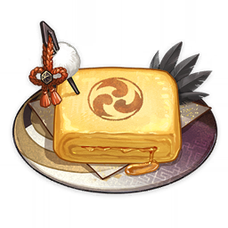

# 九条裟罗

## 角色-资料页

天领奉行的将领。行如风，言如誓，是位魄力过人的女性。  

她有着「神的笃信者」之名，将全部忠心都奉献给了雷电将军。  

将军所追求的「永恒」，也是她愿意为之而战的信念。

 

我将永远护卫稻妻、践行鸣神的意志。

若想与这些事物为敌，就要做好觉悟。

## 官方动态立绘介绍

**黑羽鸣镝 · 九条裟罗**

迅雷烈风，飞光万顷

「必须承认，九条裟罗小姐是位难缠的对手。我虽不认可她的立场，但她的忠义与赤诚之心实在令人钦佩…整座稻妻城里最敬爱将军之人，应该就是她了吧。」——珊瑚宫心海  

天领奉行现役大将。杀伐果断，骁勇善战。  

若说将军大人是高天之上的鸣雷，九条裟罗便是难以防备的闪电。闪电先行，尔后必有骇人雷鸣。  

身为九条家的养子，她向来以官方态度对外。「雷厉风行」、「不苟言笑」……人们对九条裟罗的印象大抵如此。  

然而，这位背负着臣子职责，以忠义为己任的战将并非外表所见那般冷漠，而是决意要让自身好恶悲喜为大义让步，才亲手选择了割舍一部分心灵。  

对她而言，辅助将军大人实现「永恒」才是最首要的。纵使知道终点不会有自己的身影，也在所不惜。  

——胜利将会属于我们所有人，哪怕战场上最后剩下的不是我也好。  

假如人只能有一个愿望，这便是九条裟罗的「愿望」。  

藏在她冷峻外表下的，是一颗炽热如暗火、跃动如幽雷的心。

---

链接：[黑羽鸣镝 · 九条裟罗 迅雷烈风，飞光万顷](https://t.bilibili.com/550227478610015153)

## 天赋

<table class="table-constellation-talent">
  <thead>
    <tr>
      <th class="th-constellation-talent" rowspan="2"></th>
        <th class="content-constellation-talent">
          

            

            鸦羽天狗霆雷召咒
            

            

            

            
              天狗一族不乏获取雷元素神之眼的异士。只不过他们操作雷元素时，仍会习惯性诵咒，礼赞雷神。咒曰：
                 
              <i>「礼赞鸣神大权现，善信某甲，请祈黄雷。娑婆诃！」</i>
            
          

        

      </th>
    </tr>
  </thead>
</table>

## 装扮-衣装

### 严正净衣

九条裟罗的装扮款式。洁净端正，足以面神的虔信者装束。

## 故事

### 角色故事1

在稻妻，「眼狩令」正是雷电将军追逐永恒的意志体现。而裟罗，便是执行「眼狩令」的主力。  

裟罗认为，若是让心术不正之人掌握「神之眼」的力量，稻妻的根基便会受到动摇。基于此点来看，「眼狩令」是必要的。  

然而这并不意味着裟罗会不择手段地推行法令。  

对于那些因执法需要而被无可避免地殃及的人民，她都投以最大的耐心与诚意，通过劝说来尝试让对方理解将军大人的长远布局。  

此外，她也明令禁止借执法之名伤害或戏弄平民的行为。堕落的恶行只会败坏神明的威望。  

但很可惜，神明的意志宏远，凡人轻易无法参透，难免生出憎恨，甚至会联合起来反抗执法者。  

遇到这种不得不动手的场合，裟罗便会带着一丝无奈、一声叹息，迎向敌人。

### 角色故事5

自从被收养，裟罗就与幕府军人们一同训练。将士们一度以为裟罗是个男孩，年纪轻轻便来军中锻炼，对她照顾有加。  

本有些畏惧人群的裟罗在周遭人们悉心照料下，变得胆子大了许多，敢和人往来，甚至会跟大家一起摸爬滚打玩耍。  

然而，与她嬉闹的士兵却遭到了家主大人重罚。裟罗自己也只得到了一句冷冷的训斥。  

「不守规矩，不学无术…收养你，可不是为了让你做这些无聊事情。」  

自那之后，裟罗便谨慎保持与他人的距离，比起融入人群，她首先得练出一身过人武艺，时刻以将领继位者的认知要求自己。  

「做雷电将军的帮手、做天领奉行的榜样、做家主大人的骄傲。」  

三个身份，全都不以自己为优先。但对裟罗来说，这就是她，一个务必保持冷静与严肃的军人。  

似乎从来没人说过她应当为自己多考虑些。裟罗也并不缺乏那样的关怀。  

与使命和身份相伴而来的，是身为养子的拘束与身为异类的孤独。

但因之停留是弱者的困境，既然身为九条裟罗，便不会止步于此。她是雷神最坚定的追随者，也是最为清醒的将领。

### 御建鸣神主尊大御所大人像

出于对雷电将军的供奉与爱戴，不少商铺都制作并推出了与雷电将军有关的工艺品。  

其中，以雷电将军本尊形象为模板制作的漆器人偶——「御建鸣神主尊大御所大人像」，是最受欢迎的高人气商品。  

发售当天，九条裟罗起了个大早，顺利排在了购买队伍的第一位。这件事一度成为热议话题。  

裟罗并未反驳。从她的角度来说，她确实是带着崇敬之心买下那些物品的。  

在将军的问题上，她从没有任何一丝敷衍与怠慢，特意亲身前往、亲自选购，买回神像后更是备了神龛妥善保存。  

她将五座「御建鸣神主尊大御所大人像」存放在定制的展柜中，在家时总要亲自擦拭，即便自己忙碌，也会安排匠人上门保养…  

对公务繁忙无瑕度过私人时光以至于密友并不很多的裟罗而言，雷电将军不止是一位神明，更是一种寄托。  

将军是意志、人望、力量…乃至命运的预兆，是一切崇高之志的交汇点。裟罗的追随，是源自认可与信任。  

精美的神像会让她感觉将军大人并非远在高不可攀的天守阁中，而是如智慧、意志以及顽强的心一般，支撑着自己走过每一段时光。

她享受这种难以言传的平静时刻。

### 神之眼

获得神之眼时，她还未被赐予名与姓。  

她原本栖居于一片平静的山林之中。不知从何时起，邪祟作乱，周遭安宁不再。  

虽有天狗之力，年幼的她却仍无力单独对抗魔物，更曾在战斗中被击落山崖，羽翼受损。  

她从高处坠落，受伤的翅膀无法张开，眼看就要绝望地摔落地面。  

「不应该是这样的！我本以为，凭我的能力，可以永远守护这片山林…」  

翌日清晨，路过山脚的居民发觉一个小女孩昏倒在路边。女孩模样有些狼狈，但周身毫发无损，竟不知为何躺倒在此。  

众人觉得惊奇，便带着她返回城中，即刻上报给天领奉行。  

九条家主九条孝行一见此女，便察觉到她手中那枚发光的物件是可遇而不可求的「神之眼」。  

如此年幼就已获得神明的注视，九条孝行认为，这个女孩便是上天赐予天领奉行的「命运」。  

他收养了女孩，赐名「裟罗」，培养她成为全能的战士，并要求她服从将军，为稻妻而战。  

九条孝行认为：若能培育出名将，九条家的地位与民望也将愈发稳固。一切也如他所想，稳步发展着。  

拥有「神之眼」力量的裟罗迅速崭露头角，年纪轻轻便不负众望成为天领奉行的大将。  

然而，正因为拥有神之眼，裟罗才比任何人都清楚，她之所以从高山上坠落还能毫发无伤，正是由于神在那一瞬间望见了她。  

一眼的注视，赐予她一生的力量。她所享有的一切，都可说是将军大人的垂怜。  

如果是为将军而战…  

裟罗认为，那不是命令，不是养父的计谋，而是她真心所向。

## 语音

<table class="table-audio">
        <thead>
            <tr>
                <th>场合</th>
                <th>台词</th>
            </tr>
        </thead>
        <tbody>
            <tr>
                <td>初次见面…</td>
                <td>
                    我的名字是九条裟罗，你记不住也无妨，只需知道：我将永远护卫稻妻、践行鸣神的意志，不论神鬼，遇敌必除！呼…别紧张，既然答应与你并肩，我自当尽心尽职。大义外的事情，我不会计较的。
                </td>
            </tr>
            <tr>
                <td>闲聊·永恒</td>
                <td>
                    为将军大人实现 「永恒」，这就是我的 「愿望」。
                </td>
            </tr>
            <tr>
                <td>打雷的时候…</td>
                <td>
                    听见了吗？鸣雷正是将军大人的意志。
                </td>
            </tr>
            <tr>
                <td class = "audio-tbale" >关于裟罗自己·天领奉行</td>
                <td>
                    家主于我有恩， 「天领奉行」是我唯一的依靠，我会倾尽一切来捍卫家族的荣誉。嗯？你问 「天领奉行」的行事准则？那自然是忠于雷电将军大人，这也是我九条裟罗此生唯一的信条。
                </td>
            </tr>
            <tr>
                <td>关于裟罗自己·愿望</td>
                <td>
                    我的愿望？我原以为你早已知道，辅佐将军大人实现 「永恒」就是我的愿望。嗯？为自己所想的愿望？这种东西，我没有想过…
                </td>
            </tr>
            <tr>
                <td>关于我们·观察</td>
                <td>
                    虽然你对于将军大人的 「永恒」而言是个 「不安定」的因素，但 「不安定」也未必代表 「阻碍」。我不会与你为敌，但，我会一直盯着你。
                </td>
            </tr>
            <tr>
                <td>关于我们·体会</td>
                <td>
                    收缴神之眼时，我漠视了人们的愿望。在眼狩令已然结束的当下，我有责任作出弥补。听说你能听见千手百眼神像上那些神之眼蕴含的愿望？请跟我好好讲讲吧。还有…也跟我说说你的愿望吧，我想知道。
                </td>
            </tr>
            <tr>
                <td>关于「神之眼」… </td>
                <td>
                    得到神明的注视，才能获得 「神之眼」。既然我的 「神之眼」是由将军大人所赐，最后，我也会将它还给将军大人，不怨不悔。
                </td>
            </tr>
            <tr>
                <td>有什么想要分享·特产</td>
                <td>
                    知道稻妻最具代表性的特产是什么吗？不对，并非刀具。是 「御建鸣神主尊大御所大人像」造型的漆器，由老练的漆器师傅手工打造，城内几乎每家每户都供奉着一座。我的屋里？有五座。
                </td>
            </tr>
            <tr>
                <td>感兴趣的见闻…</td>
                <td>
                    当我心中有难解之事时，我会伫立在神樱树下闭目养神，再次睁开眼时，飘落的花瓣就会为我指引方向。
                </td>
            </tr>
            <tr>
                <td>关于雷电将军·相信</td>
                <td>
                    你肯定从不少地方听说过吧？将军大人追求的是无念无执的永恒，舍弃尘世的执念，执着不变的永恒。将军大人的言行决断，我并非每一处都能参透。但既然这是她的决定，我便相信她。
                </td>
            </tr>
            <tr>
                <td >关于雷电将军·追随</td>
                <td>
                    「眼狩令」废除…嗯，看来你才是对的。咳…但这并不说明将军大人是错的。只是追求
                    「永恒」之路的方式将要改变罢了。不知那位千百年来守护着稻妻的将军大人，如今心中是否平静呢。我只知道，不管道路上有多少险阻，我都会一如既往追随她。
                </td>
            </tr>
            <tr>
                <td>关于八重神子…</td>
                <td>
                    八重宫司大人的所作所为，经常会让我产生误会…但她既然贵为鸣神大社的大巫女，不难得见将军大人对她的信任与默许，我自然也会敬重她。不过，如果哪天她做了忤逆将军意志的事情，那就恕我冒犯了。
                </td>
            </tr>
            <tr>
                <td>关于五郎…</td>
                <td>
                    他之于珊瑚宫心海，正如我之于将军大人。同为坚守忠义之人，我很欣赏他。只可惜立场不同，注定没办法同行。但有这样值得敬佩的对手，还不赖。而且， 「五郎」…可是个好名字。
                </td>
            </tr>
            <tr>
                <td>想要了解裟罗·其一</td>
                <td>
                    了解我…请问是指什么？天领奉行的各项事务均为机密，将军大人的事情更是无可奉告，我不明白你有什么意图。嗯？了解我本身？倒也并非不可，只是…从未遇过这种情况。
                </td>
            </tr>
            <tr>
                <td> 想要了解裟罗·其三</td>
                <td>
                    执行眼狩令的过程中，最令我感到棘手的，是那些顶着幕府军头衔动用私刑的官兵。将军大人的任务固然要坚定执行，但我决不允许他们滥伤无辜！我已经三申五令禁止这种行为，就结果而言…依然难以杜绝。你若是有什么好办法，还望赐教。
                </td>
            </tr>
            <tr>
                <td>讨厌的食物…</td>
                <td>
                    没有厌恶一说，只是我平日会避免吃甜食。问我原因吗？甜食会使人身心放松，一旦吃了就容易…呃，总之，我不能懈怠，话题到此结束，不要再追问了！
                </td>
            </tr>
            <tr>
                <td>生日…</td>
                <td>
                    来得正好，那我就免去礼节，直接问了。有什么生日愿望吗？只要不与将军大人的大义相悖，我都会竭尽全力帮你完成。为表诚意，今天你可以许五个生日愿望。
                </td>
            </tr>
            <tr>
                <td>元素爆发·其一</td>
                <td>
                    常道恢弘，鸣神永恒！
                </td>
            </tr>
        </tbody>
</table>

## 特色料理

### 永恒的信仰

<table class="table-foods">
  <thead>
    <tr>
      <th class="th-foods" rowspan="1">
        
      </th>
      <th class="content-foods">
        

          

            永恒的信仰
            

          

          

            
             九条裟罗的特色料理。与其说成菜肴，不如说是点心。甜蜜绵软的口味似乎与裟罗本人的喜好大不相同。等等，这上面的印记，莫非是与「那位大人」有关？
            
          

        

      </th>
    </tr>
  </thead>
</table>

## 生日

### 2022年

<table class="table-brithday">
    <thead>
        <tr>
            <th class="title-brithday"><a href="https://x.com/genshinimpact/status/1547430688634413056?s=46&t=y2nYs_BjV8zQF8CUr75yFA"><strong>Happy Birthday,Kujou Sara!</strong></a></th>
        </tr>
    </thead>
    <tbody>
            <tr>
                <td></td>
            </tr>
            <tr>
                <td>Sara, you can make five birthday wishes today! Do you have any wishes? Wish... All I "wish" is to serve under the command of the Almighty Shogun.</td>
            </tr>
            <tr>
                <td><strong>译文 : </strong> 裟罗，今天你可以许五个生日愿望！你有什么愿望吗？ 愿望……我唯一的“愿望”就是在至高无上的将军大人的麾下效力。</td>
            </tr>
    </tbody>
</table>

### 2023年

<table class="table-brithday">
    <thead>
        <tr>
            <th class="title-brithday">其五…</th>
        </tr>
    </thead>
    <tbody>
            <tr>
                <td>发件人：九条裟罗  下属们总劝我休息一日…说来也是，弓弦亦不可终日紧绷。 为执行最有效率的休憩，我拟定了五项日程，想邀你同行，也请你帮忙斟酌一二： 其一是供奉，完美的一日应从保养「御建鸣神主尊大御所大人像」开始； 其二是训练，适当的运动有助于舒缓精神； 其三是巡查，于稻麦街头视察，排除安全隐患； 其四是切磋，与你这样的强者过招总会令人畅快； 行文及此，才发现上述四条，与我平常的所做之事区别不大，似乎有悖初衷。 那么第五条就交予你决断吧——无论是去秋沙钱汤洗去切磋之疲惫，还是去乌有亭点上一桌酒菜，我定当随你左右，与你同行。  获得奖励：影打刀镡×5、破旧的刀镡×5、永恒的信仰×1</td>
            </tr>
    </tbody>
</table>

### 2024年

<table class="table-brithday">
    <thead>
        <tr>
            <th class="title-brithday">护弓…</th>
        </tr>
    </thead>
    <tbody>
            <tr>
                <td>发件人：九条裟罗  近日，幕府军天领奉行一部开始了为期半月的休整，我也空闲下来，得以深入养护常用的战弓。 稻妻的古话说「万物有灵」。弓道大师则会教导弟子:「拭弓护弦时，要将信念注入弓体之中。」 以往，我在战弓中倾注的信念是:「不负将军大人的期望，倾尽全力守护稻妻。」 如今稻妻诸事安定，我认为，我需要的新信念是「恒常精进」。为此，我需要见你——每分每刻都在变强的可敬武者。 有你在场，我护弓之时倾注的信念，定能达到无可挑剔的境地。 请在我养护战弓期间，与我对坐相谈。我定会准备丰厚的餐食，好好款待你。  获得奖励：「风雅」的指引×1、永恒的信仰×1</td>
            </tr>
    </tbody>
</table>

<table class="table-brithday">
    <thead>
        <tr>
            <th class="title-brithday"><a href="https://www.miyoushe.com/ys/article/55093376"><strong>「偶尔破例吧！」</strong></a></th>
        </tr>
    </thead>
    <tbody>
            <tr>
                <td></td>
            </tr>
            <tr>
                <td></td>
            </tr>
            <tr>
                <td>「去吃宵夜？不是不行，但已经过了用餐的时间…」 「我们听说…出了将军大人的概念套餐——」</td>
            </tr>
    </tbody>
</table>

### 2025年

<table class="table-brithday">
    <thead>
        <tr>
            <th class="title-brithday">点拨…</th>
        </tr>
    </thead>
    <tbody>
            <tr>
                <td>发件人：九条裟罗  承蒙珊瑚宫军师此前相邀，近期幕府军内事务稍缓，得暇赴海祇岛一游。此行未以天领奉行之职示人，仅作寻常旅者游览。 海祇风光确如传闻般奇绝，令人心爽神怡。渔夫邀我同乘小船采珠，老妪赠我新编的珊瑚手串，孩童赤脚追着浪花嬉闹，将拾到的鳅鳅宝玉递进我手心…但因缺乏类似经历，除却道谢之语，我并不知晓应当如何回应民众白浪般盛情。当以摩拉回报？或用礼品回赠？此事属实失算。 听闻你在海祇岛的事迹，想来亦熟知此地风土人情，若得点拨，将来再游海祇或能少些局促。  获得奖励：珊瑚真珠×10、永恒的信仰×1</td>
            </tr>
    </tbody>
</table>

<table class="table-brithday">
    <thead>
        <tr>
            <th style="text-align: center;"><a href="https://www.miyoushe.com/ys/article/66393129"><strong>漆器不比石雕，需要定期养护才可保持漆面色泽</strong></a></th>
        </tr>
    </thead>
    <tbody>
            <tr>
                <td></td>
            </tr>
            <tr>
                <td>每年今日，我都会把这五座「御建鸣神主尊大御所大人像」请出来擦拭一番。 漆器不比石雕，需要定期养护才可保持漆面色泽。 还需注意存放处的湿度与温度，不然木料也会变软受潮。 麻烦？当然不会。每年能这样和五座「御建鸣神主尊大御所大人像」一起度过生日，我很满足。</td>
            </tr>
    </tbody>
</table>

## 活动-角色介绍

天领奉行现役大将。杀伐果断，骁勇善战。

若说将军大人是高天之上的鸣雷，九条裟罗便是难以防备的闪电。闪电先行，尔后必有骇人雷鸣。

作为九条家的养子，雷厉风行、不苟言笑…人们对九条裟罗的印象大抵如此。

对她而言，辅助将军大人实现 「永恒」才是最首要的。纵使知道终点不会有自己的身影，也在所不惜。

