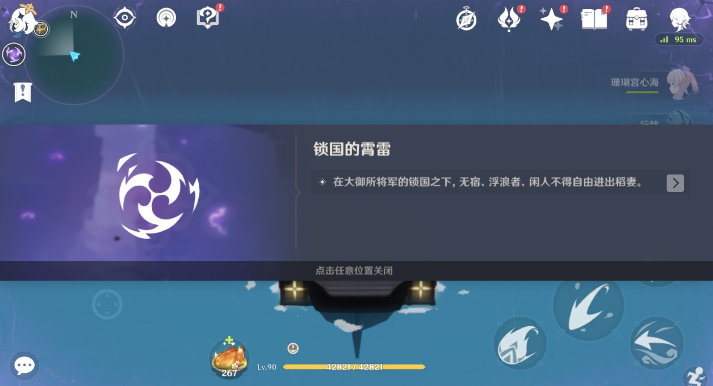

# 地图文本

## 神无冢-踏鞴砂 记事

### 记事

（似乎是最近被搜刮的愚人众翻出来的记事。大抵是搜刮时过于粗暴，不少地方被撕破了，难以解读。）

「…撤离时，原本应当将兵库钥匙分为三片，一片交予目付大人、一片交予造兵司正大人、一片留在踏鞴砂中，以防贼人侵入。」

「然而实在太过匆忙，无法找到目付大人与造兵司正大人，小人斗胆将三片钥匙藏在踏鞴砂内三处宝箱中…」

---

### 有相当年头的记事

<table class="table-audio">
    <tbody>
        <tr>
            <td><strong>未完成3.3间章「倾落伽蓝」</strong></td>
            <td><strong>已完成3.3间章「倾落伽蓝」</strong></td>
        </tr>
        <tr>
            <td class="table-td-sp">
                （似乎是最近被搜刮的愚人众翻出来的记事。因为年岁，大部分文本已经无法辨识了。） 「…终于造出长卷一柄。名之曰『大踏鞴长正』…」 「…目付大人兴致相当高昂，与造兵司佑大人…」 「…阿望为『大踏鞴长正』之美所服，为之绘制图画…」 「…同浮浪倾奇者剑舞…」
            </td>
            <td class="table-td-sp">（似乎是最近被搜刮的愚人众翻出来的记事。因为年岁，大部分文本已经无法辨识了。） 「…终于造出长卷一柄。名之曰『大踏鞴长正』…」 「…目付大人兴致相当高昂，与造兵司佑大人…」 「…阿望为『大踏鞴长正』之美所服，为之绘制图画…」
            </td>
        </tr>
    </tbody>
</table>

---

### 有相当年头的记事

<table class="table-audio">
    <tbody>
        <tr>
            <td><strong>未完成3.3间章「倾落伽蓝」</strong></td>
            <td><strong>已完成3.3间章「倾落伽蓝」</strong></td>
        </tr>
        <tr>
            <td class="table-td-sp">
                （似乎是最近被搜刮的愚人众翻出来的记事。因为年岁，大部分文本已经无法辨识了。） 「…而倾奇者也不知所踪…」 「…目付大人震怒，斩桂木。入胴之深，此物是为大业物…并将亲造之长卷弃于踏鞴炉中…」 「…阿望实在不平、不忍，将全然熔毁的刀取出…严重烧伤…」 
            </td>
            <td class="table-td-sp">（似乎是最近被搜刮的愚人众翻出来的记事。因为年岁，大部分文本已经无法辨识了。）  「…目付大人震怒，斩桂木。入胴之深，此物是为大业物…并将亲造之长卷弃于踏鞴炉中…」 「…阿望实在不平、不忍，将全然熔毁的刀取出…严重烧伤…」
            </td>
        </tr>
    </tbody>
</table>

---

### 有相当年头的记事

（似乎是最近被搜刮的愚人众翻出来的记事。因为年岁，大部分文本已经无法辨识了。）

「…阿望于当夜殁…小人斗胆以为，桂木大人却有渎职，但所作所为均出自善心…」

---

### 有相当年头的记事

<table class="table-audio">
    <tbody>
        <tr>
            <td><strong>未完成3.3间章「倾落伽蓝」</strong></td>
            <td><strong>已完成3.3间章「倾落伽蓝」</strong></td>
        </tr>
        <tr>
            <td class="table-td-sp">
                （似乎是最近被搜刮的愚人众翻出来的记事。因为年岁，大部分文本已经无法辨识了。） 「…金次郎将长卷与阿望的图画藏于兵库中…」 「…长正虽严苛，却清明无比。虽清明，却同等不近人情。于氏名清白之爱执…然而之于我与踏鞴砂众杂户均不为其母千代之事所蔽，信赖长正…」 「…而我也不愿忘记与他一同造出『大踏鞴长正』之乐，与那夜无名倾奇者与桂木一同舞剑的快乐…」
            </td>
            <td class="table-td-sp">
                （似乎是最近被搜刮的愚人众翻出来的记事。因为年岁，大部分文本已经无法辨识了。） 「…金次郎将长卷与阿望的图画藏于兵库中…」 「…长正虽严苛，却清明无比。虽清明，却同等不近人情。于氏名清白之爱执…然而之于我与踏鞴砂众杂户均不为其母千代之事所蔽，信赖长正…」 「……而我也不愿忘记与他一同造出『大踏鞴长正』之乐……」
            </td>
        </tr>
    </tbody>
</table>

---

### 有相当年头的记事

（似乎是最近被搜刮的愚人众翻出来的记事。因为年岁，大部分文本已经无法辨识了。）

「…小人斗胆将熔毁长卷废渣与阿望所描画之图藏于兵库中…」

「…只期望目付大人有朝一日，能想起斩桂木大人前，为亲手锻成之刀欣喜的心情…」

---

### 有相当年头的记事

（似乎是最近被搜刮的愚人众翻出来的记事。因为年岁，大部分文本已经无法辨识了。）

「…目付大人购买玉钢锭若干…」

「…与造兵司佑大人、桂木大人彻夜讨论锻冶心得。」

---

### 有相当年头的记事

<table class="table-audio">
    <tbody>
        <tr>
            <td><strong>未完成3.3间章「倾落伽蓝」</strong></td>
            <td><strong>已完成3.3间章「倾落伽蓝」</strong></td>
        </tr>
        <tr>
            <td class="table-td-sp">
                （似乎是最近被搜刮的愚人众翻出来的记事。因为年岁，大部分文本已经无法辨识了。） 「…小人斗胆僭越，认为长正大人铸刀对他的心境颇有好处…」 「…对清洗『御舆』污名之执着，实在是损心耗力…」 「…另，桂木大人于名椎滩巡视时，发现无名倾奇者…」 
            </td>
            <td class="table-td-sp">
                （似乎是最近被搜刮的愚人众翻出来的记事。因为年岁，大部分文本已经无法辨识了。） 「…小人斗胆僭越，认为长正大人铸刀对他的心境颇有好处…」 「…对洗清『御舆』污名之执着，实在是损心耗力…」
            </td>
        </tr>
    </tbody>
</table>

## 八酝岛-名椎滩 海贼的日志

### 海贼的日志

（一本被泡坏的日志，但部分内容仍清晰可辨。）

「…权六郎也发誓不再回归部队了，等日子好过些，他就把老婆孩子也接来同住…」

「…真是好笑。明明不久前，我们还是剑拔弩张的敌人，为了彼此重视的大人物、虚假的『理念』而战…」

「…不再被繁杂的道德拘束，不再有等级和义务的羁绊。第一次呼吸到自由的空气，第一次获得自由的报酬…」

「…兄弟们，团结起来。即使将要面对雷电将军横断浪潮的刀锋…」

---

### 残缺的笔记

（被撕去大部分内容的笔记，看来海贼并不希望将它遗落外人手中。）

「…鬼隆大叔出航送走了一个女人。据她说岛内的情况很不乐观…」

「…昨夜大雷雨，一艘船搁浅了。珊瑚宫的船，伤得很重…」

「…看来幕府方赢了昨晚的海战。所谓鹬蚌相争，渔翁得利…」

「…破船上有一个难缠的武士，我们死了几个兄弟。就连阿介也…绝对不能放过他…」

---

### 海贼的日志

（破旧的日志，看起来已经用了很久，纸张上布满了风霜的痕迹。）

「…来了一个矿工，看起来惨透了。让他留在这里休养了几天，恢复得还不错…」

「…他的妻子和儿子似乎还在岛上，但他拒绝了我们帮助寻找的建议，道完谢就走了。真是怪人…」

「…高野兄弟高烧不退，又有许多人半夜被噩梦魇醒。大家精神都不太好，是季节的原因吗…」

---

### 海贼的日志

（上了年头的航海日志，已经破破烂烂、濒临解体了。）

「…鬼隆大叔那边要送人去须弥…各砦需要尽快凑齐盘缠…」

「…东边海域前阵子刚发生了海战，或许是拾荒和趁火打劫的好时机…」

「…祝愿鬼隆大叔此行一帆风顺…就算离弃将军的我们，已经无神可以祷告了…」

---

### 海贼的日志

（皱巴巴的字条，其上字迹粗枝大叶。）

「…那个叫长次的男娃娃，多少算是一个托付吧，鬼隆大叔起航前交待我们照顾好他…」

「…等解决了破船上的那个混蛋武士，就把他接过来好了。」

「…母子分离，被迫孤零零过日子这种事，对小孩子来说也太残忍了…」

---

### 海贼的日志

（看起来比较新的日志，像是从谁身上取得的战利品。）

「…岛上游荡的落单幕府武士已经基本都被解决了，我们得拿他们做个榜样，杀鸡儆猴…」

「…应该用他们的遗物标志我们的边界，好让幕府的混蛋不敢再接近我们…」

---

### 海贼的日志

（保存妥善的日志，有海风的气息。）

「…把两个幕府军的奸细捆起来丢进了海里，兄弟们应当有自觉，此处绝非安逸之地…」

「…应当重点抢劫外国人及其航船，能进入稻妻的外国人大多非常有钱且缺乏防范…」

「…这些人作为目标比幕府方海船更加理想…」

「…若幕府与珊瑚宫的战争持续，兄弟们一直保持如此趁火打劫之势，复兴五百年前大海贼百目鬼之盛世，则指日可待…」

## 八酝岛 遗落的文本

### 遗落的文本

「…八酝岛前线部队的畏战现象十分严峻，已经引起家主大人的严重关注…」

「…公子政仁大人曾来信具陈岛上『祟神』作乱之情状，但家主大人未尝动情，反而大发雷霆…」

「…因此遣我等前来督察岛上情况，而后以实情回报，慰勉公子政仁大人一鼓作气，直捣叛贼巢穴…」

「…否则，家主大人将考虑撤除公子政仁大人大将之职，以裟罗大人统管之。」

「…既已登岛，我等将继续南向，沿蛇骨所在扎营，见机而行。」

「…无明砦以南不远处似有海贼活动，稍后将安排搜查…」

---

「…从这里可以俯瞰整个名椎滩，有数个海贼窝点…远处的破船非常可疑，不论是窝藏赃物、藏匿逃兵盗匪，或是布下伏兵，都很有可能是理想的地点…

「…派遣铃野去探查了一番，并未发现任何异样。但似乎曾有人在破船里生活…海贼像野狗一样在附近逡巡，此地不可久留…」

「…接下来，我等将向西南前进。不久将在蛇神之首前扎营…沿途一旦遇见鼠窜的逃兵，必就地正法…」

「…自中午开始就在流鼻血，有头晕症状。如此软弱，实在有辱九条武士门风…」

「…金本回报说看见有小孩子在岛上活动…或许应该捉他来为我们带路…」

「…做了噩梦，梦见在西边海中的小岛被流沙淹没。很邪门…」

---

「…头很痛，尤其在晚上，痛到头几乎要裂开。一些队员开始咳血，每晚都在做噩梦…」

「…皮肤起了疹子，胸腔里有刺痒潮湿的感觉…必须回禀家主大人，『祟神』之事绝非妄谈…」

「…蛇神的头骨狰狞地盯着我们，它的残魂依旧憎恨着胜者的子民。必须尽快离开此处，否则后果难以设想…」

「…我等将转向北方，前往绯木村附近…」

「…从绯木村的山崖或许能看清西北方海中的海贼活动…」

「…望谨记家主大人口谕 : 所谓兵贵神速，岛上若有逃难病患，不可宽宥，速速诱之集聚渡口，半途沉其船。问则称叛军为之，以免小小『祟神』扰乱将军殿下之天领…」

---

「西边的海域，小岛上闪烁着光芒…或许是走私犯的赃物…」

「…绯木村的情况很不妙，权五左卫门是我等当中剑术最强的，身体也还算健康…」

「…因此派遣他去逼问村长有无包藏逃兵…至今未归…派遣山田前往警告…」

「…再等半个时辰，若还未见人，便视该村为协助叛贼，即刻处置…」

「…村里来了很多人，村长不在他们中间，气氛不太对——」

（文字在这里中断了。）

---

「…牙齿一颗，两颗，三颗…流出了黑色的东西…」

「…黑色的海浪…宝物在这里…很痒，非常痒…」

「…金本赌输了…铃野的刀还在…我还有食物…」

「…脑袋里很痒…我不要耳朵在脑袋里面生长，不要听『他』的声音…」

「…对不起，家主大人…宝物是我的…」

「…『他』的呢喃中，我在融化…」

## 八酝岛-磐柱旁 日志

### 守备日志残页

天气晴朗，海风舒适…

…在这样鸟不拉屎的地方值守，真是倒了大霉！听说此次调动是出于八重神子大人的请求。但我们毕竟是天领奉行的武士，不是大社的看守！哪怕贵为神子大人的她比我们的九条大人还高上一头，如此逾矩的行为亦是不可理喻…

…不过新发的装备不错，笔记本也是防水的…

…

…天气阴翳，风雨将至…

…鸣神岛来的阴阳师们举行了例行的维护仪式，临走前给我们分了许多绯樱饼作为谢礼，是神里家的做法，很好吃…

…三法师也到了长牙的年纪了，真想给他做一些甜点，不知道现在学还是否来得及…

…平太说在西边的海滩发现异动，或许是海乱鬼。珊瑚宫那群家伙真是软弱，竟任由小小的海贼在西部海域乱窜。虽说和平共处已久，也不该如此懈怠啊…

…

…

…雷雨…

…不知怎么的，今天下了场豪雨，到处电闪雷鸣，也分不清白天黑夜…

…雷鸣中有隐隐凄烈之声，怪吓人的…

蜂野老爷子说是大御所大人在发怒，一派胡言。稻妻全土一片安宁，大御所大人有何理由震怒？…

…平太不见了，到处都找不到。等雨停了一定要好好惩罚他…

…雨中有奇怪的火光…

【内容在此处结束了】

---

### 湿皱的字条

…小队机密，不得遗失，否则责任自负…

阶段一 : 以多日研习之战术，雨夜突击幕府兵士，换装获其舟船物资…

阶段二 : 以内森先生所言方法，破袭幕府镇压之物，复我大御神之尊严…

阶段三 : 不顺则为大御神效死，顺则全身而退。然绝不可暴露身份，连累现人神巫女大人…

…以上所言，上至现人神巫女大人，下至各番队同袍，皆无可透露！多言者自负责任…

---

### 紧急通知！！

紧急通知！！

八酝岛遭遇敌袭！

蛇骨矿洞所有工人请尽快有序撤离！！

若路遇似珊瑚宫来者或形迹可疑人士，请紧急回避，择机报告！！

---

### 随身记事本

小队只剩下我一个了，我决定不再回去…

…什么都知道的望月小姐，真希望你能见证这无明之境的胜景…

…你所未曾知道的东西，你所不屑相信的东西，都在这里，闪闪发亮…

…只是对不起，望月小姐，对不起。我无法亲口向你重述了…

…这里很冷，太冷了…

…「他」也冷…

…对不起…

## 八酝岛 潦草的笔记

### 潦草的笔记

（字迹潦草的笔记，内容写得满满当当，但许多字迹几乎相互重叠，难以识读。）

「…此处的机关十分精巧，或许其下埋藏着传说中『海坊主』的遗物，也未可知…」

「…假如能够取得…将会是该国历史的一大发现。可惜稻妻人并不珍惜过去…」

「…接下来在稻妻列岛多加探索，希望在勘定方的『特别文牒』过期前，能够写出合格的论文…」

---

（字迹潦草的笔记，字缝里也写满了字。写作能力有限的作者最喜欢如此堆砌内容。）

「…今天早上流了鼻血，这里空气中元素浓度很高…但令人不适的是另一些东西…」

「当地人称之为『祟神』，实质上是某种魔神碎片…帮助那位梶先生鉴定了几座石灯，似乎那些石灯可以对空气中的『祟神』起到中和作用…」

「…但研究的重点还是这些机关…只要能够在此处拿出成绩，或许可以说服教令院开设『妖怪学』科目…」

---

（字迹潦草的笔记，不仅满篇都是文字，难得的空隙也被歪歪扭扭的图表占据了。即使是外行人也能体会到作者思维的混乱。）

「…一筹莫展，虽然寻找到许多迹象…但学问不能仅靠『迹象』来论证…」

「…况且雷电将军与蛇神的遗物气息太过强烈，掩盖了另一些很可能属于『海坊主』的痕迹…」

「…此前在稻妻民间搜集的妖怪故事…尚未得到证实…」

「…真是头疼，此前为了向勘定奉行讨要文牒，预算已经见底了，再没有进展可就麻烦了…」

## 八酝岛 通知

### 幕府军传单

居民请勿慌张，九条天领奉行孝行大人深感八酝岛难民切肤之痛，特来拯救。

若急需救助，请速来九条军前沿营地。

天领奉行定当护送诸位安全离开本岛。

---

### 蛇骨矿洞通知单

紧急！！

近日祟神作乱全岛，又有珊瑚宫叛军进犯。

矿工、家属等诸君请尽快有序撤离本岛！！

性命攸关，十万火急！

居民请勿慌张，九条天领奉行孝行大人深感八酝岛难民切肤之痛，特来拯救。

若急需救助，请速来九条军前沿营地。

天领奉行定当护送诸位安全离开本岛。

---

### 蛇骨矿洞通知单

尚留在岛上的诸君，请睁眼看看吧！

大御所殿下既然神威难敌，何不亲自面对你们的质询？

为何要令年轻人为她送死，放任凡人自相荼毒？

看看吧，你们的大御所殿下被蒙蔽了，她何时关心过你们的境遇？

我们是「眼狩令」的受难者，与你们同样遭受着乱世的挫折！

同为兄弟姐妹，请务必与我们携手！勇敢向大御所殿下发自己的谏言！

---

### 工友的书信

「…并没有找到人，只找到了一把断镐。希望大姐能节哀顺变…」

「…大木叔和我们凑了足够的钱来安排此事，但既然大姐执意拒绝，这些钱便请用作生活费吧…」

「…长次还在长身体，大姐你承担了矿上的工作，也需要多多休养，请莫要推辞…」

## 海祇岛 学者的笔记

### 学者的笔记

「这确实是个有意思的遗迹机关…」

「…对每一个立方，将方向和数字一一对应，北为一，东为二，南为三，西为四…」

「…顶上带有悬浮石板的几个立方额外加四，可以得到五到八…」

「…唯一空着的一处视作九，就可以转化为一个数字不重复的九宫格谜题… 」

「…石块的亮光？似乎没有太大意义。那么…」

「用横列、竖列、斜列之和全部相等的目标条件代入一下的话…」

「解开了！又可以在论文上添一笔了…」

「…接下来继续往西边去看看有没有别的遗迹吧。」

---

「…这处遗迹在风格上与魔神战争时代古建筑相近，但仍有待进一步研究…」

「…只是目前的课题或许不会给我时间在这里多做停留，实是可惜…」

---

「…这处神龛所在的小小石崖是一处观景胜地，附近的石碑有待进一步观察…」

「…在鸟居前观看落日，有一种令人心情宁静的感觉…」

---

「…此处的营地已经被废弃了，我翻走了些有用的东西…」

「…反正被我妥善利用，总比留在这里发霉好，嘿嘿…」

---

「…雷神的祭坛在海祇岛上往往不会受到妥善对待，此处也是同样…」

「…附近并没有更多鸣神岛文化相关的遗迹，较为缺乏研究价值…」

## 龙脊雪山 漂流瓶

「如果您读到这条信息的话，希望您是我所期待的那个人。」

「我们曾以为战争只是童话和传说里才会发生的事，但如今，我们每个人都在大御所大人的雷霆震怒之下战栗。」

「我们常去的那片海滩被封闭了，但我还是想办法投出了这封信。」

「请不要为此担心责备。对于曾和你一同冒险的我来说，这种小事轻而易举。」

「我等待着你的回信，哪怕只有一句话也好。」

## 大世界特殊环境 锁国的霄雷

> 在大御所将军的锁国之下，无宿、浮浪者、闲人不得自由进出稻妻。

::: details 游戏截图

:::

## 鸣神岛-鸣神大社「御神签箱」

### 第一次在鸣神大社求签时触发对话

玄冬林檎 : 你要求签？

派蒙 : 呜哇，好冷淡。

旅行者 : 我想求签…

玄冬林檎 : 明白了。流程是这样的。首先请你用力摇晃这个什么东西。

旅行者 : 记得是叫「御神签箱」…

玄冬林檎 : 没错。从里面会掉出一根竹签。把这根竹签给我，我会给你对应的纸片儿。

旅行者 : 好像叫「御神签」来着…

玄冬林檎 : 这种事情怎样都好吧。

派蒙 : 我有问题！如果说，如果说我们抽到了凶签，要怎么办呢？

玄冬林檎 : 是命运让你抽到凶签，你还想怎样？啊？

派蒙 : 欸！

旅行者 : 外头那个像架子的东西…

玄冬林檎 : 啧。

派蒙 : 她很露骨地「啧」了耶！

玄冬林檎 : 我看看…是这样的。「把凶签捆到『御签挂』上，就可以逢凶化吉」。

玄冬林檎 : 啊，对哦！如果你抽到凶签，把它捆到那个架子上就行了嘛。

玄冬林檎 : 他们还真是…不对，我们「鸣神大社」很温柔的。所以就算抽到了凶签，也会给你们转运的机会。

派蒙 : 虽然感觉哪里好像怪怪的…

派蒙 : 旅行者，我们求签吧！

玄冬林檎 : 把竹签交出来。

旅行者 : 好、好的。

派蒙 : 神社真是个不讲情面的地方…

玄冬林檎 : 给你。

派蒙 : 唔呣，看看运势吧。

玄冬林檎 : 对了。每天只能求一次签，这点请你记住。

玄冬林檎 : 不然我会很累…不对，不然御签挂会挂不下…也不是，应该怎么说来着？

玄冬林檎 : 「御神签是神明意志的体现。所以要尊重神明的意志，并且尽人所能及之力。」

玄冬林檎 : 你看，写得真好。所以每天只能求一次签，记好了。

<ul class="colored-list">
    <li>
        「大吉」
         
        派蒙 : 我瞧瞧我瞧瞧…
         
        派蒙 : 哇！写着「大吉」耶！
         
        派蒙 : 看来今天是派蒙的幸运日！
         
        旅行者 : 你的？
         
        派蒙 : 没错！你的幸福就是派蒙的幸福呀！所以反过来说，派蒙幸福，你也幸福。
         
        派蒙 : 我吃到好吃的就会幸福。所以，为了你自己的幸福，请给我吃好吃的。
    </li>
    <li>
        「凶」
         
        派蒙 : 我瞧瞧我瞧瞧…
         
        派蒙 : 欸，是「凶」！
         
        派蒙 : 这种情况我记得！是说…「把凶签捆到『御签挂』上。」
         
        派蒙 : 「然后请派蒙吃好吃的，就可以逢凶化吉。」
         
        旅行者 : 是这样喔？
         
        派蒙 : 当然了！你要质疑古人的智慧吗？
         
        派蒙 : 古人的智慧真了不起哪！总之，先找找御签挂吧！
    </li>
    <li>
        其他
         
        派蒙 : 我瞧瞧我瞧瞧…
         
        派蒙 : 嗯，还不错嘛。
         
        派蒙 : 和派蒙在一起，一定会幸运的！
    </li>
</ul>

 

---

### 常规在鸣神大社求签

`每日第一次求签`

<ul class="colored-list">
    <li>
        「御神签箱」
         
        （确实记得说求签的流程是…每天有一次机会，从「御神签箱」中摇出竹签，再向玄冬小姐换取「御神签」。要摇竹签，看看今日的运势吗？）
        <ul class="colored-list">
            <li>
                旅行者 : 求签吧。 
                （拿起了签筒…） 
                成功抽到一支签，快去解签吧。 
                <ul class="colored-list">
                    <li>
                        「御签挂」 
                        （如果抽到了「凶」和「大凶」，结在这里就可以逢凶化吉。） 
                        旅行者 : 挂起来吧。/ 我没什么所谓。 
                    </li>
                </ul>
            </li>
            <li>
                旅行者 : 下次再说吧… 
                （放下了签筒…）
            </li>
        </ul>
    </li>
</ul>

 

`再次求签`

<ul class="colored-list">
    <li>
        「御神签箱」
         
        （确实记得说求签的流程是…每天有一次机会，从「御神签箱」中摇出竹签，再向玄冬小姐换取「御神签」。） 
        （今天已经摇过了。明天再来看看吧…）
    </li>
</ul>

## 八酝岛 神龛

<ul class="colored-list">
    <li>
        神龛 : （看起来很普通的神龛，并没有任何奇特的元素痕迹。） 
        神龛 : （这座神龛看起来状态良好，似乎不久前才被精心照料过。打理这里的，或许是一个细心的人。） 
        神龛 : （但除此之外，并没有谁来过的痕迹。） 
        派蒙 : 奇怪呢…好像有人来过。
    </li>
</ul>

 

<ul class="colored-list">
    <li>
        派蒙 : 这里也有一座神龛，我们去看看吧？ 
        神龛 : （看起来很普通的神龛，并没有任何奇特的元素痕迹。） 
        神龛 : （这座神龛看起来干净整洁，散发着淡淡的神樱香气。或许不久前有人在此处祈祷过。） 
        神龛 : （但除此之外，并没有更新近的痕迹。） 
        派蒙 : 是神樱花瓣的气味呢…长次的妈妈或许来过！ 
        派蒙 : 而且一定是不久前！
    </li>
</ul>

 

<ul class="colored-list">
    <li>
        派蒙 : 这座神龛看起来好新，我们调查一下吧！ 
        神龛 : （看起来很普通的神龛，并没有任何奇特的元素痕迹。） 
        神龛 : （这座神龛木料稍旧，但良好的维护使外表暗淡的颜色也不显得破败，反而更有韵味。） 
        派蒙 : 似乎有人经常来这里…经常照顾这座神龛呢。
    </li>
</ul>

 

<ul class="colored-list">
    <li>
        派蒙 : 这就是长次所说的神龛了吧？ 
        神龛 : （看起来很普通的神龛，并没有任何奇特的元素痕迹。） 
        神龛 : （这座神龛朴素却优雅，木造的龛体微微闪烁着流光，以端庄的沉默迎接来客的供奉。） 
        神龛 : （神龛旁边散落着许多神樱花瓣，看起来不像是自然所成，却像是有人特意在这里洒下了绯樱绣球。） 
        派蒙 : 唔…这里也没有痕迹呢。 
        旅行者 : 看，绯樱绣球… / 是长次妈妈的供品… 
        派蒙 : 对哦，长次提到过他妈妈会在神龛供奉这个的！ 
        派蒙 : 这么多花瓣出现在这里…应该不会是偶然。 
        派蒙 : 我们快回去告诉他吧！
    </li>
</ul>

 

<ul class="colored-list">
    <li>
        派蒙 : 这里也有神龛呢，看起来好眼熟！ 
        神龛 : （看起来很普通的神龛，并没有任何奇特的元素痕迹。） 
        神龛 : （这座神龛看起来略显破败，木造的外壳已经坑坑洼洼、有所褪色，局部显露出凶险的暗红色痕迹。） 
        派蒙 : 这个神龛…怪可怕的，我鸡皮疙瘩都要起来了… 
        派蒙 : 我们离开这里吧！
    </li>
</ul>

## 八酝岛 墓碑

简朴的墓碑 : （由军人之手简单削凿而成、静静伫立的石碑，简朴却庄重）

<ul class="colored-list">
    <li>
        简朴的墓碑 : 「长野重秀，阿初」 
        简朴的墓碑 : 「在此地与恋人作别，在此处与恋人重聚。」
    </li>
</ul>

<ul class="colored-list">
    <li>
        简朴的墓碑 : 「前贺权兵卫」 
        简朴的墓碑 : 「爱听夜鸭鸣叫的爱哭鬼。」
    </li>
</ul>

<ul class="colored-list">
    <li>
        简朴的墓碑 : 「秋野英树」 
        简朴的墓碑 : 「『请原谅爸爸。』」
    </li>
</ul>

<ul class="colored-list">
    <li>
        简朴的墓碑 : 「菊千代」 
        简朴的墓碑 : 「永远的渔民之女，永远的武士。」
    </li>
</ul>

<ul class="colored-list">
    <li>
        简朴的墓碑 : 「胜真一郎」 
        简朴的墓碑 : 「如露降临，如雾散灭，喜乐苦楚，皆梦中之梦。」
    </li>
</ul>

<ul class="colored-list">
    <li>
        简朴的墓碑 : 「和田信刚」 
        简朴的墓碑 : 「『过路人请莫要致哀。战死并非光荣，不过是没能活下去的无能。』」
    </li>
</ul>

派蒙 : 唔…似乎是战死者的墓碑呢。

派蒙 : 孤零零地太可怜了…我们在墓前放些鲜花吧？

旅行者 : （放置血斛）

## 八酝岛 鹫津-残缺的名册

（一本残缺的名册，似乎曾是村长手边的记事帐。）

「绯木村村民名册 : 」

「…虎次郎，13岁，病歿；新司，32岁，病歿；美代，25岁，病歿…」

「…银，12岁，病歿；孝也，55岁，病歿；长渊，42岁，病歿；绘里，43岁，病歿…」

「…江下家三兄弟，战死；北田，27岁，幕府追逃；良子，36岁，病歿；津子，18岁，坠海…」

「…无名过客甲，祭献；权五左卫门，约30岁（？），祭献；山田，23岁，祭献…」

「…千代，4岁，归一；千代母，约25岁（？），偕同归一；英明，23岁，受召…」

「…以上人等，遗留财产存贮此处，用以为诱饵，为『他』的回归吸引生祭…」

「…长次母，约32岁（？），失踪。此人为『他』所喜悦，必寻获之…」

「…无名外国人，状似少年，即将诱获…」

## 海祇岛 石碑

[↗️海祇岛-世界任务「月浴之渊」](../03%20任务相关文本/3.5.18%20月浴之渊.md)

## 空之神殿 「三略卷」

「三略卷」 : 「据说是稻妻的天狗教人修习剑术的阵法。看不懂，感觉更像是什么奇怪的障眼法。」

「三略卷」 : 「上面好像还刻了个叫『光代』的名字。兴邦说他没听说过叫这个名字的天狗，可能是什么人乱刻的吧。」

