# 图鉴-生物志

## 敌人与魔物

### 元素生命

<table class="table-moster">
  <thead>
    <tr>
      <th class="th-moster" rowspan="2"></th>
      <th  class="content-moster">
      

            

        雷史莱姆
         

            

            

            
            圆滚滚的元素之力
              
            逸散在自然之中的雷元素凝聚形成的小小魔物，能够放出微弱的电力。
             
            根据分析，雷史莱姆蹦蹦跳跳的运动方式能反映地面上的电势差。在雷元素极其丰沛的地方，可以通过观察雷史莱姆的异常运动，避开危险。
            
            

        

      </th>
    </tr>
  </thead>
</table>

<table  class="table-moster">
  <thead>
    <tr>
      <th class="th-moster" rowspan="2"></th>
      <th  class="content-moster">
      

            

        大型雷史莱姆
         

            

            

            
            圆滚滚的元素之力
              
            逸散在自然之中的雷元素凝聚形成的魔物。
             
            因为体内充沛的雷元素，会间歇性向周围放电。目前，已经有人开始尝试利用这种能量去进行有益的生产活动了，新的学科或许不日也将应运而生…？
            

        

      </th>
    </tr>
  </thead>
</table>

<table  class="table-moster">
  <thead>
    <tr>
      <th class="th-moster" rowspan="2"></th>
      <th  class="content-moster">
      

            

        变异雷史莱姆
        

            

            

            
            圆滚滚的元素之力
              
            逸散在自然之中的雷元素凝聚形成的魔物。
             
            雷史莱姆异变产生的，明黄色的史莱姆。因为体内充沛的雷元素，会间歇性向周围放电，并能向附近的雷史莱姆放出电弧；但紫色的雷史莱姆之间并不会通电。由此看来，雷史莱姆似乎具有两极。
             
            以此为基点，或许能成为某种伟大学科的开端…
            
            

        

      </th>
    </tr>
  </thead>
</table>

<table  class="table-moster">
  <thead>
    <tr>
      <th class="th-moster" rowspan="2"></th>
      <th  class="content-moster">
      

            

        雷音权现
        

            

            

            
            霆雷的忿恨意志
              
            异常的雷元素生命。虽然外貌上与纯水精灵有相似之处，却不具备她的智慧与记忆。
             
            驱动雷音权现的是更为原始纯粹的愤怒。
             
            据说这种生物只会随着雷霆降生在遗留着强大忿恨的地方，譬如说支离破碎、雷云黝黝的天云峠。只要土地中的怨恨不消，那雷鸣也不会断绝吧。
            

            忿恨的雷声具象而成的元素生命体，会运用雷鸣的攻击与探针锁定敌人。存在被锁定的对象时，雷音权现会进入狂怒状态，并优先歼灭被锁定的目标。
            
          

        

      </th>
    </tr>
  </thead>
</table>

 

### 深渊势力

<table  class="table-moster">
  <thead>
    <tr>
      <th class="th-moster" rowspan="2">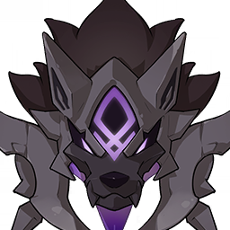</th>
      <th  class="content-moster">
      

            

        嗜雷·兽境幼兽
        

            

            

            
            隙间侵入的异兽
              
            能够侵蚀世界边界的魔血之兽。「黄金」将其命名为「淋溶」。
             
            曾经的年代里，巨大的魔兽降临之时，会有大量猎犬提前显现，溶解世界的边界，打开通道。
            

            来自异界的魔物，具有侵蚀事物的能力。兽境幼兽的攻击会施加可叠加的「侵蚀」状态，使队伍中所有角色持续损失生命值。此外，承受对应的元素攻击后，兽境幼兽将进入「嗜魔」状态，以该元素抗性的降低为代价，变得极为凶猛。
            
            

        

      </th>
    </tr>
  </thead>
</table>

<table  class="table-moster">
  <thead>
    <tr>
      <th class="th-moster" rowspan="2">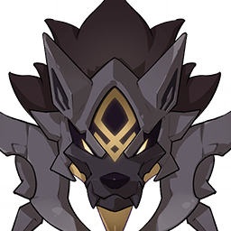</th>
      <th  class="content-moster">
      

            

        嗜岩·兽境幼兽
        

            

            

            
            隙间侵入的异兽
              
            能够侵蚀世界边界的魔血之兽。「黄金」将其命名为「淋溶」。
             
            有伴随渊薮的渗透，吞噬元素的习性。值得庆幸的是这些魔兽如今数量并不多。
            

            来自异界的魔物，具有侵蚀事物的能力。兽境幼兽的攻击会施加可叠加的「侵蚀」状态，使队伍中所有角色持续损失生命值。此外，承受对应的元素攻击后，兽境幼兽将进入「嗜魔」状态，以该元素抗性的降低为代价，变得极为凶猛。
            
          

        

      </th>
    </tr>
  </thead>
</table>

<table  class="table-moster">
  <thead>
    <tr>
      <th class="th-moster" rowspan="2">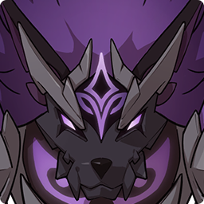</th>
      <th  class="content-moster">
      

            

        嗜雷·兽境猎犬
        

            

            

            
            隙间侵入的异兽
              
            能够侵蚀世界边界的魔血之兽。「黄金」的造物。
             
            曾经肆虐大陆，然后遭到反抗与猎捕而一度绝迹。但最近它们却又再度出现了。威胁到了清泉镇与奔狼领的黑狼之群，说的正是它们。
            

            兽境幼兽的成年体…虽然看起来是这样，但这种魔物有没有自然成长的规律，迄今仍是谜团。兽境猎犬的攻击会施加可叠加的「侵蚀」状态，使队伍中所有角色持续损失生命值。此外，承受对应的元素攻击后，兽境猎犬将进入「嗜魔」状态，以该元素抗性的降低为代价，变得极为凶猛。
            
          

        

      </th>
    </tr>
  </thead>
</table>

<table  class="table-moster">
  <thead>
    <tr>
      <th class="th-moster" rowspan="2">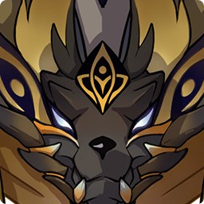</th>
      <th  class="content-moster">
      

            

        嗜岩·兽境猎犬
        

            

            

            
            隙间侵入的异兽
              
            能够侵蚀世界边界的魔血之兽。「黄金」的造物。
             
            会很微妙地表现出生物习性，就如同真正的狼一般。或许是对地上的「近亲」抱有仰慕或嫉妒的感情，而梦想取而代之吧。
            

            兽境幼兽的成年体…虽然看起来是这样，但这种魔物有没有自然成长的规律，迄今仍是谜团。兽境猎犬的攻击会施加可叠加的「侵蚀」状态，使队伍中所有角色持续损失生命值。此外，承受对应的元素攻击后，兽境猎犬将进入「嗜魔」状态，以该元素抗性的降低为代价，变得极为凶猛。
            
          

        

      </th>
    </tr>
  </thead>
</table>

<table  class="table-moster">
  <thead>
    <tr>
      <th class="th-moster" rowspan="2"></th>
      <th  class="content-moster">
      

            

        黄金王兽
        

            

            

            
            无名的兽境之王
              
            来自晦暗的异界，是漆黑群狼之中的王，具有号令隐爪之异兽为它溶解空间，创造通行的裂隙的权能。
             
            王兽并没有名字，因为本身不过是「黄金」无心的造物；正因如此，才会更执着于侵入不属于它的世界，以自己的力量争取名号吧。
             
            但狼群绝非痴钝之物。此前的入侵受挫后，选择了既无人、也无守护者的荒凉远岛，为王兽的降临做准备。
            

            兽境群狼之王。黄金王兽的攻击会施加可叠加的「侵蚀」状态，使队伍中所有角色持续损失生命值。在战斗中，黄金王兽会召唤「兽境犬首」，为自己赋予护罩并进入「嗜魔」状态，岩元素抗性降低的同时提高攻击能力。对兽境犬首进行岩元素攻击以快速破除黄金王兽的护罩。
            
          

        

      </th>
    </tr>
  </thead>
</table>

 

### 自律机关

<table  class="table-moster">
  <thead>
    <tr>
      <th class="th-moster" rowspan="2"></th>
      <th  class="content-moster">
      

            

        恒常机关阵列
        

            

            

            
            永续谐振
              
            诡谲的异形战斗机械。
             
            传说是已经覆灭的国度留下的战争机械。由若干部件构成，能够适应战斗的环境变换成不同形态，施展各种攻击手段。
             
            由立方体构成的形态在某个层面而言，与所谓的「无相元素」有着不少相似之处。
            

            能够变换组合成不同形态的谜样遗迹机关。在战斗中，恒常机关阵列会进入绝对防御状态，分裂并召唤数个形态各异的遗迹机兵。击败其中获得了强化的遗迹机兵后，它的绝对防御状态将解除，并进入虚弱状态。
            
          

        

      </th>
    </tr>
  </thead>
</table>

<table  class="table-moster">
  <thead>
    <tr>
      <th class="th-moster" rowspan="2"></th>
      <th  class="content-moster">
      

            

        魔偶剑鬼
        

            

            

            
            万般机巧·剑豪人形
              
            自律的人形机关剑士。
             
            似乎没有说话的能力与意愿，只愿意用剑沟通。
             
            据说在试作时，集成了某个剑道流派初代宗主的记忆，却又因为不明的原因而失控，最终被废弃了。
             
            根据歌人的描述，剑鬼会徘徊在因缘断绝的地方，而守护它的凶恶之面似乎取自那个时代有名的鬼人。
            

            能够变换组合成不同形态的谜样遗迹机关。在战斗中，恒常机关阵列会进入绝对防御状态，分裂并召唤数个形态各异的遗迹机兵。击败其中获得了强化的遗迹机兵后，它的绝对防御状态将解除，并进入虚弱状态。
            
          

        

      </th>
    </tr>
  </thead>
</table>

<table  class="table-moster">
  <thead>
    <tr>
      <th class="th-moster" rowspan="2">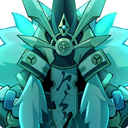</th>
      <th  class="content-moster">
      

            

        魔偶剑鬼·孤风
        

            

            

            
            如剑迅疾之风
              
        
        

        

      </th>
    </tr>
  </thead>
</table>

<table  class="table-moster">
  <thead>
    <tr>
      <th class="th-moster" rowspan="2">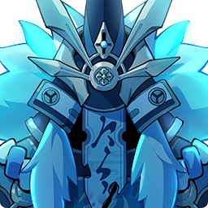</th>
      <th  class="content-moster">
      

            

        魔偶剑鬼·霜驰
        

            

            

            
            如剑刺骨之霜
              
        
        

        

      </th>
    </tr>
  </thead>
</table>

<table  class="table-moster">
  <thead>
    <tr>
      <th class="th-moster" rowspan="2"></th>
      <th  class="content-moster">
      

            

        魔偶剑鬼·凶面
        

            

            

            
            如业狰狞之相
              
        
        

        

      </th>
    </tr>
  </thead>
</table>

 

### 其他人类势力

<table class="table-moster">
  <thead>
    <tr>
      <th class="th-moster" rowspan="2"></th>
      <th  class="content-moster">
      

            

        野伏·阵刀番
       

            

            

            
            「剑舞文之助」
              
            落草为寇的流浪武人，虽然常被称为「野伏」，但并不隶属于某个统一的团体。
             
            作为常年行走在武道上的人，有着精湛的剑术，如今却不将其用于正道。
             
            为了生计与财富，有时候甚至会与盗宝团、愚人众沆瀣一气。
            
            

        

      </th>
    </tr>
  </thead>
</table>

<table class="table-moster">
  <thead>
    <tr>
      <th class="th-moster" rowspan="2">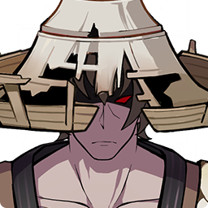</th>
      <th  class="content-moster">
      

            

        野伏·火付番
        

            

            

            
            「剑舞文之助」
              
            落草为寇的流浪武人，虽然常被称为「野伏」，但并不隶属于某个统一的团体。
             
            不仅掌握着精湛的剑术，还会使用具有元素的焰硝药粉攻击。从客观来说，或许这是背离武之道，转而寻求胜之途的体现吧。
             
            为了生计与财富，有时候甚至会与盗宝团、愚人众沆瀣一气。
            
            

        

      </th>
    </tr>
  </thead>
</table>

<table class="table-moster">
  <thead>
    <tr>
      <th class="th-moster" rowspan="2"></th>
      <th  class="content-moster">
      

            

        野伏·机巧番
        

            

            

            
            「剑舞文之助」
              
            落草为寇的流浪武人，虽然常被称为「野伏」，但并不隶属于某个统一的团体。
             
            除了作为武者必修的剑术之外，还会熟练地使用手弩偷袭对手，只要能够取胜便会不择手段。抛弃了武家之名的人，也常常会抛弃武家的自矜。
             
            为了生计与财富，有时候甚至会与盗宝团、愚人众沆瀣一气。
            
            

        

      </th>
    </tr>
  </thead>
</table>

<table class="table-moster">
  <thead>
    <tr>
      <th class="th-moster" rowspan="2">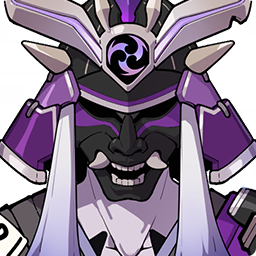</th>
      <th  class="content-moster">
      

            

        海乱鬼·雷腾
        

            

            

            
            「剑舞文之助」
              
            落草为寇的流浪武人。
             
            有着高强的武道修养，却因为种种原因而没有用武之地，走投无路中踏上了恶逆之道。会利用本应在数百年前失传的惟神技术制造的符纸，为刀剑附上雷霆的力量。
            
            

        

      </th>
    </tr>
  </thead>
</table>

<table class="table-moster">
  <thead>
    <tr>
      <th class="th-moster" rowspan="2">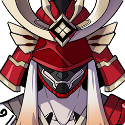</th>
      <th  class="content-moster">
      

            

        海乱鬼·炎威
        

            

            

            
            「剑舞文之助」
              
            落草为寇的流浪武人。
             
            自幼时便专注于武道从未懈怠，却因为种种原因失去了奉公的机会，背离了正道，走上恶逆之路。刀刃不似一般的钢铁那般冰冷，而是充满了忿恨的炽热怒火——似乎是利用了本应失传的惟神技术制造的符纸，为刀刃附上火焰。
            
            

        

      </th>
    </tr>
  </thead>
</table>

<table class="table-moster">
  <thead>
    <tr>
      <th class="th-moster" rowspan="2"></th>
      <th  class="content-moster">
      

            

        落武者·咒雷
        

            

            

            
            	瘴晦的雷之权现
              
            
            

        

      </th>
    </tr>
  </thead>
</table>

<table class="table-moster">
  <thead>
    <tr>
      <th class="th-moster" rowspan="2"></th>
      <th  class="content-moster">
      

            

        落武者·祟炎
        

            

            

            
            邪秽的火之权现
              
            
            

        

      </th>
    </tr>
  </thead>
</table>

<table class="table-moster">
  <thead>
    <tr>
      <th class="th-moster" rowspan="2"></th>
      <th  class="content-moster">
      

            

        「公义」
        

            

            

            
            海乱鬼 · 雷腾
              
            
            

        

      </th>
    </tr>
  </thead>
</table>

<table class="table-moster">
  <thead>
    <tr>
      <th class="th-moster" rowspan="2"></th>
      <th  class="content-moster">
      

            

        帽子刀子狗子
        

            

            

            
            武士狗狗
              
            
            

        

      </th>
    </tr>
  </thead>
</table>

<table class="table-moster">
  <thead>
    <tr>
      <th class="th-moster" rowspan="2"></th>
      <th  class="content-moster">
      

            

        幕府足轻
        

            

            

            
            
            

        

      </th>
    </tr>
  </thead>
</table>

<table class="table-moster">
  <thead>
    <tr>
      <th class="th-moster" rowspan="2"></th>
      <th  class="content-moster">
      

            

        幕府足轻头
        

            

            

            
            
            

        

      </th>
    </tr>
  </thead>
</table>

<table class="table-moster">
  <thead>
    <tr>
      <th class="th-moster" rowspan="2"></th>
      <th  class="content-moster">
      

            

        珊瑚宫众
        

            

            

            
            
            

        

      </th>
    </tr>
  </thead>
</table>

<table class="table-moster">
  <thead>
    <tr>
      <th class="th-moster" rowspan="2">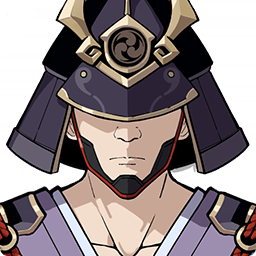</th>
      <th  class="content-moster">
      

            

        寄骑武士
        

            

            

            
            
            

        

      </th>
    </tr>
  </thead>
</table>

 

### 异种魔兽

<table class="table-moster">
  <thead>
    <tr>
      <th class="th-moster" rowspan="2">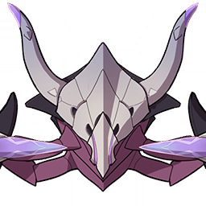</th>
      <th  class="content-moster">
      

            

        圣骸毒蝎
        

            

            

            
            啃噬伟大生命的雷之兽
              
            因为啃噬伟大的生命体，而扭曲异变的节肢动物。
             
            生物有其进化之法则，而圣骸兽的法则则是拥有足够的运气，能在同族之前发现在遥远过去就已亡殁的强大生灵遗骸。动物与人的共性往往比人所甘愿承认的更多。
            

            因为啃噬伟大的生命体，而扭曲异变的节肢动物。在战斗中，会进入强大的噬骸状态。它的一些攻击将排出噬骸能量块；利用对应的元素攻击破坏能量块，能够汲取其中的强大力量，并在攻击圣骸毒蝎时释放这些能量，造成可观的伤害，并使其暂时瘫痪。
            
            

        

      </th>
    </tr>
  </thead>
</table>

## 野生生物

### 禽鸟

<table class="table-moster">
  <thead>
    <tr>
      <th class="th-moster" rowspan="2"></th>
      <th  class="content-moster">
      

            

        菫鹮
        

            

            

            
            高贵优雅的鸟类，生着宽阔的双翼与修长的腿。
             
            长着堇色的美丽羽毛，喜欢沉静地漫步在溪流或稻田之中。在稻妻的古歌中称之为「里梅鸟」，曾经有着非常广泛的分布，但近来似乎越来越少见了。
            
            

        

      </th>
    </tr>
  </thead>
</table>

<table class="table-moster">
  <thead>
    <tr>
      <th class="th-moster" rowspan="2"></th>
      <th  class="content-moster">
      

            

        鸦
        

            

            

            
            漆黑的鸟类。
             
            黑色的羽毛深过提瓦特的长夜，数量多时盘旋在空中甚至会产生遮天蔽日的效果。 
            在部分民话中被视为厄运的征兆，而在另一些传说中却被当做带来吉祥的预言之鸟，「所谓民俗便是这样的东西。」  
            各地冒险家当中有一则传闻，说蒙德有一位调查员小姐养了一只巨大的会说话的乌鸦…？
            
            

        

      </th>
    </tr>
  </thead>
</table>

 

### 走兽

<table class="table-moster">
  <thead>
    <tr>
      <th class="th-moster" rowspan="2"></th>
      <th  class="content-moster">
      

            

        狐
        

            

            

            
            狡黠而高傲的生灵，在民话传说中拥有奇特的智慧与悠远的记忆。
             
            即便有生人靠近也不屑一顾的样子，似乎是已经习惯了与人类相处。
             
            在稻妻文化中有着悠久的历史渊源。有传说说它们是过去的「狐斋宫大人」的亲眷中的一支。在她消失后，力量更强的「天狐」与「地狐」都化作石像等待她的回归，而这些狐狸则随着一族的灵脉变得稀薄，而不再开口，也失去了法力。
            
            

        

      </th>
    </tr>
  </thead>
</table>

<table class="table-moster">
  <thead>
    <tr>
      <th class="th-moster" rowspan="2"></th>
      <th  class="content-moster">
      

            

        柴犬
        

            

            

            
            人类最好的朋友！
             
            传说是稻妻的将军曾经宠爱的犬类，随着一度兴盛的商业航道而走遍提瓦特七国，成为了提瓦特大陆上最受欢迎的宠物犬之一。脾气温柔忠厚，头脑聪明，尤其擅长看家护院与陪伴家人。传说在稻妻依然生活着将这种犬类训练成「忍犬」的神秘忍者。
            
            

        

      </th>
    </tr>
  </thead>
</table>

<table class="table-moster">
  <thead>
    <tr>
      <th class="th-moster" rowspan="2"></th>
      <th  class="content-moster">
      

            

        妖狸
        

            

            

            
            生性乐天、神出鬼没的狸，懂得只在一族中流传的法术。有着变化成其他物体，乃至于人类的能力。
             
            尽管经常会和某个隶属于幕府的神秘组织扯上关系，但狸子可没有那么多的坏心眼，捉弄人类也只是喜欢玩闹罢了。
             
            例外在记载中只有一次。很多年前，以妖狸五百藏为首，镇守之森的妖狸发起了一场「狸合战」，似乎是因为其首领与一位妖狐的纠葛。但这件事的结果就是大部分的妖狸都被封印在石像中。
            
            

        

      </th>
    </tr>
  </thead>
</table>

 

### 游鱼

<table class="table-moster">
  <thead>
    <tr>
      <th class="th-moster" rowspan="2"></th>
      <th  class="content-moster">
      

            

        流纹京紫蝶鱼
        

            

            

            
            性情温和，姿态优雅的蝶鱼，拥有流线型的美丽背鳍，又有「水中王后」的美誉。体表环绕着京紫色纹路，喜好群居，以此来抵抗环境和天敌的危险。但这种习性被老道的渔师摸透后，便成了反过来捕捉它们的良方——只要想办法将头鱼引进陷阱，剩下的家伙就坐看它们自投罗网就好。
            
            

        

      </th>
    </tr>
  </thead>
</table>

<table class="table-moster">
  <thead>
    <tr>
      <th class="th-moster" rowspan="2"></th>
      <th  class="content-moster">
      

            

        雷鸣仙
        

            

            

            
            生活在稻妻的珍稀蝶鱼，喜好雷元素聚集的水域，似乎能从电流中攫取欢愉。
             
            相传原本与生活在璃月的「长生仙」源出一脉，直到被旅行商人引入稻妻后，生态上发生了意想不到的变化。就目前而言，已经有学者利用它们与雷史莱姆进行通电研究了。
             
            「麻...麻...舌陀...麻噜...」——某位贪食了「雷鸣仙」料理的老饕。
            
            

        

      </th>
    </tr>
  </thead>
</table>

<table class="table-moster">
  <thead>
    <tr>
      <th class="th-moster" rowspan="2"></th>
      <th  class="content-moster">
      

            

        迪芙妲鳐
        

            

            

            
            曾经一度被认为是幻想生物的奇异鳐鱼，只被记录在一些海祇岛的古老画卷中。如今随着尘封的海渊被打开，它们的真实样貌才展现在人们眼前。
             
            据传这种奇异生物的体色会随着时间的变化而变化，幼年时通常呈现出皦日一般的浅金色。在古画卷的记录中，这个时期的它们被冠以「迪芙妲」之名，其意为「纯真之尾」。
            
            

        

      </th>
    </tr>
  </thead>
</table>

<table class="table-moster">
  <thead>
    <tr>
      <th class="th-moster" rowspan="2"></th>
      <th  class="content-moster">
      

            

        佛玛洛鳐
        

            

            

            
            曾经一度被认为是幻想生物的奇异鳐鱼，只被记录在一些海祇岛的古老画卷中。如今随着尘封的海渊被打开，它们的真实样貌才展现在人们眼前。
             
            据传这种奇异生物的体色会随着时间的变化而变化，幼年时通常呈现出如同皦日一般的浅金色，成年后体色会变深，双翼也被如同夜幕一般的暗紫色覆盖。在古画卷的记录中，这个时期的它们被冠以「佛玛洛」之名，其意为「贪婪之口」。
            
            

        

      </th>
    </tr>
  </thead>
</table>

 

### 其他

<table class="table-moster">
  <thead>
    <tr>
      <th class="th-moster" rowspan="2"></th>
      <th  class="content-moster">
      

            

        雷晶蝶
        

            

            

            
            空气中飘荡不定的雷元素微粒聚合而成的纯粹元素生命，同蛱蝶一般悠游。
             
            闪光的雷元素生物，是元素上升凝合而成的产物，以无处不在的雷元素维生。
             
            在黑夜中跃动的电光，不知道是否寄托了谁的信仰…
            
            

        

      </th>
    </tr>
  </thead>
</table>

<table class="table-moster">
  <thead>
    <tr>
      <th class="th-moster" rowspan="2"></th>
      <th  class="content-moster">
      

            

        珊瑚蝶
        

            

            

            
            珊瑚王虫的迁徙形态，看起来像是蝴蝶。
             
            在接近完全转化一片区域的荒蛮元素时，下一代珊瑚王虫的骨骼就会凝聚为翅膀一般的形态。它们会在渊下宫中飞舞，寻找下一片繁衍生息之地。
             
            它们是旧秩序的破坏者，原本只能在暗海偷生。但是蛇神给了它们新的机会。
            
            

        

      </th>
    </tr>
  </thead>
</table>

<table class="table-moster">
  <thead>
    <tr>
      <th class="th-moster" rowspan="2"></th>
      <th  class="content-moster">
      

            

        将军蟹
        

            

            

            
            张牙舞爪的蟹类，遍布提瓦特各水系。
             
            有着像幕府的旗印一样紫色的外壳，走起路来也如同大将一般横行无忌，属实僭越至极，真是大胆！
            
            

        

      </th>
    </tr>
  </thead>
</table>

<table class="table-moster">
  <thead>
    <tr>
      <th class="th-moster" rowspan="2"></th>
      <th  class="content-moster">
      

            

        薄红蟹
        

            

            

            
            张牙舞爪的蟹类，遍布提瓦特各水系。
             
            外壳是漂亮的薄红色，性格也很温顺，因此与其他同类相比更适合作为观赏蟹来饲养。
            
            

        

      </th>
    </tr>
  </thead>
</table>

<table class="table-moster">
  <thead>
    <tr>
      <th class="th-moster" rowspan="2"></th>
      <th  class="content-moster">
      

            

        藤纹陆鳗鳗
        

            

            

            
            体型修长的两栖鱼类，有着在浅滩、沙洲的陆地上获取热量的特殊习性。
             
            陆鳗鳗肉质鲜美，烤制后味道独特。在稻妻，是人人偏爱的美味食材。
            
            

        

      </th>
    </tr>
  </thead>
</table>

<table class="table-moster">
  <thead>
    <tr>
      <th class="th-moster" rowspan="2"></th>
      <th  class="content-moster">
      

            

        深海鳗鳗
        

            

            

            
            体型修长的两栖鱼类，通常出没于深海中。生物学而言是陆鳗鳗的异种，会通过共生的方式，随其他相比之下更加庞大的生物行动。
             
            之所以出现在渊下宫，或许是因为深海龙蜥、鳐，抑或是古代的大蛇将它们带到了这片陌生的土地上吧。
            
            

        

      </th>
    </tr>
  </thead>
</table>

<table class="table-moster">
  <thead>
    <tr>
      <th class="th-moster" rowspan="2"></th>
      <th  class="content-moster">
      

            

        嗜髓蜥
        

            

            

            
            头上生有尖角的小蜥蜴，时常出没在阴影遮盖的草丛中。
             
            有着渐变的蓝色鳞片和漂亮纹理的蜥蜴，似乎以晶化骨髓为食。
             
            蜥蜴尾巴在风干磨成粉后有特殊的药用功效，一些疯狂的炼金术士甚至开发出了将之加工成爆炸物催化剂的技术。
             
            脱离了身体后的尾巴会在一段时间后失去生命力，蜷曲起来。
            
            

        

      </th>
    </tr>
  </thead>
</table>

