# 秘境

## 鸣神岛

### 千门虚舟

<table class="table-artifact">
  <thead>
    <tr>
      <th class="th-artifact">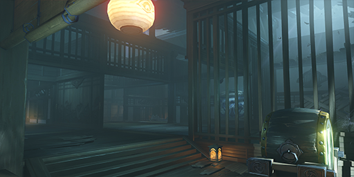</th>
      <th class="th-artifact-padding">
        <!-- 千门虚舟
          -->
        
            过去曾经如孤舟般漂游在海上的天狗别馆，曾接待过当时小有名气的「影向役者三人众」；后来成了此人灰心之后虚度余生的樊笼，沉入了海下。
            

            <strong>稽古·千扉绘卷</strong>
             
            这里曾经是某位影向天狗最后的隐居之所。解开遗世之人留下的谜题，击败擅闯的贼人吧。
            
      </th>
    </tr>
  </thead>
</table>

### 砂流之庭

<table class="table-artifact">
  <thead>
    <tr>
      <th class="th-artifact">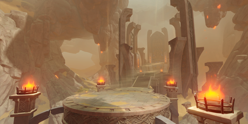</th>
      <th class="th-artifact-padding">
        
            传说在书记已经全然泯灭的宙始，曾有愚王在万古的流沙之上梦想筑造供养白之神木的高庭。如今沙上之国已经归于死寂，但过往的执妄似乎仍然彷徨其中。
            

            <strong>炼武秘境：砂之祭场</strong> 
            <strong>炼武秘境：沉沙之渊</strong> 
            <strong>炼武秘境：流沙之葬</strong>
             
            在砂金永远流淌散落的祭场中，潜伏着难以抵御岩元素攻击的敌人。 
            若能通过其中的试炼，或许能获得强化装备的物质。
            
      </th>
    </tr>
  </thead>
</table>

### 鸣神岛·天守

<table class="table-artifact">
  <thead>
    <tr>
      <th class="th-artifact">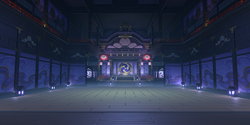</th>
      <th class="th-artifact-padding">
        
            主宰稻妻的雷电将军的居所。 
            也是进行「御前决斗」最为合适的场地。
            

            <strong>追忆：红莲的真剑试合</strong>
             
            雷电将军降下了裁决。愚人众的「女士」已经无法二度扰乱地上七国的秩序了吧。 
            然而再度踏上通往天守的阶梯时，与她在「御前决斗」中交锋的记忆再次鲜明地浮现。 
            在回忆中重新演练这场战斗，或许能有新的收获…
            
      </th>
    </tr>
  </thead>
</table>

### 梦想乐土之殁

<table class="table-artifact">
  <thead>
    <tr>
      <th class="th-artifact"></th>
      <th class="th-artifact-padding">
        
            曾有无数承载梦想的花瓣随风飘散，未能如愿。这里是永恒的起点，亦是「她」的落幕。
            

            <strong>追忆：永恒的守护者</strong>
             
            超越时间的意志总算是赢得了她的让步，永恒之章迈入新篇。 
            不过再度踏上影向山，那场荡气回肠的战斗又以记忆的形式复苏。 
            在脑海中亲自面对她的考验，或许能有新的收获…
            
      </th>
    </tr>
  </thead>
</table>

## 神无冢

### 菫色之庭

<table class="table-artifact">
  <thead>
    <tr>
      <th class="th-artifact">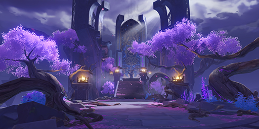</th>
      <th class="th-artifact-padding">
        
            相传在遥远的古代，高山比天空更高，大地比穹顶更大。直到明镜破碎，海洋升起。在传说中，远古的樱之庭与其他岛屿的联系便因此断绝了。
            

            <strong>精通秘境：初雷幽谷</strong> 
            <strong>精通秘境：菫染之国</strong> 
            <strong>精通秘境：真葛废都</strong>
             
            在紫樱永远盛放的祭场中，潜伏着擅闯其中的魔物。 
            若能通过其中的试炼，或许能获得令人天赋成长的物质。
            
      </th>
    </tr>
  </thead>
</table>

### 借景之馆

<table class="table-artifact">
  <thead>
    <tr>
      <th class="th-artifact">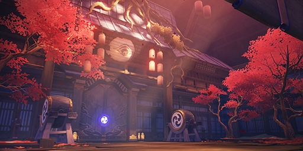</th>
      <th class="th-artifact-padding">
        
            <strong>未完成3.3间章「倾落伽蓝」 : </strong> 
            据说是古时避世的武人在大地深处借世外之景，修建的华美宅邸。日后有人在其中发现了如同白纸一般失心的倾奇者。  
            <strong>已完成3.3间章「倾落伽蓝」 : </strong> 
            据说是古时避世的武人在大地深处借世外之景，修建的华美宅邸。在长久的岁月中，因为不明的原因被封印。
            

            <strong>稽古·御馆绘卷</strong>
             
            在山石大地深处，似乎隐藏着世外之景，以及被其吸引的化外之徒。
            
      </th>
    </tr>
  </thead>
</table>

## 八酝岛

### 椛染之庭

<table class="table-artifact">
  <thead>
    <tr>
      <th class="th-artifact">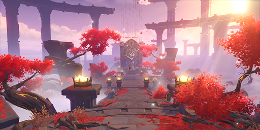</th>
      <th class="th-artifact-padding">
        
            似乎永远静止在红叶衰落之刻的借景之庭。曾经失却的因缘、无法忘却的爱执，或许都会循着大地当中的脉络，凝结成庭间白树的果实吧。
            

            <strong>祝圣秘境：椛狩</strong>
             
            在红叶飘扬的祭场之中，如同夏秋之分，存在着增强「冰元素」与「火元素」的领域。 
            能利用各种奥妙，成功克服其中试炼者，或许就能获得珍贵的圣遗物，获得追寻本应切断的因缘的助力。
            
      </th>
    </tr>
  </thead>
</table>

### 阵代屋敷

<table class="table-artifact">
  <thead>
    <tr>
      <th class="th-artifact">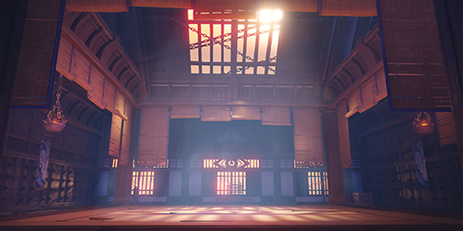</th>
      <th class="th-artifact-padding">
        
            曾属于远吕羽氏尊麾下将领的屋亭。直到在其生涯的最末，他、神骸与天空都被一线的闪电切断。
            

            <strong>稽古·恶王亭</strong>
             
            过去的武家屋敷已经成为贼寇的居所。肃清蛰服其中的恶党吧。
            
      </th>
    </tr>
  </thead>
</table>

## 海祇岛

### 池中宅邸

<table class="table-artifact">
  <thead>
    <tr>
      <th class="th-artifact">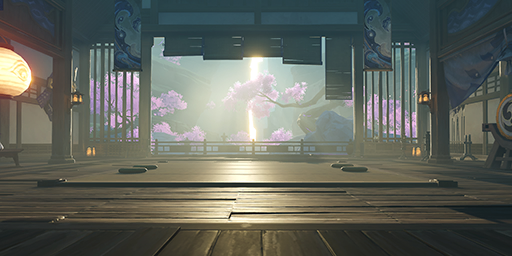</th>
      <th class="th-artifact-padding">
        
            据说在月光更加明亮的岁月中，池中尚并未灌入海水，将府邸的入口封锁。据说过去，月光会如同水银般盈满井户。
            

            <strong>稽古·御前府邸</strong>
             
            曾经名震稻妻诸海的「海御前」故宅中，有着借酒赏世外之花的窗口。如今宅邸无主，只有盗匪与贼人踞身其中。
            
      </th>
    </tr>
  </thead>
</table>

## 清籁岛

### 沉眠之庭

<table class="table-artifact">
  <thead>
    <tr>
      <th class="th-artifact"></th>
      <th class="th-artifact-padding">
        
            在清籁岛还没有如今的名字、没有被染上雷色之前就静静沉睡在此间的庭苑。其中的景象永远也不会改变吧。
            

            <strong>祝圣秘境：骸馆</strong>
             
            无主的宅邸如今成为了兽境魔物的栖身之所。 
            能利用永恒之雷，成功克服其中试炼者，或许就能获得珍贵的圣遗物吧。
            
      </th>
    </tr>
  </thead>
</table>

## 鹤观

### 茂知之壳

<table class="table-artifact">
  <thead>
    <tr>
      <th class="th-artifact"></th>
      <th class="th-artifact-padding">
        
            不知何人在雾海之外建立的宅邸。如今似乎被来自外界，吞食思绪的群狼占据了。
            

            <strong>稽古·砺伏之巢床</strong>
             
            无主的宅邸如今成为了兽境魔物的栖身之所。击败其中的魔物，搜寻其中的宝藏吧。
            
      </th>
    </tr>
  </thead>
</table>

## 其他任务秘境

### 町奉行所收监处

<table class="table-artifact">
  <thead>
    <tr>
      <th class="th-artifact">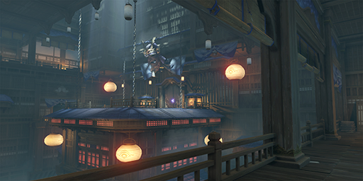</th>
      <th class="th-artifact-padding">
        
            <strong>剧情回顾 : </strong>
             
            町奉行所暂时关押犯人的地方，除了严密的守卫防备之外，还有阻止犯人脱逃的重重机关。
            

            <strong>出处 : </strong>
             
            稻妻 第二章 第一幕 不动鸣神，恒常乐土--于狱中绽放之花
            
      </th>
    </tr>
  </thead>
</table>

### 山中隐秘之地

<table class="table-artifact">
  <thead>
    <tr>
      <th class="th-artifact">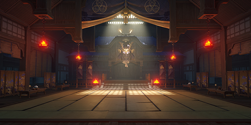</th>
      <th class="th-artifact-padding">
        
            <strong>剧情回顾 : </strong>
             
            根据一平提供的信息，你找到了鹰司家的隐蔽之所。  
            如今的天领奉行风雨飘摇，九条镰治又迟迟未归，在此处究竟发生了什么，尚无法预测…
            

            <strong>出处 : </strong>
             
            天下人之章·第一幕「影照浮世风流」--且闻天下人心
            
      </th>
    </tr>
  </thead>
</table>

### 邪眼工厂

<table class="table-artifact">
  <thead>
    <tr>
      <th class="th-artifact">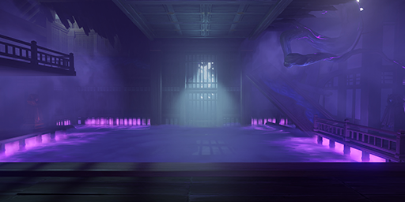</th>
      <th class="th-artifact-padding">
        
            <strong>剧情回顾 : </strong>
             
            不能放任「邪眼」在稻妻肆意流通。  
            不能坐视「邪眼」造成更多的伤害。
            

            <strong>出处 : </strong>
             
            稻妻 第二章 第三幕 千手百眼，天下人间--邪眼
            
      </th>
    </tr>
  </thead>
</table>

### 鸣神岛·天守

<table class="table-artifact">
  <thead>
    <tr>
      <th class="th-artifact"></th>
      <th class="th-artifact-padding">
        
            <strong>剧情回顾 : </strong>
             
            雷电将军所在之处。不出预料的话…你将会和「女士」再度碰面。
            

            <strong>出处 : </strong>
             
            稻妻 第二章 第三幕 千手百眼，天下人间--御前决斗
            
      </th>
    </tr>
  </thead>
</table>

### 摇摇欲坠的罪恶

<table class="table-artifact">
  <thead>
    <tr>
      <th class="th-artifact">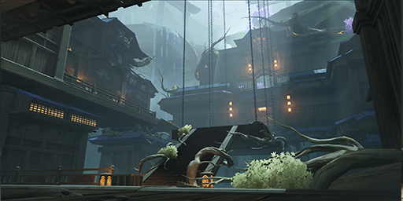</th>
      <th class="th-artifact-padding">
        
            <strong>剧情回顾 : </strong>
             
            一路追查之下，你和荒泷一斗找到了流浪武士的藏身处。
             
            唯有突破眼前的重重阻碍，才能解除赤鬼与青鬼之间的所有误会。
            

            <strong>出处 : </strong>
             
            天牛之章·第一幕 「赤金魂」--鬼之傲
            
      </th>
    </tr>
  </thead>
</table>

### 降灵密室

<table class="table-artifact">
  <thead>
    <tr>
      <th class="th-artifact">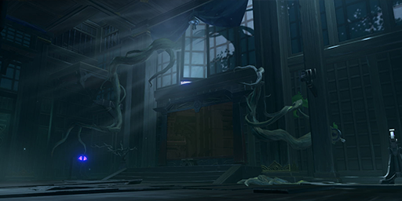</th>
      <th class="th-artifact-padding">
        
            <strong>剧情回顾 : </strong>
             
            八重神子选定的降灵地点，在街头巷尾的传说中是降灵成功率最高的场所。
            

            <strong>出处 : </strong>
             
            仙狐之章·第一幕 「鸣神御祓祈愿祭」--百年一梦
            
      </th>
    </tr>
  </thead>
</table>

### 噩魇城阙

<table class="table-artifact">
  <thead>
    <tr>
      <th class="th-artifact">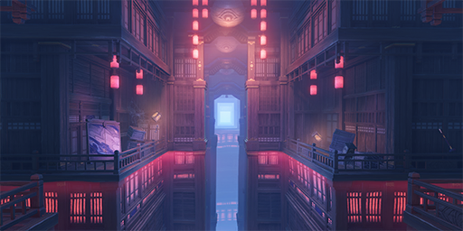</th>
      <th class="th-artifact-padding">
        
            <strong>剧情回顾 : </strong>
             
            根据神子提供的信息，你和瑞希成功找到了江村中弥的藏身地，这间兀自坐落在小岛上的房屋似乎内藏玄机。尽管嗅到了危险的气味，你和瑞希还是决定深入其中…
            

            <strong>出处 : </strong>
             
            貘枕之章·第一幕 「食梦者的忧郁」--梦魇的孑遗
            
      </th>
    </tr>
  </thead>
</table>

### 诀箓阴阳寮

<table class="table-artifact">
  <thead>
    <tr>
      <th class="th-artifact">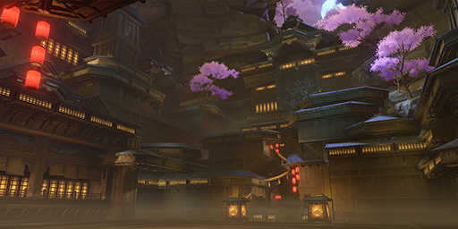</th>
      <th class="th-artifact-padding">
        
            <strong>剧情回顾 : </strong>
             
            诡幻叵测的「诀箓阴阳寮」悄然敞开了大门，其中囚禁的魔物空前凶戾，但对于探寻真相与锤炼武艺的执着之人而言，这座秘境正是宝贵的试炼之地…
            

            <strong>出处 : </strong>
             
            「谜境悬兵」
            
      </th>
    </tr>
  </thead>
</table>

### 百人一揆·挑战场地

<table class="table-artifact">
  <thead>
    <tr>
      <th class="th-artifact">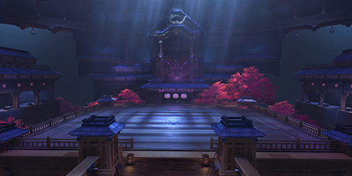</th>
      <th class="th-artifact-padding">
        
            <strong>剧情回顾 : </strong>
             
            在稻妻城附近的神秘大门，能够通往不为人知的秘密会馆。
             
            其中似乎举办着无论是渴求争斗的战士，或是单纯好战的魔物都能接纳的乱斗大会·百人一揆。
            

            <strong>出处 : </strong>
             
            「百人一揆」
            
      </th>
    </tr>
  </thead>
</table>

### 破旧的古屋

<table class="table-artifact">
  <thead>
    <tr>
      <th class="th-artifact">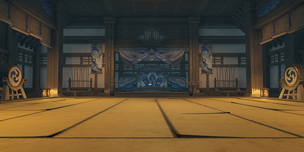</th>
      <th class="th-artifact-padding">
        
            <strong>剧情回顾 : </strong>
             
            跟着影狼丸，你来到了一处房屋前。
             
            没想到影狼丸趁大家不注意转头跑入了屋内，线索也由此中断。
             
            为了继续调查，或许只能一探其中了…
            

            <strong>出处 : </strong>
             
            「万端珊瑚事件簿·犬武者」
            
      </th>
    </tr>
  </thead>
</table>

### 挑战·犬流之道

<table class="table-artifact">
  <thead>
    <tr>
      <th class="th-artifact"></th>
      <th class="th-artifact-padding">
        
            <strong>剧情回顾 : </strong>
             
            外表破旧的小屋，里内似乎藏有另一方天地。
            

            <strong>出处 : </strong>
             
            「万端珊瑚事件簿·犬武者」
            
      </th>
    </tr>
  </thead>
</table>

