# 地理志

## 鸣神 · 离岛

<table class="table-geography">
    <thead>
        <tr>
            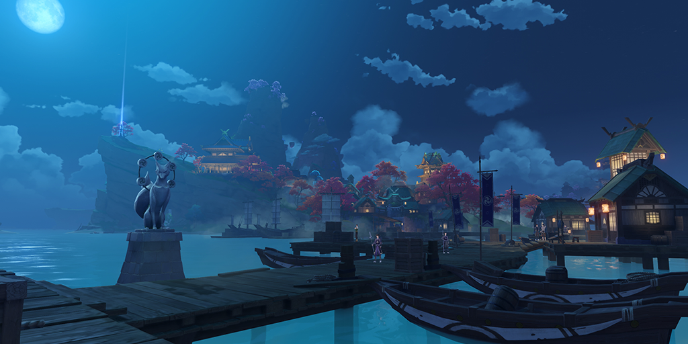
        </tr>
    </thead>
    <tbody>
            <tr>
                <td>传说数百年前，勘定奉行柊弘嗣曾从荒岛之上奇迹般地建起一座繁荣的商贸中心，令将军殿下刮目相看。「锁国令」实行的日子里，勘定奉行府上依旧灯火通明，来自远国的商户却已寂寥怆然，不复百年前熙攘之貌。或许这便是凡人之业的最好写照：成于一夕者，亦将败于一朝。</td>
            </tr>
    </tbody>
</table>

## 稻妻城 · 天领

<table class="table-geography">
    <thead>
        <tr>
            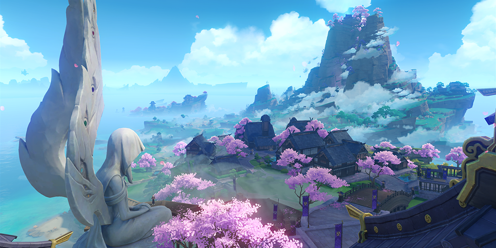
        </tr>
    </thead>
    <tbody>
            <tr>
                <td>诸多街巷坂道延伸交割，最终集于天守前。天守是稻妻无可置疑的权力中心，在大御所将军殿下永恒静谧的注视下，熙攘的万民终将摆脱执念的烦恼，走向不再需要追逐竞夺愿望的乐土——只不过，将军所见的那片净土，究竟是何风景呢？</td>
            </tr>
    </tbody>
</table>

## 稻妻城 · 城郊

<table class="table-geography">
    <thead>
        <tr>
            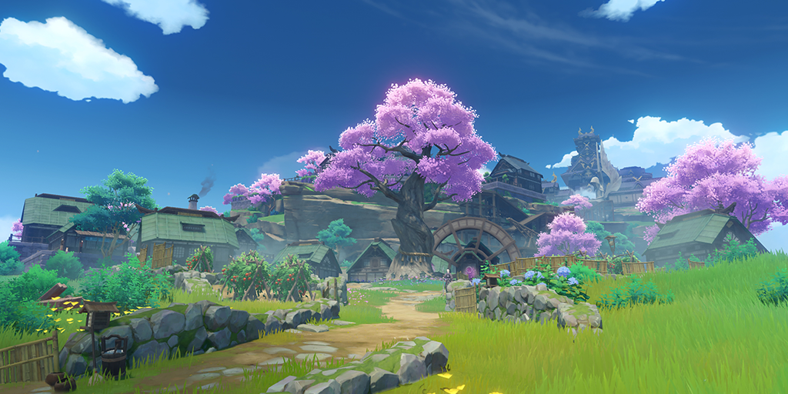
        </tr>
    </thead>
    <tbody>
            <tr>
                <td>沿古老的坂道逐步上行，稻妻城的城郊是一片颇有古风的闲适景象。似乎城内的繁华胜景并未感染此处的风光。将军的威势与恩惠同样在此弥布，带来了静谧而别样的生机。</td>
            </tr>
    </tbody>
</table>

## 影向山 · 鸣神大社

<table class="table-geography">
    <thead>
        <tr>
            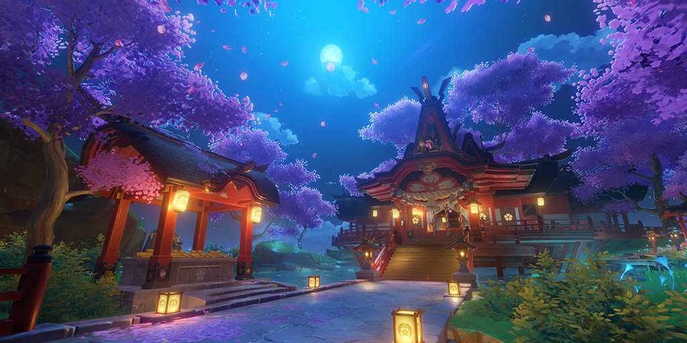
        </tr>
    </thead>
    <tbody>
            <tr>
                <td>鸣神大社坐落于影向山顶，守护着独一无二的神樱，是稻妻最大的神社。在并不太平的今日，为稻妻的民众提供可贵的慰藉与安宁。</td>
            </tr>
    </tbody>
</table>

## 月光下的神林

<table class="table-geography">
    <thead>
        <tr>
            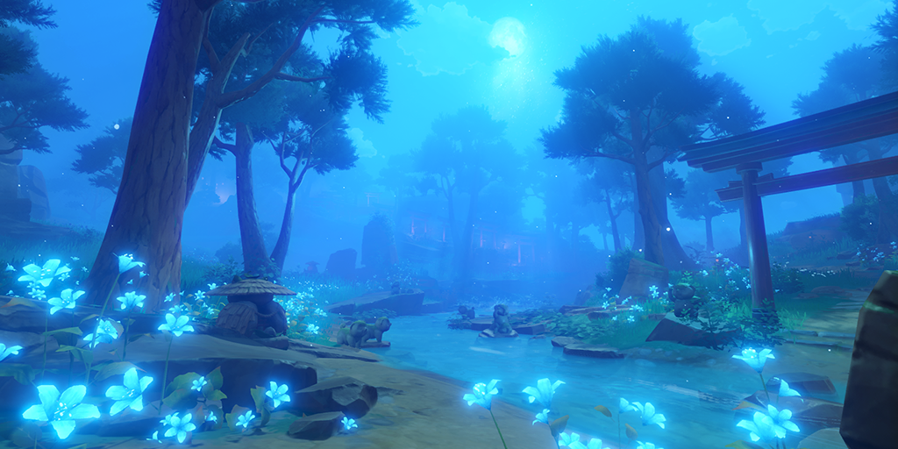
        </tr>
    </thead>
    <tbody>
            <tr>
                <td>传说在过去，这片神林曾是诸多妖怪栖身之处。如今，关于这片静谧的林地，仍有妖狸的「狸囃子」传说。</td>
            </tr>
    </tbody>
</table>

## 远眺踏鞴之岛

<table class="table-geography">
    <thead>
        <tr>
            
        </tr>
    </thead>
    <tbody>
            <tr>
                <td>此处重峦叠嶂的环形岛屿是幕府的冶炼设施的最佳地形屏障。此处宏伟的巨型高炉曾源源不断地为稻妻生产高质量玉钢。但近来由于战事，驱动生产的「御影炉心」遭到了破坏。</td>
            </tr>
    </tbody>
</table>

## 神无冢 · 阵前

<table class="table-geography">
    <thead>
        <tr>
            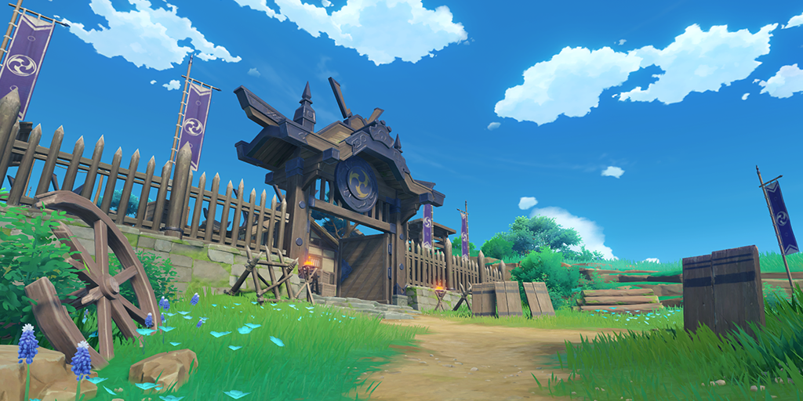
        </tr>
    </thead>
    <tbody>
            <tr>
                <td>传说在数百年前的灾事中，将军殿下倚重的凡人名将九条重赖短短一夜间便筑起阵城，与漆黑的军势对抗，高扬「雷之三重巴」的旗印。数百年后，九条家的后人亦传承了出色的军事工程技术。</td>
            </tr>
    </tbody>
</table>

## 战火中的滩涂

<table class="table-geography">
    <thead>
        <tr>
            
        </tr>
    </thead>
    <tbody>
            <tr>
                <td>「名椎」在稻妻先民的古老语言中有「为神灵之手温柔爱抚」之含义。但讽刺的是，自千百年前至今，名椎滩便饱受战乱的摧残，落得居民寥寥，也成了拾荒者与海贼的天地。</td>
            </tr>
    </tbody>
</table>

## 八酝岛 · 裂谷

<table class="table-geography">
    <thead>
        <tr>
            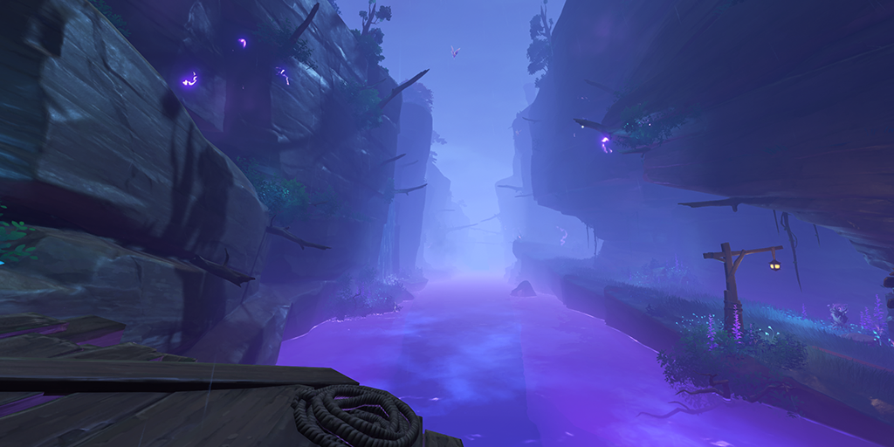
        </tr>
    </thead>
    <tbody>
            <tr>
                <td>传说中，终结蛇神的一刀正是在此处斩下的。在这道横贯八酝岛的深邃峡谷中，雷光的残响至今不绝，仿佛属雷的精灵仍在喋喋不休地议论着数千年前，划开天空与大地的传奇光景…</td>
            </tr>
    </tbody>
</table>

## 高眺之蛇首

<table class="table-geography">
    <thead>
        <tr>
            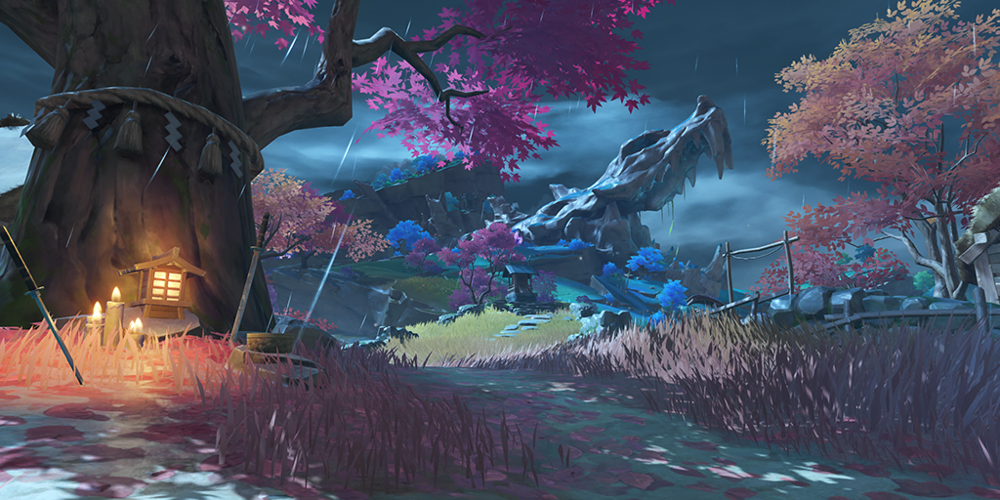
        </tr>
    </thead>
    <tbody>
            <tr>
                <td>传说中曾经深入深海的巨蛇，最终在八酝岛归于沉默。又有传说说海风穿过巨蛇的双眼、利齿时会发出阵阵如同哨子的声响，那是它为自己所作的镇魂诗。如今这首镇魂诗也同样为所有在战争中倒下、流离失所的人而吟。</td>
            </tr>
    </tbody>
</table>

## 雷云旋聚之处

<table class="table-geography">
    <thead>
        <tr>
            
        </tr>
    </thead>
    <tbody>
            <tr>
                <td>海天变色的大战已成为渐被遗忘的过去，应唤而来的悠远雷暴依然在此驻留。</td>
            </tr>
    </tbody>
</table>

## 搁浅的旗舰

<table class="table-geography">
    <thead>
        <tr>
            
        </tr>
    </thead>
    <tbody>
            <tr>
                <td>破落的安宅船也曾经历宏伟年代，星光垂泪的遗骸中，依稀可见在昔日巫女与乡老祝福下骄傲扬帆的光景。</td>
            </tr>
    </tbody>
</table>

## 寂静的渔村

<table class="table-geography">
    <thead>
        <tr>
            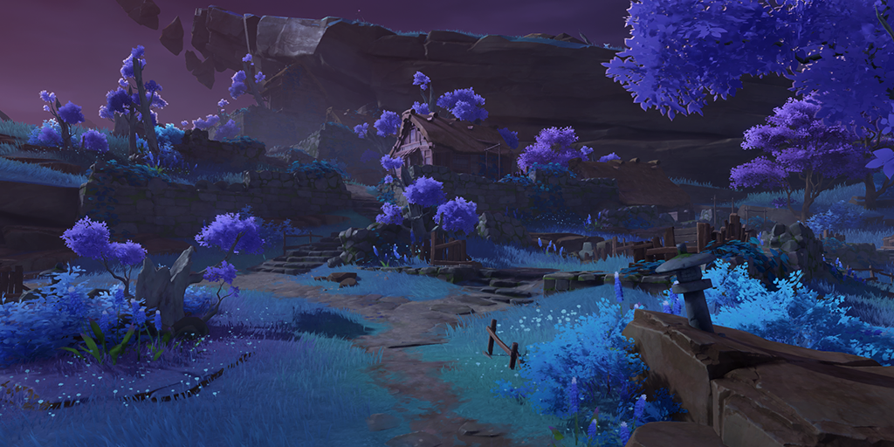
        </tr>
    </thead>
    <tbody>
            <tr>
                <td>旧日的笑语蝉鸣终湮于雷的威声。今人只记得，这是一座因无羁的雷电而废弃的村庄。</td>
            </tr>
    </tbody>
</table>

## 代宫司寝子大人的居所

<table class="table-geography">
    <thead>
        <tr>
            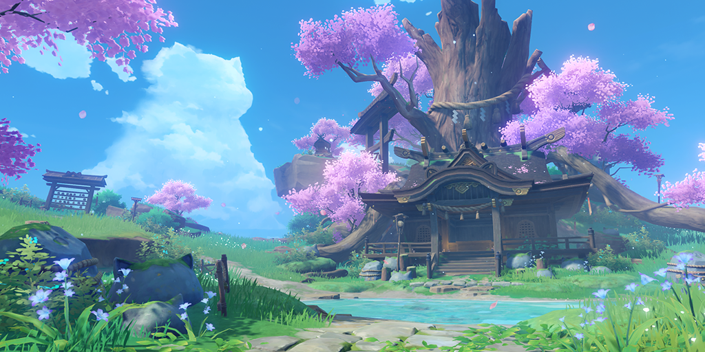
        </tr>
    </thead>
    <tbody>
            <tr>
                <td>「『阿响』会回来的。」 「多亏了汝等，神社打理得很好了。她很快就会回来了。」</td>
            </tr>
    </tbody>
</table>

## 珠光弥布的宫阙

<table class="table-geography">
    <thead>
        <tr>
            
        </tr>
    </thead>
    <tbody>
            <tr>
                <td>海祇岛住民的政治中心与信仰集聚之地，礁岩与巨贝拱卫的宫阙隐居着蛇神的孑遗。</td>
            </tr>
    </tbody>
</table>

## 月浴之渊

<table class="table-geography">
    <thead>
        <tr>
            
        </tr>
    </thead>
    <tbody>
            <tr>
                <td>「渊下宫」入口之所在，池水终年闪烁着比拟月华的磷光，因而得名「月浴」。</td>
            </tr>
    </tbody>
</table>

## 海渊民的村落

<table class="table-geography">
    <thead>
        <tr>
            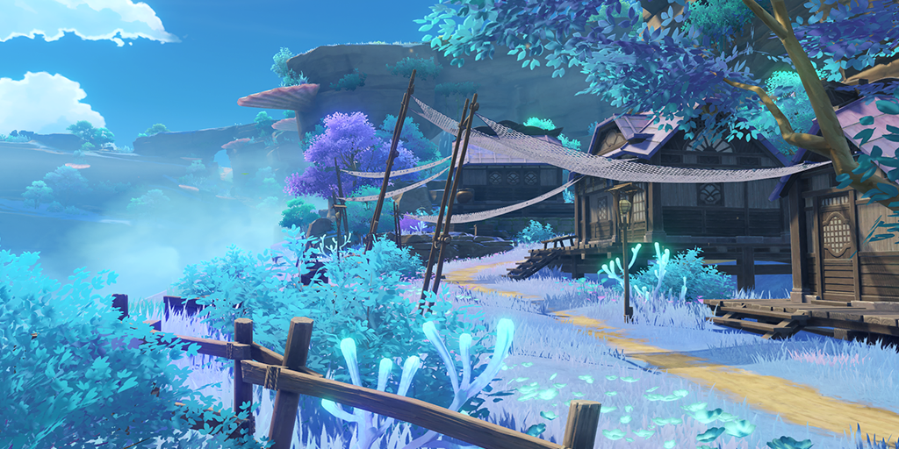
        </tr>
    </thead>
    <tbody>
            <tr>
                <td>海祇岛上的古老村庄，据说其居民祖辈自海渊而来。 也是对向「眼狩令」揭旗抵抗之人重要的据点。</td>
            </tr>
    </tbody>
</table>

## 鹤观

<table class="table-geography">
    <thead>
        <tr>
            
        </tr>
    </thead>
    <tbody>
            <tr>
                <td>「啊啊，美丽的鸟，如神的鹫鸟啊。」 「我们一同沉睡在蛛丝般的雾巢中。」</td>
            </tr>
    </tbody>
</table>

