# 教程

## 探索知识

### 鹤观的「栖木」…

<table class="table-study">
    <thead>
        <tr>
                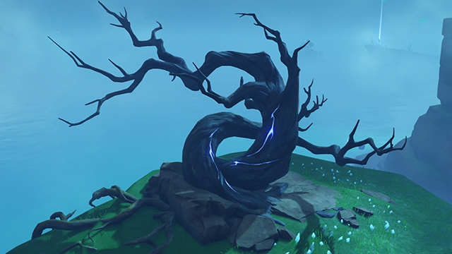
            </tr>
    </thead>
    <tbody>
            <tr>
                <td>依照鹤观当地人的说法，这种树木似乎是雷鸟曾经停驻过的树木，所以需要进行「供奉」。触碰栖木后，其中蕴含的力量会化为三片羽毛的造型并飘走。找到这些逸散的力量，就能完成「供奉」。</td>
            </tr>
    </tbody>
</table>

### 清籁的「镇石」

<table class="table-study">
    <thead>
            <tr>
                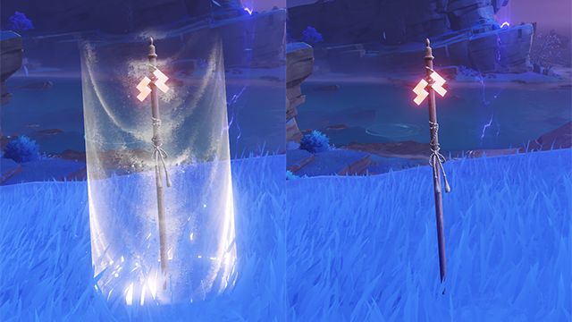
            </tr>
    </thead>
    <tbody>
            <tr>
                <td>要令镇石再次作用、雷暴再次被压制的话，就需要先找到并触碰镇石对应的三组御币。应当谨记御币的所在位置与纸垂的面数。</td>
            </tr>
            <tr>
                
            </tr>
             <tr>
                <td>镇石附有纸垂，由上下部分组成，各自可以转动。</td>
            </tr>
            <tr>
                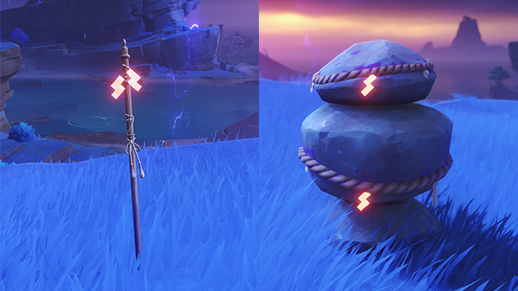
            </tr>
             <tr>
                <td>转动镇石，使镇石上面向御币方向的纸垂面数，与御币上的纸垂面数对齐。当一座镇石与其所有对应的御币的纸垂面数都一一对应无误时，这座镇石的封印就巩固了。</td>
            </tr>
    </tbody>
</table>

### 「电灯台」

<table class="table-study">
    <thead>
            <tr>
                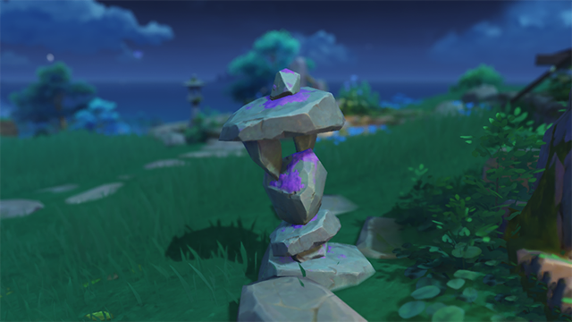
            </tr>
    </thead>
    <tbody>
            <tr>
                <td>稻妻存在这样的古老石质小灯台。如果与雷种子同行，似乎就能将其点亮。</td>
            </tr>
            <tr>
                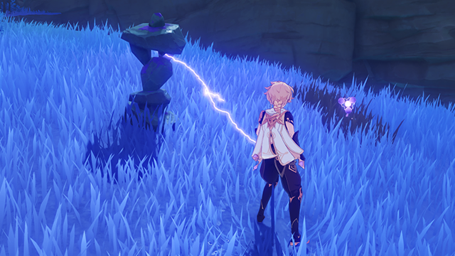
            </tr>
             <tr>
                <td>稻妻存在这样的古老石质小灯台。如果与雷种子同行，似乎就能将其点亮。</td>
            </tr>
    </tbody>
</table>

### 「雳木」

<table class="table-study">
    <thead>
            <tr>
                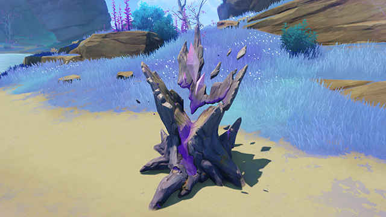
            </tr>
    </thead>
    <tbody>
            <tr>
                <td>「雳木」是控制「雷祸」的树木。 在这种诡谲的神木旁，可以免受「雷祸」的侵害。</td>
            </tr>
    </tbody>
</table>

### 雷种子…

<table class="table-study">
    <thead>
            <tr>
                
            </tr>
    </thead>
    <tbody>
            <tr>
                <td>这种依附「雷樱枝条」出现的神奇精灵叫「雷种子」，象征着雷的护佑。</td>
            </tr>
            <tr>
                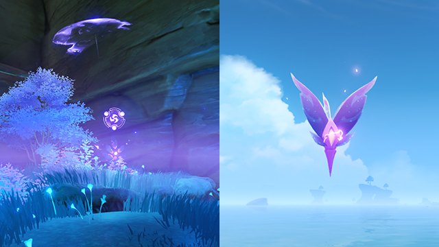
            </tr>
             <tr>
                <td>雷种子有着各种各样的力量。与雷种子同行时，可以使用「雷极」迅速移动、进入「若雷结界」，甚至可以抵御「雷祸」。</td>
            </tr>
            <tr>
                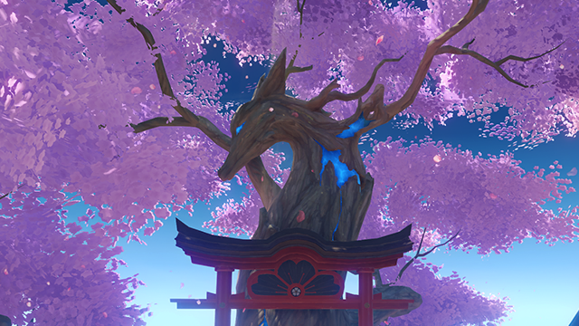
            </tr>
             <tr>
                <td>在鸣神大社的神樱处，可以供养雷种子，加强它们的力量。强大的雷种子甚至能帮助他们中意的旅人御敌…</td>
            </tr>
    </tbody>
</table>

### 莫名其妙的屏障…

<table class="table-study">
    <thead>
            <tr>
                
            </tr>
    </thead>
    <tbody>
            <tr>
                <td>这种阻挡人进入的屏障，在稻妻被称为「若雷结界」。出于某种神秘的原因，如果能获得雷种子的认可、与雷种子同行，就能穿越部分屏障，进入内部…</td>
            </tr>
            <tr>
                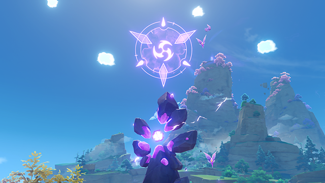
            </tr>
             <tr>
                <td>…但也存在着更为强大的屏障，需要更加强大的雷种子才能穿越。通过鸣神大社的神樱，供养雷种子，或许有一天就能穿越所有「若雷结界」封锁的区域了吧。</td>
            </tr>
            <tr>
                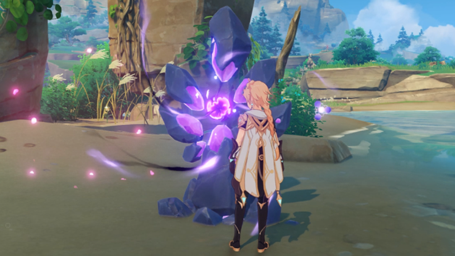
            </tr>
             <tr>
                <td>「若雷结界」中有时封印着「若雷石」。这种石片蕴含着无羁的狂暴力量，可以由雷种子暂时压制。「若雷石」被压制的期间，外围的结界也会消除。</td>
            </tr>
    </tbody>
</table>

### 奇妙的装置…

<table class="table-study">
    <thead>
            <tr>
                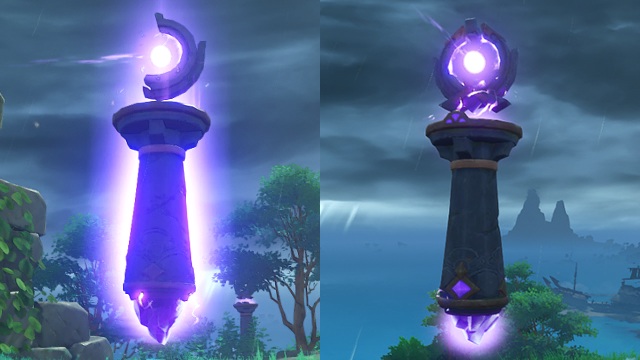
            </tr>
    </thead>
    <tbody>
            <tr>
                <td>这种阻挡人进入的屏障，在稻妻被称为「若雷结界」。出于某种神秘的原因，如果能获得雷种子的认可、与雷种子同行，就能穿越部分屏障，进入内部…</td>
            </tr>
            <tr>
                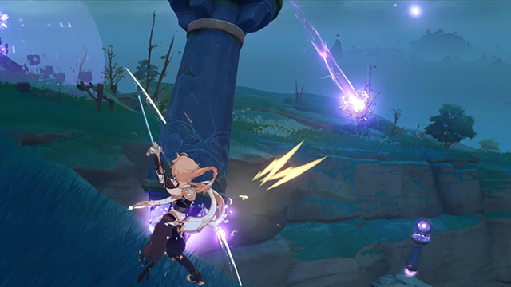
            </tr>
             <tr>
                <td>「御引磐座」受到攻击后，能够向指定的方向放射电流。这种电流可以消解在八酝岛的祟神意志下，形成的结界。</td>
            </tr>
            <tr>
                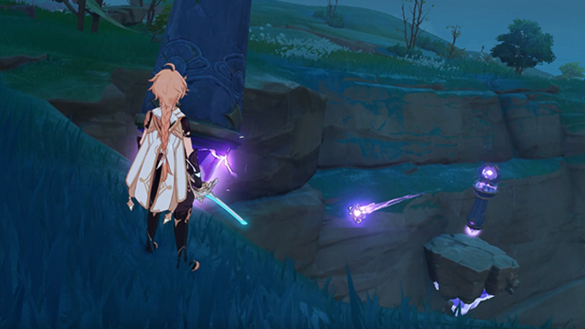
            </tr>
             <tr>
                <td>「雷承之鉴」能接收「御引磐座」传来的电流，并将其向其他的方向传导出去。</td>
            </tr>
    </tbody>
</table>

### 「神居岛崩炮」 · 一

<table class="table-study">
    <thead>
            <tr>
                
            </tr>
    </thead>
    <tbody>
            <tr>
                <td>有着强大威力的大筒。通常来说，需要特殊的弹药才能发射，但也可以通过雷元素的力量充能…</td>
            </tr>
            <tr>
                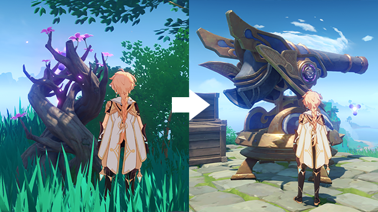
            </tr>
             <tr>
                <td>在其附近的角色，若携带雷种子，或处于雷元素附着状态下，可以为「神居岛崩炮」充能。</td>
            </tr>
    </tbody>
</table>

### 「神居岛崩炮」 · 二

<table class="table-study">
    <thead>
            <tr>
                
            </tr>
    </thead>
    <tbody>
            <tr>
                <td>这种大筒没有所见即所得的瞄准手段。通过调整仰俯角、左右方向，将发射的方向对准需要攻击的对象。</td>
            </tr>
    </tbody>
</table>

### 「雷极」

<table class="table-study">
    <thead>
            <tr>
                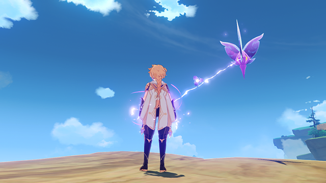
            </tr>
    </thead>
    <tbody>
            <tr>
                <td>这种在稻妻常见的奇异事物是「雷极」。拥有雷元素的力量，或是受到稻妻眷顾的人，可以利用它如同闪电般迅速移动。 在其附近一定范围内的角色，若携带雷种子，或处于雷元素附着状态下，可以向「雷极」迅速移动。</td>
            </tr>
    </tbody>
</table>

### 过量的「雷元素」…

<table class="table-study">
    <thead>
            <tr>
                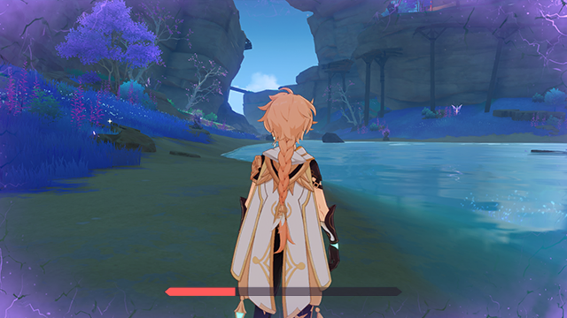
            </tr>
    </thead>
    <tbody>
            <tr>
                <td>在稻妻，部分区域有着过高的「雷元素浓度」，处在其中会渐渐损失生命值。这种现象被称为「雷祸」。 利用雷种子的保护，可以抵消「雷祸」造成的损伤。</td>
            </tr>
    </tbody>
</table>

### 神秘的「留念镜」…

<table class="table-study">
    <thead>
            <tr>
                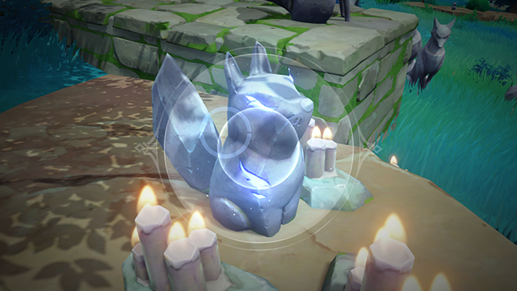
            </tr>
    </thead>
    <tbody>
            <tr>
                <td>使用「留念镜」这种特殊的小道具时，会透过透镜观察周遭的世界。 如果通过它观察这种特殊的「地狐」小像，可能会发生奇妙的事情…</td>
            </tr>
    </tbody>
</table>

## 重要消息

### 获取「木材」-「樱树」

<table class="table-study">
    <thead>
            <tr>
                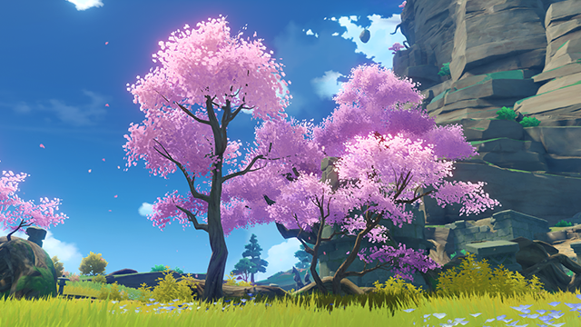
            </tr>
    </thead>
    <tbody>
            <tr>
                <td>
                挺秀俊俏的树木，零星分布在大陆东部。枝头花朵绽放时，宛如樱色的流云，被誉为稻妻最为明丽的景观。 「樱树」极少的分布于「鸣神岛」等地，砍伐「樱树」可以获得「梦见木」。</td>
            </tr>
    </tbody>
</table>

### 获取「木材」-「羽扇枫」

<table class="table-study">
    <thead>
            <tr>
                
            </tr>
    </thead>
    <tbody>
            <tr>
                <td>
                形姿婆娑的树木，叶片赤红如灼，形似羽扇，明艳的色彩足以染红群山，常被诗句歌咏为深秋的象征。 「羽扇枫」极少的分布于「鸣神岛」等地，砍伐「羽扇枫」可以获得「枫木」。</td>
            </tr>
    </tbody>
</table>

### 获取「木材」-「柳杉」

<table class="table-study">
    <thead>
            <tr>
                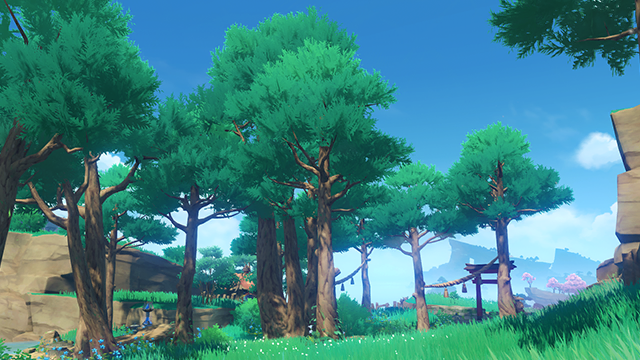
            </tr>
    </thead>
    <tbody>
            <tr>
                <td>
                茁壮挺拔的树木，叶片与树冠的形貌独特，易于辨识。 「柳杉」分布于「鸣神岛」等地，砍伐「柳杉」可以获得「孔雀木」。</td>
            </tr>
    </tbody>
</table>

### 获取「木材」-「御伽树」

<table class="table-study">
    <thead>
            <tr>
                
            </tr>
    </thead>
    <tbody>
            <tr>
                <td>
                平平无奇的树木，遍布稻妻各地。在某些童谣中，这种树木被描绘成「自然的低语」，因而有着「御伽树」的美称。 「御伽树」分布于「稻妻」全境，砍伐「御伽树」可以获得「御伽木」。</td>
            </tr>
    </tbody>
</table>

