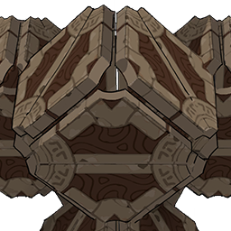
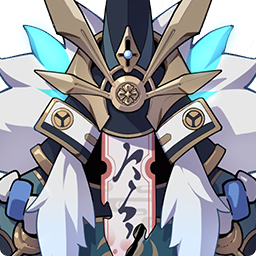
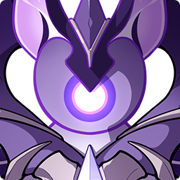
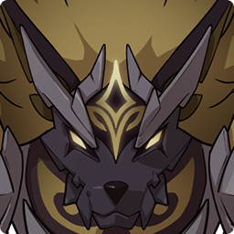
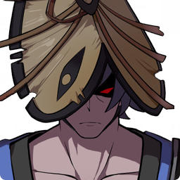

# 冒险之证-讨伐

<table  class="table-moster">
  <thead>
    <tr>
      <th class="th-moster" rowspan="2"></th>
      <th  class="content-moster">
      

            

        恒常机关阵列
        

            

            

            
            诡谲的异形机械。
             
            传说是已经覆灭的国度留下的战争机械。由若干部件构成，能够适应战斗的环境，施展各种攻击手段。
             
            由立方体构成的形态在某个层面而言，与所谓的「无相元素」有着相似点。
            
            

        

      </th>
    </tr>
  </thead>
</table>

<table class="table-moster">
  <thead>
    <tr>
      <th class="th-moster" rowspan="2"></th>
      <th  class="content-moster">
      

            

        魔偶剑鬼
        

            

            

            
            自律的人形机关剑士。
             
            据说在试作时，集成了某个以秘剑「天狗抄」闻名的剑道流派初代宗主的记忆，却又因为不明的原因而失控，最终被废弃了。
             
            根据歌人的描述，剑鬼会徘徊在因缘断绝的地方。
            
            

        

      </th>
    </tr>
  </thead>
</table>

<table  class="table-moster">
  <thead>
    <tr>
      <th class="th-moster" rowspan="2"></th>
      <th  class="content-moster">
      

            

        雷音权现
        

            

            

            
            异常的雷元素生命，以电光与霆雷高唱驱使它行动的忿恨。
             
            虽然形象上与「纯水精灵」有着某种程度上的相似之处，但似乎并不具备纯水精灵的智慧。
             
            传说是由纯粹的悔恨驱使的元素魔物。
            
            

        

      </th>
    </tr>
  </thead>
</table>

<table  class="table-moster">
  <thead>
    <tr>
      <th class="th-moster" rowspan="2"></th>
      <th  class="content-moster">
      

            

        嗜岩·兽境猎犬
        

            

            

            
            来自异界的扭曲魔兽。
             
            统领兽境群狼的王者，拥有指挥狼群溶解空间的权威。
              
            
            

        

      </th>
    </tr>
  </thead>
</table>

<table class="table-moster">
  <thead>
    <tr>
      <th class="th-moster" rowspan="2"></th>
      <th  class="content-moster">
      

            

        野伏·阵刀番
        

            

            

            
            虽然常被称为「野伏众」，但这些贼匪并没有统一的团体。有时也会根据犯行的性质与其人的气质，被称为「无宿」、「浮浪」、「海乱鬼」、「无赖汉」、「一揆众」，或者更加直截了当的「流寇」。
             
            他们通常是落草为寇的武人、逐电的士兵之流，其中有的人为了生计与财富，甚至会与盗宝团、愚人众沆瀣一气。
            
            

        

      </th>
    </tr>
  </thead>
</table>

