# 武器

## 单手剑

### 雾切之回光

<table class="table-weapon">
  <thead>
    <tr>
      <th class="th-weapon" rowspan="1">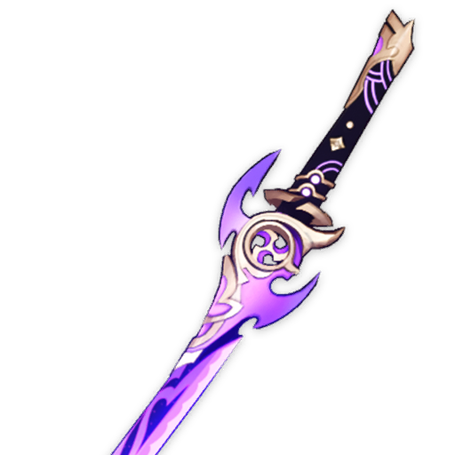</th>
      <th style="padding: 0; vertical-align: top;">
        

          

        雾切御腰物
        

          

          

            
            获得12%所有元素伤害加成，并能获得「雾切之巴印」的威势。雾切之巴印：持有1/2/3层雾切之巴印时，获得8/16/28%自己的元素类型的元素伤害加成。在下列情况下，角色将各获得1层雾切之巴印：普通攻击造成元素伤害时，持续5秒；施放元素爆发时，持续10秒；此外，角色元素能量低于100%时，将获得1层雾切之巴印，此雾切之巴印会在角色的元素能量充满时消失。每层雾切之巴印的持续时间独立计算。
            

            闪烁着凄烈紫光的太刀。名之为「回光」是因为一度破碎的过去。
            
            

        

      </th>
    </tr>
    <tr>
        <th colspan="2" style="font-weight: normal;">
        <strong>故事：</strong> 
        将军御赐旗本的铭刀之一，据说其势能挟雷光之威斩开山岚夜雾。 
        曾一度碎裂成上千片。重铸后，刀身上留下了如流云一般的纹痕。
          
        在歌谣之中，「大手门荒泷、胤之岩藏、长蛇喜多院、雾切高岭」 
        尚武的孩童将历史上的名武者并列，其中的「雾切高岭」就是他。 
        曾与祓行的神人一同，以其秘剑「雾切」斩落无数的妖物与祟神。 
        也曾从影向的天狗处学会操弓的心得，又将射术教给了中意之人。 
        然而秘剑雾切再并无后人传承，仅仅存留在话本、绘图与童谣中。
          
        在其生涯的最末，他作为寄骑在将军的阵列中与漆黑的军势向对。
          
        如果没有将爱用的弓，作为赌注留在了她的身畔，或许情况也会不同吧。 
        但真赌徒无论如何也不能后悔，绝不计较「如果」、绝不悔恨「假使」。 
        敌人如同迷雾般涌来，那不断地使出连山岚夜雾也能斩断的妙剑就行了。 
        斩切的速度足够快的话，那就能拨开欲深的漆黑迷雾，能瞥见光明吧——
          
        「浅濑，与你的约定…不，这场终结一切赌局的豪赌，我绝对不会输。」 
        「我一定会回去。然后连同作为赌资的弓一起，取走我所赢得的未来！」
          
        如同连绵不绝的雷光，他与雾切一同斩落了无数妖物。 
        但最终刀剑究竟仍是不如剑客的执着强韧，逐渐破碎。 
        而漆黑的浓雾，也将他完全淹没了… 
        在最后仅有刀的部分碎片被取回重铸，承担雾切之名。
          
        如同紧握垂入黑暗的蜘蛛丝般，紧握破碎刀柄的武者， 
        在漆黑的浓雾中，仍然拗执地在内心中不断告诉自己： 
        赌局的胜负尚且没有定论。我一定要回到浅濑的身边… 
        </th>
    </tr>
  </thead>
</table>

### 波乱月白经津

<table  class="table-weapon">
  <thead>
    <tr>
      <th class="th-weapon" rowspan="1"></th>
      <th style="padding: 0; vertical-align: top;">
        

          

        白刃流转
        

          

          

            
            获得12%所有元素伤害加成；队伍中附近的其他角色在施放元素战技时，会为装备该武器的角色产生1层「波穗」效果，至多叠加2层，每0.3秒最多触发1次。装备该武器的角色施放元素战技时，如果有积累的「波穗」效果，则将消耗已有的「波穗」，获得「波乱」：根据消耗的层数，每层提升20%普通攻击伤害，持续8秒。
            

            经津传奉命锻造的名作。因其如汹涌海涛般的气度，而得「波乱」之名。
            
            

        

      </th>
    </tr>
    <tr>
        <th colspan="2" style="font-weight: normal;">
         <strong>故事：</strong> 
        踏鞴砂目付御舆长正编纂的《稻妻名物帐》中记述的御腰物。 
刀派经津传奉命所作的月白经津有「波穗」与「波乱」两柄， 
其中这柄「波乱」是名工真砂丸一生中唯一留下刀铭的作品。
  
世人常说刀剑当中寄宿着刀工的魂灵… 
《名物帐》便是以这样一句话开始的。 
据传「波穗」一刀出自经津传三代目惣领经津实之手。锻成之后， 
这柄刀身薄青、刃文如水波的华美名物，时常悬于将军近侍腰间。 
再后来，刀身在与决定鬼人命运的真剑试合中刃切，遂交还重锻。 
其时，久被酒、旧伤与祟神遗念折磨的经津实，已如未经回火的钢刀般断裂了。 
可年少的四代目经津弘芳，尚无比肩母亲的技艺。 
是他的义兄——世人唤作「真砂丸」的经津政芳， 
最终成功锻成此刀，令经津传杰作再度现身世间。 
两柄月白经津外观极为相似，气质却又大为不同。
  
真砂丸一生只为这件作品留下刀铭。原因倒也十分单纯： 
他曾是被三代目惣领收留的孤儿，目不识丁又天生失语。 
因为领命复现「波穗」之美，才将此前的铭文依样錾刻。
  
经津实亡故后，数年来真砂丸代替她传授弘芳锻冶的技艺， 
传说三代目也曾有意让他接任惣领，但他却数次拒绝恩人。 
「波乱」一作使其声名鹊起，几乎影响了弘芳继承四代目。 
因而在义弟独当一面后，真砂丸便选择独自离开远走他乡。 
此后，他又前往其他锻刀流派钻研技艺，博采众名匠所长。 
他晚年的三位得意弟子：枫原景光、丹羽长光与赤目实长， 
便是后日缔造了一心传的「一心三作」。
  
「那时我不过是个生来哑巴、相貌丑陋又肮脏的弃儿。」 
「像蛾般贪求着寒夜中的温暖，见到的是刀场的炉火。」 
「我的面前便是世人口中乖戾妄为的经津三代目女匠。」 
「可她却不像他人呵斥我滚开，还给我糙米填饱肚囊。」 
「她见我身上沾满铁砂，便用『真砂丸』作我的名字。」
  
不能言语却又心思细密的真砂丸有许多藏在心中的故事吧。 
那些没能说出口的事，最终都沉淀下来，又消失在浪涛中…
  
「三代目静静地向无法开口的我诉说了很多故事。」 
「像是半边身子的旧伤，像是母亲与兄长的愿望，」 
「像是未能穿上的绯绔，与终将吞没一切的津波…」
  
一个夜晚，孩童怯怯地走进刀场，看到那个喜怒无常的名匠时， 
她正用力锻打着铁块，任凭泪水在脸颊上肆意流淌… 
「给我忘掉刚才看到的东西，明白了吗？」 
他慌张地连连点头，女人却又突然拊掌大笑起来： 
「我倒忘了，你是个守口如瓶的好朋友！」
  
「世上的传言大致不错：嗜酒如命，又反复无常。」 
「如今想起来，我应该接受师父的共饮之邀才好…」
  
《名物帐》中记叙了月白经津不同的形姿。 
由经津实锻造的名作，如同夜晚海面清净柔美，故得「波穗」之名， 
无言的政芳重锻的那把，则有疾风暴雨般的威势，被称为「波乱」。 
        </th>
    </tr>
  </thead>
</table>

### 有乐御簾切

<table  class="table-weapon">
  <thead>
    <tr>
      <th class="th-weapon" rowspan="1">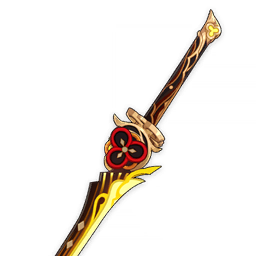</th>
      <th style="padding: 0; vertical-align: top;">
        

          

        锦之花与龛中剑
        

          

          

            
            普通攻击造成的伤害提升16%，元素战技造成的伤害提升24%；队伍中附近的角色在场上造成岩元素伤害后，上述效果进一步提升100%，持续15秒。此外，装备者的防御力提升20%。
            

            曾由著名的风雅之士有乐斋亲自监制的名剑，传说在过去数百年间不尝斩过活物。
            
            

        

      </th>
    </tr>
    <tr>
        <th colspan="2" style="font-weight: normal;">
         <strong>故事：</strong> 
        传说狐族的有乐斋曾乘醉酒狂兴斩断林中芝居的金漆御簾，与妖狸之长结了冤家。 
其佩剑因此得名，而那夜月下妖狐狂乱的剑舞亦被除妖狸之外所有看客引为逸事。 
后来，据说有乐斋为向筹办芝居的妖狸赔罪，让出了贵重的茶器与诸多其他宝物。 
而在事发前与他仅有一面之缘的「大手门」，因居中调解而获赠名刀「御簾切」。
  
与坊间传说稍异。此公不仅是与堇瓜树鏖战的怪人，亦稍通风雅，好演剧、玩物与衣着。 
投身征战时，往往以身披金色锦缎裁剪成的秋草云缝箔，面着艳丽油彩的奇异形象示人。 
然而不论古籍或话本中，都未曾有人描绘过他在最后一战中持饰金名刀「御簾切」之姿， 
在诸多逸事与史话中，他的武器始终都是那一如他的名号，念起来相当长且拗口的大刀。 
尽管画卷中有描绘他两手各执一大一小双剑，如分开浪潮般斩落涌来的黑色妖异的雄姿， 
但终究据彼时权威的《名物帐》，「御簾切」在变故前某年夏天已为「大手门」所遗失。 
也因此在酒后讨论演义故事的人的心中，不知是否曾经杀敌的「御簾切」总是引人遐想。
  
在不通文字以歌谣号子传说历史的鬼族中，则有与《名物帐》记载相异或相补充的故事。 
在祭典的一次摔跤比赛后，「大手门」竟将名刀「御簾切」赠予了并非武家出身的裁缝。 
似乎是少女为他重新缀补了阵羽织上松脱的一朵金花，他便以此腰物作为报酬交予了她。
  
「说什么不用报酬。这样吧，就用我的这把刀跟你的剪子交换吧！这样就不算报酬了！」 
「啊？说什么呢，怎么不能拿来裁布了！你这小姑娘，说起话来倒像个无趣的臭天狗！」 
「『平民武家有别』又是什么借口！你用小剪刀能裁布，那长铗裁布应该更好使才是！」 
「才不是！我送你这剑，是因为它的原主婆婆妈妈，说什么名物应该供在壁龛里赏玩。」 
「…不是送你，是交易！与其让那老狐隔三差五问我刀怎么样了，不如给你裁布制衣！」 
「你又在骂我，我听到了！哇呀，提起嗓门是什么意思！算了算了，你给我瞧好了——」
  
说着，鬼将忽地站起身来，抽名剑出鞘，清冷的剑刃映着祭典的烟气与月光。 
然后毫不迟疑地斩下自己一袖，收剑回鞘，正襟危坐地将织锦长袖一同献上。 
平时在町人面前嬉笑怒骂、小节不拘的鬼人武者，严肃起来也稍显凶神恶煞。
  
「你看，即使我这样并非裁缝的粗人，使这柄刀也能利落裁布！不要太看不起人了！」 
「请一定要收下这柄名剑，因为我相信只有你能好好利用它，我只会把它磕碰坏了。」 
「你要我当作传家宝保管？哈哈，我又不是没想过！但名刀派不上用场，难免寂寞。」 
「那样的话，等哪天有乐斋来了，一定会笑话我是个粗人，无聊、不懂风情之类的。」
  
面对其时鬼人突然显露出的严肃面相，着实将那平民家的裁缝少女吓得不轻。 
待她战战兢兢收下过于贵重的谢礼，自作聪明的武人才大笑数声，满意离去。 
「大手门」便又在村民町人当中赢得了「大傻瓜」的美誉，他倒也并不反感。 
尽管他总喜怒过常，在不长不短的一生中倒交了许多朋友，保护了不少性命。 
事后编织无字的锦画卷，以此供养保护了无数性命的神、狐、妖、鬼、人时， 
裁缝也为未能将名刀归还于他，助他杀敌的遗憾，为他设计了执双刀的威仪。 
但那是之后的事了。在那之前，有乐斋还要为之流落民家而哀叹一些年月呢。
  
鬼族同姓的后人在见到手执华丽如故名刀，却不再是少女的裁缝时，回忆道： 
「伯父在擦拭刀时常叹息，怪有乐斋大人将美物托付给了自己这样的粗人。」 
「『此物应尽享人世一切繁荣瑰美，我又怎忍心以杀伐与忿怒玷污它呢？』」
  
言归正传。少女发现这刀在战场之外的妙用时，距离编织那副画卷的未来尚有时日。 
当时，鬼人千代身着无比华丽的十二单执剑而舞的身姿，有如春日风中落花般绚烂。 
        </th>
    </tr>
  </thead>
</table>

### 天目影打刀

<table  class="table-weapon">
  <thead>
    <tr>
      <th class="th-weapon" rowspan="1">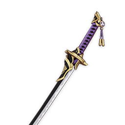</th>
      <th style="padding: 0; vertical-align: top;">
        

          

        岩藏之胤
        

          

          

            
            施放元素战技后，获得1个胤种，该效果每5秒至多触发一次。胤种持续30秒，至多同时存在3个。施放元素爆发后，会清除持有的所有胤种，并在2秒之后，基于消耗的胤种数量，每个为该角色恢复6点元素能量。
            

            传说中连以神速见长的天狗都能斩落的名士订制的刀。
            
            

        

      </th>
    </tr>
    <tr>
        <th colspan="2" style="font-weight: normal;">
         <strong>故事：</strong> 
        名刀「薄缘满光天目」的其中一柄影打。 
由岩藏流初代宗主「道胤」赠予柴门家， 
报答他在自己隐居绀田村时受到的关照。
  
传说中岩藏流的秘剑「天狗抄」是内心中不能有一丝迷惘，才能使出的剑技。 
「天狗抄」之名在过去音同「天狗胜」，是连自在空行的天狗也能切落之剑。 
在数百年间，承袭「胤」之名的岩藏剑豪在稻妻诸岛施展秘剑，斩妖邪无数。
  
据说「天狗抄」最初完成时，是在一间不再有香火的小社院内。 
秘剑威力之大，将屋舍尽数摧毁，而岩藏道胤的刀也断为两截。 
在这之后，凭借剑术他创立了岩藏流，成为了九条家的指南役， 
并向当时的天目定制了随胤之名流传的名刀「薄缘满光天目」。
  
那把刀的事迹有着诸多传说，据说锋利得连人的缘分也能斩断。 
至于冗长的刀号，传说是岩藏道胤在定制时向天目特别指定的。
        </th>
    </tr>
  </thead>
</table>

### 笼钓瓶一心

<table  class="table-weapon">
  <thead>
    <tr>
      <th class="th-weapon" rowspan="1">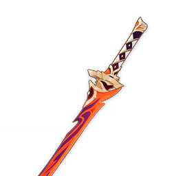</th>
      <th style="padding: 0; vertical-align: top;">
        

          

        澄澄一心传
        

          

          

            
            普通攻击、重击或下落攻击命中敌人时，将卷起切落风，造成180%攻击力的范围伤害，并且使攻击力提升15%，持续8秒。该效果每8秒至多触发一次。
            

            于遥远北国诞生之名刀，曾在归乡路上沾染无数罪恶，只为「一心」二字。
            
            

        

      </th>
    </tr>
    <tr>
        <th colspan="2" style="font-weight: normal;">
         <strong>故事：</strong> 
        受冠「一心」之名的血色长刀，刃锋极利，拥有不祥的色泽。 
据说能够将多孔的竹笼，连同其内未及泄出的清水一斩两半。
  
世人常言说，刀剑之内，自茎到切先都有神灵寄宿， 
那么「祟神」所造刀中，住的自然是怨恨的恶鬼吧… 
赤红的名刀「笼钓瓶」，出自未能成为惣领的刀工赤目兼长之手。 
然而，这柄刀并非来自稻光与玉钢之国，而是在雪原的北国锻成。 
月光下细观，妖红的锻纹在刀身流淌如水，仿佛离乡流人的血泪。
  
「所谓『祟神』本是大邪之物，其中蓄积对浮世愿景的憎恨。」 
「刀剑是大凶之器，非邪祟不能主焚戮，非怨憎不能明血色。」 
「所谓『一心』乃抛却冗余念想，为纯粹的目的而锻打不辍。」 
「也即，以对活物的怨憎为原料，锻造真正能斩落活物的剑。」
  
怀着对「一心」的狂热执念，赤目一门始终追逐「斩人剑」所能达到的终极。 
因此，其门下多为孤僻短寿之人，周身与心中皆是大毒物所留下的刻疮印痕。 
赤目门人所锻炼之腰物因此虽锐利，却多有魔性，最终被官家评为「不良」。 
是故，赤目刀锻冶实长的「一心传」惣领之职并未下传三代，便为官家所夺。
  
再后来，赤目兼长为倾奇者之案波及，犯下了大逆之罪， 
由此改易改姓远走雪国，方在冰冷的明威之下谋得生路。 
亡人枫原只望能教「一心传」得获为刀所醉者的大喝彩， 
但刀工亦是刀，「祟神」亦是刀，都只不过是为人所用的器物、名号罢了…
  
「为这『一心』的虚名蹉跎半生，待到如愿，我竟也成了一个『枫原』！」 
「哈哈，也罢，也罢了。只希望冰霜淬出的剑，不会像这虚名一般软弱…」
  
枫原一族博闻强识，作品最具真砂丸风骨；丹羽一族宅心仁厚，以烧刃见长。 
怀着对「一心」的狂热执念，赤目一门始终追逐「斩人剑」所能达到的终极。 
薄葬雪原时，亡人只期望名刀一本、枫原之名能顺利抵返故里，为人所惊叹… 
        </th>
    </tr>
  </thead>
</table>

### 东花坊时雨

<table  class="table-weapon">
  <thead>
    <tr>
      <th class="th-weapon" rowspan="1">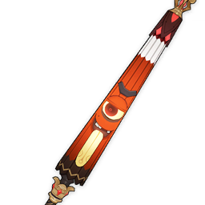</th>
      <th style="padding: 0; vertical-align: top;">
        

          

        怪谭·时雨心地一本足
        

          

          

            
            攻击命中敌人后，会为命中的一名敌人施加「纸伞作祟」状态，持续10秒。该效果每15秒至多触发一次；持续期间该敌人被击败时，将清除该效果的冷却时间。装备者对处于「纸伞作祟」状态下的敌人造成的伤害提升16%。
            

            稍微有些特别的油纸伞。尽管长久的旅行中已经习惯风雨，与之一同静赏雨景或许也有其中妙趣。
            
            

        

      </th>
    </tr>
    <tr>
        <th colspan="2" style="font-weight: normal;">
         <strong>故事：</strong> 
        「稻妻的伞，与其说是用来遮雨的工具，不如说是一种独特的工艺品。无论是竹柄的触感、伞面的纹饰，还是油纸在水尘下濡染的淡色，都显得细腻而精致。每次经过窄巷，看到这样的伞挂在店铺前，我都会不由自主地想起一件事。据说，曾经有一把伞，闹得整个町街不得安宁。故事是这样的： 
「距今数百年前，某个节祭之日，正值花见之时，百狐欢游、众狸谐戏，就连平日不苟言笑的天狗们，也与人们一同酌酒谈笑。其间，最惹人注目的，则是一位手持华伞的少女——饮过鬼族的美酒，兴起之时，倾泻而下的夜月中，少女如花吹雪般起舞，无论是妖怪还是人们，都不由得为她的舞姿喝彩。后来，随军出征之时，少女不幸陨落，而她珍爱的那把伞，也被她忠诚的眷属们捐赠给了神社。
「一位出身显赫的武家之女，前往神社参拜时，见到这把伞，不由心生喜爱，于是便出高价将它买下。次日，恰逢雨天，她本想持伞出游，孰料还未更衣，便从远方传来了她夫婿战死的噩耗。那姑娘悲痛欲绝，没过几天，竟一病不起、撒手人寰了。待丧葬完毕之后，她买下的那把伞，便被她的父母视作不吉之物，再度捐赠回神社、束之高阁。 
「谁知，过了几个月，便渐渐开始有传闻，说是在雨夜的町街，有前所未见的妖怪作祟。据说，那妖怪看上去像是一把伞，只是比青年男子还要高，独眼、独腿，还生着一条长长的舌头，若是有人独自走夜路，那妖怪便会突然跳出来，用舌头舔舐过路人。用枫丹人的目光来考量，那妖怪与其说是在作祟，倒不如说是在恶作剧。话虽如此，彼时，无人知晓那妖怪究竟有何意图，一时间，町街人心惶惶，年轻女子不敢出门，生怕遇上那妖怪。老人们都叹息说，若是那几位大人尚在，这样的小妖怪想必也不敢作祟吧——可如今，就连退治这种小妖怪的办法，都没有多少人知道了。 
「后来，有位年轻的巫女听说了这件事，便从神社中取出了那把伞，以木勺舀起清水，自伞簳至伞尖细细冲洗后，又以绢帛将伞面反复擦拭了几回，对它说： 
「『虽然昔时之雨已不再复，明日之后仍是明日。若是那位大人尚在，亦不忍见您如此吧！』 
「遂令人将那把伞供奉在神社的偏殿，自此，便再也没有人听说过伞妖作祟的事情了。 
「我是从一位稻妻的友人那里听到这个故事的。只不过，我在鸣神各地的神社探访了很久，也没人听说过供奉伞的事情。当我将这件事告诉那位友人时，她不禁笑了起来： 
「『不会吧，洛柯蒂小姐 ，您莫非把怪谈当真啦？』」 
        </th>
    </tr>
  </thead>
</table>

## 双手剑

### 赤角石溃杵

<table  class="table-weapon">
  <thead>
    <tr>
      <th class="th-weapon" rowspan="1">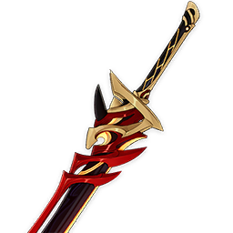</th>
      <th style="padding: 0; vertical-align: top;">
        

          

        御伽大王御伽话
        

          

          

            
            防御力提高28%；普通攻击与重击造成的伤害值提高，提高数值相当于防御力的40%。
            

            依据过去的主人的说法，这是何等鬼怪精妖都能打跑的大杵「赤角石见石溃金涂金啮御狮子」。
            
            

        

      </th>
    </tr>
    <tr>
        <th colspan="2" style="font-weight: normal;">
         <strong>故事：</strong> 
        全名是「赤角石见石溃金涂金啮御狮子杵」， 
是自称「御伽金刚狮子大王」的怪人的爱刀。
  
……不过由于两者的名字实在过于冗长拗口， 
孩子们称刀为「赤角大杵」，唤刀主叫「御伽大王」。
  
赤角大杵可是用入魔的般若断角制成的武器， 
什么妖狐、妖狸、恶鬼，都被打得跪地求饶。 
哪怕是「影向山灵善坊」这样有名的大天狗， 
都惮于大杵的森森鬼气，不敢在大王前现身！
  
——这些故事自然是连小孩子都不会相信的。 
虽然御伽大王确实有力气，七个人一起也不能把他推出土俵。 
看到摘不到果实的小孩，就一脚踢在树上，让菫瓜簌簌落下。 
但有次不小心把果树踢倒了，被老人一路追着逃到了山上去。 
他也曾经带着孩子们闯进官家饮酒赏红叶的歌会， 
大声叫嚷着「御伽金刚狮子大王来退治恶鬼了！」 
与兴致正好的娇小鬼人摔跤，当然结果惨不忍睹。
  
大王的能耐不过如此，连背负将军旗印的资格也没有， 
又怎么能够让那些歌谣中的大妖怪拜服呢，孩子们说。
  
「之前不过是对月痛饮，患了风寒罢了！」 
御伽大王即使是辩解，也不忘爽朗地大笑。 
真不知是寡廉鲜耻，还是真有得胜的自信…
  
「这次我一定把妖怪的犄角折下带回来，」 
「给你们看看御伽金刚狮子大王的能耐。」 
「渡海而来的大怪物，也不是我的对手！」
  
「所以就尽管跟着狐狸的使者躲起来吧。」 
「哎呀，等老子回来，再陪你们玩摔跤。」
  
虽然提到摔跤二字，孩子们想到的是娇小鬼人轻哼一声， 
便将咆哮着猛冲而来的御伽大王高高抛到天上去的景象…
  
再之后，与御伽大王比试摔跤的鬼人断臂折角后遁逃， 
影向山的大天狗也避世隐居山林，不曾再在人前露面。 
就结果而言，吹嘘这把奇形大刀的话的确算是成真了， 
游手好闲的怪人御伽金刚狮子大王，却没有再现身过。 
后来，怪人踢倒的菫瓜树经细心护养再度结出了果实。 
        </th>
    </tr>
  </thead>
</table>

### 桂木斩长正

<table  class="table-weapon">
  <thead>
    <tr>
      <th class="th-weapon" rowspan="1">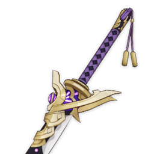</th>
      <th style="padding: 0; vertical-align: top;">
        

          

        名士振舞
        

          

          

            
            元素战技造成的伤害提升6%。元素战技命中后，角色流失3点元素能量，并在此后的6秒内，每2秒恢复3点元素能量。该效果每10秒至多触发一次，角色处于队伍后台也能触发。
            

            过去在踏鞴砂打造的刀，沉重而坚韧。
            
            

        

      </th>
    </tr>
    <tr>
        <th colspan="2" style="font-weight: normal;">
         <strong>故事：</strong> 
        踏鞴砂过去的某一任目付设计的长卷。 
据说与其人一般有着朴实刚正的性格。
  
在引入远国的技术制造「御影炉心」前，漫长的时间里， 
踏鞴砂所采用的冶炼方法一直是传统的「踏鞴制铁法」。 
御舆长正担任目付后，一度痴迷于钢铁的冷峻之美当中。 
他向同样热衷于刀剑锻冶的宫崎造兵司佑兼雄请教心得， 
最终亲手造出了这一柄坚硬朴实的大刀「大踏鞴长正」。
  
虽然不过是御舆家的养子；虽然养母让御舆之名被染黑； 
虽然御舆的嫡子道启抛弃了孑然一身的自己，销声匿迹； 
但他自诩的愚钝、实际的忠义令他百倍珍惜御舆的名号。 
努力进入官府，并以百倍的勤奋与清明，洗刷家族污名。
  
就算自己的寄骑桂木有一丝的渎职，也毫不留情地斩落。 
在那之后，这把刀的名字与他的别称，就永远地改变了。 
        </th>
    </tr>
  </thead>
</table>

### 恶王丸

<table  class="table-weapon">
  <thead>
    <tr>
      <th class="th-weapon" rowspan="1">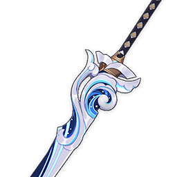</th>
      <th style="padding: 0; vertical-align: top;">
        

          

        驭浪的海祇民
        

          

          

            
            队伍中所有角色的元素能量上限的总和，每1点能使装备此武器的角色的元素爆发造成的伤害提高0.12%，通过这种方式，元素爆发造成的伤害至多提高40%。
            

            传说中「恶王」的爱刀，刀身庞大雄伟，但挥舞起来却出乎意料地轻便。
            
            

        

      </th>
    </tr>
    <tr>
        <th colspan="2" style="font-weight: normal;">
         <strong>故事：</strong> 
        曾属于出身海祇的猛将所使的刀。 
据说他的剑技仅有我流的「月曚云」与「夕潮」二式， 
但凭此二式秘剑在战场与试合不曾败在任何人的手下。
  
常言蛇与鱼皆冷血。但冷血之物却醉心于炽热的愿景。 
为了实现子民的幻梦，大御神向集聚的雷云发起挑战。 
追随海祇踏上征服之路的凡人中，一位少年脱颖而出。 
因其勇猛无畏受到海祇的恩宠，获「东山王」之封号。 
最终许多年以后，王号被淡忘，又被敌人的蔑称取代： 
「恶王」、大蛇的凶恶爪牙、酷烈侵攻八酝岛的魔王…
  
厮杀让少年变成了海盐般粗砺的战士。但对他而言， 
只有出征前在神社旁对海中月许下的愿望不会灭却。
  
「终有一天我要高踞影向山之上，俯瞰雷王居城，」 
「在天守屋顶，与传说中的影向大天狗快意对决。」 
「然后，把面具带给菖蒲和曚云阿姐做伴手礼吧！」
  
最后，浪潮如融化沙上楼阁般卷走了所有的梦想。 
如同赤红之星的天狗假面在乱战中如海砂般粉碎， 
如同深海月光照亮往日少年心灵的巫女不再复归， 
而「恶王」也随着大蛇直面化作一线的耀眼稻光。
        </th>
    </tr>
  </thead>
</table>

## 长柄武器

### 薙草之稻光

<table  class="table-weapon">
  <thead>
    <tr>
      <th class="th-weapon" rowspan="1">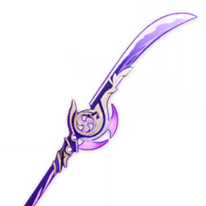</th>
      <th style="padding: 0; vertical-align: top;">
        

          

        非时之梦·常世灶食
        

          

          

            
            攻击力获得提升，提升程度相当于元素充能效率超出100%部分的28%，至多通过这种方式提升80%。施放元素爆发后的12秒内，元素充能效率提升30%。
            

            用于「斩草」的薙刀。对向此物之军势，也会如苇草般倒下吧…
            
            

        

      </th>
    </tr>
    <tr>
        <th colspan="2" style="font-weight: normal;">
         <strong>故事：</strong> 
        所谓薙刀，乃是斩除芜杂之利器。 
秉薙刀之人，意在守护恒常之道。
  
当高踞雷云之上者俯视她所倾心的凡世， 
所见无不浅薄的争端，闪灭的执欲泡影… 
争夺源于无谓爱执与狂欲，乃恒世之敌。 
搅扰不变恒世的杂草，将交由雷光殛灭。
  
「那么——在███的瞳仁里，又会映出怎样的永恒呢？」 
依然清晰静滞的回想中，樱树下把酒对饮的那位神人问道，
  
真是无谓的问题啊。 
虽然彼时给出的答案因为酒已经不记得了， 
但如今孤孑者在无数次追忆中得到了答案。 
甘美之实需要疏果，绀染之物需要末摘花。 
在永恒的常寂光土，任何芜杂都不应容赦。
  
「尽管如此呀，尽管如此…」 
「以威权刃光薙除蔓生的执妄，消灭梦想从容生灭的可能…」 
「如此不容争端、无所得失的寂静之世，将是失忆的迷途。」 
在永恒的心脏之中，昔日友人如是丁宁，绯樱气息恍如今日。
  
但我永远不会忘记你。正如我不会忘记千百年来逝去的一切。 
毕竟哪…
  
毕竟目睹了深黑的湮灭将珍重之人淹没的景象， 
又如何不视理不尽的生灭、无解的羁缘为死仇。 
既然谁人都无法逆转现世之无常、绪绝的独乐， 
那就将心中的常世净土带到她所珍爱的国度吧。 
        </th>
    </tr>
  </thead>
</table>

### 喜多院十文字

<table  class="table-weapon">
  <thead>
    <tr>
      <th class="th-weapon" rowspan="1">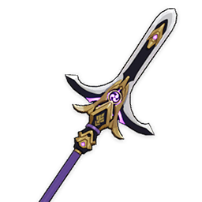</th>
      <th style="padding: 0; vertical-align: top;">
        

          

        名士振舞
        

          

          

            
            元素战技造成的伤害提升6%。元素战技命中后，角色流失3点元素能量，并在此后的6秒内，每2秒恢复3点元素能量。该效果每10秒至多触发一次，角色处于队伍后台也能触发。
            

            曾经在八酝岛守望「祟神」的枪法名士所用的特殊长枪。
            
            

        

      </th>
    </tr>
    <tr>
        <th colspan="2" style="font-weight: normal;">
         <strong>故事：</strong> 
        由喜多院文宗为了自己的枪法设计的异形战枪。 
在外行的手中，特异的配重会使操纵十分困难。 
但在会用的人手中，能发挥格外强大的破坏力。
  
喜多院在遥远的过去，原本是诛灭「祟神」的家系， 
也在过去的诸多世代中，担任着「八酝守」的责任。
  
在过去的历史中，稻妻土地上曾经流传有一首童谣： 
「大手门荒泷、胤之岩藏、长蛇喜多院、雾切高岭」 
来形容如同欃枪般，曾经一度照亮大地的耀眼武人。 
其中原本有许多其他名字，但都随着历史被抹去了。 
常年身为樊篱诛杀妖邪者，难免会饮下瘴晦的污血。 
        </th>
    </tr>
  </thead>
</table>

### 「渔获」

<table  class="table-weapon">
  <thead>
    <tr>
      <th class="th-weapon" rowspan="1">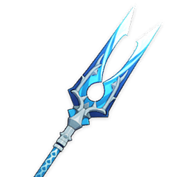</th>
      <th style="padding: 0; vertical-align: top;">
        

          

        船歌
        

          

          

            
            元素爆发造成的伤害提升16%，元素爆发的暴击率提升6%。
            

            在久远的过去，曾经闻名稻妻的大盗爱用的枪。
            
            

        

      </th>
    </tr>
    <tr>
        <th colspan="2" style="font-weight: normal;">
         <strong>故事：</strong> 
        过去稻妻有名的大盗，爱用的倒钩刺枪。 
本是猎鱼的铦枪，但在战斗中也很趁手。 
据说连执剑的魔偶，都曾被他刺穿带走。
  
「哈哈，以前的我曾是这『清籁丸』的主人。」 
「领舰十数艘，以清籁的不死之鬼之名驰骋。」 
「如今的我，就像漂流在海上的树叶一般哪。」 
「如果不是多亏了蛇目和那些海岛上的弃民，」 
「就连再次起帆，踏上故乡的土地都做不到。」 
「但如今，我的清籁竟然变成了这番模样哪。」 
「稻妻列岛中，也没有我所能容身的地方了。」 
「连神社那个爱瞎操心的老巫女，都不见了…」
  
曾被称为赤穗百目鬼的贼人感慨道。接着他说… 
「蛇目老弟！我现在是世界上最自由的人了！」 
「巫女阿姨！你原本不是说想去看看世界吗？」 
「像你念叨的惟神和昆布丸，去过什么地方，」 
「就由我赤穗百目鬼左卫门，替你去看看吧！」 
「世界尽头究竟长什么样子，就让我去见识！」
  
「在所有航道的终点，我们一定会再见面的！」 
「到时候，就轮到我对你唠叨远国的故事啦！」 
        </th>
    </tr>
  </thead>
</table>

### 断浪长鳍

<table  class="table-weapon">
  <thead>
    <tr>
      <th class="th-weapon" rowspan="1">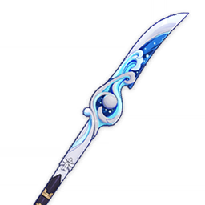</th>
      <th style="padding: 0; vertical-align: top;">
        

          

        驭浪的海祇民
        

          

          

            
            队伍中所有角色的元素能量上限的总和，每1点能使装备此武器的角色的元素爆发造成的伤害提高0.12%，通过这种方式，元素爆发造成的伤害至多提高40%。
            

            以海渊之下的闪亮材质打造而成的薙刀，一度曾为天狗一族所有。
            
            

        

      </th>
    </tr>
    <tr>
        <th colspan="2" style="font-weight: normal;">
         <strong>故事：</strong> 
        海祇名将「海御前」的薙刀，其刃锋流淌着海渊的磷光。 
其人过去令鸣神水军胆裂的事迹，在绵长的岛歌中流传。
  
双子的海祇巫女哼唱的鲸歌，曾随浪潮的漂流至岛民梦中。 
海祇的勇士们，无不将希望与斗志寄托在双子的巫女身上。 
随先阵高举的白若浪末的长卷，高叫着向其他的岛屿前行。 
但是，大御神与其麾下将星的光采，终究不如闪雷明亮哪… 
曚云最终被漆黑的鸦羽淹没。与她们合唱的巨鲸沉没海床。 
如小童般执着的先阵藩王则消失在了大地的一线裂口当中。
  
「海御前」就此湮没在波涛中，幻化成列岛共同的传说， 
或言她为夺回战友残躯单骑闯入天狗军阵中，力战身死； 
或言她就此隐姓埋名，操旗舰启航前往世界边缘的暗海… 
能证明她在此世兴风作浪的，仅余这柄依旧锋锐的薙刀。
  
只要海上仍有波浪扰动，那歌曲的记忆就会流转下去吧。 
传说在海螺与沉没深海的巨鲸腹中，仍能听见歌的回音。
        </th>
    </tr>
  </thead>
</table>

### 且住亭御咄

<table  class="table-weapon">
  <thead>
    <tr>
      <th class="th-weapon" rowspan="1"></th>
      <th style="padding: 0; vertical-align: top;">
        

          

        好事者奔行灯
        

          

          

            
            施放元素战技时，提高20%攻击力和10%移动速度，持续10秒。
            

            过去曾有以行灯焰火为形于稻妻四处奔行的妖怪，这也是其曾经寄身的一处灯盏吧。
            
            

        

      </th>
    </tr>
    <tr>
        <th colspan="2" style="font-weight: normal;">
         <strong>故事：</strong> 
        传说野地如磷火飘荡的鬼焰之中，也藏有稻妻古时灵体的精魄。 
那时喜欢听取秘密的无形妖怪借由火焰的形体穿梭围炉与火钵， 
在柴禾燃烧的噼啪响动中，窃取那些捧茶而谈的人述说的隐秘， 
而后将一切有意思的故事都在夜行者的盛宴上一一道出，毕竟， 
所谓「御伽众」本就为提供这些，以供诸多大人酒间消遣之乐。
  
「啊，今宵如此欢快，希望此后岁月中亦能有如今宵之时。」 
身处上座，被一众妖狐簇拥着的白辰狐主带着遗憾如此感慨。 
「时间啊，时间若能停在此处就好了。」如是说着，端起酒碗， 
为台上藉藉无名且地位卑微的小妖赐予「且住亭」这一名号。
  
只是世上大多数的事都不为人所愿，就像哀苦所祈之物往往并不可得。 
而白辰的主人生出一瞬的悲寂之心，也在漆黑浪潮侵蚀之中得到应验。 
世上再无夜行的百妖如是酣畅的时刻，而灯火之侧亦空余恸哭与哀嚎。 
在这场惨烈绝伦的战场之中，有昔日倚靠戏言取乐的自己存身之处吗？ 
但一想到那位为自己赐名的大人，妖力羸弱的小妖怪亦决定放手施为。 
天幕受阴影遮蔽的时日，它燃烧自己的魂灵，在诸多火焰中四处奔行， 
昔日俱述滑稽事物的口舌，也被用于详细递说诸多战场的战况与敌情。
  
只是长久的奔波带来的损耗积重难返， 
分神太多的妖怪几乎因此磨尽了神魂。 
行灯之中，再也无法述说精妙的言语， 
甚至就连过往珍贵的回忆也散落四处。
  
而今，据说神智模糊的妖物忘却了一切， 
唯有在众人云集，谈天说地时才会出现。 
或许那述说者一一讲述幻梦奇谭的氛围， 
能让其稍稍想起，再无法复归的过往吧。 
        </th>
    </tr>
  </thead>
</table>

## 法器

### 不灭月华

<table  class="table-weapon">
  <thead>
    <tr>
      <th class="th-weapon" rowspan="1"></th>
      <th style="padding: 0; vertical-align: top;">
        

          

        白夜皓月
        

          

          

            
            治疗加成提升10%；普通攻击造成的伤害增加，增加值为装备该武器的角色生命值上限的1%。在施放元素爆发后的12秒内，普通攻击命中敌人时恢复0.6点元素能量，每0.1秒至多通过这种方式恢复一次元素能量。
            

            出自深海的美玉之环，闪烁着清澈如月的光泽，一如遥远往昔。
            
            

        

      </th>
    </tr>
    <tr>
        <th colspan="2" style="font-weight: normal;">
         <strong>故事：</strong> 
        珊瑚宫的纹章「真珠海波」，传说描绘的是怀抱海祇的波浪， 
与明亮的真珠。但也有大御神的玉轮如月永照珊瑚国土之说。
  
珊瑚与海绵丛生的深海之梦中，流云与海砂共舞的渊下之底， 
与海祇同梦而眠的神子们，血脉中代代传承永不幻灭的希望。 
高天的色彩永恒变幻，在海渊之下亦投射着不定形态的光影… 
深暗海渊无法掩盖的慈悲华彩，如此在宁寂的极乐之中弥散。
  
在那些年代里，最初的现人神巫女曾以明珠般的智慧导引同胞， 
又在初见天光的人中挑选神人，与御子神一同扶助惧怕白日者， 
日后将令鸣神水军心惊的「海御前」，也曾同她们哼唱鲸之歌， 
与空游海月共舞，描画「键纹」的形象。
  
一些岁月之后。一线的霆威拒否海祇民的幻梦。 
向雷暴蛇行，必然是要面对闪电的无情权现吧… 
但是常怀真珠之心的神子巫女，永远不会忘却。 
无数的故事与感念与海玉之轮将会永远传下去， 
并在这当中，散发出愈发美丽的光芒吧。
  
不论是折下玉枝，还是孕育珍珠的史话， 
抑或是征服深海之邪物，又将阳光带给苍白的渊下一国之事； 
曾梦想屹立影向的少年获「恶王」之名，与天狗决斗的壮绝… 
一切都将如月光下的海波，如漫天珍珠般照亮海祇之子的心。 
将丧失的痛楚送给静静翻腾的咸水，将耀眼的明珠就此珍藏。 
让神代的事话与牺牲，与「真珠海波」的纹样永远流传下去。
  
即使雷云日渐集聚，紫电之威凶险难测， 
海祇的月华也将透过云霭，播撒皓光吧。 
        </th>
    </tr>
  </thead>
</table>

### 神乐之真意

<table  class="table-weapon">
  <thead>
    <tr>
      <th class="th-weapon" rowspan="1"></th>
      <th style="padding: 0; vertical-align: top;">
        

          

        神樱神游神乐舞
        

          

          

            
            施放元素战技时，将获得「神乐舞」的效果，使装备该武器的角色的元素战技造成的伤害提高12%，该效果持续16秒，至多叠加3层。持有3层时，该角色获得12%所有元素伤害加成。
            

            表演神乐之舞时所用的神铃，为宫司所赐福。神樱之香萦绕其上。
            
            

        

      </th>
    </tr>
    <tr>
        <th colspan="2" style="font-weight: normal;">
         <strong>故事：</strong> 
        曾几何时在御前献艺起舞，丁宁的铃音恍若悠转至今。 
曾经追随那远去的白色身影，心向不可即的未醒之梦…
  
「那时的我不过小小呆物，灵智怎敢比及白辰主母大人」 
「莽莽撞撞，如在雪中觅食一般，企望着赢得殿下瞩目」 
「想也可笑，正因这笨拙无畏，我幸而得到殿下的垂怜」 
「就这样呀，我获得了随侍殿下，捂手暖足的小小殊荣」
  
「后来呀，斋宫大人不再复回，以往的前辈们因故失散」 
「寡才如我之辈才接下了『神子』之职，方得成长如斯」 
「这样一来，逗殿下开心的责任，便不幸落在我的身上」 
「初次献上神乐之舞的那夜，方知『往昔』乃何种重负」
  
铃音远去，如师亦友的银白大狐消失在如梦远逝的长河， 
铃音复回，无归旋流中，顽固的沙洲亦将逐渐松动解融。 
故人尚且随和晏晏的纯白身影，早已化入了漆黑的记忆， 
狐仙一族的孤女接过神乐之铃，为鲜活的「现在」而舞。
  
曾结识年幼固执的天狗，借「锻炼」之名唬她循山苦行， 
却感其无羁的身姿，遂将这孩子举荐给九条的死脑筋们。 
又曾与不服输的鬼族斗法，果然败于那家伙超常的毅力… 
但不才如我略施小计，却也让斗法本身更添了几分妙趣。 
曾与远国的半仙互有通信，以鲜美滑柔的海中莼草相赠， 
亦深觉不容理解所爱的淳愚之爱，于仙众而言莫非羁束？ 
夜夜御苑的月色透过树枝与花瓣，洒落在空明的庭院里。 
依旧美得如同无数晶莹珍珠那般，在我浅薄的心中闪光…
  
「在这短暂的数百个春秋，我亦曾以多重身份奔走世间」 
「虽不曾有幸与碌碌凡者结得良缘，却得深知人之美丽」 
「被我斗胆视为挚友的殿下，想必更有无穷的时间游览」 
「共览这不完美的世间，享受其爱憎离合的执欲之乐吧」
  
殿下长久沉溺于永恒愿景的梦景里，总要有人守望众生， 
为平镇恶鬼「黑阿弥」的怨怒，曾稍显露身凭不祥之物， 
为安抚秃狸小三太的大骚动，亦曾以微薄法力将之戏弄。 
侵扰诸岛的海贼林藏，最终因小小离间计策而众叛亲离， 
而那如若白纸，永不受日月所损的倾奇者… 
期望「他」能走上正途，而不成为祸患吧。 
剑豪漆黑的残魂、隐伏神林的灾异之兽，亦被尽皆平祓… 
与殿下追逐的永恒一梦相比，这些不过瞬息即灭的插曲， 
等待殿下醒转的日子仿佛无穷尽，但我自认有的是时间。
  
「毕竟相比无风无月的净土中，那永不凋零的莲与优昙」 
「俗气如我者可耐不得这种寂寞，无心无梦者未免无聊」 
「莫如呆笑着醉折雷樱花枝，同放肆的妖怪们流觞欢闹」 
「这些呀，都是并不遥远的过去，亦是充满希望的将来」 
「不知待到雪融之刻，还能否随同殿下共赏那淡紫初芽」 
        </th>
    </tr>
  </thead>
</table>

### 寝正月初晴

<table  class="table-weapon">
  <thead>
    <tr>
      <th class="th-weapon" rowspan="1"></th>
      <th style="padding: 0; vertical-align: top;">
        

          

        一汤二鹰三鸣神
        

          

          

            
            触发扩散反应后的6秒内，元素精通提升120点；元素战技命中敌人后的9秒内，元素精通提升96点；元素爆发命中敌人后的30秒内，元素精通提升32点。
            

            由澄澈的紫玉锻造而成的铃灯，据说置于枕边便能唤来幸福的美梦。
            
            

        

      </th>
    </tr>
    <tr>
        <th colspan="2" style="font-weight: normal;">
         <strong>故事：</strong> 
        「因为在梦中见到了钱汤，错认为已经抵达了集合地点，所以起得稍晚了一些。」 
睡眼惺忪的少女以惯例的冷漠掩盖自己的羞愧，向同行的友人解释迟到的缘由， 
不愿坦率承认自己只是在新年的第一天睡过头，将责任推诿于梦中温暖的钱汤。 
  
「常言昼想夜梦，没想到平日如木石般的巫女小姐，居然这么期待这次的休假。」 
「哎呀，可惜呐，可惜，高岭大哥没空来，只有小生我和长正能陪你…疼疼疼！」 
「真是的，分明做了别人羡慕都羡慕不来的吉梦，别总板着脸，笑一笑也好嘛。」
  
浮浪轻薄的少年半是戏谑半是认真地说着，却又被清籁的少女狠狠瞪了一眼。 
少年如求援般地将视线投向鬼人的养子，而刚直的学徒只是默默移开了视线。
  
日后被尊为阴阳术开祖的少年所说并非戏言，稻妻确有如此风习， 
所谓「一汤二鹰三鸣神」，新年初梦所见的景象，常被认作吉兆， 
钱汤寓意着祛病延年，鹰寓意着高步云衢，鸣神则寓意心想事成。
  
只是自那时起，巫女的梦中便再也没有出现过钱汤之景， 
而那无忧无虑的嬉闹岁月，那如同响铃一般的欢声笑语， 
终如钱汤弥漫的温存水雾，悄然消散在无数冰冷的梦中。
  
……
  
「这次与你赌上一把，如何？嗯——就以这把弓为赌注吧」 
「我要将这把天下最好的弓为赌注，赌我能活着回到这里」
  
男人如此戏笑道，语气依然如当年那般轻佻，全然听不出半点威重之色。 
嗜赌如命的呆瓜，巫女想，分明已经是高名的剑豪，却还是像这般幼稚。 
然而——无妨，无妨。正如初梦所预示的那般，正如高岭上的鹰隼那般， 
矜夸于百战炼磨的武者，也一定能凭着她梦中所见的吉兆，避灾转福吧…
  
只是自那时起，巫女的梦中便再也没有出现过振翼的鹰， 
唯有飘落的鹰羽，而鹰却早已失坠，再也飞不进她的梦。
  
……
  
「初梦？哈！巫女阿姨不会还相信那种无趣的东西吧？」 
「什么吉兆凶兆，说到底不都是编出来骗小孩的谎话！」
  
也许正如曾经的友人所说，夜中之梦终究是昼日所忧。 
直至梦中鸣神的旗帜如连绵不绝的雷光浮于海的彼侧， 
巫女方才哑然失笑，讥嘲预兆与已然不知去处的前路。
  
抱歉了，师傅，将您所传授的技艺如这般滥用， 
与您所效忠的旗帜为敌，以恶名玷染您的清正。 
但那也早已是无关紧要之事。 
不知我心者，尽可任意评说， 
我既不惜此身，亦不惜此名， 
只要这一次，能让他活下去…
  
……
  
「好好好，是小生我不该随便开玩笑，行了吧？真是的，长正你也说两句嘛！」 
「难得休假来一次钱汤，我们的巫女小姐该不会打算站在原地发呆到关门吧？」
  
恍惚着回过神来，慧黠的少年依旧在插科打诨，戏谑的笑意如往常般恼人。 
也许浮沉终究不过是钱汤一梦，而所谓的醒转，亦不过是初晴慵暖的一眠。
        </th>
    </tr>
  </thead>
</table>

### 白辰之环

<table  class="table-weapon">
  <thead>
    <tr>
      <th class="th-weapon" rowspan="1">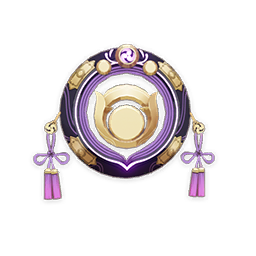</th>
      <th style="padding: 0; vertical-align: top;">
        

          

        樱之斋宫
        

          

          

            
            装备该武器的角色触发雷元素相关反应后，队伍中附近的与该元素反应相关的元素类型的角色，获得10%对应元素的元素伤害加成，持续6秒。通过这种方式，角色获得的元素伤害加成无法叠加。
            

            承载着过去的「狐斋宫」思念的法器。但她的思念之大，是无法完全装进这样小小的器物当中的。
            
            

        

      </th>
    </tr>
    <tr>
        <th colspan="2" style="font-weight: normal;">
         <strong>故事：</strong> 
        「聚散太匆匆，夜宿朝别如一梦。」
  
这浅薄平凡的一生， 
我自认过得很充实。
  
我曾经以白辰狐之身， 
与机敏可爱的眷属们， 
奔走鸣神的草野山岳。
  
希望，在一切都结束之后， 
它们能再度欢快地奔跑呢…
  
我曾与面容如月的鬼族少女， 
一同在御前献艺倾奇与神乐， 
我也曾为她的剑舞不住叫好。 
希望她的美貌、勇武与仪态， 
能够为千年后的人久久传颂。
  
一想到那名少女令人自愧弗如的美， 
就不禁希望以面具掩盖如今的模样…
  
我曾与影向的天狗族长竞足， 
跑遍修验之灵山的表里参道， 
比拼我们双方的速度与力量。
  
最终取胜的，竟是白辰一族的我。 
现在想来，她对我手下留情了吧。 
一念及此，就觉得有点不甘心呢…
  
我曾设计执着于与我斗法的妖狸， 
使他心悦诚服地向将军大人投降。 
我同时不知耻地设计了那位大人， 
使她将僭越的大妖狸王纳入麾下。
  
那夜御苑的月色透过树枝与花瓣， 
洒落在庭院里，美得像无数珍珠， 
如今依然在我浅薄的心中闪着光…
  
希望她能够记住，在别离之前，我斗胆提出的冗长箴言。 
「不被蒙蔽、不受动摇，一直走在您所坚信的道路上。」 
并希望我的箴言，能为她多少抵挡几句谎言、几分恶念。 
也愿那顽皮却纯粹善良的狸子，不会记恨我最后的欺瞒…
  
现在，在最为漆黑的地方， 
我也会牢牢抓住这些景象， 
让它们如同穿透云霭的月， 
照亮自己渺小脆弱的心灵。
  
在这一生中，我也曾化为人的形姿， 
与这些短寿而美丽的小小生灵同行， 
以不同的身份，成为许多人的挚友。 
无论是为了故里的神社而前来鸣神修习的巫女， 
还是在夏祭中因为神鉾队伍与大人走散的孩子， 
抑或是最终前往璃月修习仙家之术的随和少年； 
无论是为了让城町繁荣而殚精竭虑的那位勘定， 
还是说那个醉心于打造无比锋利的刀剑的匠人， 
抑或是用巧技让人造的流星在深空绽放的一族， 
所有人，都是我不曾料想能够有幸结交的挚友。
  
守护他们的结界，但愿不会被任何黑暗侵蚀…
  
这一切，所有的所有，都是我如今所怀念的。
  
「所以啊，撕咬我的漆黑意志，」 
「现在我已经失去了所有力量，」 
「我的白辰之血就任您挥洒吧。」 
「但是，尽管处于卑微的立场，」 
「我仍希望您能聆听我的请求…」
  
「如果您能看见我所珍重之物，」 
「那么就请您饶恕那些生灵吧。」 
「如果您恩准我提出一个愿望，」 
「就请您将我永远明亮的记忆，」 
「归还给我热爱的这片土地吧。」 
「希望以此，在您的肆虐之后，」 
「仍然有美好的东西能留下来…」 
        </th>
    </tr>
  </thead>
</table>

### 证誓之明瞳

<table  class="table-weapon">
  <thead>
    <tr>
      <th class="th-weapon" rowspan="1"></th>
      <th style="padding: 0; vertical-align: top;">
        

          

        微光的海渊民
        

          

          

            
            施放元素战技后，元素充能效率提升24%，持续10秒。
            

            大日御舆收藏的白夜国之宝。蛇神到来后，渊下宫用以公证大誓与大愿的宝物。
            
            

        

      </th>
    </tr>
    <tr>
        <th colspan="2" style="font-weight: normal;">
         <strong>故事：</strong> 
        「想让我成为海渊之民的神吗？」 
纯白的巨蛇俯瞰着眼前的小童， 
「我本就因无法胜过贵金之神与鸣神，才选择逃往未知之海。」 
「如果你们仍然期待着光明，那未来一定会再一次经历失去。」 
「我之身死并不足道，偷生之辱、渎名之耻——我已经受够。」
  
巨蛇展示了一枚蛇瞳一般的宝珠， 
「那你便在此证誓明瞳之前立誓吧。」 
「我与珊瑚之眷属也是如此结盟的。」
  
「你们忘记了斯巴达克先师的教导吗？」 
「不能崇拜神，一切都要靠我们自己！」 
白蛇没有说话，它尊重海渊之民的意志。 
如果愚昧的崇拜，被这新来的信仰打倒， 
对于抗争的人们来说，无疑是一种侮辱。
  
「那我便在此证誓明瞳之前立誓吧。」 
「一如我丧失曾经一切时那样。」
  
「岁月倏忽，海岛落成、龙蜥已退，圣土之事亦得治理之法。」 
「珊瑚宫家、地走官众、我之御使——瞳前之大愿得以成就。」 
「今后，如有任意两方以上对渊下之事有所不满，或有他决。」 
「大日之塔当听闻尔等之决议，自行崩毁，湮灭往昔之一切。」
  
蛇神说完了最后的话语， 
然后它带着剩下的人民一同前去了海面。 
是时候履行它与天上之都的誓言了… 
        </th>
    </tr>
  </thead>
</table>

## 弓

### 飞雷之弦振

<table  class="table-weapon">
  <thead>
    <tr>
      <th class="th-weapon" rowspan="1">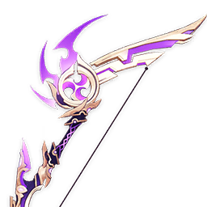</th>
      <th style="padding: 0; vertical-align: top;">
        

          

        飞雷御执
        

          

          

            
            攻击力提高20%，并能获得「飞雷之巴印」的威势。飞雷之巴印：持有1/2/3层飞雷之巴印时，普通攻击造成的伤害提高12/24/40%。在下列情况下，角色将各获得1层飞雷之巴印：普通攻击造成伤害时，持续5秒；施放元素战技时，持续10秒；此外，角色元素能量低于100%时，将获得1层飞雷之巴印，此飞雷之巴印会在角色的元素能量充满时消失。每层飞雷之巴印的持续时间独立计算。
            

            曾由将军御赐的长弓，闪烁着永不熄灭的雷光。
            
            

        

      </th>
    </tr>
    <tr>
        <th colspan="2" style="font-weight: normal;">
         <strong>故事：</strong> 
        雷光灼灼的铭弓，即使被浓稠黑暗洗濯，依旧不失神采， 
灾厄自远海而来的苦难时代，曾是某位剑豪的得意武器。
  
少年时曾不羁漫游山林，又与偶遇的大天狗相设赌局， 
以年轻勇健的肉身与将军御赐的铭弓，互为豪赌之注。
  
至于那场赌局过程如何，或许只有酣饮畅醉时才依稀记起。  
但待到那夜天色初白之刻，三胜三负，正与天狗赌成平手。 
于是，不幸被天狗收为仆从小姓，幸而赢得了无双的宝弓。
  
「昆布丸，天狗的弓法乃是如此，给我好好看，好好学！」 
被粗鲁地取了莫名其妙的外号，但终究见识了天狗的身姿。 
空行于重重云间，无拘无束地回闪俯冲，以弓弦释出雷矢… 
那是毫无保留的、真正的杀伐之舞，凶戾难测，优雅华美。
  
多年之后，已不再是做小姓的年纪，也颇学到些弓刀之术。 
如此，便被没耐性的主子一纸荐书打发到了幕府的大门下。 
追随将军的年月里，武艺多有精进，结识了许多友人与仇敌。 
不羁空游的嗜好未曾改变，反而藉天狗之铭弓，更有恃无恐。
  
「这次与你赌上一把，如何？嗯——就以这把弓为赌注吧。」 
「我要将这把天下最好的弓为赌注，赌我能活着回到这里。」 
「就寄放在你这吧。如果我高岭输了，那这把弓就归你了。」 
「毕竟浅濑你算得了我流射术的真传。应该能用好它才对。」 
「但，假使我赢了的话…」
  
灾厄自远海席卷而来的岁月里，武士与逞强的巫女互设赌局， 
以自深渊生还的机会，与将军御赐的铭弓，作为豪赌的赌注。
  
当漆黑的秽毒沉入大地，复归平静之时，剑豪并未归来。 
而作为豪赌的胜果，将军御赐的铭弓被交予巫女的手里。 
再后来，在狐斋宫不再现身的神林中、在相约再见的地方， 
自渊薮蹒跚而来的孤独归人，终又与不再年轻的巫女再逢。 
血泪干涸的漆黑眼眸重获神采，却被威光闪烁的钩矢射穿。 
        </th>
    </tr>
  </thead>
</table>

### 破魔之弓

<table  class="table-weapon">
  <thead>
    <tr>
      <th class="th-weapon" rowspan="1">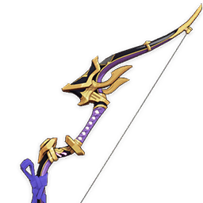</th>
      <th style="padding: 0; vertical-align: top;">
        

          

        浅濑之弭
        

          

          

            
            普通攻击造成的伤害提升16%，重击造成的伤害提升12%。当装备该武器的角色元素能量等于100%时，这个效果提升100%。
            

            曾经属于某个巫女的战弓。以优越的技法打造，精巧而耐用。
            
            

        

      </th>
    </tr>
    <tr>
        <th colspan="2" style="font-weight: normal;">
         <strong>故事：</strong> 
        「快下去。女人在船上很碍手碍脚！」 
唤作赤穗百目鬼的贼人说，背过身去。 
但听了这话，巫女却忍不住微笑起来。 
如果当初教我射术的人没有随将军出征的话， 
那我们的儿子，如今应当是左卫门的年纪了， 
而我或许就应当姓高岭，或者由他姓浅濑了…
  
左卫门的口吻，和故意背向我的模样， 
简直和他当年提着刀离开的时候一样。 
那么这次，我绝对不会让这个人死去， 
哪怕与「雷之三重巴」之旗为敌也好…
  
「扬帆之刻到了，铦与刀都已磨利。」 
「就让那些官兵看看，清籁的骨气！」
  
聆听着出航的船歌，巫女放下了战弓。 
过去在影向山偷学的真正的「法术」， 
虽说对不起天狗老师，就用在这里吧。 
解开维系千年的大结界， 
让紫电之鸢垂死的怨恨， 
肆虐雷神旗号的舰船吧。 
只希望那匹老猫，不要闯进雷霆里来… 
        </th>
    </tr>
  </thead>
</table>

### 曚云之月

<table  class="table-weapon">
  <thead>
    <tr>
      <th class="th-weapon" rowspan="1">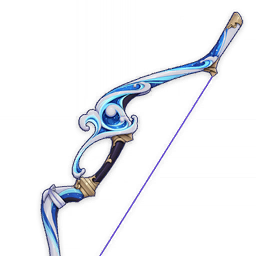</th>
      <th style="padding: 0; vertical-align: top;">
        

          

        驭浪的海祇民
        

          

          

            
            队伍中所有角色的元素能量上限的总和，每1点能使装备此武器的角色的元素爆发造成的伤害提高0.12%，通过这种方式，元素爆发造成的伤害至多提高40%。
            

            出自螺钿与珊瑚的精美战弓，月色的弓臂上流动着凄然的光彩。
            
            

        

      </th>
    </tr>
    <tr>
        <th colspan="2" style="font-weight: normal;">
         <strong>故事：</strong> 
        曾为海祇岛巫女曚云所操使的长弓， 
        如月光中的潮尖浪花一般洁白明丽。
          
        巫女以远海妖兽为友朋，为海祇的泡沫之梦与雷云相搏， 
        共心仪无间的同伴肆行波涛，在船艏激起的浪花间隐现… 
        追随海祇前往无归之途，最终共同步入惨烈的灭亡境地。
          
        「海祇大御神大人挑起的争战，或许从开始就注定无果了。」 
        「但只要能留下记忆、种下『牺牲』之种，或许也值得吧。」
          
        过去的歌曲曾经赞咏她曾与「海御前」身为海祇双子的默契， 
        描绘她们沐浴在船艏激起的浅白浪花中，挽弓与提枪的形姿… 
        遥远的歌儿回溯着她曾与年轻的「东山王」乘海兽夜游之事， 
        重叙着她曾向勇者诉说的破碎明日，与温柔悲伤的耳畔呢喃…
          
        在波澜平静的日子里，巫女双子曾一起同深海的巨鲸的合唱， 
        述说渊下的惨淡白夜与漆黑常夜、大御神与灼灼发光的玉枝。 
        她曾在月下与那名除了气力别无所长的鲁莽少年如对鱼嬉闹…
          
        「待我带回传说中那大妖天狗的面具，阿姐可一定要如约完成未竟之事。」
          
        「好呀。若你到时还是满口妄言，我便命巨鲸扬起大浪，洗洗你的嘴巴。」
        </th>
    </tr>
  </thead>
</table>

