# 名片

### 枫原万叶·秋山椛狩

<table class="table-weapon">
  <thead>
    <tr>
      <th class="th-weapon-1" rowspan="1">
        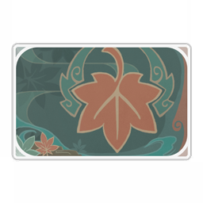
      </th>
      <th style="padding: 0; vertical-align: top;">
        

          

            枫原万叶·秋山椛狩
            

          

          

            
              <strong>描述：</strong> 
              名片纹饰。 
              「松籁枯波送红叶。」
            
          

        

      </th>
    </tr>
    <tr>
        <th colspan="2" style="font-weight: normal;">
        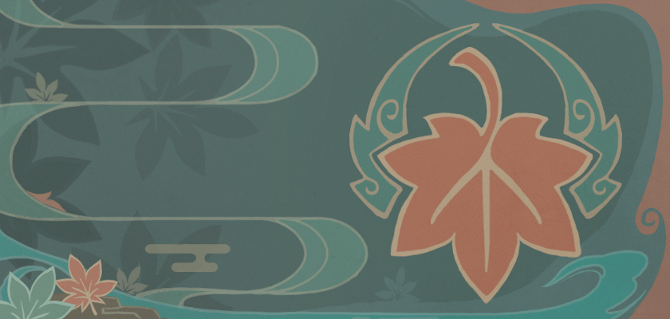
        </th>
    </tr>
    <tr>
        <th colspan="2" style="font-weight: normal;">
        
        </th>
    </tr>
  </thead>
</table>

### 庆典·斗剧

<table class="table-weapon">
  <thead>
    <tr>
      <th class="th-weapon-1" rowspan="1">
        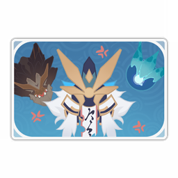
      </th>
      <th style="padding: 0; vertical-align: top;">
        

          

            庆典·斗剧
            

          

          

            
              <strong>描述：</strong> 
              名片纹饰。 
吉兆要出现三次，幸运才会降临；谢幕时应当三次鞠躬；而在风来人的剑斗剧中，胜负的对手也有三名。
            
          

        

      </th>
    </tr>
    <tr>
        <th colspan="2" style="font-weight: normal;">
        
        </th>
    </tr>
    <tr>
        <th colspan="2" style="font-weight: normal;">
        
        </th>
    </tr>
  </thead>
</table>

### 稻妻·神樱

<table class="table-weapon">
  <thead>
    <tr>
      <th class="th-weapon-1" rowspan="1">
        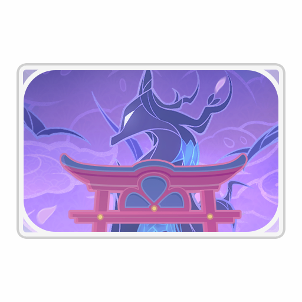
      </th>
      <th style="padding: 0; vertical-align: top;">
        

          

            稻妻·神樱
            

          

          

            
              <strong>描述：</strong> 
              名片纹饰。 
绯樱飘落之处，尽在神木的守护之下。
            
          

        

      </th>
    </tr>
    <tr>
        <th colspan="2" style="font-weight: normal;">
        
        </th>
    </tr>
    <tr>
        <th colspan="2" style="font-weight: normal;">
        
        </th>
    </tr>
  </thead>
</table>

### 纪行·鸣神大社

<table class="table-weapon">
  <thead>
    <tr>
      <th class="th-weapon-1" rowspan="1">
        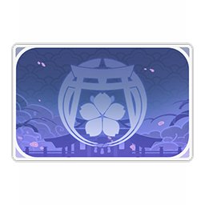
      </th>
      <th style="padding: 0; vertical-align: top;">
        

          

            纪行·鸣神大社
            

          

          

            
              <strong>描述：</strong> 
              名片纹饰。 
鸣神大社的纹样，「影向山樱」。
            
          

        

      </th>
    </tr>
    <tr>
        <th colspan="2" style="font-weight: normal;">
        
        </th>
    </tr>
    <tr>
        <th colspan="2" style="font-weight: normal;">
        
        </th>
    </tr>
  </thead>
</table>

### 神里绫华·扇子

<table class="table-weapon">
  <thead>
    <tr>
      <th class="th-weapon-1" rowspan="1">
        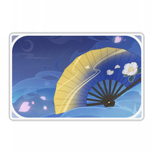
      </th>
      <th style="padding: 0; vertical-align: top;">
        

          

            神里绫华·扇子
            

          

          

            
              <strong>描述：</strong> 
              名片纹饰。 
绫华的配扇当然一直在换。如果想作为赠礼送给她的话，记得不要送成了夏扇或者投扇，舞扇或者茶扇是不错的选择。
            
          

        

      </th>
    </tr>
    <tr>
        <th colspan="2" style="font-weight: normal;">
        
        </th>
    </tr>
    <tr>
        <th colspan="2" style="font-weight: normal;">
        
        </th>
    </tr>
  </thead>
</table>

### 宵宫·琉金火花

<table class="table-weapon">
  <thead>
    <tr>
      <th class="th-weapon-1" rowspan="1">
        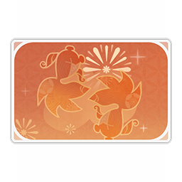
      </th>
      <th style="padding: 0; vertical-align: top;">
        

          

            宵宫·琉金火花
            

          

          

            
              <strong>描述：</strong> 
              名片纹饰。 
即使只是片刻的火花，也能在仰望黑夜的人心中留下久久不灭的美丽光芒。
            
          

        

      </th>
    </tr>
    <tr>
        <th colspan="2" style="font-weight: normal;">
        
        </th>
    </tr>
    <tr>
        <th colspan="2" style="font-weight: normal;">
        
        </th>
    </tr>
  </thead>
</table>

### 稻妻·雷电之纹

<table class="table-weapon">
  <thead>
    <tr>
      <th class="th-weapon-1" rowspan="1">
        
      </th>
      <th style="padding: 0; vertical-align: top;">
        

          

            稻妻·雷电之纹
            

          

          

            
              <strong>描述：</strong> 
              名片纹饰。 
大御所将军的纹样，亦即麾下军势之旗印，「雷之三重巴」。
            
          

        

      </th>
    </tr>
    <tr>
        <th colspan="2" style="font-weight: normal;">
        
        </th>
    </tr>
    <tr>
        <th colspan="2" style="font-weight: normal;">
        
        </th>
    </tr>
  </thead>
</table>

### 稻妻·神里之纹

<table class="table-weapon">
  <thead>
    <tr>
      <th class="th-weapon-1" rowspan="1">
        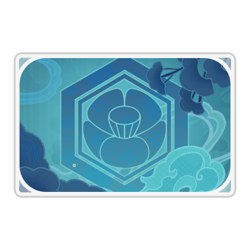
      </th>
      <th style="padding: 0; vertical-align: top;">
        

          

            稻妻·神里之纹
            

          

          

            
              <strong>描述：</strong> 
              名片纹饰。 
三奉行中，社奉行·神里家的椿纹。
            
          

        

      </th>
    </tr>
    <tr>
        <th colspan="2" style="font-weight: normal;">
        
        </th>
    </tr>
    <tr>
        <th colspan="2" style="font-weight: normal;">
        
        </th>
    </tr>
  </thead>
</table>

### 稻妻·九条之纹

<table class="table-weapon">
  <thead>
    <tr>
      <th class="th-weapon-1" rowspan="1">
        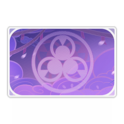
      </th>
      <th style="padding: 0; vertical-align: top;">
        

          

            稻妻·九条之纹
            

          

          

            
              <strong>描述：</strong> 
              名片纹饰。 
三奉行中，天领奉行·九条家的钴纹。
            
          

        

      </th>
    </tr>
    <tr>
        <th colspan="2" style="font-weight: normal;">
        
        </th>
    </tr>
    <tr>
        <th colspan="2" style="font-weight: normal;">
        
        </th>
    </tr>
  </thead>
</table>

### 雷电将军·开眼

<table class="table-weapon">
  <thead>
    <tr>
      <th class="th-weapon-1" rowspan="1">
        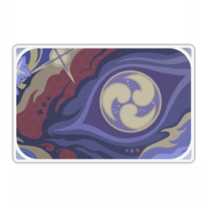
      </th>
      <th style="padding: 0; vertical-align: top;">
        

          

            雷电将军·开眼
            

          

          

            
              <strong>描述：</strong> 
              名片纹饰。 
不仅是影，也不只是将军。留一只雷曜之眼观照自己，方能得始终。
            
          

        

      </th>
    </tr>
    <tr>
        <th colspan="2" style="font-weight: normal;">
        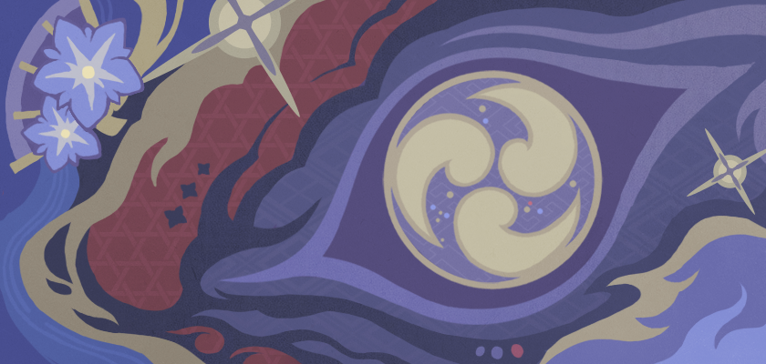
        </th>
    </tr>
    <tr>
        <th colspan="2" style="font-weight: normal;">
        
        </th>
    </tr>
  </thead>
</table>

### 珊瑚宫心海·渊

<table class="table-weapon">
  <thead>
    <tr>
      <th class="th-weapon-1" rowspan="1">
        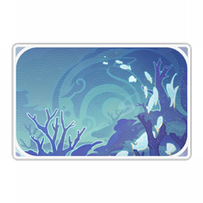
      </th>
      <th style="padding: 0; vertical-align: top;">
        

          

            珊瑚宫心海·渊
            

          

          

            
              <strong>描述：</strong> 
              名片纹饰。 
这是海祇之民都知晓的传说：在渊下有着曾经的故乡。
            
          

        

      </th>
    </tr>
    <tr>
        <th colspan="2" style="font-weight: normal;">
        
        </th>
    </tr>
    <tr>
        <th colspan="2" style="font-weight: normal;">
        
        </th>
    </tr>
  </thead>
</table>

### 九条裟罗·天狗

<table class="table-weapon">
  <thead>
    <tr>
      <th class="th-weapon-1" rowspan="1">
        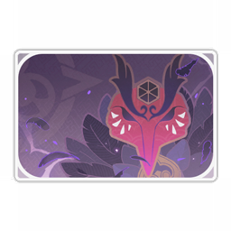
      </th>
      <th style="padding: 0; vertical-align: top;">
        

          

            九条裟罗·天狗
            

          

          

            
              <strong>描述：</strong> 
              名片纹饰。 
裟罗摒弃了天狗一众傲慢的生存方式，但是对于磨炼剑技和神通却并没有怠慢。
            
          

        

      </th>
    </tr>
    <tr>
        <th colspan="2" style="font-weight: normal;">
        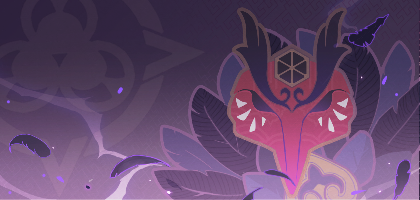
        </th>
    </tr>
    <tr>
        <th colspan="2" style="font-weight: normal;">
        
        </th>
    </tr>
  </thead>
</table>

### 稻妻·珊瑚宫之纹

<table class="table-weapon">
  <thead>
    <tr>
      <th class="th-weapon-1" rowspan="1">
        
      </th>
      <th style="padding: 0; vertical-align: top;">
        

          

            稻妻·珊瑚宫之纹
            

          

          

            
              <strong>描述：</strong> 
              名片纹饰。 
海祇民之领袖，珊瑚宫家的家纹。
            
          

        

      </th>
    </tr>
    <tr>
        <th colspan="2" style="font-weight: normal;">
        
        </th>
    </tr>
    <tr>
        <th colspan="2" style="font-weight: normal;">
        
        </th>
    </tr>
  </thead>
</table>

### 庆典·一揆

<table class="table-weapon">
  <thead>
    <tr>
      <th class="th-weapon-1" rowspan="1">
        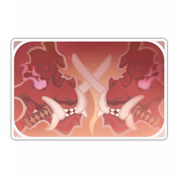
      </th>
      <th style="padding: 0; vertical-align: top;">
        

          

            庆典·一揆
            

          

          

            
              <strong>描述：</strong> 
              名片纹饰。 「我来问你问题，你只准用剑来回答。」
            
          

        

      </th>
    </tr>
    <tr>
        <th colspan="2" style="font-weight: normal;">
        
        </th>
    </tr>
    <tr>
        <th colspan="2" style="font-weight: normal;">
        
        </th>
    </tr>
  </thead>
</table>

### 纪行·神将

<table class="table-weapon">
  <thead>
    <tr>
      <th class="th-weapon-1" rowspan="1">
        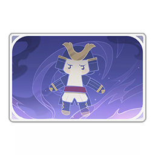
      </th>
      <th style="padding: 0; vertical-align: top;">
        

          

            纪行·神将
            

          

          

            
              <strong>描述：</strong> 
              名片纹饰。 「你的存在意义，可并非恶行罚示哦。至于是什么，小生也不知道。」
            
          

        

      </th>
    </tr>
    <tr>
        <th colspan="2" style="font-weight: normal;">
        
        </th>
    </tr>
    <tr>
        <th colspan="2" style="font-weight: normal;">
        
        </th>
    </tr>
  </thead>
</table>

### 稻妻·鹫羽

<table class="table-weapon">
  <thead>
    <tr>
      <th class="th-weapon-1" rowspan="1">
        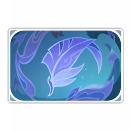
      </th>
      <th style="padding: 0; vertical-align: top;">
        

          

            稻妻·鹫羽
            

          

          

            
              <strong>描述：</strong> 
              名片纹饰。 啊啊，美丽的鸟，如神的鹫鸟啊。
            
          

        

      </th>
    </tr>
    <tr>
        <th colspan="2" style="font-weight: normal;">
        
        </th>
    </tr>
    <tr>
        <th colspan="2" style="font-weight: normal;">
        
        </th>
    </tr>
  </thead>
</table>

### 一斗·鬼颜

<table class="table-weapon">
  <thead>
    <tr>
      <th class="th-weapon-1" rowspan="1">
        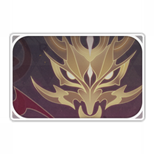
      </th>
      <th style="padding: 0; vertical-align: top;">
        

          

            一斗·鬼颜
            

          

          

            
              <strong>描述：</strong> 
              名片纹饰。 男子汉，就要把痛苦和愤怒藏在背后，然后露出最爽朗的笑容！
            
          

        

      </th>
    </tr>
    <tr>
        <th colspan="2" style="font-weight: normal;">
        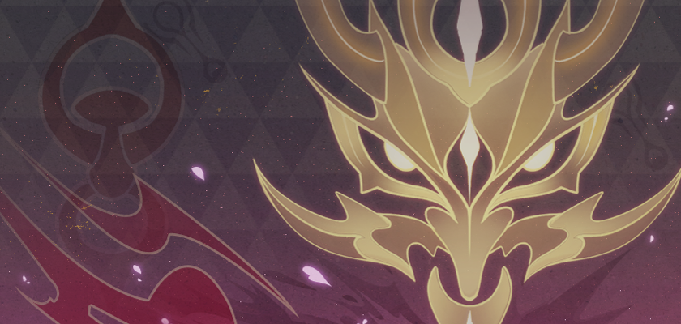
        </th>
    </tr>
    <tr>
        <th colspan="2" style="font-weight: normal;">
        
        </th>
    </tr>
  </thead>
</table>

### 稻妻·常世

<table class="table-weapon">
  <thead>
    <tr>
      <th class="th-weapon-1" rowspan="1">
        
      </th>
      <th style="padding: 0; vertical-align: top;">
        

          

            稻妻·常世
            

          

          

            
              <strong>描述：</strong> 
              名片纹饰。 「啊，伟大的太阳啊！假若你不拥有你照耀的一切，你的光热有何意义？」
            
          

        

      </th>
    </tr>
    <tr>
        <th colspan="2" style="font-weight: normal;">
        
        </th>
    </tr>
    <tr>
        <th colspan="2" style="font-weight: normal;">
        
        </th>
    </tr>
  </thead>
</table>

### 八重神子·梦狐

<table class="table-weapon">
  <thead>
    <tr>
      <th class="th-weapon-1" rowspan="1">
        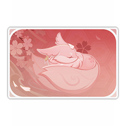
      </th>
      <th style="padding: 0; vertical-align: top;">
        

          

            八重神子·梦狐
            

          

          

            
              <strong>描述：</strong> 
              名片纹饰。 八重神子的狐狸形态在哪里能看到呢？在梦里吧。
            
          

        

      </th>
    </tr>
    <tr>
        <th colspan="2" style="font-weight: normal;">
        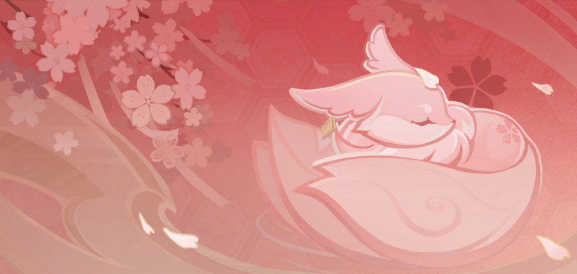
        </th>
    </tr>
    <tr>
        <th colspan="2" style="font-weight: normal;">
        
        </th>
    </tr>
  </thead>
</table>

### 纪行·蛰醒

<table class="table-weapon">
  <thead>
    <tr>
      <th class="th-weapon-1" rowspan="1">
        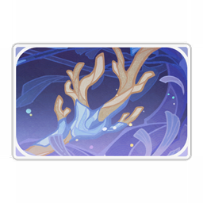
      </th>
      <th style="padding: 0; vertical-align: top;">
        

          

            纪行·蛰醒
            

          

          

            
              <strong>描述：</strong> 
              名片纹饰。 三界震动，天地醒转。珊瑚王虫也从永眠中恢复了过来。
            
          

        

      </th>
    </tr>
    <tr>
        <th colspan="2" style="font-weight: normal;">
        
        </th>
    </tr>
    <tr>
        <th colspan="2" style="font-weight: normal;">
        
        </th>
    </tr>
  </thead>
</table>

### 神里绫人·涟漪

<table class="table-weapon">
  <thead>
    <tr>
      <th class="th-weapon-1" rowspan="1">
        
      </th>
      <th style="padding: 0; vertical-align: top;">
        

          

            神里绫人·涟漪
            

          

          

            
              <strong>描述：</strong> 
              名片纹饰。 椿花浮镜，澄水泛波。
            
          

        

      </th>
    </tr>
    <tr>
        <th colspan="2" style="font-weight: normal;">
        
        </th>
    </tr>
    <tr>
        <th colspan="2" style="font-weight: normal;">
        
        </th>
    </tr>
  </thead>
</table>

### 成就·雷音

<table class="table-weapon">
  <thead>
    <tr>
      <th class="th-weapon-1" rowspan="1">
        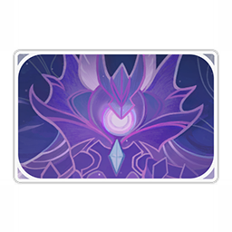
      </th>
      <th style="padding: 0; vertical-align: top;">
        

          

            成就·雷音
            

          

          

            
              <strong>描述：</strong> 
              名片纹饰。 听啊，丛云间回荡的声响。那是它的嗟怨忿怒，与一个小小的愿望。
            
          

        

      </th>
    </tr>
    <tr>
        <th colspan="2" style="font-weight: normal;">
        
        </th>
    </tr>
    <tr>
        <th colspan="2" style="font-weight: normal;">
        
        </th>
    </tr>
  </thead>
</table>

### 纪行·容彩

<table class="table-weapon">
  <thead>
    <tr>
      <th class="th-weapon-1" rowspan="1">
        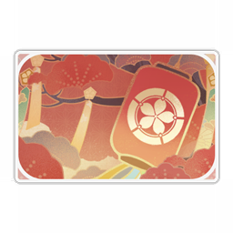
      </th>
      <th style="padding: 0; vertical-align: top;">
        

          

            纪行·容彩
            

          

          

            
              <strong>描述：</strong> 
              名片纹饰。 同好之人，谓之「同人」。趁着狐狸总编还没想到版权法，大家好好描绘心中的故事吧。——又或者，她想到了，但并不在乎？
            
          

        

      </th>
    </tr>
    <tr>
        <th colspan="2" style="font-weight: normal;">
        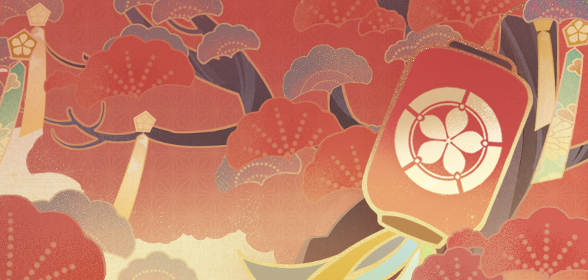
        </th>
    </tr>
    <tr>
        <th colspan="2" style="font-weight: normal;">
        
        </th>
    </tr>
  </thead>
</table>

### 久岐忍·络

<table class="table-weapon">
  <thead>
    <tr>
      <th class="th-weapon-1" rowspan="1">
        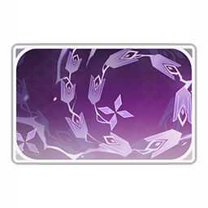
      </th>
      <th style="padding: 0; vertical-align: top;">
        

          

            久岐忍·络
            

          

          

            
              <strong>描述：</strong> 
              名片纹饰。 「稻妻不是有那种鸣草轮吗？穿过去可以驱邪落秽那种。小忍就想到既然邪物不愿意主动钻圈，把草轮做成主动卷人的样子就好了。妹妹她做巫女的才能，真是可怕啊。」
            
          

        

      </th>
    </tr>
    <tr>
        <th colspan="2" style="font-weight: normal;">
        
        </th>
    </tr>
    <tr>
        <th colspan="2" style="font-weight: normal;">
        
        </th>
    </tr>
  </thead>
</table>

### 梦见月瑞希·噩喰

<table class="table-weapon">
  <thead>
    <tr>
      <th class="th-weapon-1" rowspan="1">
        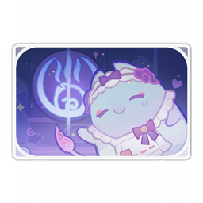
      </th>
      <th style="padding: 0; vertical-align: top;">
        

          

            梦见月瑞希·噩喰
            

          

          

            
              <strong>描述：</strong> 
              名片纹饰。 食梦的貘会将噩梦食去留下美梦，可万一梦都是反的呢？应对这样的忧虑，她温柔的解释是这样的：全方位的美梦，即使透过现实翻转过来，那也是美好的呀。
            
          

        

      </th>
    </tr>
    <tr>
        <th colspan="2" style="font-weight: normal;">
        
        </th>
    </tr>
    <tr>
        <th colspan="2" style="font-weight: normal;">
        
        </th>
    </tr>
  </thead>
</table>

### 纪行·绮梦

<table class="table-weapon">
  <thead>
    <tr>
      <th class="th-weapon-1" rowspan="1">
        
      </th>
      <th style="padding: 0; vertical-align: top;">
        

          

            纪行·绮梦
            

          

          

            
              <strong>描述：</strong> 
              名片纹饰。 花见游艺远歌去，依稀留梦痕。
            
          

        

      </th>
    </tr>
    <tr>
        <th colspan="2" style="font-weight: normal;">
        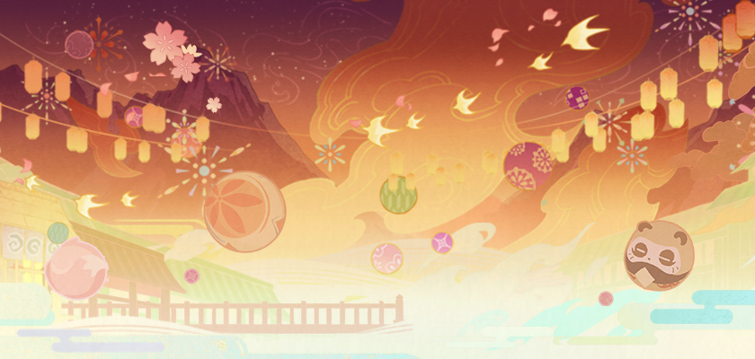
        </th>
    </tr>
    <tr>
        <th colspan="2" style="font-weight: normal;">
        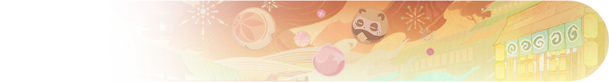
        </th>
    </tr>
  </thead>
</table>

### 纪行·灵津

<table class="table-weapon">
  <thead>
    <tr>
      <th class="th-weapon-1" rowspan="1">
        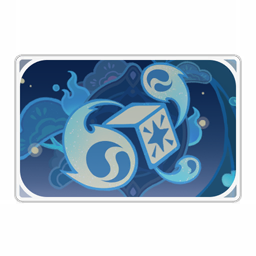
      </th>
      <th style="padding: 0; vertical-align: top;">
        

          

            纪行·灵津
            

          

          

            
              <strong>描述：</strong> 
              名片纹饰。 旧宴何为名，三川流散烟云中，秋津犹尚浮暮景。
            
          

        

      </th>
    </tr>
    <tr>
        <th colspan="2" style="font-weight: normal;">
        
        </th>
    </tr>
    <tr>
        <th colspan="2" style="font-weight: normal;">
        
        </th>
    </tr>
  </thead>
</table>

### 纪行·邦摇

<table class="table-weapon">
  <thead>
    <tr>
      <th class="th-weapon-1" rowspan="1">
        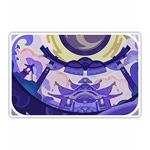
      </th>
      <th style="padding: 0; vertical-align: top;">
        

          

            纪行·邦摇
            

          

          

            
              <strong>描述：</strong> 
              名片纹饰。 「世界不疼爱他的孩子，不然干嘛赶着他们去另一个世界？」「你懂什么？说不定那边更摇滚呢。」
            
          

        

      </th>
    </tr>
    <tr>
        <th colspan="2" style="font-weight: normal;">
        
        </th>
    </tr>
    <tr>
        <th colspan="2" style="font-weight: normal;">
        
        </th>
    </tr>
  </thead>
</table>

