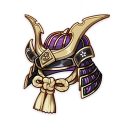
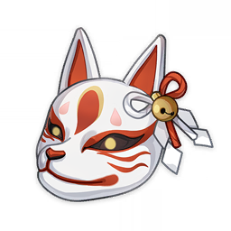
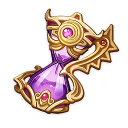

# 圣遗物

## 绝缘之旗印
<table  class="table-weapon">
  <thead>
    <tr>
      <th class="th-weapon" rowspan="1"></th>
      <th style="padding: 0; vertical-align: top;">
        

          

        空之杯： 绯花之壶
        

          

          

            
            <strong>描述：</strong> 精致的酒壶，曾经是名震天下的武人载酒的容器。
            
            

        

      </th>
    </tr>
    <tr>
        <th colspan="2" style="font-weight: normal;">
        <strong>故事：</strong> 
        凭借独创的秘剑「天狗抄」，岩藏道启成为了九条家的剑法指南， 
        获得了「道胤」之武号，并最终创立了一度门生如云的剑道流派。 
        在前往九条的屋敷就任前，已经学会饮酒的道启， 
        最后一次，踏进因秘剑「天狗抄」的完成而彻底沦为废墟的枝社。 
        在自己十三年内十次有三与影向的天狗真剑试合的废弃枝社院内， 
        他想起自己在这里遇见自称「影向的光代」的黑翼天狗时的情景…
          
        浮生若梦十三年 
        影峠绯雪翩跹烟 
        再顾君已远
          
        那时的神樱也如同茫茫白雪般飘落。 
        脚下的枝社虽失去祭神，也还完好。 
        如同泉水般清亮的笑声回响在山间。 
        而两人再未踏足已沦为废墟的小院。
        </th>
    </tr>
  </thead>
</table>

<table  class="table-weapon">
  <thead>
    <tr>
      <th class="th-weapon" rowspan="1"></th>
      <th style="padding: 0; vertical-align: top;">
        

          

        死之羽： 切落之羽
        

          

          

            
            <strong>描述：</strong> 原本属于某名天狗的黑羽，是过去的剑豪珍惜的纪念品。
            
            

        

      </th>
    </tr>
    <tr>
        <th colspan="2" style="font-weight: normal;">
        <strong>故事：</strong> 
        在剑风吹落的黑羽包围中，将要成为剑豪的人， 
        终于抓住了多年来可见不可即的那名天狗少女…
          
        「啊呀，真是好险。真了不起。」 
        「若不是剑无法承受你的力气，」 
        「我就要死在这里了吧。那么…」
          
        光代，来年的决斗，我们是否要换个场地呢？ 
        能瞥见绯樱飘落的地方，我也知道那么几个… 
        环顾着自己摧毁的小社，握着天狗颤抖的手， 
        盯着自己切落的黑羽，道启原本打算这么说。
          
        「你碰到了我，不得不说确实是你赢了呢。」
          
        胜负还没有定论，我们来年再会吧。他想说。
          
        「你的剑，如今连天狗的速度也能超越了。」 
        「在这十三年里，和你决斗的每一天，我永远也不会忘记。」 
        「但我身为影向天狗，最终还是要承当一族不得不为之事。」 
        「如今想来最初为你改名，是希望你能摆脱鬼之血的诅咒。」 
        「非人的血脉，随着那一场战事，现在已经越发地稀薄了。」 
        「毕竟嘛，我等非人之物不该觊觎人的善终。但你不一样。」 
        「如今的你是『岩藏』，已经不再是背负鬼之血的御舆了。」
          
        「那么再见了，道启。忘了我，然后以你的剑，」 
        「为岩藏的血脉，开创仅仅属于岩藏的道路吧。」
        </th>
    </tr>
  </thead>
</table>

<table  class="table-weapon">
  <thead>
    <tr>
      <th class="th-weapon" rowspan="1"></th>
      <th style="padding: 0; vertical-align: top;">
        

          

        理之冠： 华饰之兜
        

          

          

            
            <strong>描述：</strong> 坚实牢固的兜盔，是身份尊贵的武人的护身之物。
            
            

        

      </th>
    </tr>
    <tr>
        <th colspan="2" style="font-weight: normal;">
        <strong>故事：</strong> 
        「道胤公的秘剑，莫不是连雷光也能切断，哈哈哈。」 
        纳刀时，年轻的勘定头弘嗣揶揄道。他只是木木地说： 
        「怎么可能有这种事。至多能斩落空行的天狗罢了。」 
        「话虽如此，但实际斩落天狗却一次也不曾发生过。」
          
        「这样吗？那秘剑『天狗抄』之名，又从何而来呢？」 
        见道胤并不回答，将离岛建立起来的勘定头又悻悻道： 
        「若不是让九条那个老头子抢了先，真想招揽你哪。」 
        「以你的剑，清籁的赤穗百目鬼一行也不是对手罢…」
          
        如同拨开雷云般，赐给他新的氏名，给他新的生命的， 
        将锈迹斑斑的刀丢给他，让他试着砍自己的那个天狗， 
        在他的刀断裂后，她对他最后所说的话…
        </th>
    </tr>
  </thead>
</table>

<table  class="table-weapon">
  <thead>
    <tr>
      <th class="th-weapon" rowspan="1"></th>
      <th style="padding: 0; vertical-align: top;">
        

          

        生之花： 明威之镡
        

          

          

            
            <strong>描述：</strong> 传说中背叛了将军的鬼人，曾经获赐的刀上的华美宝镡。
            
            

        

      </th>
    </tr>
    <tr>
        <th colspan="2" style="font-weight: normal;">
        <strong>故事：</strong> 
        母亲对恩待她、将宝刀赐给她的将军露出了獠牙。 
        最终送回到御舆家的，只有她曾无比钟爱的刀镡。
          
        母亲的夙愿，是以炽热沸腾的血气克服生死之运， 
        为日渐稀薄的同族以战鬼之名，立下不朽的功绩。 
        若被漆黑的深罪之虎吞没，那就由腔内撕碎猛兽。
          
        本应在雷之三重巴旗下立下了赫赫战功， 
        原本以为能洗净的血浸的战服之十二单， 
        与她猛烈搏动的心一同被永久地染黑了…
          
        应当继承家业的长子从此避世隐居在城外的村中， 
        与影向的山林为友，直到他在山中遇到那名少女…
          
        「真烦。如果想抛弃过去，那就由我为你取个新名字吧。」 
        听他说了过往的事情后，有着漆黑翅膀的她不屑地嗤笑道。 
        「就叫岩藏——取磐座之意，那是不受人言所害之物呢。」 
        「身体中流淌着鬼血的人哟，你要高兴才对。笑一笑吧，」 
        「要知道，由我们影向天狗取的名，是有神通力加持的。」 
        「再说了，石头的名字，跟你的脑筋和肌肉也很般配吧。」
          
        「那么——来年绯樱飘落时，再在这决斗吧，『岩藏』。」 
        「鬼之子呀，要好好练剑，成为配得上影向天狗的对手。」 
        「对了，如果你有机会碰到我，秘剑就叫『天狗胜』吧！」 
        「毕竟到那时，你就掌握了『天狗也能胜过的妙剑』呢。」
        </th>
    </tr>
  </thead>
</table>

<table  class="table-weapon">
  <thead>
    <tr>
      <th class="th-weapon" rowspan="1"></th>
      <th style="padding: 0; vertical-align: top;">
        

          

        时之沙： 雷云之笼
        

          

          

            
            <strong>描述：</strong> 黑地堇漆的考究印笼，其上装饰着发亮的螺钿与精致的金具。
            
            

        

      </th>
    </tr>
    <tr>
        <th colspan="2" style="font-weight: normal;">
        <strong>故事：</strong> 
        在清籁岛尚未被雷云笼罩的遥远过去，记忆如呼吸般起伏。 
        容纳雷雨与震鸣的雅致容器，最终还是没能交付约定之人。
          
        「系绳断掉了，所以又来找我吗…真是头疼死人了。」 
        「在剑术之外，你这家伙不过是个白痴赌棍大叔吧。」
          
        「哼，别小看人了。我的弓师承天狗，也是有名的。」 
        「不过哪，我的剑实在太过厉害，大家才不提射术。」 
        「仔细一想，还真是浪费。不如让我来教你射箭吧。」
          
        曾几何时，说着刻薄的话语，为那个呆瓜修补着被斩断的印笼… 
        曾几何时，即使说着刻薄的话语消遣他人，也忍不住露出微笑。
          
        「明明已经身为旗本，重任在肩，为何还要到处寻衅惹事？」 
        「明明已经婚配，有了娇妻，为何还整日悠游，豪赌为乐？」
          
        明明已经… 
        明明就在嘴边，却始终没有提出的问题，还是决定不再提了。 
        斋宫大人如果还在身边的话，或许会巧妙而欢快地问出口吧…
          
        「那种事情无所谓了，我擅自给自己放了假，至少在今天。」 
        「放下神社的事情，我们偷偷去海边吧，就像你小时那样。」
          
        就这样被那家伙拉去了港口，又出神地望着片片船帆来往， 
        听他讲述神社的那位光代，如何继承了师傅的美貌与武艺； 
        听他诉说曾经一度令他心惊胆战的，斩下自己首级的噩梦… 
        但两人心知肚明，这不过是用话语来掩盖业已成年的悲哀。
          
        后来，很久、很久以后， 
        俯视着遍生青苔的礁石，二人平静幽会的港口… 
        为了那赌棍能再赌赢一次，为了祈求他的平安… 
        又一次冒险站在高处，高举起亲手制作的印笼， 
        带着挽回记忆的希望，收集着雷光怒电的力量。
        </th>
    </tr>
  </thead>
</table>

## 追忆之注连

<table  class="table-weapon">
  <thead>
    <tr>
      <th class="th-weapon" rowspan="1"></th>
      <th style="padding: 0; vertical-align: top;">
        

          

        空之杯： 祈望之心
        

          

          

            
            <strong>描述：</strong> 特制的占卜签筒，底部的机关能让人轻易抽掉不想要的愿签。
            
            

        

      </th>
    </tr>
    <tr>
        <th colspan="2" style="font-weight: normal;">
        <strong>故事：</strong> 
        神社占卜吉凶使用的特制签筒， 
        据说有着狐狸附加其上的好运。
          
        占卜是迷途之人的求问，因此无论吉凶，皆是前路解答。 
        简言之，世上只有迷惘的问者，而没有不确的占卜结果。 
        在神社的求学时光受益匪浅，愚钝如我也学会了狐狸大人的说辞。 
        这段时间里，即使不近人情的影向天狗大人，也有了自己的女儿。 
        呆头大叔昆布丸，也成了将军殿下的旗本，将迎娶高门武士之女…
          
        「真是可爱的孩子，连整天闹着杀伐玩耍的天狗大人，也稍微有了母亲的自觉呢…」 
        「不过…神社里总是缺少了一点小孩子的生气，这样可不好。小响变回小孩如何？」
          
        一如既往，狐狸大人开着有点过分的玩笑，带着绯樱酒的醉气，自顾自地凑了上来。
          
        「别苦着脸了，小响。就让斋宫大人为你算上一卦，如何？」 
        「哈哈，是大吉！你看，是大吉呀！你可知这意味着什么？」 
        「您抽去了所有的凶签。请您不要再取笑我了，斋宫大人…」 
        「不…这意味着你所思恋之人，将有幸成为你永恒的记忆。」
          
        所以你要坚强地活下去，久久地活在这世上。 
        就算珍重所有的人都逝去了，只要你还活着， 
        那与这些人一同度过的时光也永远不会消逝…
        </th>
    </tr>
  </thead>
</table>

<table  class="table-weapon">
  <thead>
    <tr>
      <th class="th-weapon" rowspan="1"></th>
      <th style="padding: 0; vertical-align: top;">
        

          

        死之羽： 思忆之矢
        

          

          

            
            <strong>描述：</strong> 样式有点古旧的破魔矢，似乎一直被某人精心保存着。
            
            

        

      </th>
    </tr>
    <tr>
        <th colspan="2" style="font-weight: normal;">
        <strong>故事：</strong> 
        神社祈福驱灾所用的破魔矢， 
        据说能够追赶破灭一切心魔。
          
        人们常说破魔之矢能够驱逐邪恶，但邪恶从来不是客观之物。 
        邪恶往往出自人心，出自因恐惧而谵妄，变得冰冷烬寂的心。 
        斋宫大人离去久矣，我也已不再是鸣神大社见习的年轻巫女。 
        每当握起那根空空的烟管，空虚与隐痛便如幽灵般萦绕而生。
          
        拥有了值得挂念的人，失去了无法不挂念的人，时光如同纺车碌碌不停。 
        沉静而安谧，狐狸大人隐入漆黑深渊的白色身影，依旧刻印在巫女梦中。 
        大天狗大人，也因守护不周的罪疚发怒离去，自我远流，留下光代一人， 
        晴之介在哀恸的盛怒下远走别国，长正则为了洗清御舆的污名投身官府。 
        至于那个在神林教授我弓术，绯色的樱枝下耐心倾听我幼稚约定的男人， 
        他终会回到我面前，即使飞溅的鲜血令他目盲，漆黑污秽将他化为凶兽…
          
        以我们的弓与矢拯救他，成全注定走向失去的约定。 
        以我们的弓与矢射灭邪魔，驱除痴妄与无谓的执着。
          
        「请来见我，嗜赌如命的呆瓜。」 
        「这次不要再迷路了，昆布丸。」
          
        不过，最后的那一场赌局，胜者究竟是谁呢… 
        思考着无关紧要的事情，她轻抚着华美的弓。
        </th>
    </tr>
  </thead>
</table>

<table  class="table-weapon">
  <thead>
    <tr>
      <th class="th-weapon" rowspan="1"></th>
      <th style="padding: 0; vertical-align: top;">
        

          

        理之冠： 无常之面
        

          

          

            
            <strong>描述：</strong> 保存良好的祭礼狐面，永远带着一副神秘的浅笑。
            
            

        

      </th>
    </tr>
    <tr>
        <th colspan="2" style="font-weight: normal;">
        <strong>故事：</strong> 
        明净雅致的祭典面具，曾经属于某位神子， 
        嘴角勾勒着淡淡的微笑，双眼却再无神采。
          
        在大社学习已有些时日，自认成熟了许多。 
        不再像小时那样愚钝，越来越能独当一面。 
        但不知怎的，我愈是成长，斋宫大人的面庞却愈发掩上阴翳， 
        浮现在她脸上的并非忧心，也非恐惧，而是深切悲哀的不舍…
          
        「世界之理本就无常，痴恋瞬灭之物，将遗失隽永的记忆，」 
        「失去记忆之人，无异于失去生命，是乃永恒黑暗的死亡。」
          
        这一次，即使浅笑也掩饰不住悲伤的神情， 
        明明是祭典的日子，却仿佛即将告别一样…
          
        「对了，你也给我讲讲昆布丸那个呆瓜吧…」 
        「怎么…你还怕我这老女人把他抢走不成？」
        </th>
    </tr>
  </thead>
</table>

<table  class="table-weapon">
  <thead>
    <tr>
      <th class="th-weapon" rowspan="1"></th>
      <th style="padding: 0; vertical-align: top;">
        

          

        生之花： 羁缠之花
        

          

          

            
            <strong>描述：</strong> 精美的水引御守，据说能够封存实现愿望的力量。
            
            

        

      </th>
    </tr>
    <tr>
        <th colspan="2" style="font-weight: normal;">
        <strong>故事：</strong> 
        以名为「水引」的工艺编织而成的御守， 
        据说能将祈愿与其因缘紧紧地系于其中。
          
        一度师从神通广大的狐狸大人，学习打理神社事宜。 
        那时的我，不过是从小小渔村来到鸣神的幼稚巫女。 
        比茶筅还要愚钝，也还未曾褪去孩童的任性与好奇， 
        对斋宫大人优雅难懂的话语，总是抱着天真的怀疑。
          
        「世上之事彼此羁绊纠缠，因而实在之中产生了虚幻的愿景。」 
        「所谓御守，全无实现愿望的能力，却能借助羁缠使之永恒。」
          
        见我一脸茫然、无法理解的模样，狐狸大人忍俊不禁， 
        愉快地用烟管敲了敲我的脑袋，又狡猾地转换了话题：
          
        「想必小响，一定也遇见了因缘之人吧？」
          
        「与那粗鲁的莽夫，能有什么因缘可言！」
          
        「啊呀，是这样吗？」
          
        但最后黑夜淹没了一切。 
        而所谓的因缘也失落了。
        </th>
    </tr>
  </thead>
</table>

<table  class="table-weapon">
  <thead>
    <tr>
      <th class="th-weapon" rowspan="1"></th>
      <th style="padding: 0; vertical-align: top;">
        

          

        时之沙： 朝露之时
        

          

          

            
            <strong>描述：</strong> 以水引和铃铛装饰的青铜怀表，时间永远停在了某个秋日的黎明。
            
            

        

      </th>
    </tr>
    <tr>
        <th colspan="2" style="font-weight: normal;">
        <strong>故事：</strong> 
        雅致的怀表，装饰着神社的铃铛， 
        指针永远停留在晨露未消的时刻。
          
        天色渐青之时，草叶尖端的朝露凝结复又消散。 
        纵使光彩如万华镜般绚丽，美景亦不过是瞬间。
          
        我曾在秋夜的坂道上，和斋宫大人同赏蝉鸣与月光。 
        那时的我还不过是一个乡下巫女，年幼而无比倔强。 
        像一只叽叽喳喳的团雀般，聒噪着坚持自己的见解， 
        望着狐狸大人浅笑的面庞出神，却未听懂她的话语：
          
        「若是企图永远留住片刻之美，恰似妄图将朝露紧紧握在手中。」 
        「我已如朝露逝去，你对于我的所有印象，皆不过残留的愿景。」
          
        模糊的记忆中她说着难懂的话，面色如桂月般哀伤，令我一时恍然… 
        须臾过后，她便用烟管敲敲我的脑袋，神情一如既往的嗔怪与嘲弄：
  
「天快亮了，小响。」 
「我们该回去了。」
        </th>
    </tr>
  </thead>
</table>

## 海染砗磲

<table  class="table-weapon">
  <thead>
    <tr>
      <th class="th-weapon" rowspan="1"></th>
      <th style="padding: 0; vertical-align: top;">
        

          

        空之杯： 真珠之笼
        

          

          

            
            <strong>描述：</strong> 海祇岛的巫女们所供奉的明珠，始终闪烁着点点光芒，从未黯淡。
            
            

        

      </th>
    </tr>
    <tr>
        <th colspan="2" style="font-weight: normal;">
        <strong>故事：</strong> 
        海祇岛之神君所赞美的明亮真珠，于海民而言乃是无价的珍宝。 
        以真珠为主题的「御呗」，从来都是仅现人神巫女有资格歌咏的。
          
        传说沐浴虹光的砗磲感念海祇的柔情，于是生出了无垢的真珠。 
        而日后被奉为现人神的海祇大巫女一脉，最初由真珠孕育而来。 
        自砗磲斑斓柔软的摇篮漫步而出，与海月共舞的姐妹深受恩宠， 
        欣喜慈爱之余，大御神赠之美玉，赐她们追逐天光的纯净梦想。
          
        在身上流淌着海祇之血的人子手中，真珠亦将更显明亮。 
        或者这也许只是又一则古老的传说，真相早已难以查证。 
        传说败局之刻，巫女与双子姐妹互换衣装，隐没无穷的波涛之中， 
        却惟有这一枚明珠在颠簸的波浪中失落，回归了沉静无言的海渊。
        </th>
    </tr>
  </thead>
</table>

<table  class="table-weapon">
  <thead>
    <tr>
      <th class="th-weapon" rowspan="1"></th>
      <th style="padding: 0; vertical-align: top;">
        

          

        死之羽： 渊宫之羽
        

          

          

            
            <strong>描述：</strong> 与珊瑚同色的柔弱彩羽，据说出自巫女的羽衣。
            
            

        

      </th>
    </tr>
    <tr>
        <th colspan="2" style="font-weight: normal;">
        <strong>故事：</strong> 
        诸多氏族初见天光的岁月里，大御神曾于海民中择选巫女。 
        在这岛歌之史中，最初的「现人神巫女」出自采珠的海女。
          
        降生在那些因无谓的纷争而迷失未来的孩子们中间， 
        降临在那些因无情的灾祸而失去幸福的老人们中间。 
        现人神巫女以优雅的岛歌与轻柔的言语抚慰着众人， 
        在被风暴摇撼的时代，海祇之民第一次寻得了希望。
          
        这株海生之翎羽，传说取自「现人神巫女」的羽衣。 
        由孩童稚嫩的手偶然摘下，又经多忧之人永久保存。
          
        后来，勇士与神女之俦共奔赴无可挽回的牺牲之所， 
        现人神巫女的羽衣并未失落，却随着记忆传承至今。
        </th>
    </tr>
  </thead>
</table>

<table  class="table-weapon">
  <thead>
    <tr>
      <th class="th-weapon" rowspan="1"></th>
      <th style="padding: 0; vertical-align: top;">
        

          

        理之冠： 海祇之冠
        

          

          

            
            <strong>描述：</strong> 古老精致的冠冕，由被遗忘的「神人」所拥有。如今被海祇之民精心封存起来。
            
            

        

      </th>
    </tr>
    <tr>
        <th colspan="2" style="font-weight: normal;">
        <strong>故事：</strong> 
        大御神曾在海祇的诸多氏族中间广立神人，亲自为她们加以华冠。 
        但在神殉之时代结束后，随着神人的离去，雅致的冠冕亦被封存。
          
        海民的传唱中，真珠与珊瑚制成的华冠永远不会沾染污秽。 
        而有幸受赐海祇之冠之人，正是大御神所认可的「人君」。 
        为海民尊称为「东山王」的勇猛藩王，或纵横诸海的双子… 
        皆被大御神慈爱的目光所注视，被岛歌赋予了不朽的灵魂。 
        传说这些人君曾辅弼大御神，引导海民在岛屿间耕作渔猎。 
        然而，随着命定殉身之战不可避免地到来，神明就此陨落。
          
        带着来自海渊的希望与记忆，浸润着失落已久的文明与历史， 
        这些精巧优雅的冠冕，随同其主人一起滑落进入遗忘的裂隙。
        </th>
    </tr>
  </thead>
</table>

<table  class="table-weapon">
  <thead>
    <tr>
      <th class="th-weapon" rowspan="1"></th>
      <th style="padding: 0; vertical-align: top;">
        

          

        生之花： 海染之花
        

          

          

            
            <strong>描述：</strong> 染上多变海色的轻柔之花，在月光下闪烁着奇妙的色彩。
            
            

        

      </th>
    </tr>
    <tr>
        <th colspan="2" style="font-weight: normal;">
        <strong>故事：</strong> 
        海生的娇嫩花朵，花芯中央点缀着纯净的珍珠。 
        海民的岛歌中，此种花朵盛放在珠光的海渊下。 
        浸润海女的相思与月光的柔情，泛着闪闪珠光。
          
        当一切纷争止息，海兽不再为孤独的同伴哀泣， 
        当月亮自东山升起，优美的神君起身伊呀歌咏。 
        「快来呀，海女们，快来看呀，我心上的人，来看今夜的月光。」 
        「即使东山在今夜陨落，稻光与风暴也决不能遮蔽明媚的珠华…」
          
        孤身的巫女哼唱着歌谣，在染上月色的波涛中翩翩起舞。 
        海女们忘记了失落的忧伤，就连柔嫩的花儿也重获色彩。
        </th>
    </tr>
  </thead>
</table>

<table  class="table-weapon">
  <thead>
    <tr>
      <th class="th-weapon" rowspan="1"></th>
      <th style="padding: 0; vertical-align: top;">
        

          

        时之沙： 离别之贝
        

          

          

            
            <strong>描述：</strong> 明净无垢的贝壳，来自深邃无底的大海。
            
            

        

      </th>
    </tr>
    <tr>
        <th colspan="2" style="font-weight: normal;">
        <strong>故事：</strong> 
        在悄无声息的荧色深海中，时间总是显得格外悠长。 
        即使明净的贝壳，也时常因漫长的寿命而变得健忘。
          
        海祇之民自黑暗绵远的海渊之下渡来，告别了深海悠长的梦。 
        远离了暗夜龙嗣的窥探，沿磷光的珊瑚之梯攀上了阳光之国。 
        传说在那时，海渊之民总会取走一枚贝壳，作为氏族的纪念。 
        而那些失去氏族的孤独者，也将在此时被接纳进入新的家庭。
          
        在先民的古老语言中，这些洁净的贝被称为「别离」。 
        相拥的双方不会因为外力分离。但相依也绝非永恒的。 
        它们是先民们向海渊的告别，亦是阳光下新生的开始。
        </th>
    </tr>
  </thead>
</table>

## 华馆梦醒形骸记

<table  class="table-weapon">
  <thead>
    <tr>
      <th class="th-weapon" rowspan="1"></th>
      <th style="padding: 0; vertical-align: top;">
        

          

        空之杯： 梦醒之瓢
        

          

          

            
            <strong>描述：</strong> 以黑漆与金粉装饰过的葫芦，已看不出本来的颜色，好像主要作用是演出的道具。
            
            

        

      </th>
    </tr>
    <tr>
        <th colspan="2" style="font-weight: normal;">
        <strong>故事：</strong> 
        天目、经津、一心、百目、千手， 
        曾并为稻妻「雷电五传」五支。 
        而今却只剩「天目」一支仍有师徒传承， 
        「一心」一支，勉强算得有后人在世。 
        在民间看来，这不过是时间流转的必然结果， 
        却不曾想那些突如其来的衰败都暗藏玄机。
          
        流浪者绝不会承认， 
        自己的所作所为是出于对刀匠的报复； 
        当然也绝不会提起， 
        计划才进行一半，自己就突然索然无味的原因。 
        他只会用从某个学者那里学来的语气说： 
        「这一切，不过是人性的小小实验。」
          
        稻妻的传统戏剧中，有一类角色被称呼为「国崩」。 
        他们通常都是意图窃取一国、玩弄阴谋诡计之人。 
        在流浪的最后，他凭借自己的意志选择了这个名字。 
        而他之前使用过的名字，就连他自己也不记得了。
          
        稻妻的传统戏剧，常以三幕之名相连为剧名， 
        譬如《堇染》、《山月》、《虎啮鉴》三幕， 
        合为《堇染山月虎啮鉴》一剧。 
        或许终有一天，这具形骸所经历的一切， 
        也会化为人类口中的故事，地脉遥远的记忆。 
        只是现在，属于他的第三幕仍在上演。
        </th>
    </tr>
  </thead>
</table>

<table  class="table-weapon">
  <thead>
    <tr>
      <th class="th-weapon" rowspan="1"></th>
      <th style="padding: 0; vertical-align: top;">
        

          

        死之羽： 华馆之羽
        

          

          

            
            <strong>描述：</strong> 于避世之幽馆中一同带出的箭羽状的凭证，因创造者的怜悯之情，而与某具沉睡之躯一同置于馆中。
            
            

        

      </th>
    </tr>
    <tr>
        <th colspan="2" style="font-weight: normal;">
        <strong>故事：</strong> 
        流浪多年的倾奇者已不会再想起它， 
        但闭上双眼，却仍能看到踏鞴砂的月夜与炉火。 
        年轻仁厚的副官说： 
        「这金饰是将军大人所赐身份之证，」 
        「但你行走世间时，若非万不得已，」 
        切不可将自己的身份透露给他人。」 
        刚正不阿的目付说： 
        「这枚金饰是将军大人所赐身份之证， 
        但你既非人类亦非器物， 
        在下只能这样处置你，还请你不要怨恨！」
          
        摒弃昨日的倾奇者已不会再想起它， 
        但捂住耳朵，却仍能听见那年的暴雨与狂风。 
        一双双期盼的眼睛说： 
        「这金饰是将军大人所赐身份之证，」 
        「定能救众人于水火吧。」
          
        灵动美丽的巫女说： 
        「这金饰是将军大人所赐身份之证，」 
        「将军绝不会弃你不顾。」 
        「我亦会尽己所能，即刻派人相救…」
          
        …然而，金色的箭羽最终被尘土覆盖， 
        一切故事也被业火焚烧得无影无踪。
        </th>
    </tr>
  </thead>
</table>

<table  class="table-weapon">
  <thead>
    <tr>
      <th class="th-weapon" rowspan="1"></th>
      <th style="padding: 0; vertical-align: top;">
        

          

        理之冠： 形骸之笠
        

          

          

            
            <strong>描述：</strong> 流浪者在旅途中遮光避雨的斗笠，但后来却成为了遮挡面目、隐藏表情的便利道具。
            
            

        

      </th>
    </tr>
    <tr>
        <th colspan="2" style="font-weight: normal;">
        <strong>故事：</strong> 
        「流浪者，流浪者，你要去哪里啊？」 
        流浪的少年被孩子喊住。 
        他是踏鞴砂工匠的孩子，虽然生了病，却仍有清澈的双眼。 
        少年告诉孩子，自己必须去稻妻城。 
        「可现在好大的雨，他们说之前离开的人也都没有回来！」 
        少年张了张嘴，最后只好对孩子微笑。 
        等他再次踏上这座岛屿，孩子已经不见影踪。
          
        「稻妻人，你要去哪？这可不是你能坐的船！」 
        流浪的少年被港口的船夫拦下。 
        在少年拔刀之前，同行的男人伸手止住了他。 
        男人告知船夫，这个异国的少年将与自己同行。 
        「原来是大人的客人，是我冒昧了。」 
        男人递给少年御寒的外套，但少年摇了摇头。 
        现在他只想知道，此次远行能见到什么有趣的东西。
          
        「执行官大人，你要去哪里？」 
        少年最讨厌聒噪的人类，他反手打了部下的脸。 
        但少年也最喜欢观察人类的惊恐与无助， 
        或许正因为表情丰富，这个愚蠢的部下才会被他留在身边。 
        他告诉跪在地上战战兢兢的人，这次东去蒙德。 
        「属下明白了，这就让直属护卫们准备！」 
        护卫并无必要，但他已懒得再与蠢材废话。 
        他再度戴上了流浪人的斗笠，只身向东行去。
          
        「孩子，你要去哪儿啊？」 
        归国的少年在路边被名老妪喊住。 
        他告知老妪，自己准备向西去。 
        「要去八酝岛吗，是去做什么啊？」 
        老妪并没有多想，只是最近很不太平。 
        少年带着真诚的笑容谢过她的关心，说自己与人有约在先。 
        小船缓缓靠岸，一个异国装束的女人站在岸边， 
        远远地向少年抛出一枚小小的晶球。 
        少年轻松接住了晶球，将它对准了如血残阳。
        </th>
    </tr>
  </thead>
</table>

<table  class="table-weapon">
  <thead>
    <tr>
      <th class="th-weapon" rowspan="1"></th>
      <th style="padding: 0; vertical-align: top;">
        

          

        生之花： 荣花之期
        

          

          

            
            <strong>描述：</strong> 六瓣花形状的小型金饰，以永不凋零之姿，阅遍俗世易逝的荣华。
            
            

        

      </th>
    </tr>
    <tr>
        <th colspan="2" style="font-weight: normal;">
        <strong>故事：</strong> 
        梦中所见是月色下随歌起舞的幻影， 
        仿佛是遥远往昔那白纸一般的少年； 
        又仿佛是怨憎与苦难悉数消散之后， 
        才最终显露出的易碎而单纯的自我。
          
        浮浪人并不知道自己拥有做梦的机能， 
        以为这或许是学者们的小把戏， 
        又或许是曾经那颗心脏微不足道的抵抗。
          
        「你曾获得过梦寐以求之『心』，」 
        「可那不过是谎言与欺瞒的道具；」 
        「而如今，你终将真正获得属于你的东西，」 
        「这具假合之身也将得以问鼎尘世的大权。」
          
        「然而，这些都不过是一期荣华之梦，」 
        「终究会飘散在大地苦难的嗟叹里吧…」 
        不知是未来还是过去的自我这么说道。 
        浮浪人根本不以为意，毕竟梦醒之时， 
        消散的并不是自己，而是缥缈的未来。
        </th>
    </tr>
  </thead>
</table>

<table  class="table-weapon">
  <thead>
    <tr>
      <th class="th-weapon" rowspan="1"></th>
      <th style="padding: 0; vertical-align: top;">
        

          

        时之沙： 众生之谣
        

          

          

            
            <strong>描述：</strong> 于稻妻而言乃是舶来品的小物件。名为机芯的零件已被卸下，指针也不再转动。
            
            

        

      </th>
    </tr>
    <tr>
        <th colspan="2" style="font-weight: normal;">
        <strong>故事：</strong> 
        他最初是作为「心」的容器而诞生， 
        却在睡梦中淌下泪珠。 
        创造者无可奈何地察觉到： 
        他无论作为器物或人类，都过于脆弱了。
          
        创造者不忍将他毁弃，于是让他继续沉睡下去。 
        在她之后的创造里，也摒弃了存放心脏的设计。 
        不久后，世间最为尊贵、最为殊胜的「证」， 
        便因无处安放，被送到了影向山的大社之中。
          
        后来，美丽的人偶苏醒了，开始了流浪。 
        他见到了许许多多的心， 
        善良的，正直的，坚毅的，柔软的… 
        人偶也想拥有一颗心脏。
          
        再后来，美丽的人偶终于拿到了那颗「心」， 
        那是他诞生的意义，存在的目的。 
        但是，它却并非人偶真正想要的东西， 
        因为它并未蕴含任何祝福， 
        只是一颗用友善的外表所包裹的， 
        充满自私、虚伪、狡诈与诅咒的祭品。
          
        善与恶，皆是众生之谣，无用而聒噪。 
        但只要将这颗「心」挖出来， 
        就什么都感受不到了…
        </th>
    </tr>
  </thead>
</table>

## 如雷的盛怒

<table  class="table-weapon">
  <thead>
    <tr>
      <th class="th-weapon" rowspan="1"></th>
      <th style="padding: 0; vertical-align: top;">
        

          

        空之杯： 降雷的凶兆
        

          

          

            
            <strong>描述：</strong> 注入无辜者鲜血的祝圣的仪式之杯，祈愿雷鸣回荡其中。最终溢满了如雷的盛怒。
            
            

        

      </th>
    </tr>
    <tr>
        <th colspan="2" style="font-weight: normal;">
        <strong>故事：</strong> 
        古老部落的萨满使用的祭礼酒杯， 
        用以将活祭的鲜血献给雷之魔鸟。
          
        雷鸟高飞的季节里，暴雨肆虐的山林中，一位少年无畏地歌唱。 
        孤高的雷电魔鸟被少年清澈的歌声吸引，静静地落在他的身旁。
          
        「真是有趣的曲调。你，渺小的人儿，就不害怕雷霆与暴雨吗」 
        「族里的大人说，我这样的孩子能令雷电平息，化暴雨作甘霖」
          
        少年停下歌唱，回答雷鸟的疑问。 
        雷鸟高傲地鸣叫片刻，不再说话， 
        因为，那是非常动听美好的歌声。
          
        那是差距无比悬殊的幼小的生祭与雷鸟的初次与最后一次相见。 
        雷鸟再次寻找少年时，见到了高高搭起的祭台与金杯中的血水。
        </th>
    </tr>
  </thead>
</table>

<table  class="table-weapon">
  <thead>
    <tr>
      <th class="th-weapon" rowspan="1"></th>
      <th style="padding: 0; vertical-align: top;">
        

          

        死之羽： 雷灾的孑遗
        

          

          

            
            <strong>描述：</strong> 带电的雷之羽，是雷之魔鸟降下残酷的报应。遗落的羽毛仍闪烁着它盛怒的雷光。
            
            

        

      </th>
    </tr>
    <tr>
        <th colspan="2" style="font-weight: normal;">
        <strong>故事：</strong> 
        雷之魔鸟遗落的羽毛，闪着紫色的光泽。 
        或许是被毁灭的部落曾存在的最后证据。
          
        古老的部落视雷鸟为守护神。雷鸟将之毁于一旦。 
        在一个沉郁的夜晚，它曾与少年结下无瑕的情谊。 
        魔鸟振翅离去后，少年拾起了偶然落下的雷之羽。
          
        「当你同雷雨再来时」 
        「我唱别的歌给你听」
          
        未能兑现的承诺令雷之魔鸟悔恨发狂， 
        它就此远远离开了已化作灰烬的山林， 
        直到多年后它被视为作乱的妖物遭伐。
          
        许多年后，曾经的焦土重又林木葱葱。 
        昔日属雷的片羽则埋藏在了草木之间。 
        但两者的故事已与部落一同归于虚无。
        </th>
    </tr>
  </thead>
</table>

<table  class="table-weapon">
  <thead>
    <tr>
      <th class="th-weapon" rowspan="1"></th>
      <th style="padding: 0; vertical-align: top;">
        

          

        理之冠： 唤雷的头冠
        

          

          

            
            <strong>描述：</strong> 古代崇拜雷之魔鸟的萨满曾戴过的头冠，虔诚的信仰却无法打动喜怒无常的魔兽。
            
            

        

      </th>
    </tr>
    <tr>
        <th colspan="2" style="font-weight: normal;">
        <strong>故事：</strong> 
        在祭拜雷之魔鸟的古老部落， 
        德高望重的萨满头戴的冠冕。
          
        雷暴中高飞的鸟，携紫电引骤雨降临山林。 
        蒙昧的部落感激它的恩赐，畏惧它的力量， 
        故选举萨满，以血祭祈求护佑，逃避惩罚。
          
        雷鸟终究是魔物，人的崇拜于之有若敝屣。 
        人们浑然不知，仍将雷鸟的无常视作天启。 
        然而雷霆只是它的呼吸，一如人们的生死。 
        在空中，人们在彼之眼中与走兽相去不远。
          
        直到清澈的歌声有一天穿透了低鸣的雷雨， 
        撕裂了空中的阴霭，将小小的光传给了它。
        </th>
    </tr>
  </thead>
</table>

<table  class="table-weapon">
  <thead>
    <tr>
      <th class="th-weapon" rowspan="1"></th>
      <th style="padding: 0; vertical-align: top;">
        

          

        生之花： 雷鸟的怜悯
        

          

          

            
            <strong>描述：</strong> 在劫难之日侥幸免受纷乱的践踏与紫之火的忿恨之摧，于惨象中幸存的雷色之花。
            
            

        

      </th>
    </tr>
    <tr>
        <th colspan="2" style="font-weight: normal;">
        <strong>故事：</strong> 
        在山火的灰烬中幸存的紫色野花， 
        曾见证古老部落遭遇的灭顶之灾。
          
        在新一年来临的祭典上，萨满以无辜者的鲜血唤来了雷之魔鸟。 
        部落人期待雷鸟悦纳神圣的祭品，如往年一样鸣叫着诵出神谕。 
        但当乘雷之鸟降临众人头顶，空中回响的却是昭告毁灭的狂雷。
          
        为了回报偶然听见的歌声，为了向少年的族人降下残酷的复仇， 
        雷之魔鸟展现了可怖的真颜，将渺小的部落从大地上彻底抹除。
        </th>
    </tr>
  </thead>
</table>

<table  class="table-weapon">
  <thead>
    <tr>
      <th class="th-weapon" rowspan="1"></th>
      <th style="padding: 0; vertical-align: top;">
        

          

        时之沙： 雷霆的时计
        

          

          

            
            <strong>描述：</strong> 信奉雷鸟的部族预告天空的雷之主降临的沙漏。因一族的末路陷入了永远的静止。
            
            

        

      </th>
    </tr>
    <tr>
        <th colspan="2" style="font-weight: normal;">
        <strong>故事：</strong> 
        一尊装饰华丽的沙漏，曾归尊崇雷鸟的古老部落所有。 
        但当部落被彻底毁灭，这尊沙漏也渐渐为人所遗忘了。
          
        紫水晶与琥珀金制成的华丽沙漏，原本是萨满的时计。 
        每到雷之魔鸟降临的季节，这尊沙漏便会为祭典报时。
          
        在部落最终的祭典上，狂怒的魔鸟掀翻了染血的祭台。 
        预告守护神降临的时计，此刻却成了招来雷霆的丧钟。 
        雷暴的巨鸟向部落人降下灭顶之灾，仅仅为一人之歌。
          
        但雷鸟从未明晓的事实是，少年以自己的牺牲为奉献。 
        为让巨鸟给部落带来恩赐，自愿接受骨血分离的摧残。
        </th>
    </tr>
  </thead>
</table>

## 逆飞的流星

<table  class="table-weapon">
  <thead>
    <tr>
      <th class="th-weapon" rowspan="1"></th>
      <th style="padding: 0; vertical-align: top;">
        

          

        空之杯： 夏祭水玉
        

          

          

            
            <strong>描述：</strong> 夏祭时，盛水气球并不罕见。但如此精致的仅此一个。
            
            

        

      </th>
    </tr>
    <tr>
        <th colspan="2" style="font-weight: normal;">
        <strong>故事：</strong> 
        盛着水的精致气球。 
        在稻妻志怪故事中， 
        是与非人之物相遇得到的纪念品…
          
        在夏祭的人流中，和父母走散了。 
        明明只是瞬间，因为想看水气球， 
        稍稍松开了牵着爸爸袖子的手。 
        护送神鉾的人就把我们冲散了。
          
        我在参道边的鸟居旁一边哭， 
        一边数着过往路人上山的脚。 
        不知何时起就站在我身边的， 
        双眸如狐的美丽女性牵起了我的手。
          
        「把这么可爱的孩子丢在这里，实在是不像话」 
        「如何？要不要去看烟火、丢飞镖、钓风船呢」
        </th>
    </tr>
  </thead>
</table>

<table  class="table-weapon">
  <thead>
    <tr>
      <th class="th-weapon" rowspan="1"></th>
      <th style="padding: 0; vertical-align: top;">
        

          

        死之羽： 夏祭终末
        

          

          

            
            <strong>描述：</strong> 精致的木造飞镖。抵达终点时才会停滞之物。
            
            

        

      </th>
    </tr>
    <tr>
        <th colspan="2" style="font-weight: normal;">
        <strong>故事：</strong> 
        精致的木造飞镖，在夏祭时很常见。 
        在稻妻的志怪故事中， 
        有着人与非人之物相遇的传说…
          
        为了庆祝妻子怀孕，前往神社还愿。 
        但不知为何，上山的时候就带上了， 
        七岁时的水气球，十七岁时的狐面， 
        还有十年、一百年都不会凋败的花。
          
        到底是为什么还会期待着与她再会， 
        虽说没有媒妁之言，虽说生活拮据， 
        虽说用了很久时间，才不至于绝后， 
        但生活总归是，很充实幸福的吧——
          
        上山路上，我特地绕路去以前跟她看烟火的地方。 
        拨开树丛，似乎看见她穿着白衣静静坐在石头上。 
        但上前一看，原来不过是一只狐狸在上边晒太阳。 
        听见我踩碎枯枝的声音，它跳了起来，跑进林子， 
        像风扰动的树叶投下的光斑一样，闪烁着消失了。 
        我走上前，石头上只留下一枚非常老旧的木飞镖。
        </th>
    </tr>
  </thead>
</table>

<table  class="table-weapon">
  <thead>
    <tr>
      <th class="th-weapon" rowspan="1"></th>
      <th style="padding: 0; vertical-align: top;">
        

          

        理之冠： 夏祭之面
        

          

          

            
            <strong>描述：</strong> 依据传说中的神明形象制作的，十分流行的面具。
            
            

        

      </th>
    </tr>
    <tr>
        <th colspan="2" style="font-weight: normal;">
        <strong>故事：</strong> 
        仙依神凭之相。 
        依据传说中的神明形象制作的面具。
          
        常常有人会借传说当中，以狐之姿， 
        现世的神明之相，掩盖自己的脸庞， 
        或许就是希望拥有她的万端变化吧。
          
        在稻妻的传说中，世间万物皆有灵。 
        ——即便当真如此， 
        恐怕大多数已经在将军的威压之下， 
        远远避开城市，退隐在山林中了吧。
          
        但许多人仍然相信能够狐凭、仙狸， 
        相信千年的岁月能让动物拥有仙力。 
        因此，也相信这幅狐面所代表之物。
          
        面具的背面以娟秀的字迹写着留言。 
        「抱歉，借着烟火绽放的声音离开」 
        「应该不会再见了吧。请你多珍重」
        </th>
    </tr>
  </thead>
</table>

<table  class="table-weapon">
  <thead>
    <tr>
      <th class="th-weapon" rowspan="1"></th>
      <th style="padding: 0; vertical-align: top;">
        

          

        生之花： 夏祭之花
        

          

          

            
            <strong>描述：</strong> 永远盛放的人造之花，其中是否具有生命呢。
            
            

        

      </th>
    </tr>
    <tr>
        <th colspan="2" style="font-weight: normal;">
        <strong>故事：</strong> 
        永远盛放的夏祭之花， 
        即使埋藏在冰雪之下也不会枯萎。
          
        有人会诽谤它是虚伪的拟造生命， 
        因为生命在于变化、痛苦与成长， 
        在于一期一会，在于终将消逝吧。
          
        但恐怕，那年夏祭时与她相遇观看烟火龙势， 
        在高空如同真实的鲜花一般绽放消散的记忆， 
        那位眼眸细长如狐，最后又蓦然消失的女子， 
        也只有她留下的这朵不凋败的花还会记得吧。
          
        归根到底，是因为有的生命， 
        如这不生不死的夏祭之花一般永恒， 
        但大多数的生命像烟火那样须臾吧。
        </th>
    </tr>
  </thead>
</table>

<table  class="table-weapon">
  <thead>
    <tr>
      <th class="th-weapon" rowspan="1"></th>
      <th style="padding: 0; vertical-align: top;">
        

          

        时之沙： 夏祭之刻
        

          

          

            
            <strong>描述：</strong> 停滞在某一时刻的精致怀钟。
            
            

        

      </th>
    </tr>
    <tr>
        <th colspan="2" style="font-weight: normal;">
        <strong>故事：</strong> 
        有着精美装饰的小型怀钟。 
        但是，停滞在了某一时刻。 
        在稻妻的志怪故事中， 
        与非人之物相遇有关…
          
        夏祭的夜里，与心仪的少女走在参道上。 
        隐隐约约，我听见了迷路的小孩子在哭。 
        一晃神，就崴着了脚，把怀钟也摔坏了。
          
        在她去为我找创药的时候， 
        我为了给来往的人让开道， 
        坐在坂道边的岩石上歇息。 
        戴着面具的美丽女性在身旁坐下。 
        「知道这个位置的人非常少」 
        「是个看烟花的绝好角度呢」
          
        原本以为只是一个梦， 
        虽然已经十年未见了， 
        虽然十年都没有变老…
          
        「你也这么大了。看来，钓风船就免了」 
        「如何？我带了酒。要不要一起看烟火」
        </th>
    </tr>
  </thead>
</table>

