# 材料

## 角色与武器培养素材

<table  class="table-weapon">
  <thead>
    <tr>
      <th class="th-weapon" rowspan="1">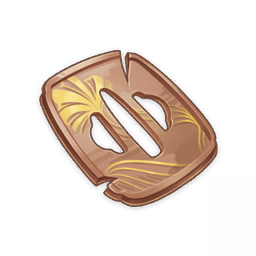</th>
      <th style="padding: 0; vertical-align: top;">
        

          

        破旧的刀镡
        

          

          

            
            <strong>描述：</strong> 
            装配在稻妻刀剑上的护具，见证过许多战斗。 
            对剑术纯熟者而言，镡可以在实战中阻挡对手的刀刃；而对于新手剑士，镡是保护自己右手的关键。
            
            

        

      </th>
    </tr>
  </thead>
</table>

<table  class="table-weapon">
  <thead>
    <tr>
      <th class="th-weapon" rowspan="1"></th>
      <th style="padding: 0; vertical-align: top;">
        

          

        影打刀镡
        

          

          

            
            <strong>描述：</strong> 
            装配在优秀刀剑上的护具。 
            稻妻有悠久的刀剑锻冶传统。匠人锻造一把刀时，常常会制造数柄样品，从中甄选。其中最为优秀的作品是为「真打」，而其余的则被称为「影打」。
            
            

        

      </th>
    </tr>
  </thead>
</table>

<table  class="table-weapon">
  <thead>
    <tr>
      <th class="th-weapon" rowspan="1"></th>
      <th style="padding: 0; vertical-align: top;">
        

          

        名刀镡
        

          

          

            
            <strong>描述：</strong> 
            装配在名刀上的华美护具。 
            有人坚信刀剑有灵魂、有生命，这也是为什么人们会为刀起名。爱护刀的人，也会得到刀的赏识。但与刀剑成为挚友、甚至爱人的人，须知这份情义是由杀伐浇灌的。常常浴血、与刀共舞之人，他们的热血最终总会被薄情的钢铁冷却。
            
            

        

      </th>
    </tr>
  </thead>
</table>

## 角色培养素材

<table  class="table-weapon">
  <thead>
    <tr>
      <th class="th-weapon" rowspan="1"></th>
      <th style="padding: 0; vertical-align: top;">
        

          

        魔偶机心
        

          

          

            
            <strong>描述：</strong> 
            能够驱动无机质的机关魔偶剑鬼，使它如同生者一般挥舞刀剑的核心。 
            无论是如何精湛的武艺、多么美丽的记忆，也会随着肉体的衰败而凋零。 
            恐怕只有将自己的四肢、躯体都换成牢固的机关，最终将心脏换成精密的「机心」，才能比凡骨肉胎更加接近永恒吧⋯
            
            

        

      </th>
    </tr>
  </thead>
</table>

<table  class="table-weapon">
  <thead>
    <tr>
      <th class="th-weapon" rowspan="1"></th>
      <th style="padding: 0; vertical-align: top;">
        

          

        恒常机关之心
        

          

          

            
            <strong>描述：</strong> 
            驱使恒常机关阵列自律行动的核心。 
            有人推测这种核心上的纹样当中以肉眼不可见的语言写上了智能与逻辑，也有人进一步认为这种特殊的遗迹机关因为格外庞大的核心与复杂的纹样，自发选择抛弃了生物的姿态，转而追求性能的强大。
            
            

        

      </th>
    </tr>
  </thead>
</table>

<table  class="table-weapon">
  <thead>
    <tr>
      <th class="th-weapon" rowspan="1"></th>
      <th style="padding: 0; vertical-align: top;">
        

          

        雷霆数珠
        

          

          

            
            <strong>描述：</strong> 
            雷音权现留下的，蕴含电气的雷之珠。 
            传说雷音权现只会随着雷霆降生在遗留着强大忿恨的土地上。驱使它永远地徘徊在破碎的土地上，释放贯天之雷的，在歌人的故事中往往是生命无法承受的失望与痛苦。
            
            

        

      </th>
    </tr>
  </thead>
</table>

<table  class="table-weapon">
  <thead>
    <tr>
      <th class="th-weapon" rowspan="1"></th>
      <th style="padding: 0; vertical-align: top;">
        

          

        万劫之真意
        

          

          

            
            <strong>描述：</strong> 
            在一切尘埃落定之后，从净土带回的小小头饰。 
            —念则万劫尽，总有思念可以超越时间。 
            百千万劫，「真」实之意，不知道是否传达到了。
            
            

        

      </th>
    </tr>
  </thead>
</table>

<table  class="table-weapon">
  <thead>
    <tr>
      <th class="th-weapon" rowspan="1">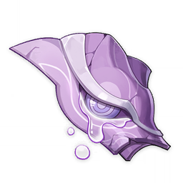</th>
      <th style="padding: 0; vertical-align: top;">
        

          

        祸神之禊泪
        

          

          

            
            <strong>描述：</strong> 
            从净土中取回的人偶关节，这一部分乃是「恶曜之眼」的造型。 
            仅仅依靠凝视就可以降下灾祸与诅咒，因此把人生之不顺归咎于「祸神」似乎理所当然。但是好好想想吧，倘若意志足够强大，信念足够坚定⋯ 
            万劫太过久远，凶星恶曜亦能以泪涤净自身。
            
            

        

      </th>
    </tr>
  </thead>
</table>

<table  class="table-weapon">
  <thead>
    <tr>
      <th class="th-weapon" rowspan="1">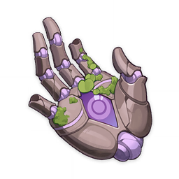</th>
      <th style="padding: 0; vertical-align: top;">
        

          

        凶将之手眼
        

          

          

            
            <strong>描述：</strong> 
            从净土中取回来的人偶关节，这一部分乃是象征着「所见即所为」的手眼造型。 
            已经化做祸神的「她」，同样可以驾驭此等手眼神通。目光所见之瞬间，便已斩出一刀。 
            然而万劫太过久远，凶将之骸亦得春生。
            
            

        

      </th>
    </tr>
  </thead>
</table>

<table  class="table-weapon">
  <thead>
    <tr>
      <th class="th-weapon" rowspan="1">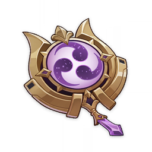</th>
      <th style="padding: 0; vertical-align: top;">
        

          

        无心的渊镜
        

          

          

            
            <strong>描述：</strong> 
            正机之主胸前用于隔断外界的镜面。特意绘上了三重巴纹以宣告其身份与威严。 
            此纹样并非向雷之主人宣告臣服， 
            而是刺往世间既有之威能的利刃； 
            此镜面并非隔绝世人批判之目光； 
            而是断却俗世一切之污脏的宫墙。 
            于此大殿中施舍惩戒，洗净蒙昧， 
            颠倒梦想、剜去心因，重书定业。
            
            

        

      </th>
    </tr>
  </thead>
</table>

## 角色突破素材

<table  class="table-weapon">
  <thead>
    <tr>
      <th class="th-weapon" rowspan="1"></th>
      <th style="padding: 0; vertical-align: top;">
        

          

        最胜紫晶碎屑
        

          

          

            
            <strong>描述：</strong> 
            角色突破素材。
            
            

        

      </th>
    </tr>
  </thead>
</table>

<table  class="table-weapon">
  <thead>
    <tr>
      <th class="th-weapon" rowspan="1"></th>
      <th style="padding: 0; vertical-align: top;">
        

          

        最胜紫晶断片
        

          

          

            
            <strong>描述：</strong> 
            角色突破素材。 
            「此身即是尘世最为殊胜尊贵之身。」
            
            

        

      </th>
    </tr>
  </thead>
</table>

<table  class="table-weapon">
  <thead>
    <tr>
      <th class="th-weapon" rowspan="1"></th>
      <th style="padding: 0; vertical-align: top;">
        

          

        最胜紫晶块
        

          

          

            
            <strong>描述：</strong> 
            角色突破素材。 
            「此身即是尘世最为殊胜尊贵之身。」 
            「应持天下之大权。」
            
            

        

      </th>
    </tr>
  </thead>
</table>

<table  class="table-weapon">
  <thead>
    <tr>
      <th class="th-weapon" rowspan="1"></th>
      <th style="padding: 0; vertical-align: top;">
        

          

        最胜紫晶
        

          

          

            
            <strong>描述：</strong> 
            角色突破素材。 
            「此身即是尘世最为殊胜尊贵之身。」 
            「应持天下之大权。」 
            「此身曾许诺予臣民一梦，既是千世万代不变不移的『永恒』。」
            
            

        

      </th>
    </tr>
  </thead>
</table>

## 角色天赋素材

<table  class="table-weapon">
  <thead>
    <tr>
      <th class="th-weapon" rowspan="1"></th>
      <th style="padding: 0; vertical-align: top;">
        

          

        「天光」的教导
        

          

          

            
            <strong>描述：</strong> 
            天赋培养素材。 
            雷之国土的愿望是天光。 
            自认通透一切的大君，永远企图将高天之光彩尽收囊中。然而无从分享的愿景，却反令须臾之人更加炽烈地追求，犹如飞蛾扑火。
            
            

        

      </th>
    </tr>
  </thead>
</table>

<table  class="table-weapon">
  <thead>
    <tr>
      <th class="th-weapon" rowspan="1">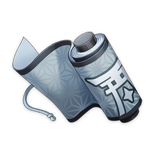</th>
      <th style="padding: 0; vertical-align: top;">
        

          

        「天光」的指引
        

          

          

            
            <strong>描述：</strong> 
            天赋培养素材。 
            雷之国土的愿望是天光。 
            即使晖光被重重雷云所掩盖，鸣神的国土之上，依旧有志士如云雀般突破雷光与天之怒海，追寻天光之迹，哪怕迎来冷酷的殛灭。
            
            

        

      </th>
    </tr>
  </thead>
</table>

<table  class="table-weapon">
  <thead>
    <tr>
      <th class="th-weapon" rowspan="1"></th>
      <th style="padding: 0; vertical-align: top;">
        

          

        「天光」的哲学
        

          

          

            
            <strong>描述：</strong> 
            天赋培养素材。 
            雷之国土的愿望是天光。 
            即使永远生活在地下，人也会不屈地祈求天光。人总是追逐超越，无可止步。静止封闭的永恒亦固然壮丽，但其本质终究是死亡。
            
            

        

      </th>
    </tr>
  </thead>
</table>

<table  class="table-weapon">
  <thead>
    <tr>
      <th class="th-weapon" rowspan="1">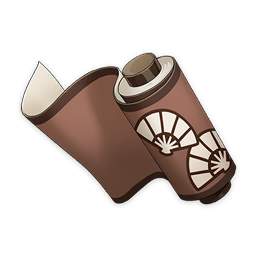</th>
      <th style="padding: 0; vertical-align: top;">
        

          

        「风雅」的教导
        

          

          

            
            <strong>描述：</strong> 
            天赋培养素材。 
            雷之国土的姿容是风雅。 
            风雅是不谄媚。风雅之人永远是高贵的。正似只愿高飞与雷暴争鸣的海鹰；迎合鄙俗则恰如将花冠倒插泥淖，仅让尊严染上了污渍。
            
            

        

      </th>
    </tr>
  </thead>
</table>

<table  class="table-weapon">
  <thead>
    <tr>
      <th class="th-weapon" rowspan="1">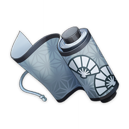</th>
      <th style="padding: 0; vertical-align: top;">
        

          

        「风雅」的指引
        

          

          

            
            <strong>描述：</strong> 
            天赋培养素材。 
            雷之国土的姿容是风雅。 
            风雅是不倨傲。风雅之人永远是谦虚的。只有消除虚荣与怠慢，才能明亮双眼，从哪怕最不堪入目的表象之下寻求美与雅致的真境。
            
            

        

      </th>
    </tr>
  </thead>
</table>

<table  class="table-weapon">
  <thead>
    <tr>
      <th class="th-weapon" rowspan="1"></th>
      <th style="padding: 0; vertical-align: top;">
        

          

        「风雅」的哲学
        

          

          

            
            <strong>描述：</strong> 
            天赋培养素材。 
            雷之国土的姿容是风雅。 
            风雅是不庸俗。风雅之人永远是独行的。不屈于平庸之恶，不感动于平庸之爱，不逃避于平庸的无知，才可能明辨何为雅致与鄙陋。
            
            

        

      </th>
    </tr>
  </thead>
</table>

<table  class="table-weapon">
  <thead>
    <tr>
      <th class="th-weapon" rowspan="1"></th>
      <th style="padding: 0; vertical-align: top;">
        

          

        「浮世」的教导
        

          

          

            
            <strong>描述：</strong> 
            天赋培养素材。 
            雷之国土的梦想是浮世。 
            浮世之荣华乃是人之美的最高体现。人之在世岂不与疾电相类？如美梦或花火般浮华一瞬，在永恒的夜幕中留下绚烂的印记。
            
            

        

      </th>
    </tr>
  </thead>
</table>

<table  class="table-weapon">
  <thead>
    <tr>
      <th class="th-weapon" rowspan="1"></th>
      <th style="padding: 0; vertical-align: top;">
        

          

        「浮世」的指引
        

          

          

            
            <strong>描述：</strong> 
            天赋培养素材。 
            雷之国土的梦想是浮世。 
            浮世之难求乃是人之美的价值所在。人之在世岂不与雷影相似？意欲追逐掇取则遥踞云端，灯火阑珊的静谧之时却不期而来。
            
            

        

      </th>
    </tr>
  </thead>
</table>

<table  class="table-weapon">
  <thead>
    <tr>
      <th class="th-weapon" rowspan="1"></th>
      <th style="padding: 0; vertical-align: top;">
        

          

        「浮世」的哲学
        

          

          

            
            <strong>描述：</strong> 
            天赋培养素材。 
            雷之国土的梦想是浮世。 
            浮世之短暂乃是人之美的本性所在。人之在世岂不与稻光相近？神威显现的刹那恍若隽永，而永恒的威鸣又有谁人能够承受？
            
            

        

      </th>
    </tr>
  </thead>
</table>

## 武器突破素材

<table  class="table-weapon">
  <thead>
    <tr>
      <th class="th-weapon" rowspan="1"></th>
      <th style="padding: 0; vertical-align: top;">
        

          

        今昔剧画之恶尉
        

          

          

            
            <strong>描述：</strong> 
            赋予武器突破之力的材料。 
            民话传说中，过去有名鬼人「虎千代」。武艺高强，曾有在刀剑一千柄当中狂舞，被割破的十二单如同堇花般零落，身体却未受一丝伤害的说法。后来却对将军大人露出獠牙，拔刀反叛，被斩下一臂一角后遁逃，最终郁愤发狂，自裁而殁。 
            狂言称怀抱执妄之鬼往往内心惊悸而忧患。妄想永恒却恐惧须史，总会为恐惧与怨怒吞没，是为自业自得。这种面具刻画的就是露出尖牙的虎千代。
            
            

        

      </th>
    </tr>
  </thead>
</table>

<table  class="table-weapon">
  <thead>
    <tr>
      <th class="th-weapon" rowspan="1"></th>
      <th style="padding: 0; vertical-align: top;">
        

          

        今昔剧画之虎啮
        

          

          

            
            <strong>描述：</strong> 
            赋予武器突破之力的材料。 
            《菫染山月虎啮鉴》中描绘的鬼人「虎千代」，曾以利齿咬碎将军的薙刀，取得过一时的上风。因此以他为原型制造的面具上往往有精心雕琢的尖牙。 
            在其结局中，负伤之兽般遁入林野，连清凉的月光也避之唯恐不及。穿过窄巷与峡谷的风声像是受伤的鬼在低声哀嚎，因此也有「虎千代风」这一季语。
            
            

        

      </th>
    </tr>
  </thead>
</table>

<table  class="table-weapon">
  <thead>
    <tr>
      <th class="th-weapon" rowspan="1"></th>
      <th style="padding: 0; vertical-align: top;">
        

          

        今昔剧画之一角
        

          

          

            
            <strong>描述：</strong> 
            赋予武器突破之力的材料。 
            在鬼族失落的子守奉公子守歌中，鬼人「虎千代」是一位翩翩少年，拥有优雅勇健的身姿与华丽的容貌。他原本是将军麾下的爱将，曾忠心追随她深入漆黑的渊薮，击退邪秽之物，为血脉日渐稀薄的鬼族争取功绩。 
            纵使如今这样的歌谣已经无人传唱了，以另一种形象流传下来的有角鬼面形象仍然有着非凡的力量。
            
            

        

      </th>
    </tr>
  </thead>
</table>

<table  class="table-weapon">
  <thead>
    <tr>
      <th class="th-weapon" rowspan="1"></th>
      <th style="padding: 0; vertical-align: top;">
        

          

        今昔剧画之鬼人
        

          

          

            
            <strong>描述：</strong> 
            赋予武器突破之力的材料。 
            背上「雷之三重巴」的纹样时名为「千代」的鬼族女武者，面对漆黑的军势时，曾被虎躯蛇尾的世外之兽吞下。最后她撕开魔兽的胸腔，得以幸存。 
            这是「虎啮的千代」之名的来由。在此后的岁月中，这一名号渐渐简化为「虎千代」。 
            但在深邃之兽的腹中，她染上了深罪的黯色，也透过猩红的利齿看见同行者被撕碎。沉湎于漆黑景色的她最终向御建鸣神主尊拔剑；后来，她持刀之臂与尖角被斩落，如同负伤的野兽般从城中逃向林野；再后来似乎是被天狗，或是终末番，或是山中修行的岩藏之胤当成不认得的怪物，收拾掉了罢，因为她俊美的容貌已经因为漆黑的仇恨与负伤痛苦变得狰狞扭曲。抑或是遇见了大蛇遗骸附近的鬼面执剑人形，故此结束了命运的旅途。 
            昔日曾与渊薮战斗者难免梦见漆黑的剧画。曾与魔兽厮杀又沦为当中一员者亦不在少数。 
            世界的边缘正在变得稀薄而脆弱，这种侵蚀或许并非是单向的。
            
            

        

      </th>
    </tr>
  </thead>
</table>

<table  class="table-weapon">
  <thead>
    <tr>
      <th class="th-weapon" rowspan="1">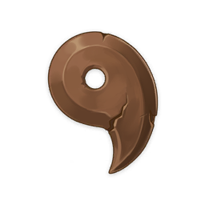</th>
      <th style="padding: 0; vertical-align: top;">
        

          

        鸣神御灵的明惠
        

          

          

            
            <strong>描述：</strong> 
            赋予武器突破之力的材料。 
            在过去，先民会攀登如今被称为影向山的高峰，将雷电灼烧过的树木雕琢成曲勾形，为照亮高天的闪电、震撼大地的鸣雷赋予造型。这个形象在漫长岁月的积累中，最终演化成了「雷之三重巴」的纹样，象征着雷的眷顾、智慧与威能，以及代行此等眷顾、智慧与威能的人们。
            
            

        

      </th>
    </tr>
  </thead>
</table>

<table  class="table-weapon">
  <thead>
    <tr>
      <th class="th-weapon" rowspan="1"></th>
      <th style="padding: 0; vertical-align: top;">
        

          

        鸣神御灵的欢喜
        

          

          

            
            <strong>描述：</strong> 
            赋予武器突破之力的材料。 
            在鸣神的幕府中设有奉行之名，乃是诸类事务的管理与执行者。在妖物悠长久远的故事中，在过去，深受将军殿下亲近信赖者会佩戴这种曲勾造型的护符；而奉行之名也取自欢喜奉行之意，得到她青睐的人，也会回报以爱与忠义。而从某一时点开始，一切都不再是原本的模样了。
            
            

        

      </th>
    </tr>
  </thead>
</table>

<table  class="table-weapon">
  <thead>
    <tr>
      <th class="th-weapon" rowspan="1"></th>
      <th style="padding: 0; vertical-align: top;">
        

          

        鸣神御灵的亲爱
        

          

          

            
            <strong>描述：</strong> 
            赋予武器突破之力的材料。 
            漫游在荒野中，或是与人一同生活的妖物都会被「雷之三重巴」所代表的御建鸣神主尊所吸引。纵使他们的寿命远远久于万物灵长，也有终结的一日。要在有限的寿命中求得永恒与无限，就只能骥望于「永恒」能记住他们了。而她也回应了他们的愿望，将所有的敌手与友人铭记于心。据说，无论是栖息在迷雾当中、撕裂天空的魔性之枭，胆敢擅闯御苑的怪化狸，还是那位武艺高强容貌如月、最终却对自己露出尖牙的鬼族少女；无论是曾经展开黑翼自在空行的天狗，抑或是与她同行，最终又永远消失的「狐斋宫大人」… 
            无数的故事静静地沉睡在她的心中，终有一日会在她所梦想的永恒净土中灼灼发光吧。
            
            

        

      </th>
    </tr>
  </thead>
</table>

<table  class="table-weapon">
  <thead>
    <tr>
      <th class="th-weapon" rowspan="1">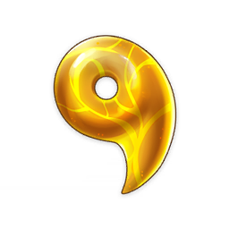</th>
      <th style="padding: 0; vertical-align: top;">
        

          

        鸣神御灵的勇武
        

          

          

            
            <strong>描述：</strong> 
            赋予武器突破之力的材料。 
            雷电之尊的重宝在于威严，威严由勇武与震怒体现，震怒源于心中的爱执，勇武则是震怒的权现。最终，无论何者，只要敢于挡住望向永恒的目光，只要敢于伤害稻妻的子民，就会成为她的敌人。 
            据说御灵有四魂，仙狐有三匹，名刀有二本；而御建鸣神主尊大御所大人的威严之相，只会呈现为流星光底的无想一线。
            
            

        

      </th>
    </tr>
  </thead>
</table>

<table  class="table-weapon">
  <thead>
    <tr>
      <th class="th-weapon" rowspan="1">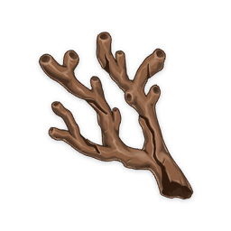</th>
      <th style="padding: 0; vertical-align: top;">
        

          

        远海夷地的瑚枝
        

          

          

            
            <strong>描述：</strong> 
            赋予武器突破之力的材料。 
            稻妻列岛中距离鸣神岛最遥远的「海祇」，在海祇岛的古语中的意思是「统管诸海的大神」。传说大蛇在常夜的渊下国土中初次现身时，身上覆满了四色的珊瑚枝，散发着煌煌的荧光。
            
            

        

      </th>
    </tr>
  </thead>
</table>

<table  class="table-weapon">
  <thead>
    <tr>
      <th class="th-weapon" rowspan="1">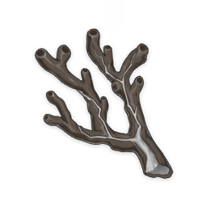</th>
      <th style="padding: 0; vertical-align: top;">
        

          

        远海夷地的玉枝
        

          

          

            
            <strong>描述：</strong> 
            赋予武器突破之力的材料。 
            这种珊瑚在提瓦特的大地上是见不到的，是大蛇闯入「暗之外海」时，获得的礼赠。因此对于深海的大蛇而言，身负珊瑚枝象征着力量；而失去珊瑚枝时，力量会相应地折损。换言之，折断的珊瑚枝中也蕴含着超常的力量。
            
            

        

      </th>
    </tr>
  </thead>
</table>

<table  class="table-weapon">
  <thead>
    <tr>
      <th class="th-weapon" rowspan="1"></th>
      <th style="padding: 0; vertical-align: top;">
        

          

        远海夷地的琼枝
        

          

          

            
            <strong>描述：</strong> 
            赋予武器突破之力的材料。 
            失去了一切、逃向暗之外海的魔神在海渊中，见到了什么都没有的弃民。于是它决定留下来，成为他们的「远吕羽氏尊」、「海祇大御神」。 
            传说大蛇神曾经折下身上所有的珊瑚枝，让蜷缩在黑暗中的孩子们拥有照亮周遭的光明。 
            又有一说它用折下的珊瑚枝架起了登高的阶梯，让它的孩子们再次回到了地面上，见到阳光。
            
            

        

      </th>
    </tr>
  </thead>
</table>

<table  class="table-weapon">
  <thead>
    <tr>
      <th class="th-weapon" rowspan="1">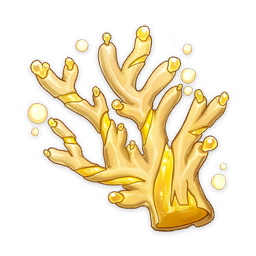</th>
      <th style="padding: 0; vertical-align: top;">
        

          

        远海夷地的金枝
        

          

          

            
            <strong>描述：</strong> 
            赋予武器突破之力的材料。 
            「海祇」之名所背负的含义，归根到底只是曾栖身在深海中的弃民，对引领他们的蛇神一厢情愿的期许罢了。 
            也正是因为有了仰望自己的子民，所以蛇神不得不留在本应逃离的世界里，折下身上的珊瑚枝，向自己不应涉足的土地入侵，与自己无法抗衡的敌手战斗，直到神体与山丘一同被斩断；直到鲜血化为电浆；直到思念与力量沦为永远无法消散的「祟神」。
            
            

        

      </th>
    </tr>
  </thead>
</table>

## 精炼材料

<table  class="table-weapon">
  <thead>
    <tr>
      <th class="th-weapon" rowspan="1"></th>
      <th style="padding: 0; vertical-align: top;">
        

          

        若狭的藁末
        

          

          

            
            <strong>描述：</strong> 
            	「东花坊时雨」专用的精炼 
纵然时节流转、昔日之雨散落成烟，总会有回忆重接思念，宛若置伞、伴梦同眠。
            
            

        

      </th>
    </tr>
  </thead>
</table>

<table  class="table-weapon">
  <thead>
    <tr>
      <th class="th-weapon" rowspan="1"></th>
      <th style="padding: 0; vertical-align: top;">
        

          

        赤穗酒枡
        

          

          

            
            <strong>描述：</strong> 
            	「渔获」专用的精炼道具。 
过去称霸清籁地方的赤穗百目鬼一众爱用的酒具。被海水带到了渔师的钓钩上。
            
            

        

      </th>
    </tr>
  </thead>
</table>

<table  class="table-weapon">
  <thead>
    <tr>
      <th class="th-weapon" rowspan="1"></th>
      <th style="padding: 0; vertical-align: top;">
        

          

        灼幽的磷焰
        

          

          

            
            <strong>描述：</strong> 
            	「且住亭御咄」专用的精炼道具。 
昔时以火焰为身奔行稻妻的妖怪，散落于四野的残留磷火。就像每一盏油灯都曾记忆围炉夜谈之人的话语，散落的焰火之中，或许也有对某人而言相当重要的回忆。
            
            

        

      </th>
    </tr>
  </thead>
</table>

## 锻造用矿石

<table  class="table-weapon">
  <thead>
    <tr>
      <th class="th-weapon" rowspan="1"></th>
      <th style="padding: 0; vertical-align: top;">
        

          

        紫晶块
        

          

          

            
            <strong>描述：</strong> 
            未经削切的矿物晶体，仅在稻妻列岛上产生。经过专门处理后，能展现其真正的价值。
            
            

        

      </th>
    </tr>
  </thead>
</table>

## 食材

<table  class="table-weapon">
  <thead>
    <tr>
      <th class="th-weapon" rowspan="1">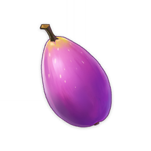</th>
      <th style="padding: 0; vertical-align: top;">
        

          

        堇瓜
        

          

          

            
            <strong>描述：</strong> 
            有着色泽艳丽的外皮的果实，其中的果肉可以在烹饪后转化为口感独特的食物。
            
            

        

      </th>
    </tr>
  </thead>
</table>

## 素材

<table  class="table-weapon">
  <thead>
    <tr>
      <th class="th-weapon" rowspan="1">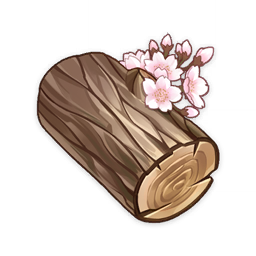</th>
      <th style="padding: 0; vertical-align: top;">
        

          

        梦见木
        

          

          

            
            <strong>描述：</strong> 
           产自「樱树」的木材，质感细腻，富含水分，据说能为人们带来暖春般的美梦。
            
            

        

      </th>
    </tr>
  </thead>
</table>

<table  class="table-weapon">
  <thead>
    <tr>
      <th class="th-weapon" rowspan="1">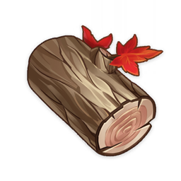</th>
      <th style="padding: 0; vertical-align: top;">
        

          

        枫木
        

          

          

            
            <strong>描述：</strong> 
           产自「羽扇枫」的木材，硬度适中，品质优异，色泽与纹理上佳。
            
            

        

      </th>
    </tr>
  </thead>
</table>

<table  class="table-weapon">
  <thead>
    <tr>
      <th class="th-weapon" rowspan="1">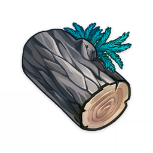</th>
      <th style="padding: 0; vertical-align: top;">
        

          

        孔雀木
        

          

          

            
            <strong>描述：</strong> 
           「柳杉」出产的木材，质地柔软，纹理平直，散发着浅淡的清香。
            
            

        

      </th>
    </tr>
  </thead>
</table>

<table  class="table-weapon">
  <thead>
    <tr>
      <th class="th-weapon" rowspan="1">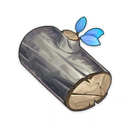</th>
      <th style="padding: 0; vertical-align: top;">
        

          

        御伽木
        

          

          

            
            <strong>描述：</strong> 
           「御伽树」出产的木材，水分和油脂的含量恰到好处，因此有着各种用途。
            
            

        

      </th>
    </tr>
  </thead>
</table>

## 稻妻区域特产

<table  class="table-weapon">
  <thead>
    <tr>
      <th class="th-weapon" rowspan="1">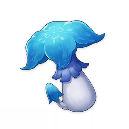</th>
      <th style="padding: 0; vertical-align: top;">
        

          

        幽灯蕈
        

          

          

            
            <strong>描述：</strong> 
           如同夜灯般微微发光的蘑菇，其中蕴含着不可思议的力量。
            
            

        

      </th>
    </tr>
  </thead>
</table>

<table  class="table-weapon">
  <thead>
    <tr>
      <th class="th-weapon" rowspan="1"></th>
      <th style="padding: 0; vertical-align: top;">
        

          

        天云草实
        

          

          

            
            <strong>描述：</strong> 
           生长在清籁岛的天云草结成的果实，贴在耳畔能听见微弱的电流声。
            
            

        

      </th>
    </tr>
  </thead>
</table>

<table  class="table-weapon">
  <thead>
    <tr>
      <th class="th-weapon" rowspan="1">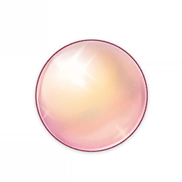</th>
      <th style="padding: 0; vertical-align: top;">
        

          

        珊瑚真珠
        

          

          

            
            <strong>描述：</strong> 
           与海祇的珊瑚相伴而生的宝珠，散发着月光般的丝丝凉意。
            
            

        

      </th>
    </tr>
  </thead>
</table>

<table  class="table-weapon">
  <thead>
    <tr>
      <th class="th-weapon" rowspan="1">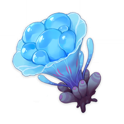</th>
      <th style="padding: 0; vertical-align: top;">
        

          

        海灵芝
        

          

          

            
            <strong>描述：</strong> 
           在某些特殊的海域中、岛屿上才会生长的特殊物种。虽然外形看起来像菌类，但其实是由软体生物分泌增生而成的。
            
            

        

      </th>
    </tr>
  </thead>
</table>

<table  class="table-weapon">
  <thead>
    <tr>
      <th class="th-weapon" rowspan="1"></th>
      <th style="padding: 0; vertical-align: top;">
        

          

        鸣草
        

          

          

            
            <strong>描述：</strong> 
           即使在无风的日子里，亦会随雷鸣之声隐隐振动的植物。看起来像是花瓣的结构其实是叶片的延伸，保护着脆弱的花朵。
            
            

        

      </th>
    </tr>
  </thead>
</table>

<table  class="table-weapon">
  <thead>
    <tr>
      <th class="th-weapon" rowspan="1">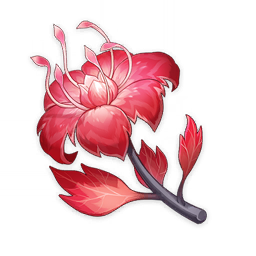</th>
      <th style="padding: 0; vertical-align: top;">
        

          

        血斛
        

          

          

            
            <strong>描述：</strong> 
           在诗文中也被称为「赤蕊」的鲜艳植物，一度在稻妻列岛绝迹，如今在战场上再度重现。传说在血腥的战场上，它们开得格外妖艳。
            
            

        

      </th>
    </tr>
  </thead>
</table>

<table  class="table-weapon">
  <thead>
    <tr>
      <th class="th-weapon" rowspan="1"></th>
      <th style="padding: 0; vertical-align: top;">
        

          

        晶化骨髓
        

          

          

            
            <strong>描述：</strong> 
           蕴含着「祟神」力量的晶体。冶炼时加入这种物质的话，能极大地提高钢铁制品的强度与韧性。
            
            

        

      </th>
    </tr>
  </thead>
</table>

<table  class="table-weapon">
  <thead>
    <tr>
      <th class="th-weapon" rowspan="1">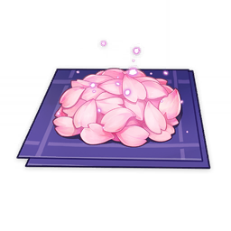</th>
      <th style="padding: 0; vertical-align: top;">
        

          

        绯樱绣球
        

          

          

            
            <strong>描述：</strong> 
           从鸣神大社的神樱上飘落的花瓣，怀着稻妻大地的眷顾。
            
            

        

      </th>
    </tr>
  </thead>
</table>

<table  class="table-weapon">
  <thead>
    <tr>
      <th class="th-weapon" rowspan="1"></th>
      <th style="padding: 0; vertical-align: top;">
        

          

        鬼兜虫
        

          

          

            
            <strong>描述：</strong> 
           栖息在雷元素富集区域的奇异甲虫。与甲壳上宛如怒目而视的恶鬼之相相反，鬼兜虫其实非常温顺迟钝。
            
            

        

      </th>
    </tr>
  </thead>
</table>

