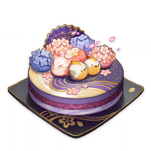

# 冒险道具

<table  class="table-weapon">
  <thead>
    <tr>
      <th class="th-weapon" rowspan="1"></th>
      <th style="padding: 0; vertical-align: top;">
        

          

        散失的雷神瞳
        

          

          

            
            <strong>描述：</strong> 
           浓烈的雷元素能量积聚成的物质。献给雷的神像，能弥补它在漫长岁月中散失的力量。
            
            

        

      </th>
    </tr>
  </thead>
</table>

<table  class="table-weapon">
  <thead>
    <tr>
      <th class="th-weapon" rowspan="1"></th>
      <th style="padding: 0; vertical-align: top;">
        

          

        雷神瞳共鸣石
        

          

          

            
            <strong>描述：</strong> 
           在稻妻使用时，能寻找附近的「散失的雷神瞳」。 
           能够与雷之七天神像共鸣的奇特石盘。因为这种性质，也能感知神瞳的存在。 
           在无边无际的漫长的岁月中，宏伟的城池与造像也会被风雨侵蚀，七天神像的力量也会慢慢逸散。但逸散的力量会结成「神瞳」的形象，无声呼唤着只属于它的神像。
            
            

        

      </th>
    </tr>
  </thead>
</table>

<table  class="table-weapon">
  <thead>
    <tr>
      <th class="th-weapon" rowspan="1"></th>
      <th style="padding: 0; vertical-align: top;">
        

          

        给旅行者的小蛋糕
        

          

          

            
            <strong>描述：</strong> 
           某个意义重大的日子留下的纪念品。 
 
献给越过海浪与山峦的你。 
祈愿你在这片大地上的旅程美好幸福。 

某个意义重大的日子留下的纪念品。 
 
献给越过海浪与山峦的你。 
祈愿你在这片大地上的旅程美好幸福。 
 
「每隔七天，推荐菜就会轮换一次。每隔三十天，月亮就会播撒新的祝福。下次为你庆祝，居然还要接近九千小时！往后的日子无论是晴还是阴雨，派蒙都要和旅行者一起度过，嘿嘿。」
            
            

        

      </th>
    </tr>
  </thead>
</table>

<table  class="table-weapon">
  <thead>
    <tr>
      <th class="th-weapon" rowspan="1"></th>
      <th style="padding: 0; vertical-align: top;">
        

          

        稻妻地灵龛之钥
        

          

          

            
            <strong>描述：</strong> 
           能破除散布在稻妻大地各处的远古地灵龛封印。 
大地上矗立着的远古神龛，随着那个文明的覆灭，也将自己封锁了。在幽深的秘境中寻得的密钥能破除封印，或许只是利用过去的气息，让神龛忘记一切尽毁之事吧。
            
            

        

      </th>
    </tr>
  </thead>
</table>

