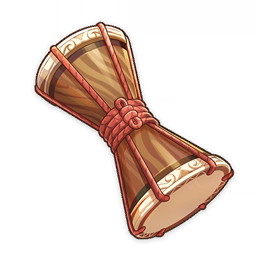
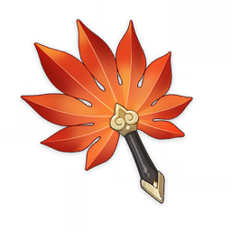
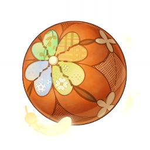
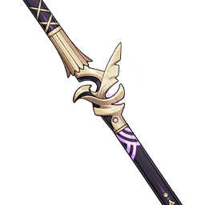
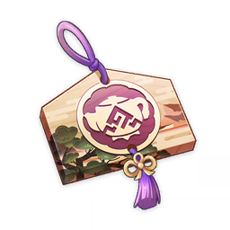

# 小道具

<table  class="table-weapon">
  <thead>
    <tr>
      <th class="th-weapon" rowspan="1"></th>
      <th style="padding: 0; vertical-align: top;">
        

          

        绮筵之鼓
        

          

          

            
            <strong>描述：</strong> 
           使用后，可以进行演奏的乐器。 
           构造独特，音色清脆的小鼓。外形雅致，做工精细，采用了上佳的材料，兼顾了演奏时的音质、音准与长期使用的耐损度。 
            相传，这种小鼓结合了稻妻传统乐器与异国之鼓的特点，演奏某些乐曲之时，还能为人们带来好运的护佑…
            
            

        

      </th>
    </tr>
  </thead>
</table>

<table  class="table-weapon">
  <thead>
    <tr>
      <th class="th-weapon" rowspan="1"></th>
      <th style="padding: 0; vertical-align: top;">
        

          

        荒泷·盛世豪鼓
        

          

          

            
            <strong>描述：</strong> 
           使用后，可以进行演奏的乐器。 
           一斗赠予的小鼓，是在一个异国商人那里买到的，虽然外观看起来普普通通，但据说是古代大阴阳师留下的宝具，有驱灾祈福的妙用。 
            普通人若想要据为己有，代价将十分高昂，但如果与此鼓有缘，价格便可以再商量。 
            真实惠呀，原价八百万摩拉的贵重物品，最后只要八万摩拉就可以买到，感觉让一斗占了大便宜。
            
            

        

      </th>
    </tr>
  </thead>
</table>

<table  class="table-weapon">
  <thead>
    <tr>
      <th class="th-weapon" rowspan="1"></th>
      <th style="padding: 0; vertical-align: top;">
        

          

        「式小将」
        

          

          

            
            <strong>描述：</strong> 
           「式大将」所赠的礼物，极具灵性的拓本。虽然「式小将」无法使用符法，但无论位于何地，它都能与「式大将」保持联系，分享所见所闻，就像将「式大将」带在身边一同旅行。
            
            

        

      </th>
    </tr>
  </thead>
</table>

<table  class="table-weapon">
  <thead>
    <tr>
      <th class="th-weapon" rowspan="1"></th>
       <th style="padding: 0; vertical-align: top;">
        

          

        奇特的羽毛
        

          

          

            
            <strong>描述：</strong> 
           奇特的羽毛。 
            在鹤观的土地上，有时似乎能发挥神奇的作用。 
            带着这枚羽毛，走遍世界吧。 
             
            毕竟，已经和他说好了。
            
            

        

      </th>
    </tr>
  </thead>
</table>

<table  class="table-weapon">
  <thead>
    <tr>
      <th class="th-weapon" rowspan="1"></th>
       <th style="padding: 0; vertical-align: top;">
        

          

        「留念镜」
        

          

          

            
            <strong>描述：</strong> 
           神秘的「透镜」。透过它观测特殊的小狐狸雕像，可以找到原本不存在的东西。 
            据说在很久以前，传说中的「狐斋宫大人」曾经将一件法器作为退邪之物赠与彼时柊家家主弘嗣。 
            柊以其为透镜部件的材料，后来从异国定做了特殊的「留影机」，并将其作为情谊的象征，回赠鸣神大社。
            
            

        

      </th>
    </tr>
  </thead>
</table>

<table  class="table-weapon">
  <thead>
    <tr>
      <th class="th-weapon" rowspan="1"></th>
      <th style="padding: 0; vertical-align: top;">
        

          

        红羽团扇
        

          

          

            
            <strong>描述：</strong> 
           具有某种神奇力量的道具。在「天狗」的手中，可以发挥各种各样的力量；而在一般人的手里，也能在空游时发挥「让身体稍微变得轻盈一点」程度的能力。
            
            

        

      </th>
    </tr>
  </thead>
</table>

<table  class="table-weapon">
  <thead>
    <tr>
      <th class="th-weapon" rowspan="1"></th>
      <th style="padding: 0; vertical-align: top;">
        

          

        雷之寻宝罗盘
        

          

          

            
            <strong>描述：</strong> 
           在稻妻使用时，能寻找附近的宝箱和宝箱相关的线索。 
           雷之列岛的土地曾经受过诸多伤害。伴随着创伤与恢复而来的是遍布各岛的诸多宝藏。
            
            

        

      </th>
    </tr>
  </thead>
</table>

<table  class="table-weapon">
  <thead>
    <tr>
      <th class="th-weapon" rowspan="1"></th>
     <th style="padding: 0; vertical-align: top;">
        

          

        风佑之羽球
        

          

          

            
            <strong>描述：</strong> 
           以纯净的鸟羽和坚韧的布料所制作的羽球，或许拥有某种奇妙的力量…
            
            

        

      </th>
    </tr>
  </thead>
</table>

<table  class="table-weapon">
  <thead>
    <tr>
      <th class="th-weapon" rowspan="1"></th>
      <th style="padding: 0; vertical-align: top;">
        

          

        鸣川鹈饲
        

          

          

            
            <strong>描述：</strong> 
           钓鱼过程中，若能使张力处于最佳张力区，使用此竿可稳定缩短鱼儿挣扎时间，提高钓鱼成功率。仅稻妻地区生效。 
           为纪念古老的鹈饲捕鱼法而制的长竿，竿尖的红宝石象征着鹈匠的火绒，竿身的鸟饰象征着鹈匠的鸬鹚，它们曾指引辛勤的稻妻先辈度过艰难的灾变年代。如今这种生产力低下的捕鱼法基本已被弃用，但那种顽强的开拓精神却伴随此竿一同传承下来。
            
            

        

      </th>
    </tr>
  </thead>
</table>

<table  class="table-weapon">
  <thead>
    <tr>
      <th class="th-weapon" rowspan="1"></th>
     <th style="padding: 0; vertical-align: top;">
        

          

        「四方之网」
        

          

          

            
            <strong>描述：</strong> 
           珊瑚的友人受到启发后，借鉴了「惟神阴阳术」，制作出的方便道具。虽然力量不足以降伏犯罪，但只要认真瞄准的话，捕捉小动物不在话下。
            
            

        

      </th>
    </tr>
  </thead>
</table>

<table  class="table-weapon">
  <thead>
    <tr>
      <th class="th-weapon" rowspan="1"></th>
     <th style="padding: 0; vertical-align: top;">
        

          

        「四方八方之网」
        

          

          

            
            <strong>描述：</strong> 
           若紫用阴阳术式再次改造过的网子。据说可以拘出小动物的神形，并且以网子为媒介，再次化出小动物的形体。
             
           <strong>「图鉴」内描述：</strong> 
           利用「阴阳术式」，制造的「网」。可以拘出小动物的神形，并且以其为媒介，再次化出小动物的形体。在稻妻的某处，存在着利用「阴阳术」再现魔物、寇首的战斗训练场地；这种「网」的技术或许就是知识与力量在年月的磨损中劣化后，又再现出来的产物吧。
            
            

        

      </th>
    </tr>
  </thead>
</table>

<table  class="table-weapon">
  <thead>
    <tr>
      <th class="th-weapon" rowspan="1"></th>
      <th style="padding: 0; vertical-align: top;">
        

          

        「绘绮之枕印」
         

          

          

            
            <strong>描述：</strong> 
           	饰有彩画的绘马，由品质上佳的梦见木精雕细刻而成，描绘着明丽的稻妻风光。 
借由「外景之能」，方可将彩画上的风雅景致呈现在「尘歌壶」之中…
            
            

        

      </th>
    </tr>
  </thead>
</table>

<table class="table-weapon">
  <thead>
    <tr>
      <th class="th-weapon" rowspan="1">
        
      </th>
      <th style="padding: 0; vertical-align: top;">
        

          

            旋曜玉帛
            

          

          

            
                <strong>描述：</strong> 
           	    	蕴含着韵律的奇妙结晶，宛如细腻丝绸编织而成的美玉。零星散布在大陆各地，或是寻觅珍奇的商人手中。通过「尘歌壶」中的「千籁至音·飖扬」或「千籁至音·缪绕」，可以还原记录在其中的旋律。当前「旋曜玉帛」中蕴含的旋律为「同伴的力量」。
            
          

        

      </th>
    </tr>
    <tr>
        <th colspan="2" style="font-weight: normal;">
        <strong>编号与音乐对照表：</strong> 
        <table class="table-weapon-1">
          <thead>
            <tr>
             <th class="th-weapon" style="font-weight: normal;">47</th>
             <th class="th-weapon" style="font-weight: normal;">「空寂如常」</th>
             <th class="th-weapon" style="font-weight: normal;">大世界拾取·稻妻·鸣神大社</th>
             </tr>
             <tr>
             <th class="th-weapon" style="font-weight: normal;">48</th>
             <th class="th-weapon" style="font-weight: normal;">「风雅之里」</th>
             <th class="th-weapon" style="font-weight: normal;">大世界拾取·稻妻·稻妻城</th>
             </tr>
             <tr>
             <th class="th-weapon" style="font-weight: normal;">49</th>
             <th class="th-weapon" style="font-weight: normal;">「静谧的国土」</th>
             <th class="th-weapon" style="font-weight: normal;">大世界拾取·稻妻·稻妻城</th>
             </tr>
             <tr>
             <th class="th-weapon" style="font-weight: normal;">50</th>
             <th class="th-weapon" style="font-weight: normal;">「神秘之岛」</th>
             <th class="th-weapon" style="font-weight: normal;">大世界拾取·稻妻·镇守之森</th>
             </tr>
             <tr>
             <th class="th-weapon" style="font-weight: normal;">51</th>
             <th class="th-weapon" style="font-weight: normal;">「绵延的守护」</th>
             <th class="th-weapon" style="font-weight: normal;">周游壶灵·阿嘟处购买</th>
             </tr>
             <tr>
             <th class="th-weapon" style="font-weight: normal;">52</th>
             <th class="th-weapon" style="font-weight: normal;">「悠远的关怀」</th>
             <th class="th-weapon" style="font-weight: normal;">大世界拾取·稻妻·镇守之森</th>
             </tr>
             <tr>
             <th class="th-weapon" style="font-weight: normal;">53</th>
             <th class="th-weapon" style="font-weight: normal;">「华散之缘」</th>
             <th class="th-weapon" style="font-weight: normal;">大世界拾取·稻妻·神里屋敷</th>
             </tr>
             <tr>
             <th class="th-weapon" style="font-weight: normal;">54</th>
             <th class="th-weapon" style="font-weight: normal;">「终有谢时」</th>
             <th class="th-weapon" style="font-weight: normal;">大世界拾取·稻妻·神里屋敷</th>
             </tr>
             <tr>
             <th class="th-weapon" style="font-weight: normal;">55</th>
             <th class="th-weapon" style="font-weight: normal;">「雷樱闪闪」</th>
             <th class="th-weapon" style="font-weight: normal;">周游壶灵·阿嘟处购买</th>
             </tr>
             <tr>
             <th class="th-weapon" style="font-weight: normal;">56</th>
             <th class="th-weapon" style="font-weight: normal;">「林间清流」</th>
             <th class="th-weapon" style="font-weight: normal;">大世界拾取·稻妻·镇守之森</th>
             </tr>
             <tr>
             <th class="th-weapon" style="font-weight: normal;">57</th>
             <th class="th-weapon" style="font-weight: normal;">「伤痛的事话」</th>
             <th class="th-weapon" style="font-weight: normal;">周游壶灵·阿嘟处购买</th>
             </tr>
             <tr>
             <th class="th-weapon" style="font-weight: normal;">58</th>
             <th class="th-weapon" style="font-weight: normal;">「寂静的证言」</th>
             <th class="th-weapon" style="font-weight: normal;">周游壶灵·阿嘟处购买</th>
             </tr>
             <tr>
             <th class="th-weapon" style="font-weight: normal;">59</th>
             <th class="th-weapon" style="font-weight: normal;">「硝彩回忆」</th>
             <th class="th-weapon" style="font-weight: normal;">周游壶灵·阿嘟处购买</th>
             </tr>
             <tr>
             <th class="th-weapon" style="font-weight: normal;">60</th>
             <th class="th-weapon" style="font-weight: normal;">「祭典将至」</th>
             <th class="th-weapon" style="font-weight: normal;">周游壶灵·阿嘟处购买</th>
             </tr>
             <tr>
             <th class="th-weapon" style="font-weight: normal;">61</th>
             <th class="th-weapon" style="font-weight: normal;">「溢彩华庭」</th>
             <th class="th-weapon" style="font-weight: normal;">周游壶灵·阿嘟处购买</th>
             </tr>
             <tr>
             <th class="th-weapon" style="font-weight: normal;">62</th>
             <th class="th-weapon" style="font-weight: normal;">「远离尘嚣」</th>
             <th class="th-weapon" style="font-weight: normal;">周游壶灵·阿嘟处购买</th>
             </tr>
             <tr>
             <th class="th-weapon" style="font-weight: normal;">63</th>
             <th class="th-weapon" style="font-weight: normal;">「清潭镜澄」</th>
             <th class="th-weapon" style="font-weight: normal;">周游壶灵·阿嘟处购买</th>
             </tr>
             <tr>
             <th class="th-weapon" style="font-weight: normal;">64</th>
             <th class="th-weapon" style="font-weight: normal;">「海祇之岛」</th>
             <th class="th-weapon" style="font-weight: normal;">周游壶灵·阿嘟处购买</th>
             </tr>
             <tr>
             <th class="th-weapon" style="font-weight: normal;">65</th>
             <th class="th-weapon" style="font-weight: normal;">「雾锁烟迷」</th>
             <th class="th-weapon" style="font-weight: normal;">周游壶灵·阿嘟处购买</th>
             </tr>
             <tr>
             <th class="th-weapon" style="font-weight: normal;">66</th>
             <th class="th-weapon" style="font-weight: normal;">「潸怅的幽影」</th>
             <th class="th-weapon" style="font-weight: normal;">周游壶灵·阿嘟处购买</th>
             </tr>
             <tr>
             <th class="th-weapon" style="font-weight: normal;">67</th>
             <th class="th-weapon" style="font-weight: normal;">「阿瑠的歌」</th>
             <th class="th-weapon" style="font-weight: normal;">周游壶灵·阿嘟处购买</th>
             </tr>
             <tr>
             <th class="th-weapon" style="font-weight: normal;">68</th>
             <th class="th-weapon" style="font-weight: normal;">「良夜岑寂」</th>
             <th class="th-weapon" style="font-weight: normal;">周游壶灵·阿嘟处购买</th>
             </tr>
             <tr>
             <th class="th-weapon" style="font-weight: normal;">69</th>
             <th class="th-weapon" style="font-weight: normal;">「孤独的回响」</th>
             <th class="th-weapon" style="font-weight: normal;">周游壶灵·阿嘟处购买</th>
             </tr>
             <tr>
             <th class="th-weapon" style="font-weight: normal;">70</th>
             <th class="th-weapon" style="font-weight: normal;">「失语的哀诉」</th>
             <th class="th-weapon" style="font-weight: normal;">周游壶灵·阿嘟处购买</th>
             </tr>
             <tr>
             <th class="th-weapon" style="font-weight: normal;">71</th>
             <th class="th-weapon" style="font-weight: normal;">「葛藤无奈满石垣」</th>
             <th class="th-weapon" style="font-weight: normal;">周游壶灵·阿嘟处购买</th>
             </tr>
             <tr>
             <th class="th-weapon" style="font-weight: normal;">72</th>
             <th class="th-weapon" style="font-weight: normal;">「雷隐遗事」</th>
             <th class="th-weapon" style="font-weight: normal;">周游壶灵·阿嘟处购买</th>
             </tr>
          </thead>
        </table>
        </th>
    </tr>
  </thead>
</table>

