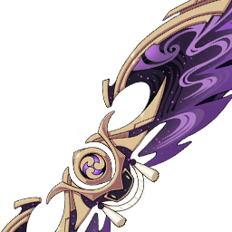

# 风之翼

<table  class="table-weapon">
  <thead>
    <tr>
      <th class="th-weapon" rowspan="1"></th>
      <th style="padding: 0; vertical-align: top;">
        

          

        梦生须臾之翼
        

          

          

            
            <strong>描述：</strong> 
           风之翼款式。因为在乐曲奏响时得以进入往昔之梦，于一瞬恍惚之中所得。
            
            

        

      </th>
    </tr>
    <tr>
        <th colspan="2" style="font-weight: normal;">
         <strong>故事：</strong> 
        这只是有关一首名为《蜉蝣梦羽》的弦曲的小事。 
        这曲子并非什么了不起的高雅名曲，虽说一度曾因其旋律动听而广受喜爱。 
        但所谓的流行也就是那么一回事，新谱现世，以往的曲子也逐渐变得无人问津。 
        到后来，连写出这首曲子的人姓甚名谁都无人知晓。 
        众人皆说，那人不过是才华如昙花，只此一现的诸多歌者之一罢了。
          
        「不过是才华如昙花，只此一现的诸多歌者之一…」 
        说出坊间人评论的时候，她看着自己坐在庭边长廊的姐姐。 
        她的姐姐背对着她，手中斜抱着琴，三两下、三两下拨动丝弦。 
        「世人还说，蜉蝣一生短暂，仍要沉湎于梦，太过靡靡。」 
        记忆里，她的姐姐始终背对着她，没有回应她转述的那些话语，只是又一遍弹起了那首渐被世人遗忘的曲调。 
        毕竟作曲的人总是喜欢自己作的曲子的。 
        但是那之后，她的姐姐也很少有那样的闲暇，再后来…她也永远失去了听对方亲手弹奏此曲的机会。 
        不过相较她的姐姐，她本就不太热衷此道，便也要逐渐忘去这些事了。
          
        再一次听到，是她私下出行，于一酒肆檐下避雨之时。 
        目盲的琴师为向老板讨酒喝，将此曲弹出，老人的技艺称不上精湛，但也已足够。 
        弦曲弹毕，讨得一碗酒下肚，微醺的琴师说这曲子原是贵不可言的贵人所作，言之凿凿。 
        不过是流浪江湖的人惯常吹嘘见闻的说辞罢了，周围又有几个人会相信呢。 
        满堂哄笑之中，唯有她突然忆起。 
        突然忆起午后日光正盛的庭院，忆起那时吹皱池塘的煦风，些微晃动的树荫，三两下、三两下的拨弦声响… 
        以及那太久没见过的，抱着弦琴坐在廊边的身影。 
        正要侧过脸来，侧过脸来…
          
        蜉蝣不好吗？万物瞬生即灭，朝饮白露暮尘土也可怀有热烈之梦。 
        昙花不好吗？一夜花开花谢，亦是观者见过便无法从心中抹去的光景。 
        而所谓回忆，所谓回忆。 
        回忆不正是往昔种种须臾，转瞬恍惚间的唤起？
          
        「…这具风之翼据说是社奉行在整理以前旧物时，在蒙尘的琴边发现的。于我已无太大作用，便赠与你吧。」 
        女子述说如是话语的时候，手中的旧琴已重新上漆，只不过持琴人的姿势还是太过生疏。 
        似乎察觉到你感到期待的眼光，她轻叹一声。 
        「先说好，我的琴艺可远没有我的武艺那般好。」 
        她忆起旧时，弹起她唯一学会的那首乐曲。 
        </th>
    </tr>
  </thead>
</table>

<table  class="table-weapon">
  <thead>
    <tr>
      <th class="th-weapon" rowspan="1"></th>
      <th style="padding: 0; vertical-align: top;">
        

          

        雷腾云奔之翼
        

          

          

            
            <strong>描述：</strong> 
           风之翼款式。因为得到稻妻的认可与嘉许，而获赠的礼物。
            
            

        

      </th>
    </tr>
    <tr>
        <th colspan="2" style="font-weight: normal;">
         <strong>故事：</strong> 
        「所谓天狗啊——除了血脉悠久的影向天狗家系，我们也会用来形容身手敏捷、行踪难测的名士。你看，天狗也有翅膀对不对。」 
        这句话，你一开始有点不相信。
          
        「所谓『天狗』啊，首先需要是能在空中自在的大神通者。阁下在稻妻全境乘风架云，飞屋檐走山壁，其灵动之身姿，恐怕比起鸦与隼也不逞多让吧。 
        「在过去，我们稻妻也有向往天狗，而模仿天狗的『天狗党人』，坐于天守阁顶、大树高杉、鸟居神额之上，高声嘲笑底下的民众与官差，还在御苑里留下了轰动一时的『天守阁下天狗落书』，目空大社与幕府的威信。 
        「实在是一群洒脱自在的人哪。后来这群人被真正的天狗逮住后，好好教训了一番。 
        「啊——对了。您是奉公守法、恪守公序良俗之人，自然不必为这个传说烦心哪。」 
        因为你也经常展开风之翼俯瞰町街屋舍，攀登石垣高墙，所以实在是不便多做评论。
          
        「其次啊，天狗这一称呼，也会用来形容剑术无双的剑士。除去鸣神亲传衍生的流派大系、曾昙花一现的『雾切』与『明镜止水流』，传承至今的另有『岩藏流』一系。岩藏剑术中不传一般门徒的秘剑『天狗抄』，据说便是以剑路诡异、剑速卓绝的影向天狗作为敌人，都能胜过的剑术。阁下的身手与战绩，我想也不必多提了。 
        「最后啊，天狗也常常拥有掌管风雷的神通。传说中，影向天狗中代代相传的宝器中，有一面『风雷之扇』，正面呼风，反面唤雷。阁下既能使用风元素的力量，也能运用雷元素的力量，当然能称天狗啦！顺带一提，那风雷扇子其实只是戏法罢了。一般来说，为了防止露馅，能呼风的天狗和能唤雷的天狗会结伴出行。」 
        站在一旁的裟罗比你更加明显表现出了尴尬。
          
        「现在大社表彰您对稻妻做出的贡献，把这个风之翼赠送与你。」 
        所以天狗的翅膀是这么来的吗？ 
        明显察觉到了你的疑惑目光，裟罗立刻抢答了： 
        「当然不是啦！」 
        </th>
    </tr>
  </thead>
</table>

<table  class="table-weapon">
  <thead>
    <tr>
      <th class="th-weapon" rowspan="1"></th>
      <th style="padding: 0; vertical-align: top;">
        

          

        森郁花繁之翼
        

          

          

            
            <strong>描述：</strong> 
           风之翼款式。因为得到须弥的认可与嘉许，而获赠的礼物。
            
            

        

      </th>
    </tr>
    <tr>
        <th colspan="2" style="font-weight: normal;">
         <strong>故事：</strong> 
        因曾经的须弥少梦，所以人们有一种迷信：若是睡中有心成之相，定是草神的开示与点化。其背后一定有高深奥妙的真实。或许正是因为这个传统，才有「虚空」也说不定。 
曾经的大师菲尔纳斯——不是现在教令院的大导师这个——曾经自称多梦而且善于记写。因此他作为诗人或者白日梦病患比他作为学者与发明家更为有名。毕竟须弥少梦，如果他真的做梦，那恐怕也是每日都在草王面前列圣的神选之人了。对嫉妒他才能之人来讲，只能说好在白日梦不算梦。 
 
传说他曾见识过远国的风之翼，它作为器物的运行原理完全不符合形而下学。如果不是风神的祝福分散在每一件风之翼上，这东西佩给雄鹰都能让它高空失足，砸碎地上的龟壳。 
就这样，大师菲尔纳斯——我再强调一下，不是现在在职的大导师这个菲尔纳斯——决心做一个没有风神祝福的风之翼。它必定能以自己的美感与万物的规律飞翔。 
 
于是他回去日夜操劳，终于有一日不堪疲惫睡着了。传说他又在睡中见到了草神。 
那生灵的怙主听说了大师菲尔纳斯的苦恼，哈哈一笑，给他讲了一个故事： 
 
故事是关于化成人形的风与能开口说话的石头，以及呃…雷元素的木头的。它们三个讨论世间的构成，都认为自己应该是基本元素之一。石头说我承载万物，大家同意。木头说，人脑的思绪一念万千，都是电的作用。大家觉得勉强，不过也不好说不对。轮到风的时候，他说了一个故事： 
 
异世的传说里，高天有诸多大气的孩子，他们都是风的精灵。其他精灵削凿群山和硕岩，或者呼出龙卷搬运云水，威力无比。只有最小的孩子，生命的吹息因为力量微弱被人看不起。他于是消隐了身形。无人授粉的风媒花感到了痛苦，于是最勇敢的一粒蒲公英找到了生命的吹息。为了鼓励他，他讲了一个故事： 
 
曾经有一个遥远的国度，其女王强大而且美丽，仿佛太阳散出光芒。只不过她的弟弟，却是一个纨绔放浪的骑士…（中略）…女王的女侍为了鼓励女王，对她讲了一个故事： 
 
… 
 
那一夜后，大师菲尔纳斯做了一个风之翼，并且请求了风神对它加以祝福。虽然最后结果和早已被发明的风之翼一致，但是教令院判定这只是偶发的一致。 
传说，大师醒来第一句话语就是：「我知道啦！答案就在眼皮底下。」 
其实他的第一句话是：「饶了我吧，我知道啦！答案就在眼皮底下。神的恩惠也是世界的规则，求您别讲了。」 
 
这个寓言告诉我们：穷极世间真理固然可敬，但是别在幻梦里寻找物理。 
怎么样，你要收下这个大师菲尔纳斯的风之翼吗？
        </th>
    </tr>
  </thead>
</table>

