# 食物

::: info 介绍
<strong>收录内容：</strong><Badge type="tip" text="提及雷电将军"/><Badge type="tip" text="活动「有香自西来」雷电将军喜欢和讨厌的食物"/><Badge type="tip" text="雷电将军生日邮件奖励食物"/><Badge type="tip" text="关联雷电将军"/>

:::

<table  class="table-weapon">
  <thead>
    <tr>
      <th class="th-weapon" rowspan="1"></th>
      <th style="padding: 0; vertical-align: top;">
        

          

        紫苑云霓
        

          

          

            
            <strong>描述：</strong> 
            别具一格的饮品。蒙德生长的嘟嘟莲和稻妻特产堇瓜，跨越了山海碰撞于一处，柔滑的牛奶与清新的瓜果香气交织相融，带给人耳目一新的享受。难怪书中生病了的将军大人喝完后也会打起精神，简直毫不夸张！
            
            

        

      </th>
    </tr>
  </thead>
</table>

<table  class="table-weapon">
  <thead>
    <tr>
      <th class="th-weapon" rowspan="1">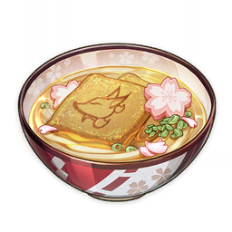</th>
      <th style="padding: 0; vertical-align: top;">
        

          

        福内乌冬
        

          

          

            
            <strong>描述：</strong> 
            八重神子的特色料理。中间的油豆腐是庄重的「狐狸小姐」的特殊定制品，据说如果心怀诚意，一口气全部吃完的话，接下去的一整天内都能得到「狐仙大人」的庇佑，晦气远远，福气满满。
            
            

        

      </th>
    </tr>
  </thead>
</table>

<table  class="table-weapon">
  <thead>
    <tr>
      <th class="th-weapon" rowspan="1"></th>
      <th style="padding: 0; vertical-align: top;">
        

          

        永恒的信仰
        

          

          

            
            <strong>描述：</strong> 
            九条裟罗的特色料理。与其说成菜肴，不如说是点心。甜蜜绵软的口味似乎与裟罗本人的喜好大不相同。等等，这上面的印记，莫非是与「那位大人」有关？
            
            

        

      </th>
    </tr>
  </thead>
</table>

<table  class="table-weapon">
  <thead>
    <tr>
      <th class="th-weapon" rowspan="1"></th>
      <th style="padding: 0; vertical-align: top;">
        

          

        团子牛奶
        

          

          

            
            <strong>描述：</strong> 
            将粘稠的团子加入牛奶而制成的创意饮品，滋味甜美，口感绵密，尝过的客人都很喜爱。 
            只不过毕竟加入了团子，喝得太多的话可能会影响食欲。
            
            

        

      </th>
    </tr>
  </thead>
</table>

<table  class="table-weapon">
  <thead>
    <tr>
      <th class="th-weapon" rowspan="1">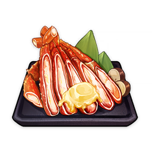</th>
      <th style="padding: 0; vertical-align: top;">
        

          

        黄油蟹蟹
        

          

          

            
            <strong>描述：</strong> 
            烤制而成的蟹肉料理。黄油浸润的蟹腿带着馥郁的香气，席卷味蕾，叫人无法抵抗这般鲜香的诱惑。恍惚间已经吃完了蟹肉，却想再抿一抿蟹壳上的黄油，来回味上一刻的美好。
            
            

        

      </th>
    </tr>
  </thead>
</table>

<table  class="table-weapon">
  <thead>
    <tr>
      <th class="th-weapon" rowspan="1">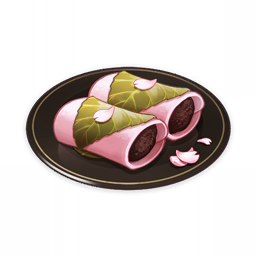</th>
      <th style="padding: 0; vertical-align: top;">
        

          

        绯樱饼
        

          

          

            
            <strong>描述：</strong> 
            细腻雅致的点心。周围萦绕着绯樱淡淡的香气，优美的外形，封存着稍纵即逝的美丽。万籁俱寂的时刻，品上一口，就仿佛回到了绯樱纷纷扬扬飘落的刹那。
            
            

        

      </th>
    </tr>
  </thead>
</table>

<table  class="table-weapon">
  <thead>
    <tr>
      <th class="th-weapon" rowspan="1">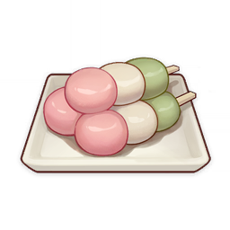</th>
      <th style="padding: 0; vertical-align: top;">
        

          

        三彩团子
        

          

          

            
            <strong>描述：</strong> 
            软糯弹牙的点心。团子上的光泽犹如晨露落于朝花之上，入口即是繁花满枝的情趣。在赏花的时候，吃上这么一份点心，不由便会让人心生幸福之感，仿佛接下来的一整年都将如眼前的飞花一般绚烂。
            
            

        

      </th>
    </tr>
  </thead>
</table>

<table  class="table-weapon">
  <thead>
    <tr>
      <th class="th-weapon" rowspan="1">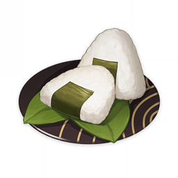</th>
      <th style="padding: 0; vertical-align: top;">
        

          

        饭团
        

          

          

            
            <strong>描述：</strong> 
            由米饭捏成的便携食物。酥脆的海苔片带来一缕鲜味，粘糯的米饭则提供扎实的香甜。最后，暗藏饭团之中的鲜美鱼肉犹如一支奇兵，为身心的满足吹响胜利的号角。
            
            

        

      </th>
    </tr>
  </thead>
</table>

<table  class="table-weapon">
  <thead>
    <tr>
      <th class="th-weapon" rowspan="1">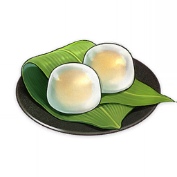</th>
      <th style="padding: 0; vertical-align: top;">
        

          

        树莓水馒头
        

          

          

            
            <strong>描述：</strong> 
            晶莹剔透的点心。规整的球型，如同流水凝形端坐于盘中，清澈的表皮下，透亮的内馅仿佛水中珠贝。在炎热的时节，单是看到这一幕光景就可谓是享受。入口后，唇齿间的微甜，让所有的焦躁都消失得无影无踪。
            
            

        

      </th>
    </tr>
  </thead>
</table>

<table  class="table-weapon">
  <thead>
    <tr>
      <th class="th-weapon" rowspan="1">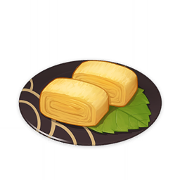</th>
      <th style="padding: 0; vertical-align: top;">
        

          

        鸟蛋烧
        

          

          

            
            <strong>描述：</strong> 
            煎制而成的蛋料理。规整的造型、金黄的色泽、松软的口感…小小一块，虽不及填饱肚子，却足以品出温馨。这一份唾手可得的香甜，惹人迷恋。
            
            

        

      </th>
    </tr>
  </thead>
</table>

<table  class="table-weapon">
  <thead>
    <tr>
      <th class="th-weapon" rowspan="1">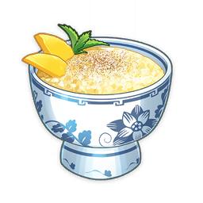</th>
      <th style="padding: 0; vertical-align: top;">
        

          

        米饭布丁
        

          

          

            
            <strong>描述：</strong> 
            由稻米制成的甜点。软糯的米饭和甘甜的牛奶均匀融合，味道相得益彰。趁热享用可以感受绵密的米粒，放冷后能品味柔滑的奶香，可谓是各有趣味。让人不禁好奇，如此完美的配比，究竟是实验过多少次才得出的呢？
            
            

        

      </th>
    </tr>
  </thead>
</table>

<table  class="table-weapon">
  <thead>
    <tr>
      <th class="th-weapon" rowspan="1">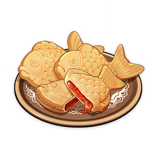</th>
      <th style="padding: 0; vertical-align: top;">
        

          

        日落鲷鱼烧
        

          

          

            
            <strong>描述：</strong> 
            鲷鱼形状的点心。刚出炉的时候微微烫手，散发着令人精神振奋的甜香。一口咬下去，甜蜜感瞬间融化在嘴中。仿佛黄昏时分池中的一尾鱼，鳞片上闪耀着温暖的金色光芒。
            
            

        

      </th>
    </tr>
  </thead>
</table>

<table  class="table-weapon">
  <thead>
    <tr>
      <th class="th-weapon" rowspan="1">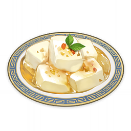</th>
      <th style="padding: 0; vertical-align: top;">
        

          

        杏仁豆腐
        

          

          

            
            <strong>描述：</strong> 
            杏仁磨浆制成的甜品。形态玲珑，色如凝脂，如同名匠打造的艺术臻品，令人只愿观赏，不忍下口。
            
            

        

      </th>
    </tr>
  </thead>
</table>

<table  class="table-weapon">
  <thead>
    <tr>
      <th class="th-weapon" rowspan="1">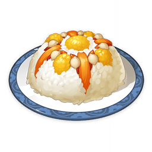</th>
      <th style="padding: 0; vertical-align: top;">
        

          

        四方和平
        

          

          

            
            <strong>描述：</strong> 
            色彩缤纷的主食。酸甜的果干如一缕看不见的丝线，与口感饱满的稻米交织。即使咽下，淡淡的香甜依然萦绕唇齿，令人幸福感倍增。
            
            

        

      </th>
    </tr>
  </thead>
</table>

<table  class="table-weapon">
  <thead>
    <tr>
      <th class="th-weapon" rowspan="1">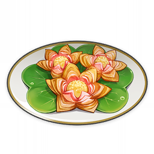</th>
      <th style="padding: 0; vertical-align: top;">
        

          

        莲花酥
        

          

          

            
            <strong>描述：</strong> 
            璃月的传统点心之一。小心地吹一口气，看那花瓣轻动，仿佛有了自己的生命；闭上眼睛轻咬，甜香化满唇齿。仿佛风动，花开，笛扬，鸟起。
            
            

        

      </th>
    </tr>
  </thead>
</table>

<table  class="table-weapon">
  <thead>
    <tr>
      <th class="th-weapon" rowspan="1">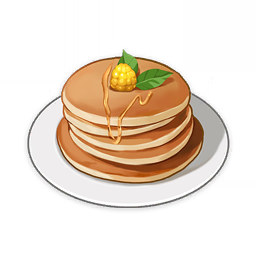</th>
      <th style="padding: 0; vertical-align: top;">
        

          

        庄园烤松饼
        

          

          

            
            <strong>描述：</strong> 
            圆形的烤饼。香乎乎的松饼嚼上去有着软绵绵的口感，味蕾也仿佛置身于云端。
            
            

        

      </th>
    </tr>
  </thead>
</table>

<table  class="table-weapon">
  <thead>
    <tr>
      <th class="th-weapon" rowspan="1"></th>
      <th style="padding: 0; vertical-align: top;">
        

          

        薄荷果冻
        

          

          

            
            <strong>描述：</strong> 
            口感清凉的甜点。恰到好处的弹性让勺背敲击的晃动感都变得可爱起来。用小勺挖一口，沁凉而清润的口感更是瞬间驱散了所有的负面情绪，使人感觉浑身上下焕然一新。
            
            

        

      </th>
    </tr>
  </thead>
</table>

<table  class="table-weapon">
  <thead>
    <tr>
      <th class="th-weapon" rowspan="1">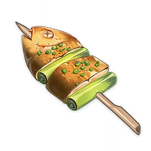</th>
      <th style="padding: 0; vertical-align: top;">
        

          

        烤吃虎鱼
        

          

          

            
            <strong>描述：</strong> 
            急火烤制的鱼串。金灿灿的表皮锁住鲜嫩嫩的鱼肉，是刚出炉时忍不住一边吹气一边咀嚼的美味。连最后黏在竹签上的那几丝鱼肉都不想放过。
            
            

        

      </th>
    </tr>
  </thead>
</table>

<table  class="table-weapon">
  <thead>
    <tr>
      <th class="th-weapon" rowspan="1">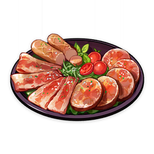</th>
      <th style="padding: 0; vertical-align: top;">
        

          

        冷肉拼盘
        

          

          

            
            <strong>描述：</strong> 
            摆满肉类的拼盘。绝妙的调味激发了食材的鲜香，三种肉类的组合在嘴里拼接成了至高的美味，令人顿时忘记烦恼。
            
            

        

      </th>
    </tr>
  </thead>
</table>

<table  class="table-weapon">
  <thead>
    <tr>
      <th class="th-weapon" rowspan="1">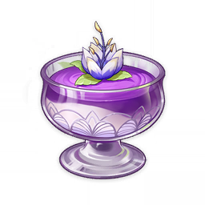</th>
      <th style="padding: 0; vertical-align: top;">
        

          

        帕蒂沙兰布丁
        

          

          

            
            <strong>描述：</strong> 
            须弥流行的甜点。刚一入口，弹滑的口感，让人仿佛徜徉于奶香味的云端。细细品味，帕蒂沙兰与须弥蔷薇的交织出的香气芬芳又馥郁。直到吃完最后一口，仍是意犹未尽，忍不住舔舔勺背，想要将美妙的享受再延长片刻。
            
            

        

      </th>
    </tr>
  </thead>
</table>

<table  class="table-weapon">
  <thead>
    <tr>
      <th class="th-weapon" rowspan="1">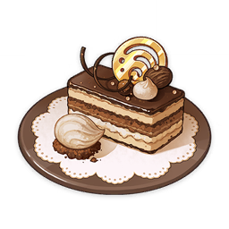</th>
      <th style="padding: 0; vertical-align: top;">
        

          

        致水神
        

          

          

            
            <strong>描述：</strong> 
            长条形的小蛋糕。咖啡与杏仁的绵长气息，推着思绪前进，恍惚间宛若进入了一场反转不断又纷华靡丽的歌剧，令人忍不住沉溺其中，只希望落幕时刻永远不会来临。
            
            

        

      </th>
    </tr>
  </thead>
</table>

<table  class="table-weapon">
  <thead>
    <tr>
      <th class="th-weapon" rowspan="1"></th>
      <th style="padding: 0; vertical-align: top;">
        

          

        奇旅馔匣
        

          

          

            
            <strong>描述：</strong> 
            根据几位伙伴设计的食谱，还原而成的糕点，其中饱含了大家的心意。宛若镂月裁云般的高超技艺，制作出了精妙别致的造型，如此弥足珍贵的心意，着实舍不得下口。
            
            

        

      </th>
    </tr>
  </thead>
</table>

