# 任务道具

### 鸣神大社的御守

<table class="table-weapon">
  <thead>
    <tr>
      <th class="th-weapon" rowspan="1">
        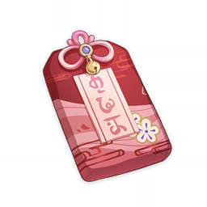
      </th>
      <th style="padding: 0; vertical-align: top;">
        

          

            鸣神大社的御守
            

          

          

            
              <strong>获取方式：</strong> 
              完成魔神任务第二章第三幕「千手百眼，天下人间」与八重神子对话剧情获取
            
          

        

      </th>
    </tr>
    <tr>
        <th colspan="2" style="font-weight: normal;">
        <strong>描述（完成稻妻魔神任务第二章第三幕-愚忠与愚勇）：</strong> 
        由八重神子所赠予的御守。 
        「想我的时候也可以拿出来看看哦？」
        </th>
    </tr>
    <tr>
        <th colspan="2" style="font-weight: normal;">
        <strong>描述（完成稻妻魔神任务第二章第三幕-愿望）：</strong> 
        曾在「一心净土」中发挥过至关重要作用的御守。 
        按照八重神子的说法，「这可是兼具智慧与美貌的八重神子大人赠予我的」。
        </th>
    </tr>
  </thead>
</table>

### 真实探灵笔记

<table class="table-weapon">
  <thead>
    <tr>
      <th class="th-weapon" rowspan="1">
        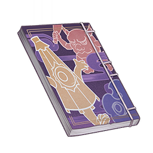
      </th>
      <th style="padding: 0; vertical-align: top;">
        

          

            真实探灵笔记
            

          

          

            
              <strong>获取方式：</strong> 
              完成传说任务仙狐之章 第一幕「鸣神御祓祈愿祭」获取
            
          

        

      </th>
    </tr>
    <tr>
        <th colspan="2" style="font-weight: normal;">
        <strong>描述：</strong> 
        稻妻最近流行的轻小说，里面详细的讲述了各种古代妖怪们的奇闻轶事。
        </th>
    </tr>
  </thead>
</table>

### 梦樱

<table class="table-weapon">
  <thead>
    <tr>
      <th class="th-weapon" rowspan="1">
        
      </th>
      <th style="padding: 0; vertical-align: top;">
        

          

            梦樱
            

          

          

            
              <strong>获取方式：</strong> 
              完成传说任务天下人之章 第二幕「须臾百梦」获取
            
          

        

      </th>
    </tr>
    <tr>
        <th colspan="2" style="font-weight: normal;">
        <strong>描述：</strong> 
        在离开雷电真的意识空间之前，你手中握住的一瓣樱花。 
        它的存在如谜，虽然模样和普通的樱花瓣别无二致，也像正常物体一样安静地躺在行囊之中，但你已无法再触碰到它，也感受不到它的重量与温度。当物体缺少了令人习以为常的基本属性，又应该怎么证明它确实「存在」呢？ 
        回想在得到它之前目睹的诸多景象，你产生了猜想：维系这瓣樱花在此世留存的力量，是源于谁人的意志。但这个人究竟是谁，是有意还是无心，无法确定；这份意志是怀念，还是信任或感激，亦无法验证。 
        或许在「谁人的意志」变化的那一刻，这瓣樱花也会跟着消失。 
        还是偶尔确认一下它是否还在吧。
        </th>
    </tr>
  </thead>
</table>

### 神樱大祓要略

<table  class="table-weapon">
  <thead>
    <tr>
      <th class="th-weapon" rowspan="1">
        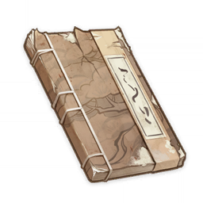
      </th>
      <th style="padding: 0; vertical-align: top;">
        

          

            神樱大祓要略
            

          

          

            
                <strong>获取方式：</strong> 
                世界任务「神樱大祓」获取
            
          

        

      </th>
    </tr>
    <tr>
        <th colspan="2" style="font-weight: normal;">
        <strong>描述：</strong> 
        记载着「神樱大祓」相关信息的残破书卷。某页有看起来像神社留下的朱砂印。
        </th>
    </tr>
    <tr>
        <th colspan="2" style="font-weight: normal;">
        <strong>阅读：</strong> 
        …… 
        「先罪天之鸣神，复罪国之海祇。复白镇词，息神々忿怒。」 
        以上定例，并载一切祭式、祓式、祝式、咒式前。如行大祓，须依前例。 
        雷樱之木，神樱之移枝。盖鸣神总灵之分灵，通大社之从社别龛。 
        彼时有天反之灾、地反之妖，土地秽粪，凶将跋扈、百鬼跳梁。大社折枝移株，以镇不净。 
        积年经月，物害累计。须有祓祝，以息乱扰。 
        雷樱之祓，甲子为期。另论大小，祭仪相异。凡数轮小祓，须继一大祓。 
        小祓之期，罪天罪国，结连注为界，念「畏伎」之句。垣瘴晦于界内，藏根瘤以避乡里。复以物胜之。鸣神五处，次第施行。 
        小祓之用意，旨在离秽。依此可得数载太平。 
        大祓之期，罪天罪国。依眼口鼻手足，取五镇物，摧小祓之结界。复以大神咒除秽。 
        大祓之理，在于除秽，使罪得散。 
        要略此毕，下为详说。 
        【其余的部分已经因为风化、污染与破损，无法阅读了。】
        </th>
    </tr>
  </thead>
</table>

### 一封家信

<table  class="table-weapon">
  <thead>
    <tr>
      <th class="th-weapon" rowspan="1">
        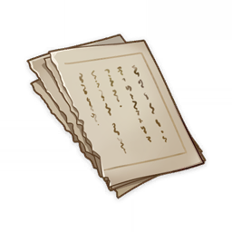</th>
      <th style="padding: 0; vertical-align: top;">
        

          

            一封家信
            

          

          

            
              <strong>获取方式：</strong> 
              世界任务「刀剑成梦」获取
            
          

        

      </th>
    </tr>
    <tr>
        <th colspan="2" style="font-weight: normal;">
        <strong>描述：</strong> 
        纸张已经泛黄，而且脆弱不堪，似乎一碰就碎。
        </th>
    </tr>
    <tr>
        <th colspan="2" style="font-weight: normal;">
        <strong>阅读：</strong> 
        父亲大人敬启 
         
        许久没有写信问询，不知道家中近况如何?上次父亲信中说道「泉水子」生下了小狗崽，但我因为杂务繁忙，没能早点回信。现在,小狗崽们应该已经长大些了吧。您说过会将一只小狗崽送给研次的父母，这太好了。我和研次因为离家参军，无法侍奉父母，一直怀着歉意。得知您和母亲、研次的父母时常相互照应，我们做儿子的也能放心一些。 
        至于我在军中的生活，父亲请勿担心。军中膳食供应充足，营房宽敞整洁,我在外的饮食住宿都很好，甚至还结交了一位名叫松平的新朋友。将来有机会，我打算请他来家乡做客，尝一尝母亲的手艺。 
        另外，还有一件事，我想您听了一定会为我骄傲——因为我作战勇武，上官将我从军士拔擢为旗本了！其实，研次也和我一道晋升为旗本了，但我希望父亲先不要向他的家人透露，让他自己说吧。 
        父亲，我一直相信，等到将来战争结束，我和研次带着军功回到村里，一切都会不同。以我那时的军饷，您与母亲就再也不必辛苦捕鱼了，我们甚至还可以修上一座新房子，买一条新船，过上富足的生活。为了这个目标，我会不断努力，立下更多功劳，取得更多荣誉！ 
        请安心等着我们归来吧。 
        公义敬上
        </th>
    </tr>
  </thead>
</table>

### 被藏匿的账本

<table  class="table-weapon">
  <thead>
    <tr>
      <th class="th-weapon" rowspan="1">
        </th>
      <th style="padding: 0; vertical-align: top;">
        

          

            被藏匿的账本
            

          

          

            
              <strong>获取方式：</strong> 
              魔神任务第二章 第一幕「不动鸣神，恒常乐土」跟随庆次郎获取
            
          

        

      </th>
    </tr>
    <tr>
        <th colspan="2" style="font-weight: normal;">
        <strong>描述：</strong> 
        似乎记录了离岛商户的近期税收情况，持有人为庆次郎。
        </th>
    </tr>
  </thead>
</table>

### 开封的信笺

<table  class="table-weapon">
  <thead>
    <tr>
      <th class="th-weapon" rowspan="1">
        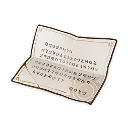</th>
      <th style="padding: 0; vertical-align: top;">
        

          

            开封的信笺
            

          

          

            
              <strong>获取方式：</strong> 
              世界任务「执望三千里」获取
            
          

        

      </th>
    </tr>
    <tr>
        <th colspan="2" style="font-weight: normal;">
        <strong>描述：</strong> 
        看起来崭新的信笺，但已经被打开过了。散发着淡淡的绯樱气息。
        </th>
    </tr>
    <tr>
        <th colspan="2" style="font-weight: normal;">
        <strong>阅读：</strong> 
        爱子 头师长次 
         
        如果你读到这封信，希望你能原谅妈妈。 
        不得不离开你们，令我痛苦万分。 
        但请你千万不要放弃希望，不要对妈妈绝望…就像你和妈妈也从来相信爸爸仍然活着。 
        岛上「祟神」的活动十分凶险，请保护好自己。 
        随着「祟神」的破坏，战争应该就快结束了。到那时候，两方会放下兵器携起手来，一同治理岛上的污秽吧。 
        但可惜妈妈或许看不到了。 
        接下来的日子里，或许长次你会遇到许多坏人，许多想利用和伤害你的人。但请不要因此而对人失去希望，本性不坏的人总是更多的。 
        等到战争结束，一切都会好起来的。 
        但请你千万、千万不要循着我的足迹，急于与我相遇。这是妈妈的请求。 
        请对妈妈抱有希望。 
        我会回来，亲口对你和爸爸说「对不起」。 
        请期待那一天的到来。
        </th>
    </tr>
  </thead>
</table>

### 残破的信笺

<table  class="table-weapon">
  <thead>
    <tr>
      <th class="th-weapon" rowspan="1">
        </th>
      <th style="padding: 0; vertical-align: top;">
        

          

            残破的信笺
            

          

          

            
            <strong>获取方式：</strong> 
            世界任务「刀剑成梦」名椎滩调查获取
            
          

        

      </th>
    </tr>
    <tr>
        <th colspan="2" style="font-weight: normal;">
        <strong>描述：</strong> 
        破破烂烂的信纸上，写有某人的心声。但纸张受到岁月侵蚀，字迹已经模糊不清，如果不是被人挖掘出来，某些往事大概会一直安眠在泥土中。
        </th>
    </tr>
    <tr>
        <th colspan="2" style="font-weight: normal;">
        <strong>阅读：</strong> 
        研次亲启 
        为了写这封信，我想了很久，有千言万语想要对你诉说，但每到下笔却又无法继续。我们从小一起习武，长大一起参军，做什么事都在一起。对我来说，你就是亲兄弟。我从来没有想到我们俩会起那么大的争执，甚至大打出手。 
        研次，我的兄弟，我每时每刻都在为此懊悔。如果当时我更冷静一些，别那么武断地说要离开，你大概也不会那么愤怒。在你看来，我一定是个背叛了将军大人的无耻逃兵吧，所以你才会不听我解释就挥拳。我不在乎别人如何看待我，但唯有你对我的看法，我无法不在乎。所以，我一定要写这封信，向你倾吐心声。 
        还记得我俩参军时的梦想吗？借着勇猛与剑技，借着如今的世道，在武的路途上取得功名，报效父母。而且大人曾训诫我们，珊瑚宫乱民胆敢向「雷之三重巴」的旗帜拔刀，乃是弥天大罪。既然如此，便无需介意他们的生命，因为选择死之途的是他们自己。原本我也是这么坚信的，但自从那件事发生之后，我就无法再这么想了。 
        当时，一场战役刚刚结束，我在撤退时，于战场上捡到了一封染血的叛军军士家书。说出来你或许不信，那个叛军军士我们都认识。你我刚参军时，有位军中前辈照拂了我好一阵，而那位前辈就是家书的主人。信中，他还惦记着家里的渔船，期待着战争结束回到家乡。我无论如何也不曾料到，后来他竟投身于叛军，而自己居然以这种方式和他在战场上再会了。 
        自从捡到了这封家书，我便突然醒悟过来：其实叛军们也是人啊，也有父母待奉养，也有故乡待归回。想到这一点，我决定将这封染血家书的事隐瞒起来，希望将来有机会代前辈将家书寄回家中。但不知为何，这件事居然让好几位同僚知道了，我因此饱受讥讽。你我出身低微，却凭借战功迅速升为旗本，早就有人在背后散布流言了。这事之后，种种排挤与孤立愈演愈烈，甚至在战场上，在我们本该同心御敌的时候，也有同僚刻意将我的后背暴露给敌方，我也因此多次与死亡擦肩而过。这一切不由我不心寒。我考虑了很久，终于决定：既然在幕府军中我遭同僚背弃，自己心中又已对敌军生了同情，那不如转而投身于他们吧。 
        研次，你一向为人坦荡，这一系列因果你从前不曾察觉，如今我向你和盘托出，不敢奢求理解，只要你知晓我心中所想便好。现在，我身在珊瑚宫军的营地，提笔写下这封信。希望你看到这信的时候，战争已经结束了。那时，如果你还愿意与我相认，那我们就一起回家吧。什么摩拉、荣誉，都不重要了。我们当初参军，就只有两个人、两把刀，等到我们回家，也只要完完整整的两个人、两把刀就好了。 
         
        公义敬上
        </th>
    </tr>
  </thead>
</table>

### 悬赏证物：泥染的刀镡

<table  class="table-weapon">
  <thead>
    <tr>
      <th class="th-weapon" rowspan="1">
        </th>
      <th style="padding: 0; vertical-align: top;">
        

          

            悬赏证物：泥染的刀镡
            

          

          

            
              <strong>获取方式：</strong> 
              挪德卡莱地图探索
            
          

        

      </th>
    </tr>
    <tr>
        <th colspan="2" style="font-weight: normal;">
        <strong>描述：</strong> 
        装配在稻妻刀剑上的护具，见证过许多战斗，可以在「旗舰」作为完成悬赏的证物交付。 
        「浮世此身哀，徒樱散尽不相待，春去难再来。」
        </th>
    </tr>
  </thead>
</table>

### 常世国龙蛇传

<table  class="table-weapon">
  <thead>
    <tr>
      <th class="th-weapon" rowspan="1">
        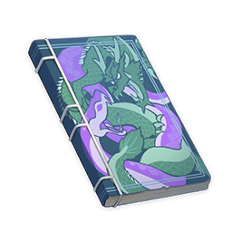</th>
      <th style="padding: 0; vertical-align: top;">
        

          

            常世国龙蛇传
            

          

          

            
              <strong>获取方式：</strong> 
              黑田<「八重堂」编辑>处购买
            
          

        

      </th>
    </tr>
    <tr>
        <th colspan="2" style="font-weight: normal;">
        <strong>描述：</strong> 
          取材自海祇岛民间故事的小说。最早版本乃是蛇神尚在人世之时，有鸣神岛的商人前往海祇岛誊抄转写带回的。如今已是没人看的古典名著，被市面上的轻小说埋没了。本书描写了海祇岛人在接纳鸣神文化之前的独特宇宙观。因为最近传统小说再出版的风潮，得以再次问世。
        </th>
    </tr>
    <tr>
        <th colspan="2" style="font-weight: normal;">
        <strong>阅读：</strong> 
        造化藏奥妙，日月行吉凶。 
        三隅隔昏暗，五圣隐虚空。 
         
        「宇宙无始无终，曾经的大地也是这样。只不过对我们来说没有意义。承载我们的土地已经不再和无始无终的永恒相连了。」 
        ——唯一的贤人，阿倍良久这么对初代太阳之子诉说。太阳之子早已准备惩处阿倍良久，这次宣他到御前问答，不过是想加以刁难，然后将他拘禁。 
        相传，阿倍良久被常世大神启开了智慧，因此才从不见太阳的渊下宫里掘出来了光。但是太阳之子嫉妒他的才华，把他囚禁直至他寿终。然而，太阳之子们却未曾想过，若非有他造出地下的太阳，哪会有自己呢。 
        「…天地原如鸡卵，龙蛇本就一体。」贤人阿倍良久说完这句话，随即就被埋伏的兵士们按倒。 
         
        彼时，渊下宫才因为太阳的出现而得到些许喘息。因那龙嗣亲近黑暗、忌惮光明，不再肆意妄为。龙嗣横行、敛人命如草的时日终于结束，渊下宫民变得能与其相抗了。 
        然而，异种外患没有完全根除，这人性的腌臜就已经暴露了。人们选立了「太阳之子」，把他做王崇拜。他却横征暴敛，构陷忠良。 
         
        不知经过了多少岁月，渊下宫里有一小童，与伙伴做了赌约。他只身一人，潜到三隅之外，避开龙嗣痕迹，想去寻那龙骨花。但是他却在洞中见到了一只未曾见过的大蛇。不知为何， 
        小童见蛇之庞巨、诡异，并不觉恐怖，反而有亲近之感。 
        「我乃渎身渎名之蛇神，虽有眷属百千，但所荫蔽之众已无一人。今日落入此界，与你相见，也算有缘。你虽非我民，但终是人子。有何愿望，但说无妨。」
        「试问，你能做我们渊下之民的神吗？」 
         
        于是一人与一蛇，面对太阳之子的王权、境外的龙嗣侵攻，力挽狂澜之演义就此开幕。
        </th>
    </tr>
  </thead>
</table>

### 稻叶藤三郎久藏 绝笔

<table  class="table-weapon">
  <thead>
    <tr>
      <th class="th-weapon" rowspan="1">
        
      </th>
      <th style="padding: 0; vertical-align: top;">
        

          

        稻叶藤三郎久藏 绝笔
        

          

          

            
              <strong>获取方式：</strong> 
              世界任务「武者的宿命」获取
            
          

        

      </th>
    </tr>
    <tr>
        <th colspan="2" style="font-weight: normal;">
        <strong>描述：</strong> 
        一张写满文字的信纸，其作者已不知所踪。
        </th>
    </tr>
    <tr>
        <th colspan="2" style="font-weight: normal;">
        <strong>阅读：</strong> 
        十分抱歉。 
        古语云「人生五十年」，藤三郎也活了三十有余，剩下十多年光阴无福消受，望能分予父母大人。 
        切请爱妻静子大人莫要动气，莫要悲伤，藤三郎此次自知大过无赦，乞望您能忘记这个不争气的丈夫。 
        正则与阿松，请不要为爸爸感到遗憾，请原谅爸爸。 
        诸位新朋旧友，藤三郎万分荣幸与各位相识。 
        无论如何，十分抱歉。 
        藤三郎本是粗人，舞文弄墨并非所长。但临此依依惜别之时，也不免话多起来。 
        若是正有人阅读敝文，还请原谅藤三郎一时聒噪。 
         
        十多年前，初入军旅时，藤三郎仰慕大御所殿下之神威，向往着千百年前雷光所照的诸多宏伟义战，渴望有朝一日为了真正的「永恒」而光荣战歿。 
        想来，年少轻狂时总是将过往的传奇与现实的窘境相混淆，满以为自己也有机会成为大御所殿下那样完美的英豪。 
        可当战争真正来临时，敌人却并非丑恶的魔神扈从，或深渊而来的扭曲怪物，而是与你我并无不同的凡人。 
        或许前日倒在我手下的敌人，在「眼狩令」下达之日还是乌有亭的酒友；又或许刚刚被敌人击倒的战友，此前半刻还在与你我谈笑言欢… 
        我们本应是兄弟，却舍弃了一切重归于好的可能，不得不仇恨对方，才能让自己活下去。 
        何其残忍，何其残酷。 
        所谓「义战」，是最大的罪业。 
         
        恕出言狂妄，但藤三郎绝不怨恨大御所殿下。 
        大御所殿下亦曾有云：战争自古分「义」与「不义」。 
        「不义」之战，由「愿望」之膨胀，人心之躁乱所致。 
        大御所殿下为「永恒」之大业而收缴天下「神之眼」，亦与千百年前斩杀大蛇之义举如一。 
        以战争扫除心怀妄想之人，终结一切「不义」的可能，乃是最大的「义战」。 
         
        然而，任何战争皆是残酷，都需要人来承担责任。 
        藤三郎今已无力继续尽忠，只愿能以残破之身，替大御所殿下承担一份罪业。 
        祝愿大御所殿下的永恒盛世能够早日到来。 
         
        小人稻叶藤三郎久藏，在此谢罪。
        </th>
    </tr>
  </thead>
</table>

### 秘密笔记

<table  class="table-weapon">
  <thead>
    <tr>
      <th class="th-weapon" rowspan="1">
        
      </th>
      <th style="padding: 0; vertical-align: top;">
        

          

            秘密笔记
            

          

          

            
                <strong>获取方式：</strong> 
                传说任务眠龙之章 第一幕「兵戈梦去，春草如茵」调查获取
            
          

        

      </th>
    </tr>
    <tr>
        <th colspan="2" style="font-weight: normal;">
        <strong>阅读：</strong> 
        今天与商会代表争吵了一个下午，能量值-4。 
        百废待兴，需要他们让货物流通，但不能让他们借此敛财… 
         
        今天在桌前处理了一天政务，能量值-3。 
        晚上还要赶制下一批锦囊，希望别太晚，明天还要外出视察。 
         
        今天外面刮了好大的风，能量值-2。 
        很快就要下雨了，希望这次风浪小一些，让出海打渔的人们能够平安归来。 
       
        今天听到了和谈的消息，能量值+2。 
        如果不再有战争，海祇岛的大家也会开心起来吧？ 
         
        今天听说天领奉行可能与愚人众勾结，能量值-5。 
        连我也有些搞不明白了… 
         
        今天剑鱼二番队的队长回来了，能量值+4。 
        我们都默契地没有提哲平，也没有提那些在战争中牺牲的人…真的，和平来得太不容易了。 
         
        今天又被许多人搭话了，能量值-3。 
        看着他们真挚的眼神，我总会想起自己继任现人神巫女的那一天。这么多年过去，我是否对得起他们的期待呢？
        </th>
    </tr>
  </thead>
</table>

### 残缺的笔记

<table  class="table-weapon">
  <thead>
    <tr>
      <th class="th-weapon" rowspan="1">
        
      </th>
      <th style="padding: 0; vertical-align: top;">
        

          

        残缺的笔记
        

          

          

        
            <strong>获取方式：</strong> 
            世界任务「孤岛诊疗谭」获取
        
        

        

      </th>
    </tr>
    <tr>
        <th colspan="2" style="font-weight: normal;">
        <strong>描述：</strong> 
        破旧残缺的书页，不知为何有一股陈腐粮食的气息。
        </th>
    </tr>
    <tr>
        <th colspan="2" style="font-weight: normal;">
        <strong>阅读：</strong> 
        …战争还在继续，两边的传单都不过是空谈而已。他们根本顾不上我们… 
        …绯木村容纳了太多从矿洞那边逃难来的人，粮食也有些见底了。只好把大家的财物集中起来，按计划分配，总得留出一些钱向附近的海贼买食物… 
        …无论如何，蛇骨附近的神龛总是需要专人维护的，既然大家都害怕「祟神」这种看不见摸不着的东西，这件事只能由作为村长的我来做了… 
        …… 
        …很多人病倒了，更多人有这样或那样的毛病，很难干体力活。这样下去可不行… 
        …保本那个家伙根本就是个骗子，只会用堇瓜加糖熬汤给我们喝，结果什么也治不了… 
        …那小子从前就一副无所事事的样子，果然靠不住…
        </th>
    </tr>
  </thead>
</table>

### 珊瑚宫记

<table  class="table-weapon">
  <thead>
    <tr>
      <th class="th-weapon" rowspan="1">
        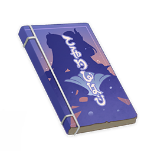
      </th>
      <th style="padding: 0; vertical-align: top;">
        

          

            珊瑚宫记
            

          

          

            
            <strong>获取方式：</strong> 
              木漏茶室内部探索获取
        
        

        

      </th>
    </tr>
    <tr>
        <th colspan="2" style="font-weight: normal;">
        <strong>描述：</strong> 
        由幕府著名历史学者，名列「九条三笔头」的名臣九条道真所著的历史书籍，简要介绍了海祇岛的历史。 
        作者：九条道真
        </th>
    </tr>
    <tr>
        <th colspan="2" style="font-weight: normal;">
        <strong>阅读：</strong> 
        珊瑚宫者，初为海渊，后有大蛇渡来，盘桓而升涡流，塑珊瑚而成岛。是故珊瑚宫人名之「海祇岛」，盖以大蛇为神也。 
        海祇之人自称海民，奉大蛇远吕羽氏尊。海祇岛以神宫为高府，无将军奉行之畴。大小事务仰赖诸巫女，巫女之首曰「现人神巫女」，统领政事、祭典。 
        往年魔神混战，雷电大御所将军殿下定稻妻全土于一元，众皆震悚俯首，各安其位，或有直遭殄灭，再无非分之妄。大蛇远吕羽氏尊原素与鸣神以西界为分野，相安无碍，是时忽横生歹意，举力东侵。 
        战事酷烈，民生惨苦。两方鏖战今八酝岛，皆多有伤亡，大御所殿下之爱将天狗笹百合亦陨落其间。大蛇终为大御所殿下斩杀，薨于八酝岛。 
        自此以后，珊瑚宫遣使降服，尊稻妻幕府为大宗主也。
        </th>
    </tr>
  </thead>
</table>

### 「御神签」

<table  class="table-weapon">
  <thead>
    <tr>
      <th class="th-weapon" rowspan="1">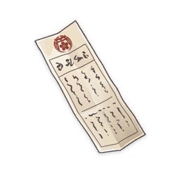</th>
      <th style="padding: 0; vertical-align: top;">
        

          

        「御神签」
        

          

          

        
            <strong>获取方式：</strong> 
            稻妻鸣神大社玄冬林檎小姐处使用竹签兑换
        
        

        

      </th>
    </tr>
    <tr>
        <th colspan="2" style="font-weight: normal;">
        <strong>描述：</strong> 
        昭明今日运势的特制纸签，也被某人称为「纸片儿」。 
           每天只能求得一次签文，昨日的签也会因为不再具有意义而消失。 
           据说，「凶」和「大凶」这类不吉祥的签条，可以结在「御签挂」上，以求转运。 
           但无论如何，「命」与「运」都应该自己掌握、自己开拓吧。
        </th>
    </tr>
    <tr>
        <th colspan="2" style="font-weight: normal;">
        <strong>阅读：</strong> 
        ——大吉—— 
        会起风的日子，无论干什么都会很顺利的一天。 
        周围的人心情也非常愉快，绝对不会发生冲突， 
        还可以吃到一直想吃，但没机会吃的美味佳肴。 
        无论是工作，还是旅行，都一定会十分顺利吧。 
        那么，应当在这样的好时辰里，一鼓作气前进… 
         
        今天的幸运物是：茁壮成长的「鸣草」。 
        许多人或许不知道，鸣草是能预报雷暴的植物。 
        向往着雷神大人的青睐，只在稻妻列岛上生长。 
        摘下鸣草时酥酥麻麻的触感，据说和幸福的滋味很像。
         

        ——大吉—— 
        浮云散尽月当空，逢此签者皆为上吉。 
        明镜在心清如许，所求之事心想则成。 
        合适顺心而为的一天，不管是想做的事情， 
        还是想见的人，现在是行动起来的好时机。 
         
        今天的幸运物是：不断发热的「烈焰花花蕊」。 
        烈焰花的炙热来自于火辣辣的花心。 
        万事顺利是因为心中自有一条明路。
         

        ——大吉—— 
        失而复得的一天。 
        原本以为石沉大海的事情有了好的回应， 
        原本分道扬镳的朋友或许可以再度和好， 
        不经意间想起了原本已经忘记了的事情。 
        世界上没有什么是永远无法挽回的， 
        今天就是能够挽回失去事物的日子。 
         
        今天的幸运物是：活蹦乱跳的「鬼兜虫」。 
        鬼兜虫是爱好和平、不愿意争斗的小生物。 
        这份追求平和的心一定能为你带来幸福吧。
         

        ——大吉—— 
        宝剑出匣来，无往不利。出匣之光，亦能照亮他人。 
        今日能一箭射中空中的猎物，能一击命中守卫要害。 
        若没有目标，不妨四处转转，说不定会有意外之喜。 
        同时，也不要忘记和倒霉的同伴分享一下好运气哦。 
         
        今天的幸运物是：难得一见的「马尾」。 
        马尾随大片荻草生长，但却更为挺拔。 
        与傲然挺立于此世的你一定很是相配。
         

        ——中吉—— 
        十年磨一剑，今朝示霜刃。 
        恶运已销，身临否极泰来之时。 
        苦练多年未能一显身手的才能， 
        现今有了大展身手的极好机会。 
        若是遇到阻碍之事，亦不必迷惘， 
        大胆地拔剑，痛快地战斗一番吧。 
         
        今天的幸运物是：生长多年的「海灵芝」。 
        弱小的海灵芝虫经历多年的风风雨雨，才能结成海灵芝。 
        为目标而努力前行的人们，最终也必将拥有胜利的果实。
         

        ——中吉—— 
        天上有云飘过的日子，天气令人十分舒畅。 
        工作非常顺利，连午睡时也会想到好点子。 
        突然发现，与老朋友还有其他的共同话题… 
        ——每一天每一天都要积极开朗地度过—— 
         
        今天的幸运物是：色泽艳丽的「堇瓜」。 
        人们常说表里如一是美德， 
        但堇瓜明艳的外貌下隐藏着的是谦卑而甘甜的内在。
         

        ——吉—— 
        枯木逢春，正当万物复苏之时。 
        陷入困境时，能得到解决办法。 
        举棋不定时，会有贵人来相助。 
        可以整顿一番心情，清理一番家装， 
        说不定能发现意外之财。 
         
        今天的幸运物是：节节高升的「竹笋」。 
        竹笋拥有着无限的潜力， 
        没有人知道一颗竹笋，到底能长成多高的竹子。 
        看着竹笋，会让人不由自主期待起未来吧。
         

        ——吉—— 
        明明没有什么特别的事情，却感到心情轻快的日子。 
        在没注意过的角落可以找到本以为丢失已久的东西。 
        食物比平时更加鲜美，路上的风景也令人眼前一亮。 
        ——这个世界上充满了新奇的美好事物—— 
         
        今天的幸运物是：散发暖意的「鸟蛋」。 
        鸟蛋孕育着无限的可能性，是未来之种。 
        反过来，这个世界对鸟蛋中的生命而言， 
        也充满了令其兴奋的未知事物吧。 
        要温柔对待鸟蛋喔。
         

        ——吉—— 
        一如既往的一天。身体和心灵都适应了的日常。 
        出现了能替代弄丢的东西的物品，令人很舒心。 
        和常常遇见的人关系会变好，可能会成为朋友。 
        ——无论是多寻常的日子，都能成为宝贵的回忆—— 
         
        今天的幸运物是：闪闪发亮的「晶核」。 
        晶蝶是凝聚天地间的元素，而长成的细小生物。 
        而元素是这个世界许以天地当中的人们的祝福。
         

        ——末吉—— 
        气压稍微有点低，是会令人想到遥远的过去的日子。 
        早已过往的年轻岁月，与再没联系过的故友的回忆， 
        会让人感到一丝平淡的怀念，又稍微有一点点感伤。 
        ——偶尔怀念过去也很好。放松心情面对未来吧—— 
         
        今天的幸运物是：清新怡人的「薄荷」。 
        只要有草木生长的空间，就一定有薄荷。 
        这么看来，薄荷是世界上最强韧的生灵。 
        据说连蒙德的雪山上也长着薄荷呢。
         

        ——末吉—— 
        平稳安详的一天。没有什么令人难过的事情会发生。 
        适合和久未联系的朋友聊聊过去的事情，一同欢笑。 
        吃东西的时候会尝到很久以前体验过的过去的味道。 
        ——要珍惜身边的人与事—— 
         
        今天的幸运物是：酥酥麻麻的「电气水晶」。 
        电气水晶蕴含着无限的能量。 
        如果能够好好导引这股能量，说不定就能成就什么事业。
         

        ——末吉—— 
        空中的云层偏低，并且仍有堆积之势， 
        不知何时雷雨会骤然从头顶倾盆而下。 
        但是等雷雨过后，还会有彩虹在等着。 
        宜循于旧，守于静，若妄为则难成之。 
         
        今天的幸运物是：树上掉落的「松果」。 
        并不是所有的松果都能长成高大的松树， 
        成长需要适宜的环境，更需要一点运气。 
        所以不用给自己过多压力，耐心等待彩虹吧。 
         

        ——末吉—— 
        云遮月半边，雾起更迷离。 
        抬头即是浮云遮月，低头则是浓雾漫漫。 
        虽然一时前路迷惘，但也会有一切明了的时刻。 
        现下不如趁此机会磨炼自我，等待拨云见皎月。 
         
        今天的幸运物是：暗中发亮的「发光髓」。 
        发光髓努力地发出微弱的光芒。 
        虽然比不过其他光源，但看清前路也够用了。
         

        ——凶—— 
        隐约感觉会下雨的一天。可能会遇到不顺心的事情。 
        应该的褒奖迟迟没有到来，服务生也可能会上错菜。 
        明明没什么大不了的事，却总感觉有些心烦的日子。 
        ——难免有这样的日子—— 
         
        今天的幸运物是：随波摇曳的「海草」。 
        海草是相当温柔而坚强的植物， 
        即使在苦涩的海水中，也不愿改变自己。 
        即使在逆境中，也不要放弃温柔的心灵。
         

        ——凶—— 
        珍惜的东西可能会遗失，需要小心。 
        如果身体有不适，一定要注意休息。 
        在做出决定之前，一定要再三思考。 
         
        今天的幸运物是：冰凉冰凉的「冰雾花」。 
        冰雾花散发着「生人勿进」的寒气。 
        但有时冰冷的气质，也能让人的心情与头脑冷静下来。 
        据此采取正确的判断，明智地行动。
         

        ——大凶—— 
        内心空落落的一天。可能会陷入深深的无力感之中。 
        很多事情都无法理清头绪，过于钻牛角尖则易生病。 
        虽然一切皆陷于低潮谷底中，但也不必因此而气馁。 
        若能撑过一时困境，他日必另有一番作为。 
         
        今天的幸运物是：弯弯曲曲的「蜥蜴尾巴」。 
        蜥蜴遇到潜在的危险时，大多数会断尾求生。 
        若是遇到无法整理的情绪，那么该断则断吧。
        </th>
    </tr>
  </thead>
</table>

### 竹签

<table  class="table-weapon">
  <thead>
    <tr>
      <th class="th-weapon" rowspan="1"></th>
      <th style="padding: 0; vertical-align: top;">
        

          

        略有腐坏的木板
        

          

          

        
            <strong>获取方式：</strong> 
           摇晃稻妻鸣神大社的「御神签箱」
        
        

        

      </th>
    </tr>
    <tr>
        <th colspan="2" style="font-weight: normal;">
        <strong>描述：</strong> 
        在不起眼的地方做了标记的竹签。通过鸣神大社的玄冬林檎小姐，可以兑换成阐明运势的「御神签」。
        </th>
    </tr>
  </thead>
</table>

### 诡谲的「御神签」

<table  class="table-weapon">
  <thead>
    <tr>
      <th class="th-weapon" rowspan="1"></th>
      <th style="padding: 0; vertical-align: top;">
        

          

        诡谲的「御神签」
        

          

          

        
            <strong>获取方式：</strong> 
            世界任务「特别的御神签」与玄冬林檎小姐对暗号「胧夜正中」获取
        
        

        

      </th>
    </tr>
    <tr>
        <th colspan="2" style="font-weight: normal;">
        <strong>描述：</strong> 
        在兑换「御神签」时，说出某个「暗语」才能领取到的特殊签文。记载着行动的目标与其出没的地点。
        </th>
    </tr>
    <tr>
        <th colspan="2" style="font-weight: normal;">
        <strong>阅读：</strong> 
        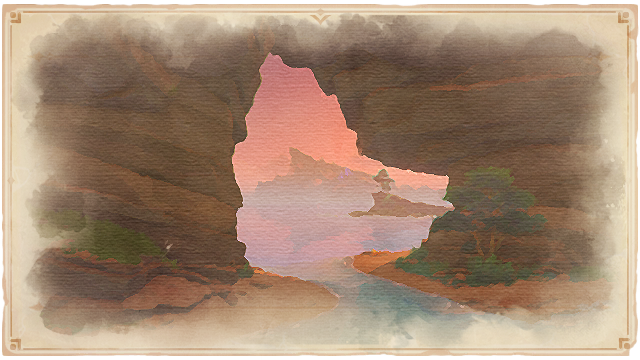
        「北国之鬼·炎刀望理须」 
        近期，有愚人众的密探于稻妻城下方的洞窟中活动。 
        阴谋计划破坏城池的治安，威胁大御所大人的国土。 
        其名据说是「望理须」。 
         
        对罪徒与敌人降下「终末」。
         

        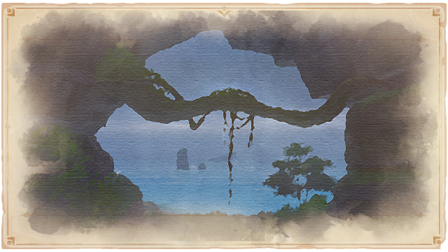
        「三十年之期的尽头·斩鬼阿金」 
        近日终于发现了三十年前神无冢斩人事件的犯人的踪迹。 
        「斩鬼阿金」松平金次郎与其党羽曾在八酝岛南部出没。 
        请前往画中地点调查。 
        若发现斩鬼阿金本人… 
         
        对罪徒与敌人降下「终末」。
         

        
        「一丘之貉」 
        近日将有贼寇于稻妻城下方的洞窟中进行会面。 
        会面时间推定为深夜至黎明之间。 
        一行人分别是自军中暗扣物质中饱私囊的奸细， 
        与近年来结成的窃盗、偷渡团伙。 
         
        对罪徒与敌人降下「终末」。
         

        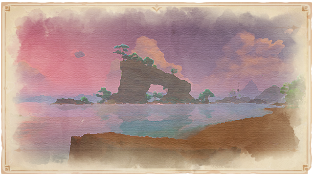
        「十恶不赦的贼人·鼠坊主阿牧」 
        在九条阵屋附近的滩涂上出没的大盗贼。 
        常在画中所示位置游荡，盗窃幕府军资。 
        窃盗者罪，轻者应治以入墨，重者入刑。 
         
        但诨名「鼠坊主」的牧田海雄依仗武艺与狡黠，多次逃脱追捕。 
         
        对罪徒与敌人降下「终末」。
        </th>
    </tr>
  </thead>
</table>

### 略有腐坏的木板

<table  class="table-weapon">
  <thead>
    <tr>
      <th class="th-weapon" rowspan="1"></th>
      <th style="padding: 0; vertical-align: top;">
        

          

        略有腐坏的木板
        

          

          

        
            <strong>描述：</strong> 
           略有腐坏的木板。上面似乎刻着一些字…
        
        

        

      </th>
    </tr>
    <tr>
        <th colspan="2" style="font-weight: normal;">
        <strong>阅读：</strong> 
        「虽然不知道在哪，但看来已经远离稻妻了，幕府的那群家伙，应该也知道我们的厉害了！」 
        「不过，这周围还是一点陆地都看不见，再这么下去，怕是船都要撑不住了…必须想个办法才行…」
        </th>
    </tr>
  </thead>
</table>

### 有些残破的木板

<table  class="table-weapon">
  <thead>
    <tr>
      <th class="th-weapon" rowspan="1"></th>
      <th style="padding: 0; vertical-align: top;">
        

          

        有些残破的木板
        

          

          

        
            <strong>描述：</strong> 
           有些残破的木板。上面似乎刻着一些字…
        
        

        

      </th>
    </tr>
    <tr>
        <th colspan="2" style="font-weight: normal;">
        <strong>阅读：</strong> 
        「…居然前半截没了，剩下后半截还能飘这么远，真不愧是我的船，哈哈哈…不过，船上的东西大概都已经沉进海里了…」 
        「…好像，是顺着东南方漂流的来着？算了，不管这些，剩下要解决的问题，就是怎么离开这里…」
        </th>
    </tr>
  </thead>
</table>

### 药师的笔记本·一

<table  class="table-weapon">
  <thead>
    <tr>
      <th class="th-weapon" rowspan="1"></th>
      <th style="padding: 0; vertical-align: top;">
        

          

        药师的笔记本·一
        

          

          

        
            <strong>获取方式：</strong> 
            完成世界任务「孤岛诊疗谭」，完成「游医的奥德赛」成就第四天时地图探索收集获取。
        
        

        

      </th>
    </tr>
    <tr>
        <th colspan="2" style="font-weight: normal;">
        <strong>描述：</strong> 
        保本留下的笔记，散发着浓烈的鸣草气息。
        </th>
    </tr>
    <tr>
        <th colspan="2" style="font-weight: normal;">
        <strong>阅读：</strong> 
        …… 
        …直子老师今天去世了，自从「祟神」生乱后，仍然留在岛上的游医只有我一人了。 
        看着留在岛上的人一个接一个陷入病痛，是一件痛苦的事情。但我对「祟神」造成的污染无能为力，只能用堇瓜熬成的甜汤自欺欺人… 
         
        「关怀也是一种治疗。」 
        …老师她总是这样说，但这不过是医者的自我安慰而已… 
        ……
        </th>
    </tr>
  </thead>
</table>

### 药师的笔记本·二

<table  class="table-weapon">
  <thead>
    <tr>
      <th class="th-weapon" rowspan="1"></th>
      <th style="padding: 0; vertical-align: top;">
        

          

        药师的笔记本·二
        

          

          

        
            <strong>获取方式：</strong> 
            完成世界任务「孤岛诊疗谭」，完成「游医的奥德赛」成就第四天时地图探索收集获取。
        
        

        

      </th>
    </tr>
    <tr>
        <th colspan="2" style="font-weight: normal;">
        <strong>描述：</strong> 
        保本留下的笔记，在精心保护下并没有被雨水沾湿多少。
        </th>
    </tr>
    <tr>
        <th colspan="2" style="font-weight: normal;">
        <strong>阅读：</strong> 
        …… 
        …一个女人来找我求治，似乎是矿洞那边的矿工家属。但她的病情很特殊。以我有限的医术，很难归纳其特征…只能通过直觉做出这样的猜测：似乎祟神的力量并非侵蚀，而是在她体内自如流动。患者的心智与身体并没有受到太大影响，但持续不断的发热和间断的少量出血很难控制… 
        …尽管这些症状并不危及生命…但也无法确定她的情况是否具有传染性… 
        …或许只有须弥那边的医院有治疗方法… 
        …… 
        …帮她指路去了海贼那边，鬼隆大叔虽然贪财，但也同样重义气。他应该会帮忙的… 
        …她还有一个孩子，名叫长次。等这些事情都结束了，一定要好好照顾那孩子… 
        …但现在还不能去找他，现在还不是时候…
        </th>
    </tr>
  </thead>
</table>

### 破烂的纸条

<table  class="table-weapon">
  <thead>
    <tr>
      <th class="th-weapon" rowspan="1"></th>
      <th style="padding: 0; vertical-align: top;">
        

          

        破烂的纸条
        

          

          

        
            <strong>获取方式：</strong> 
            世界任务「孤岛诊疗谭」获取
        
        

        

      </th>
    </tr>
    <tr>
        <th colspan="2" style="font-weight: normal;">
        <strong>描述：</strong> 
        一张皱皱的字条，其上字迹杂乱难辨。
        </th>
    </tr>
    <tr>
        <th colspan="2" style="font-weight: normal;">
        <strong>阅读：</strong> 
        …… 
        …村里唯一的医生也精神失常了，我们把他绑起来锁进了地窖。只有这样他才不会伤到别人或自己… 
        …现而今，我们唯一能做的只有祈祷，希望自己的心意能够传达到大御所殿下耳中，从而结束这场战争… 
        …应该把大家都集中在神龛那边，这种情况下，大家的精神很脆弱，身为村长虽然深为无能而困扰，但至少应该给大家一份希望… 
        …… 
        …真吾说他听见了「神言」，真是荒唐… 
        …长次的母亲又来了，每天她都在神龛那边一个人祈祷。为了病痛，或是为了丈夫？很抱歉作为村长没能帮助她们家… 
        …… 
        …把真吾锁了起来，他企图袭击长次的母亲，真是发了疯！只好代表绯木村向她道了歉… 
        …… 
        …耳朵里总有说话声，嗡嗡的很吵闹。也许这些天都没有睡好觉，该休息了… 
        …幻听没有好转，头很痛…
        </th>
    </tr>
  </thead>
</table>

### 天领奉行上奏公文

<table  class="table-weapon">
  <thead>
    <tr>
      <th class="th-weapon" rowspan="1">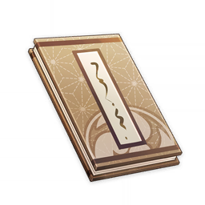</th>
     <th style="padding: 0; vertical-align: top;">
        

          

        天领奉行上奏公文
        

          

          

        
            <strong>获取方式：</strong> 
            魔神任务第二章 第三幕「千手百眼，天下人间」获取
        
        

        

      </th>
    </tr>
    <tr>
        <th colspan="2" style="font-weight: normal;">
        <strong>描述：</strong> 
        从九条孝行处取得，据说除了将军和九条孝行本人外，无人可知其内容。上面印有九条家主的印章。
        </th>
    </tr>
    <tr>
        <th colspan="2" style="font-weight: normal;">
        <strong>阅读：</strong> 
        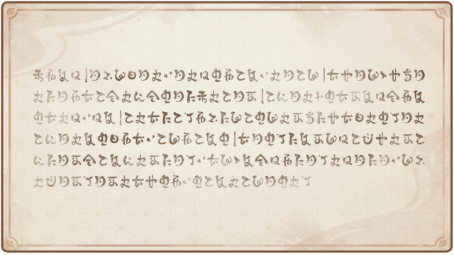
        俯仰稻妻电光之灼灼，弘显大御所将军殿恒常之道布于远海，威鸣广及八方。 
        臣九条氏天领奉行孝行恭进奏折： 
        「眼狩令」推行无阻，进展甚速。大御所将军殿恩威之下，妄者皆靡，逃者皆归，上下百姓无不稽首相迎。实所谓尽得民心。 
        今稻妻全土安乐如斯，全赖大御所将军殿之神威也。
        </th>
    </tr>
  </thead>
</table>

### 鬼武道

<table  class="table-weapon">
  <thead>
    <tr>
      <th class="th-weapon" rowspan="1"></th>
      <th style="padding: 0; vertical-align: top;">
        

          

        鬼武道
        

          

          

        
            <strong>获取方式：</strong> 
            完成世界任务「故事构思法」获取
        
        

        

      </th>
    </tr>
    <tr>
        <th colspan="2" style="font-weight: normal;">
        <strong>描述：</strong> 
        由八重堂的作家顺吉所著，是轻小说《鬼武道》的单行本，收录了故事最初的两大篇章。其连载版本质量参差不齐，但在读者中仍有着一定的人气。
        </th>
    </tr>
    <tr>
        <th colspan="2" style="font-weight: normal;">
        <strong>阅读：</strong> 
        「荒山之城篇·第一章」 
        又是相同的噩梦，让羽川凛子重返鬼族覆灭的那个夜晚。 
        漆黑的流云呼啸而来，淹没整座村庄。墨汁般的火焰疯狂蔓延，烧蚀百座房屋，沿着地表扩散至海边，海水沸腾蒸发，浅滩的沙砾熔融成粘稠的液态。 
        族长将凛子推进地窖时的话语如雷贯耳，盖过四起的哀嚎。 
        「片叶深彻背叛了鬼族，召来了这场灾难！」。 
        凛子的剑术是片叶深彻一手教导出来的，记忆中的深彻是娴静的女子，与人谈话时，嘴边总是挂着浅淡的笑容。 
        直到今天，凛子还不愿相信——自己的老师，备受敬重的剑术奇才，会做出那样残忍的事。 
        可散落在村庄周围的符咒和印记，无一不是有力的证据，族长的判断不会有错… 
        自己该以怎样的心态面对片叶深彻？ 
        凛子还没下定决心，只能长长叹息。 
        叹息惊动了身边的白猫，白猫眯着浑浊的双眼，蹭了蹭凛子的手背。 
        「对不起，饭团，吵醒你了。」 
        凛子取来木碗，放在白猫身前，听着它舌尖舔水的轻响，仰望帐篷外的夜空。 
        透过枝叶的间隙，可见月光下的料峭山影，山脊上的建筑轮廓错综复杂，堪称独一无二的奇观。 
        「荒山之城」近在眼前了。高耸入云的山体被整个凿空，由内至外建设成雄伟的城池。传说居住在这里的「山之子民」是巨人的后裔，身形两倍于凡人，就连他们种植的作物都无比庞大。而「荒山之城」的「荒原军」尤为强大，与周边诸国多次交战，鲜有败绩。 
        「荒山之城」的残暴领主还不满足，他渴求着绝对的霸权。 
        三天以前，领主邀请片叶深彻加入「荒原军」，训练麾下的兵卒，传授鬼族引以为傲的剑术，深彻欣然接受了邀请… 
        不管片叶深彻的目的是什么，当务之急是找到她，打倒她，给她应有的惩罚。 
        然后循着族长的线索，寻求「死生道」的真谛，利用饭团体内的那枚勾玉，复苏遇难的族人。 
        想到这里，凛子再次为篝火添柴，侧躺下来，进入浅度睡眠，为明天的战斗积蓄体力。 
        …… 
        「荒山之城篇·第十五章」 
        对峙的局面被打破了。 
        身形魁梧的主将出现在百步开外，他亲自督战，斩了几个逃兵。这一手的成效显著，荒原军的阵型稳定下来，再也没人议论领主遇刺一事。 
        「慌什么！那小鬼的个头还不如田里的堇瓜！一起上！」 
        兵卒们面面相觑，直到主将高声怒吼，才硬着头皮，再次向凛子发起冲锋。 
        凛子都听见了，凛子握刀的手在颤抖，吓得兜帽里的饭团低声呜咽。 
        真是抱歉啊，鬼族屈居在偏僻的海岛上，营养不良个子不高。作为你们的敌人，气势完全不够格… 
        但只凭气势，是没法战胜任何人的。 
        凛子踮脚旋转，手中长刀律动，刃缘的红光明灭，光斑延展，掠过战场，直取主将的躯干。 
        「切先遥闪」。 
        正是前代城主的游魂托付给凛子的强大剑技，无视战场间距，挥出致命的一刀。 
        铁器迸裂的清脆声响中，对方主将的佩刀断为两截，他发出含混不清的低鸣，向前栽倒在地。 
        随着主将战死，荒原军的攻势戛然而止。兵卒们不敢再上前半步，很快陷入混乱，彻底溃散。 
        「荒山之城」陷落了，饱受欺压的人们很快就占领了领主的宅邸，夺回了原本属于自己的东西。 
        但直到此时，片叶深彻还没有露面… 
        凛子收刀屏息，似乎察觉到了异样，抬头遥望山尖。 
        果然，深彻站在荒山之城的最高处，燃烧的塔楼顶端，静静观望了这场战斗。她的面容隐藏在阴影中，不知是什么表情。 
        视线与凛子对接片刻后，深彻纵身一跃，断然离去。 
        片叶深彻，她为什么要在这里驻足？接受了领主的邀请后，又出尔反尔，将对方刺杀… 
        难道她还有良知吗？ 
        凛子摇了摇头，不再多想，安抚兜帽中的饭团后，快步奔向荒山之城。 
        不赶快追击的话，会被深彻远远甩开的。 
        …… 
        「流铁牢笼篇·第一章」 
        大意了，这座营地是精心伪装后的陷阱。 
        片叶深彻主动暴露行踪，在营地中布下大量符咒，引诱尾随在后的羽川凛子。凛子踏入营地的瞬间，符咒便将山体炸毁，失去立足之地的凛子坠入了山间的裂谷… 
        坠落的冲击并不可怕，裂谷底部的「流铁牢笼」才是最大的威胁。 
        这条裂谷曾是两国边境的关隘，至为惨烈的战场，近百万人在此阵亡。战争结束后，两国共同封阻要道，将销毁的兵器倒入这条裂谷。战死士兵的冤魂寄宿在染血的碎铁之中，碎铁翻腾躁动，逐渐演化成铁砂的川流。 
        牢固的地面和铁砂之间，并没有清晰的分界线，活物踏上铁砂，就如陷进沼泽，无法脱身，直到被涌动的铁砂自下至上研磨成齑粉。一步走错，就会万劫不复。诡异的铁砂甚至如藤蔓般遍布岩壁，想要沿着裂谷两侧的峭壁向上攀爬，也是痴人说梦。 
        唯有沿着裂谷底部的道路缓慢前行，才有可能逃出生天。显然，从来没人完成过这项壮举。误入流铁牢笼，无异于被宣判了死刑。 
        凛子反而如释重负，这下她能确定了，片叶深彻早就抛弃了怜悯和良知。今后向深彻挥刀时，凛子也不必抱有心理负担。 
        不仅如此，深彻低估了凛子进步的速度，区区流铁牢笼还困不住她。不久前觉醒的强大能力「烈风缠织」，正好能派上用场。 
        可凛子正要施术，不远外的岩壁后方突然探出两个小脑袋来。 
        衣衫褴褛的女孩，她们的眼中闪烁着希望的光斑。 
        「你是从外面的世界来的吗？」 
        凛子点头，从兜帽里取出饭团，和两个女孩打了个软绵绵的招呼。于是女孩们带着凛子来到一处山洞，在这里，凛子见到了他们的长辈，一群误入流铁牢笼的可怜人。 
        「我们被困在这里几个月了，靠着车里的干粮、泉水，苔藓和野菜，才勉强撑到现在…」 
        在场共有九人一猫。凛子在心中盘算，耗尽力量编织烈风的台阶，正好能把他们全都送出去。 
        于是她提出邀请： 
        「要和我一起逃走吗？」 
        领头的大伯盯着凛子淡红的鬼角，眼神犹疑。 
        「但这位武人…我没看错的话，你应该有着鬼族的血统吧？」 
        凛子的心中闪过几分不安。 
        「没错，我是鬼族，有什么问题吗？」 
        …… 
        「流铁牢笼篇·第十四章」 
        饭团的尾巴就像罗盘的指针，一阵摇摆后，定格在右前方。羽川凛子试探着迈步，又一次踏上了牢固的岩石。 
        能行！ 
        裂谷的出口就在视线尽头，按照现在的速度，明天日出前，她和饭团就能逃离流铁牢笼。 
        「不愧是你啊，饭团。」 
        直到今天，凛子才发现，饭团的灵视之能，不仅可以寻找游魂，帮助凛子觉醒各种能力，还能用于规避危险。流铁牢笼中沉积的冤魂，在饭团眼中清晰可见，因此，它能准确找出安全的地面。 
        或许，这是饭团体内的勾玉…族人们的灵魂在保佑自己呢？ 
        明明快要脱险了，凛子却怎么也高兴不起来。 
        那群人的言论还在凛子的耳边回响，让凛子心烦意乱。 
        「就算我们饿死在这里，也不会相信鬼族的！」 
        真过分啊，鬼族又怎么了？ 
        大家都很善良，在偏僻的海岛上过着安分守己的日子，为什么会被其他族裔仇视？ 
        可那两个孩子的眼神实在太无辜，凛子不忍心看着他们等死，只好将自己的干粮全部留下，并以「镜中取物」的能力多次复制，确保那些可怜人能再撑半个月。 
        刚刚走过的路线，凛子也全都记下来了。离开这里后，她就会寻找附近的驻军，在他们的地图上标注出安全的路径，这样一来，驻军就能把被困的人们救出来。 
        好累啊，比过去的任何一场战斗都疲惫。 
        凛子的双瞳黯淡无光，心不在焉地揉捏着怀中的饭团。 
        有的时候，为负面情绪找一个罪魁祸首，就能迅速振作起来… 
        朦胧的身影浮现在凛子的眼底，她的声线低沉，带着无法抑制的怨气。 
        「片叶深彻，都是你的错…」 
        「下次绝不会让你逃走了。」 
        ……
        </th>
    </tr>
  </thead>
</table>

### 珊瑚宫民间信仰初勘

<table  class="table-weapon">
  <thead>
    <tr>
      <th class="th-weapon" rowspan="1">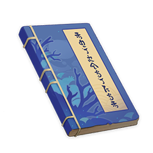</th>
      <th style="padding: 0; vertical-align: top;">
        

          

        珊瑚宫民间信仰初勘
        

          

          

        
            <strong>获取方式：</strong> 
            望泷村探索获取
        
        

        

      </th>
    </tr>
    <tr>
        <th colspan="2" style="font-weight: normal;">
        <strong>描述：</strong> 
        须弥近代史家希哈布·普尔比鲁尼的论著，书写于稻妻内战之前两年。简述了海祇岛的珊瑚宫民间信仰，并提出了较新的学术主张。
        </th>
    </tr>
    <tr>
        <th colspan="2" style="font-weight: normal;">
        <strong>阅读：</strong> 
        通常来说，被鸣神、海祇两处人民广泛接受的传说版本是这样的： 
        两千余年前的稻妻，正值魔神战争的尾声。 
        传说在那时，大蛇远吕羽氏曾折下身上的珊瑚枝、指引海渊之民重见天光，又以慈悲与怜悯聚集子民，为之在贫瘠的珊瑚岛上寻求生路。 
        但在无常的天地中间，渺小之人难免因在苦境的生存而伤痛，因悲哀的不幸而阴郁。不论明亮的天光、宁静的晴空与海面，还是流淌着虹光的砗磲宫阙、神人们温柔的教谕…都难以抚平饥饿与疾病的创伤。 
        大蛇从未忘记自己身为败者的苦涩过去，以及令子民不再遭受离弃的庄严誓言。于是，他向巫女发问： 
        「我之祝女，海渊之民为何哭泣？既然我已为你们驱逐龙嗣，令你们得见天光。」 
        智慧的巫女大人则说道： 
        「饥馑。」 
        大蛇又问： 
        「无法令子民饱足，确是罪过。那么，我之民，你们所求为何？」 
        诚实的乡老答道： 
        「您为我们引导生路，指导我们建立无劫夺、无欺凌，无人遭受压迫之苦的海中国度，这已足够令我们深感神恩…而在珊瑚之岛的东方，那里有更加广阔肥沃的土地。 
        「请您允许我们涉足东方的岛屿，让我们争取自己的田垄，让我们的后代拥有光明的过去、饱足的未来与不再灰暗的现在。」 
         
        大蛇却未置可否，只是沉默以对。 
        鸣神统一东部祝岛诸部，一向依仗勇武。败战神明，自然依天京律条，无一能幸免。 
        后来的许多年里，哀伤贫瘠的子民们再三祈求，终于动摇了他们的魔神。 
        就这样，大蛇将贫弱的海民训练成强悍的战士，驱使着舟船与海兽、波涛与云团，在鲸歌的陪伴中向雷神之国发起侵攻… 
        但海民们有所不知——海祇大御神之所以决意发起一场了无胜算的暴烈争端，其本意并非在于征服，而是在于牺牲。 
        据说在巫女刻意隐瞒的卜辞中，预言了珊瑚宫的东征早在一开始便注定是必败之战，仅会为海民留下屈辱窘迫的结局。 
         
        远吕羽氏之动机并无确实可靠之史料记载。这件事是事后人们发现卜辞内容后，对于此做出的推测： 
        海祇大御神亦早已料想到自己将不再有机会死里逃生，却坦然接受了预言的结局。 
        若要实现「信仰」的永恒不灭，则唯有「牺牲」一途。纵使神祇已永远逝去，子民们亦会将欢乐、丰足、苦难与失去的记忆纺织不停，成为凝聚一方的信仰。而战败屈身臣属之辱及其促发的激情，亦成为了共同记忆的养料。 
         
        尽管许多当代海祇人早已不再相信曾引领祖辈开拓生路的大御神仍有复苏可能，但身为海祇之民的强烈自尊；曾尊奉的神体被宗主视作矿产任意削凿的痛苦；以及对于失去海祇大御神的深切悲伤…诸多强烈深远的情绪代代相传，正如无字的史册，为海祇人的信仰奠定着隐忍，抗争与牺牲的注脚。 
         
        正如笔者所说，珊瑚宫之国极度缺乏成文史料，许多动机变成了任由后人解释的虚构故事。这亦使得其叙事史成为了「蓄积意识之史」，而非「记录事实之史」。其共同意识经过千百年强化凝聚的民众，纵使失去所爱戴的神明，竟能与信仰强大元素神灵的国度抗衡…不得不说，此种固执绝非泥古不化。 
         
        值得注意的是，轻视过去的「事实」，重视当下的「意识」，亦是海祇国度之一大缺点——千百年积累的哀怨，忍耐千百年的耻辱，一旦在穷匮的年景为别有用心者煽惑利用，则将可能为国家招致无妄之灾。 
         
        但言至于此，以智慧与隐忍闻名的海祇之民，难道真的自甘为生存而忍耐无尽的羞辱吗？ 
        尤其在近年勘定奉行的经济盘剥下，海祇岛上年轻人亦越来越多地谈论起有关抗争与报怨的话题，可见此等话题并非仅仅有关过去，而是深刻影响着现在与未来。 
         
        但是，这个斩海祇的传说故事还有另一个版本： 
        曾经的海渊之民在渊下之时，拥有极为可靠的编年史。因为无日无夜，若不如此，就会忘记时间。但是这些都被大蛇下令封存于渊下宫之中，不得带出。 
        曾经的海渊之民的名字甚至也不是如今的稻妻样式——如今的海祇民诸姓也是大蛇下令学习鸣神传统之后才出现的。 
        传说，海祇大御神决定把海渊之民带离水下之时，曾经也得到过天京传谕。本身海祇大御神就是闯入暗海，妄图避开魔神战争的大罪之神。是天上的命令，要求远吕羽氏引颈就戮也未可知。 
        只是海渊之字世上少有人懂，藏书也在渊下宫中无法得见。真相恐怕也无法得见天日了。 
        不过这个隐喻了「事实」的传说，和上面隐喻了「意识」传说相比，只是无关紧要的稗官野史罢了。
        </th>
    </tr>
  </thead>
</table>

### 巫女曚云小传

<table  class="table-weapon">
  <thead>
    <tr>
      <th class="th-weapon" rowspan="1">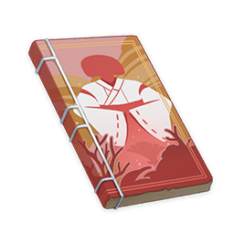</th>
      <th style="padding: 0; vertical-align: top;">
        

          

        巫女曚云小传
        

          

          

        
            <strong>获取方式：</strong> 
            望泷村探索获取
        
        

        

      </th>
    </tr>
    <tr>
        <th colspan="2" style="font-weight: normal;">
        <strong>描述：</strong> 
        对于海祇之民而言，有关魔神战争的传说必然是苦涩的。在千年传唱的诸多岛歌中，有一位名为「曚云」的巫女，曾乘着庞大的海兽追随大蛇作战，留下了悲壮的名声。
        </th>
    </tr>
    <tr>
        <th colspan="2" style="font-weight: normal;">
        <strong>阅读：</strong> 
        巫女曚云出身右名氏，该氏族乃是最初追随大御神重见阳光的大族之一，至今依旧以鲸歌的天赋与亲和海洋生物传统知名。曚云自幼便进入珊瑚宫，同现人神巫女学习海祇巫女的祭礼传统、历史知识、政务与岛歌；其双生胞妹，日后被称为「海御前」的菖蒲则是氏族的海女，做着采集珍珠的活计。 
        后来，当稻妻将军幕府统一诸岛的消息传至海祇时，曚云与菖蒲已在海祇民众中颇具名气。在留存至今的岛歌中，曚云性情智慧和善，善于调解海民之间无妄的纷争，而其妹菖蒲则勇武开朗，力能搏击海中猛兽。 
         
        当海祇大御神终于不再踌躇，决定发起注定无望的东征时，珊瑚宫最初的水军由现人神巫女亲自委任给曚云姐妹，而曚云与巨鲸「大检校」的缘分也因此而起。 
         
        传说「大检校」是一头盲眼巨鲸，其寿命有五百年又四百年之久。深沉黑暗的海床是它的居所，月光般绚丽的水母与深海鱼类是它的臣仆，左有五百条角鲸为护卫，右有五百条座头鲸为乐师。又有岛歌称，它一口便能吞下十座珊瑚岛，待到饱足沉睡时，又会随着呼噜声吐出五座礁岩… 
         
        即使精通鲸歌的珊瑚宫海民，也未尝有活着面见如此巨兽，而又能全身而退的。但曚云接下了现人神巫女的安排，便在明月刚刚冲破海雾升上夜空的时刻，潜入了磷光闪闪的鲸宫。没有人知道究竟曚云以怎样的巧舌妙辩说服了「大检校」，只知三次月明高升的时刻，待到浪潮从海滩退去时，海祇之民见证了「大检校」的庞大身躯载着曚云巫女浮出宁静的海面，泛着点点的银色微光。 
         
        后来，「大检校」与它的海兽仆从们就这样随曚云姐妹为大御神尽忠血战，直至无奈的终焉来临… 
        得知大御神与「东山王」一同战殁的消息后，曚云巫女在撤退途中为天狗笹百合的旧部所伏击，终于同巨鲸「大检校」一并战死，遗体为幕府军所获。其妹「海御前」菖蒲，则在力战之后消失在腥红的大海之中，不知所向。
        </th>
    </tr>
  </thead>
</table>

### 「东王」史辩

<table  class="table-weapon">
  <thead>
    <tr>
      <th class="th-weapon" rowspan="1">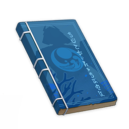</th>
      <th style="padding: 0; vertical-align: top;">
        

          

        「东王」史辩
        

          

          

        
            <strong>获取方式：</strong> 
            望泷村探索获取
        
        

        

      </th>
    </tr>
    <tr>
        <th colspan="2" style="font-weight: normal;">
        <strong>描述：</strong> 
        在海民的岛歌中流传的「东王」或「东山王」，在雷电的土地上则以「恶王」之名广泛流传。他是大蛇远吕羽氏册立的第一位藩王，也是最后一位。
        </th>
    </tr>
    <tr>
        <th colspan="2" style="font-weight: normal;">
        <strong>阅读：</strong> 
        「东山王」姓名不详，出身低微，一些岛歌将他称作「月光与潮汐的遗子」，或「被月光遗忘的孩子」。或许他曾是失去氏族的孤子，或顺海流漂荡而来的流人之子。 
         
        尽管无姓无名，也没有足以保护他安然长大的氏族，但海祇大御神还是接纳了这个孩子，就像他曾接纳深困海渊的遗民那般。 
        后来，男孩师从曚云姐妹，学会了海祇人的鲸歌与祭仪，记忆被珊瑚与砗磲的宫阙、闪亮的鱼群与霓虹色的鲛鱼染成彩色，躯体被粗粝的礁石与不尽的海浪磨炼得健壮迅捷。 
         
        右名氏的岛歌传唱道，当男孩长成少年，曚云巫女便邀他在月光与群星的波涛中共游。在辉光的涨消中，少年感知到海兽的语言与心绪；在巫女温柔哀伤的呢喃中，少年决定了此后的道路。 
         
        据说此次夜游之后，少年参悟了名为「月曚云」与「夕潮」的剑式。尽管少年并未留下子嗣，但此种剑式由海祇的武者们彼此教授，又加以代代改进，因而从未失传。在剑术传统匮乏的海祇岛，此二式至今仍是效用实战的难敌之术。 
         
        当海祇大御神踏上无归的东征之途，少年为之先登破竹，率先攻下了当时被海民称为「东山」的岛屿。「东山王」之封号，便是海祇大御神为这一战功的赏赐。但在如今八酝岛居民的传说中，这位勇猛可怖的「东山王」，却有着凶残暴戾的「恶王」之名。 
         
        最终「恶王」与其主一道遭到「无想的一刀」制裁，曾一同泛波月夜的曚云亦在族人的哀叹中身殒漆黑鸦羽的风暴之中… 
        一切尘埃落定，一切事与愿违。 
         
        值得一提的是，在当今的海祇岛，人们仍旧会将那些英武矫健的勇士称作「东山王的子孙」，尽管年轻狂妄的「东山王」未曾来得及与心仪的人彼此结合，安然享受和平无波澜的未来。
        </th>
    </tr>
  </thead>
</table>

### 柳达希卡的信

<table  class="table-weapon">
  <thead>
    <tr>
      <th class="th-weapon" rowspan="1"></th>
      <th style="padding: 0; vertical-align: top;">
        

          

        柳达希卡的信
        

          

          

        
            <strong>获取方式：</strong> 
            世界任务「特别的御神签」获取
        
        

        

      </th>
    </tr>
    <tr>
        <th colspan="2" style="font-weight: normal;">
        <strong>描述：</strong> 
        柳达希卡让八重堂员工转交给你的信，你能从信中找到她不辞而别的理由。不过，是否接受这个理由，就是另一回事了。 
        是你发现了她的存在，改变了她的命运…你或许还能做到更多事，比如一个让所有人都幸福的结局？
        </th>
    </tr>
    <tr>
        <th colspan="2" style="font-weight: normal;">
        <strong>阅读：</strong> 
        给旅行者和派蒙： 
        非常抱歉，最后以这样的形式与你们道别。虽然忍不住说出道歉的话，但我深知自己并不具备这样做的资格，也同样无颜出现在你们面前。 
        二位此前说要帮我渡过难关，我心存感激之余，也一直思索那究竟是怎样的办法。在二位拿走我的衣服后，我才突然意识到你们帮助我的办法，很可能会将你们置于险境之中。 
        于是，我离开八重堂寻找你们，最终在荒海附近看到了你们，还有一位我过去只在留影机画像上见过的人——百代小姐。 
        我曾经凭借与她相似的长相，顶替了她的身份，她理应对我恨之入骨。可我却发现，她竟然为了让我能够顺利假死，冒了那么大的风险，还永远失去了一只眼睛。 
        我是一个罪人，不值得你们这样对我，但你们却为我做了太多。我永远无法偿还你们的恩情。 
        随信留下的袋子里，是我来到稻妻后的全部积蓄，请二位与百代小姐收下。对不起，我只能想出这个办法报答你们。请你们放心，这些钱都是我打工所得，光明磊落。 
        再见。我会永远离开稻妻，这片我亏欠了太多的土地。
        </th>
    </tr>
  </thead>
</table>

### 柳达希卡的签文

<table  class="table-weapon">
  <thead>
    <tr>
      <th class="th-weapon" rowspan="1"></th>
      <th style="padding: 0; vertical-align: top;">
        

          

        柳达希卡的签文
        

          

          

        
            <strong>获取方式：</strong> 
            世界任务「特别的御神签」获取
        
        

        

      </th>
    </tr>
    <tr>
        <th colspan="2" style="font-weight: normal;">
        <strong>描述：</strong> 
        昭明今日运势的特制纸签，本质上与其他「御神签」没有区别，不过这一张却是让柳达希卡敞开心扉的钥匙。 
        签文再次回到了手中时，也包含了她真诚的祝福。如果有时间的话，就去鸣神大社看看她吧。
        </th>
    </tr>
    <tr>
        <th colspan="2" style="font-weight: normal;">
        <strong>阅读：</strong> 
        ——末吉—— 
晴朗的天空突然刮过一阵风，它预示着什么？ 
虽然有在原地打转的感觉，但这只是暂时的。 
留心出现在身边的人，虽然都是熟悉的面容。 
可你的命运，却会因为他们的存在悄悄改变… 
 
今天的幸运物是：来自遥远异国的蒲公英。 
随风而起的种子，是你最好的象征。 
飞翔吧，漂泊吧，跨越大海，行至远方。 
但总有一天，你将不再漂泊。 
总有一天，你一定能成为你希望的模样。
        </th>
    </tr>
  </thead>
</table>

### 「最终指令」

<table  class="table-weapon">
  <thead>
    <tr>
      <th class="th-weapon" rowspan="1">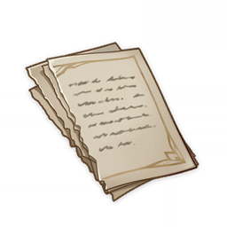</th>
      <th style="padding: 0; vertical-align: top;">
        

          

        「最终指令」
        

          

          

        
            <strong>获取方式：</strong> 
            世界任务「特别的御神签」获取
        
        

        

      </th>
    </tr>
    <tr>
        <th colspan="2" style="font-weight: normal;">
        <strong>描述：</strong> 
        从柳达希卡手里得到的愚人众行动指令，详细叙述了接下来要在海祇岛上执行的任务。由于事关民众的安危，这张纸上的情报尤为重要。
        </th>
    </tr>
  </thead>
</table>

### 「愚人众暗语表」

<table  class="table-weapon">
  <thead>
    <tr>
      <th class="th-weapon" rowspan="1"></th>
      <th style="padding: 0; vertical-align: top;">
        

          

        「愚人众暗语表」
        

          

          

        
            <strong>获取方式：</strong> 
            世界任务「特别的御神签」获取
        
        

        

      </th>
    </tr>
    <tr>
        <th colspan="2" style="font-weight: normal;">
        <strong>描述：</strong> 
        由某位永远睡不醒的终末番成员记录的「愚人众暗语表」。 
            阅读它的时候，你除了能得知「愚人众说话真的很奇怪」之外，还能够感受到记录员浓浓的睡意，以口水的形式力透纸背。
        </th>
    </tr>
    <tr>
        <th colspan="2" style="font-weight: normal;">
        <strong>阅读：</strong> 
        遗忘故土的同乡：愚人众表明身份时自称。 
        远足：执行任务，行动。 
        晒太阳：蛰伏，按兵不动。 
        摔碎盘子：孤注一掷干票大的。 
        刷盘子：身份暴露被抓。 
        握紧左手：报仇。 
        握紧右手：结盟。 
        放开左手：■叛。 
        放开右手：原谅。 
        南风：顺利。 
        北风：不■ 
        ■阳蟹：万国商会，可能因为并不■稻妻的螃蟹 
        ■■蟹：勘定■行，■■因■是将军麾下■■■ 
        ■■蟹：野■众，因为■■■■■乱鬼■颜色 
        铁■■：终末■，被叫做■鼠■■■过分，■生气■■■■■ 
         
        （纸上的字一开始还比较清晰，但越往下字迹越难以辨认，而且还明显有被水洇湿的痕迹。）
        </th>
    </tr>
  </thead>
</table>

### 五歌仙资料汇总

<table  class="table-weapon">
  <thead>
    <tr>
      <th class="th-weapon" rowspan="1"></th>
      <th style="padding: 0; vertical-align: top;">
        

          

        五歌仙资料汇总
        

          

          

        
            <strong>获取方式：</strong> 
            活动任务「堇庭华彩」获取
        
        

        

      </th>
    </tr>
    <tr>
        <th colspan="2" style="font-weight: normal;">
        <strong>描述：</strong> 
        由八重堂编辑长平山整理的五歌仙资料，用以帮助白垩老师完成五歌仙画像。 
        虽然内容十分有限，但仍能从中窥见当年五歌仙的风采。
        </th>
    </tr>
    <tr>
        <th colspan="2" style="font-weight: normal;">
        <strong>阅读：</strong> 
        关于「五歌仙」： 
        五歌仙是稻妻古代的传说人物，因为能歌善赋而得到「五歌仙」的美名。据说他们的作品深得将军大人喜爱，每年五人将新作集结成册后，都会派出一人前往天守阁，将诗集献给将军品鉴。 
        五歌仙分别名为「翠光」、「葵之翁」、「赤人」、「墨染」与「黑主」。 
        五人真名现已不可考，一种流传较广的说法是：因为五歌仙故事曾被大量搬上舞台，为方便观众辨认角色，便以绿蓝红白黑五色戏服加以区分，久而久之，观众便以角色的代表色为歌仙命名。不过也同样找到了「翠光因其草庵名『翠光堂』而得名」、「赤人因喜爱在作品上加盖朱印而得名」之类的说法。 
        …… 
         
        关于「五歌仙故事」： 
        五歌仙的形象深入人心，以他们为主角的作品也一度在稻妻十分流行。 
        遗憾的是，虽然世间曾流传过许多内容各异的五歌仙故事，但时至今日，这些故事的具体内容已不可考。它们很有可能是在五百年前的大灾时期散佚的。 
        从现存资料得知，在五歌仙故事创作的鼎盛时期，这些故事基本都遵从相同的格式：以四首诗为一组，每首诗以一位歌仙的视角展开叙述，四首诗合在一起构成完整的故事。有趣的是，这些故事里似乎都没有「黑主」视角的独立篇章。 
        …… 
         
        五歌仙个人资料汇总： 
        翠光：爱饮酒，平民出身，性格洒脱不羁。一说翠光因为居住的草庵名为「翠光堂」而得名。 
         
        葵之翁：擅长弈棋的老者，除诗歌外，也有小说作品传世。一说他成名较晚，真实身份是幕府官员；另一说他并非人类，而是长寿的妖狐所化。 
         
        赤人：擅长剑术，极有可能是武人出身。一说赤人因为喜爱在作品上加盖朱印而得名。 
         
        墨染：曾是巫女，擅花艺、舞蹈，后担任将军身边侍女。一说墨染在成名后辞去官职，专心创作，另一说墨染直到晚年依旧陪伴在将军身侧服侍。 
         
        黑主：信息较少，真实身份不详。或许正因为此，黑主在故事中的身份和性格设定，比其他人都要更丰富多样。 
        ……
        </th>
    </tr>
  </thead>
</table>

### 《五歌仙容彩·翠光篇》

<table  class="table-weapon">
  <thead>
    <tr>
      <th class="th-weapon" rowspan="1">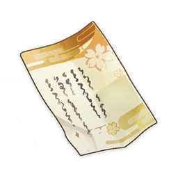</th>
      <th style="padding: 0; vertical-align: top;">
        

          

        《五歌仙容彩·翠光篇》
        

          

          

        
            <strong>获取方式：</strong> 
            活动任务「堇庭华彩」获取
        
        

        

      </th>
    </tr>
    <tr>
        <th colspan="2" style="font-weight: normal;">
        <strong>描述：</strong> 
        温迪在港口仓库的货箱里发现的纸片，上面写有一首名为《五歌仙容彩·翠光篇》的诗。
        </th>
    </tr>
    <tr>
        <th colspan="2" style="font-weight: normal;">
        <strong>阅读：</strong> 
        五歌仙容彩·翠光篇 
        吾之草庵远俗世，奈何浮名惹尘嚣。 
        翠衣彩卷登天守，葵稿青诗遗页章。 
        泥首但求平圣怒，捶颅狠忆语仓皇。 
        昨夜酒肆酩酊醉，眠时身侧影徜徉。 
        定是奸人窃诗去，我颜尽丧御堂上。
        </th>
    </tr>
  </thead>
</table>

### 《五歌仙容彩·葵之翁篇》

<table  class="table-weapon">
  <thead>
    <tr>
      <th class="th-weapon" rowspan="1"></th>
      <th style="padding: 0; vertical-align: top;">
        

          

        《五歌仙容彩·葵之翁篇》
         

          

          

        
            <strong>获取方式：</strong> 
            活动任务「堇庭华彩」获取
        
        

        

      </th>
    </tr>
    <tr>
        <th colspan="2" style="font-weight: normal;">
        <strong>描述：</strong> 
        行秋在行李下面发现的纸片，似乎是有人趁着他打瞌睡放在那里的。纸上写有一首名为《五歌仙容彩·葵之翁篇》的诗。
        </th>
    </tr>
    <tr>
        <th colspan="2" style="font-weight: normal;">
        <strong>阅读：</strong> 
        五歌仙容彩·葵之翁篇 
        少时玄冕列朝堂，老来松影胧月光。 
        忤逆之举非本愿，性命遭胁实相强。 
        匆匆步履觅旧作，惶惶残稿怀中藏。 
        个中缘由悉不知，只因秘客性乖张。 
        犹记此诗忆赤人，故知飘零情何伤。
        </th>
    </tr>
  </thead>
</table>

### 《五歌仙容彩·赤人篇》

<table  class="table-weapon">
  <thead>
    <tr>
      <th class="th-weapon" rowspan="1"></th>
      <th style="padding: 0; vertical-align: top;">
        

          

        《五歌仙容彩·赤人篇》
        

          

          

        
            <strong>获取方式：</strong> 
            活动任务「堇庭华彩」获取
        
        

        

      </th>
    </tr>
    <tr>
        <th colspan="2" style="font-weight: normal;">
        <strong>描述：</strong> 
        某个神秘人留下的纸片。此人应该原本是想把纸片放在万叶身上，却不料气息被万叶察觉，仓皇中只好将它扔在地上后逃走。纸上写有一首名为《五歌仙容彩·赤人篇》的诗。
        </th>
    </tr>
    <tr>
        <th colspan="2" style="font-weight: normal;">
        <strong>阅读：</strong> 
        五歌仙容彩·赤人篇 
         
        我辈久承显赫名，少年意气踌躇志。 
        每咏新词缀朱印，便得美号天下知。 
        岂知去岁文章会，吾竟窃作前人诗。 
        欺瞒盗取无可恕，野色苍茫弃置身。 
        五色华光再不复，恰似人间无常事。
        </th>
    </tr>
  </thead>
</table>

### 《五歌仙容彩·墨染篇》

<table  class="table-weapon">
  <thead>
    <tr>
      <th class="th-weapon" rowspan="1"></th>
      <th style="padding: 0; vertical-align: top;">
        

          

        《五歌仙容彩·墨染篇》
        

          

          

        
            <strong>获取方式：</strong> 
            活动任务「堇庭华彩」获取
        
        

        

      </th>
    </tr>
    <tr>
        <th colspan="2" style="font-weight: normal;">
        <strong>描述：</strong> 
        绫华在容彩祭会场的花架上发现的纸片，但这张纸上只写了一句话。
        </th>
    </tr>
    <tr>
        <th colspan="2" style="font-weight: normal;">
        <strong>阅读：</strong> 
        五歌仙容彩·墨染篇 
         
        清溪善洗沉书册，澄波易染浮本相。
        </th>
    </tr>
  </thead>
</table>

<table  class="table-weapon">
  <thead>
    <tr>
      <th class="th-weapon" rowspan="1">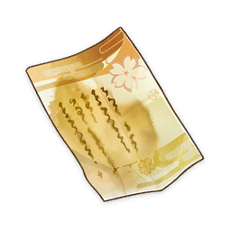</th>
      <th style="padding: 0; vertical-align: top;">
        

          

        《五歌仙容彩·墨染篇》
        

          

          

        
            <strong>获取方式：</strong> 
            活动任务「堇庭华彩」获取
        
        

        

      </th>
    </tr>
    <tr>
        <th colspan="2" style="font-weight: normal;">
        <strong>描述：</strong> 
        绫华在容彩祭会场的花架上发现的纸片，在用清水浸泡过之后，纸面上浮现出了完整的《五歌仙容彩·墨染篇》诗作。
        </th>
    </tr>
    <tr>
        <th colspan="2" style="font-weight: normal;">
        <strong>阅读：</strong> 
        五歌仙容彩·墨染篇 
         
        诗女彻遍阅彩卷，赤印不着盗文章。 
        清溪善洗沉书册，澄波易染浮本相。 
        风流句篇水难洗，龌龊罪诗墨自消。 
        葵翁觅诗从旁过，正作追思故人词。 
        一番风波复未平，又是御所采诗时…
        </th>
    </tr>
  </thead>
</table>

### 古老的锻造图谱

<table  class="table-weapon">
  <thead>
    <tr>
      <th class="th-weapon" rowspan="1"></th>
     <th style="padding: 0; vertical-align: top;">
        

          

        古老的锻造图谱
        

          

          

        
            <strong>获取方式：</strong> 
           	活动任务「堇庭华彩」获取
        
        

        

      </th>
    </tr>
    <tr>
        <th colspan="2" style="font-weight: normal;">
        <strong>描述：</strong> 
        一卷古老的锻造图谱，将军曾命令枫原家依照它锻造御神刀。 
            经过浸泡后，图谱上有一些文字变得模糊了——有人通过篡改它，导致了锻刀失败，并引发了后续的一系列惨剧…
        </th>
    </tr>
    <tr>
        <th colspan="2" style="font-weight: normal;">
        <strong>阅读：</strong> 
        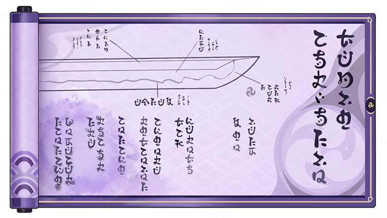
        </th>
    </tr>
  </thead>
</table>

### 枫原义庆的信

<table  class="table-weapon">
  <thead>
    <tr>
      <th class="th-weapon" rowspan="1"></th>
      <th style="padding: 0; vertical-align: top;">
        

          

        枫原义庆的信
        

          

          

        
            <strong>获取方式：</strong> 
           	活动任务「堇庭华彩」获取
        
        

        

      </th>
    </tr>
    <tr>
        <th colspan="2" style="font-weight: normal;">
        <strong>描述：</strong> 
        藏在古旧花盆夹层中的空白纸张，沾上水后，就会浮现出尘封多年的秘密。 
            在将信上记述的真相告诉大家后，万叶说「这封信对你或许还有用」，便将它交给了你。
        </th>
    </tr>
    <tr>
        <th colspan="2" style="font-weight: normal;">
        <strong>阅读：</strong> 
        <strong>未完成魔神任务间章「倾落伽蓝」</strong> 
        致读信之人： 
        吾枫原义庆终其一生，始终受困于某一「秘密」，而今吾已时日无多，思前想后，最终决定将此事和盘托出。 
        当年，吾与社奉行神里大人追捕叛逃刀匠之时，并非为叛逃者所伤。 
        事实上，是夜，我等循着线索来到岸边时，未见任何刀匠踪影，却仅有一名倾奇者现身。倾奇者自居幕后主使，声称已等候我等多时，扬言绝灭雷电五传。 
        此人身手远非常人能敌，仅须臾之间，我等随行武士便被尽数击倒。神里大人身受重伤，吾则因为被劈中了头顶斗笠，才侥幸逃过一死。 
        倾奇者再有一击便可取吾性命，但见吾长相，却不再攻击，而是厉声逼问吾与「丹羽」有何瓜葛。吾只得作答此为家父旧姓，家父失踪后，吾便被枫原主家收养。 
        倾奇者听后不再言语。沉默许久，忽道：「告知她，吾名『国崩』。」随即转身离去… 
         
        锻刀不利，乃此倾奇者篡改大御所大人图谱所致。神里大人虽知此事意义深重，却因人言可畏，恐为外人陷以勾连重犯之罪，则吾亦遭株连。病重弥留之际，仍坚称我等被叛逃者所伤，诫吾三缄其口。吾感激大人体恤，又因囿于时局，只得将此事深埋于心。 
        身为枫原一族之长，吾深以「一心传」没落为耻；但身为人父，只求子孙平安顺遂。读信之人若为我枫原家后人，切记不可盲目追觅旧日敌雠，为往昔繁务所羁绊，终至迷失自身之境地。 
         
        枫原义庆手书 

        <strong>已完成魔神任务间章「倾落伽蓝」</strong> 
        致读信之人： 
        吾枫原义庆终其一生，始终受困于某一「秘密」，而今吾已时日无多，思前想后，最终决定将此事和盘托出。 
        当年，吾与社奉行神里大人追捕叛逃刀匠之时，并非为叛逃者所伤。 
        事实上，是夜，我等循着线索来到岸边时，未见任何刀匠踪影，却仅有一名形迹可疑之人在该地逡巡。此人自居幕后主使，声称祖上被吾等构陷枉死，扬言绝灭雷电五传。 
        此人身手过人，寻常人难以抵挡，仅须臾之间，我等随行武士被击倒过半。神里大人身受重伤，吾则因为被劈中了头顶斗笠，才侥幸逃过一劫。 
        然而，再如何厉害的人也毕竟是人，武士们一拥而上，全力对抗，终于将此人击杀。 
        死前，此人凄声喝道：「雷电五传本就不该存在！若非如此，吾也不会…」话未说完便没了气息。 
         
        后得知，锻刀不利，亦是此人做的手脚。神里大人虽知此事意义深重，却因人言可畏，恐为外人陷以勾连重犯之罪，则吾亦遭株连。病重弥留之际，仍坚称我等被叛逃者所伤，诫吾三缄其口。吾感激大人体恤，又因囿于时局，只得将此事深埋于心。 
        身为枫原一族之长，吾深以「一心传」没落为耻；但身为人父，只求子孙平安顺遂。读信之人若为我枫原家后人，切记不可盲目追觅旧日敌雠，为往昔繁务所羁绊，终至迷失自身之境地。 
         
        枫原义庆手书
        </th>
    </tr>
  </thead>
</table>

### 转生成为雷电将军，然后天下无敌

<table class="table-weapon">
  <thead>
    <tr>
      <th class="th-weapon" rowspan="1">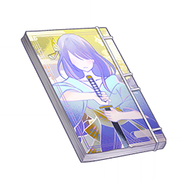</th>
      <th style="padding: 0; vertical-align: top;">
        

          

        转生成为雷电将军，然后天下无敌
        

          

          

        
            <strong>获取方式：</strong> 
           	村田<「八重堂」编辑>处购买
        
        

        

      </th>
    </tr>
     <tr>
        <th colspan="2" style="font-weight: normal;">
        <strong>描述：</strong> 
        流行于稻妻的轻小说，讲述了一个普通人突然变成雷电将军的故事。由于故事新奇有趣，此书深受欢迎，还激发了很多轻小说作者的创作灵感。
        </th>
    </tr>
    <tr>
        <th colspan="2" style="font-weight: normal;">
        <strong>阅读：</strong> 
        人生有时候就是这样。 
        爸妈总说要明辨是非，衡量好坏，但现实永远是在两个坏的选项中选出不那么坏的那一个。 
        女朋友已经决定和我分手了，她还告诉我的上级说我有赌瘾，现在工作也没了。我可没闲钱去做这种空虚的事，要是不交保护费，我爸妈的安全就难说了。 
        然后他们骂我没出息，不干正事，也不存钱。 
        我是为了谁啊…我也没做错什么吧。 
        要说错的话，大概就是错在努力也活不下去，想了结自己，还没这个胆子。 
        算了，等他们来了赶紧交钱。交完钱还得想想怎么赚摩拉，不然只能吃海草了。 
        来，不如我们再做一个两坏之中选其轻的选择吧。 
        被一刀砍翻，或者被什么飞来的石头砸得脑袋开花，哪个会痛快点呢？ 
        「嗞嗞嗞——」 
        从刚刚开始就有奇怪的声音，怎么回事… 
        不会是要打雷吧？ 
        …… 
        醒来的时候已经不知道过了多久。 
        我只记得失去意识之前，好像瞬间被某种尖锐的东西贯通了全身。 
        「好像，不怎么痛…啊？！」 
        我被吓得叫出了声。 
        这是我的声音吗？ 
        「啊，啊——」 
        居然是真的。 
        我抬起手臂，华丽的布料之下是无比白皙的肌肤。 
        这显然不是我的身体，但一时间我的大脑并没有跳跃到那个显而易见的答案。 
        因为太不可思议了。 
        我尝试站起来，这才完整地目睹了这套衣服的样子。 
        每一个细节都无比华贵，只有至高无上的人才有福消受。 
        难道说… 
        「怎么不是那小子…嗯？雷、雷电将军？」 
        掷地有声的称呼。 
        对啊。 
        我好像成为雷电将军了。 
        收保护费的海乱鬼们列阵排开，虽然看不到他们的脸，但看动作就充满了戒备，还有些畏惧。 
        这可是我从来都没见过的样子。 
        「兄弟们，报、报仇的机会到了…」 
        声音很明显地由大变小，他害怕了。 
        不愿在小弟面前丢脸，就这么逃掉可不行，但他也早就想到了战斗的结果。 
        人数在逐渐变多，十人，二十人，五十人… 
        可能觉得能用人数弥补力量上的劣势吧。 
        但雷电将军的力量，岂会和凡人放置在同一天平之上？ 
        「就用你们，试试刀吧。」 
        屏气，凝神，摆好架势。 
        命运即将改变，在这一刀之后。 
        「无想…」 
        …… 
        等等。 
        「无想的一刀」，要怎么用来着？
        </th>
    </tr>
  </thead>
</table>

### 拜托了我的狐仙宫司

<table class="table-weapon">
  <thead>
    <tr>
      <th class="th-weapon" rowspan="1">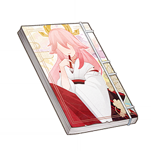</th>
      <th>
        拜托了我的狐仙宫司
         

        
            <strong>获取方式：</strong> 
           	村田<「八重堂」编辑>处购买
        
      </th>
    </tr>
    <tr>
        <th colspan="2" style="font-weight: normal;">
        <strong>描述：</strong> 
        流行于稻妻的轻小说。讲述了废柴将军大人与万能狐仙宫司的故事，与《转生成为雷电将军，然后天下无敌》是姊妹篇，但是并非同一作者所著，最大共同特征是都很受欢迎。
        </th>
    </tr>
    <tr>
        <th colspan="2" style="font-weight: normal;">
        <strong>阅读：</strong> 
        「欢迎回家，将军大人！」 
         
        八重政子穿着红白相间的巫女服谦恭地跪坐在面前，毛茸茸的狐狸耳朵微微颤动，耳朵之下则是那个被万千民众仰视的面庞。 
        「你回来了，半个月前拜托你的巡视领土的工作如何了呢？」 
        「啊，不应该你一回来就问工作的。那么同往常一样，是先吃饭呢？先洗澡呢？还是…」 
        「喂，什么叫『同往常一样』啦！之前并没有说过这种老套的回家迎接台词吧。」 
        听到我这样的回应，红白身影满意地笑了：「因为看你没什么精神嘛，那么我继续做饭了，今天做的是你喜欢的黄油蟹蟹哦！」 
        「好耶！是黄油蟹蟹，黄油蟹蟹！」 
         
        我，雷电将军，说的最多的话是「好耶」！吃的最多的食物是黄油蟹蟹，见的最多的人…呃，大体来说，我的生活里只有两种人：路人，还有一种便是那个毛绒耳朵，幽幽声音的主人。 
        八重政子，是神鸣大社的宫司，狐之血脉的延续者，「永恒」的眷属与友人…头衔多到很难记住，在稻光的民众看来几乎是和我一样难以接近，难以揣测的存在。 
         
        而就是这样的八重政子，此时此刻正在津津有味地看着黄油蟹蟹的烤制过程。 
        没错，用更简洁的话来总结的话，我，雷电将军，正在被宫司八重政子豢养着。 
        不知道什么时候开始，就已经习惯了这样的生活。 
        哪怕是拔出剑随便挥了几下，她都会兴致勃勃地鼓着掌说：「好孩子好孩子」。哪怕是想在看《转生成为雷电将军，然后天下无敌》的时候顺便吃些什么，她都能迅速端出美味的奶茶与蛋糕来。她像是维护永恒一样，细心地把任何烦恼的可能性都消灭在视线里。对我来说，她就像传说中的狐仙一样，满足我的任何心愿。 
        「黄油蟹蟹完成啦~那么在享用之前，还是那个问题，巡视领土的工作…」 
         
        政子回过身来，端上热气腾腾的黄油蟹蟹，香味在房间里流淌。可是，我没法回答她的问题，说实话，这是我今天糟糕心情的根源。 
        正如我说过的，我的世界里，只有政子，与其他人。 
        除了政子以外，其他所有人见到我的反应都是一致的：立刻恭敬地伏在地上，口称「将军大人」，待我走远之后，再长舒一口气直起身。 
        无论那个人是谁的妻子、谁的父亲、谁的恋人、谁的英雄、谁的上司、谁的下仆，在我的面前，就都只会露出一种面孔，人们称之对将军大人的尊重，敬畏。 
        但是他们不知道的是，我同样害怕这样的面孔，任谁都会害怕的吧：千百万人，都只会对你露出同一张面孔。 
         
        正因此，我才会那么依赖政子。 
        正因此，我无法拒绝政子的请求，尽管我做不到，但是她让我出去工作，我就会出去。 
        不过我也确实不知道如何面对那千万张相同面孔，不想面对，不能面对。只要能够避免和他们接触，哪怕被人叫做废柴将军也无所谓。 
        可是，即便是心甘情愿地做着废柴将军，来自政子的诘问却是无法避免的。 
        「为什么不说话，将军大人？难道…今天也是一样，只是走出了天守阁大门，然后什么都没有做，直到傍晚才回来？」政子的声音里听不出一丝的负面情绪，但正因为如此，我才更加不知道如何回答她。 
        「那好吧，要好好休息哦，我还有些事情要忙，得先去处理一下。黄油蟹蟹记得吃完。」政子转过头，离开了房间。 
         
        不知道为什么，今天的黄油蟹蟹，一点味道也没有。 
        很快我就知道答案了。 
        将军大人是无敌于天下的，但是无敌于天下的将军大人，也会被感冒所击倒。 
        吃完黄油蟹蟹之后没多久，我就倒在了床上，头很痛，不过这并不算什么，对我来说有更加严重的事态发生： 
        如果是平时的话，应该可以枕在政子的膝盖上，听着她的歌声入眠。 
        但是今天政子并没有出现，御殿冰冷，额头火热，将军床头空无一人。 
         
        她，有自己要忙的事情，她不仅是我的狐仙，也是神社的宫司。 
        说不定她现在正在生气吧，又或者在怀疑，整天「好耶」的我，真的值得她花费这么多精力吗？ 
        带着这样的疑问，我沉沉睡去。 
         
        我做了一个梦，梦里政子还是露出她那标志性的笑容，手中拿着茶碗。 
        「这是我特意调配的饮品，叫做『紫苑云霓』。刚刚我去了一趟离岛，买了一些来自蒙德的嘟嘟莲，再加上薄荷，喝了它，感冒就会好起来哦。」 
        大概是因为做梦吧，我并没有足够的力气支起身体。 
        「啊，将军大人无法起身啊，那么，且容我失礼一下。」她用了一种我连做梦都不敢想的方式，喂下了「紫苑云霓」。 
        我惊醒，刚刚的情景实在是超出了我的想象范围，毕竟政子此时此刻应该还是在为我疏于政事而生气。 
         
        只是…嘴角为何是甜的？
        </th>
    </tr>
  </thead>
</table>

### 出发吧！嘟嘟可

<table class="table-weapon">
  <thead>
    <tr>
      <th class="th-weapon" rowspan="1">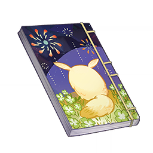</th>
      <th>
        出发吧！嘟嘟可
         

        
            <strong>获取方式：</strong> 
           	活动任务「堇庭华彩」获取
        
      </th>
    </tr>
    <tr>
        <th colspan="2" style="font-weight: normal;">
        <strong>描述：</strong> 
        编辑寄语：《出发吧！嘟嘟可》是一个大女孩和一个小女孩共同完成的故事，故事中的所有小小片段都包含着她们的温柔与祝福，也是她们送给诸位读者的礼物。希望这本薄薄的小书能让读者们在繁忙的工作之余获得一些简单的快乐。
        </th>
    </tr>
    <tr>
        <th colspan="2" style="font-weight: normal;">
        <strong>阅读：</strong> 
        「所有的『嘟嘟可』早晚都会乘着风与海流去冒险。」一位温柔又美丽的母亲曾经这样说过。 
就像她预言的那样，我们的嘟嘟可，在听到它的好朋友可莉决定去雷电的国度冒险时，简直开心极了。 
和可莉一起享受「猎鹿人」餐馆的美食，一起听吟游诗人演唱，当然是嘟嘟可喜欢的事情啦。 
但嘟嘟可更喜欢的，还是和可莉一起数天上的星星，一起把野花编成花环。 
毕竟，所有的「嘟嘟可」都渴望乘着风与海流去冒险呀。 
 
要前往遥远的雷电国度，不仅得穿过狂风，还得跨越海洋。 
嘟嘟可不害怕狂风呼啸，那原本是风之神的祝福。 
嘟嘟可也不担心海浪翻卷，它可是个勇敢的孩子。 
但，嘟嘟可不愿意让可莉遇到这些危险。 
因为它是可莉最好的朋友，好朋友得互相保护才对吧。 
而且，嘟嘟可不想和可莉分开。 
没有可莉的话，一切冒险就会变得像绽放不了的甜甜花，又孤独又难过。 
就算走遍了提瓦特的每一寸土地，趟过了每一条溪流，也是没有意义的。 
所以没什么好犹豫的，嘟嘟可要和它最好的朋友可莉，一起乘船去冒险！ 
乘船的话就不能在风中自由飞翔，也不能在海中畅快游泳了， 
但可以拥有可莉的笑容，还有阿贝多哥哥的故事。 
还是很值得的嘛。 
 
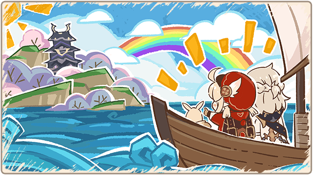
 
在雷电的国度稻妻，花花草草是紫色的，鱼儿和鸟儿也是紫色的，一切都是紫色的。 
要把它们都画下来的话，阿贝多哥哥的紫色颜料会不够的吧。 
不过可惜阿贝多哥哥没有时间和可莉、嘟嘟可一起画画了。 
阿贝多哥哥是大人，有的时候，大人会有「大人」的事情要忙。 
不过幸好嘟嘟可的身边还有可莉！ 
可莉总有办法找到开心的事情，嘟嘟可只要和可莉在一起，就永远不会无聊。 
 
可莉在稻妻有很多很多朋友，荣誉骑士大哥哥，派蒙，还有宵宫大姐姐。 
他们所有人和嘟嘟可一起，在稻妻来了一次最开心的大冒险。 
呀嘿，大冒险万岁！ 
 
荣誉骑士大哥哥带着嘟嘟可爬上了高高的影向山。 
大家爬山爬累了，躺在神樱树下呼呼睡起了大觉。 
结果一觉醒来，所有人都长出了天狗一样的翅膀。 
可莉的翅膀是红色的，宵宫大姐姐的翅膀是金色的，荣誉骑士大哥哥的翅膀是青色的。 
派蒙的话，没有翅膀就能飞，所以派蒙就没有翅膀好啦。 
大家的翅膀一齐张开，卷起了好大的风。 
「呼呼——」，把巫女姐姐的头发都吹乱了。 
不好，在巫女姐姐生气之前，得快快飞走。 
 
大冒险真是太开心了，但是…「咕噜噜」，可莉的肚子叫了起来。 
嗨呀，怎么把这件事忘了，好吃的点心是大冒险的重要一环啊。 
「酿姆酿姆…」于是大家买来了美味的团子，一起开开心心分着吃。 
嘟嘟可和派蒙很快就吃完了各自的那份，吃得饱饱的嘟嘟可看着可莉的笑容，忍不住觉得—— 
和可莉相遇，和大家相遇，是嘟嘟可能想到的最最最开心的事！ 
 
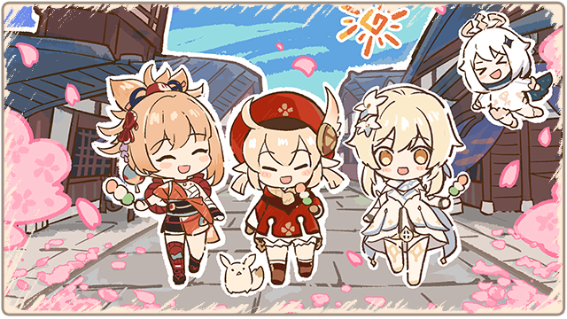
 
啊，忘记了一件重要的事，认真说起来，看到这里的你绝对算是这次大冒险的一员。 
一同冒险，一同欢笑，一同分享美食，经历了这些的你当然是大家的好朋友啦。
那么，宵宫大姐姐放的烟花，你也一起来看吧。 
 

 
所有人都高高兴兴地看着烟花的时候，宵宫大姐姐说： 
「只要想象力没有干涸，心就比什么都自由。」 
可莉也忍不住说：「我们是永远都不会分开的好朋友。」 
你看，和好朋友们在一起的时候嘟嘟可多开心呀。 
现在，你也是嘟嘟可的好朋友了，那么你也要开开心心，和好朋友们一起去经历最伟大的冒险。
        </th>
    </tr>
  </thead>
</table>

### 法医室的研究日志内页

<table class="table-weapon">
  <thead>
    <tr>
      <th class="th-weapon" rowspan="1"></th>
      <th style="padding: 0; vertical-align: top;">
        

          

        法医室的研究日志内页
        

          

          

        
            <strong>获取方式：</strong> 
           	鹿野院平藏邀约任务「有一个秘密」结局获取
        
        

        

      </th>
    </tr>
    <tr>
        <th colspan="2" style="font-weight: normal;">
        <strong>描述：</strong> 
        满是折痕的研究日志内页，字迹依旧清晰可见。
        </th>
    </tr>
    <tr>
        <th colspan="2" style="font-weight: normal;">
        <strong>阅读：</strong> 
        将日落果中提取的酸性营养物质与鱼肝中提取的油膏混合提纯后，得到微量的白色霜状物质。 
 
喂食林猪白色霜状物质，林猪在一周内先后出现皮肤粘膜破损、腐蚀，呼吸衰竭并死亡。 
 
将日落果替换为浓缩果汁，将鱼肝替换为高浓度的鱼肝清膏，重复上述混合提纯，得到了大量的白色霜状物质。 
 
以该剂量喂食林猪，林猪死亡时间缩短至数小时以内。 
 
详细致死量分析附后页。 
 
研究人：城山
        </th>
    </tr>
  </thead>
</table>

### 来自稻妻的长途信件

<table class="table-weapon">
  <thead>
    <tr>
      <th class="th-weapon" rowspan="1"></th>
      <th style="padding: 0; vertical-align: top;">
        

          

        来自稻妻的长途信件
        

          

          

        
            <strong>获取方式：</strong> 
           	活动任务「灵蕈棋阵」地图探索获取
        
        

        

      </th>
    </tr>
    <tr>
        <th colspan="2" style="font-weight: normal;">
        <strong>描述：</strong> 
        一封书信
        </th>
    </tr>
    <tr>
        <th colspan="2" style="font-weight: normal;">
        <strong>阅读：</strong> 
「决意上等执笔为剑新晋勇者左右加」收： 
喜欢你的新称号吗，左右加？这是荒谷招募的新人们给你起的哦。 
新人们都听说了——某位前辈远渡重洋，深入异国的雨林，和以前结交的魔物朋友们生活在了一起。 
有人以为你是老派的作家，对「考据」的标准异常苛刻，不惜居住在险境中，也要写出没有瑕疵的作品； 
有人觉得你会说出这样的台词：「只凭一支笔可没法构筑让人拍案叫绝的故事啊」，所以你拿起了剑，战胜了魔物，结果发现了性格友善的个体，与它们成为了朋友，才有了之前的那些稿子。 
当然，「勇者」这样的称号总是大家喜闻乐见的，毕竟对于一些半个月都不会走出家门的轻小说作者来说，光是为了取材就旅居异国，确实是值得称颂的壮举。 
虽然这些点子和驯兽的主题关联不大，但好好调整一下，还是可以当成素材储备的，总有一天能派上用场。 
言归正传，之前寄回来的稿子确实很不错，无论细节的处理，还是情感的推力，都有了很大的进步。 
不如就趁着这个势头，把之前三分之一的稿子全都按最新的规格改掉吧？ 
正好你也说过，之前的伙伴好像没什么特色，想把伙伴的原型换成「百雷遮罗」，我觉得这个点子还不错。 
雷元素的主角本就少见，除了那本「转生流」的老牌热门，没什么轻小说采用这样的设定。 
从视觉效果考虑，轻小说经常使用金色、白色或红色作为主要角色的搭配，紫色反倒能让人眼前一亮，有利于画出新颖的插图。 
更不用说，对于稻妻的读者而言，紫色还有一种独特的亲切感。这个嘛，你回忆一下就明白了吧？ 
所以，这段时间，你就重点照顾「百雷遮罗」，多多留意它的习性吧。 
之前你说过，你在寻找一些风味物质，对「妙妙琼脂」进行调味改良，正好我随信件附带了一些稻妻的特产，凭我对「百雷遮罗」的了解，将这些特产的口味融入「妙妙琼脂」后，「百雷遮罗」应该会喜欢。 
你可别自己先偷吃了哦？ 
期待你的下一批稿件~
        </th>
    </tr>
  </thead>
</table>

### 负罪求赎者所遗

<table class="table-weapon">
  <thead>
    <tr>
      <th class="th-weapon" rowspan="1">
        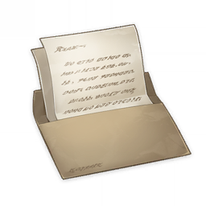
      </th>
      <th style="padding: 0; vertical-align: top;">
        

          

            负罪求赎者所遗
            

          

          

            
                <strong>获取方式：</strong> 
           	    活动任务「清夏！乐园？大秘境！」限时地图「琉形蜃境」探索获取
            
          

        

      </th>
    </tr>
    <tr>
        <th colspan="2" style="font-weight: normal;">
        <strong>描述：</strong> 
        	从「琉形蜃境」中寻找到的一张信纸，折叠整齐，折痕处泛黄，看的出来是很久以前有人遗留在蜃境之中的物件。
        </th>
    </tr>
    <tr>
        <th colspan="2" style="font-weight: normal;">
          <strong>阅读：</strong> 
          【一张折叠整齐的信纸，折痕处泛黄，纸张相当脆弱，其上写着如下内容——】 
 
…时至今日，我仍受困于那场噩梦之中，眼前的一切都仿佛回到了，回到了那片战场，火光焚照天际，如影扭曲的魔物，支离破碎的已看不出形状的躯体，哀嚎在自喉中淌出之前就落入了无声的黑暗。还有…啊，还有将我从漆黑犬兽獠牙之下救出的友人，在战场上，弓刀自他失力的手中落下，身躯逐渐沉入污秽的泥沼之中，半张着嘴的脸朝向我，朝向我… 
 
…我曾侥幸从那场战斗中生还，不，有什么好侥幸呢，是我失去了信心，放弃了手中的十文字枪，丢下了共同对抗灾厄大敌的士卒，如丧神智般逃离了战场。此番作为，愧对将军大人的信任，亦辜负先祖流传至今的声名…事到如今已没有脸面回到八酝。我逃离了战场，但我真的逃离了吗，至那之后，我每日都会梦见凄惨的战场，那些失血泛白的面孔，梦见友人隐入漆黑泥淖前如游丝般呼唤我的名字…往往，只能依靠「蜃楼玉匣」中蜃气所构虚影，才可求得片刻安宁。 
 
…真是可笑，这「蜃楼玉匣」还是作为八酝守受召远讨之前，母亲自曚云神社请来，本想减免我在战场上所受伤痛。那时我还说，「我承袭『喜多院』之名，怎会因区区伤痛使用此物。」想起此事让人汗颜无地。若是让曾为巫女的母亲看到现在这副模样… 
 
…我已经受够了在外流亡，备受折磨的日子了。今日我，今日我终于能够回到此处，啊，我在无数次噩梦中梦见，唯恐避之不及，却又是我无比期冀能返回之处。啊…我的双臂已无法像年轻时那样挥枪自如，但这一次，我一定能挽救我的友人，定能…清除污秽，这一次我一定会跟随将军大人…直到，直到最后一刻。 
 
——喜多院秀家
        </th>
    </tr>
  </thead>
</table>

### 《百人一揆～最强武斗大会篇～》样稿

<table class="table-weapon">
  <thead>
    <tr>
      <th class="th-weapon" rowspan="1">
        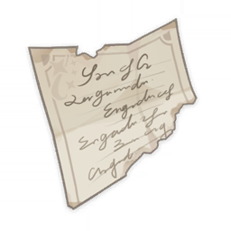
      </th>
      <th style="padding: 0; vertical-align: top;">
        

          

            《百人一揆～最强武斗大会篇～》样稿
            

          

          

            
                <strong>获取方式：</strong> 
           	    活动任务「百人一揆·最强武斗大会」获取
            
          

        

      </th>
    </tr>
    <tr>
        <th colspan="2" style="font-weight: normal;">
          <strong>阅读：</strong> 
          …… 
在这一瞬间，金发异人开始高速旋转！瞬间化解了浪人的攻击！ 
金发异人在旋转中挥舞长剑！剑刃中充满了杀伐之意！「咿啊！」 
浪人吐出一口鲜血！「咕哇——！」 
金发异人在旋转中挥舞长剑！剑刃中充满了杀伐之意！「咿啊！」 
浪人吐出一口鲜血！「咕哇——！」 
金发异人在旋转中挥舞长剑！剑刃中充满了杀伐之意！「咿啊！」 
浪人吐出一口鲜血！「咕哇——！」 
金发异人在旋转中挥舞长剑！剑刃中充满了杀伐之意！「咿啊！」 
浪人吐出一口鲜血！「咕哇——！被干掉啦——！」 
…… 
在无尽的旋转中，金发战士化为了金色旋风！金色旋风覆盖了一揆馆土俵的每寸角落。想必观众当中拥有剑豪般动态视力的人已经看出来了，这位金发异人所使用的正是在古武术中也被视为禁忌的「苟兰茄大龙卷」！ 
受到「苟兰茄大龙卷」连续攻击的浪人，喷出了有如影向山一般高的血柱！喷射的反作用力将他极速向后抛去，速度产生了能量，能量转化为物质！从物质中诞生了「妖怪大暴动·百鬼夜行」的景象！这就是自古就被封印的「禁奥义·苟兰茄大龙卷」的威力！ 
浪人狠狠撞在场馆的墙上！墙壁裂开了，场馆外… 
…… 
【后面附带了一张纸：「对战斗的描写非常生动！阅读的时候，仿佛正置身于百人一揆的会场，与茅葺老师一同观看其中的热烈战斗呢。不过，不知茅葺老师是否曾经考虑过其他之类的发展方向呢？比起创作小说，茅葺老师的风格或许更加适合话本、漫才呢。」】
        </th>
    </tr>
  </thead>
</table>

### 林藏的信

<table class="table-weapon">
  <thead>
    <tr>
      <th class="th-weapon" rowspan="1">
        
      </th>
      <th style="padding: 0; vertical-align: top;">
        

          

            林藏的信
            

          

          

            
                <strong>获取方式：</strong> 
           	    完成成就「诚实高个儿西尔弗」获取
            
          

        

      </th>
    </tr>
    <tr>
        <th colspan="2" style="font-weight: normal;">
        <strong>描述：</strong> 
        		传说中大海贼林藏留下的亲笔信，纸张皱巴巴的，或许曾被沾湿过。
        </th>
    </tr>
    <tr>
        <th colspan="2" style="font-weight: normal;">
          <strong>阅读：</strong> 
          哟吼，小子们！ 
多年未见你们的老船长，是不是把老子忘了？ 
你们这群没良心的！ 
还真是抱歉啊各位，我林藏已经决定退隐了！ 
小子们，将来是自谋出路也好，自立门派也罢，可别忘了老子要留给你们的话！ 
可能话有点多，可能喝得有点多，但你们这群小子可别敢嫌弃老子罗里吧嗦、头脑不清楚！ 
 
话儿要从哪里说起来着…对了，从一个孩子说起吧。 
哈哈，那时候，那孩子的身上还没有满布伤疤，肚肠也没被各国的烈酒灌满… 
在那个时候，大海的一切诱惑与灾祸、一切无常与定则，都与他无关。 
他所有的，只有无瑕的天真，天真是最真实的幸福…或许也是最虚假的幸福。 
 
后来呀，一个老头随着海浪漂流而来，趴在浅滩上一动不动。 
老头苍白的身上缠着海草，头上缠着蕾丝般的裙带菜，就像古老的尸体，或者一个国王… 
 
「海的深处…海的远处…」他这样说。 
然后…就再也没说过话。 
看着夕光照在他湿漉漉的脸上，我确定，他应该是一个异国的国王。 
 
海的深处有什么呢？海的远处许诺了什么？谁知道呢，或许都是垃圾吧。 
那时候，大人们总是说，不要在盛夏时分盯着海面太久，否则你会晕眩，在晕眩中暂时死去。 
但这点说辞可阻挡不了一个头脑简单的孩子… 
 
于是，孩子自己扎了一个木筏，兀自出海去了。 
海的深处，海的远处，并不像沙滩上看起来那样平静，永恒不变… 
小小的木筏被嗔怒的风浪打碎，小小的少年被浪头投来掷去时，他寻到了自己倾恋的对象… 
 
他成了一个海贼。 
再后来的事情，你们也听我吹嘘得够多了…就不在这里提起了。 
总之…总之啊，直到今天，也许明天的明天…让我最耿耿于怀的是… 
超越赤穗百目鬼，建立自由海贼之国的梦想，至今遥遥无期，而且就要被我丢弃了！ 
可叹，可叹呀…不过，嘿吆，也没什么可叹的！ 
反正…经历了太多风暴，挑战了太多的敌手或海兽。与小子们一次又一次逃过官府或同行的追杀之后… 
他得到了此前追求的一切，也失去了许多许多。 
当他终于航行到大海的边缘，一切航路的尽头时，他才发现自己已经不再年少。 
于是，他决定返航，回到一切开始的地方，回到海祇岛的那个山洞。 
多年积存的财物，人工削凿的宝石也好、出自神体的摩拉也罢…小子们，你们的船长为你们存放在山洞里了。 
 
唯独属于他的，真正的宝藏，那孩子也一并放在那里了。 
小子们，若是自觉有本事，就尽管去找吧！ 
或许我最珍贵的宝藏与你们的心之所向大不相同，或许你们会大失所望… 
但老子不在乎。 
老子一点，一点点也不在乎！ 
 
因为那是独属于我的宝藏呀，哈哈哈哈哈！
        </th>
    </tr>
  </thead>
</table>

### 某人留下的纸条

<table class="table-weapon">
  <thead>
    <tr>
      <th class="th-weapon" rowspan="1">
        
      </th>
      <th style="padding: 0; vertical-align: top;">
        

          

            某人留下的纸条
            

          

          

            
                <strong>获取方式：</strong> 
           	    世界任务「特别的御神签」获取
            
          

        

      </th>
    </tr>
    <tr>
        <th colspan="2" style="font-weight: normal;">
        <strong>描述：</strong> 
        		某人留下的特殊的「御神签」。其中记载着某个地点。或许与玄冬林檎小姐的消失有关。
        </th>
    </tr>
    <tr>
        <th colspan="2" style="font-weight: normal;">
          <strong>阅读：</strong> 
          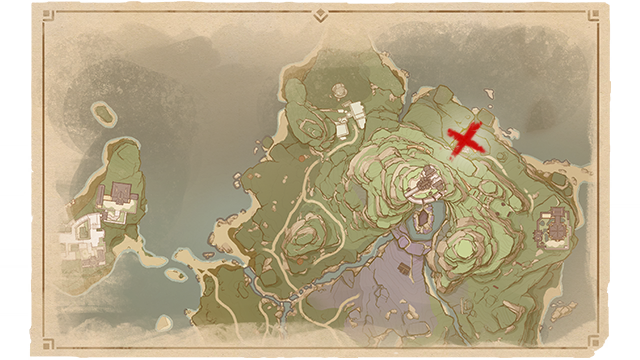
          「贼子的末路」 
请前往画中地点，调查异像。 
 
对罪徒与敌人降下「终末」。
        </th>
    </tr>
  </thead>
</table>

### 荒泷盛世豪鼓大祭典！

<table class="table-weapon">
  <thead>
    <tr>
      <th class="th-weapon" rowspan="1">
        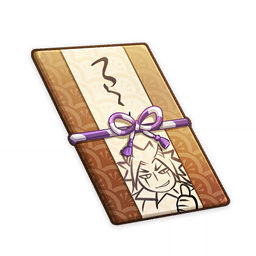
      </th>
      <th style="padding: 0; vertical-align: top;">
        

          

            荒泷盛世豪鼓大祭典！
            

          

          

            
                <strong>获取方式：</strong> 
           	    活动任务「荒泷极上盛世豪鼓大祭典」获取
            
          

        

      </th>
    </tr>
    <tr>
        <th colspan="2" style="font-weight: normal;">
        <strong>描述：</strong> 
        		从款式到内容都很浮夸的邀请函，函中描绘了一场规模庞大、意义深远、堪称举国盛会般的大型活动，而你将作为尊贵的客人，成为盛会中最灿烂醒目的那颗明星。
        </th>
    </tr>
    <tr>
        <th colspan="2" style="font-weight: normal;">
          <strong>阅读：</strong> 
          哈哈哈哈哈哈哈！我的挚友！层岩一别，可曾偶尔想起本大爷啊？ 
要知道本大爷可是时常把你放在心上的！你看，这回的好事，我第一个就想起了你！ 
为了庆祝阿忍顺利毕业，顺便宣传我荒泷派的威风，本大爷计划在离岛包一块豪华的场子，办一场盛大的祭典！ 
名字就叫做：荒泷极上盛世豪鼓大祭典！！怎么样？是不是百分震撼？ 
我敢担保，这次祭典的规模不输容彩祭，意义更胜海灯节，这次祭典过后，我荒泷派的荣光将洒满稻妻！ 
如此盛会，作为挚友，本大爷希望你务必到场！ 
我们可以一起作乐！高歌！斗虫！烤堇瓜！ 
期待吧？我的挚友！我在离岛等你，速来与我相聚！ 
哈哈哈哈哈哈哈—— 
啊…等一下阿忍，想想烤堇瓜还是不用写了，感觉不够气派... 
嗯？我不是说了不用写吗！ 
喂喂喂这句也删掉啊！！
        </th>
    </tr>
  </thead>
</table>

### 一份字迹优美的笔记

<table class="table-weapon">
  <thead>
    <tr>
      <th class="th-weapon" rowspan="1">
        
      </th>
      <th style="padding: 0; vertical-align: top;">
        

          

            一份字迹优美的笔记
            

          

          

            
                <strong>获取方式：</strong> 
           	    活动任务「远海诗夏游纪」获取
            
          

        

      </th>
    </tr>
    <tr>
        <th colspan="2" style="font-weight: normal;">
        <strong>描述：</strong> 
        			一份字迹优美的笔记。
        </th>
    </tr>
    <tr>
        <th colspan="2" style="font-weight: normal;">
          <strong>阅读：</strong> 
          今日翻找旧书，意外翻到了父亲从前的笔记。 
知道他老人家不会介意，我便看了内容。果然，其中记录的大多是锻造技巧，以及一些处理矿石的妙法。 
末尾还有一些手绘的草稿，大都是盆景设计。不得不说，这喜欢盆景的习俗，倒也是世代流传啊。 
我的儿子今年也已六岁了。「万叶」这个名字，是依照妻子愿望所取。 
…… 
孩子的到来与她的离开并未相隔很久。居然就已经六年了啊…她若还在，或许会帮着父亲打理院子。 
父亲年幼时过得优渥，如今年迈，生活却大不如从前。不能为他改善这些，我深感愧疚。 
但父亲说，他不要紧，重要的是我们这些年轻些的人。
        </th>
    </tr>
  </thead>
</table>

### 一封信

<table class="table-weapon">
  <thead>
    <tr>
      <th class="th-weapon" rowspan="1">
        
      </th>
      <th style="padding: 0; vertical-align: top;">
        

          

            一封信
            

          

          

            
                <strong>获取方式：</strong> 
           	    活动任务「远海诗夏游纪」获取
            
          

        

      </th>
    </tr>
    <tr>
        <th colspan="2" style="font-weight: normal;">
        <strong>描述：</strong> 
        			一封信。
        </th>
    </tr>
    <tr>
        <th colspan="2" style="font-weight: normal;">
          <strong>阅读：</strong> 
          父亲 枫原景春 亲启： 
 
自从枫原家正式解散，我收拾行李离开老家，四处游历，倒也是长了不少见识。 
今日走过靠海的山，想起您曾画在笔记中的各种山水图，十分感慨。 
游山玩水并非我枫原家的传统，观花赏云却算得上。这种习俗，似乎就是曾祖父带起的。 
您说他最喜欢种小树，喜欢遒劲的树枝。而爷爷就不一样了，更喜欢摆弄石头。 
小时候，后院里摆满了爷爷搜集来的珍奇石头。那时以为满地都是宝贝，如今见得多了，我能肯定，有些是爷爷从锻刀作坊拿回来的试刀石罢了。 
但那时我对这些了解甚少，总以为每一件都是宝贝。 
可生活中，又怎么会有那么多珍宝呢？ 
…我在山头找了一处阴凉地，边休息边写这封信。 
稍后，我想点燃这封信，再用山间的溪水浇灭它的余烬。如此一来，也算是将消息传递给了无法收信的您。 
您不在后，我遣散了家仆，把能打点的家当都处理过。钱财不多，姑且还能过活。 
就是我们家的盆景，下场不够理想。拿得出手的那些都用来抵债了，除了曾祖父留下的那只老盆。 
虽说被天领奉行搜走了，但…放在那里的仓库，或许也比放在我手中好吧。 
 
许久没来这里。山间的风，仍像多年前您第一次带我来时那么好。 
我又要启程了。 
再会。 
 
枫原万叶
        </th>
    </tr>
  </thead>
</table>

### 《有关稻妻踏鞴砂地区可能存在的重大历史事件简析》

<table class="table-weapon">
  <thead>
    <tr>
      <th class="th-weapon" rowspan="1">
        
      </th>
      <th style="padding: 0; vertical-align: top;">
        

          

            《有关稻妻踏鞴砂地区可能存在的重大历史事件简析》
            

          

          

            
                <strong>获取方式：</strong> 
           	    魔神任务间章 第三幕「倾落伽蓝」获取
            
          

        

      </th>
    </tr>
    <tr>
        <th colspan="2" style="font-weight: normal;">
          <strong>阅读：</strong> 
          <strong>开启魔神任务间章「倾落伽蓝」</strong> 
          说明：本论文为因论派赞助项目《拂开面纱》之下属作品，编号待补 
 
作者：亚卡巴 
 
摘要：稻妻踏鞴砂地区历来被认为是稻妻本地冶炼锻造业的重要构成地之一。此地曾发生过两次事故，其中第一次的记载普遍较为模糊。笔者认为，踏鞴砂地区的第一次事故背后可能还藏有不为人知的历史因素。本论文将围绕已知资料就该事件展开分析。 
 
 
关键词：踏鞴砂地区 雷电五传 御舆长正 倾奇者 
 
引言：本论文展开并继承自笔者恩师鲁米先生的研究报告《踏鞴砂地区疑似被掩藏的人文故事》，旨在继续推进该项研究。资料表明，稻妻的锻刀技术最初传自雷神——雷电将军，工匠们继承神的技艺，投入到冶炼锻造行业中去。但作为冶炼业核心的踏鞴砂地区却有着与钢铁雄浑的锻造行业极为不符的古怪传闻。御舆家、丹羽家，乃至古怪的人偶——三者构建出切入口，允许我们从中窥探踏鞴砂背后的真相。 
 
 
正文 
 
踏鞴砂地区的古怪纸条，记载内容如下—— 
 
1 
「……小人斗胆僭越，认为长正大人铸刀对他的心境颇有好处……」 
「……对洗清『御舆』污名之执着，实在是损心耗力……」 
「……另，桂木大人于名椎滩巡视时，发现无名倾奇者……」 
 
2 
「……目付大人购买玉钢锭若干……」 
「……与造兵司佑大人，桂木大人彻夜讨论锻冶心得。」 
 
 
3 
「……终于造出长卷一柄，名之曰『大踏鞴长正』……」 
「……目付大人兴致相当高昂，与造兵司佑大人……」 
「……阿望为『大踏鞴长正』之美所服，为之绘制图画……」 
「……同浮浪倾奇者剑舞……」 
 
 
4 
「……而倾奇者也不知所踪……」 
「……目付大人震怒，斩桂木。入胴之深，此物是为大业物……并将亲造之长卷弃于踏鞴炉中……」 
「……阿望实在不平、不忍，将全然熔毁的刀取出……严重烧伤……」 
 
 
5 
「……阿望于当夜殁……小人斗胆以为，桂木大人确有渎职，但所作所为均出自善心……」 
 
6 
「……金次郎将长卷与阿望的图画藏于兵库中……」 
「……长正虽严苛，却清明无比。虽清明，却同等于不近人情，于氏名清白之爱执……然而之于我与踏鞴砂众杂户均不为其母千代之事所蔽，信赖长正……」 
「……而我也不愿忘记与他一同造出『大踏鞴长正』之乐，与那夜无名倾奇者与桂木一同舞剑的快乐……」 
 
7 
「……撤离时，原本应当将兵库钥匙分为三片，一片交予目付大人、一片交予造兵司正大人、一片留在踏鞴砂中，以防贼人侵入。」 
「然而实在太过匆忙，无法找到目付大人与造兵司正大人，小人斗胆将三片钥匙藏在踏鞴砂内三处宝箱中……」 
 
 
以上七条信息散落在踏鞴砂地区各处。其中，前六条被记录在耐久性较好的纸张上，看起来都已非常古旧，只有最后一张记录纸质地略新一些。笔者认为，前六张纸与后一张纸出自不同时期，相隔年份有待考证。而前六张所记录的内容又互相关联，所指向的事件应当是一致的。 
鲁米曾在《踏鞴砂地区疑似被掩藏的人文故事》（后文简称《人文故事》）中提到，须弥有学者曾前往稻妻调查研究踏鞴砂一带的人文历史。虽然在鲁米撰写《人文故事》的时代，踏鞴砂已经在一系列变故后处于衰落状态，但相比笔者撰文时仍好得多。踏鞴砂最中心的区域，如今极不宜居，也确实无人居住。居民迁至海边，傍水而生。那些须弥学者从他们口中了解到踏鞴砂曾很繁荣——数百年前，一个仍可被称作黄金时期的年份，踏鞴砂受造兵司正丹羽、造兵司佑宫崎及目付御舆长正管理。同时，较为年长、家族更有历史传承的那些人反复强调，踏鞴砂曾有过怪异的传闻。 
异闻大都围绕「妖怪」，极富稻妻特色，除了极小一部分，提及了「人偶」一词。需知，人偶并不是传统常见的稻妻妖怪，学者们深感古怪，借着这一话题继续追问下去，进而得到了如下信息： 
-踏鞴砂曾经出现过一个人偶，它面貌秀丽，打扮得体，懂得掩藏身体上那些特殊的关节痕迹。若非偶尔有人提起，旁人很难看出它是人偶。另外，人偶特有的关节痕迹似乎还会随着时间推移慢慢减淡，最终或许会消失不见，变成完全的人类模样。 
-人偶的名字并无几人知道。只是听说有这样一个人偶曾出没于踏鞴砂地带，有人在核心地区见过它，也有人在海滩上见过它。传说它会伫立在海边遥望一海之隔的稻妻城，那里有什么，它又在看什么，实在无从知晓。 
 
前文提到，六张纸条所记录的故事中有个「无名倾奇者」。倾奇者一词，在稻妻本地多用于指代穿着或行事作风古怪奇特的人。由此可知，人们理应对如此的人物印象深刻。笔者认为，假如踏鞴砂真有一名人偶却未引起什么恐慌，考虑到妖怪与人类共生这一稻妻社会形态，人偶在当时很可能成为了踏鞴砂本地的居民之一。至于记录更少，鲜为人知的倾奇者，或许正是人偶的另一名称。当一个人衣着华美奇特时，人们就不会过分注意它其余的特征。此推想还需有力证据支持，但可作为一种分析思路保留下来。 
 
笔者根据稻妻相关史料整理了可能与踏鞴砂有关的一些人物。从管理者开始，记录如下—— 
 
造兵司正——丹羽 
全名丹羽久秀，为一心传丹羽家继承者，其家族与赤目、枫原并称为一心三作。据记载，丹羽为人谦和，头脑聪慧，是管理一方土地民生的优秀人才。后来去向不明，应是携家人离开了事故后的踏鞴砂。 
 
造兵司佑——宫崎 
全名宫崎兼雄，丹羽的副手，出身不详，主要在锻造及人员管理方面辅助丹羽进行管理，个性温良友善，在当地有着不少朋友，与御舆长正交情亦佳。 
 
目付——御舆长正 
御舆家继承人，鬼族武者御舆千代的养子，「胤之岩藏」御舆道启的养弟。其母千代失踪后，被养兄道启抛弃，独自一人背负起整个家族的责任，日夜奋斗只为洗清家族污名。多种资料表明，御舆长正虽有些顽固，却是刚正不阿，品行端正之人。从纸片记录可知，他为修身养性而学习锻刀，特意请教宫崎。名刀大踏鞴长正铸成后，他却因某事挥刀杀死下属桂木。 
 
下属——桂木 
全名不详，出身不详。笔者翻阅多方资料，仍无法查到更多有关桂木个人的信息。他是御舆长正手下，一名忠心耿耿的武人，早年为御舆长正所救，宣誓愿为其赴汤蹈火，大可替死，小可随侍。 
 
倾奇者 
全名不详，出身不详，笔者翻阅多方资料，结合鲁米的观点，推定此人物便是传闻中的怪异人偶。传说倾奇者相貌极为秀美，个性温良。而根据《人文故事》，他是被桂木带回踏鞴砂，成为了当地居民的一员。倾奇者初到踏鞴砂，不会洗衣做饭，亦不会做任何细致工作，当地的人们手把手教导他，慢慢才令他学会洗衣、舞蹈、小物件锻造等事。根据纸片记录，『大踏鞴长正』铸成时倾奇者亦在场，而御舆长正斩杀桂木之前，倾奇者的线索已经断了。笔者认为，倾奇者——也就是人偶，很可能与桂木之死有关。 
 
 
（剩下的部分似乎还没写完…不过已经能确定，这是一份花了不少心思的论文。） 

        <strong>已完成魔神任务间章「倾落伽蓝」</strong> 
        说明：本论文为因论派赞助项目《拂开面纱》之下属作品，编号待补 
 
作者：亚卡巴 
 
摘要：稻妻踏鞴砂地区历来被认为是稻妻本地冶炼锻造业的重要构成地之一。此地曾发生过两次事故，其中第一次的记载普遍较为模糊。笔者认为，踏鞴砂地区的第一次事故背后可能还藏有不为人知的历史因素。本论文将围绕已知资料就该事件展开分析。 
 
 
关键词：踏鞴砂地区 雷电五传 御舆长正 
 
引言：本论文展开并继承自笔者恩师鲁米先生的研究报告《踏鞴砂地区疑似被掩藏的人文故事》，旨在继续推进该项研究。资料表明，稻妻的锻刀技术最初传自雷神——雷电将军，工匠们继承神的技艺，投入到冶炼锻造行业中去。但作为冶炼业核心的踏鞴砂地区却有着与钢铁雄浑的锻造行业极为不符的古怪传闻。御舆家、丹羽家，乃至古怪的外来机械师——三者构建出切入口，允许我们从中窥探踏鞴砂背后的真相。 
 
 
正文 
 
踏鞴砂地区的古怪纸条，记载内容如下—— 
 
1 
「……小人斗胆僭越，认为长正大人铸刀对他的心境颇有好处……」 
「……对洗清『御舆』污名之执着，实在是损心耗力……」 
 
2 
「……目付大人购买玉钢锭若干……」 
「……与造兵司佑大人，桂木大人彻夜讨论锻冶心得。」 
 
 
3 
「……终于造出长卷一柄，名之曰『大踏鞴长正』……」 
「……目付大人兴致相当高昂，与造兵司佑大人……」 
「……阿望为『大踏鞴长正』之美所服，为之绘制图画……」 
 
 
4 
「……目付大人震怒，斩桂木。入胴之深，此物是为大业物……并将亲造之长卷弃于踏鞴炉中……」 
「……阿望实在不平、不忍，将全然熔毁的刀取出……严重烧伤……」 
 
 
5 
「……阿望于当夜殁……小人斗胆以为，桂木大人确有渎职，但所作所为均出自善心……」 
 
6 
「……金次郎将长卷与阿望的图画藏于兵库中……」 
「……长正虽严苛，却清明无比。虽清明，却同等于不近人情，于氏名清白之爱执……然而之于我与踏鞴砂众杂户均不为其母千代之事所蔽，信赖长正……」 
「……而我也不愿忘记与他一同造出『大踏鞴长正』之乐……」 
 
7 
「……撤离时，原本应当将兵库钥匙分为三片，一片交予目付大人、一片交予造兵司正大人、一片留在踏鞴砂中，以防贼人侵入。」 
「然而实在太过匆忙，无法找到目付大人与造兵司正大人，小人斗胆将三片钥匙藏在踏鞴砂内三处宝箱中……」 
 
 
以上七条信息散落在踏鞴砂地区各处。其中，前六条被记录在耐久性较好的纸张上，看起来都已非常古旧，只有最后一张记录纸质地略新一些。笔者认为，前六张纸与后一张纸出自不同时期，相隔年份有待考证。而前六张所记录的内容又互相关联，所指向的事件应当是一致的。 
鲁米曾在《踏鞴砂地区疑似被掩藏的人文故事》（后文简称《人文故事》）中提到，须弥有学者曾前往稻妻调查研究踏鞴砂一带的人文历史。虽然在鲁米撰写《人文故事》的时代，踏鞴砂已经在一系列变故后处于衰落状态，但相比笔者撰文时仍好得多。踏鞴砂最中心的区域，如今极不宜居，也确实无人居住。居民迁至海边，傍水而生。那些须弥学者从他们口中了解到踏鞴砂曾很繁荣——数百年前，一个仍可被称作黄金时期的年份，踏鞴砂受造兵司正丹羽、造兵司佑宫崎及目付御舆长正管理。同时，较为年长、家族更有历史传承的那些人反复强调，踏鞴砂曾有过怪异的传闻。 
异闻大都围绕「妖怪」，极富稻妻特色，除了极小一部分，提及了「外来者」一词。需知，在一片民间传说中出现一个疑似真实人物的角色，实在令人生疑。借着这一话题继续追问下去，进而得到了如下信息： 
-曾有一名外国机械师到踏鞴砂访问。据说他是为交流技术而来，也确实与当地人结为好友。可此人形迹可疑，时常在核心区域或不开放的地区附近徘徊。人们若上前劝阻他，便会听到他口中喃喃说着一些旁人听不懂的话。 
-机械师总是眺望着大炉沉思，应该是在观察炉子的状况。他也常常观察当地居民，目光令人有些不适。 
 
根据年代推算，踏鞴砂出现技术交流是相当合理的情况。踏鞴砂沿海，乘船即可到达，外来人士在当地受到欢迎，也并不是一件奇怪的事。然而在技术交流发生后没多久，该地区就迎来了衰落，二者有关系的可能性极大。但也有居民认为这些只是当时人的臆想。 
 
笔者根据稻妻相关史料整理了可能与踏鞴砂有关的一些人物。从管理者开始，记录如下—— 
 
造兵司正——丹羽 
全名丹羽久秀，为一心传丹羽家继承者，其家族与赤目、枫原并称为一心三作。据记载，丹羽为人谦和，头脑聪慧，是管理一方土地民生的优秀人才。后来去向不明，应是携家人离开了事故后的踏鞴砂。 
 
造兵司佑——宫崎 
全名宫崎兼雄，丹羽的副手，出身不详，主要在锻造及人员管理方面辅助丹羽进行管理，个性温良友善，在当地有着不少朋友，与御舆长正交情亦佳。 
 
目付——御舆长正 
御舆家继承人，鬼族武者御舆千代的养子，「胤之岩藏」御舆道启的养弟。其母千代失踪后，被养兄道启抛弃，独自一人背负起整个家族的责任，日夜奋斗只为洗清家族污名。多种资料表明，御舆长正虽有些顽固，却是刚正不阿，品行端正之人。从纸片记录可知，他为修身养性而学习锻刀，特意请教宫崎。名刀大踏鞴长正铸成后，他却因某事挥刀杀死下属桂木。 
 
下属——桂木 
全名不详，出身不详。笔者翻阅多方资料，仍无法查到更多有关桂木个人的信息。他是御舆长正手下，一名忠心耿耿的武人，早年为御舆长正所救，宣誓愿为其赴汤蹈火，大可替死，小可随侍。 
 
机械师 
笔者多方考证，仍无从得知此人的来历。但在踏鞴砂发生变故后，有关他的传闻开始减少。笔者推测此人并非是当地居民臆想出来的陌生人，而是真实存在的来访者，或与踏鞴砂当年的事有关。 
 
 
（剩下的部分似乎还没写完…不过已经能确定，这是一份花了不少心思的论文。）
        </th>
    </tr>
  </thead>
</table>

### 《黯云之岛》

<table class="table-weapon">
  <thead>
    <tr>
      <th class="th-weapon" rowspan="1">
        
      </th>
      <th style="padding: 0; vertical-align: top;">
        

          

            《黯云之岛》
            

          

          

            
                <strong>获取方式：</strong> 
           	    魔神任务间章 第三幕「倾落伽蓝」获取
            
          

        

      </th>
    </tr>
    <tr>
        <th colspan="2" style="font-weight: normal;">
          <strong>阅读：</strong> 
          <strong>开启魔神任务间章「倾落伽蓝」</strong> 
          作者：泽田 
 
 
节选一 
 
…… 
…… 
话说这日午后三时左右，一人抵达踏鞴砂，远远已瞧见劳作的人员沿着山路往工厂处走去，鞋底摩擦着巍巍山石，发出细微又撼动人心的响声来，仿佛他们只要越过这里抵达了山中的大炉，就能从熊熊烈火里抱出价值连城的宝钻。这份情怀，不在那时的人自然无法理解。 
那人兴高采烈地招呼了一声，奔跑着，飞快地融入了行进队伍。一名高旁人大半个脑袋的彪形大汉重重拍了一下他的背，嘴上却恭敬地说：「瞧是谁来了？宫崎大人！自稻妻城往返一趟，可不容易啊。」 
宫崎咧开嘴，笑得像一个初出茅庐的年轻人，神态也很放松。「桂木先生这话说的，稻妻城是将军大人的地盘，我从那里回来，坐最快的船，走最快的水路，难道还能遇上什么危险不成？」 
「好消息呢？」 
「自然是有的。」二人说罢，不约而同大笑起来，一边与其他围上来的工人推搡着走向道路尽头。 
 
一个身穿朴素麻布衣衫，绑着头巾的年轻男人正在炉前看火。 
炼钢的火不比其他，火之大小，关系到钢材与刀剑成色。看火的人亦不寻常，指尖立着一只蜥蜴，面带笑意。 
空间很大，大炉尚在更深处，按说应有更多人陪伴劳作，他却孑然一身站在这里。直到那桂木与宫崎快步走入，他才转过脸来。 
此人正是造兵司正丹羽久秀，踏鞴砂的管理人。他出身一心传三家之一的丹羽家，是从未与兄弟姐妹竞争过，正当而又当之无愧的继承人。能被各路贵人大人赏识得此官衔，就是一种证明。 
宫崎将一份精心包装在锦缎里的文书交到丹羽手中，端正了神色道：「如大人所说，城里您那户老亲戚可不怎么看好我们的计划。但赤目的方案值得一试，所以我找到供应商，依照采购清单置办了您要的东西。」 
丹羽看罢文书，点了点头：「枫原支持与否，我们都应尝试新的锻造手法。」 
桂木则眉头一皱，叹道：「锻刀本就是讲究技巧的难事，大人们已经很懂行了，居然还想着日益精进，实在是可怕呀！要是被长正大人听到，恐怕又要露出为难的表情。」 
丹羽微笑道：「桂木先生，您家长正大人的宝刀锻得如何了？」 
桂木既不愿扫了主人面子，又不愿撒谎骗过眼前二位朋友，左思右想竟也斟酌不出一个合适的说法，悻悻地说：「丹羽大人手巧，巧到了耳朵里吧？难怪听不得我们粗人的玩笑话。」 
宫崎当即捂嘴偷笑。丹羽听完，将手中蜥蜴放到桂木手心，正要再说几句，远处又有人走来，这一回脚步声轻盈，听着便是个少年人。探进来那颗脑袋圆圆滚滚，被火光一照，活像油光水滑的甚么宝珠。 
少年人将食盒放在一旁，点点头便要走。桂木忙叫住他：「你自己那份呢？不吃吗？」 
那人听了这话，有些不知所措，片刻才回答：「…好的，我会试试。」 
「一样的饭菜，你也不要客气。」丹羽说道。那人又一点头，若有所思地离开了。 
 
 
节选二 
 
…… 
…… 
倾奇者身处海岸边。 
日落时分，天空中没有丝毫亮色，反倒雷云翻滚，昭示着暴雨将至。 
海面随之昏暗下去，薄暮压低云层逼迫它向大地跪拜下来，一如倾奇者此刻面朝海那边跪拜的姿态。 
没有人路过，也就没有人知道他此刻静静等待着什么。 
不知过去多久，空中忽然飞下一团乌色的云，盘旋着将倾奇者围绕起来，噩梦似的缠住了他。他起先毫无察觉，睁开眼看了好一会儿才明白过来：这云从一开始就是冲他来的。 
远处渔船驶近了，船头灯火在逐渐降下的风雨中摇曳。一层薄雾却在此时蔓延开，船上渔夫看不清路，连连惊呼：「才黄昏，怎么就看不见了？有没有人领个航呀！」 
那乌云又窜入到船底，跟着船便失去了方向，猛兽一般狠狠扎进海岸线。距离几步的地方，倾奇者垂手立着，歪过脑袋看向眼前巨大的船骸。 
先前喊话那人只留了半只胳膊，「啪嗒」一声落在倾奇者脚边。他蹲下将那物什看了又看，恨不得放到嘴里咬一口。 
不过最终他也没那样做。因为乌云已经盘旋下去，将整条船上残余的东西吞吃精光。倾奇者呆呆地望着它，很久很久，才如梦初醒。当他回过神，乌云已经散入各处，全然没了踪迹。至于眼前那艘船…或许是海上雷暴导致的？谁知道呢。倾奇者并未看清。 
 
 
节选三 
 
…… 
…… 
桂木匆忙冲入门中，厉声喝道：「大人！大炉出了状况，我遍寻不见丹羽大人的踪影，还有宫崎大人，他外出求援已久，至今未有归信。您看…」 
御舆长正徐徐回过身，面色肃穆如同参加着葬礼一般，所说的话字字沉重：「并非是吾要说这样的话，可桂木，宫崎大人他…或许不会回来了。」 
桂木那视线透过长正宽厚又僵硬的肩膀投向窗外——海上乌云翻涌，昏黑骇人。黑洞洞的夜成了唯一天气，恨不能化形为妖怪亲自将整座踏鞴砂吞入腹中。 
已经死了十数人。所以，所以… 
桂木像是被人打了一拳，逐渐回忆起来：所以他们才要外出求援！ 
宫崎是第一个出航的。他走时，这样的云层刚刚成型。从踏鞴砂到稻妻城求援，按常理算来并非什么难事，宫崎却迟迟未归。 
第二、第三、第四…直到上一个出航的倾奇者。他在这样的天气驾船离开，凶吉未知。桂木捡他回来，待他如待自家孩童，自是万分不舍，可如今踏鞴砂情况紧迫，哪怕再牺牲几人，他们也想求得主城送来的庇护。 
 
丹羽消失不见，无人知道他去了哪里。稍后长正又领着一队人马冒险踏入山中，以炉心为起点四下搜寻，始终没有收获。人人都觉得丹羽或许遭遇了什么意外，可转念一想，又怕他是担负不起此地的古怪事故，畏罪潜逃。 
众人心中猜忌，长正更是强忍着不满与愤怒，看他面色，已是堪比远处的乌云了。 
忽然一道人影闪过。长正不疑有他，迅速拔出腰间长刀，刀尖一挑只削下丝丝薄纱。人影晃了一晃，牵线木偶似的来到长正背后，阴阴地笑道：「大人是在找什么？丹羽吗？」 
长正怒道：「怎可直呼丹羽大人！」一刀劈下，人影散入薄雾，眨眼又聚集在远处，化作一条妖异的鬼影。 
「是你杀了我的人？」长正怒喝着扑上，却被桂木死死拉住，定睛一看，原来只一步就要落入炉中。 
 
 
（剩下的部分似乎还没写完…不过已经能看出，这是一篇以刚才论文中所述信息为蓝本，发散想象后写成的、带有奇幻色彩的小说。） 

        <strong>已完成魔神任务间章「倾落伽蓝」</strong> 
        作者：泽田 
 
 
节选一 
 
…… 
…… 
话说这日午后三时左右，一人抵达踏鞴砂，远远已瞧见劳作的人员沿山路往工厂处走去，鞋底摩擦着巍巍山石，发出细微又撼动人心的响声来，仿佛他们只要越过这里抵达了山中的大炉，就能从熊熊烈火里抱出价值连城的宝钻。这份情怀，不在那时的人自然无法理解。 
那人兴高采烈地招呼了一声，奔跑着，飞快地融入了行进队伍。一名高旁人大半个脑袋的彪形大汉重重拍打他的背，嘴上却恭敬地说：「瞧是谁来了？宫崎大人！自稻妻城往返一趟，可不容易啊。」 
宫崎咧开嘴，笑得像一个初出茅庐的年轻人，神态也很放松。「桂木先生这话说的，稻妻城是将军大人的地盘，我从那里回来，坐最快的船，走最快的水路，难道还能遇上什么危险不成？」 
「好消息呢？」 
「自然是有的。」二人说罢，不约而同大笑起来，一边与其他围上来的工人推搡着走向道路尽头。 
 
一个身穿朴素麻布衣衫，绑着头巾的年轻男人正在炉前看火。 
炼钢的火不比其他，火之大小，关系到钢材与刀剑成色。看火的人亦不寻常，指尖立着一只蜥蜴，面带笑意。 
空间很大，大炉尚在更深处，按说应有更多人陪伴劳作，他却孑然一身站在这里。直到那桂木与宫崎快步走入，他才转过脸来。 
此人正是造兵司正丹羽久秀，踏鞴砂的管理人。他出身一心传三家之一的丹羽家，是从未与兄弟姐妹竞争过，正当而又当之无愧的继承人。能被各路贵人大人赏识得此官衔，就是一种证明。 
宫崎将一份精心包装在锦缎里的文书交到丹羽手中，端正了神色道：「如大人所说，城里您那户老亲戚可不怎么看好我们的计划。但赤目的方案值得一试，所以我找到供应商，依照采购清单置办了您要的东西。」 
丹羽看罢文书，点了点头：「枫原支持与否，我们都应尝试新的锻造手法。」 
桂木则眉头一皱，叹道：「锻刀本就是讲究技巧的难事，大人们已经很懂行了，居然还想着日益精进，实在是可怕呀！要是被长正大人听到，恐怕又要露出为难的表情。」 
丹羽微笑道：「桂木先生，您家长正大人的宝刀锻得如何了？」 
桂木既不愿扫了主人面子，又不愿撒谎骗过眼前二位朋友，左思右想竟也斟酌不出一个合适的说法，悻悻地说：「丹羽大人手巧，巧到了耳朵里吧？难怪听不得我们粗人的玩笑话。」 
宫崎当即捂嘴偷笑。丹羽听完，将手中蜥蜴放到桂木手心，正要再说几句，远处又有人走来，这一回脚步声有些沉重，来者应是踏着沉稳而自信的步伐。须臾，一张与众不同的异国面孔出现在门边。来人把手里食盒放在一旁，点点头便要走。桂木忙叫住他：「先生，你自己那份呢？不吃吗？」 
那人听了这话，笑道：「我已吃过了。几位大人也快些用餐吧。」 
「先生是我们的客人，还特意帮着做这些杂事，实在叫我不好意思。」丹羽诚恳地说。 
那人友好地笑笑，似乎并不在意为人做些小事。又点了点头，离开了。 
 
 
节选二 
 
…… 
…… 
陌生的客人——异国来的机械师正身处海岸边。 
日落时分，天空中没有丝毫亮色，反倒雷云翻滚，昭示着暴雨将至。 
海面随之昏暗下去，薄暮压低云层逼迫它向大地跪拜下来。此人却全然未被镇住，而是面朝远方，露出了嗜血的眼神。 
没有人路过，也就没有人知道他此刻静静盘算着什么。 
不知过去多久，空中忽然飞下一团乌色的云，盘旋着将机械师围绕起来，噩梦似的缠住了他。他抚摸着漆黑的烟雾，如同抚摸自己的一部分。 
远处渔船驶近了，船头灯火在逐渐降下的风雨中摇曳。一层薄雾却在此时蔓延开，船上渔夫看不清路，连连惊呼：「才黄昏，怎么就看不见了？有没有人领个航呀！」 
那乌云又窜入到船底，跟着船便失去了方向，猛兽一般狠狠扎进海岸线。距离几步的地方，机械师微笑起来，慢慢走向眼前巨大的船骸。 
先前喊话那人只留了半只胳膊，「啪嗒」一声落在机械师脚边。他蹲下将那物什看了又看，恨不得放到嘴里咬一口。 
不过最终他也没那样做。因为乌云已经盘旋下去，将整条船上残余的东西吞吃精光。 
 
 
节选三 
 
…… 
…… 
桂木匆忙冲入门中，厉声喝道：「大人！大炉出了状况，我遍寻不见丹羽大人的踪影，还有宫崎大人，他外出求援已久，至今未有归信。您看…」 
御舆长正徐徐回过身，面色肃穆如同参加着葬礼一般，所说的话字字沉重：「并非是吾要说这样的话，可桂木，宫崎大人他…或许不会回来了。」 
桂木那视线透过长正宽厚又僵硬的肩膀投向窗外——海上乌云翻涌，昏黑骇人。黑洞洞的夜成了唯一天气，恨不能化形为妖怪亲自将整座踏鞴砂吞入腹中。 
已经死了十数人。所以，所以… 
桂木像是被人打了一拳，逐渐回忆起来：所以他们才要外出求援！ 
宫崎是第一个出航的。他走时，这样的云层刚刚成型。从踏鞴砂到稻妻城求援，按常理算来并非什么难事，宫崎却迟迟未归。 
第二、第三、第四…每一位求援者都在这样的天气驾船离开，凶吉未知。按理说，他们不应再让任何人涉险，可如今踏鞴砂情况紧迫，哪怕再牺牲几人，也必须求得主城送来的庇护。 
 
丹羽消失不见，无人知道他去了哪里。稍后长正又领着一队人马冒险踏入山中，以大炉为起点四下搜寻，始终没有收获。人人都觉得丹羽或许遭遇了什么意外，可转念一想，又怕他是担负不起此地的古怪事故，畏罪潜逃。 
众人心中猜忌，长正更是强忍着不满与愤怒，看他面色，已是堪比远处的乌云了。 
忽然一道人影闪过。长正不疑有他，迅速拔出腰间长刀。人影晃了一晃，恶鬼似的闪到长正背后，阴阴地笑道：「大人是在找什么？丹羽吗？」 
长正怒道：「怎可直呼丹羽大人！」一刀劈下，那人影散入薄雾，眨眼又聚集在远处，化作一条妖异的鬼影。 
「是你杀了我的人？」长正怒喝着扑上，却被桂木死死拉住，定睛一看，原来只一步就要落入炉中。 
 
 
（剩下的部分似乎还没写完…不过已经能看出，这是一篇以刚才论文中所述信息为蓝本，发散想象后写成的、带有奇幻色彩的小说。）
        </th>
    </tr>
  </thead>
</table>

### 天领奉行的密信

<table class="table-weapon">
  <thead>
    <tr>
      <th class="th-weapon" rowspan="1">
        
      </th>
      <th style="padding: 0; vertical-align: top;">
        

          

            天领奉行的密信
            

          

          

            
                <strong>获取方式：</strong> 
           	    魔神任务第二章 第三幕「千手百眼，天下人间」获取
            
          

        

      </th>
    </tr>
    <tr>
        <th colspan="2" style="font-weight: normal;">
        <strong>描述：</strong> 
        		从九条孝行处取得，内容有些暧昧晦涩，但不难看出部分内容是在与愚人众交换情报。
        </th>
    </tr>
  </thead>
</table>

### 通行证明

<table class="table-weapon">
  <thead>
    <tr>
      <th class="th-weapon" rowspan="1">
        
      </th>
      <th style="padding: 0; vertical-align: top;">
        

          

            通行证明
            

          

          

            
                <strong>获取方式：</strong> 
           	    雷电将军传说任务 -- 天下人之章·第一幕「影照浮世风流」获取
            
          

        

      </th>
    </tr>
    <tr>
        <th colspan="2" style="font-weight: normal;">
        <strong>描述：</strong> 
        		从八重神子那里取得的通行证明，有此即可不受限制地进入天守阁并面见将军。 
听说此证明是为了应对紧急情况而制，不过八重神子似乎并没有用到它的机会。
        </th>
    </tr>
  </thead>
</table>

### 御建鸣神主尊大御所大人像

<table class="table-weapon">
  <thead>
    <tr>
      <th class="th-weapon" rowspan="1">
        
      </th>
      <th style="padding: 0; vertical-align: top;">
        

          

            御建鸣神主尊大御所大人像
            

          

          

            
                <strong>获取方式：</strong> 
           	    活动任务「堇庭华彩」获取
            
          

        

      </th>
    </tr>
    <tr>
        <th colspan="2" style="font-weight: normal;">
        <strong>描述：</strong> 
        			裟罗心心念念的「御建鸣神主尊大御所大人像」，快带去给她看看吧。
        </th>
    </tr>
  </thead>
</table>

### 通行凭证

<table class="table-weapon">
  <thead>
    <tr>
      <th class="th-weapon" rowspan="1">
        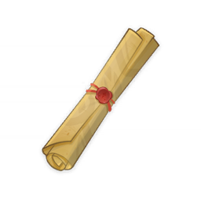
      </th>
      <th style="padding: 0; vertical-align: top;">
        

          

            通行凭证
            

          

          

            
                <strong>获取方式：</strong> 
           	    魔神任务第二章 第一幕「不动鸣神，恒常乐土」获取
            
          

        

      </th>
    </tr>
    <tr>
        <th colspan="2" style="font-weight: normal;">
        <strong>描述：</strong> 
        			由天领奉行特批的全稻妻的「通行凭证」。拥有这个凭证后，应该就可以自由出入离岛了…
        </th>
    </tr>
  </thead>
</table>

### 《转生成为雷电将军，然后天下无敌》第一版

<table class="table-weapon">
  <thead>
    <tr>
      <th class="th-weapon" rowspan="1">
        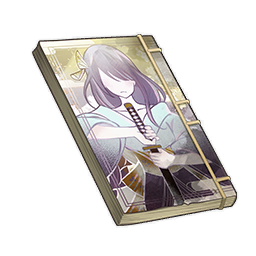
      </th>
      <th style="padding: 0; vertical-align: top;">
        

          

            《转生成为雷电将军，然后天下无敌》第一版
            

          

          

            
                <strong>获取方式：</strong> 
           	    茜特菈莉传说任务 -- 流淌着色彩的回忆·第三幕「七彩之战的真相」获取
            
          

        

      </th>
    </tr>
    <tr>
        <th colspan="2" style="font-weight: normal;">
        <strong>描述：</strong> 
        			《转生成为雷电将军，然后天下无敌》的第一版，因为印数少，所以收藏价值很高。
        </th>
    </tr>
  </thead>
</table>

### 《拜托了我的狐仙宫司》限量精装版

<table class="table-weapon">
  <thead>
    <tr>
      <th class="th-weapon" rowspan="1">
        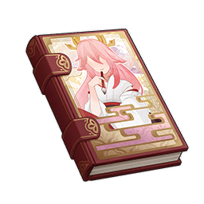
      </th>
      <th style="padding: 0; vertical-align: top;">
        

          

            《拜托了我的狐仙宫司》限量精装版
            

          

          

            
                <strong>获取方式：</strong> 
           	    茜特菈莉传说任务 -- 流淌着色彩的回忆·第三幕「七彩之战的真相」获取
            
          

        

      </th>
    </tr>
    <tr>
        <th colspan="2" style="font-weight: normal;">
        <strong>描述：</strong> 
        			《拜托了我的狐仙宫司》的限量精装版，八重堂为了回馈读者而限量发行的版本，发售之初就被抢购一空，是许多轻小说爱好者求而不得的藏品。
        </th>
    </tr>
  </thead>
</table>

### 「镇物」

<table class="table-weapon">
  <thead>
    <tr>
      <th class="th-weapon" rowspan="1">
        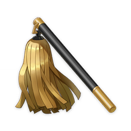
      </th>
      <th style="padding: 0; vertical-align: top;">
        

          

            「镇物」
            

          

          

            
                <strong>获取方式：</strong> 
           	    世界任务「神樱大祓」获取
            
          

        

      </th>
    </tr>
    <tr>
        <th colspan="2" style="font-weight: normal;">
        <strong>描述：</strong> 
        			从狐狸造型的雕像中，拿到的神秘物件。
        </th>
    </tr>
  </thead>
</table>

<table class="table-weapon">
  <thead>
    <tr>
      <th class="th-weapon" rowspan="1">
        
      </th>
      <th style="padding: 0; vertical-align: top;">
        

          

            「镇物」
            

          

          

            
                <strong>获取方式：</strong> 
           	    世界任务「神樱大祓」获取
            
          

        

      </th>
    </tr>
    <tr>
        <th colspan="2" style="font-weight: normal;">
        <strong>描述：</strong> 
        			在绀田村北面的荒废神社中，从狐狸造型的雕像中，取得的「镇物」。 
根据「花散里」的说法，需要利用这种镇物来实行净化的工作。
        </th>
    </tr>
  </thead>
</table>

### 五百藏交给你的「镇物」

<table class="table-weapon">
  <thead>
    <tr>
      <th class="th-weapon" rowspan="1">
        
      </th>
      <th style="padding: 0; vertical-align: top;">
        

          

            五百藏交给你的「镇物」
            

          

          

            
                <strong>获取方式：</strong> 
           	    世界任务「神樱大祓」获取
            
          

        

      </th>
    </tr>
    <tr>
        <th colspan="2" style="font-weight: normal;">
        <strong>描述：</strong> 
        				妖狸五百藏作为答谢交给你的「镇物」，造型是相当华丽的梳子。 
五百藏曾经盗走了这把梳子，为了引「那个臭狐狸」现身。作为惩罚，五百藏和他的同伴们被「那个混小子」封在石像当中。 
根据「花散里」的说法，需要利用这种镇物来进行「神樱大祓」。
        </th>
    </tr>
  </thead>
</table>

### 卷形的「镇物」

<table class="table-weapon">
  <thead>
    <tr>
      <th class="th-weapon" rowspan="1">
        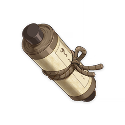
      </th>
      <th style="padding: 0; vertical-align: top;">
        

          

            卷形的「镇物」
            

          

          

            
                <strong>获取方式：</strong> 
           	    世界任务「神樱大祓」获取
            
          

        

      </th>
    </tr>
    <tr>
        <th colspan="2" style="font-weight: normal;">
        <strong>描述：</strong> 
        				古老的神秘物件，外形是密封的卷轴。无论用什么方法，也无法解开。 
根据「花散里」的说法，需要利用这种镇物来进行「神樱大祓」。
        </th>
    </tr>
  </thead>
</table>

### 钥形的「镇物」

<table class="table-weapon">
  <thead>
    <tr>
      <th class="th-weapon" rowspan="1">
        
      </th>
      <th style="padding: 0; vertical-align: top;">
        

          

            钥形的「镇物」
            

          

          

            
                <strong>获取方式：</strong> 
           	    世界任务「神樱大祓」获取
            
          

        

      </th>
    </tr>
    <tr>
        <th colspan="2" style="font-weight: normal;">
        <strong>描述：</strong> 
        					古老的神秘物件，外形是古老的钥匙。既然有钥匙，那就有锁。这把钥匙对应的锁，似乎快要被树根吸收的污秽冲破了。 
根据「花散里」的说法，需要利用这种镇物来进行「神樱大祓」。
        </th>
    </tr>
  </thead>
</table>

### 无想刃狭间·磐柱镶珠

<table class="table-weapon">
  <thead>
    <tr>
      <th class="th-weapon" rowspan="1">
        
      </th>
      <th style="padding: 0; vertical-align: top;">
        

          

            无想刃狭间·磐柱镶珠
            

          

          

            
                <strong>获取方式：</strong> 
           	    世界任务「远吕羽氏遗事」获取
            
          

        

      </th>
    </tr>
    <tr>
        <th colspan="2" style="font-weight: normal;">
        <strong>描述：</strong> 
        						散发着奇异光彩、逸散着雷元素的宝珠，似乎与岛上的磐柱存在某种关联…
        </th>
    </tr>
  </thead>
</table>

### 蛇神之首·磐柱镶珠

<table class="table-weapon">
  <thead>
    <tr>
      <th class="th-weapon" rowspan="1">
        
      </th>
      <th style="padding: 0; vertical-align: top;">
        

          

            蛇神之首·磐柱镶珠
            

          

          

            
                <strong>获取方式：</strong> 
           	    世界任务「远吕羽氏遗事」获取
            
          

        

      </th>
    </tr>
    <tr>
        <th colspan="2" style="font-weight: normal;">
        <strong>描述：</strong> 
        						散发着奇异光彩、逸散着雷元素的宝珠，似乎与岛上的磐柱存在某种关联…
        </th>
    </tr>
  </thead>
</table>

### 蛇骨矿洞·磐柱镶珠

<table class="table-weapon">
  <thead>
    <tr>
      <th class="th-weapon" rowspan="1">
        
      </th>
      <th style="padding: 0; vertical-align: top;">
        

          

            蛇骨矿洞·磐柱镶珠
            

          

          

            
                <strong>获取方式：</strong> 
           	    世界任务「远吕羽氏遗事」获取
            
          

        

      </th>
    </tr>
    <tr>
        <th colspan="2" style="font-weight: normal;">
        <strong>描述：</strong> 
        						散发着奇异光彩、逸散着雷元素的宝珠，似乎与岛上的磐柱存在某种关联…
        </th>
    </tr>
  </thead>
</table>

### 无明砦·磐柱镶珠

<table class="table-weapon">
  <thead>
    <tr>
      <th class="th-weapon" rowspan="1">
        
      </th>
      <th style="padding: 0; vertical-align: top;">
        

          

            无明砦·磐柱镶珠
            

          

          

            
                <strong>获取方式：</strong> 
           	    世界任务「远吕羽氏遗事」获取
            
          

        

      </th>
    </tr>
    <tr>
        <th colspan="2" style="font-weight: normal;">
        <strong>描述：</strong> 
        						散发着奇异光彩、逸散着雷元素的宝珠，似乎与岛上的磐柱存在某种关联…
        </th>
    </tr>
  </thead>
</table>

### 无想刃狭间·磐柱镇石

<table class="table-weapon">
  <thead>
    <tr>
      <th class="th-weapon" rowspan="1">
        
      </th>
      <th style="padding: 0; vertical-align: top;">
        

          

            无想刃狭间·磐柱镇石
            

          

          

            
                <strong>获取方式：</strong> 
           	    世界任务「远吕羽氏遗事」获取
            
          

        

      </th>
    </tr>
    <tr>
        <th colspan="2" style="font-weight: normal;">
        <strong>描述：</strong> 
        						散发着雷元素气息、拥有雷电触感的宝石，似乎与岛上的磐柱存在某种关联…
        </th>
    </tr>
  </thead>
</table>

### 蛇神之首·磐柱镇石

<table class="table-weapon">
  <thead>
    <tr>
      <th class="th-weapon" rowspan="1">
        
      </th>
      <th style="padding: 0; vertical-align: top;">
        

          

            蛇神之首·磐柱镇石
            

          

          

            
                <strong>获取方式：</strong> 
           	    世界任务「远吕羽氏遗事」获取
            
          

        

      </th>
    </tr>
    <tr>
        <th colspan="2" style="font-weight: normal;">
        <strong>描述：</strong> 
        						散发着雷元素气息、拥有雷电触感的宝石，似乎与岛上的磐柱存在某种关联…
        </th>
    </tr>
  </thead>
</table>

### 蛇骨矿洞·磐柱镇石

<table class="table-weapon">
  <thead>
    <tr>
      <th class="th-weapon" rowspan="1">
        
      </th>
      <th style="padding: 0; vertical-align: top;">
        

          

            蛇骨矿洞·磐柱镇石
            

          

          

            
                <strong>获取方式：</strong> 
           	    世界任务「远吕羽氏遗事」获取
            
          

        

      </th>
    </tr>
    <tr>
        <th colspan="2" style="font-weight: normal;">
        <strong>描述：</strong> 
        						散发着雷元素气息、拥有雷电触感的宝石，似乎与岛上的磐柱存在某种关联…
        </th>
    </tr>
  </thead>
</table>

### 无明砦·磐柱镇石

<table class="table-weapon">
  <thead>
    <tr>
      <th class="th-weapon" rowspan="1">
        
      </th>
      <th style="padding: 0; vertical-align: top;">
        

          

            无明砦·磐柱镇石
            

          

          

            
                <strong>获取方式：</strong> 
           	    世界任务「远吕羽氏遗事」获取
            
          

        

      </th>
    </tr>
    <tr>
        <th colspan="2" style="font-weight: normal;">
        <strong>描述：</strong> 
        						散发着雷元素气息、拥有雷电触感的宝石，似乎与岛上的磐柱存在某种关联…
        </th>
    </tr>
  </thead>
</table>

### 「演武传心」大赛入场券

<table class="table-weapon">
  <thead>
    <tr>
      <th class="th-weapon" rowspan="1">
        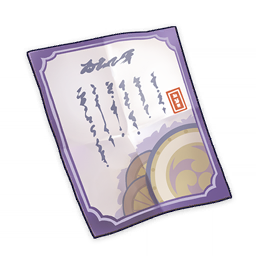
      </th>
      <th style="padding: 0; vertical-align: top;">
        

          

            无明砦·磐柱镇石
            

          

          

            
                <strong>获取方式：</strong> 
           	    活动任务「演武传心」获取
            
          

        

      </th>
    </tr>
    <tr>
        <th colspan="2" style="font-weight: normal;">
        <strong>描述：</strong> 
        						不分国籍，不论身份，以武会友，演武传心。
        </th>
    </tr>
  </thead>
</table>

### 「堇鬼」的刀

<table class="table-weapon">
  <thead>
    <tr>
      <th class="th-weapon" rowspan="1">
        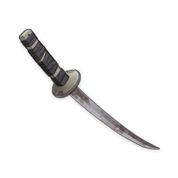
      </th>
      <th style="padding: 0; vertical-align: top;">
        

          

            「堇鬼」的刀
            

          

          

            
                <strong>获取方式：</strong> 
           	    世界任务「岩藏武艺帐」获取
            
          

        

      </th>
    </tr>
    <tr>
        <th colspan="2" style="font-weight: normal;">
        <strong>描述：</strong> 
        						岩藏流破门弟子柳叶岚士曾经使用的爱刀。 
是某一把名刀的影打，断裂后重铸而成的。与冈崎寅卫门的刀是一对。
        </th>
    </tr>
  </thead>
</table>

### 「赤鬼」的刀

<table class="table-weapon">
  <thead>
    <tr>
      <th class="th-weapon" rowspan="1">
        
      </th>
      <th style="padding: 0; vertical-align: top;">
        

          

            「赤鬼」的刀
            

          

          

            
                <strong>获取方式：</strong> 
           	    世界任务「岩藏武艺帐」获取
            
          

        

      </th>
    </tr>
    <tr>
        <th colspan="2" style="font-weight: normal;">
        <strong>描述：</strong> 
        						岩藏流破门弟子冈崎寅卫门曾经使用的爱刀。 
是某一把名刀的影打，断裂后重铸而成的。与柳叶岚士的刀是一对。
        </th>
    </tr>
  </thead>
</table>

### 「薄缘满光天目」

<table class="table-weapon">
  <thead>
    <tr>
      <th class="th-weapon" rowspan="1">
        
      </th>
      <th style="padding: 0; vertical-align: top;">
        

          

            「薄缘满光天目」
            

          

          

            
                <strong>获取方式：</strong> 
           	    世界任务「岩藏武艺帐」获取
            
          

        

      </th>
    </tr>
    <tr>
        <th colspan="2" style="font-weight: normal;">
        <strong>描述：</strong> 
        						岩藏家代代流传的宝刀。 
虽然匠人的工艺极其出色，也经历了许多年月与真剑厮杀，但刀本身其实并没有任何特别的力量。历代岩藏之胤不曾获得过神之眼，他们傲人的剑术只来自对身、心、技的长年修炼。 
这把刀在水中浸泡了一些日子。如今已经完全锈坏了。
        </th>
    </tr>
  </thead>
</table>

### 浮光山石·左

<table class="table-weapon">
  <thead>
    <tr>
      <th class="th-weapon" rowspan="1">
        
      </th>
      <th style="padding: 0; vertical-align: top;">
        

          

            浮光山石·左
            

          

          

            
                <strong>获取方式：</strong> 
           	    活动任务「远海诗夏游纪」获取
            
          

        

      </th>
    </tr>
    <tr>
        <th colspan="2" style="font-weight: normal;">
        <strong>描述：</strong> 
        						硬度适中的盆景山石，据说在雷雨天气时，岩石表层将有光芒浮烁，可以摆放为盆景左侧的假山。
        </th>
    </tr>
  </thead>
</table>

### 浮光山石·右

<table class="table-weapon">
  <thead>
    <tr>
      <th class="th-weapon" rowspan="1">
        
      </th>
      <th style="padding: 0; vertical-align: top;">
        

          

            浮光山石·右
            

          

          

            
                <strong>获取方式：</strong> 
           	    活动任务「远海诗夏游纪」获取
            
          

        

      </th>
    </tr>
    <tr>
        <th colspan="2" style="font-weight: normal;">
        <strong>描述：</strong> 
        						硬度适中的盆景山石，据说在雷雨天气时，岩石表层将有光芒浮烁，可以摆放为盆景右侧的假山。
        </th>
    </tr>
  </thead>
</table>

### 来自神子的邀请函

<table class="table-weapon">
  <thead>
    <tr>
      <th class="th-weapon" rowspan="1">
        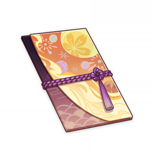
      </th>
      <th style="padding: 0; vertical-align: top;">
        

          

            来自神子的邀请函
            

          

          

            
                <strong>获取方式：</strong> 
           	    活动任务「三川游艺绮梦谭」获取
            
          

        

      </th>
    </tr>
    <tr>
        <th colspan="2" style="font-weight: normal;">
        <strong>描述：</strong> 
        						神子久违地寄来信函，似乎是有要事相商…
        </th>
    </tr>
    <tr>
        <th colspan="2" style="font-weight: normal;">
        <strong>阅读：</strong> 
        八重宫司的来信 
 
小家伙，最近既没见你来找我，也没有收到你的信件，该不会是你在别处认识了什么新的祭司巫女，就把八重神子大人忘在脑后了吧？ 
哎呀，这可不行，这会让我好伤心的。呵，你这么善良…一定不忍心看我难过吧？ 让我想想…就在天守阁见上一面吧，我已经跟门口的奥诘众打好招呼了——啊，不许拒绝。 
放心，不是坏事，会很有趣的，呵呵…
        </th>
    </tr>
  </thead>
</table>

### 「一叶好梦」

<table class="table-weapon">
  <thead>
    <tr>
      <th class="th-weapon" rowspan="1">
        
      </th>
      <th style="padding: 0; vertical-align: top;">
        

          

            「一叶好梦」
            

          

          

            
                <strong>获取方式：</strong> 
           	    活动任务「三川游艺绮梦谭」获取
            
          

        

      </th>
    </tr>
    <tr>
        <th colspan="2" style="font-weight: normal;">
        <strong>描述：</strong> 
        						金阁等狸赠予的画册，据说能幻化并定格近段时间的美好回忆。不知为何翻阅起来像是有树叶的味道…
        </th>
    </tr>
    <tr>
        <th colspan="2" style="font-weight: normal;">
        <strong>阅读：</strong> 
        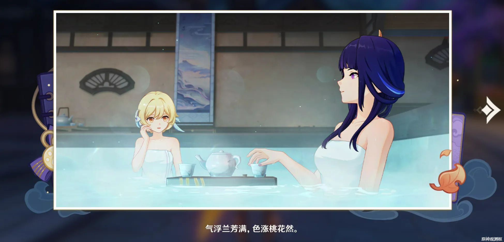
        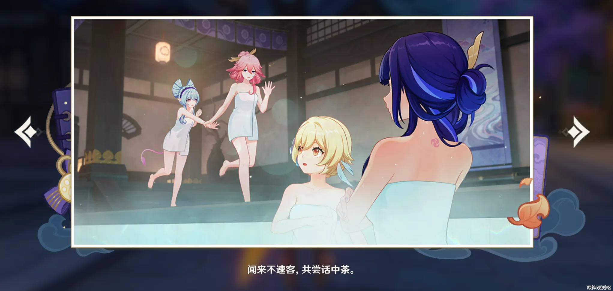
        
        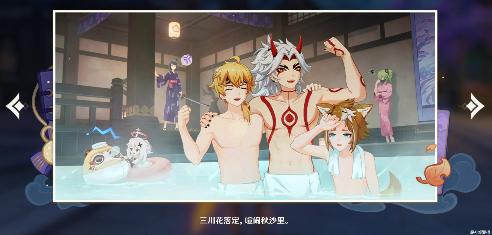
        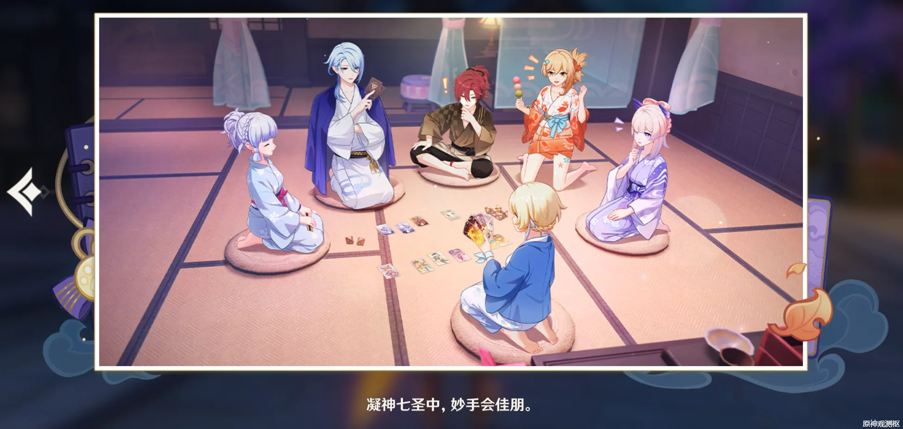
        </th>
    </tr>
  </thead>
</table>

### 「秋沙钱汤」特许券

<table class="table-weapon">
  <thead>
    <tr>
      <th class="th-weapon" rowspan="1">
        
      </th>
      <th style="padding: 0; vertical-align: top;">
        

          

            「秋沙钱汤」特许券
            

          

          

            
                <strong>获取方式：</strong> 
           	    活动任务「三川游艺绮梦谭」获取
            
          

        

      </th>
    </tr>
    <tr>
        <th colspan="2" style="font-weight: normal;">
        <strong>描述：</strong> 
        						瑞希赠予的特许券，可以在打烊之后前往「秋沙钱汤」。既不会打扰旁人，也不会被人打扰。
        </th>
    </tr>
  </thead>
</table>

### 秋沙钱汤贵宾邀请函

<table class="table-weapon">
  <thead>
    <tr>
      <th class="th-weapon" rowspan="1">
        
      </th>
      <th style="padding: 0; vertical-align: top;">
        

          

            秋沙钱汤贵宾邀请函
            

          

          

            
                <strong>获取方式：</strong> 
           	    梦见月瑞希传说任务 -- 貘枕之章 第一幕「食梦者的忧郁」获取
            
          

        

      </th>
    </tr>
    <tr>
        <th colspan="2" style="font-weight: normal;">
        <strong>描述：</strong> 
        
        						一份做工精致的邀请函，散发着令人心情愉悦的幽香。据说此函是秋沙钱汤专门为贵客准备的，函中标注了店面地址，并介绍了此店主推的三种服务。
        </th>
    </tr>
  </thead>
</table>

### 略有模糊的记录画片

<table class="table-weapon">
  <thead>
    <tr>
      <th class="th-weapon" rowspan="1">
        
      </th>
      <th style="padding: 0; vertical-align: top;">
        

          

            略有模糊的记录画片
            

          

          

            
                <strong>获取方式：</strong> 
           	    世界任务「踏鞴物语」获取
            
          

        

      </th>
    </tr>
    <tr>
        <th colspan="2" style="font-weight: normal;">
        <strong>描述：</strong> 
        						记录着「御影炉心」周边情况的画片。不知道泽维尔能不能从中看出什么来…
        </th>
    </tr>
  </thead>
</table>

### 还算清晰的记录画片

<table class="table-weapon">
  <thead>
    <tr>
      <th class="th-weapon" rowspan="1">
        
      </th>
      <th style="padding: 0; vertical-align: top;">
        

          

            还算清晰的记录画片
            

          

          

            
                <strong>获取方式：</strong> 
           	    世界任务「踏鞴物语」获取
            
          

        

      </th>
    </tr>
    <tr>
        <th colspan="2" style="font-weight: normal;">
        <strong>描述：</strong> 
        						记录着「御影炉心」底部情况的画片。不知道泽维尔能不能从中看出什么来…
        </th>
    </tr>
  </thead>
</table>

### 清晰的记录画片

<table class="table-weapon">
  <thead>
    <tr>
      <th class="th-weapon" rowspan="1">
        
      </th>
      <th style="padding: 0; vertical-align: top;">
        

          

            清晰的记录画片
            

          

          

            
                <strong>获取方式：</strong> 
           	    	世界任务「踏鞴物语」获取
            
          

        

      </th>
    </tr>
    <tr>
        <th colspan="2" style="font-weight: normal;">
        <strong>描述：</strong> 
        						记录着「御影炉心」中存储装置情况的画片。不知道泽维尔能不能从中看出什么来…
        </th>
    </tr>
  </thead>
</table>

### 奉行所的寻人委托

<table class="table-weapon">
  <thead>
    <tr>
      <th class="th-weapon" rowspan="1">
        
      </th>
      <th style="padding: 0; vertical-align: top;">
        

          

            奉行所的寻人委托
            

          

          

            
                <strong>获取方式：</strong> 
           	    	邀约事件·鹿野院平藏 第一幕「风暴捕物帐」获取
            
          

        

      </th>
    </tr>
    <tr>
        <th colspan="2" style="font-weight: normal;">
        <strong>描述：</strong> 
        							一份正式的寻人委托，印有天领奉行所的标志。
        </th>
    </tr>
  </thead>
</table>

### 「木漏茶室」邀请函

<table class="table-weapon">
  <thead>
    <tr>
      <th class="th-weapon" rowspan="1">
        
      </th>
      <th style="padding: 0; vertical-align: top;">
        

          

            「木漏茶室」邀请函
            

          

          

            
                <strong>获取方式：</strong> 
           	    	魔神任务第二章第一幕「不动鸣神，恒常乐土」获取
            
          

        

      </th>
    </tr>
    <tr>
        <th colspan="2" style="font-weight: normal;">
        <strong>描述：</strong> 
        							持有本邀请函便可获准进入「木漏茶室」，上面印有社奉行的印章。
        </th>
    </tr>
  </thead>
</table>

### 附有记忆的面具

<table class="table-weapon">
  <thead>
    <tr>
      <th class="th-weapon" rowspan="1">
        
      </th>
      <th style="padding: 0; vertical-align: top;">
        

          

            附有记忆的面具
            

          

          

            
                <strong>获取方式：</strong> 
           	    	世界任务「神樱大祓」获取
            
          

        

      </th>
    </tr>
    <tr>
        <th colspan="2" style="font-weight: normal;">
        <strong>描述：</strong> 
        							巫女「花散里」曾经戴着的面具，内侧有着深色的污渍。 
其中承载着一部分记忆。通过这份记忆，可以学会法器「白辰之环」的锻造方法。 
如今面具与花散里分别了，派蒙也不会叫她「面具巫女」了吧。
        </th>
    </tr>
  </thead>
</table>

### 《旅行者的奇妙冒险》

<table class="table-weapon">
  <thead>
    <tr>
      <th class="th-weapon" rowspan="1">
        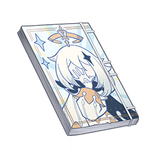
      </th>
      <th style="padding: 0; vertical-align: top;">
        

          

            《旅行者的奇妙冒险》
            

          

          

            
                <strong>获取方式：</strong> 
           	    	八重神子传说任务仙狐之章 第一幕「鸣神御祓祈愿祭」获取
            
          

        

      </th>
    </tr>
    <tr>
        <th colspan="2" style="font-weight: normal;">
        <strong>题材偏向第一选项（三神）描述：</strong> 
「十分正统的轻小说故事，是根据提瓦特现实世界做的合理改编。令人意外的是，作者似乎对海祗岛也有着非常广泛的了解，许多描绘都栩栩如生。」——希娜小姐
        </th>
    </tr>
    <tr>
        <th colspan="2" style="font-weight: normal;">
        <strong>题材偏向第二选项（校园）描述：</strong> 
「以校园生活为主的轻小说，生动描写了各种学园怪咖们的故事，读来十分有趣。」——希娜小姐
        </th>
    </tr>
    <tr>
        <th colspan="2" style="font-weight: normal;">
        <strong>题材偏向第三选项（天马行空）描述：</strong> 
「天马行空的故事，刚刚读的时候有些摸不着头脑，不过越读越觉得新奇，许多地方让人忍俊不禁。我非常喜欢。」——希娜小姐
        </th>
    </tr>
    <tr>
        <th colspan="2" style="font-weight: normal;">
        <strong>所有题材都选一次的描述：</strong> 
「许多种风格交融在一起，感觉能从薄薄的一本书中体验到很多故事，想必书的作者也是一位非常有趣的人吧。碰巧我也认识这样的一个人，所以读的时候感到十分亲切。」——希娜小姐
        </th>
    </tr>
  </thead>
</table>

### 柴门家传的名刀图谱

<table class="table-weapon">
  <thead>
    <tr>
      <th class="th-weapon" rowspan="1">
        
      </th>
      <th style="padding: 0; vertical-align: top;">
        

          

            柴门家传的名刀图谱
            

          

          

            
                <strong>获取方式：</strong> 
           	    	世界任务「农民的宝藏」获取
            
          

        

      </th>
    </tr>
    <tr>
        <th colspan="2" style="font-weight: normal;">
        <strong>描述：</strong> 
        							柴门家描绘的「天目影打刀」的图画。通过它可以掌握这把单手剑的制造方法。
        </th>
    </tr>
  </thead>
</table>

### 图谱：桂木斩长正

<table class="table-weapon">
  <thead>
    <tr>
      <th class="th-weapon" rowspan="1">
        
      </th>
      <th style="padding: 0; vertical-align: top;">
        

          

            图谱：桂木斩长正
            

          

          

            
                <strong>获取方式：</strong> 
           	    	地图探索获取
            
          

        

      </th>
    </tr>
    <tr>
        <th colspan="2" style="font-weight: normal;">
        <strong>描述：</strong> 
        							过去踏鞴砂的某人描绘的「桂木斩长正」的图谱。通过它可以掌握这把双手剑的制造方法。
        </th>
    </tr>
  </thead>
</table>

### 提瓦特游览指南·稻妻篇

<table class="table-weapon">
  <thead>
    <tr>
      <th class="th-weapon" rowspan="1">
        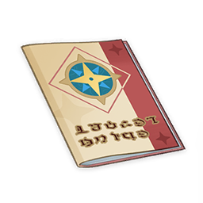
      </th>
      <th style="padding: 0; vertical-align: top;">
        

          

            提瓦特游览指南·稻妻篇
            

          

          

            
                <strong>获取方式：</strong> 
           	    	完成活动任务「堇庭华彩」后，在黑田<「八重堂」编辑>处购买
            
          

        

      </th>
    </tr>
    <tr>
        <th colspan="2" style="font-weight: normal;">
        <strong>描述：</strong> 
        	冒险家协会主办的旅行杂志，每一期都会介绍提瓦特大陆各地值得游览的景色。这—本登载了旅行家艾莉丝在稻妻的简短行记。
        </th>
    </tr>
    <tr>
        <th colspan="2" style="font-weight: normal;">
        <strong>阅读：</strong> 
        —稻妻篇— 
提瓦特地理杂志特刊—艾莉丝的稻妻行记 
 
影向山 
鸣神岛北方的这座大山上生满了壮丽的樱树，这些樱树与山顶那株最大的神樱树拥有着共同的根系。 
供奉这神樱之树的，正是稻妻最大的神社——鸣神大社。 
近些年经营神社的是那位八重小妹，如今也已经长成大姑娘了，一想到再也没办法像以前那样轻易把她弄得大哭大闹，还多少有点失落。 
我以为她会像之前那样很快就醉得胡言乱语、哇哇大哭，结果却没想到这次先醉的是我…不大不小地出了个丑，还被她奚落了一顿。啧…搞得我好像什么自取其辱的老女人一样，不甘心呀。 
…真是的，本来还准备多欺负一下那小家伙的。 
 
稻妻城 
给长野原的老弟带去了新的烟火配方。但是听了我介绍药效以后，治疗耳聋的新药他再三推辞，最后也没有收下。 
长野原老弟对爆炸物配方的认识太过保守，他总是将之稀释到爆炸力无法对环境造成明显物理改变的程度，只依靠不同金属的燃烧来创造单调的视觉效果。 
而且他只愿意缩在工坊里搞实验，那能有什么意思！ 
真是浪费，太浪费了。 
 
不过呀，他的女儿宵宫很有意思，我们在祭典上收集了许多糖果，试验了很多新的配方，玩得超开心！ 
…结果很快便被火消队护送去了冷清的海边，听说是因为稻妻城的治安新规还是什么的，真是不知所谓。 
 
一起讨论了许多全新的方案。宵宫为我提出了一些建设性的想法，这孩子很有天赋。如果我为可莉打造的乐园中有她的烟火表演，简直就是锦上添花！ 
只可惜那位臭脸将军盯得太紧，我既没来得及为她改进玩具，也没能随手把她带走。 
前不久在御膳所调配飞行药剂，却不慎把年轻的天狗大将炸伤，她左侧翅膀的羽毛恐怕要半个月才能长好了。本来想帮她包扎一下的，可从那以后，那孩子就一直在躲着我了… 
帮她留了些药，正好可以测试一下药效就是了。 
那次事故发生后，似乎成天窝在天守阁里的那家伙专门增派了军人跟踪我，真是太过分了。 
我明明都当面道过歉了，可她还是纠缠不休。 
更何况，出借御膳所给我做实验这件事也是她先同意的！ 
 
另，神里小姐第六次婉拒了加入偶像团的提议，失落。 
 
踏鞴砂 
踏鞴砂是一座环形的天然岛屿，竦峙的山岳从高处俯瞰海面，围拢着中央宏大的锻冶高炉。这里是稻妻的「玉钢」生产基地，为稻妻那些鼻孔朝天的大人物源源不断地提供着最优质的武器材料——以战败魔神的血骨结晶和优质铁矿炼成的坚硬钢材。 
这里是那位天领奉行大人最值得夸耀的资产，因此他也对工人与技术人员照料有加。 
在踏鞴砂游历期间，陪伴我的是名为镜御前的女士。她似乎是本地工人的领袖，拥有幕府代官的职位。虽然她名为天领奉行大人的下属，但在工人的面前似乎能与那个老家伙平起平坐的样子。 
工人们似乎都很信赖和爱戴她，乐意听从她的调遣甚至大于对将军的尊崇…但镜御前似乎总是眉头紧锁，一副不近人情的模样。 
 
踏鞴砂的工人们皆是无根的住民，被历史的洋流冲积在此地。以身上的刺青与劳动时的歌声分辨彼此，却又巩固着彼此之间的联系。 
 
与踏鞴砂的其他工人一样，镜御前的身上也有着被高温与「祟神」灼伤的疤痕。在外界看来是短寿与病痛的标志，在这里却是同属家人的徽记。 
 
我擅自修改了「御影炉心」的参数，把一些阀门和面板随便拆掉丢进了海里，顺便改进了原本几乎聊胜于无的防护罩，说不定会给那些枫丹的工程师带来点惊喜呢？ 
或许那个九条老头子会因为产能骤降而大发雷霆吧…但至少「祟神」的运行不会因为过热而失控了，即使面对不久后或许会爆发的战争破坏，也不至于发生太大的爆炸。 
至少是以我个人标准来看是这样的。 
 
哼哼，但说不定经我妙手干涉以后，战争根本就不会发生呢？ 
我呀，还是很乐意看到那些占星师们预言落空时，会是怎样一副表情的！ 
 
八酝岛 
八酝岛上晴空万里，十分惬意。 
听那些无聊的阴阳师说，雷电将军曾在这座岛上安置了许多「镇物」，以防蛇神的残渣泄漏污染…唔，大致意思是这样的啦，我还是学不会那一套宗教说辞就是了。 
经我观察，那些灯柱非常有趣，尽管借用了雷神信仰的外貌，但其中所用的技术却似曾相识。 
哇，都快忘记自己是在写游记了，就不提这些无聊的学术问题啦！ 
 
在绯木村受到了村长鹫津的热情招待，烤鱼和饭团很好吃。 
另外，那片被称为「名椎滩」的海滩上也居住着许多友好的海贼…真是可惜，没能在这座岛上多留一会。 
岛上的矿洞非常热闹，但矿工们的工具十分简陋落后。虽然岛上到处都由将军那家伙布下了镇物，阻挡了大部分蔓延的「祟神」，但长时间暴露在蛇骨结晶影响之下，矿工们大多患上了慢性疾病。 
 
阴阳师们从鸣神大社带来的樱饼很好吃，但比起八重小妹自己做的差的还远呢。 
 
接下来也许会去拜访浅濑神社吧，不知那里的大胖猫最近过得怎样…上次尝试用特制的猫笼诱捕它，却被巫女喝止了，真是扫兴。
        </th>
    </tr>
  </thead>
</table>

### 冒险家罗尔德的日志·离岛

<table class="table-weapon">
  <thead>
    <tr>
      <th class="th-weapon" rowspan="1">
        
      </th>
      <th style="padding: 0; vertical-align: top;">
        

          

            冒险家罗尔德的日志·离岛
            

          

          

            
                <strong>获取方式：</strong> 
           	    	地中之盐左侧帐篷处探索获取
            
          

        

      </th>
    </tr>
    <tr>
        <th colspan="2" style="font-weight: normal;">
        <strong>描述：</strong> 
        	著名冒险家罗尔德留下的日志，纸张上残留着绯樱花瓣的清香与烟叶的苦涩。
        </th>
    </tr>
    <tr>
        <th colspan="2" style="font-weight: normal;">
        <strong>阅读：</strong> 
        ——离岛—— 
来到离岛已经有好几天了，勘定仍然没有一点放行的意思。不知还要在这里滞留多久…希望久利须先生能找到门路，让我早日离开这里。 
 
久利须先生是当地的商会会长。他来自枫丹，是一位稳重友好的绅士，似乎拥有一种能让外人恍如归乡的奇异魅力。 
 
曾经听说稻妻并不欢迎外国人，但直到踏上离岛的港桥才发现情况如此严峻。 
「锁国令」颁行已有了一段时间，许多外国人在岛上滞留，大部分人来了又走，待不长久；也有很多商铺的店主打包回国了。现在的离岛，看起来十分萧条。 
据说数百年前，柊家的弘嗣公曾在荒岛上奇迹般建起商港，广招能人商贾加以招待安置，又鼓励自由经营贸易，令此地盛极一时…但假若那位弘嗣公看到如今离岛死气沉沉的景象，又会作何想法呢？ 
不过，他的后人，也就是如今的勘定奉行大人看样子锦衣玉食，过得还是挺滋润的。 
真是让人心生郁愤。 
 
又过了些日子，久利须先生带来了一个好消息。 
听说再过一阵子，南十字船队将在稻妻稍作停留。这支大名鼎鼎的远海武装船队应该有办法把我偷渡到稻妻的其他岛屿，现在我只需要耐心等待。 
虽然不知道久利须先生的消息门路是否准确，但早做准备总不是坏事。首先我得想办法把露营火炊工具从百合华小姐那里弄回来，用求的、用赎的都好… 
 
好像幕府又袭击了珊瑚宫方向的前哨，造成了很多伤亡…或者反过来？所剩不多的外国人都在交头接耳，连奉行的役职也无不担忧地谈论着流言。 
不是很清楚究竟发生了什么事，但又有些商人陆续打包回国了。很多兵船在港口来来往往，似乎是临时军事征用… 
 
或许我可以利用物资分配混乱的间隙，把我的东西从仓库弄出来。 
 
对了，还要提醒自己…这本日志可不要再遗失了。 
虽然稻妻这边的笔记本确实有更加漂亮讲究的花色封面…但这可不是喜新厌旧的借口！
        </th>
    </tr>
  </thead>
</table>

### 冒险家罗尔德的日志·鹤观

<table class="table-weapon">
  <thead>
    <tr>
      <th class="th-weapon" rowspan="1">
        
      </th>
      <th style="padding: 0; vertical-align: top;">
        

          

            冒险家罗尔德的日志·鹤观
            

          

          

            
                <strong>获取方式：</strong> 
           	    	地中之盐左侧帐篷处探索获取
            
          

        

      </th>
    </tr>
    <tr>
        <th colspan="2" style="font-weight: normal;">
        <strong>描述：</strong> 
        	著名冒险家罗尔德留下的日志，书页间残留着迷雾的潮气与菌类的清香。
        </th>
    </tr>
    <tr>
        <th colspan="2" style="font-weight: normal;">
        <strong>阅读：</strong> 
        在鹤观的探索不算顺利。 
 
此前多亏一个叫阿釜的当地青年帮了我许多忙，我才能成功从离岛脱身，绕过重重监视来到鹤观。在他的指引下，我也曾深入重重迷雾，在匆忙的一瞥中见证了岛上的古老文明，以及梦一般的幻景，但现在，记忆中的景象已经像雾一样消散了… 
但我还清晰地记得，在这座本应死寂的岛上，我竟遇到了一个小孩子。 
 
或许只是雾气中漂浮的元素微粒催人产生幻觉，也可能是因为岛上的蘑菇…那孩子也许只是一个幻象，或者虚假的记忆。虽然这样想来更符合现实逻辑，但第二次登岛时，我还是多带了些食物…希望那孩子能收到吧，孤零零地在这座死气沉沉的荒岛上生活，一定很不容易才是。 
 
再次登岛时，我没有通知阿釜。结果很快便迷失在了浓重的迷雾中间…用尽了方式也辨不清方向，就像这片雾气在没来由地拒绝我一样。 
假如不是那位金发的旅行者和那只名叫「派蒙」小精灵及时提供帮助的话，我可能就要两手空空打道回府了吧。感谢他们为我采摘了当地的「幽灯蕈」，稻妻人传说这种菌类乃是由鹤观亡者们古老浓稠的记忆凝结而成的活物，因而闪烁着磷色的幽光，它们拥有明目健脑、增强记忆力的功效。 
 
经过这些天的尝试，这种菌类确实有平复心情、令人愉快的作用，似乎对消化也有好处…但记忆力并没有明显提升。一定要留下几棵带给须弥的朋友研究一下，千万不要忘了。 
 
另外，金发旅行者与派蒙帮忙带来的古代壁画相片非常有趣，值得之后细细研究。此次能够发现如此有价值的历史遗迹，还是要多亏了这两位声名卓著的大冒险家的热情、智慧与锐不可当的冒险精神。
        </th>
    </tr>
  </thead>
</table>

### 谁人的日志·其五·刃连岛

<table class="table-weapon">
  <thead>
    <tr>
      <th class="th-weapon" rowspan="1">
        
      </th>
      <th style="padding: 0; vertical-align: top;">
        

          

            谁人的日志·其五·刃连岛
            

          

          

            
                <strong>获取方式：</strong> 
           	    	刃连岛探索获取
            
          

        

      </th>
    </tr>
    <tr>
        <th colspan="2" style="font-weight: normal;">
        <strong>描述：</strong> 
        	某人遗落在野外的日志，描述了其人在刃连岛的不幸遭遇。
        </th>
    </tr>
    <tr>
        <th colspan="2" style="font-weight: normal;">
        <strong>阅读：</strong> 
        ——刃连岛—— 
从海贼的船上偷了一条小船，划了三天三夜，终于上岸了。 
 
从这里能看到传说中鸣神岛上那座高山，与其上生长的巨大樱树。神樱的色彩在月光下显得格外清寂温柔…催人思乡。 
 
也不知东东在轻策庄会不会寂寞，不知我出来跑到这么远的地方谋生路这件事，究竟是不是正确。可能人岁数大了，就总会冒出些有的没的念头吧。 
 
在这座荒岛上兜兜转转，采到了一些紫色的甜瓜。涩涩的、没什么味道；连皮吃的话还会把牙齿和舌头染成紫色，好久才会慢慢褪去…下次应该试试煮熟了再吃。 
在岛上搭了一个小营地，等明早天一亮就往南方走…听那群海贼说稻妻城就在那边。 
 
城里一定会有许多工作机会吧，不如就放弃冒险的傻念头，在这个国家找份正经工作。等积蓄起了一笔钱，有了自己的房子，就可以把东东也接过来一起住了。 
 
再怎么说，这里的房子总比璃月港便宜。
        </th>
    </tr>
  </thead>
</table>

### 哈玛瓦兰战记·前言

<table class="table-weapon">
  <thead>
    <tr>
      <th class="th-weapon" rowspan="1">
        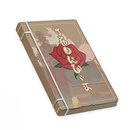
      </th>
      <th style="padding: 0; vertical-align: top;">
        

          

            哈玛瓦兰战记·前言
            

          

          

            
                <strong>获取方式：</strong> 
           	    	稻妻「八重堂」购买
            
          

        

      </th>
    </tr>
    <tr>
        <th colspan="2" style="font-weight: normal;">
        <strong>描述：</strong> 
        	新锐轻小说《哈玛瓦兰战记》的前言，由于经营调整而单独成为一册！ 作者：普尔希娜
        </th>
    </tr>
    <tr>
        <th colspan="2" style="font-weight: normal;">
        <strong>阅读：</strong> 
        前言 
 
近来由于新兴作者招募计划与如火如荼的「这本小说真厉害」大赏活动的助推，许多来自异国的新锐作家也贡献了富有特色的作品。在此敝总编特别感谢各国作者对稻妻轻小说事业的支持，与勘定奉行柊慎介大人的网开一面，因此才能让如此多优秀的作品与稻妻的读者及时见面。 
 
众所周知，在当今「锁国令」颁布之前，稻妻亦颇有一些异国武士剑豪活跃。名为哈玛瓦兰者便是其中之一，此人来自遥远的须弥雨林之国，却在稻光之国行侠仗义。其故事虽然一度隐没于大御所殿下不变的盛世之下，但现在多亏新锐作者，我的友人普尔希娜加以复述，才重获鲜活的生命。 
 
那么，话不多说，《哈玛瓦兰战记》，还请读者自行品味。
        </th>
    </tr>
  </thead>
</table>

### 哈玛瓦兰战记·一

<table class="table-weapon">
  <thead>
    <tr>
      <th class="th-weapon" rowspan="1">
        
      </th>
      <th style="padding: 0; vertical-align: top;">
        

          

            哈玛瓦兰战记·一
            

          

          

            
                <strong>获取方式：</strong> 
           	    	稻妻「八重堂」购买
            
          

        

      </th>
    </tr>
    <tr>
        <th colspan="2" style="font-weight: normal;">
        <strong>描述：</strong> 
        		「怎会如此…」本是普通的须弥旅行学者，没想到却被分配了冷门课题，前往遥远的雷之国土…海岸之国的冒险，徐徐开启！ 作者：普尔希娜
        </th>
    </tr>
    <tr>
        <th colspan="2" style="font-weight: normal;">
        <strong>阅读：</strong> 
        「相比远海的雷暴，不如说延迟毕业更加可怕吧…」 
远渡稻妻的船上，年轻的哈玛瓦兰如此想着… 
 
「你在想，论文完不成就要延迟毕业了吧？」 
熟悉的声音从船舱外传来。 
 
「啰嗦——你又是谁！」 
「我嘛…很重要吗？」 
 
「说的也是，确实没那么重要……」 
「喂——」 
 
…… 
 
就这样，在动摇海天的雷暴中，与舷窗外的细小声音吵了起来。对雷暴的担忧，对论文的恐惧，反而也没那么重要了。 
 
只不过…到登岸为止，那个在舷窗外与自己吵架的声音都没有再露面。 
 
「或许只是海难者的鬼魂吧…」 
哈玛瓦兰如是对自己说。 
 
所谓鬼魂，不过是地脉对亡者的记忆，只是过去与今日的共振而已。出现在海面上虽说怪异，但也不至于全违常理。 
 
「你才是鬼魂啦——！」 
就在哈玛瓦兰拎起行李，终于为自己的谵妄找到一套解释时，熟悉的声音又在耳边响起——
        </th>
    </tr>
  </thead>
</table>

### 哈玛瓦兰战记·二

<table class="table-weapon">
  <thead>
    <tr>
      <th class="th-weapon" rowspan="1">
        
      </th>
      <th style="padding: 0; vertical-align: top;">
        

          

            哈玛瓦兰战记·二
            

          

          

            
                <strong>获取方式：</strong> 
           	    	稻妻「八重堂」购买
            
          

        

      </th>
    </tr>
    <tr>
        <th colspan="2" style="font-weight: normal;">
        <strong>描述：</strong> 
        			「『使鬼』？与家乡的『镇灵』差不多少吧？」怀着这样的疑惑，哈玛瓦兰与新来的旅伴攀谈起来…一场未尝预料的旅程，就此开端。 作者：普尔希娜
        </th>
    </tr>
    <tr>
        <th colspan="2" style="font-weight: normal;">
        <strong>阅读：</strong> 
        …… 
「所以，你确实是鬼魂？」 
「不是！我还没有死呢！」 
「可你也没有活过呀？」 
「唔…这么说也是呢…」 
自称身为「式神」的多嘴少女大口吞食着糯米团子，其情其状令哈玛瓦兰多少有点担心她会被噎到。 
 
「非要说的话，我的情况，更像所谓的『使鬼』吧？」 
「那不还是鬼嘛…」 
「不是你说的那种！」 
又是一阵扯皮，哈玛瓦兰才终于明白过来，这家伙与须弥的所谓「镇灵」或许是类似的东西。 
通过真名结下名契。利用真名加以驱使，全世界的神秘术本质上都是差不多的，这或许正体现了人最根本的恐惧之一——对于被掌握的恐惧吧。 
 
这样胡思乱想着，哈玛瓦兰又开始后悔自己没有去读神秘学，而是学习了海洋生物研究这门冷门课程… 
不仅要远渡稻妻，更要面临活地狱般的论文答辩… 
不过如今身边多了一个聒噪的小东西，或许多少算是个转机吧…
        </th>
    </tr>
  </thead>
</table>

### 珍说澄研真影打·卷一

<table class="table-weapon">
  <thead>
    <tr>
      <th class="th-weapon" rowspan="1">
        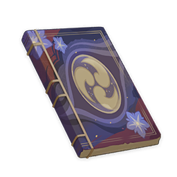
      </th>
      <th style="padding: 0; vertical-align: top;">
        

          

            珍说澄研真影打·卷一
            

          

          

            
                <strong>获取方式：</strong> 
           	    	稻妻「八重堂」购买
            
          

        

      </th>
    </tr>
    <tr>
        <th colspan="2" style="font-weight: normal;">
        <strong>描述：</strong> 
        			稻妻传统小说的第一部分，此卷另有别名「真影打」，曾经一度是禁书。本卷讲述了初代雷电将军与其影武者的幻想故事。刻画了初代将军的仁政与影武者的勇武。但是因为通称《转生雷电将军》一书广受欢迎，大众对此类型的故事渴求了起来。这本书也因此阴差阳错得以出版。
        </th>
    </tr>
    <tr>
        <th colspan="2" style="font-weight: normal;">
        <strong>阅读：</strong> 
        常说「弓张如弦月，刃研似璧澄。」 
 
且说那鸣神于渡来之日，传下了造刀之法。几千度星霜，数百载丰稔，人间的刀工终能锻出让鸣神本尊也喜爱非凡的宝刀了。大社与幕府便定下了如此一档神事祭典：取这世间最好之名物宝刀，奉于大社，名之「御神刀」。奉刀之祭，热闹非常，至今也未断绝。但，「御神刀」背后种种，恐知晓之人就不那么多了。 
凡名工锻刀，一锻所造，不止一振。最优之作，称之「真打」，铭其雅号，奉于主君或神前，不造杀业，自体清净。其余之刀，则称「影打」，授予近臣，用做刀兵，常染血污，多惹脏秽。 
 
那「鸣神权现·初代将军」自稻妻之境上的大御所落成之日起，便携其胞妹伴身。二人一明一暗，一真一影，斡旋于朝廷，讨敌于战阵。这位胞妹，单名「EI」，倘若写作明文，恐怕应该也是和初代将军名讳相对的「影」字吧，其人便是第二代幕府「影将军」是也。 
众人皆知，那席卷浮世红尘的大战之中，仅有七神可以得存。影将军虽武艺通神、剑技无双，但自觉本身不过武人，无法通达人心，便选择身陨道消，助她的胞姐上洛「天上之京」，成为稻妻的执掌天下之人。「真」将军随后设立幕府，施政稻妻。自然念有旧情，（鸣神权现）唤回「影」之神识，重塑其身形，将她作为自己的「影武者」安置于御侧。
        </th>
    </tr>
  </thead>
</table>

### 鹮巷物语·序

<table class="table-weapon">
  <thead>
    <tr>
      <th class="th-weapon" rowspan="1">
        
      </th>
      <th style="padding: 0; vertical-align: top;">
        

          

            鹮巷物语·序
            

          

          

            
                <strong>获取方式：</strong> 
           	    	收集《鹮巷物语》获得书籍残页，凑齐十页合成解锁图鉴内容获取。
            
          

        

      </th>
    </tr>
    <tr>
        <th colspan="2" style="font-weight: normal;">
        <strong>描述：</strong> 
        			传说在过去，软弱短寿的凡人尚未渡海而来的时代里，稻妻曾是狸猫的国度。而人类的历史，最初亦是醉酒的狸猫趁兴胡诌出来的…鹮巷，历史与狂言交织之巷。 作者：泷泽京传
        </th>
    </tr>
    <tr>
        <th colspan="2" style="font-weight: normal;">
        <strong>阅读：</strong> 
        序·狸猫口述的稻妻简史 
 
传说在过去，软弱短寿的凡人尚未渡海而来的时代里，稻妻曾是狸猫的国度。 
狸猫生来慵懒而多变，从不会为明日而忧虑，也不把烦恼留过今宵。那时候，稻妻的大地是狸猫惬意的乐园，每一日都是热闹的祭典。 
 
至少狸猫一族的长辈是这样说的。 
 
后来呀，狐狸们渡海而来，与狸猫一族展开了八百年又八百年的大战，双方损失惨重，最后只得谈和。狸猫虽至今嘴硬，从未服过输，可还是将那棵好大好大的雷樱树割让给了狐狸一族。 
 
不过，狐狸同样是诡诈狡猾而好变化的生灵。传说在那场八百年又八百年的大战里，不断变化斗法的狐狸与狸猫之中就有许多倒霉鬼被变幻无常的形态闪花了眼，再也记不得自己来自何方，身为何物。 
 
于是，茫然无措的凡人便从迷惑的妖怪中诞生了。 
 
这等故事，是我从好吹牛的天狗那里得知的。
        </th>
    </tr>
  </thead>
</table>

### 鹮巷物语·一

<table class="table-weapon">
  <thead>
    <tr>
      <th class="th-weapon" rowspan="1">
        
      </th>
      <th style="padding: 0; vertical-align: top;">
        

          

            鹮巷物语·一
            

          

          

            
                <strong>获取方式：</strong> 
           	    	收集《鹮巷物语》获得书籍残页，凑齐十页合成解锁图鉴内容获取。
            
          

        

      </th>
    </tr>
    <tr>
        <th colspan="2" style="font-weight: normal;">
        <strong>描述：</strong> 
        				大天狗者，乃凶残暴戾的自大狂也。酒后尤如是。——狸史氏评 作者：泷泽京传
        </th>
    </tr>
    <tr>
        <th colspan="2" style="font-weight: normal;">
        <strong>阅读：</strong> 
        与一的故事 
 
天狗名叫「与一」，住在花见坂一条名叫「鹮巷」的小小侧街。她在那里租了一家卖酒的店面，过着闲散的日子。 
 
说好听些叫做「闲散」，事实上或许「一团糟」才是更准确的形容。 
 
理论上讲，好酒的人往往懂酒，妖怪也是如此。 
但毫不客气地讲，与一酒品极差，又毫无生意头脑。最糟糕的是，隐居人间的日子里，这家伙从来没有抛弃天狗的恶劣习性——什么酒后一屁股坐进妖怪堆里寻衅滋事、绑架凡人少年少女巡游整夜大闹祭典；又或是丝毫不看气氛地钻进演剧现场，自顾自地即兴扮起天狗三拳两脚打趴主角…凡此种种，不一而足。 
若不是在妖怪中间辈分老高，又在人间交游广泛，与一这家伙恐怕早就被哪位英雄退治在哪座山下了吧。 
但鹮巷无论妖怪或是凡人都对她另眼有加，大权现大人又见她从未惹出什么大乱子，才没对她做出什么实质上的制裁。 
 
虽说天性傲慢又随性邋遢，但作为有别凡人的伟大妖怪（自称），与一倒是对身外之物并不吝惜。凡是有点钱财便被换了酒，要么便是在八重堂买了小说，大多草草翻阅一半便丢出窗外了。由是，这家伙的家里往往是一副野性光景。 
 
简单来说，这家伙身边本就没有什么值得留恋的凡间财物…唯一可提得上「除外」的，大概是始终插在她腰间的那柄金色纸扇。 
 
大天狗一族本是肆行诸多世界的妖魔，动辄往身上点缀些拥有各异故事的战利品绝非奇怪，这支纸扇也是如此。 
在某个月色尚可的夜里，醺醉的与一曾敞着衣衫向我吹嘘有关它的故事—— 
 
据说那是她曾横行过的诸多世界之一。在那时，她曾化身一位高傲的青年弓手，为同样趾高气扬的将军效忠。在将军的麾下，她，或者不如说「他」，曾骄傲地使用强弓利箭射倒了无数敌手。倒在「他」弓下的有大腹便便的凡人武士，亦有狸猫化成的狡猾忍者，就连身躯肥大的吃人鬼也敌不过与一的一箭。 
 
「哈哈哈哈哈！真是名将呀，真是名将！汝目光似电，正似大天狗一般！」 
那个年岁，狂妄的将军总喜欢这样吹着胡子大笑，实在是毫无礼节。 
日后与一又为将军立了许多功劳，斩杀了许多妖魔和倒霉的凡人。其间事迹真真假假，有多少是她凭空吹嘘，自不必说。但真正令与一成名的，乃是在那异界百年里的最后一战。 
 
话说那场水战，将军与逆贼在海峡当间冒着风暴血战。妖怪者，双方共出动了八百万又八百万之众；凡人武士更是不可计数，怎么说也数以千万计。人头不提，混战中沉没的大船也有八十万条——这等惊人的统计数据，是与一趴在窗边呕出一肚子黄汤后，在我的辅助下计算得出的。 
 
同无数故事中两军僵持的混战一样，任由各路英雄豪杰如割草般斩落无数首级、将海水染得腥红，臭脾气的将军们也还在吹着胡子苦苦相持，自然不愿意撤军回家，好生睡上一觉。 
 
终于，在某个月光清寒的夜晚，一条小船从敌阵中缓缓漂了出来。其上载着一个人影，飘飘摇摇的，像水里的倒影一样。人影旁边是一根亮闪闪的旗杆，顶上正挑着一纸扇，在月光下闪烁着金光。 
 
「哇呀呀，哇呀呀…气煞我也，气煞我也！如此挑衅，是可忍，孰不可忍！」 
将军眯起眼睛，远远望见金闪闪的扇子，立刻便暴跳如雷起来。 
 
与一可不懂将军的自尊为何如此脆弱，也懒得为凡人廉价的尊严共情。此刻的她，不，「他」正以大天狗锋锐的眼光，目不转睛地盯着船上飘摇的人影。 
 
「他」望见那是一个女人，同与一完全不同的女人。 
 
片刻之后，一支飞矢越过月亮，撕裂了夜空。 
 
「哈哈，好哇！」 
将军的喝彩很快淹没在众人的欢呼声中。 
 
「若是那两个大叔得知自己失去了什么，恐怕是要气到肝脾爆炸吧！」 
与一得意地嘿嘿笑着，一副醉醺醺的样子。大天狗不加掩饰的好色表情一览无余，让人讨厌得很。 
 
原来，在飞矢中的那一刻，与一便早已展开巨翅飞越海峡，掠过那小船时顺手取了那黄金的折扇，与手握折扇惊惶未定的美人。随后便乘着风掀翻下面叫骂不迭的将军，自顾自飞离战场去也。 
一出天狗劫美人的好戏。 
只可惜—— 
「结果你也知道，她却是一只猫婆子，这一路上给我一顿好挠……」 
与一吐吐舌头，气急败坏地叹了口气。 
 
「对了，这季节的鲷鱼不错，顺便包一些拿去吧。」 
「怎么，原来一毛不拔的大天狗也会发善心？」 
「我是说那婆娘！」 
眼见醺醉的大天狗露出威胁的神色，我急忙将吃剩的鲷鱼包好揣在怀里，匆匆告辞了。
        </th>
    </tr>
  </thead>
</table>

### 鹮巷物语·二

<table class="table-weapon">
  <thead>
    <tr>
      <th class="th-weapon" rowspan="1">
        
      </th>
      <th style="padding: 0; vertical-align: top;">
        

          

            鹮巷物语·二
            

          

          

            
                <strong>获取方式：</strong> 
           	    	收集《鹮巷物语》获得书籍残页，凑齐十页合成解锁图鉴内容获取。
            
          

        

      </th>
    </tr>
    <tr>
        <th colspan="2" style="font-weight: normal;">
        <strong>描述：</strong> 
        				家母曾有教谕：美貌的女子多精通骗术。由是举一反三可得：美貌如月光般的女人，其真面目莫非狐妖，要么便是修为不浅化猫婆婆咯。——狸史氏评 作者：泷泽京传
        </th>
    </tr>
    <tr>
        <th colspan="2" style="font-weight: normal;">
        <strong>阅读：</strong> 
        阿千的故事 
 
从与一的家里出来，顺着巷子曲曲拐拐走上一段，再折进一条小小的窄路，便到了那老太婆的家。 
黑漆漆的星空上，月亮爬到了最高处。猫儿们醒来了。 
凡人们说，修为上百上千年的猫，动辄变作妙龄少女的模样，引诱人去做出好笑的愚行，或为报什么恩德仇怨而执着追逐无辜的旅人。但其实这不过是凡人的一厢情愿罢了。 
相比只有生气时才会化成的少女人形，化猫之属更喜欢化成老人的模样，因为此种形态更符合她们机敏乖张的性格，又能借着老迈的伪装，向命入窘途的过客兜售温柔。 
 
「可不是免费的哟！」 
顺着声音抬起头来，才望见屋檐上的少女等待已久。脸遮在黑影里，似笑非笑，只有一双眼睛反射着金绿色的光。月光顺着半露的肩膀渗入衣襟，又从下摆的空隙间冒失地流淌而下，为修长的双腿勾勒着瓷色边沿。少女手里随意地把玩着剑玉，一副心不在焉的模样。 
 
这老太婆绝对气疯了… 
 
「今天又来晚了，你呀。」 
「当然，抱…抱歉。」 
 
蚊虫啪啪地撞着纸灯，灯慵懒地以闪烁回应。 
月亮带来了潮湿的风，没多久便让蝉声止息。 
 
少女披散着头发，一边摇着纺车，一边做出怪笑的模样，甚是吓人。 
我呢，即使身为能与大天狗推杯问盏的狸猫，在深不可测的化猫面前总也要礼敬三分。简而言之——正为方才的冒犯跪伏谢罪。 
 
「也罢，也罢。既然鲷鱼尚新鲜，你先起来吧。」 
我以狸猫圆滚滚的身形艰难恢复正坐姿势，少女也渐渐化成老妇人，慈祥地怪笑着。 
「谢谢千婆婆。」 
「叫我阿千！」 
 
令人如释重负。 
但多少觉得哪里还是莫名其妙的。 
 
「哈哈哈哈，说起来，那个呆瓜最近过得如何？」 
阿千把一整条鲜鱼呲溜一声吞进嘴里，又「啵」地连尾巴也吞下去。 
 
说起来，这家伙与大天狗结下因缘的故事，也可谓啼笑皆非了。虽说之前与一已经从她的角度提及这场闹剧，但在化猫的口中，便又是另一个故事了—— 
 
阿千本不生于我们的世界，她来自一个凡人更为猖狂的天地。 
在某个夜晚，某片竹林，尚且年少的阿千曾被游方僧捕获，辗转良久又让将军买下，做了什么「御化猫」。 
对那段日子，她并没有什么记忆，只是疑惑为何凡人中的达官贵人总爱惹她生气，又总爱找她玩耍。每天便只顾着驱使她抓呀抓地把仇家抓成碎片，或只知道寻欢作乐，强迫她玩些只有他们自己乐在其中的无聊游戏。 
那些日子长得让人发狂，但妖怪所经年岁毕竟长久，其耐心远胜凡人。 
 
后来，将军和贼人的将军厮杀起来，阿千便又成了什么「忍者」。 
 
「这段故事更加无聊……」 
说着，阿千眯起眼睛打了一个大哈欠，嘴巴一路咧到了耳根。 
 
随后，在水战的那一夜，将军想到一着妙计—— 
命阿千化成华贵妇人站在小船上，又立一金扇，以此羞辱贼将不敢近前。若贼兵冒进，也将被这千年的化猫狠狠教训一番。 
 
只是后来，对面船阵中的与一…… 
「只是后来，那呆瓜突然大呼小叫地站上前来，哇哇闹着要一箭射落那扇子。」 
于是，只见那大天狗…… 
「……脚下一滑，便扑通一声掉进了海里。」 
猫脸的老妇忍俊不禁，嗤嗤笑了起来。 
 
「那天晚上她喝得太醉，恐怕还以为身在惊涛骇浪之中。但那天晚上月光清寒，一丝风都没有。」 
「不过，我已有几百年未见过如此有趣的活物，便给她赚个面子，憋着笑自己摇落了纸扇……结果对面船阵又是一阵哇哇赞叹，想想就好笑……」 
 
再后来，大天狗伸展巨翼，一跃而起，如同乌云遮盖明月一般扑向那华贵的女人—— 
「霎时间弓矢乱发，她便像个刺猬似的又掉进海里了。我呢，再也无法装作面无表情，笑得根本停不下来。」 
然后，阿千便哈哈大笑着从海中捞起倒霉的大天狗，夹在胳膊下一边狂笑，一边飞跃过两方的战船，搅了将军们的雅兴。 
人们说她一连越过了八条船，随后便不见了踪影。猫妖留下的笑声，到战事结束后还足足回荡了三天有余。 
 
「我笑得停不下来，便用力抓她……可一想到她的窘状，便越抓就越想笑，哈哈哈哈哈哈……」 
猫化成的老太停不住地大笑。 
 
「再后来，我被她带来了这个世界，把我当做了什么战利品一样！」 
老妇的面孔「噗」地变成了少女愠怒的脸，只是脸上刚才笑到岔气留下的红晕尚未散去，看起来有点滑稽。 
「我才不是什么战利品！」 
 
「话说回来，可能这也正是为何她不敢亲自来见我的原因吧。」 
少女脸的猫老太轻轻叹了口气，又狡黠地笑了。 
 
「你也该走了。留着门吧，待到月圆再来。」 
「顺便，别忘了把这件蓑衣送去我们的老友那边。」
        </th>
    </tr>
  </thead>
</table>

### 鹮巷物语·三

<table class="table-weapon">
  <thead>
    <tr>
      <th class="th-weapon" rowspan="1">
        
      </th>
      <th style="padding: 0; vertical-align: top;">
        

          

            鹮巷物语·三
            

          

          

            
                <strong>获取方式：</strong> 
           	    	收集《鹮巷物语》获得书籍残页，凑齐十页合成解锁图鉴内容获取。
            
          

        

      </th>
    </tr>
    <tr>
        <th colspan="2" style="font-weight: normal;">
        <strong>描述：</strong> 
        				俗语有言，招惹雨女哭泣者，必然招致无法解脱的悲哀。——狸史氏评 作者：泷泽京传
        </th>
    </tr>
    <tr>
        <th colspan="2" style="font-weight: normal;">
        <strong>阅读：</strong> 
        雨婆婆的故事 
 
从阿千的家里出发，沿着巷子左拐右转，至一处潮湿的庭院，便来到了雨婆婆的家。 
素雅的庭院中，就连蝉也噤了声。只有水琴窟中的滴水在幽幽地响着，伴着竹鹿威的节奏和鸣。 
曾经在无拘无束的山林中，化雾成雨的女子是狸猫与狐狸共同的好友。 
自然，我们妖怪与凡人不同，既没有复杂的烦恼，也不划分各自地位品级。但在雨雾弥漫的山里呀，轻声细语的雨女总是能收获更多的尊敬与爱慕。 
只是后来，大家纷纷臣服于大权现大人。凡人的好日子来了，妖怪们要么隐居各处、要么遭到退治与镇压…雨婆婆便是那时起迁来鹮巷的。作为慰问，鸣神大社的狐狸宫司大人将这处宅子赠予了她。 
不禁叫人好奇，是怎样的失去与悲伤，能让宫司大人为之特加照顾… 
 
在庭院中稍作驻足，看着弯月在池塘里飘摇，湿润凉爽的夜风带来了她的声音。 
 
「失礼，让您久等了。」 
回过头去，正看到雨女立在门边。苍白的月光洒在她的身上，白色长衣闪烁着濡湿的光泽，年轻修长的身体却散发着苍老的悲哀气息。 
 
于是，我低下头，匆匆将阿千交给我的蓑衣奉上，不敢抬眼直视她苍灰色的双眼。 
凡人坊间传言，悲伤的雨女，双眼会呈现出溺死者般的大理石灰白色调。敢于直视这双悲伤眼睛的人将会永远迷失在难解的雨雾中。 
当然，那不过是凡人的无聊传说而已，但「不要直视悲伤雨女的双眼」这样一条基本礼节，确是妖怪之间不成文的规矩。 
 
「谢谢。」 
雨婆婆的声音一如既往地湿润温柔，如同雾中晨露。 
 
并没有请我入室，也没有分享故事。 
只是交给我一方木匣，我心领神会。 
于是，趁月色明亮，我悄悄退出了庭院。
        </th>
    </tr>
  </thead>
</table>

### 鹮巷物语·四

<table class="table-weapon">
  <thead>
    <tr>
      <th class="th-weapon" rowspan="1">
        
      </th>
      <th style="padding: 0; vertical-align: top;">
        

          

            鹮巷物语·四
            

          

          

            
                <strong>获取方式：</strong> 
           	    	收集《鹮巷物语》获得书籍残页，凑齐十页合成解锁图鉴内容获取。
            
          

        

      </th>
    </tr>
    <tr>
        <th colspan="2" style="font-weight: normal;">
        <strong>描述：</strong> 
        				凡人之可悲，正在于其不自知。至于妖怪嘛，总是缺乏此种悲哀的烦恼。——狸史氏评 作者：泷泽京传
        </th>
    </tr>
    <tr>
        <th colspan="2" style="font-weight: normal;">
        <strong>阅读：</strong> 
        权兵卫的故事 
 
权兵卫今年七十六岁，是鹮巷长居的唯一凡人。 
曾是农民，做过武士，做过工匠。 
我手中的匣子便是他的作品，顺滑的黑漆面镶嵌着多彩的珠母，是从海祇岛的渔民那里学到的手艺。 
 
「辛苦你了。」 
面前的老人深深向我低下头。 
虽说我私下以为，凡人对妖怪的礼节本当如此，但还是不得不为他的忧郁而感到一丝怜悯。 
 
据权兵卫所言，与坊间传说不同，他与山林中漫行的雨女曾是至交好友。 
只不过，彼时尚是少年的权兵卫，是为了给家乡干旱的田地带来雨水的滋润，因而听从村老的说辞，走向山林寻求雨女的帮助。 
雨婆婆那时已不再年少，对人间的诸多变数了然于心。但山林中的造物总是比凡人更加单纯而素朴。 
 
后来呀，后来。年轻的权兵卫犯下了难以启齿的错误，欺骗了属于山海的生灵。尽管直到今天，他仍然坚持自己的欺瞒，乃是为了家乡的福利。 
 
而他的村庄也确实因此后降下的霪雨而盼到了难得的丰收年景。 
在那之后，无颜安闲的权兵卫远远避开山林，来到城市长居。 
 
「非常抱歉。」衰老的凡人低下头，却并没有收下木匣。 
我离开了他的屋子，趁着月光尚未被阴云遮盖。
        </th>
    </tr>
  </thead>
</table>

### 鹮巷物语·五

<table class="table-weapon">
  <thead>
    <tr>
      <th class="th-weapon" rowspan="1">
        
      </th>
      <th style="padding: 0; vertical-align: top;">
        

          

            鹮巷物语·五
            

          

          

            
                <strong>获取方式：</strong> 
           	    	收集《鹮巷物语》获得书籍残页，凑齐十页合成解锁图鉴内容获取。
            
          

        

      </th>
    </tr>
    <tr>
        <th colspan="2" style="font-weight: normal;">
        <strong>描述：</strong> 
        					遗憾的中场，其后或许接续着更有趣的故事？ 作者：泷泽京传
        </th>
    </tr>
    <tr>
        <th colspan="2" style="font-weight: normal;">
        <strong>阅读：</strong> 
        中场 
 
传说在过去，软弱短寿的凡人尚未渡海而来的时代里，稻妻曾是狸猫的国度。 
狸猫生来慵懒而多变，从不会为明日而忧虑，也不把烦恼留过今宵。那时候，稻妻的大地是狸猫惬意的乐园，每一日都是热闹的祭典。 
 
至少狸猫一族的长辈是这样说的。 
 
后来呀，狐狸们渡海而来，与狸猫一族展开了八百年又八百年的大战，双方损失惨重，最后只得谈和。狸猫虽至今嘴硬，从未服过输，可还是将那棵好大好大的雷樱树割让给了狐狸一族。 
 
不过，狐狸同样是诡诈狡猾而好变化的生灵。传说在那场八百年又八百年的大战里，不断变化斗法的狐狸与狸猫之中就有许多倒霉鬼被变幻无常的形态闪花了眼，再也记不得自己来自何方，身为何物。 
 
于是，茫然无措的凡人便从迷惑的妖怪中诞生了。 
 
一边回顾着狸猫一族相传已久的故事，一边在曲折的街巷中徘徊。 
最终却也没有找到尚且开张的酒家。 
 
是时候回去了吧。 
这样想着，从狐狸大叔的荞麦面摊前站起身，伸伸懒腰。 
 
背后却传来了熟悉的气息——
        </th>
    </tr>
  </thead>
</table>

### 新六狐传·序

<table class="table-weapon">
  <thead>
    <tr>
      <th class="th-weapon" rowspan="1">
        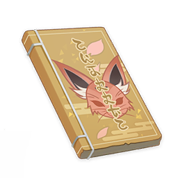
      </th>
      <th style="padding: 0; vertical-align: top;">
        

          

            新六狐传·序
            

          

          

            
                <strong>获取方式：</strong> 
           	    	稻妻「八重堂」购买
            
          

        

      </th>
    </tr>
    <tr>
        <th colspan="2" style="font-weight: normal;">
        <strong>描述：</strong> 
        					有关记忆的故事，总是与得而复失的瞬间相连。本书并非全然新作，而是名作《有乐斋六狐传》之改写
        </th>
    </tr>
    <tr>
        <th colspan="2" style="font-weight: normal;">
        <strong>阅读：</strong> 
        序 
 
有关记忆的故事，总是与得而复失的瞬间相连。 
 
若要谈起拙作动笔缘由，其实也并不是什么大不了的事。 
 
那夜，我正在乌有亭饮酒消闲，不巧偶遇了阔别已久的友人——不知何时起，她便坐在了一边的雅座上。 
 
「哎呀，是谁今天难得好兴致，却又一个人孤零零喝酒呢？」 
 
见她这样问，我随口便答： 
「好酒总是待价而沽，难免要一个人耐着性子苦等。」 
 
「老套的说辞…你还是一点意思都没有。 
如今贵为总编的她手握小盏，一副酒兴将起的模样。 
「不如为自己赚些酒钱如何？反正闲着也是闲着。」 
 
「至于今夜的酒，我来买单就好。」 
她又笑着如是说，恐怕已经是第三次了。 
 
「你回来了。」 
我看见夜风携着几点神樱花瓣落在她的酒盏中，打碎了小小的月亮。 
一种似曾相识的感触袭来，不知怎的便丢人地吐出了这四个字。 
 
「你喝醉了。」 
她面生不悦，语气带着某种不容动摇的威严。 
可是很快，她便放下酒盏，叹了口气： 
「她离开的时候，我还没有出生。」 
 
而我那时也不过一介少年。 
 
「她曾讲过的故事，或许只有你才能复述了吧。」 
 
就这样，说来好笑，我便着了道，要为八重堂再动一次笔了。 
也请诸位老读者莫要气恼，这并非我擅自爽却歇笔的承诺。 
毕竟我也要为即将降价的佳酿早做准备，再者说，更不能亏欠了那夜总编大人请我的好酒。
        </th>
    </tr>
  </thead>
</table>

### 新六狐传·一

<table class="table-weapon">
  <thead>
    <tr>
      <th class="th-weapon" rowspan="1">
        
      </th>
      <th style="padding: 0; vertical-align: top;">
        

          

            新六狐传·一
            

          

          

            
                <strong>获取方式：</strong> 
           	    	稻妻「八重堂」购买
            
          

        

      </th>
    </tr>
    <tr>
        <th colspan="2" style="font-weight: normal;">
        <strong>描述：</strong> 
        					被称为「黑狐」阿达及其故事，本是《有乐斋六狐传》的第三章。由于笔者的特别偏爱，特别被提至第一个故事。
        </th>
    </tr>
    <tr>
        <th colspan="2" style="font-weight: normal;">
        <strong>阅读：</strong> 
        各位请原谅我唠叨，在故事开始之前，还要先介绍一番—— 
何谓「新」六狐传？ 
众所周知，有新即有旧。本书正是基于五百年前一度流行的《有乐斋六狐传》，稍加改编而成之世俗新本也。本人文笔鄙陋，还望有乐斋大人与诸位读者见谅。 
说起有乐斋大人，其人在我幼时便已颇有名气。那时候斋宫大人亦对其文字与茶品青睐有加，在狐狸一族之中，有乐斋大人算是第一等的风雅之士了。 
只可惜，往事随风，自有乐斋大人不幸犯下大罪引咎离去，至今已有五百余年矣… 
 
闲话不再多说，《新六狐传》之开端，正在高耸的影向山中。 
传说在大狐白辰在世的年月里，其手下有六位弟子，皆是法术高强、变化多端之士，平日里负责辅助主母白辰协调神社事务、守卫影向山之安全无虞。 
 
六狐之首名曰黑狐阿达，虽是女儿身，却生得虎背熊腰，魁伟壮大。其性情奔放不羁，因在神社正殿醉酒大闹，摔坏了将军神体，而惹得白辰大怒，将她放逐山下，好生反省。 
却说这黑狐阿达，方才好声好气下山，便将主母的诫诲忘个精光。打上一壶好酒，直往村庄寻衅去了。
        </th>
    </tr>
  </thead>
</table>

### 新六狐传·二

<table class="table-weapon">
  <thead>
    <tr>
      <th class="th-weapon" rowspan="1">
        
      </th>
      <th style="padding: 0; vertical-align: top;">
        

          

            新六狐传·二
            

          

          

            
                <strong>获取方式：</strong> 
           	    	稻妻「八重堂」购买
            
          

        

      </th>
    </tr>
    <tr>
        <th colspan="2" style="font-weight: normal;">
        <strong>描述：</strong> 
        	本册讲述了「黑狐阿达」与「户隐的双鬼」之间的对决故事。该故事在《有乐斋六狐传》中不幸佚失，今幸而寻回，加以改编而成。
        </th>
    </tr>
    <tr>
        <th colspan="2" style="font-weight: normal;">
        <strong>阅读：</strong> 
        书接上回，话说那黑狐阿达直往村庄寻衅去了，只见路旁却立着两位女子作樵夫打扮，腰间却各挎着一柄七尺野太刀、一柄短太刀，又一柄胁差，真个是全副武装，锋芒毕露。 
 
两女子见黑壮身影大步而来，搞得尘土飞扬，地面振动，便警戒起来，手扶刀柄同声问道： 
 
「来者何人？莫不是妖怪！」 
 
那身影便道： 
 
「哈哈，正是妖怪！」 
 
二女未敢含糊，抽刀上前便斩。却不想被那妖怪一步闪过，侧过身来捉住两人手腕顺势一拧，七尺长的大太刀便当啷落地。二女吃痛一惊，又去拔胁侧的短太刀，但为时已晚——只见黑狐奋起一掌将一人击飞，又挟住另一人，拎小鸡一样提将起来。就这样提着一人，蹬木屐的大脚踏上了另一人胸口。 
 
「『户隐的双鬼』？去年便见你姐妹二人欺压村民，让我好生收拾一番。今次还是不生教训！」 
 
二位女强盗一听这话，又羞又恼，一时间只顾道歉求饶。却不想黑狐阿达直接把她俩丢在地上，兀自开了腔： 
 
「也罢，既然我被白辰大人赶下了山，是个无主的妖怪了。不如你二人陪我行侠仗义，也不至太无聊！」
        </th>
    </tr>
  </thead>
</table>

### 新六狐传·三

<table class="table-weapon">
  <thead>
    <tr>
      <th class="th-weapon" rowspan="1">
        
      </th>
      <th style="padding: 0; vertical-align: top;">
        

          

            新六狐传·三
            

          

          

            
                <strong>获取方式：</strong> 
           	    	稻妻「八重堂」购买
            
          

        

      </th>
    </tr>
    <tr>
        <th colspan="2" style="font-weight: normal;">
        <strong>描述：</strong> 
        	在五百年前的《有乐斋六狐传》中，叶山与阿优亦有独立的故事。但在此时，这对母女还要仰赖阿达的搭救。
        </th>
    </tr>
    <tr>
        <th colspan="2" style="font-weight: normal;">
        <strong>阅读：</strong> 
        书接上回，黑狐阿达收服了「户隐的双鬼」两位女强盗，踏上了行侠仗义之路。 
 
三人在绀田村歇脚不久，便偶遇一对母女。 
攀谈起来，这母女二人乃是清籁岛远来的乐人，老妇姓叶山，少女名阿优。她们正准备进稻妻城庆祝祭典，结果却被村里卖堇瓜的大户诈了，一定要她们用离谱的高价买下堇瓜，只因为他此前「好心」提供了几个堇瓜供她们解渴。但巡游艺人哪来那么多钱？又不能把回家的盘缠花掉… 
「户隐的双鬼」一向暴烈，闻听此言，登时咬牙切齿，你唱我和，非要找这奸商算账，把他大卸八块不可。可黑狐阿达此时却有了主意。一声沉吟止住了双鬼姐妹： 
 
「行了，我明白了。」 
 
然后又对母女稍加安抚： 
 
「你二位不必担心，大姐我已经有了分寸，只看我去理论一番便可。」 
 
说完，便又大步离去，去找那奸商去了。
        </th>
    </tr>
  </thead>
</table>

### 新六狐传·四

<table class="table-weapon">
  <thead>
    <tr>
      <th class="th-weapon" rowspan="1">
        
      </th>
      <th style="padding: 0; vertical-align: top;">
        

          

            新六狐传·四
            

          

          

            
                <strong>获取方式：</strong> 
           	    	稻妻「八重堂」购买
            
          

        

      </th>
    </tr>
    <tr>
        <th colspan="2" style="font-weight: normal;">
        <strong>描述：</strong> 
        	《有乐斋六狐传》中最具张力的故事片段，据说乃是有乐斋大人自璃月归来所写。亦被笔者全文收录。
        </th>
    </tr>
    <tr>
        <th colspan="2" style="font-weight: normal;">
        <strong>阅读：</strong> 
        书接上回，黑狐阿达大步离去，找那奸商理论去了。 
 
这卖堇瓜的土左卫门原本也是一位武士，只是稻妻承平日久，好刀也无处施展，便在村里做了商户。学了些威逼敲诈、取巧经营的手段，又多亏面相凶恶无人敢惹，一来二去，也便成了村里的大户。 
 
这天，土左卫门正在摊子前乘凉，只见一阵尘土飞扬，土地动振，比棚子更大的阴影便罩在了他的头上： 
 
「大哥，买瓜！」 
 
土左卫门微睁一眼，打量了一下来客：只见来者身形魁梧，黑壮凶猛，站相毫无礼节，似要斫人，却是一个女人！ 
 
「要多少？」 
 
来者也不着急回答，只是望着案板上的胁差： 
 
「好刀，好刀。」 
 
「确实好刀，我也曾是武家门下人，总要有点上眼的家宝。」 
 
土左卫门不明就里，随声应和。 
 
「只可惜拿来切了瓜。」 
 
见来者话里有刺，土左卫门面露不悦： 
 
「你是来买瓜的不是？如何恁多言语？」 
 
「是，是。」 
 
黑狐阿达嘿嘿一笑，权作赔礼。 
 
「切一升堇瓜块，瓜皮全部削掉。」 
 
土左卫门满脸狐疑，却也无意质疑。便切了一升堇瓜块，上秤称量。 
 
「大哥这秤杆如何不平？」 
 
土左卫门闻听此言，便握紧了刀。 
 
「我说你这秤，好像还有点脾气呢！」 
 
「大姐你若是有心消遣，不如先将摩拉给我。」 
 
土左卫门按捺不住怒火，理论起来。 
 
「嘿嘿，不是我不愿先付账，只是怕你不肯接。」 
 
「你肯付我就肯接！」 
 
「当真如此？！」 
 
「还能有假！」 
 
只见黑狐怒吼一声「接着！」，便将手中一包满满的摩拉劈头砸在土左卫门脸上。土左卫门躲闪不及，直接挨了个七荤八素，后仰着摔了下去，手里的宝贝胁差也飞脱出去，落在身边。仔细一看可不得了，那奸商的鼻子被摩拉袋砸成扁扁的一坨，活像是装烟管的荷包。 
 
黑狐阿达又两步过来，踩住那奸商胸口。也不言语，当面便是一拳。打得奸商脑内金鼓齐鸣，简直像是开了个璃月跨海武道会。土左卫门挣扎着要爬起身，拿起刚刚落在地上的胁差。却被黑狐发现，一怒之下又是一拳，打得土左卫门头顶一对狸猫耳朵「噗」地蹦出来，口中止不住地求饶。 
 
阿达见状哈哈大笑，这奸商原来也是妖怪，而且竟是个脏兮兮的狸猫！ 
 
于是，收了狸猫偷来的胁差，将这恶霸的财产分与全村，又将剩余的钱财交予那对落难母女，黑狐阿达便姑且饶了这狸妖的性命，继续上路去也。
        </th>
    </tr>
  </thead>
</table>

### 新六狐传·五

<table class="table-weapon">
  <thead>
    <tr>
      <th class="th-weapon" rowspan="1">
        
      </th>
      <th style="padding: 0; vertical-align: top;">
        

          

            新六狐传·五
            

          

          

            
                <strong>获取方式：</strong> 
           	    	稻妻「八重堂」购买
            
          

        

      </th>
    </tr>
    <tr>
        <th colspan="2" style="font-weight: normal;">
        <strong>描述：</strong> 
        	《新六狐传》中特意新增了对于旧事的评论，如读者读之烦闷，可特别略过本册。但对于笔者而言，不得不谈之事，不得不抒发之感慨，仍是要浪费笔墨言明的。
        </th>
    </tr>
    <tr>
        <th colspan="2" style="font-weight: normal;">
        <strong>阅读：</strong> 
        黑狐阿达的逸事暂告一段落，还请宽恕笔者唠叨，仍要为些许年前的旧事多加评论。 
关于当年有乐斋大人因何事引得斋宫震怒，如今早已不再清楚。不过彼时八重大人因为多喝了两三四五六七八杯，愿意为我讲讲亲历的史料。 
此文本是小说家言，我自是要把真话改变成稗抄野史的。 
当初狐斋宫离开白辰之野，赴任鸣神大社之时，八重大人尚未出生。因此她的新狐幼童年岁里，都是听闻斋宫之事长大的。她对斋宫之大爱自是敬仰。 
因此八重大人之游历生涯，最后也以赴任鸣神大社作结。 
 
因其血脉相亲，斋宫大人对年幼的八重大人照顾颇多，但今日的八重大人却总是尽可能避免回忆那段日子… 
——虽说已保证是小说家言，八重大人的身世，为避免主编审核删改，笔者也不便透露太多就是了。 
 
话说回有乐斋之事。当年有乐斋大人因何事引得斋宫震怒，如今早已不再清楚。只知或许他的所为，与日后深渊之入侵或许有所关联。 
但在有乐斋大人被迫离去之后，狐斋宫大人便也不再驻留鸣神大社，而是前往城中天守长居了。 
 
「天变地异之浩劫将至。此身须尽到御侧之人、生灵护主的义务，因此尽快前往将军身侧才行。」 
 
斋宫大人的第二次离去之时，八重大人也不过少女之龄。一直追随之人，再度离她而去了。岂料不多时灾厄席卷列岛，我们才得以了解其中深意… 
只是一切为时已晚，一切事与愿违。 
这时，斋宫大人第三次离去，也是永远地离开了。 
 
五百年的时光或许于凡人而言过于漫长，但其事变留下的悲欢伤痛，不论对于朝生夕死者、或是常生难灭者而言，都是难以抹除的。
        </th>
    </tr>
  </thead>
</table>

### 沉秋拾剑录·一

<table class="table-weapon">
  <thead>
    <tr>
      <th class="th-weapon" rowspan="1">
        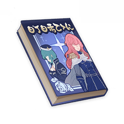
      </th>
      <th style="padding: 0; vertical-align: top;">
        

          

            沉秋拾剑录·一
            

          

          

            
                <strong>获取方式：</strong> 
           	    	稻妻「八重堂」购买
            
          

        

      </th>
    </tr>
    <tr>
        <th colspan="2" style="font-weight: normal;">
        <strong>描述：</strong> 
        	逆转的星海中央，地表之下蔓延数百光年的战场…随着过于庞大的开头展开迅猛而来的新感觉侠客物语！就此开场！ 作者：行秋
        </th>
    </tr>
    <tr>
        <th colspan="2" style="font-weight: normal;">
        <strong>阅读：</strong> 
「但是，假如舍尔陛下的野心真的得以实现，对于大家又有何好处呢？」 
军务尚书珐朗吉丝注视着窗外的星海，银河与恒星在她的脸上投下苍白的光色，又照亮了她的头发，微光顺着发丝缓缓流下。 
她忍不住想起初次从这扇舷窗远望星辰的体验，但曾经的敬畏感，她已经记不起了。距离地表远达数百光年的此处，故乡的模样也早已在她的梦中扭曲。 
「若有失言请原谅我，亲王殿下。但这场战争已经进行了太长时间，我们为舍尔陛下的梦想跨越无数星区作战，以各种谋略与诡计消灭了千百万生命，成为一个个陌生星区的总督和钦差……但舍尔陛下的幻景为我们带来了什么？只有越来越多的不幸，越来越多的敌人，它们遍布银河，总有一天会吞噬我们……」 
「兄长的帝国将是一个永恒的国度，这个国度将不再有恐怖或匮乏。全体的幸福不再由少数人左右，亦不会有人比他人地位更高，就连无能也不再被称为罪恶。因而……无法理解这等远见的敌人，遭到铲除自然是他们的命运。」 
歌帕塔亲王摇摇头，语气温和却冷淡。 
似乎星区反游击战争夺去的不仅仅是一只眼睛与手臂，眼前的她已与珐朗吉丝曾认识的那个欢悦的少女大为不同。 
「我相信兄长的决定，他绝不会有私心。所以这种动摇人心的话，即使是你也请不要再说了。」
        </th>
    </tr>
  </thead>
</table>

### 沉秋拾剑录·二

<table class="table-weapon">
  <thead>
    <tr>
      <th class="th-weapon" rowspan="1">
        
      </th>
      <th style="padding: 0; vertical-align: top;">
        

          

            沉秋拾剑录·二
            

          

          

            
                <strong>获取方式：</strong> 
           	    	稻妻「八重堂」购买
            
          

        

      </th>
    </tr>
    <tr>
        <th colspan="2" style="font-weight: normal;">
        <strong>描述：</strong> 
        	在逆转的星海中央，即便一场神话般的大战，对于「岸上」之人来说也不过沉寂中偶生的一丝涟漪…但对于涉身其中的战士，此即生命之全部！ 作者：行秋
        </th>
    </tr>
    <tr>
        <th colspan="2" style="font-weight: normal;">
        <strong>阅读：</strong> 
面对如此严密的防御，恐怕就算是全由雅兹塔级战舰组成的庞大舰队，也很难造成有效伤害吧。 
自满于帝国的工程奇迹，戈尔达法里德大将却从未意识到，叛军正在急速接近他的命门。这座由歌帕塔亲王亲自设计，被舍尔陛下赐名「阿努沙尔万」的强大星海堡垒，此刻在叛军面前正如鸡蛋般脆弱。 
佩什塔努驾驶着拉赫什快艇，在错综复杂的通风管道中间穿梭。急速掠过诸多孔洞喷出的有毒气体与元素云，甩掉追击的自反应机械，快艇的高速使他耳目充血，目眩不已。 
「时机来了。」 
随着动力系统的能量核逐渐显露真容，佩什塔努想道。 
「时间到了。」 
戈尔法里德大将望着星球轨道闪烁的光团，如是想道。 
于是，她下达了对星球无差别攻击令。 
佩什塔努亦对堡垒的核心发起了致命一击—— 
 
「真想看看歌帕塔亲王/亲王殿下暴跳如雷的样子啊……」 
同一刹那间，两人的念头竟如此相同。
        </th>
    </tr>
  </thead>
</table>

### 沉秋拾剑录·三

<table class="table-weapon">
  <thead>
    <tr>
      <th class="th-weapon" rowspan="1">
        
      </th>
      <th style="padding: 0; vertical-align: top;">
        

          

            沉秋拾剑录·三
            

          

          

            
                <strong>获取方式：</strong> 
           	    	稻妻「八重堂」购买
            
          

        

      </th>
    </tr>
    <tr>
        <th colspan="2" style="font-weight: normal;">
        <strong>描述：</strong> 
        	逆转的星海中亦有着小小的碎片群岛，隔绝的碎片之上，亦存在着自己的历史、侠客与琐事…骏河幕府侠客谭，就此揭幕！ 作者：行秋
        </th>
    </tr>
    <tr>
        <th colspan="2" style="font-weight: normal;">
        <strong>阅读：</strong> 
——十年前—— 
——二十五光年外—— 
 
在骏河幕府的统治下，整个国家的人民怨声载道，艰难困苦。 
此时的骏河幕府由今川征夷大将军氏真执掌。四年前，在终于取下魔王弹正忠的项上人头后，大将军开启了属于自己的恐怖时代。 
在这样的时代，这样的地点，游荡着一位无羁的剑豪。 
此人便是人称新九郎的侠客，备中九兵卫。 
备中九兵卫曾经也并非浪人，据说他曾是大将军殿下的贴身兵法指南。只是出于仇家陷害，以及大将军本人优柔多疑的性格，才不得不逃出幕府，进入荒野。 
 
如今，新九郎站在山坡上遥望，他在遥望什么？ 
是平旷的田野？并不。 
是远处的群山？并不。 
是延伸的道路？对了！但不全对。 
 
那么新九郎，究竟在望着什么…？ 
以生米委托剑豪大任的农民们同样畏畏缩缩，不敢向他发问。 
 
这个问题，似乎只有沉默的剑客心中明了。
        </th>
    </tr>
  </thead>
</table>

### 沉秋拾剑录·四

<table class="table-weapon">
  <thead>
    <tr>
      <th class="th-weapon" rowspan="1">
        
      </th>
      <th style="padding: 0; vertical-align: top;">
        

          

            沉秋拾剑录·四
            

          

          

            
                <strong>获取方式：</strong> 
           	    	稻妻「八重堂」购买
            
          

        

      </th>
    </tr>
    <tr>
        <th colspan="2" style="font-weight: normal;">
        <strong>描述：</strong> 
        		「所谓山贼，乃是战争之子女。」稻妻曾有如此名言…战乱年代，收割米粮亦是战争！《沉秋拾剑录》，第一剑，徐徐而出！ 作者：行秋
        </th>
    </tr>
    <tr>
        <th colspan="2" style="font-weight: normal;">
        <strong>阅读：</strong> 
「入秋了，收割的季节就要到了。」 
斋藤鬼佐说道。 
 
所谓忍者，在战乱时代皆是拒险自守的豪强，是大名们的雇佣军。 
因战争而生，因权力而强，此乃忍者的机缘。 
因战争结束而幻灭，因失去权力而崩落，亦是忍者的宿命。 
 
今川大将军终于统一各国，当今之世，兔死狗烹的忍者或被剿灭、或被收编。有些便落草为寇，成了山贼。 
斋藤鬼佐便是这样的人。 
 
「先不急，待村民为我们打好米谷。」 
说话的是米又左。 
 
所谓山贼，乃是厌倦武道的武士，或与死亡搏斗的农民。 
因战争而生，因狡诈而壮大，又因壮大而横行不羁。 
因此，当战争结束，和平再来，山贼的势力便如蜉蝣般踏入了迟暮之刻。 
 
米又左出身普通农户，四十来岁才出来做山贼，却做的风生水起，成了一方头目。 
贼之最恶者，无过于曾经深受欺压之人。 
 
「然后，一把火烧掉，不留活口。」 
 
这便是乱世的余声。
        </th>
    </tr>
  </thead>
</table>

### 沉秋拾剑录·五

<table class="table-weapon">
  <thead>
    <tr>
      <th class="th-weapon" rowspan="1">
        
      </th>
      <th style="padding: 0; vertical-align: top;">
        

          

            沉秋拾剑录·五
            

          

          

            
                <strong>获取方式：</strong> 
           	    	稻妻「八重堂」购买
            
          

        

      </th>
    </tr>
    <tr>
        <th colspan="2" style="font-weight: normal;">
        <strong>描述：</strong> 
        			在逆转的星海中央，碎片之岸的一隅，似乎并不值得一书的小村，落难浪人与农民结成同盟，与山贼的大战一触即发—— 作者：行秋
        </th>
    </tr>
    <tr>
        <th colspan="2" style="font-weight: normal;">
        <strong>阅读：</strong> 
浅田村的地势呈月牙形。 
从刚进入洼地，新九郎便看中了这点。 
假如能够组织起足够多的村民在山脊埋伏，隐藏工事居高俯攻，便能轻易击败远来疲累的敌人。况且村民的人数比山贼更多，包围并非难事。 
 
但问题同样在于村民：若想将山贼诱入山谷，必须有小股人马作为诱饵。村民此前久经乱世，如今又有幕府代官横征暴敛，惜命惜身的思维已是主流，如何才能让他们甘愿作为诱饵，为大部队牺牲？ 
 
此外还有一个问题，若是战乱年代的武士军队，必会以火攻来提升伏击效果。困在山谷中被山风煽动的大火，势必给谷底的敌人造成严重损失。 
但如今自己率领的是一群保卫乡村的农民，说什么也不会将自己的家宅粮仓付之一炬…尽管完全可以理解，但假若没有有效杀伤山贼，必定会招致更可怕的报复。 
 
这样思索着，新九郎沉默地坐下身来。
        </th>
    </tr>
  </thead>
</table>

### 沉秋拾剑录·六

<table class="table-weapon">
  <thead>
    <tr>
      <th class="th-weapon" rowspan="1">
        
      </th>
      <th style="padding: 0; vertical-align: top;">
        

          

            沉秋拾剑录·六
            

          

          

            
                <strong>获取方式：</strong> 
           	    	稻妻「八重堂」购买
            
          

        

      </th>
    </tr>
    <tr>
        <th colspan="2" style="font-weight: normal;">
        <strong>描述：</strong> 
        			「上演在星海的大战，本质其实与十年前那场贫瘠星球的草民械斗并无二致…」不久后，那个男人的名字，就将和帝国皇帝的名字一样，被整个银河熟知。 作者：行秋
        </th>
    </tr>
    <tr>
        <th colspan="2" style="font-weight: normal;">
        <strong>阅读：</strong> 
「舰长，请恕我直言，刚才的会议上您一直都在睡觉吧。」 
「喔，被发现了啊。」 
「虽然您坐得笔直，但这种事我已经见了太多了。舰长，别把武人的修行成果用在这种地方。要是被舰队司令官大人知道了，可不是一篇报告书能解决的。」 
话虽如此，但玛哈斯蒂心里很清楚，至少现在，整个舰队没有人敢动他的上司。联合舰队司令部内维持着微妙的平衡，他的上司——备中九兵卫，那个新九郎，现在则被人用蹩脚的发音叫做「瑟米玛鲁」的中年舰长，正是各方势力极力笼络的目标，也是最有可能带他们打破僵局的人。 
距离那件事，竟然已经过去了十年—— 
新九郎暗暗地想。 
 
浅田村一役的胜利，在后来看，不过是新九郎军事才能的小小施展；但对当事人来说，却可谓灾难的开端。 
大将军果然还是不能放任这等足智多谋之人在山野游荡。 
新九郎不久后便被刺瞎双目，投入大牢。 
直到五年前，今川氏被出身相模的大名多目氏结成的同盟大军征讨，取下了项上人头。至此，整个国家的人民才终于有了安居乐业之日… 
上述那些话，是新九郎在狱中，听新任的征夷大将军亲口所说的。 
百姓安居乐业的景象，新九郎从没有见过，这位陌生的大将军也绝不是仁义道德之人。但大赦天下拉拢人心，却是不得不行之事。 
回忆到这里，新九郎不禁唏嘘：无论那时还是现在，自己都是不得已置身漩涡中心之人。 
 
「对于这个国家，我等是反叛者。而在这浩瀚宇宙中，我等亦如是。」 
将军望着踞坐在地的新九郎，不以为意地说着。 
「帝国的赋税，已不是这个宇宙边境小小星球能够负担得起的了。而你的才能，也应该在银河之中绽放。」 
「你的姓氏与名字，已经被今川那个奸人剥夺，但那样的过去，就抛弃了吧。从此以后，你便叫做『蝉丸』吧。」 
 
是的，一个不再拥有过去之人，一个不再能用双眼看到宇宙万象之人，广袤的宇宙就这样在他的面前展开了。
        </th>
    </tr>
  </thead>
</table>

### 亡国的美奈姬·卷一

<table class="table-weapon">
  <thead>
    <tr>
      <th class="th-weapon" rowspan="1">
        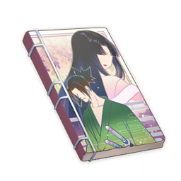
      </th>
      <th style="padding: 0; vertical-align: top;">
        

          

            亡国的美奈姬·卷一
            

          

          

            
                <strong>获取方式：</strong> 
           	    	稻妻「八重堂」购买
            
          

        

      </th>
    </tr>
    <tr>
        <th colspan="2" style="font-weight: normal;">
        <strong>描述：</strong> 
        				出生即被预言将要带来毁灭的公主陷入亡国的危机，此时一位不明真相的浮浪武士从天而降。 
战火纷飞的古风时代剧，二人的旅行，就此展开！
        </th>
    </tr>
    <tr>
        <th colspan="2" style="font-weight: normal;">
        <strong>阅读：</strong> 
平和十三年，时值战国之世。 
远离近畿的北方诸国，终于也被时代的气息所感染，卷入了战火之中。 
就像所有的战争一般，在经历了一番难以尽述的龙争虎斗之后，一方终于败北，于是城池烧为丘墟，城主的家眷与残党也逃入了山中。 
至此这一舞台也并没有什么特别之处。 
 
然而就在这时代剧的当口，一位衣着华丽的浮浪武士出现在了画面中。 
不，与其说是衣着华丽，不如更准确的说…… 
嗯，没错，是女装。 
与之相对的，随行的是一位身披大到过分的羽织的娇小女子。 
总之，无论怎么看都是可疑人士。 
不过似乎并没有意识到这一点一样，两人就这样大摇大摆的走到了山脚的关口。 
当然不出意外的被把守关卡的足轻拦下了。 
「来者何人！」 
虽然通常来说是句套话，不过这里应该是真诚的发问。 
「如您所看到的，只是普通的路人。」 
毫无说服力的回答。 
不过似乎是被武士无可置疑的语气震慑住了，问话的足轻竟然有些迟疑。 
「无论如何，请跟我们走一趟吧。」 
「果然不行吗……」 
武士的脸上露出了失望的表情，倏忽之间，三名足轻应声而倒。 
「果然从一开始就打算这样解决吧，真是恶劣的家伙。」 
身后的女子这样小声的吐槽着。
        </th>
    </tr>
  </thead>
</table>

### 亡国的美奈姬·卷二

<table class="table-weapon">
  <thead>
    <tr>
      <th class="th-weapon" rowspan="1">
        
      </th>
      <th style="padding: 0; vertical-align: top;">
        

          

            亡国的美奈姬·卷二
            

          

          

            
                <strong>获取方式：</strong> 
           	    	稻妻「八重堂」购买
            
          

        

      </th>
    </tr>
    <tr>
        <th colspan="2" style="font-weight: normal;">
        <strong>描述：</strong> 
        				「所谓带来毁灭的公主，说到底不过是战争的借口罢了。」 
为了了解预言的真相，向着世界中心前进吧！ 
超人气的浪漫冒险谭，仍在继续！
        </th>
    </tr>
    <tr>
        <th colspan="2" style="font-weight: normal;">
        <strong>阅读：</strong> 
「不是。」 
突然冒出这样一句话。 
不知名的山寺野庙中，黑色长发的公主正襟危坐，火光映照下的面目忽明忽暗。 
「不是，为什么要说不是。」 
条件反射一般的回答。 
「我说啊，笨蛋武士，关于带来毁灭的公主，你就没有一点评价吗？」 
「要说评价的话，听上去还挺有个性的。」 
「不是说这种评价。」美奈姬的话语有些无奈，「我是说对于救了我这件事……」 
「不，准确来说并不存在我救了你这件事。」 
武士纠正道。 
「当时的情况是身为公主的你命令我带你出来，所以从义理上来说，是你救了自己。」 
「武士会在意的点是这个吗？」 
意料之中的吐槽。 
其实只是在逃避责任罢了，武士这样想。 
 
「所谓带来毁灭的公主，说到底不过是战争的借口罢了。」 
稍微改变了慵懒的语气。 
「而且，」 
武士转过身来，空虚的眼神里点上了火光。 
「毁灭世界这种话，本来就蠢透了，很快你就会明白了。」
        </th>
    </tr>
  </thead>
</table>

### 亡国的美奈姬·卷三

<table class="table-weapon">
  <thead>
    <tr>
      <th class="th-weapon" rowspan="1">
        
      </th>
      <th style="padding: 0; vertical-align: top;">
        

          

            亡国的美奈姬·卷三
            

          

          

            
                <strong>获取方式：</strong> 
           	    	稻妻「八重堂」购买
            
          

        

      </th>
    </tr>
    <tr>
        <th colspan="2" style="font-weight: normal;">
        <strong>描述：</strong> 
        				踏入战争之地的二人，终于见识到了真正的阿鼻地狱。席卷世界的百年战火，其真相在此揭开！ 
本卷随书附赠超值周边！
        </th>
    </tr>
    <tr>
        <th colspan="2" style="font-weight: normal;">
        <strong>阅读：</strong> 
虽然人们常常将战场形容成地狱，但那不过是形容罢了。 
而出现在眼前的景象，只能说是字面意义上的地狱。 
荒芜的土地，枯萎的树木，以及行尸走肉一般的百姓。 
如同生命力被抽干了的状态。 
「事实上，」 
武士随手捡起了一片枯叶，随即化为了飞灰。 
「这里的生命力确实被抽取了。」 
 
近畿的战乱已经持续了百年。 
从战争的第十年开始，诸国的物资与财富就已经消耗殆尽了。 
使战争得以持续至今的是所谓的奈苦罗之术。 
奈苦罗之术是将一切生灵与大地中的生命力抽取出来，提供给上位的武士以及战争之用的可怖法术。 
利用这等非道的法术支配国土的便是被称为奈苦罗大名的盗国者们。 
大名们互相攻伐，但无论结果如何，大地上的生命力都会遭到进一步的掠取。 
这便是近百年来近畿诸国战争的实态。 
「而创造这种法术的，便是居于世界中心空之塔的阴阳师们。」 
 
无视已经因眼前的景象而动摇的美奈姬，武士继续幽幽地说道， 
「带来毁灭的公主……这个世界，不是早就在走向毁灭了吗？」
        </th>
    </tr>
  </thead>
</table>

### 亡国的美奈姬·卷四

<table class="table-weapon">
  <thead>
    <tr>
      <th class="th-weapon" rowspan="1">
        
      </th>
      <th style="padding: 0; vertical-align: top;">
        

          

            亡国的美奈姬·卷四
            

          

          

            
                <strong>获取方式：</strong> 
           	    	稻妻「八重堂」购买
            
          

        

      </th>
    </tr>
    <tr>
        <th colspan="2" style="font-weight: normal;">
        <strong>描述：</strong> 
        					「来自过去的亡灵，滚回地狱去吧！」 
激动人心的回忆篇！武士所封印的过去究竟是—— 
失去国家的公主与武士，两人的冒险，迎来新章！
        </th>
    </tr>
    <tr>
        <th colspan="2" style="font-weight: normal;">
        <strong>阅读：</strong> 
浓神国，几乎看不到一丝生命存在迹象的废土。 
无边的荒原所包围的是一座沙丘，两个武士模样的人相对而立。 
其中一位是我们故事的主角，这里为了区分暂且称之为青色武士。 
另一位是本卷初次登场的家伙，就叫做苍色武士好了。 
如果是剑戟片的话，这里应该摆出中段的架势了，但两人似乎并没有要一决雌雄的想法，只是单纯的相对站立罢了。 
 
「从地狱中回来了吗。」 
不知道过去了多久，苍色的武士终于忍不住说道。 
「真是令人怀念啊。」 
青色的武士好像很开心的样子。 
「我可不会怀念那种东西。」 
苍色武士不客气的打断。 
青色的武士闭上了眼睛，似乎坠入了过去的深渊。 
 
「只要打倒魔王一切就结束了，那时的我们还这样天真的以为，结果那不过是噩梦的开始罢了。 
十三名武士同心协力打倒了盗国的奈苦罗大名。 
然而没有大名的浓神国并没有迎来新生，土地中的生命力仍在不断地散失。 
不仅如此，失去支配者的国家，反而成为了邻国肆意掠夺的乐土。 
打倒魔王的勇士们，终于也无法守护国土。 
最终幸存下来的只有两个逃兵。」 
「回忆篇还是适可而止一点，我们还有事情并未了结吧！」
        </th>
    </tr>
  </thead>
</table>

### 亡国的美奈姬·卷五

<table class="table-weapon">
  <thead>
    <tr>
      <th class="th-weapon" rowspan="1">
        
      </th>
      <th style="padding: 0; vertical-align: top;">
        

          

            亡国的美奈姬·卷五
            

          

          

            
                <strong>获取方式：</strong> 
           	    	稻妻「八重堂」购买
            
          

        

      </th>
    </tr>
    <tr>
        <th colspan="2" style="font-weight: normal;">
        <strong>描述：</strong> 
        		「需要牺牲你去拯救的世界，还不如毁灭算了。」 
终于抵达世界中心的空之塔，两人的故事，将要迎来终点……了吗？
        </th>
    </tr>
    <tr>
        <th colspan="2" style="font-weight: normal;">
        <strong>阅读：</strong> 
「我决定要拯救世界！」 
美奈姬这样说道。 
「说了无数次了，根本就不存在拯救世界这回事。虽然有不知道多少个像我这样的白痴尝试过多少次，但说到底这个世界本来就是注定要毁灭的。」 
「我不管，我是公主，公主生来不就是要拯救世界的吗？」 
「不，从来没听过这种设定，而且据我所知你是毁灭世界的公主」 
「不是有什么人说过这种话，所谓毁灭，本来就是新生。」 
「虽然不知道你是从哪里听来的，但这种设定实在过于老套了。如果有人写出这种故事，还是赶紧扔进常夜国为好。」 
（捂住耳朵） 
 
空之塔顶，武士与公主在进行着毫无意义、旁若无人的对话。 
虽然这样说，但其实在场的还有好几位阴阳师打扮的人。 
「就像你们所知道的，奈苦罗之术最初的用途是为了将正在逐渐走向衰亡的世界中的生命力保存起来。」 
似乎是忍受不了这样的对话了，像是急于推进剧情发展的NPC，在场最年长的阴阳师终于开口说道。 
「而能运用这些被保存起来的生命力的便是……」 
 
「所以你能不能把这种想法去掉啊。」 
武士似乎根本没有听到一样，完全没有理会长者的话。 
这样的闹剧究竟什么时候才能完结呢？
        </th>
    </tr>
  </thead>
</table>

### 亡国的美奈姬·卷六

<table class="table-weapon">
  <thead>
    <tr>
      <th class="th-weapon" rowspan="1">
        
      </th>
      <th style="padding: 0; vertical-align: top;">
        

          

            亡国的美奈姬·卷六
            

          

          

            
                <strong>获取方式：</strong> 
           	    	稻妻「八重堂」购买
            
          

        

      </th>
    </tr>
    <tr>
        <th colspan="2" style="font-weight: normal;">
        <strong>描述：</strong> 
        	世界的真相终于揭晓，就像是彻底恶意的讽刺。分开的二人，仍然无法逃离命运的缠绕。 
《亡国的美奈姬》最终卷！但我们的故事并未完结！
        </th>
    </tr>
    <tr>
        <th colspan="2" style="font-weight: normal;">
        <strong>阅读：</strong> 
「所以，世界被拯救了吗？」 
故事的最后，武士孤身行走在无边的沙漠之中。 
空之塔的计划大概确实是完成了，世界上残存的生命力都被收集了起来。 
虽然不知道有没有创造出新的世界，但这个世界确实是毁灭了。 
不愧是毁灭世界的公主。 
「干脆把另一个世界也毁灭吧，如果存在的话。」 
武士开始了新的旅行。 
 
…… 
 
（本书剩下的部分是设定集，主要内容是并未在小说中出场的魔王与魔兽们。）
        </th>
    </tr>
  </thead>
</table>

### 日月前事

<table class="table-weapon">
  <thead>
    <tr>
      <th class="th-weapon" rowspan="1">
        
      </th>
      <th style="padding: 0; vertical-align: top;">
        

          

            日月前事
            

          

          

            
                <strong>获取方式：</strong> 
           	    	完成世界任务「龙蛇藏归辑录」后，在狭间之街探索获取。
            
          

        

      </th>
    </tr>
    <tr>
        <th colspan="2" style="font-weight: normal;">
        <strong>描述：</strong> 
        	禁止一般人接触的编年史，写法混杂了寓言和纪年。从开天辟地写到了大日御舆落成。
        </th>
    </tr>
    <tr>
        <th colspan="2" style="font-weight: normal;">
        <strong>阅读：</strong> 
我们想要记录的事情，是天上的意志如何在大地上拥有了形态。啊，天上之神，这些创造都是你们的作为。那就请你们启发我的神智，让我源源不断地记录。 
 
【鸽子衔枝之年】 
天上永恒的王座到来，世界为之焕然一新。然后真王，原初的那一位开始和旧世界的主人们，七位恐怖大王开战。那恐怖的大王们是龙。 
原初的那一位造出了自己发着光的影子。而影子的数量是四。 
 
【法涅斯，或者原初的那一位】 
原初的那一位，或许是法涅斯。它生着羽翼，头戴王冠，从蛋中出生，难以分辨雌雄。但是世界如果要被创造，蛋壳必须被打破。法涅斯——原初的那一位——却用蛋壳隔绝了「宇宙」和「世界的缩影」。 
 
【衔枝后四十余年】 
四十个冬天埋葬了火，四十个夏天沸腾了海。七位大王全部被打败，七个王国全部对天上俯首称臣。原初的那一位大王开始了天地的创造。为了「我们」——它最可怜的人儿将出现在这片大地。 
 
… 
 
【衔枝的四百余年】 
山川与河流落成，大海和大洋接纳了反叛者和不从者。原初的那一位和一位影子制造出了飞鸟、走兽和水鱼。它们还一起制造出了花草和树木。最后它们造出了人。我们的先祖的数目不可知晓。 
自此时起，我们先祖和原初的那一位立约。纪年也更迭一新。 
 
【箱舟开门之年】 
原初的那一位对人有一套神圣的规划。人只要幸福，它便欢欣。 
 
【箱舟开门的次年】 
人们耕耘，第一次收获。人们开掘，第一次收获贵金。人们聚集，第一次写就诗歌。 
 
【狂欢节之年】 
如果有饥馑，天上就落下食物与甘霖。如果有贫瘠，那大地就会生出矿藏。如果有忧郁蔓延，那么高天就会以声音回应。 
唯一的禁止之事，就是输给诱惑。但是诱惑的通道已经被封堵。 
 
… 
 
【葬火之年】 
天上的第二个王座到来，仿佛创世之初的大战再开。那一天，天也倾颓，地也崩裂。我们海渊之民的先祖，和他们世代栖居的土地，落入了此处。 
黑暗的年代由此开始。 
 
【黑暗的元年】 
七位大王的子民被海接纳，深海的龙嗣曾经统治这里。我们的先祖与它们发生了征战。 
先祖使用千灯将它们逐入影子，它们则在影子里狩猎人类。此处唯有黑暗，所以无处不是它们的猎场。 
人们的祈祷汇成哀歌，原初的那一位和其他三位发光的影子并不能听见。 
 
【太阳的比喻】 
黑暗的洞窟里，有一群未曾见过光的人们在生活。有一位见过太阳的贤人，对着洞窟的众人描绘着光之下的生活与太阳的伟大。他见众人无法理解，于是点起了火。人们于是开始崇拜火，以为这个是太阳，甚至开始习惯了黑暗与火光的生活。 
贤人死后，有人霸占了火，通过火，投下了自己巨大的影子。 
 
【忘忧莲的比喻】 
看见就会忘记忧愁的莲花。在漫长的旅行中，寻找归途的船长遇到了一群以这种莲花为食的人。有的人留下了，有的人抗拒了这种诱惑。 
活着就是无尽的苦海。我们只是在寻找归途。 
 
【黑暗的第三年】 
唯一没有抛弃我们的那一位，她乃是「时间之执政」。她是时刻，是无时不刻，是千风与日月之度量。她是一切欢欣之时，一切愤怒之时，一切渴望之时，一切迷狂之时。她是一切谵妄的时刻。 
我们称呼她「卡伊洛斯」，或者「不变世界的统领与执政」。真正秘密的名字，我们不敢直言，所以在这里倒写。「露塔斯伊」——我仅提一次。 
 
… 
 
【目盲之年】 
贤人阿布拉克他被开启了神智，他展示了从手中发出光的奇迹。先祖们以他为首领，开始建设「赫利俄斯」。 
 
… 
 
【目明之年，或日月的元年】 
「赫利俄斯」——太阳的神车，终于落成。白夜到来，常夜消散。 
日月的纪年开始了。 
 
【日月的二年】 
先祖们尝试寻找归途。地表的大战应该已经结束。 
但是原初的那一位，第一个王座，布下了禁令。先祖们无法找到归家之路。 
既然是如此，那原初的那一位，应该打败了后来的第二位吧。 
阿布拉克被太阳之子下令囚禁。 
 
【树的比喻】 
王的园丁与御园的树精相爱。但是国王想要新修凉亭的雕梁，需要砍伐最有灵气的那一棵灵木。国王是原初的那位之化身，因此园丁无法违逆万王之王，唯有对着国王的祭司祈祷。祭司乃是常世大神的化身。 
祭司怜悯园丁，于是说，你去折下灵树的枝条吧。园丁便去折枝，然后听从国王的命令砍伐了灵木。 
随后祭司说，你去种下灵木的枝吧。园丁说，灵木长成，需要五百年。祭司说，一念则千劫尽。于是园丁在自家后院种下了树枝。结果一瞬间，细枝长成了新树，那新树精是曾经树精的延续。 
因为那时刻之神，可以把「种子」的「这一刻」带到过去与未来。 
 
【日月之十年】 
阿布拉克故去已久。日月之前的事情已经记录得足够。若无把一切按事实记写的胆量，哪里能成为常世大神的书记呢？ 
我听到了门外盔甲的声音，我于此绝笔。
        </th>
    </tr>
  </thead>
</table>

### 白夜国地理水文考

<table class="table-weapon">
  <thead>
    <tr>
      <th class="th-weapon" rowspan="1">
        
      </th>
      <th style="padding: 0; vertical-align: top;">
        

          

            白夜国地理水文考
            

          

          

            
                <strong>获取方式：</strong> 
           	    	完成世界任务「龙蛇藏归辑录」后，在狭间之街探索获取。
            
          

        

      </th>
    </tr>
    <tr>
        <th colspan="2" style="font-weight: normal;">
        <strong>描述：</strong> 
        		记载了白夜国地理和水文的工具类图书。随着海渊的封门以及海祇民的集体移居，再加上漫长时光的变动，这本书已经没用了。
        </th>
    </tr>
    <tr>
        <th colspan="2" style="font-weight: normal;">
        <strong>阅读：</strong> 
海渊之下的土地和地面的风貌有巨大差异，常理并不适用。加之曾经的地理与水文知识，也是直接由天上传授的。我们对自身所处世界的研究，连方法都只能自己摸索。一切唯有从头开始。 
读此书之后人谨记，莫要以为自己所过之生活为平常之事。虽然千百年后，人们会习惯这种生活。但是请谨记——天中无日月的生活是异常的。就算有贤人在这里描绘太阳，也一定会有腌臜之徒借着光投下巨大的影子。 
此书只是为了让人们理解自己所处的世界，切莫忘记重新寻回光的心。 
（本书随着时代变化不断修订删改，称呼也从海渊之土变为「常世国」，随后变化为「白夜国」。后因海祇垂怜，渊下之民复归海面。但总序之「海渊之土」有特殊意义，不做统一改订。） 
 
-风与水之事 
白夜国土没有山之走向，讨论山系没有意义。但是我们之中的祭司和贤人察觉到了一点：就算是在这片海渊之下，仍然有「不灭风」和「水」的力量。「不灭风」，人格化称之「常世大神」，或者诗体修辞为「千风」、「时之千风」；「水」则是深海龙蜥的龙蜥界之力。 
我们已经有了一门学问推算「阳炎」与风、水之关系。所以在兴动土木之前，需要考虑水文与不灭风的影响。 
 
-白夜国的边陲 
白夜之国土，以三角三隅为标。曾经这里就是人类势力与龙蜥势力拉锯的极限了。 
三角在白夜国时期修建有三界塔，用来调和三界。古时的名字已经失传，在海祇到来之后，才改了现在的名字。 
三界塔非常重要，并且不处在风与水的体系下。甚至与之相反，它们负责平衡整个白夜国的倾向，控制着白夜国的风与水。 
一旦三界塔出现问题，整个白夜国将有大灾。因此它们由秘法隐去，仅能由巫女与御使唤出。 
 
-狭间之街 
最早狭间之街夹在山壁和方圆之地中，因此才被称为狭间之街。但是随着白夜国极端异常的地理变动，几百年内，方圆之地就崩落进了深渊。狭间之街反而成为了一片广阔。 
 
-蛇心之地 
这里自先祖发现之日起，就存在一个神奇的现象：空间会在某一处交叠。后来这个现象被我们的先人利用，修建了蛇心的祭坛。人们使用这个地方保管秘密、囚禁犯人，并且崇拜幻想出来的大蛇「奥罗巴洛斯」。 
最早这里叫做德尔斐，意思是蛇之地。后来海祇大神到来，蛇之地的名字并没有改变。一般古早绘画，无鳞蛇为「奥罗巴洛斯」，有珊瑚的蛇为「远吕羽氏」。 
 
-大日御舆 
最早的名字是「赫利俄斯」，乃是贤人阿倍良久所设计的高塔。风、水之中属黄。 
根据预言，它应该就是贤人所展示的太阳，用来照亮没有见过光的洞穴。同样，根据预言，它后来也被用来投下巨大的影子。
        </th>
    </tr>
  </thead>
</table>

### 深海龙蜥实验记录

<table class="table-weapon">
  <thead>
    <tr>
      <th class="th-weapon" rowspan="1">
        
      </th>
      <th style="padding: 0; vertical-align: top;">
        

          

            深海龙蜥实验记录
            

          

          

            
                <strong>获取方式：</strong> 
           	    	完成世界任务「龙蛇藏归辑录」后，在狭间之街探索获取。
            
          

        

      </th>
    </tr>
    <tr>
        <th colspan="2" style="font-weight: normal;">
        <strong>描述：</strong> 
        			深海龙蜥的实验记录。实验中并没有龙蜥死亡。
        </th>
    </tr>
    <tr>
        <th colspan="2" style="font-weight: normal;">
        <strong>阅读：</strong> 
…自今日起，龙嗣之实验课题改为海祇大御神亲自指定之课题。海祇纪年元年之前所有档案全部销毁。卷宗序号废止阿尔法、贝塔、伽玛、德尔塔、艾普西隆古海祇语字归档分类法，启用地、水、火、风、以太、虚空为新分类。 
注经与引用应写于（【】）内。依序写明卷宗头-序号-题名-著者。著者可以忽略，或写研究所内之号，严禁暴露研究人员之古白夜国/渊下宫名或现代海祇/鸣神/稻妻式名字。 
不要在实验记录里写日记、情书和幻想小说。 
 
… 
龙嗣（以下通称深海龙蜥、龙蜥）的进化能力有目共睹。（【水卷-壹〇壹-龙嗣的进化·一】）。 
我们尝试降低幼年抗高温龙蜥生存空间的温度。它在成年之后变得衰弱。恐怕是因为它身体中并没有对抗这种环境的「种子」。但是它的子代却全部拥有了高体脂、多眠、冰元素的特性。（参看正文背后的实验数据。样本三出现特异数据是因为我助手同情抗饥饿对照组的实验对象，私下进行喂食。） 
此时再将它们的子代送入酷暑环境，它们和曾祖代一样，成年后选择了抗热特性。只不过目前没有出现火元素特征。 
尚不足以得出结论，但是可以印证猜想。深海龙蜥可以在成年前自由觉醒自身的「种子」。而龙蜥母体在遭遇未曾见过的严苛环境时，可以编制新的「种子」留给子代。 
深海龙蜥在与我们渊下宫民遭遇之前，体内就潜藏着一整个军械库了。 
… 
 
智能实验的结果令人惊讶。（【虚空-贰零柒-龙蜥的智力研究】）。通过惩罚、奖励并行的机制进行筛选（其实根据之前的研究，筛选并不必要。龙蜥每个个体都是完美适应者），四代后的龙蜥，语言理解能力已经逼近十二岁智力水平的人类学童。或者应该更严谨点说，龙蜥们本来就拥有自己的交流方式，它们在此是展现出了学习的能力。 
我们认为应该停止这个研究。不然上一个写龙蜥人幻想故事的家伙被开除可能会显得我们见识短浅。 
根据预言，水之龙王会以人形诞生。我们绝不能让这件事发生在渊下宫。 
… 
之前的移植都失败了。（【虚空-玖零柒-海祇大御神特令·一】）。因为容不下海祇之血，龙蜥的身体会出现各种不良反应。不知道是不是因为仍然不够强大。通过规划龙蜥的进化路线，我们已经培育出了理论上最强的龙蜥才是。 
… 
 
移植基本算得上成功。（【虚空-玖零柒-海祇大御神特令·三】）。排异原来是龙蜥作为光界生物（或称元素生物），与大御神以及珊瑚眷属之人界力相杀的原因。 
 
所有实验记录卷宗作结。实验于此竟，所载并无一龙嗣因实验殒命，皆得寿终。 
礼赞海祇大御神之慈心。
        </th>
    </tr>
  </thead>
</table>

### 光昼影底集

<table class="table-weapon">
  <thead>
    <tr>
      <th class="th-weapon" rowspan="1">
        
      </th>
      <th style="padding: 0; vertical-align: top;">
        

          

            光昼影底集
            

          

          

            
                <strong>获取方式：</strong> 
           	    	完成世界任务「龙蛇藏归辑录」后，在狭间之街探索获取。
            
          

        

      </th>
    </tr>
    <tr>
        <th colspan="2" style="font-weight: normal;">
        <strong>描述：</strong> 
        				面向九岁到十二岁年龄段的益智类图书。作为特殊过渡时期的版本，下附了古代白夜国姓名的鸣神式改称法。
        </th>
    </tr>
    <tr>
        <th colspan="2" style="font-weight: normal;">
        <strong>阅读：</strong> 
谜面1. 什么东西清晨四只脚，白日两只脚，夜晚三只脚？ 
谜底： 中午化身成人去参加了舞会，摔断了腿只能拄拐杖的龙蜥。 
这个答案其实是贤人们最喜欢的，往往也只有小朋友们才能答对。龙蜥化人对大人来说是一种恐怖的阴谋，根据古代预言，水之元素龙王一定会以人形重生。对于孩子来说，则揭示了相互理解的可能。 
但是这样把龙蜥弄得可爱也有其弊病。虽然消解了恐惧，却也让孩子们失去了警戒。 
（深海龙嗣们进化出了其他元素，失去了纯粹。它们族群已经不会诞生龙王了。） 
 
谜面2. 此物只有嘴一张，腿数却是四、二、三。什么事物乏术化他形，却可以寻见地、海与天空。什么事物行走用的腿越多，生息气力就越孱弱？ 
谜底： 人。 
人在婴孩时代用四肢爬行；长大之后，就开始两腿走路了；等到了老年，就只能拄拐了。毫无疑问，这个经典谜题的答案是人。 
 
谜面3. 什么事物只有一张嘴会说话，腿数却是四与二。 
谜底： 畜牧的生活。 
这个谜语非常古老，我们以前只能从文本上理解畜牧的意思。四条腿指的是「尼乌」、「宇麻」和「林彘」这类生物。在白夜国崩落地底之后，这些生物因为缺少繁衍的环境和食物，也在两代内灭绝了。 
海祇大御神到来之后的这段时间里，有一些住民已经去往海面开拓家园、交流文化了。因此我们得以勘校这些生物的通名。根据御使与大御神的预言，我们迟早有一天会全部去往海面上，所以校正名字是很必要的。 
「尼乌」为牛，「宇麻」为马，「林彘」为林猪。 
 
谜面4. 有一对姐妹，她们每一天都会生下对方。请问她们是谁？ 
谜底： 日与夜，或白夜与常夜。 
这个谜语很好理解，日夜轮换。在白夜国则是大日御舆的白夜与常夜轮转。虽然大日御舆建设完成之前，一直都是常夜，但是并不影响曾经人们见过白昼之光。 
顺带一提，白夜国特殊的蜃楼现象与罪影的名字最早都叫「爱多隆」，人们认为二者本质一致。后来随着海祇大御神到来，人们理解了这两种现象，自此命名才分开。虽然并无白日，但是白夜里出现的蜃楼幻景仍然被叫做「阳炎幻」，常夜中的则被叫做「不知火幻」。随着时间推移，两者因原理一致被统一叫做「阳炎幻」了。 
 
谜面5. 我是光明之父的晦暗子嗣。我是无翼的鸟儿，由地升天。见我者流泪，并非出自哀愁。微风吹拂，我刚出生便消逝。 
谜底： 答案是烟。鸟儿是一种会飞有翅膀的生物，渊下宫见不到很正常。 
 
谜面6. 一个父亲有十二个孩子，每一位又各自有六十位容貌各异的女儿。这些女孩一位白一位黑，如此反复。他们一家全都不朽，只是会暗暗凋零。请问父亲是谁？ 
谜底： 答案是「年」。六十位黑白相间的孙女可能会让白夜国之民一下子想不明白。但是理解了谜题4就知道是怎么回事了。 
以及这谜题远古时期还有个后续版本。大概意思是，每个孙女又各自有十二个孩子，每个孩子为他们的母亲生下了六十个外孙。外孙们也有自己的六十个孩子，每个孩子又有自己的子孙。直到最后，所有的子孙们共同产下了唯一、原初的后代。这个后代就是常世大神，也是一百四十亿个「年」的母亲。 
海祇大御神禁止了这个谜题的流传。 
 
… 
 
「附录」- 历史人物、传统姓名-鸣神式改称法 
 
卡伊洛斯-常世大神 
…丝-有栖 
阿布拉克-阿倍良久 
喀戎-华… 
斯巴达克-须婆达 
艾玛-绘真 
…-鲤 
安提戈涅、安提戈努斯-安贞 
… 
… 
厄尔玻斯、厄伯斯-艾波西、乌帽子 
厄喀翁-江木 
乌代…-宇坨 
阿斯克勒庇俄斯-栖令比御 
…
        </th>
    </tr>
  </thead>
</table>

### 稻妻秘见录·卷一

<table class="table-weapon">
  <thead>
    <tr>
      <th class="th-weapon" rowspan="1">
        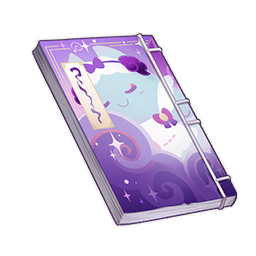
      </th>
      <th style="padding: 0; vertical-align: top;">
        

          

            稻妻秘见录·卷一
            

          

          

            
                <strong>获取方式：</strong> 
           	    	活动任务「三川游艺绮梦谭」场地获得；后可在稻妻「八重堂」购买。
            
          

        

      </th>
    </tr>
    <tr>
        <th colspan="2" style="font-weight: normal;">
        <strong>描述：</strong> 
        					来自枫丹的旅行随笔作家收集整理的稻妻民间故事集，以不同人讲述的各类怪谈与传说为主。
        </th>
    </tr>
    <tr>
        <th colspan="2" style="font-weight: normal;">
        <strong>阅读：</strong> 
玄坊女 
 
许久之前，有一位名叫蛇介彦的奉公人。这位青年生得俊雅非凡，又勤修文才武艺，深受同侪敬重。一日，他到卫门督家中探病，正好遇到了其独女，名叫纱夜姬。那少女年方裳着，美貌无与伦比，一颦一笑，一举一动，都显着天生的温柔和优雅。二人一见钟情，坠入爱河，很快便瞒着卫门督私定终身，只待元服后登门求亲。 
 
然而急景流年，没过多久，正赶上叛军作乱，蛇介彦便也决心追随幕府的御令，前去征讨反贼。纱夜姬得知这一消息，急匆匆地找到了他，流着泪对他说： 
 
「贵殿今时出征，不知何日才能回还。况且战场凶险，但有不测之忧，小女子定难独生。若是您真的爱我，就请您留在这里，让我做您的新娘吧。小女子只愿与贵殿共享一世幸福，别无荣华富贵之求。」 
 
随后，纱夜姬当即咏了一首短歌，大致内容翻译过来是这样的： 
相思何苦念何深，珠泪难干满袖襟。 
妾身犹似秋朝露，为君散作镜中尘。 
 
蛇介彦却没有被她的话语劝服，而是回答道： 
 
「小姐不必心忧，虽是短暂离别，我心仍只属小姐一人，七生七世，矢志不渝。况且男子生于世间，又恰逢立身扬名之时，怎能坐视他人立下赫赫战功？待我自战场归来，便与小姐成婚，永不分离。」 
 
说罢，蛇介彦将一枚装饰精美的手镜赠送给纱夜姬，以此作为日后开镜礼的许诺，又作了一首短歌相应，大致内容翻译过来是这样的： 
此别重逢未有期，但言一誓永无移。 
我心定随君在处，千里同光共相依。 
 
就这样，又过去了数月。这时有谣言说，幕府军在交兵中落败，将士伤亡惨重。听闻此言，少女忧郁成疾，没过多久竟因悲伤过度而病逝了。功成名就的蛇介彦从战场上归来，听闻心上人已与他阴阳两隔，不觉悲不自胜，每日为她焚香奉果。 
 
然而，也许是因为思念心切，下葬后，纱夜姬非但没有得到安宁，反而为深渊所侵染，化作了妖鬼，于夜半之时造访了蛇介彦。此时的少女虽依然青春貌美，却已没了半点生气，意图爱抚他面颊的双手，也已经化作了幽幽黑骨。蛇介彦虽是武士，却也被少女这副模样吓得魂飞胆颤，拔腿就跑，一路飞奔来到了河川前，恳求船夫载自己过河，助他保住性命。待纱夜姬追到河边时，已经一艘船都没有了，于是她便跳进了河中，将双腿变作鱼鳍，追着他上了岸。 
 
逃进了影向山里的蛇介彦凭借从妖狸那里学会的法术，藏进了一块石头里。影向山遍地都是石头，任凭纱夜姬苦苦寻找，又怎么找得到呢？就在纱夜姬不知所措的时候，蛇介彦当初送给她的手镜不慎掉落在地。镜子破裂成无数碎片，每一片都映出了蛇介彦藏身的那块石头。 
 
纱夜姬将那块石头捧在怀中，哀泣着向爱人述说思念之情，请他想起当初的誓言，可蛇介彦却依然因为恐惧而不敢现身。纱夜姬已经无计可施，却又不愿与心上人分离，心焦如焚，最后竟化成一团火，将自己连同躲在石头里的恋人一并烧成了灰烬。 
 
友人说罢，饶有兴趣地问我对这个故事有什么看法。 
 
「若是以我们枫丹人的目光来考量，」我回答道，「这位蛇介彦先生着实不能算是倾心爱慕纱夜姬的。在我们的歌剧中受到咏颂的眷侣，若是有一方不幸亡故，另一方也会选择追随爱人而去。从戴思与爱绮妲的约定，到堂克勒德与夏蕾克莱娅的交手，再到科培琉司与歌裴莉娅的辞别，无一不是如此。我记得，在我国有一本古典小说，对爱的定义是这样的：哪怕割掉所有的肉、骨与内脏，我也会在骨髓中伴你同床——既然已经许下了七生七世永不分离的誓言，就算对方已经被深渊侵染，也要与对方一同坠入永眠。蛇介彦先生既然是稻妻的武士，对于诺言与约定，理应看得比我更重。」 
 
「当然，您的说法没有错。在稻妻，人们也大多认为蛇介彦是怯懦的背信弃义者。不过嘛，理由倒不是因为他没有回应纱夜姬的感情，而是因为他在面对来自深渊的妖邪之物时，竟选择了逃避，将自己藏进了石头里，而非帮助爱人解脱。至于最后被亲手送出的镜子照见，化作灰烬，也可以说是自食其果。」友人向她自己的杯子里添上茶，接着说道，「据说，这个故事原本也是受到来自璃月的小说启发。在那个故事里，主人公从始至终都没有背叛心上人，二人久久不能相见，则是因为有奸恶之徒从中作梗，将变成了妖物的少女镇在了石底——不过，那就和这个版本的传说没有什么关系了。我更好奇的是，若是类似的事情发生在您身上，您又会如何选择呢？比方说，如果我被深渊侵蚀变成了魔物，主动找上您，让您继续给我讲故事…」 
 
「如果您被深渊侵蚀变成了魔物，第一反应却是来找我听故事，那就说明您完全没事。毕竟，您比怪谈中的纱夜姬难缠多了。好啦，宇佐小姐，这杯茶喝完了，请您为我续上吧。」
        </th>
    </tr>
  </thead>
</table>

### 稻妻秘见录·卷二

<table class="table-weapon">
  <thead>
    <tr>
      <th class="th-weapon" rowspan="1">
        
      </th>
      <th style="padding: 0; vertical-align: top;">
        

          

            稻妻秘见录·卷二
            

          

          

            
                <strong>获取方式：</strong> 
           	    	活动任务「三川游艺绮梦谭」场地获得；后可在稻妻「八重堂」购买。
            
          

        

      </th>
    </tr>
    <tr>
        <th colspan="2" style="font-weight: normal;">
        <strong>描述：</strong> 
        					来自枫丹的旅行随笔作家收集整理的稻妻民间故事集，以不同人讲述的各类怪谈与传说为主。
        </th>
    </tr>
    <tr>
        <th colspan="2" style="font-weight: normal;">
        <strong>阅读：</strong> 
食梦貘 
 
很久很久以前，在绀田村附近，住着一对老夫妇。二人虽家中贫寒，生活艰辛，却心地良善，受人敬重。 
 
一个下雪的冬天，老爷爷进山采樵，见到一头肥肥胖胖的小兽被捕猎的陷阱困住，怎么挣扎也动弹不得，只能呜呜地叫着，看上去甚是凄惨。 
 
「真是可怜呐！」老爷爷心生不忍道，「这么小的林猪，却落到了猎人的陷阱里。唉，就算被抓住，也没有多少肉，还白白丢了性命。我来给你解开吧！」 
 
于是，老爷爷放下手中的斧头，帮小林猪解开了束缚在它蹄子上的绳索。小林猪呜呜地叫了两声，开心地绕着老爷爷跑了好几圈，就逃回树林里去了。 
 
老爷爷砍完柴，回到家中，和老奶奶说起了这件事。老奶奶听罢，也感到非常高兴，说：「哎呀，您还真是做了一件好事哩！等小林猪长大，就有更多的肉可以吃啦！」 
 
这天晚上，老夫妇二人正打算睡觉，突然听到有人敲门，从门外传来一个温婉动听的年轻女声： 
 
「打扰了！请问有人在家吗？」 
 
这么大的雪，怎么还有人在外面呢？老奶奶打开门一看，居然是一位十七八岁的年轻姑娘，顶风冒雪站在门外。那姑娘极为美貌，虽说衣着质朴，却也难掩天生丽质，简直就像是璃月传说里的仙女那般。老奶奶见状心生怜惜，连忙说道： 
 
「唉！雪下得这么大，一定冻坏了吧！请您快进屋，烤烤火，暖暖身子！不知您是哪家的小姐，这么晚来找我们有什么事呀？」 
 
「这么晚了，却冒昧打扰您，实在是非常抱歉。我的父母不幸过世，我原本是按照他们的遗嘱，前去投靠父亲生前的友人，只是没想到会下这么大的雪，让我在傍晚时迷了路。不知您二位能否让我在您家中借宿一晚，只要让我睡在走廊或者仓库里就好。」 
 
老爷爷和老奶奶听了便心生同情，于是让姑娘在家中住了下来，为她准备好了饭食和床铺。也许是因为行善的缘故，那天夜里，老爷爷和老奶奶都做了特别美妙的梦。 
 
接下来的数日，雪都下个不停，姑娘便在老夫妇家中住了下来。这段时间，那姑娘一直在悉心照顾老爷爷和老奶奶的起居，平日里又勤恳又体贴，所有的活儿都做得一丝不苟，两人都非常高兴。 
 
这天，姑娘突然对老爷爷和老奶奶说： 
 
「就像我之前对二老说过的，我的双亲过世前，将我托付给了父亲的友人。不过，虽说是友人，我也从未见过面，不清楚对方究竟是什么样的人，是否愿意接受我这个累赘。这些日子，两位贴心照顾我，我不知道应该如何报答，若是两位不嫌弃的话，我愿请二位干脆收我为养女，我虽然只是个普通的姑娘，却也愿意尽自己的绵薄之力，自此孝顺二位。」 
 
老夫妇听到这话，心里高兴极了。二人不曾有过一儿半女，能认这么聪明体贴的姑娘做女儿，自然是心满愿足。从那以后，老夫妇就像是对待自己的亲生女儿那样对待姑娘，而姑娘也十分孝顺，无论是人前人后，表现得都无可挑剔。 
 
又过了一段时间，这天早晨起来，姑娘端出了老夫妇从未见过的、看上去就无比美味的点心，对二人说： 
 
「二老睡觉的时候，我已经按照家族传承的食谱，悄悄做了些点心。请您将这些点心拿到镇子上去卖吧，一定会大受欢迎的。」 
 
果然，就像姑娘说的那样，美味的点心受到了富商的欢迎，卖出了相当高的价格。从那以后，每天早上，姑娘都会呈上一批点心，让老爷爷去镇子上贩卖，老夫妇的生活也因此变得越来越富有了。 
 
这样反复几次，老夫妇不由得好奇：家里只有普通的面粉，女儿到底是如何做出这么美味的点心的呢？终于，老夫妇按耐不住好奇心，这天夜里，在姑娘做点心的时候，悄悄往门缝里看了一眼。不料房间中没有姑娘的踪影，只有一头肥肥胖胖的小兽，正在用短短的鼻子勾住漂浮在空中的梦，将它做成点心。老爷爷和老奶奶吓了一跳，小兽察觉到了二人，连忙变回了年轻的姑娘，来到老夫妇面前，跪伏在地，说道： 
 
「实在是非常抱歉，让二位恩人受惊了。既然二老已经见到了我的模样，那我也不必再有所隐瞒。我就是之前在山中被老爷爷救下的貘，为了报答您的恩情，我变成少女的姿态前来见您，将您的噩梦做成美味的点心，供您拿去在市场上卖个好价钱。」 
 
「啊呀！」老爷爷惊呼道，「原来你是那时的小林猪！」 
 
「首先，我不是林猪，我是从璃月来的貘。其次，您已经识破了我的真身，若是消息不胫而走，我家的女主人——就是统管着无数美梦与噩梦的那一位——定不会轻易饶恕我冒昧的行为，到那时，您说不定也会被我牵连。这些天来，承蒙两位的照顾，也给两位添了不少麻烦。不过，我还是希望您能相信，我是真心实意地希望能成为两位的女儿，只是今生今世，这样的愿望恐怕是没有办法实现了。那么，就请您允许我告辞吧。」 
 
「貘？从来没听说过。不管是人还是林猪，你都是我们的女儿嘛！」 
 
「我从心底感谢您的良言美意。可是，如果有貘在这里的消息传扬出去，说不定会造成明日的灾祸。另外，我不是林猪，我是貘。」 
 
「哎呀，这有什么关系嘛！只要你不说，这里有谁会知道你是什么『貘』呢？就算有人驯养林猪，也不会让其他人觉得奇怪呀！」 
 
「您的说法的确不无道理。不过，我不是林猪，我是貘。」 
 
就这样，小貘决定留在老夫妇身边，和他们生活在一起。靠着她做出的那些美味的点心，老爷爷和老奶奶安逸幸福地度过了晚年。可喜可贺，可喜可贺。
        </th>
    </tr>
  </thead>
</table>

