# 摆设

## 装潢

### 枫木拱顶墙

<table class="table-weapon">
  <thead>
    <tr>
      <th class="th-weapon" rowspan="1">
        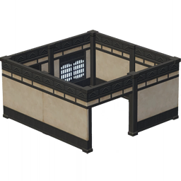
      </th>
      <th style="padding: 0; vertical-align: top;">
        

          

            枫木拱顶墙
            

          

          

            
                <strong>星级：⭐⭐⭐</strong>
            
          

        

      </th>
    </tr>
    <tr>
        <th colspan="2" style="font-weight: normal;">
        <strong>描述：</strong> 
        	饰有枫木拱顶结构的墙体，结构稳固。素白墙面所用的漆层更偏向于彩画所用的颜料，因此颇有几分素雅的观感。
        </th>
    </tr>
  </thead>
</table>

### 枫木褐彩地板

<table class="table-weapon">
  <thead>
    <tr>
      <th class="th-weapon" rowspan="1">
        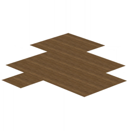
      </th>
      <th style="padding: 0; vertical-align: top;">
        

          

            枫木褐彩地板
            

          

          

            
                <strong>星级：⭐⭐⭐</strong>
            
          

        

      </th>
    </tr>
    <tr>
        <th colspan="2" style="font-weight: normal;">
        <strong>描述：</strong> 
        	以明亮漆面的「枫木」铺设的地板，切削工艺极为精妙，隐藏了地板之间的缝隙，像是一整块庞大平整的褐色木材。
        </th>
    </tr>
  </thead>
</table>

### 枫木方格天花板

<table class="table-weapon">
  <thead>
    <tr>
      <th class="th-weapon" rowspan="1">
        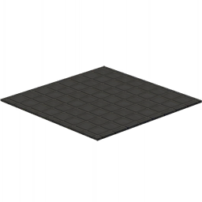
      </th>
      <th style="padding: 0; vertical-align: top;">
        

          

            枫木方格天花板
            

          

          

            
                <strong>星级：⭐⭐⭐</strong>
            
          

        

      </th>
    </tr>
    <tr>
        <th colspan="2" style="font-weight: normal;">
        <strong>描述：</strong> 
        	以「枫木」制作的天花板，纹路简约，色调深邃，如同墨色弥漫的夜空，有种含蓄的美感。
        </th>
    </tr>
  </thead>
</table>

### 枫木吊灯-「显光」

<table class="table-weapon">
  <thead>
    <tr>
      <th class="th-weapon" rowspan="1">
        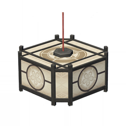
      </th>
      <th style="padding: 0; vertical-align: top;">
        

          

            枫木吊灯-「显光」
            

          

          

            
                <strong>星级：⭐⭐⭐</strong>
            
          

        

      </th>
    </tr>
    <tr>
        <th colspan="2" style="font-weight: normal;">
        <strong>描述：</strong> 
        	融合了稻妻与异邦风格的室内吊灯，采用了平顶平底的八边形设计，相较于稻妻本土的传统灯笼，外观较为新颖。在社奉行的某位家政官看来，这种造型的灯具便于放置在平坦的桌面上，拆解与清洁极为轻松，照明效果也略胜传统的稻妻灯笼一筹，相当实用。
        </th>
    </tr>
  </thead>
</table>

### 垣屋枫木房门

<table class="table-weapon">
  <thead>
    <tr>
      <th class="th-weapon" rowspan="1">
        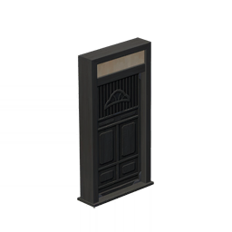
      </th>
      <th style="padding: 0; vertical-align: top;">
        

          

            垣屋枫木房门
            

          

          

            
                <strong>星级：⭐⭐⭐</strong>
            
          

        

      </th>
    </tr>
    <tr>
        <th colspan="2" style="font-weight: normal;">
        <strong>描述：</strong> 
        	以「枫木」制成的房门，花纹古雅，坚实耐用，且适用性较强，安放在其他风格的建筑中也不显得突兀。
        </th>
    </tr>
  </thead>
</table>

### 垣屋枫木房门

<table class="table-weapon">
  <thead>
    <tr>
      <th class="th-weapon" rowspan="1">
        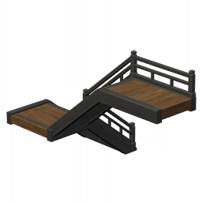
      </th>
      <th style="padding: 0; vertical-align: top;">
        

          

            垣屋枫木房门
            

          

          

            
                <strong>星级：⭐⭐⭐</strong>
            
          

        

      </th>
    </tr>
    <tr>
        <th colspan="2" style="font-weight: normal;">
        <strong>描述：</strong> 
        	转角构型的枫木阶梯。建造这型楼梯的木材并未经受传统的烘干处理，保留了恰到好处的水分，配合独特的表面工艺，踩踏其上的质感柔软，据说可以减轻上下楼梯的疲劳感。
        </th>
    </tr>
  </thead>
</table>

## 大型摆设

### 孔雀木「万角」货柜

<table class="table-weapon">
  <thead>
    <tr>
      <th class="th-weapon" rowspan="1">
        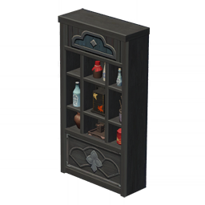
      </th>
      <th style="padding: 0; vertical-align: top;">
        

          

            孔雀木「万角」货柜
            

          

          

            
                <strong>星级：⭐⭐⭐</strong>
            
          

        

      </th>
    </tr>
    <tr>
        <th colspan="2" style="font-weight: normal;">
        <strong>描述：</strong> 
        	常见于稻妻商铺的货柜，由深色漆面的「孔雀木」制成。 
这种货柜的侧框和背板设有大量拼接的榫槽，每块主要格板都能拆卸重组，从而达成自由排布货柜窗格的效果。 
稻妻的大多商铺的面积并不充裕，因此，这种能够更改窗格，充当「万种角色」的货柜相当实用。
        </th>
    </tr>
  </thead>
</table>

### 孔雀木「不染」橱柜

<table class="table-weapon">
  <thead>
    <tr>
      <th class="th-weapon" rowspan="1">
        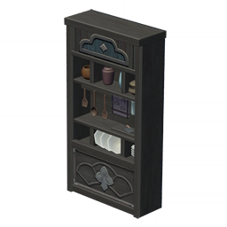
      </th>
      <th style="padding: 0; vertical-align: top;">
        

          

            孔雀木「不染」橱柜
            

          

          

            
                <strong>星级：⭐⭐⭐</strong>
            
          

        

      </th>
    </tr>
    <tr>
        <th colspan="2" style="font-weight: normal;">
        <strong>描述：</strong> 
        	常见于稻妻的橱柜，由深色漆面的「孔雀木」制成，常见于临街的料理亭。 
相较于商店所用的货柜，这种橱柜的木材表面采用了特殊的干燥工艺，漆面较薄，对浮尘和油烟的防护效果更好。据说这种橱柜使用十年都不会沾染明显的污垢。
        </th>
    </tr>
  </thead>
</table>

### 梦见木「露隐」衣柜

<table class="table-weapon">
  <thead>
    <tr>
      <th class="th-weapon" rowspan="1">
        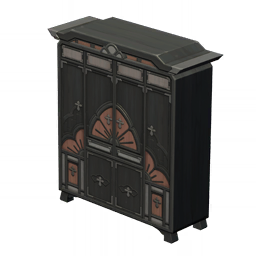
      </th>
      <th style="padding: 0; vertical-align: top;">
        

          

            梦见木「露隐」衣柜
            

          

          

            
                <strong>星级：⭐⭐⭐</strong>
            
          

        

      </th>
    </tr>
    <tr>
        <th colspan="2" style="font-weight: normal;">
        <strong>描述：</strong> 
        		封闭式的稻妻衣柜，厚度与壁柜均根据稻妻着物的特性进行了调整。 
稻妻城三面临海，水汽极为充沛，环境潮湿，衣物久置后容易受潮发霉。因此，这种衣柜内部上方设有可更换的木盒，盒中放有熏干的花瓣和木屑，用于吸收水分，控制湿度，效果相当不错。
        </th>
    </tr>
  </thead>
</table>

### 枫木书柜-「墨染书心」

<table class="table-weapon">
  <thead>
    <tr>
      <th class="th-weapon" rowspan="1">
        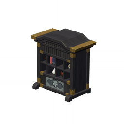
      </th>
      <th style="padding: 0; vertical-align: top;">
        

          

            枫木书柜-「墨染书心」
            

          

          

            
                <strong>星级：⭐⭐⭐</strong>
            
          

        

      </th>
    </tr>
    <tr>
        <th colspan="2" style="font-weight: normal;">
        <strong>描述：</strong> 
        		可见于社奉行本部的书柜，由「枫木」制成，平衡了尺寸与工时，只可惜容量略显不足。 
传说稻妻工匠善于利用每一种材料创造营收，尽可能地节约物资。这种书柜就是典型的例子——木材表层所用的漆面色泽深邃，含有制造墨水时的无害产物。
        </th>
    </tr>
  </thead>
</table>

### 枫木书柜-「千卷柜藏」

<table class="table-weapon">
  <thead>
    <tr>
      <th class="th-weapon" rowspan="1">
        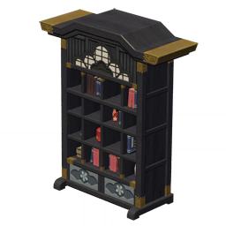
      </th>
      <th style="padding: 0; vertical-align: top;">
        

          

            枫木书柜-「千卷柜藏」
            

          

          

            
                <strong>星级：⭐⭐⭐</strong>
            
          

        

      </th>
    </tr>
    <tr>
        <th colspan="2" style="font-weight: normal;">
        <strong>描述：</strong> 
        		可见于社奉行本部的书柜，听说这种书柜也被其余两奉行少量采购过。 
这种书柜格外高大，消耗的木材比普通书柜多出将近九成，优点是容积巨大，足以储藏海量书籍与器物，而且占用的房间面积并不比普通书柜大多少。这样一看，单价较贵的缺点也就不算什么了。
        </th>
    </tr>
  </thead>
</table>

### 梦见木长桌

<table class="table-weapon">
  <thead>
    <tr>
      <th class="th-weapon" rowspan="1">
        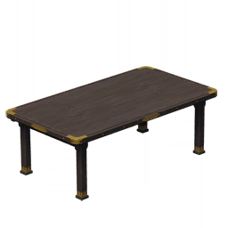
      </th>
      <th style="padding: 0; vertical-align: top;">
        

          

            梦见木长桌
            

          

          

            
                <strong>星级：⭐⭐⭐</strong>
            
          

        

      </th>
    </tr>
    <tr>
        <th colspan="2" style="font-weight: normal;">
        <strong>描述：</strong> 
        		传统形制的长桌，以梦见木打造，采用了稻妻独有的酒色染色手法，进行了细腻的表层处理，并以色泽明亮的金属作为装饰。 
据传这种长桌与稻妻常见的餐具和茶具相当契合，有助于维持菜肴与香茗的温度，从而带来更好的用餐体验。
        </th>
    </tr>
  </thead>
</table>

### 铸铁泛用炉具

<table class="table-weapon">
  <thead>
    <tr>
      <th class="th-weapon" rowspan="1">
        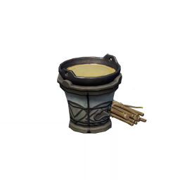
      </th>
      <th style="padding: 0; vertical-align: top;">
        

          

            铸铁泛用炉具
            

          

          

            
                <strong>星级：⭐⭐⭐</strong>
            
          

        

      </th>
    </tr>
    <tr>
        <th colspan="2" style="font-weight: normal;">
        <strong>描述：</strong> 
        		采用传统设计的铁制稻妻炉具，较为紧凑，便于搬运，据说能将尺寸两倍于炉口的铁锅有效加热，泛用性极强。 
稻妻曾经历过一段「生食」盛行的时期，虽说某些鱼类的肉质鲜美，偶尔尝试生吃，别有一番风味，但长期如此，必然会付出罹患各种疾病的代价。这种便宜好用的炉灶流行开来后，「生食」也就逐渐离开了美食屋台的核心位置。
        </th>
    </tr>
  </thead>
</table>

### 梦见木「冷暖一桌」被炉

<table class="table-weapon">
  <thead>
    <tr>
      <th class="th-weapon" rowspan="1">
        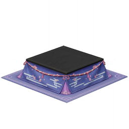
      </th>
      <th style="padding: 0; vertical-align: top;">
        

          

            梦见木「冷暖一桌」被炉
            

          

          

            
                <strong>星级：⭐⭐⭐⭐</strong>
            
          

        

      </th>
    </tr>
    <tr>
        <th colspan="2" style="font-weight: normal;">
        <strong>描述：</strong> 
        	稻妻民居中的别致桌子，内部设有容纳炭火的箱体，在过冬时尤为好用，还会把人给「吞掉」。不过雷电将军斩除稻妻境内的主要威胁后，每年都会驱散过于寒冷的天气，所以这几百年来，稻妻的气候还算温和，被炉并没有派上设计时的用场。一些条件不错的家庭反而在箱体内放置冰块，用以制造阴凉的环境，度过闷热的夏日。
        </th>
    </tr>
  </thead>
</table>

### 孔雀木「石定」茶桌

<table class="table-weapon">
  <thead>
    <tr>
      <th class="th-weapon" rowspan="1">
        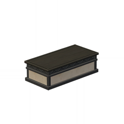
      </th>
      <th style="padding: 0; vertical-align: top;">
        

          

            孔雀木「石定」茶桌
            

          

          

            
                <strong>星级：⭐⭐⭐</strong>
            
          

        

      </th>
    </tr>
    <tr>
        <th colspan="2" style="font-weight: normal;">
        <strong>描述：</strong> 
        	尺寸较大的稻妻茶桌，主要的材料是坚硬的孔雀木。石制材料的内板带来了别具一格的美感，还有着稳固结构的功用。在这种茶桌上放置再多重物，也不会摇晃。可惜石质结构付出的重量代价太过夸张，这种茶桌难以被移动，不便打扫。
        </th>
    </tr>
  </thead>
</table>

### 茶室长桌-「座无隙」

<table class="table-weapon">
  <thead>
    <tr>
      <th class="th-weapon" rowspan="1">
        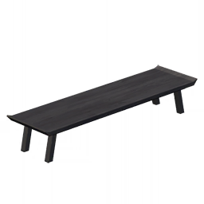
      </th>
      <th style="padding: 0; vertical-align: top;">
        

          

            茶室长桌-「座无隙」
            

          

          

            
                <strong>星级：⭐⭐⭐</strong>
            
          

        

      </th>
    </tr>
    <tr>
        <th colspan="2" style="font-weight: normal;">
        <strong>描述：</strong> 
        	稻妻传统的低矮木桌，以树龄较大的「羽扇枫」产出的「枫木」制成。木材表层的质地柔软细腻，内部坚韧结实。所用的漆面防水防污效果极佳，作为茶桌或书桌使用皆可。 
围绕这种长桌落座时，对坐两人的距离极近，通常只有挚友或交心之人才会正对而坐，促膝对谈。
        </th>
    </tr>
  </thead>
</table>

### 茶室柜台-「十四丸」

<table class="table-weapon">
  <thead>
    <tr>
      <th class="th-weapon" rowspan="1">
        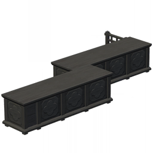
      </th>
      <th style="padding: 0; vertical-align: top;">
        

          

            茶室柜台-「十四丸」
            

          

          

            
                <strong>星级：⭐⭐⭐</strong>
            
          

        

      </th>
    </tr>
    <tr>
        <th colspan="2" style="font-weight: normal;">
        <strong>描述：</strong> 
        	茶室所用的柜台，以深色漆面的「枫木」打造。 
这种柜台内侧有着活动的暗门，内部储存空间宽裕，据说足以装下十四只「太郎丸」体型的狗狗，因而有了「十四丸」的别号。 
柜台内外两侧的造型几乎没有区别，茶室的工作人员有时也无法分辨正确的朝向。
        </th>
    </tr>
  </thead>
</table>

### 梦见木「樱眠」床榻

<table class="table-weapon">
  <thead>
    <tr>
      <th class="th-weapon" rowspan="1">
        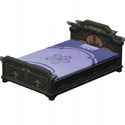
      </th>
      <th style="padding: 0; vertical-align: top;">
        

          

            梦见木「樱眠」床榻
            

          

          

            
                <strong>星级：⭐⭐⭐</strong>
            
          

        

      </th>
    </tr>
    <tr>
        <th colspan="2" style="font-weight: normal;">
        <strong>描述：</strong> 
        	融合了外国设计的稻妻床榻。稻妻民众习惯在榻榻米上直接铺设被褥，但无论榻榻米的材质有多好，相比专门的床铺，终究还是偏硬的。 
一些璃月的来客则认为，长期席地而睡，水汽与湿寒会侵入身体，影响健康。才华横溢的稻妻工匠便开发了这种新式床铺，结合了稻妻的布料与异国床铺的舒适度，足以照顾各类使用者的需求。
        </th>
    </tr>
  </thead>
</table>

## 小型摆设

### 梦见木方凳

<table class="table-weapon">
  <thead>
    <tr>
      <th class="th-weapon" rowspan="1">
        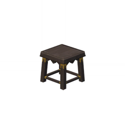
      </th>
      <th style="padding: 0; vertical-align: top;">
        

          

            梦见木方凳
            

          

          

            
                <strong>星级：⭐⭐⭐</strong>
            
          

        

      </th>
    </tr>
    <tr>
        <th colspan="2" style="font-weight: normal;">
        <strong>描述：</strong> 
        	传统形制的方凳，以梦见木制作，采用了稻妻独有的酒色染色手法，进行了细腻的表层处理，并以色泽明亮的金属作为装饰。 
花见坂的街坊邻居们都说，坐在这种方凳上用餐，胃口会比平时更好，也许梦见木所制的家具还有着尚未发现的神奇功效？
        </th>
    </tr>
  </thead>
</table>

### 茶室圆凳-「折痛辞」

<table class="table-weapon">
  <thead>
    <tr>
      <th class="th-weapon" rowspan="1">
        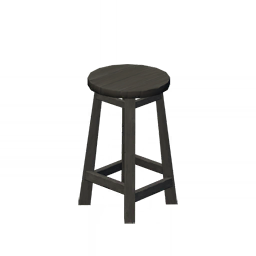
      </th>
      <th style="padding: 0; vertical-align: top;">
        

          

            茶室圆凳-「折痛辞」
            

          

          

            
                <strong>星级：⭐⭐</strong>
            
          

        

      </th>
    </tr>
    <tr>
        <th colspan="2" style="font-weight: normal;">
        <strong>描述：</strong> 
        	「木漏茶室」所用的高脚凳，由「枫木」制成，采用了异国的设计，适合搭配较高的桌柜使用。 
社奉行和神里家虽有不少世代坚守的传统，但也绝不会固步自封。在稻妻三奉行中，社奉行与勘定奉行对于优秀的外来事物的立场一致，只要能改善民生，就可为我所用。这种圆凳由两奉行一同推广，据分析，的确降低稻妻中老年人罹患腰部疾病的几率，因此也能在路边的店面里看见更便宜的御伽木版本。
        </th>
    </tr>
  </thead>
</table>

### 宗传刀架-「两训则」

<table class="table-weapon">
  <thead>
    <tr>
      <th class="th-weapon" rowspan="1">
        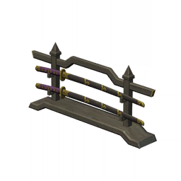
      </th>
      <th style="padding: 0; vertical-align: top;">
        

          

            宗传刀架-「两训则」
            

          

          

            
                <strong>星级：⭐⭐⭐⭐</strong>
            
          

        

      </th>
    </tr>
    <tr>
        <th colspan="2" style="font-weight: normal;">
        <strong>描述：</strong> 
        	曾被稻妻剑道家使用的刀架。纵向放置的两把刀并无区别，有时会被两位武人使用。两人之间的关系通常相当紧密，大多是同食同寝的兄弟或挚友，在互相督促中取得武艺的精进。
        </th>
    </tr>
  </thead>
</table>

### 梦见木「礼待」着物架

<table class="table-weapon">
  <thead>
    <tr>
      <th class="th-weapon" rowspan="1">
        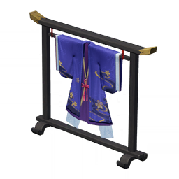
      </th>
      <th style="padding: 0; vertical-align: top;">
        

          

            梦见木「礼待」着物架
            

          

          

            
                <strong>星级：⭐⭐⭐</strong>
            
          

        

      </th>
    </tr>
    <tr>
        <th colspan="2" style="font-weight: normal;">
        <strong>描述：</strong> 
        	摆放在社奉行本部的着物架，家主出行或会见客人时，将取用这一着物架上的外套。 
不过最近家主神里绫人总是忙于各项事务，长期在外奔波，反而是「白鹭公主」神里绫华更常待在社奉行本部。因此，目前衣架上挂着的着物是神里绫华修习书画时所穿的礼仪服饰，相对宽松轻便。
        </th>
    </tr>
  </thead>
</table>

### 旗本重铠-「影阵玄甲」

<table class="table-weapon">
  <thead>
    <tr>
      <th class="th-weapon" rowspan="1">
        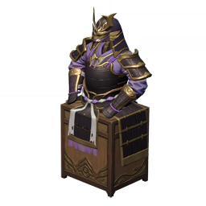
      </th>
      <th style="padding: 0; vertical-align: top;">
        

          

            旗本重铠-「影阵玄甲」
            

          

          

            
                <strong>星级：⭐⭐⭐⭐</strong>
            
          

        

      </th>
    </tr>
    <tr>
        <th colspan="2" style="font-weight: normal;">
        <strong>描述：</strong> 
        	以端坐之姿肃然陈列于支架上的稻妻传统盔甲，沿袭了百余年前旗本武士的经典形制，亦被天领奉行广泛使用，兼顾实战与礼仪两大用途。 
在锻造盔甲的材料获得飞跃性的发展之前，护甲的防护能力与重量始终位于天平的两端，过重的盔甲虽能提供周全的防护，但对穿戴者的体能消耗过大，且难以迅速穿戴。 
幕府军曾大量列装这般厚重的铠甲，并在与反抗军的战斗中取得了相当的优势。可惜武士们无法终日穿戴盔甲，反抗军的领袖抓准了沉重盔甲整备与反应速度较慢的缺点，采用多支部队梯次接战，频繁扰敌的战术，使得幕府军多次遭遇无暇穿戴盔甲的窘迫战况。此后，幕府军也逐渐改用了相对轻便的盔甲，以求快速反应，灵活接敌。
        </th>
    </tr>
  </thead>
</table>

### 茶室屏风-「垢身金心」

<table class="table-weapon">
  <thead>
    <tr>
      <th class="th-weapon" rowspan="1">
        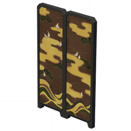
      </th>
      <th style="padding: 0; vertical-align: top;">
        

          

            茶室屏风-「垢身金心」
            

          

          

            
                <strong>星级：⭐⭐⭐⭐</strong>
            
          

        

      </th>
    </tr>
    <tr>
        <th colspan="2" style="font-weight: normal;">
        <strong>描述：</strong> 
        	狭长高耸的屏风，可见于「木漏茶室」之中。 
屏风的配色与一种年代久远的酽茶完全一致。尚未入水的茶叶色泽枯褐，泡出的茶汤却呈现出澄金之色，寓意相当深远——蓬头垢面的人也有可能蕴含着黄金般的价值。
        </th>
    </tr>
  </thead>
</table>

### 宗传刀架-「四常法」

<table class="table-weapon">
  <thead>
    <tr>
      <th class="th-weapon" rowspan="1">
        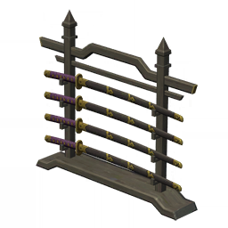
      </th>
      <th style="padding: 0; vertical-align: top;">
        

          

            宗传刀架-「四常法」
            

          

          

            
                <strong>星级：⭐⭐⭐⭐</strong>
            
          

        

      </th>
    </tr>
    <tr>
        <th colspan="2" style="font-weight: normal;">
        <strong>描述：</strong> 
        	曾被稻妻剑道家使用的刀架，单论形制与尺寸，纵向放置的四把刀之间并没有差别，但听说在不同的流派中，刀架上的每一把刀都有特定的用途。
        </th>
    </tr>
  </thead>
</table>

### 茶室坐垫-「晚禾织」

<table class="table-weapon">
  <thead>
    <tr>
      <th class="th-weapon" rowspan="1">
        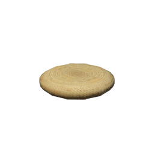
      </th>
      <th style="padding: 0; vertical-align: top;">
        

          

            茶室坐垫-「晚禾织」
            

          

          

            
                <strong>星级：⭐⭐</strong>
            
          

        

      </th>
    </tr>
    <tr>
        <th colspan="2" style="font-weight: normal;">
        <strong>描述：</strong> 
        	「木漏茶室」所用的坐垫，由晒干的稻草编织而成，编织的手法极为精妙，但使用体验与平民家庭的坐垫并无二致。 
「木漏茶室」虽有不少规矩，但大多在于基本的礼仪和待客的原则，绝不会斤斤计较每种器物所用材料，追求表面的高贵奢华。
        </th>
    </tr>
  </thead>
</table>

### 枫木仪鼓-「宴奏」

<table class="table-weapon">
  <thead>
    <tr>
      <th class="th-weapon" rowspan="1">
        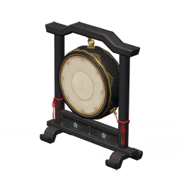
      </th>
      <th style="padding: 0; vertical-align: top;">
        

          

            枫木仪鼓-「宴奏」
            

          

          

            
                <strong>星级：⭐⭐⭐</strong>
            
          

        

      </th>
    </tr>
    <tr>
        <th colspan="2" style="font-weight: normal;">
        <strong>描述：</strong> 
        	摆放在「木漏茶室」中的礼仪奏乐双用鼓，平时无人演奏，单作装饰的器物。如遇重要的茶会，则会聘请专人奏乐。但大部分客人一直期待着「木漏茶室」传说中的保留节目：老板太郎丸亲自奏鼓——听说，某些重要的节庆来临时，太郎丸会在午夜前的最后一桌客人离席后，用自己前爪的肉垫敲奏这门鼓。对于这条传闻，太郎丸本尊的评价是：「汪？」。
        </th>
    </tr>
  </thead>
</table>

### 枫木仪鼓-「喧腾」

<table class="table-weapon">
  <thead>
    <tr>
      <th class="th-weapon" rowspan="1">
        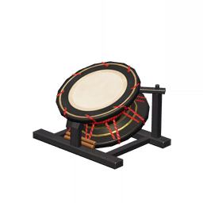
      </th>
      <th style="padding: 0; vertical-align: top;">
        

          

            枫木仪鼓-「喧腾」
            

          

          

            
                <strong>星级：⭐⭐⭐</strong>
            
          

        

      </th>
    </tr>
    <tr>
        <th colspan="2" style="font-weight: normal;">
        <strong>描述：</strong> 
        	摆放在「木漏茶室」中的礼仪奏乐双用鼓，因鼓声过于浑厚，足以穿透木墙，震醒一町之地的居民，逐渐被乐手以外的人开发出奇巧的用途，诸如巫女鹿野奈奈。 
鹿野奈奈曾在搜寻某位偷懒的终末番忍者时，将这种大鼓挂在胸前，行走在目标潜藏的树林中，边走边击鼓，最终成功将偷懒的忍者从树上「轰」下来，当场抓获。
        </th>
    </tr>
  </thead>
</table>

### 梦见木「入画」折屏

<table class="table-weapon">
  <thead>
    <tr>
      <th class="th-weapon" rowspan="1">
        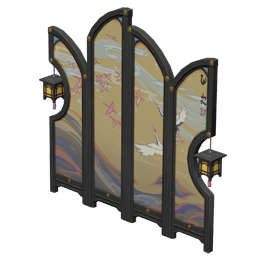
      </th>
      <th style="padding: 0; vertical-align: top;">
        

          

            梦见木「入画」折屏
            

          

          

            
                <strong>星级：⭐⭐⭐⭐</strong>
            
          

        

      </th>
    </tr>
    <tr>
        <th colspan="2" style="font-weight: normal;">
        <strong>描述：</strong> 
        	梦见木所制的精巧屏风，屏面画作复刻了经典书画「鹭羽云鹜」。画面过于空远，环境昏暗时，甚至可能使人产生幻觉，误以为能走入画卷，正面撞上屏风。无奈之下，工匠们适当改造了屏风的构型，并在屏风两侧加挂了小巧的灯笼。本为安全考虑的设计，反而使得屏风的外观更为雅致。
        </th>
    </tr>
  </thead>
</table>

## 摆件

### 茶室摆灯-「遮隐光」

<table class="table-weapon">
  <thead>
    <tr>
      <th class="th-weapon" rowspan="1">
        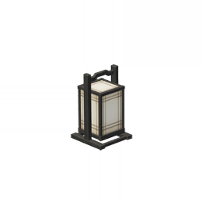
      </th>
      <th style="padding: 0; vertical-align: top;">
        

          

            茶室摆灯-「遮隐光」
            

          

          

            
                <strong>星级：⭐⭐⭐</strong>
            
          

        

      </th>
    </tr>
    <tr>
        <th colspan="2" style="font-weight: normal;">
        <strong>描述：</strong> 
        	精巧轻便的小摆灯，需要时可以直接提走使用，被「木漏茶室」使用后，在平民阶层中很快也流行开来。底座有着可拆卸的格板，能直接将蜡烛向下取出，快速更换光源，还设置了专门的蜡烛固定点。提着这种摆灯快步奔跑，蜡烛也不会倾倒，更不可能点燃灯纸，相当安全。
        </th>
    </tr>
  </thead>
</table>

### 枫木摆灯-「薄馨」

<table class="table-weapon">
  <thead>
    <tr>
      <th class="th-weapon" rowspan="1">
        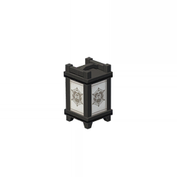
      </th>
      <th style="padding: 0; vertical-align: top;">
        

          

            枫木摆灯-「薄馨」
            

          

          

            
                <strong>星级：⭐⭐⭐</strong>
            
          

        

      </th>
    </tr>
    <tr>
        <th colspan="2" style="font-weight: normal;">
        <strong>描述：</strong> 
        	布置在社奉行本部的精巧摆灯。木制框架的隐秘角落设有细长的通气孔，内部的烛台上方则悬挂着小巧的石碗，石碗中装载着极易熔化蒸腾的香膏，点燃此灯后，便会有清幽的香气弥漫而出，有着几分醒神的功效。而且这种香膏的价格比稻妻少见的整支香烛要低廉不少。
        </th>
    </tr>
  </thead>
</table>

### 枫木地灯-「照澄」

<table class="table-weapon">
  <thead>
    <tr>
      <th class="th-weapon" rowspan="1">
        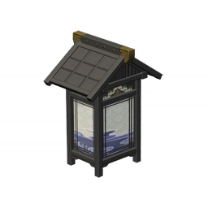
      </th>
      <th style="padding: 0; vertical-align: top;">
        

          

            枫木地灯-「照澄」
            

          

          

            
                <strong>星级：⭐⭐⭐</strong>
            
          

        

      </th>
    </tr>
    <tr>
        <th colspan="2" style="font-weight: normal;">
        <strong>描述：</strong> 
        	可见于社奉行本部的大型灯具。造价较为高昂，制作过程涉及大量额外的供材方与匠人。 
据说，社奉行曾在经济不景气时，主动划出大笔预算，大量采供工匠们的产品，为其提供订单维持生计。这种灯具就是在那一时期购入的特殊货品。
        </th>
    </tr>
  </thead>
</table>

### 「铸瓷正则」

<table class="table-weapon">
  <thead>
    <tr>
      <th class="th-weapon" rowspan="1">
        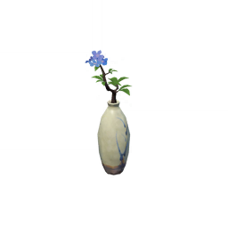
      </th>
      <th style="padding: 0; vertical-align: top;">
        

          

            「铸瓷正则」
            

          

          

            
                <strong>星级：⭐⭐⭐</strong>
            
          

        

      </th>
    </tr>
    <tr>
        <th colspan="2" style="font-weight: normal;">
        <strong>描述：</strong> 
        	品质极佳的花瓶，摆放在社奉行本部的玄关。这只花瓶已有相当的年头，代行们都不知道它的来历。但有行家跟据其瓷面的特点，用釉的手法判断，这只花瓶的历史可能在「锁国令」之前——它是当年购自璃月的珍品。那批流入稻妻的瓷器启发了不少工匠，加速了稻妻工艺的更新换代，现如今，稻妻的瓷器也开辟出了只属于自己瓷器流派。
        </th>
    </tr>
  </thead>
</table>

### 「素守之瓶」

<table class="table-weapon">
  <thead>
    <tr>
      <th class="th-weapon" rowspan="1">
        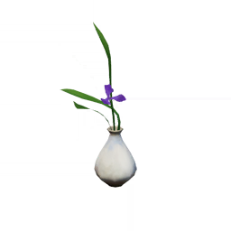
      </th>
      <th style="padding: 0; vertical-align: top;">
        

          

            「素守之瓶」
            

          

          

            
                <strong>星级：⭐⭐⭐</strong>
            
          

        

      </th>
    </tr>
    <tr>
        <th colspan="2" style="font-weight: normal;">
        <strong>描述：</strong> 
        	平平无奇的花瓶，虽说这款花瓶也被社奉行本部采购，并摆放在醒目的位置，但外形和材质都没有亮点。 
事实上，这型花瓶有着「坚守平素之心，做好基本的工作」的寓意，也鼓励了那些暂时平庸的人，告诉他们：不断努力的话，总有一天也能像这尊花瓶一样出人头地。
        </th>
    </tr>
  </thead>
</table>

### 「恩返之盏」

<table class="table-weapon">
  <thead>
    <tr>
      <th class="th-weapon" rowspan="1">
        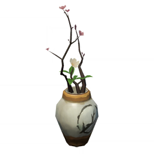
      </th>
      <th style="padding: 0; vertical-align: top;">
        

          

            「恩返之盏」
            

          

          

            
                <strong>星级：⭐⭐⭐</strong>
            
          

        

      </th>
    </tr>
    <tr>
        <th colspan="2" style="font-weight: normal;">
        <strong>描述：</strong> 
        	品质独特的花瓶，做工远优于普通瓷器，但和名家之作相比，还有相当的差距。不难猜测，这只花瓶是由勤练苦修的工匠打造的。 
有心之人若是追根溯源，不难发现，制作这型花瓶的工匠，曾是依靠社奉行的资助才长大成人的孤儿。她被同样接受社奉行照顾的瓷器世家收养，年纪轻轻就练出了不错的手艺。
        </th>
    </tr>
  </thead>
</table>

### 「赤铁珊瑚」

<table class="table-weapon">
  <thead>
    <tr>
      <th class="th-weapon" rowspan="1">
        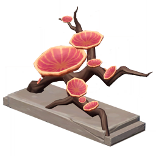
      </th>
      <th style="padding: 0; vertical-align: top;">
        

          

            「赤铁珊瑚」
            

          

          

            
                <strong>星级：⭐⭐⭐</strong>
            
          

        

      </th>
    </tr>
    <tr>
        <th colspan="2" style="font-weight: normal;">
        <strong>描述：</strong> 
        	色泽明丽的桌面摆件，唯有手艺娴熟的雕刻家才能打造。据说这种摆件是以渔民从海中打捞上来的珊瑚为摹拓对象雕刻而成的，原品极为华丽，已被离岛的外国富商高价购得。
        </th>
    </tr>
  </thead>
</table>

### 「朽石荧伞」

<table class="table-weapon">
  <thead>
    <tr>
      <th class="th-weapon" rowspan="1">
        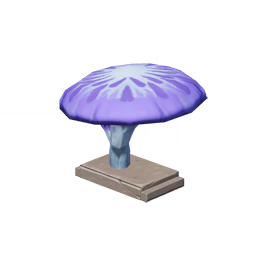
      </th>
      <th style="padding: 0; vertical-align: top;">
        

          

            「朽石荧伞」
            

          

          

            
                <strong>星级：⭐⭐⭐</strong>
            
          

        

      </th>
    </tr>
    <tr>
        <th colspan="2" style="font-weight: normal;">
        <strong>描述：</strong> 
        	瑰丽的桌面饰品，隐约呈现出蘑菇的形态，材质奇异，似石非石。离岛的外国人中流传着一条逸闻——这件饰品的原材料来自镇守之森的石块。将一块千年朽石敲开后，石块内部呈现出流体般的质感，像是被蓝色的荧光侵彻。实际上，工匠只不过是将无法食用的果冻做成了紫色的涂层，均匀涂抹在普通的雕塑上罢了。
        </th>
    </tr>
  </thead>
</table>

### 茶室器物-「锁香笼」

<table class="table-weapon">
  <thead>
    <tr>
      <th class="th-weapon" rowspan="1">
        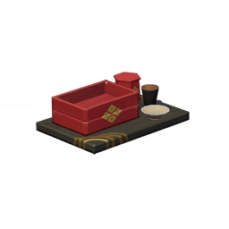
      </th>
      <th style="padding: 0; vertical-align: top;">
        

          

            茶室器物-「锁香笼」
            

          

          

            
                <strong>星级：⭐⭐⭐</strong>
            
          

        

      </th>
    </tr>
    <tr>
        <th colspan="2" style="font-weight: normal;">
        <strong>描述：</strong> 
        	品质优良的「枫木」所打造的器物组合，可用于盛放点心和糖果，通常搭配茶具使用。其中的点心盒采用了双层设计，底板相当纤薄，下层可存放冰块或热砂，从而将点心保持在品尝风味最佳的温度。
        </th>
    </tr>
  </thead>
</table>

### 纸墨笔砚-「正定笔锋」

<table class="table-weapon">
  <thead>
    <tr>
      <th class="th-weapon" rowspan="1">
        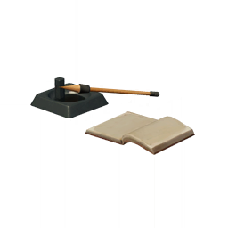
      </th>
      <th style="padding: 0; vertical-align: top;">
        

          

            纸墨笔砚-「正定笔锋」
            

          

          

            
                <strong>星级：⭐⭐⭐</strong>
            
          

        

      </th>
    </tr>
    <tr>
        <th colspan="2" style="font-weight: normal;">
        <strong>描述：</strong> 
        	传统的稻妻的毛笔、砚台和空簿册。 
神里家有一项传统，以铁制笔杆包覆木制外壳，制作重量惊人的毛笔，锻炼对笔尖的把控力。经此训练后，哪怕使用笔毫极多的毛笔，也能在尺寸极小的纸张上写出纤细娟秀的字迹。
        </th>
    </tr>
  </thead>
</table>

### 孔雀木「并提」层叠木匣

<table class="table-weapon">
  <thead>
    <tr>
      <th class="th-weapon" rowspan="1">
        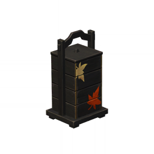
      </th>
      <th style="padding: 0; vertical-align: top;">
        

          

            孔雀木「并提」层叠木匣
            

          

          

            
                <strong>星级：⭐⭐⭐</strong>
            
          

        

      </th>
    </tr>
    <tr>
        <th colspan="2" style="font-weight: normal;">
        <strong>描述：</strong> 
        	纵向叠放的多层木匣，由漆面厚重的「孔雀木」制成，保温能力良好。 
花见坂的老人们说，这种木匣最初的用途是为出门在外的工人保存便当。有的工坊会为所有工人提供午饭，一提木匣就装有四人份的餐食，取放保存极为方便。此后，这种木匣也被用于保存点心等物品。
        </th>
    </tr>
  </thead>
</table>

### 茶室烛台-「无味火」

<table class="table-weapon">
  <thead>
    <tr>
      <th class="th-weapon" rowspan="1">
        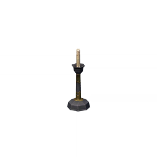
      </th>
      <th style="padding: 0; vertical-align: top;">
        

          

            茶室烛台-「无味火」
            

          

          

            
                <strong>星级：⭐⭐⭐</strong>
            
          

        

      </th>
    </tr>
    <tr>
        <th colspan="2" style="font-weight: normal;">
        <strong>描述：</strong> 
        		精致的烛台，采用了「木漏茶室」的式样。使用的蜡烛由「长野原烟花店」制作烟花的副产品与少量植物叶片的提取物制成，燃烧时不会产生任何气味，不会影响人们品茶的兴致。实际上，这种蜡烛比常见于神龛前的鱼烛更便宜，正被逐步推广开来。
        </th>
    </tr>
  </thead>
</table>

### 破邪之弦镝

<table class="table-weapon">
  <thead>
    <tr>
      <th class="th-weapon" rowspan="1">
        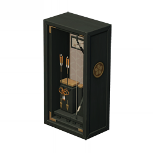
      </th>
      <th style="padding: 0; vertical-align: top;">
        

          

            破邪之弦镝
            

          

          

            
                <strong>星级：⭐⭐⭐</strong>
            
          

        

      </th>
    </tr>
    <tr>
        <th colspan="2" style="font-weight: normal;">
        <strong>描述：</strong> 
        		经过精心装潢，封存在枫木盒中的礼仪用箭矢与小巧木弓，可以在祭典的摊位上买到，常被作为桌面的摆件使用。 
据说这种器物能驱除邪祟，相关传闻已不可考。多数民众对大御所大人的力量有着至为虔诚的信仰，自然不需要其他神话与传说的心理安慰，仅仅将这种器物看作美观的装饰品与祭典的纪念品。但实际上，这种器物背后的传说，或许与大御所大人的旧识有关…
        </th>
    </tr>
  </thead>
</table>

### 驱鬼之羽屏

<table class="table-weapon">
  <thead>
    <tr>
      <th class="th-weapon" rowspan="1">
        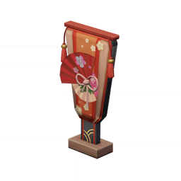
      </th>
      <th style="padding: 0; vertical-align: top;">
        

          

            驱鬼之羽屏
            

          

          

            
                <strong>星级：⭐⭐⭐</strong>
            
          

        

      </th>
    </tr>
    <tr>
        <th colspan="2" style="font-weight: normal;">
        <strong>描述：</strong> 
        		枫木所作的精巧球拍，原本也有着「驱邪」的寓意，如今则作为一种饰品为人们所熟知。若是找来一位伙伴和特制的小球，就能用它们进行稻妻本地的击球游戏。按照传统，胜者可以用毛笔在败者的脸上作画。每到祭典之时，总能看见几个满脸墨汁的孩子。
        </th>
    </tr>
  </thead>
</table>

### 「茶烟笼白榻」

<table class="table-weapon">
  <thead>
    <tr>
      <th class="th-weapon" rowspan="1">
        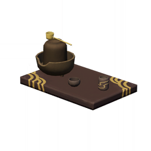
      </th>
      <th style="padding: 0; vertical-align: top;">
        

          

            「茶烟笼白榻」
            

          

          

            
                <strong>星级：⭐⭐⭐</strong>
            
          

        

      </th>
    </tr>
    <tr>
        <th colspan="2" style="font-weight: normal;">
        <strong>描述：</strong> 
        		做工考究的茶具套装，初看之下，茶具的种类和数目并不多，但足以制作出常见的各式茶饮。 
传说这套茶具的形制可以追溯到百余年前的花见坂——一位茶道大师曾旅居于此，他了解到居民们的收入有限，无法承担多种茶具套装，便运用毕生所学，将各式茶具适当简化后，结合彼此的优点，才有了这样一套功能齐全，物美价廉的茶具。此后这种茶具组合逐渐流行开来，就连富人们也对它爱不释手。
        </th>
    </tr>
  </thead>
</table>

### 白鹭流光之簪

<table class="table-weapon">
  <thead>
    <tr>
      <th class="th-weapon" rowspan="1">
        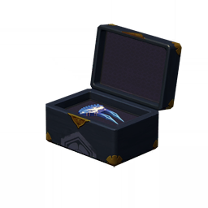
      </th>
      <th style="padding: 0; vertical-align: top;">
        

          

            白鹭流光之簪
            

          

          

            
                <strong>星级：⭐⭐⭐⭐</strong>
            
          

        

      </th>
    </tr>
    <tr>
        <th colspan="2" style="font-weight: normal;">
        <strong>描述：</strong> 
        		来自神里绫华的礼物。 
相当高级的发簪。簪上绘有白鹭振翅图。作画细巧精美，将白鹭出水时如霜如雪的清雅气质呈现得极好。
        </th>
    </tr>
  </thead>
</table>

### 枫木布面狸猫玩偶

<table class="table-weapon">
  <thead>
    <tr>
      <th class="th-weapon" rowspan="1">
        
      </th>
      <th style="padding: 0; vertical-align: top;">
        

          

            枫木布面狸猫玩偶
            

          

          

            
                <strong>星级：⭐⭐⭐</strong>
            
          

        

      </th>
    </tr>
    <tr>
        <th colspan="2" style="font-weight: normal;">
        <strong>描述：</strong> 
        			做工精妙的狸猫玩偶，乍看之下像是陶土材质的漆器，实际上，这种玩偶的表层是在精雕细琢的木制骨架上覆盖织物，涂上特制彩漆制成的。这样制作的玩偶轻巧结实且便宜，物美价廉。
        </th>
    </tr>
  </thead>
</table>

### 枫木布面白狐玩偶

<table class="table-weapon">
  <thead>
    <tr>
      <th class="th-weapon" rowspan="1">
        
      </th>
      <th style="padding: 0; vertical-align: top;">
        

          

            枫木布面白狐玩偶
            

          

          

            
                <strong>星级：⭐⭐⭐</strong>
            
          

        

      </th>
    </tr>
    <tr>
        <th colspan="2" style="font-weight: normal;">
        <strong>描述：</strong> 
        		做工精妙的白狐玩偶，同样采用了木质骨架覆盖织物的工艺，相比同系列的狸猫玩偶，价格要稍高一线。这是因为稻妻民众对狐狸有着特殊的情感，白狐玩偶更总是被抢购一空，唯有提高价格才能在非公开的收藏品市场买到。
        </th>
    </tr>
  </thead>
</table>

### 「神之嗅觉」不倒狐狐

<table class="table-weapon">
  <thead>
    <tr>
      <th class="th-weapon" rowspan="1">
        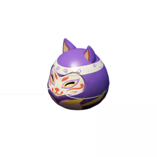
      </th>
      <th style="padding: 0; vertical-align: top;">
        

          

            「神之嗅觉」不倒狐狐
            

          

          

            
                <strong>星级：⭐⭐⭐</strong>
            
          

        

      </th>
    </tr>
    <tr>
        <th colspan="2" style="font-weight: normal;">
        <strong>描述：</strong> 
        	狐狸造型的大型玩偶，永远无法被推倒，其原型是「八重堂」某本热销轻小说中的角色： 
身负高贵紫狐之血脉的厨师，拥有「神之嗅觉」，能根据锅中食材散发的气味，准确判断食材的状态，进而把控每种调料的所用量，完成至为精准的烹饪。 
这种玩偶的销量在「八重堂」所有轻小说的衍生商品中排行第六，还偶尔会在祭典的摊位上贩售。据购买它的顾客所说，吃饭时看着这种玩偶，就能回想起轻小说中描写美食的文字，下饭效果极佳。
        </th>
    </tr>
  </thead>
</table>

### 「真实厨艺」不倒狸狸

<table class="table-weapon">
  <thead>
    <tr>
      <th class="th-weapon" rowspan="1">
        
      </th>
      <th style="padding: 0; vertical-align: top;">
        

          

            「真实厨艺」不倒狸狸
            

          

          

            
                <strong>星级：⭐⭐⭐</strong>
            
          

        

      </th>
    </tr>
    <tr>
        <th colspan="2" style="font-weight: normal;">
        <strong>描述：</strong> 
        	狸猫造型的大型玩偶，永远无法被推倒，其原型是「八重堂」某本热销轻小说中的角色： 
偶然间获得了魔神之力的厨师，能够放出「真实厨艺」的结界，位于这个结界中的其他厨师会失去一切投机取巧的能力，只能凭真本事与竞争对手一较高下。届时，这位角色就能凭借自己扎实的基本功赢得厨艺对决。 
这种玩偶的销量在「八重堂」所有轻小说的衍生商品中排行第二十二，还偶尔会在祭典的摊位上贩售。照理来说，身为作品主角的衍生商品，它的销量应该很高才对。但经过调查可知，喜欢这个角色的读者，大多是技艺平庸的厨师，或许这位角色的目标受众出现了偏差…
        </th>
    </tr>
  </thead>
</table>

### 「面具」

<table class="table-weapon">
  <thead>
    <tr>
      <th class="th-weapon" rowspan="1">
        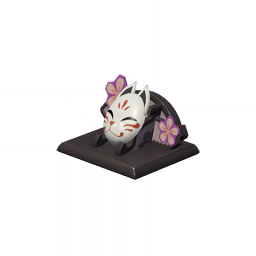
      </th>
      <th style="padding: 0; vertical-align: top;">
        

          

            「面具」
            

          

          

            
                <strong>星级：⭐⭐⭐⭐</strong>
            
          

        

      </th>
    </tr>
    <tr>
        <th colspan="2" style="font-weight: normal;">
        <strong>描述：</strong> 
        	来自鸣神大社的面具。 
经历了不少年月而变得十分脆弱，不适合佩戴在脸上。 
它过去的主人似乎曾经怀着许许多多的思念，祝福她所珍爱的一切； 
如今这幅面具，或许也承载着此人的思念与祝福，能为你多少抵挡几句谎言、几分恶念吧。
        </th>
    </tr>
  </thead>
</table>

### 「金狸狸奖杯」

<table class="table-weapon">
  <thead>
    <tr>
      <th class="th-weapon" rowspan="1">
        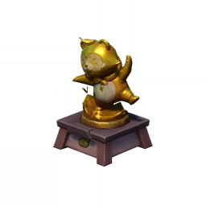
      </th>
      <th style="padding: 0; vertical-align: top;">
        

          

            「金狸狸奖杯」
            

          

          

            
                <strong>星级：⭐⭐⭐⭐</strong>
            
          

        

      </th>
    </tr>
    <tr>
        <th colspan="2" style="font-weight: normal;">
        <strong>描述：</strong> 
        	做工精致的奖杯复制品，其原型为「三川花祭」的金狸狸奖杯，形象可爱且欢闹，用于表彰制作出「最佳游艺」的队伍。 
虽然是复制品，但其与原型均是同一人监修，且均是为了奖励「最佳」而生。或许在那位负责监修的人心里，作为活动代表的你与游艺的开发者一样，为「三川花祭」付出了诸多心血，同样是那个最值得褒奖的「最佳」！
        </th>
    </tr>
  </thead>
</table>

### 「愿你好梦」

<table class="table-weapon">
  <thead>
    <tr>
      <th class="th-weapon" rowspan="1">
        
      </th>
      <th style="padding: 0; vertical-align: top;">
        

          

            「愿你好梦」
            

          

          

            
                <strong>星级：⭐⭐⭐⭐</strong>
            
          

        

      </th>
    </tr>
    <tr>
        <th colspan="2" style="font-weight: normal;">
        <strong>描述：</strong> 
        	底部装有可动部件的精致摆设，其上的食梦貘玩偶可以在欢快的节奏中旋转。据说，食梦貘们会吞食所有的噩梦，而舒缓的音乐能让人们安心入眠。因此，将这件摆设放置在卧室之中，应该也能为人们带来美妙的梦境。 
不过，盯着旋转的食梦貘们太久的话，有可能头晕目眩哦…
        </th>
    </tr>
  </thead>
</table>

## 墙饰

### 绘染浮光-「遥山烟空」

<table class="table-weapon">
  <thead>
    <tr>
      <th class="th-weapon" rowspan="1">
        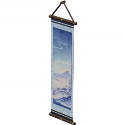
      </th>
      <th style="padding: 0; vertical-align: top;">
        

          

            绘染浮光-「遥山烟空」
            

          

          

            
                <strong>星级：⭐⭐⭐⭐</strong>
            
          

        

      </th>
    </tr>
    <tr>
        <th colspan="2" style="font-weight: normal;">
        <strong>描述：</strong> 
        	稻妻的传统挂画，绘有意境空阔的远山与云烟。 
此等画卷所用的画布极为柔顺，堪比上等绸缎，但售价并不昂贵，究其原因，是用到了源自神里家的织物处理手法。 
相传，百余年前，神里家的某代家主对书画尤为重视，采用了多种手段，在普通民众中推广书画，以期提高民众的文化素养。为了降低书画的门槛，这位家主聘请布料工匠，开发了多种工艺，以降低耗材的成本与售价，让普通民众无需计较相关开销。
        </th>
    </tr>
  </thead>
</table>

### 绘染浮光-「水色绚缦」

<table class="table-weapon">
  <thead>
    <tr>
      <th class="th-weapon" rowspan="1">
        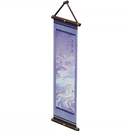
      </th>
      <th style="padding: 0; vertical-align: top;">
        

          

            绘染浮光-「水色绚缦」
            

          

          

            
                <strong>星级：⭐⭐⭐⭐</strong>
            
          

        

      </th>
    </tr>
    <tr>
        <th colspan="2" style="font-weight: normal;">
        <strong>描述：</strong> 
        	稻妻的传统挂画，绘有霞彩流漫的河川。 
稻妻彩画所用的颜料大抵分为「花派」与「水派」两系。前者虽名中带有花字，但主要是从诸如堇瓜皮这类大量种植的作物中提取而出的，当然也有高级颜料会用到正统花瓣；后者的原材料则是海底的彩色岩石，游鱼的鱼鳞。两者并无高低贵贱之分，作画之人会根据个人理解，从两派颜料中作出选择。这幅画的主题是河川，自然要用「水派」之色彩来勾勒意境。
        </th>
    </tr>
  </thead>
</table>

### 壁画拓印-「雾海孤岳」

<table class="table-weapon">
  <thead>
    <tr>
      <th class="th-weapon" rowspan="1">
        
      </th>
      <th style="padding: 0; vertical-align: top;">
        

          

            壁画拓印-「雾海孤岳」
            

          

          

            
                <strong>星级：⭐⭐⭐⭐</strong>
            
          

        

      </th>
    </tr>
    <tr>
        <th colspan="2" style="font-weight: normal;">
        <strong>描述：</strong> 
        	拓绘壁画而成的画卷，绘有雾海之中的山岳，深远的画面中似乎隐藏着某种难以明辨的信息。 
传说鹤观的古代原住民会用颜料将无法追忆的古老历史涂画在山洞内的岩壁上，存续千年而完好如初。透过这些壁画，方可了解鲜为人知的往事…
        </th>
    </tr>
  </thead>
</table>

### 壁画拓印-「雾海旧仪」

<table class="table-weapon">
  <thead>
    <tr>
      <th class="th-weapon" rowspan="1">
        
      </th>
      <th style="padding: 0; vertical-align: top;">
        

          

            壁画拓印-「雾海旧仪」
            

          

          

            
                <strong>星级：⭐⭐⭐⭐</strong>
            
          

        

      </th>
    </tr>
    <tr>
        <th colspan="2" style="font-weight: normal;">
        <strong>描述：</strong> 
        	拓绘壁画而成的画卷，描绘了一场神秘的仪式，似乎是「雷鸟」降临之前，原住民的祭祀仪礼… 
传说鹤观的古代原住民会用颜料将无法追忆的古老历史涂画在山洞内的岩壁上，存续千年而完好如初。透过这些壁画，方可了解鲜为人知的往事…
        </th>
    </tr>
  </thead>
</table>

## 庭院

### 要地牙门-「云底之能」

<table class="table-weapon">
  <thead>
    <tr>
      <th class="th-weapon" rowspan="1">
        
      </th>
      <th style="padding: 0; vertical-align: top;">
        

          

            要地牙门-「云底之能」
            

          

          

            
                <strong>星级：⭐⭐⭐</strong>
            
          

        

      </th>
    </tr>
    <tr>
        <th colspan="2" style="font-weight: normal;">
        <strong>描述：</strong> 
        	由「孔雀木」制成的门框，与奉行所的庭院正门有着相同的设计。门框顶部设有独特的弧形构造，据说有着「雷云」之意，代表奉行所的治安之能上达雷云之底，遍及雷之国的全境，处理稻妻城内各项事务，自然不在话下。 
不过，很少有民众在意这一设计，反倒是有些鸟雀喜欢在此筑巢，给负责打扫的同心添了不少麻烦。
        </th>
    </tr>
  </thead>
</table>

### 要地栏楯-「约己之壁」

<table class="table-weapon">
  <thead>
    <tr>
      <th class="th-weapon" rowspan="1">
        
      </th>
      <th style="padding: 0; vertical-align: top;">
        

          

            要地栏楯-「约己之壁」
            

          

          

            
                <strong>星级：⭐⭐⭐</strong>
            
          

        

      </th>
    </tr>
    <tr>
        <th colspan="2" style="font-weight: normal;">
        <strong>描述：</strong> 
        	由「孔雀木」制成的围栏，名义上是围栏，但间隙极大，成年男子也能从中轻松钻过，只有划分领域的象征性作用。 
奉行所的某任长官曾说过，这种围栏的意义在于给予民众们心理上的暗示——要是连奉行所都随时保持重重戒备，那不就意味着稻妻城内的治安情况极其糟糕吗？反之，要地的围栏处处透风，看似不设防备，民众们自然就会相信，城中情况尽在奉行所的掌握之中了。围栏建设成这样，绝不是因为缺少预算…
        </th>
    </tr>
  </thead>
</table>

### 栏楯转角-「瞩视无遗」

<table class="table-weapon">
  <thead>
    <tr>
      <th class="th-weapon" rowspan="1">
        
      </th>
      <th style="padding: 0; vertical-align: top;">
        

          

            栏楯转角-「瞩视无遗」
            

          

          

            
                <strong>星级：⭐⭐⭐</strong>
            
          

        

      </th>
    </tr>
    <tr>
        <th colspan="2" style="font-weight: normal;">
        <strong>描述：</strong> 
        	由「孔雀木」制成的围栏转角，与围栏墙体的设计相仿，木板间的空隙极大，穿戴盔甲的人都能侧身从中穿过。这种设计的意图相当明确——为奉行所内站岗的与力们提供良好的视野，防止在奉行所周围发生某些「灯下黑」的意外情况。
        </th>
    </tr>
  </thead>
</table>

### 御伽木「近竹」院门

<table class="table-weapon">
  <thead>
    <tr>
      <th class="th-weapon" rowspan="1">
        
      </th>
      <th style="padding: 0; vertical-align: top;">
        

          

            御伽木「近竹」院门
            

          

          

            
                <strong>星级：⭐⭐</strong>
            
          

        

      </th>
    </tr>
    <tr>
        <th colspan="2" style="font-weight: normal;">
        <strong>描述：</strong> 
        	「御伽木」所制的村落院墙。 
「近竹」实为一种鲜为人知的古法工艺。将某种罕见野草碾成粉末，加入少量黏土粉末，熬制成特殊的胶漆，涂抹在木板上，就能得到与高端舶来品「轻策竹」相仿的，光洁耐用的建材。可惜如今这种工艺已无从考据，即将失传。
        </th>
    </tr>
  </thead>
</table>

### 御伽木「近竹」围栏

<table class="table-weapon">
  <thead>
    <tr>
      <th class="th-weapon" rowspan="1">
        
      </th>
      <th style="padding: 0; vertical-align: top;">
        

          

            御伽木「近竹」围栏
            

          

          

            
                <strong>星级：⭐⭐</strong>
            
          

        

      </th>
    </tr>
    <tr>
        <th colspan="2" style="font-weight: normal;">
        <strong>描述：</strong> 
        	年久失修的「御伽木」围墙。「近竹」工艺付出的代价，是木板之间不便贴合，墙板的缝隙较大，各种体型较小的动物都有可能钻进院落，给住户带来了不少困扰。
        </th>
    </tr>
  </thead>
</table>

### 阵屋正门-「忠肃」

<table class="table-weapon">
  <thead>
    <tr>
      <th class="th-weapon" rowspan="1">
        
      </th>
      <th style="padding: 0; vertical-align: top;">
        

          

            阵屋正门-「忠肃」
            

          

          

            
                <strong>星级：⭐⭐⭐</strong>
            
          

        

      </th>
    </tr>
    <tr>
        <th colspan="2" style="font-weight: normal;">
        <strong>描述：</strong> 
        	九条阵屋式样的军营正门。即使是在前线，一切从简的情况下，军营正门也必须仔细搭建，还要将雷电将军的家纹擦得锃亮。思想传统的军官认为，这是幕府军军威的象征，丢了军威，一支部队就失去了魂魄，不可能打胜仗。
        </th>
    </tr>
  </thead>
</table>

### 阵屋围栏-「错牙」

<table class="table-weapon">
  <thead>
    <tr>
      <th class="th-weapon" rowspan="1">
        
      </th>
      <th style="padding: 0; vertical-align: top;">
        

          

            阵屋围栏-「错牙」
            

          

          

            
                <strong>星级：⭐⭐⭐</strong>
            
          

        

      </th>
    </tr>
    <tr>
        <th colspan="2" style="font-weight: normal;">
        <strong>描述：</strong> 
        	九条阵屋式样的围栏。围栏通常是在营房、正门和防御工事建造完毕后，利用余下的木材，就近伐木补充，尽速搭建而成的。高低不齐犬牙交错是正常现象，说明幕府军的工事建设严格遵循了细分轻重缓急的原则。
        </th>
    </tr>
  </thead>
</table>

### 阵屋围栏-「截断」

<table class="table-weapon">
  <thead>
    <tr>
      <th class="th-weapon" rowspan="1">
        
      </th>
      <th style="padding: 0; vertical-align: top;">
        

          

            阵屋围栏-「截断」
            

          

          

            
                <strong>星级：⭐⭐⭐</strong>
            
          

        

      </th>
    </tr>
    <tr>
        <th colspan="2" style="font-weight: normal;">
        <strong>描述：</strong> 
        	九条阵屋式样的围栏。木桩的高度自围栏两侧至中线逐级提升，构型独特。 
据说九条裟罗大将曾进行过细致的图上分析和实地侦察，确定了反抗军对九条阵屋发起远射的最佳位置，并将这种围栏布置在箭矢来袭的必经路线上，在节省木材的前提下，构成了高度恰到好处的屏障。 
若是反抗军的箭矢以低伸的弧线攻来，会被这种围栏直接挡住，采用高抛弧线攻来的箭矢，则会被军营倾斜的屋顶弹开。
        </th>
    </tr>
  </thead>
</table>

### 阵屋桩木-「苦刺」

<table class="table-weapon">
  <thead>
    <tr>
      <th class="th-weapon" rowspan="1">
        
      </th>
      <th style="padding: 0; vertical-align: top;">
        

          

            阵屋桩木-「苦刺」
            

          

          

            
                <strong>星级：⭐⭐⭐</strong>
            
          

        

      </th>
    </tr>
    <tr>
        <th colspan="2" style="font-weight: normal;">
        <strong>描述：</strong> 
        	构建阵屋围栏的木桩，刷上了特有的涂层，在保证防火性能的同时，表面格外光滑，难以强行攀爬。 
削尖木桩是一项枯燥而劳累的工作，幕府军的某些老兵会为新兵指派削尖大量木桩的任务，以此「锻炼他们的意志力」。
        </th>
    </tr>
  </thead>
</table>

### 神社回廊-「樱尘步道」

<table class="table-weapon">
  <thead>
    <tr>
      <th class="th-weapon" rowspan="1">
        
      </th>
      <th style="padding: 0; vertical-align: top;">
        

          

            神社回廊-「樱尘步道」
            

          

          

            
                <strong>星级：⭐⭐⭐⭐</strong>
            
          

        

      </th>
    </tr>
    <tr>
        <th colspan="2" style="font-weight: normal;">
        <strong>描述：</strong> 
        	以朱红漆面的梦见木建造的神社回廊，与鸣神大社的回廊形制相同。 
鸣神大社中，飘舞旋落的樱花花瓣时常铺满整条走廊，只凭普通方法，打扫起来相当费时费力。因此，巫女们会定期寻找擅用风元素力的帮手，比如没有固定任务的终末番忍者…
        </th>
    </tr>
  </thead>
</table>

### 神社回廊-「浅赤凝望」

<table class="table-weapon">
  <thead>
    <tr>
      <th class="th-weapon" rowspan="1">
        
      </th>
      <th style="padding: 0; vertical-align: top;">
        

          

            神社回廊-「浅赤凝望」
            

          

          

            
                <strong>星级：⭐⭐⭐⭐</strong>
            
          

        

      </th>
    </tr>
    <tr>
        <th colspan="2" style="font-weight: normal;">
        <strong>描述：</strong> 
        	以朱红漆面的梦见木建造的神社回廊转角，配合「樱尘步道」，足以还原「鸣神大社」高悬山顶的走廊。 
从「鸣神大社」向南眺望，远方的稻妻城似乎与百年以前并无二致。
        </th>
    </tr>
  </thead>
</table>

### 垣屋宅门-「风清之扉」

<table class="table-weapon">
  <thead>
    <tr>
      <th class="th-weapon" rowspan="1">
        
      </th>
      <th style="padding: 0; vertical-align: top;">
        

          

            垣屋宅门-「风清之扉」
            

          

          

            
                <strong>星级：⭐⭐⭐⭐</strong>
            
          

        

      </th>
    </tr>
    <tr>
        <th colspan="2" style="font-weight: normal;">
        <strong>描述：</strong> 
        	「雅练上邸」的庭院正门，参考了稻妻建筑的传统设计。 
稻妻城中大多建筑的房门并不厚重，因为城内的治安情况较好，无须提防破门而入的盗贼。 
有着犯罪潜质的成年男子通常都身强力壮，这样的人早就被幕府登记在册，划入备选兵源并加以重点关注了，自然不敢轻举妄动。
        </th>
    </tr>
  </thead>
</table>

### 垣屋长庭-「颜行展舒」

<table class="table-weapon">
  <thead>
    <tr>
      <th class="th-weapon" rowspan="1">
        
      </th>
      <th style="padding: 0; vertical-align: top;">
        

          

            垣屋长庭-「颜行展舒」
            

          

          

            
                <strong>星级：⭐⭐⭐⭐</strong>
            
          

        

      </th>
    </tr>
    <tr>
        <th colspan="2" style="font-weight: normal;">
        <strong>描述：</strong> 
        	「雅练上邸」的游廊，结构简单，仅有遮风挡雨的功能。 
或许是因为在室内久坐时，长时间保持低身位姿态的缘故，稻妻人的散步就如字面意义，目的是充分舒展肢体，不会走走停停，偶尔坐下与熟人聊天。因此，这种游廊里并未设有为人们休息用的座椅。
        </th>
    </tr>
  </thead>
</table>

### 垣屋庭角-「安节谦洽」

<table class="table-weapon">
  <thead>
    <tr>
      <th class="th-weapon" rowspan="1">
        
      </th>
      <th style="padding: 0; vertical-align: top;">
        

          

            垣屋庭角-「安节谦洽」
            

          

          

            
                <strong>星级：⭐⭐⭐⭐</strong>
            
          

        

      </th>
    </tr>
    <tr>
        <th colspan="2" style="font-weight: normal;">
        <strong>描述：</strong> 
        	「雅练上邸」的游廊转角。以稻妻的庭院布景之道，游廊外沿与庭院围墙之间需要留出一定的空间，以便在此种植景观花卉。而树木需要布置在游廊内侧，以防大量落叶飘出庭院，给邻居造成困扰。
        </th>
    </tr>
  </thead>
</table>

### 垣屋院墙-「崩石之御」

<table class="table-weapon">
  <thead>
    <tr>
      <th class="th-weapon" rowspan="1">
        
      </th>
      <th style="padding: 0; vertical-align: top;">
        

          

            垣屋院墙-「崩石之御」
            

          

          

            
                <strong>星级：⭐⭐⭐⭐</strong>
            
          

        

      </th>
    </tr>
    <tr>
        <th colspan="2" style="font-weight: normal;">
        <strong>描述：</strong> 
        	「雅练上邸」的围墙。下半部分的木材涂有羽扇枫树皮长期熬制所得的胶体，格外耐受风雨和虫蛀。承力结构也相当出色，即使被山上滚落的巨石撞击，也不会倒塌。不过在这尘歌壶中，至多只需要抵挡野林猪的冲撞吧…
        </th>
    </tr>
  </thead>
</table>

### 垣屋院墙-「柔睦一陬」

<table class="table-weapon">
  <thead>
    <tr>
      <th class="th-weapon" rowspan="1">
        
      </th>
      <th style="padding: 0; vertical-align: top;">
        

          

            垣屋院墙-「柔睦一陬」
            

          

          

            
                <strong>星级：⭐⭐⭐⭐</strong>
            
          

        

      </th>
    </tr>
    <tr>
        <th colspan="2" style="font-weight: normal;">
        <strong>描述：</strong> 
        	「雅练上邸」的院墙，承接两道院墙的转角。常有团雀在这种院墙的交界处暂歇，猫猫们也喜欢在这里躲雨。时间一长，有些猫猫甚至自己叼来材料，搭起舒适的小窝，庭院的主人家大多也会遵守某种不成文的规矩，绝不会驱赶这些乖巧的动物。
        </th>
    </tr>
  </thead>
</table>

### 垣屋院墙-「庭中隐际」

<table class="table-weapon">
  <thead>
    <tr>
      <th class="th-weapon" rowspan="1">
        
      </th>
      <th style="padding: 0; vertical-align: top;">
        

          

            垣屋院墙-「庭中隐际」
            

          

          

            
                <strong>星级：⭐⭐⭐⭐</strong>
            
          

        

      </th>
    </tr>
    <tr>
        <th colspan="2" style="font-weight: normal;">
        <strong>描述：</strong> 
        	「雅练上邸」的院墙，承接两道院墙的中枢。通常而言，这种结构临近庭院的中心，是空间划分的关键点。人们会在院墙中枢的四周栽种高度刚刚盖过墙顶的绿植，以保证院内景致以连续自然之态沿着视线延展。
        </th>
    </tr>
  </thead>
</table>

### 垣屋墙隅-「旧市町墙」

<table class="table-weapon">
  <thead>
    <tr>
      <th class="th-weapon" rowspan="1">
        
      </th>
      <th style="padding: 0; vertical-align: top;">
        

          

            垣屋墙隅-「旧市町墙」
            

          

          

            
                <strong>星级：⭐⭐⭐⭐</strong>
            
          

        

      </th>
    </tr>
    <tr>
        <th colspan="2" style="font-weight: normal;">
        <strong>描述：</strong> 
        	「雅练上邸」的院墙墙角，采用了稻妻常见的建筑构型。 
据说早年间，稻妻城内的某些区域曾设有泾渭分明的围墙。之后城区扩建，公共区域被重新划分，这些围墙失去了作用，因而被尽数拆除。 
对于普通居民而言，这样也免除了经过道路转角时，被急匆匆赶路的少女撞倒的风险？
        </th>
    </tr>
  </thead>
</table>

### 温泉屏风-「适分」

<table class="table-weapon">
  <thead>
    <tr>
      <th class="th-weapon" rowspan="1">
        
      </th>
      <th style="padding: 0; vertical-align: top;">
        

          

            温泉屏风-「适分」
            

          

          

            
                <strong>星级：⭐⭐⭐</strong>
            
          

        

      </th>
    </tr>
    <tr>
        <th colspan="2" style="font-weight: normal;">
        <strong>描述：</strong> 
        	以「孔雀木」制造的屏风。组合使用后，可将温泉场地内的不同区域分隔开来。 
人们在饮酒赏月时，可能兴致过高，醉倒在温泉中，出于安全起见，温泉的经营者规定，不能在池中饮酒，需要单独划分出一块品酒区域。
        </th>
    </tr>
  </thead>
</table>

### 温泉外墙-「无越」

<table class="table-weapon">
  <thead>
    <tr>
      <th class="th-weapon" rowspan="1">
        
      </th>
      <th style="padding: 0; vertical-align: top;">
        

          

            温泉外墙-「无越」
            

          

          

            
                <strong>星级：⭐⭐⭐</strong>
            
          

        

      </th>
    </tr>
    <tr>
        <th colspan="2" style="font-weight: normal;">
        <strong>描述：</strong> 
        	以特制「孔雀木」板材拼接而成的温泉围墙，高度并不夸张，但异常光滑，几乎没有摩擦力。不说顽皮的孩子，好奇的猫都没法翻越这种围墙。
        </th>
    </tr>
  </thead>
</table>

### 温泉墙板-「稳足」

<table class="table-weapon">
  <thead>
    <tr>
      <th class="th-weapon" rowspan="1">
        
      </th>
      <th style="padding: 0; vertical-align: top;">
        

          

            温泉墙板-「稳足」
            

          

          

            
                <strong>星级：⭐⭐⭐</strong>
            
          

        

      </th>
    </tr>
    <tr>
        <th colspan="2" style="font-weight: normal;">
        <strong>描述：</strong> 
        	温泉外墙的转角，并未采用直角结构。这是因为直接安放在地面上的墙体较为轻巧，采用这种设计能有效增加墙体的稳定性。
        </th>
    </tr>
  </thead>
</table>

### 温泉门厅-「避凉」

<table class="table-weapon">
  <thead>
    <tr>
      <th class="th-weapon" rowspan="1">
        
      </th>
      <th style="padding: 0; vertical-align: top;">
        

          

            温泉门厅-「避凉」
            

          

          

            
                <strong>星级：⭐⭐⭐</strong>
            
          

        

      </th>
    </tr>
    <tr>
        <th colspan="2" style="font-weight: normal;">
        <strong>描述：</strong> 
        	「孔雀木」所筑的院门，门前立有通用的告示板。由于温泉池水需要预先加热，准备时间难以把控，因此，经营者通常会将温泉的开放时段标记在告示板上。不过在弥漫着「外景之能」的壶中洞天里，温泉能长期保持最佳温度，自然是永不停业了。
        </th>
    </tr>
  </thead>
</table>

### 朱木鸟居-「真静之扉」

<table class="table-weapon">
  <thead>
    <tr>
      <th class="th-weapon" rowspan="1">
        
      </th>
      <th style="padding: 0; vertical-align: top;">
        

          

            朱木鸟居-「真静之扉」
            

          

          

            
                <strong>星级：⭐⭐⭐⭐</strong>
            
          

        

      </th>
    </tr>
    <tr>
        <th colspan="2" style="font-weight: normal;">
        <strong>描述：</strong> 
        	鸣神大社式样的鸟居，由朱红的梦见木所制，是醒目的地标。 
传说邪祟之物见到鸟居后，会因畏惧而绕行，因此，鸟居被视为幽静与肃穆之地的门扉。
        </th>
    </tr>
  </thead>
</table>

### 朱木鸟居-「安复之道」

<table class="table-weapon">
  <thead>
    <tr>
      <th class="th-weapon" rowspan="1">
        
      </th>
      <th style="padding: 0; vertical-align: top;">
        

          

            朱木鸟居-「安复之道」
            

          

          

            
                <strong>星级：⭐⭐⭐</strong>
            
          

        

      </th>
    </tr>
    <tr>
        <th colspan="2" style="font-weight: normal;">
        <strong>描述：</strong> 
        	鸣神大社式样的鸟居，林立于登上影向山的参道末段。前来祈福的民众里，有相当一部分人坚信，层层叠叠的鸟居有着至关重要的意义——每经过一道鸟居，就将得到一重护佑。抱有这般想法的人，即使抽到了不妙的「御神签」，也很少感到惶恐不安。
        </th>
    </tr>
  </thead>
</table>

### 白石温泉-「暖漫」

<table class="table-weapon">
  <thead>
    <tr>
      <th class="th-weapon" rowspan="1">
        
      </th>
      <th style="padding: 0; vertical-align: top;">
        

          

            白石温泉-「暖漫」
            

          

          

            
                <strong>星级：⭐⭐⭐</strong>
            
          

        

      </th>
    </tr>
    <tr>
        <th colspan="2" style="font-weight: normal;">
        <strong>描述：</strong> 
        	由光洁的白石搭建而成的露天温泉，是洗退疲惫，放松身心的绝佳去处。 
稻妻原本没有天然的温泉，勘定奉行引进的锅炉加热型温泉对于普通民众的开销较大，无法时常享用。 
于是，一些才华横溢的工匠充分利用空间规划的艺术，打造出无需庞大锅炉的温泉——将炭火锅炉设置在温泉周围的石块中，就能达到维持水温的目的。尽管水温不如引进的温泉，但在平民之中相当受欢迎。
        </th>
    </tr>
  </thead>
</table>

### 「梦见花霞织樱雨」

<table class="table-weapon">
  <thead>
    <tr>
      <th class="th-weapon" rowspan="1">
        
      </th>
      <th style="padding: 0; vertical-align: top;">
        

          

            「梦见花霞织樱雨」
            

          

          

            
                <strong>星级：⭐⭐⭐⭐</strong>
            
          

        

      </th>
    </tr>
    <tr>
        <th colspan="2" style="font-weight: normal;">
        <strong>描述：</strong> 
        	楚丽郁杌的樱树，呈现出最为纯澈的「樱色」。 
天色明亮时，映照阳光的树冠就如绚烂的早霞；柔风吹卷时，樱色的花瓣则如雨飘落，浅淡而馥郁的香气飘散，四分淡雅，三分清甜，两分温馨与一分安宁相融，能如头枕梦见木般佑人安睡，让他们在树下小憩时沉入甜美的梦乡。
        </th>
    </tr>
  </thead>
</table>

## 建筑

### 「恒诰之龛」

<table class="table-weapon">
  <thead>
    <tr>
      <th class="th-weapon" rowspan="1">
        
      </th>
      <th style="padding: 0; vertical-align: top;">
        

          

            「恒诰之龛」
            

          

          

            
                <strong>星级：⭐⭐⭐</strong>
            
          

        

      </th>
    </tr>
    <tr>
        <th colspan="2" style="font-weight: normal;">
        <strong>描述：</strong> 
        	由御伽木打造的普通神龛。 
神龛承载着稻妻民众对雷电将军的信仰。在神龛前祈祷，则是一些民众最为看重的仪式。为此，他们会整衣敛容，精心准备一番。 
而在忠诚勇毅的幕府人士眼中，神龛多了一层「警示」之意，提醒他们时刻牢记将军大人的理念，并做好为之献出一切的准备。
        </th>
    </tr>
  </thead>
</table>

### 「净绪之龛」

<table class="table-weapon">
  <thead>
    <tr>
      <th class="th-weapon" rowspan="1">
        
      </th>
      <th style="padding: 0; vertical-align: top;">
        

          

            「净绪之龛」
            

          

          

            
                <strong>星级：⭐⭐⭐⭐</strong>
            
          

        

      </th>
    </tr>
    <tr>
        <th colspan="2" style="font-weight: normal;">
        <strong>描述：</strong> 
        	鸣神大社式样的神龛，由明红的梦见木所制，相较于普通的神龛而言，更为高大庄严。在这种神龛前伫立片刻，心中的杂念就会悄然消散。 
当然，神龛在民众心目中的分量与其尺寸无关。这种神龛的历史比稻妻城内常见的神龛更为久远，据说后者是幕府遵循雷电将军合理分配资源的要求，对神社神龛简化结构与工艺后的产物，但这种说法并未得到过官方的证实。
        </th>
    </tr>
  </thead>
</table>

### 稻妻厦屋-「一意同心」

<table class="table-weapon">
  <thead>
    <tr>
      <th class="th-weapon" rowspan="1">
        
      </th>
      <th style="padding: 0; vertical-align: top;">
        

          

            稻妻厦屋-「一意同心」
            

          

          

            
                <strong>星级：⭐⭐⭐⭐</strong>
            
          

        

      </th>
    </tr>
    <tr>
        <th colspan="2" style="font-weight: normal;">
        <strong>描述：</strong> 
        	占地较广的稻妻建筑，与奉行所的本部构型相同，建筑年代较新，因而有着复合式的结构，设有高耸的塔楼。 
奉行所的地势本就较高，自塔楼之上向外张望，即可尽览花见坂的街景，在塔楼上安排值岗的同心，也就能对城区内的突发状况作出及时的反应。 
不过，有的居民不喜欢这种时刻处于他人视线之下的感觉，频繁向奉行所投诉，加之城内确实许久没有发生过治安案件。在塔楼上安排岗哨一事，也就不了了之了。
        </th>
    </tr>
  </thead>
</table>

### 稻妻商铺-「千瑜百珉」

<table class="table-weapon">
  <thead>
    <tr>
      <th class="th-weapon" rowspan="1">
        
      </th>
      <th style="padding: 0; vertical-align: top;">
        

          

            稻妻商铺-「千瑜百珉」
            

          

          

            
                <strong>星级：⭐⭐⭐</strong>
            
          

        

      </th>
    </tr>
    <tr>
        <th colspan="2" style="font-weight: normal;">
        <strong>描述：</strong> 
        	单层结构的稻妻房屋，可被作为商铺使用。房屋结构简单，建造成本不高，哪怕是在稻妻城内的「白玉地段」，租金也极为便宜，适合业商的初心者，诸如「根付之源」的店主。不过，这种商铺的缺点也显而易见——储货空间有限，需要频繁进货备货，经营压力不小。因此，客至货缺的窘迫情况时有发生。
        </th>
    </tr>
  </thead>
</table>

### 稻妻民居-「三世共业」

<table class="table-weapon">
  <thead>
    <tr>
      <th class="th-weapon" rowspan="1">
        
      </th>
      <th style="padding: 0; vertical-align: top;">
        

          

            稻妻民居-「三世共业」
            

          

          

            
                <strong>星级：⭐⭐⭐</strong>
            
          

        

      </th>
    </tr>
    <tr>
        <th colspan="2" style="font-weight: normal;">
        <strong>描述：</strong> 
        	寻常可见的稻妻房屋，双层设计带来了较为充裕的使用空间，无论作为住宅还是商铺使用，都相当合适。稻妻城内有着不少子承父业，代代相传的商户，家族全员居住在二层，经营一层的商铺，数百年间，几代人的生活与工作都汇聚在此屋之中。
        </th>
    </tr>
  </thead>
</table>

### 稻妻民居-「知变易通」

<table class="table-weapon">
  <thead>
    <tr>
      <th class="th-weapon" rowspan="1">
        
      </th>
      <th style="padding: 0; vertical-align: top;">
        

          

            稻妻民居-「知变易通」
            

          

          

            
                <strong>星级：⭐⭐⭐</strong>
            
          

        

      </th>
    </tr>
    <tr>
        <th colspan="2" style="font-weight: normal;">
        <strong>描述：</strong> 
        		极为通用的稻妻建筑，单双楼层拼接，结构上横向划为两大分区。原本横置的单层区域是作为餐厅设计的，但在灵活变通的经商之人规划下，恰好可以用来将客人与工作人员分流，因此，稻妻城内可见采用这种建筑的料理亭和书店。
        </th>
    </tr>
  </thead>
</table>

### 稻妻工坊-「竭蹈正则」

<table class="table-weapon">
  <thead>
    <tr>
      <th class="th-weapon" rowspan="1">
        
      </th>
      <th style="padding: 0; vertical-align: top;">
        

          

            稻妻工坊-「竭蹈正则」
            

          

          

            
                <strong>星级：⭐⭐⭐</strong>
            
          

        

      </th>
    </tr>
    <tr>
        <th colspan="2" style="font-weight: normal;">
        <strong>描述：</strong> 
        		占地面积宽广的稻妻工坊，将精品矿石的储藏所，半成品铁器的仓库、铁匠的住处、锻造工坊和兵器商店相结合，极限状况下，三人即可将其日夜运转，经年累月绝不歇业。所谓锻造的「正则」，即勤取苦练，全力以赴，为此需要抓紧每分每秒。正是在这种构型的工坊中，「天目流」一步步发展成了稻妻城最为著名的锻造流派。
        </th>
    </tr>
  </thead>
</table>

### 稻妻民居-「方寸安常」

<table class="table-weapon">
  <thead>
    <tr>
      <th class="th-weapon" rowspan="1">
        
      </th>
      <th style="padding: 0; vertical-align: top;">
        

          

            稻妻民居-「方寸安常」
            

          

          

            
                <strong>星级：⭐⭐⭐</strong>
            
          

        

      </th>
    </tr>
    <tr>
        <th colspan="2" style="font-weight: normal;">
        <strong>描述：</strong> 
        		结构简明，留有改造空间的稻妻房屋，可供一家三口居住。在稻妻城的人口增长，城区向外扩建的过程中，这种便于搭建的房屋随处可见。倘若居住其中的家庭有了一定的积蓄，便可购置建材，将其扩建。纵使近年来鲜有这般发迹的案例，民众们追求更好生活的「愿望」，想必留存在心中。
        </th>
    </tr>
  </thead>
</table>

### 稻妻筱屋-「静度岁晏」

<table class="table-weapon">
  <thead>
    <tr>
      <th class="th-weapon" rowspan="1">
        
      </th>
      <th style="padding: 0; vertical-align: top;">
        

          

            稻妻筱屋-「静度岁晏」
            

          

          

            
                <strong>星级：⭐⭐⭐</strong>
            
          

        

      </th>
    </tr>
    <tr>
        <th colspan="2" style="font-weight: normal;">
        <strong>描述：</strong> 
        		因地制宜的稻妻民房，采用了绀田村的建筑式样，和随处可见的木材与板材，造价尤为低廉。看似简陋，居住体验却并不算差，听说还能给人一种莫名的「安心感」。一些安享晚年的老者，以及看淡世事的豁达之人，尤为喜欢这种房屋。
        </th>
    </tr>
  </thead>
</table>

### 稻妻筱屋-「野逸入心」

<table class="table-weapon">
  <thead>
    <tr>
      <th class="th-weapon" rowspan="1">
        
      </th>
      <th style="padding: 0; vertical-align: top;">
        

          

            稻妻筱屋-「野逸入心」
            

          

          

            
                <strong>星级：⭐⭐⭐</strong>
            
          

        

      </th>
    </tr>
    <tr>
        <th colspan="2" style="font-weight: normal;">
        <strong>描述：</strong> 
        		参照绀田村风格所建的民居，有着相当不错的风评，多位下榻这型住宅的宾客曾作出评价，在这里体会到了「稻妻乡野的悠然风情」。孩子们当中也有一条传闻，著名的「荒泷派」打算买下这样一座房屋，作为至强之「鬼兜虫」的训练基地。
        </th>
    </tr>
  </thead>
</table>

### 稻妻工坊-「适称兼用」

<table class="table-weapon">
  <thead>
    <tr>
      <th class="th-weapon" rowspan="1">
        
      </th>
      <th style="padding: 0; vertical-align: top;">
        

          

            稻妻工坊-「适称兼用」
            

          

          

            
                <strong>星级：⭐⭐⭐</strong>
            
          

        

      </th>
    </tr>
    <tr>
        <th colspan="2" style="font-weight: normal;">
        <strong>描述：</strong> 
        		简朴牢固的单层建筑，结构与踏鞴砂常见的工坊相同。这型房屋没有固定的功能，可被用于矿石的先期处理，或是拣选半成品。经营状况不善时，也可以当作仓库存放各式物品。
        </th>
    </tr>
  </thead>
</table>

### 稻妻民居-「铁中铮铮」

<table class="table-weapon">
  <thead>
    <tr>
      <th class="th-weapon" rowspan="1">
        
      </th>
      <th style="padding: 0; vertical-align: top;">
        

          

            稻妻民居-「铁中铮铮」
            

          

          

            
                <strong>星级：⭐⭐⭐</strong>
            
          

        

      </th>
    </tr>
    <tr>
        <th colspan="2" style="font-weight: normal;">
        <strong>描述：</strong> 
        		可供多人居住的双层小楼，设计同于踏鞴砂的工匠住所。相对鸣神岛，踏鞴砂的工作和居住环境都相当艰苦，在这里打拼的工人时常互相鼓励，坚信自己能出人头地，发家致富。
        </th>
    </tr>
  </thead>
</table>

### 稻妻工坊-「粝食寻甘」

<table class="table-weapon">
  <thead>
    <tr>
      <th class="th-weapon" rowspan="1">
        
      </th>
      <th style="padding: 0; vertical-align: top;">
        

          

            稻妻工坊-「粝食寻甘」
            

          

          

            
                <strong>星级：⭐⭐⭐</strong>
            
          

        

      </th>
    </tr>
    <tr>
        <th colspan="2" style="font-weight: normal;">
        <strong>描述：</strong> 
        		这种建筑常见于踏鞴砂，看似狭小局促，实际上可以容纳十余人同坐。「御影炉心」的工人们主要将其当作食堂运用，就近解决早午餐，以便麻利地上工。一天的工作结束后，还有余力和闲心的工人们也会聚在这里小酌两杯，聊聊家常，缓解日常的工作压力。
        </th>
    </tr>
  </thead>
</table>

### 稻妻民居-「长瞩无替」

<table class="table-weapon">
  <thead>
    <tr>
      <th class="th-weapon" rowspan="1">
        
      </th>
      <th style="padding: 0; vertical-align: top;">
        

          

            稻妻民居-「长瞩无替」
            

          

          

            
                <strong>星级：⭐⭐⭐</strong>
            
          

        

      </th>
    </tr>
    <tr>
        <th colspan="2" style="font-weight: normal;">
        <strong>描述：</strong> 
        	紧凑的双层建筑，可见于踏鞴砂的要地。开工期间，工人们会对「御影炉心」的状态进行监测，这种双层小楼里就设置着值岗的房间。通常而言，两组人手交替值岗，一组在二层休息，一组在一层当班。
        </th>
    </tr>
  </thead>
</table>

### 稻妻官邸-「举目威仪」

<table class="table-weapon">
  <thead>
    <tr>
      <th class="th-weapon" rowspan="1">
        
      </th>
      <th style="padding: 0; vertical-align: top;">
        

          

            稻妻官邸-「举目威仪」
            

          

          

            
                <strong>星级：⭐⭐⭐⭐</strong>
            
          

        

      </th>
    </tr>
    <tr>
        <th colspan="2" style="font-weight: normal;">
        <strong>描述：</strong> 
        	相较稻妻的普通民居而言，尤为高耸的塔楼，与远国监司的主楼有着相同的式样。 
传说，勘定奉行为了向异国来客们展示稻妻的威仪，特意为远国监司修建了这般高大的建筑。在离岛谋生的商人无不生活在它的阴影之下。 
不过在尘歌壶中，这座塔楼成了纯粹的观光建筑。派蒙提议，也许可以充分利用顶层良好的视野，好好招待客人。
        </th>
    </tr>
  </thead>
</table>

### 稻妻官邸-「严谕正办」

<table class="table-weapon">
  <thead>
    <tr>
      <th class="th-weapon" rowspan="1">
        
      </th>
      <th style="padding: 0; vertical-align: top;">
        

          

            稻妻官邸-「严谕正办」
            

          

          

            
                <strong>星级：⭐⭐⭐⭐</strong>
            
          

        

      </th>
    </tr>
    <tr>
        <th colspan="2" style="font-weight: normal;">
        <strong>描述：</strong> 
        	放眼稻妻全境，高大威严之势仅次于天守阁的豪宅，复刻了勘定奉行府的式样，与社奉行本部和天领奉行府旗鼓相当。 
勘定奉行之于离岛，即为稻妻正统法令制度的具象。勘定奉行的官员强调按章办事，流程至上，依法缴纳所需钱财。此话的确在理，只可惜对于异国来客们而言，稻妻的法令是个模糊不清的东西。面对这般庄严的府邸，大多外国商人望而却步。 
好在某次重大事件过后，稻妻各地的声音都有了传至天守阁的机会。离岛各处办事缴费的细则，也有望完全公开了。
        </th>
    </tr>
  </thead>
</table>

### 官邸回廊-「势至权达」

<table class="table-weapon">
  <thead>
    <tr>
      <th class="th-weapon" rowspan="1">
        
      </th>
      <th style="padding: 0; vertical-align: top;">
        

          

            官邸回廊-「势至权达」
            

          

          

            
                <strong>星级：⭐⭐⭐⭐</strong>
            
          

        

      </th>
    </tr>
    <tr>
        <th colspan="2" style="font-weight: normal;">
        <strong>描述：</strong> 
        	可见于勘定奉行府内的游廊。 
相传，勘定奉行曾有将游廊修建至离岛每个角落的计划，届时，柊家家主便能信步闲庭，巡视整座岛屿。 
不过，由于某些异国来客的到访，勘定奉行决定储备大量资金，谨慎行事，这个计划最终被搁置了。
        </th>
    </tr>
  </thead>
</table>

### 阵屋哨塔-「洞鉴」

<table class="table-weapon">
  <thead>
    <tr>
      <th class="th-weapon" rowspan="1">
        
      </th>
      <th style="padding: 0; vertical-align: top;">
        

          

            阵屋哨塔-「洞鉴」
            

          

          

            
                <strong>星级：⭐⭐⭐</strong>
            
          

        

      </th>
    </tr>
    <tr>
        <th colspan="2" style="font-weight: normal;">
        <strong>描述：</strong> 
        	九条阵屋式样的哨塔，拥有良好的视野，足以清晰监控周边情势，但缺乏遮挡和防护。值守的士兵可能被远射而来的箭矢点名。此外，身着重甲的士兵上下哨塔较为麻烦，有的士兵宁愿直接从哨塔侧面一跃而下，如果走运摔伤了腿，正好能抱伤避战。
        </th>
    </tr>
  </thead>
</table>

### 阵屋行帐-「时策」

<table class="table-weapon">
  <thead>
    <tr>
      <th class="th-weapon" rowspan="1">
        
      </th>
      <th style="padding: 0; vertical-align: top;">
        

          

            阵屋行帐-「时策」
            

          

          

            
                <strong>星级：⭐⭐⭐⭐</strong>
            
          

        

      </th>
    </tr>
    <tr>
        <th colspan="2" style="font-weight: normal;">
        <strong>描述：</strong> 
        	九条阵屋式样的军官营房，内部空间极为宽敞。 
八重堂出版的「提瓦特大陆战争艺术」曾提到，这型营房中设有天领奉行独创的新式沙盘，可供军官复原战场的所有信息，精确到薄红蟹挖出的地洞。不过闲杂人等不得妄入军事重地，军官们也对沙盘一事闭口不谈。鉴于幕府军和反抗军曾久战无果，相持不下，该传闻的可信度似乎并不高。
        </th>
    </tr>
  </thead>
</table>

### 阵屋营房-「周固」

<table class="table-weapon">
  <thead>
    <tr>
      <th class="th-weapon" rowspan="1">
        
      </th>
      <th style="padding: 0; vertical-align: top;">
        

          

            阵屋营房-「周固」
            

          

          

            
                <strong>星级：⭐⭐⭐</strong>
            
          

        

      </th>
    </tr>
    <tr>
        <th colspan="2" style="font-weight: normal;">
        <strong>描述：</strong> 
        	九条阵屋式样的营房，屋顶坡度较为平缓，与一面墙壁相结合，构型看似怪异，其实有着特殊的考虑——对于中远距离抛射而来的箭矢，这种营房的投影面积较小，中箭的概率也就更低。即使箭矢命中，也有很大概率被屋顶斜面弹开，且屋顶的木材经受了特殊的处理，难以被点燃，有效预防了火攻战术。缺点也很明显——牺牲了内部空间，居住体验极差。
        </th>
    </tr>
  </thead>
</table>

### 御神签务所-「兆解」

<table class="table-weapon">
  <thead>
    <tr>
      <th class="th-weapon" rowspan="1">
        
      </th>
      <th style="padding: 0; vertical-align: top;">
        

          

            御神签务所-「兆解」
            

          

          

            
                <strong>星级：⭐⭐⭐⭐</strong>
            
          

        

      </th>
    </tr>
    <tr>
        <th colspan="2" style="font-weight: normal;">
        <strong>描述：</strong> 
        	「鸣神大社」风格的古雅建筑，时常抽取「御神签」的人们不知不觉就记下了这座房屋的大体布局，轮廓结构，甚至是每个细节。八重堂的某本古书宣称，这正是人们通过抽取「御神签」昭明运势期间，与盘踞在神社的某种「灵」产生了共鸣的结果。不过，这种说法太过夸张，大多前来求签的人表示，可能只是因为解签巫女的态度太过冷厉，不敢与那位巫女对视，视线四处游离，才意外记下了御神签务所的模样。
        </th>
    </tr>
  </thead>
</table>

### 神社拜殿-「幸愿煦音」

<table class="table-weapon">
  <thead>
    <tr>
      <th class="th-weapon" rowspan="1">
        
      </th>
      <th style="padding: 0; vertical-align: top;">
        

          

            神社拜殿-「幸愿煦音」
            

          

          

            
                <strong>星级：⭐⭐⭐⭐</strong>
            
          

        

      </th>
    </tr>
    <tr>
        <th colspan="2" style="font-weight: normal;">
        <strong>描述：</strong> 
        	以朱红漆面的梦见木建造的神社拜殿，与「鸣神大社」的拜殿有着相同的构型。 
人们都说，怀着诚意向拜殿的塞钱箱中投入摩拉后，来到神樱面前祈福，会得到更为灵验的回应。但雷神如果能听见人们祈福的心声，自然不会在意摩拉这种小事。鸣神大社本身也拥有独立的经济来源，并不看重这点香火钱。
        </th>
    </tr>
  </thead>
</table>

### 神社偏殿-「社务顺易」

<table class="table-weapon">
  <thead>
    <tr>
      <th class="th-weapon" rowspan="1">
        
      </th>
      <th style="padding: 0; vertical-align: top;">
        

          

            神社偏殿-「社务顺易」
            

          

          

            
                <strong>星级：⭐⭐⭐⭐</strong>
            
          

        

      </th>
    </tr>
    <tr>
        <th colspan="2" style="font-weight: normal;">
        <strong>描述：</strong> 
        	以朱红漆面的梦见木建造的神社社务所，与鸣神大社中抽取「御神签」的建筑式样相同。按照惯例，长期在神社值守的巫女，也会在这种建筑中休息。因此，若是造访神社时，发现社务所的正门紧闭，请勿轻率叨扰。
        </th>
    </tr>
  </thead>
</table>

### 垣屋代馆-「度正礼适」

<table class="table-weapon">
  <thead>
    <tr>
      <th class="th-weapon" rowspan="1">
        
      </th>
      <th style="padding: 0; vertical-align: top;">
        

          

            垣屋代馆-「度正礼适」
            

          

          

            
                <strong>星级：⭐⭐⭐⭐</strong>
            
          

        

      </th>
    </tr>
    <tr>
        <th colspan="2" style="font-weight: normal;">
        <strong>描述：</strong> 
        		「雅练上邸」的旁舍，可用于接待来访客人。 
某些重视商业礼仪的稻妻人会万分谨慎地与人相处，避免一切潜在的冒犯之事，若与某人来往并不密切，便不宜直接造访对方的住处的宅邸，可在院中的另一地商谈要事。届时，这种「代馆」就能派上用场。
        </th>
    </tr>
  </thead>
</table>

### 垣屋仓房-「万斗储集」

<table class="table-weapon">
  <thead>
    <tr>
      <th class="th-weapon" rowspan="1">
        
      </th>
      <th style="padding: 0; vertical-align: top;">
        

          

            垣屋仓房-「万斗储集」
            

          

          

            
                <strong>星级：⭐⭐⭐⭐</strong>
            
          

        

      </th>
    </tr>
    <tr>
        <th colspan="2" style="font-weight: normal;">
        <strong>描述：</strong> 
        		「雅练上邸」的仓库。 
深谙空间利用之道的稻妻建筑师通常会将储物间设置在主要宅邸中，这间仓库则是根据「尘歌壶」中宽敞的面积和住户的习惯另行设置的。必要时，也能当成临时厨房运用。
        </th>
    </tr>
  </thead>
</table>

### 稻妻民居-「海祇话旧」

<table class="table-weapon">
  <thead>
    <tr>
      <th class="th-weapon" rowspan="1">
        
      </th>
      <th style="padding: 0; vertical-align: top;">
        

          

            稻妻民居-「海祇话旧」
            

          

          

            
                <strong>星级：⭐⭐⭐</strong>
            
          

        

      </th>
    </tr>
    <tr>
        <th colspan="2" style="font-weight: normal;">
        <strong>描述：</strong> 
        		色泽别致的稻妻民居，可见于海祇岛的望泷村。屋顶使用的染料独树一帜，据传最初的配方需要用到海祇岛独有的蓝紫树草——村中居民会将散落的干草和枯叶收集，物尽其用，并将「落叶枯草所见证的时光」描绘在居所的穹顶。如今染料的配方和工艺已被简化，未必具有当年那种生活的厚重感，但望泷村的人们依旧钟爱着这种海祇岛标志性的色彩。
        </th>
    </tr>
  </thead>
</table>

### 稻妻民居-「一室珊瑚」

<table class="table-weapon">
  <thead>
    <tr>
      <th class="th-weapon" rowspan="1">
        
      </th>
      <th style="padding: 0; vertical-align: top;">
        

          

            稻妻民居-「一室珊瑚」
            

          

          

            
                <strong>星级：⭐⭐⭐</strong>
            
          

        

      </th>
    </tr>
    <tr>
        <th colspan="2" style="font-weight: normal;">
        <strong>描述：</strong> 
        		构型紧凑的稻妻民居，可见于海祇岛的望泷村。这种房屋通常被当成储物间使用，阁楼的空间尤其适合存放珊瑚枝。 
常见的紫色染料与少量珊瑚的粉末混合，经过烈酒的调和后，会在阳光下逐渐转变为明丽的玫红色，正是海祇岛军队服装所用的色彩。因此，在望泷村的孩子深信着一则传说——武士们会在这种小屋里接受海中珊瑚的祈福，获得奇妙的力量，保卫海祇岛免受侵害。
        </th>
    </tr>
  </thead>
</table>

### 稻妻民居-「风沫之屋」

<table class="table-weapon">
  <thead>
    <tr>
      <th class="th-weapon" rowspan="1">
        
      </th>
      <th style="padding: 0; vertical-align: top;">
        

          

            稻妻民居-「风沫之屋」
            

          

          

            
                <strong>星级：⭐⭐⭐</strong>
            
          

        

      </th>
    </tr>
    <tr>
        <th colspan="2" style="font-weight: normal;">
        <strong>描述：</strong> 
        		设计巧妙的稻妻民居，可见于海祇岛的望泷村。海祇岛的地势较为特殊，空气湿度较大，望泷村的海拔又略低于海平面，常有奇妙的海风吹拂盘旋，捎来水汽与浮沫。为防室内过于潮湿，这种建筑采用了轻巧的双层墙板和特殊的窗纸，木板和纸张表面均涂有海鱼鳞片的熬制物，据说防潮性能无出其右，就算有瀑布般的水流浇灌而下，屋内依然干燥如常。
        </th>
    </tr>
  </thead>
</table>

### 御伽木拉面屋台

<table class="table-weapon">
  <thead>
    <tr>
      <th class="th-weapon" rowspan="1">
        
      </th>
      <th style="padding: 0; vertical-align: top;">
        

          

            御伽木拉面屋台
            

          

          

            
                <strong>星级：⭐⭐⭐</strong>
            
          

        

      </th>
    </tr>
    <tr>
        <th colspan="2" style="font-weight: normal;">
        <strong>描述：</strong> 
        		通称「屋台」的食摊，由御伽木的桌柜和推车结合而成，极具稻妻的特色。 
通常而言，屋台出售的料理多种多样，挂着拉面招牌的屋台也会出售煮物与饮品，尽可能满足各种顾客的需求，以便他们就近享用丰盛的餐食。
        </th>
    </tr>
  </thead>
</table>

### 御伽木市井杂煮屋台

<table class="table-weapon">
  <thead>
    <tr>
      <th class="th-weapon" rowspan="1">
        
      </th>
      <th style="padding: 0; vertical-align: top;">
        

          

            御伽木市井杂煮屋台
            

          

          

            
                <strong>星级：⭐⭐⭐</strong>
            
          

        

      </th>
    </tr>
    <tr>
        <th colspan="2" style="font-weight: normal;">
        <strong>描述：</strong> 
        		通称「屋台」的食摊，由御伽木的桌柜和推车结合而成，极具稻妻的特色。 
「市井杂煮」在稻妻城中极受欢迎，毫不夸张地说，是男女老少皆宜的准全民料理。因此，贩售「市井杂煮」的屋台相当之多。有时，店主也会允许食客们在熬煮「市井杂煮」的汤格中加入想放的食材，满足各种食客的饱腹需求与一时奇想。
        </th>
    </tr>
  </thead>
</table>

### 御伽木储粮推车

<table class="table-weapon">
  <thead>
    <tr>
      <th class="th-weapon" rowspan="1">
        
      </th>
      <th style="padding: 0; vertical-align: top;">
        

          

            御伽木储粮推车
            

          

          

            
                <strong>星级：⭐⭐</strong>
            
          

        

      </th>
    </tr>
    <tr>
        <th colspan="2" style="font-weight: normal;">
        <strong>描述：</strong> 
        		载有粮食袋的推车。推车本体由草草加工的「御伽木」制成，粮食袋则被紧绑严封。 
稻妻的老农们有着储存粮食的秘技：将堇瓜皮烘干磨成粉末，加入抹茶粉炒制后，混入粮食中，可以有效防止虫害和霉变。不过，上述偏方会让粮食带上奇异的味道，近来这种秘技很少被人使用了。
        </th>
    </tr>
  </thead>
</table>

### 花伞铺-「异梦绮彩」

<table class="table-weapon">
  <thead>
    <tr>
      <th class="th-weapon" rowspan="1">
        
      </th>
      <th style="padding: 0; vertical-align: top;">
        

          

            花伞铺-「异梦绮彩」
            

          

          

            
                <strong>星级：⭐⭐⭐</strong>
            
          

        

      </th>
    </tr>
    <tr>
        <th colspan="2" style="font-weight: normal;">
        <strong>描述：</strong> 
        		售卖花伞的摊位。 
虽说花伞的形制和相关文化是从璃月传入稻妻的，不过，稻妻不乏才华横溢的工匠与艺术家。几百年来，稻妻逐渐发展出了极具本地特色的花伞文化。 
据说青年们与泛泛之交、挚友或意中人相见时，所撑花伞的色彩和纹样都有不同的规矩。可惜，这种规矩略为复杂，尚且没能流行开来。
        </th>
    </tr>
  </thead>
</table>

### 果蔬摊-「纯诚之味」

<table class="table-weapon">
  <thead>
    <tr>
      <th class="th-weapon" rowspan="1">
        
      </th>
      <th style="padding: 0; vertical-align: top;">
        

          

            果蔬摊-「纯诚之味」
            

          

          

            
                <strong>星级：⭐⭐⭐</strong>
            
          

        

      </th>
    </tr>
    <tr>
        <th colspan="2" style="font-weight: normal;">
        <strong>描述：</strong> 
        		商店街路边的果蔬摊，在售果蔬种类丰富，生意兴隆，且所有果蔬均为稻妻本地的品种。 
据说多年前，曾有某些外国商人试图向稻妻本地大量销售廉价水果，不过，幕府谨慎考虑各方面的因素后，将进口水果的销售范围限制在了离岛，有效保护了本地果农。
        </th>
    </tr>
  </thead>
</table>

### 祭典「定番」百货屋台

<table class="table-weapon">
  <thead>
    <tr>
      <th class="th-weapon" rowspan="1">
        
      </th>
      <th style="padding: 0; vertical-align: top;">
        

          

            祭典「定番」百货屋台
            

          

          

            
                <strong>星级：⭐⭐⭐⭐</strong>
            
          

        

      </th>
    </tr>
    <tr>
        <th colspan="2" style="font-weight: normal;">
        <strong>描述：</strong> 
        		良品「御伽木」所筑的屋台，在至为热闹的祭典上出售饰品和摆件。 
由于饰品和摆件的工匠通常会采取保守的商业策略，单次制作的货品并不多，每次热门的货品都会脱销，人们只能等待下一次的再贩售，下次也未必能抢到，最热门的几款货品不知不觉就成为了常驻摊位上的「定番」。
        </th>
    </tr>
  </thead>
</table>

### 祭典「奇番」百货屋台

<table class="table-weapon">
  <thead>
    <tr>
      <th class="th-weapon" rowspan="1">
        
      </th>
      <th style="padding: 0; vertical-align: top;">
        

          

            祭典「奇番」百货屋台
            

          

          

            
                <strong>星级：⭐⭐⭐⭐</strong>
            
          

        

      </th>
    </tr>
    <tr>
        <th colspan="2" style="font-weight: normal;">
        <strong>描述：</strong> 
        		良品「御伽木」所筑的屋台，在至为热闹的祭典上出售轻小说的衍生商品。 
由于「八重堂」并不会在衍生商品上投入太多资金，制作的衍生商品大多是从热门轻小说角色中随机选取的，每次的结果都出人意料，因此，这类商品被称为「奇番」。
        </th>
    </tr>
  </thead>
</table>

### 孔雀木「幸归」面具架

<table class="table-weapon">
  <thead>
    <tr>
      <th class="th-weapon" rowspan="1">
        
      </th>
      <th style="padding: 0; vertical-align: top;">
        

          

            孔雀木「幸归」面具架
            

          

          

            
                <strong>星级：⭐⭐⭐</strong>
            
          

        

      </th>
    </tr>
    <tr>
        <th colspan="2" style="font-weight: normal;">
        <strong>描述：</strong> 
        		以质地极佳的「孔雀木」建造的挂架，挂有各式狐狸面具。这种挂架上的狐狸面具并不出售，而是一些居民自愿捐出的。 
稻妻民间有着大量关于狐狸面具的传说，其中一个故事声称，人们有可能在关键节日的祭典上买到「命定」的狐狸面具，这种面具能帮人们实现一个心愿，但在这之后，那个人需要将面具归还。去往神社归还面具的路途太过遥远，人们便在城内设置了这样的挂架。 
所以，也许这块挂架上的每个面具，都象征着一位稻妻民众近来的好运。
        </th>
    </tr>
  </thead>
</table>

### 祭典展位-「奇奥」

<table class="table-weapon">
  <thead>
    <tr>
      <th class="th-weapon" rowspan="1">
        
      </th>
      <th style="padding: 0; vertical-align: top;">
        

          

            祭典展位-「奇奥」
            

          

          

            
                <strong>星级：⭐⭐⭐</strong>
            
          

        

      </th>
    </tr>
    <tr>
        <th colspan="2" style="font-weight: normal;">
        <strong>描述：</strong> 
        		可见于「光华容彩祭」的棚屋，由社奉行提供的建材制作而成。主体结构选用了品质上佳的「梦见木」，极为稳固，哪怕被热情的客人们不慎冲撞，这种棚屋也不会摇晃。展位上通常售卖与轻小说联动的特别商品和容彩祭特色的纪念品，在客人们看来相当新奇，得到了「奇奥之屋」的美称。
        </th>
    </tr>
  </thead>
</table>

### 祭典展位-「文彩」

<table class="table-weapon">
  <thead>
    <tr>
      <th class="th-weapon" rowspan="1">
        
      </th>
      <th style="padding: 0; vertical-align: top;">
        

          

            祭典展位-「文彩」
            

          

          

            
                <strong>星级：⭐⭐⭐</strong>
            
          

        

      </th>
    </tr>
    <tr>
        <th colspan="2" style="font-weight: normal;">
        <strong>描述：</strong> 
        		可见于「光华容彩祭」的展位，由「梦见木」桌柜和货箱组成，占地面积不大，看似毫不起眼，却有着极高的人气，因为这种摊位的主要的展品是各式各样的同人作品。展位上的商品常常在几个小时内售罄，火爆程度可见一斑。这样宽敞的开放式展位更适合大量布置在有限的空间内，也便于人员和货物出入，及时补货。 
用八重宫司的话来说，轻小说正是容彩祭的核心，不少客人为了买到限定的同人作品不远万里而来，部分忠实读者还相信，只要在这种展位旁等候，就有可能偶遇作者本尊。当然，这种行为可能造成现场拥堵，增加安全隐患，因此会被容彩祭的工作人员礼貌地劝阻…
        </th>
    </tr>
  </thead>
</table>

### 「试胆会的高彩谐趣」

<table class="table-weapon">
  <thead>
    <tr>
      <th class="th-weapon" rowspan="1">
        
      </th>
      <th style="padding: 0; vertical-align: top;">
        

          

            「试胆会的高彩谐趣」
            

          

          

            
                <strong>星级：⭐⭐⭐⭐</strong>
            
          

        

      </th>
    </tr>
    <tr>
        <th colspan="2" style="font-weight: normal;">
        <strong>描述：</strong> 
        		精巧美观且富有妙趣的摊位，布置在社奉行举办的「试胆大会」场地附近，据说在经验丰富的店主经营下，可以进行改进后的传统游戏——浅浅的水池中漂浮着色彩斑斓的气球，气球中装载着各式小礼品，只要能以纤薄的纸网将气球捞取上来，就能获得这些奖品。 
让沾水的纸网承载重物而不破损，是一门独特的技艺，经验丰富或极有天分的客人得到心仪的礼品时，往往就有客人一无所获。当然，没人会为此垂头丧气，毕竟只是一场祭典上的轻松游戏。这次没能捞到奖品，就下次再来，每次都来！开心热闹的祭典，一场都不该被错过！
        </th>
    </tr>
  </thead>
</table>

## 地貌

### 莺泣石

<table class="table-weapon">
  <thead>
    <tr>
      <th class="th-weapon" rowspan="1">
        
      </th>
      <th style="padding: 0; vertical-align: top;">
        

          

            莺泣石
            

          

          

            
                <strong>星级：⭐⭐⭐</strong>
            
          

        

      </th>
    </tr>
    <tr>
        <th colspan="2" style="font-weight: normal;">
        <strong>描述：</strong> 
        		淡红褐色的嶙峋石块，常被用于装点庭院。 
「莺泣石」之称来自一首无名歌谣——年迈的与力终日与莺鸟相伴，隐居山中多年。但某一天，与力收到了远方的来信，披甲执刀匆匆出门。莺鸟在屋门前的假山上长久等待，却迟迟不见与力归来。直到与力的友人前来收拾遗物，莺鸟才得知，与力出山是为了讨伐祟神，但他不幸在阵前战死。 
此后莺鸟日夜泣血，流下的血泪将假山染红。敬仰与力的民众前来悼念之时，莺鸟已不知所踪，留下的红褐山石便得名「莺泣石」。
        </th>
    </tr>
  </thead>
</table>

### 朱殷石

<table class="table-weapon">
  <thead>
    <tr>
      <th class="th-weapon" rowspan="1">
        
      </th>
      <th style="padding: 0; vertical-align: top;">
        

          

            朱殷石
            

          

          

            
                <strong>星级：⭐⭐⭐</strong>
            
          

        

      </th>
    </tr>
    <tr>
        <th colspan="2" style="font-weight: normal;">
        <strong>描述：</strong> 
        		淡红褐色的嶙峋的石块，常被用于装点庭院。 
「朱殷石」之称，或许来自孩子们传唱的童谣。童谣提到，这种石头起源于漫山红叶之地。红叶的色泽被雨水捎走，长久侵入山石，因而为其赋予了浅淡的「朱殷」之色。曾有人试图追查童谣描绘之地，但大多无果而终。
        </th>
    </tr>
  </thead>
</table>

### 「代宫司之印」

<table class="table-weapon">
  <thead>
    <tr>
      <th class="th-weapon" rowspan="1">
        
      </th>
      <th style="padding: 0; vertical-align: top;">
        

          

            「代宫司之印」
            

          

          

            
                <strong>星级：⭐⭐⭐</strong>
            
          

        

      </th>
    </tr>
    <tr>
        <th colspan="2" style="font-weight: normal;">
        <strong>描述：</strong> 
        		近一人高的石块，可见于清籁岛的野外。石块被注连绳牢牢绑缚，注连绳上挂有刻着猫爪图案的绘马。石块顶部的爪印尤为清晰，传说这是浅濑神社的代宫司寝子大人的「亲笔」，但尺寸未免太大了，怎么看都不可能是那只猫留下的痕迹…
        </th>
    </tr>
  </thead>
</table>

### 寂修石

<table class="table-weapon">
  <thead>
    <tr>
      <th class="th-weapon" rowspan="1">
        
      </th>
      <th style="padding: 0; vertical-align: top;">
        

          

            寂修石
            

          

          

            
                <strong>星级：⭐⭐</strong>
            
          

        

      </th>
    </tr>
    <tr>
        <th colspan="2" style="font-weight: normal;">
        <strong>描述：</strong> 
        		据花见坂的传说所言，这种平坦的石块极为少见，唯有在瀑布周边才能偶然寻得几块，可供武人修道。 
与「八重堂」所售的某些轻小说中所描绘的「水垢离」不同，一些武人并不相信以瀑布之水冲刷全身能洗刷罪孽，或修炼意志，他们只是想以瀑布水流的白噪声驱除其他环境杂音，以获得一种别样的「静寂」罢了。 
以外国传入的医学理论而言，长期在瀑布下打坐，反而有可能对身体造成奇奇怪怪的伤害。
        </th>
    </tr>
  </thead>
</table>

### 涉浪石

<table class="table-weapon">
  <thead>
    <tr>
      <th class="th-weapon" rowspan="1">
        
      </th>
      <th style="padding: 0; vertical-align: top;">
        

          

            涉浪石
            

          

          

            
                <strong>星级：⭐⭐</strong>
            
          

        

      </th>
    </tr>
    <tr>
        <th colspan="2" style="font-weight: normal;">
        <strong>描述：</strong> 
        		表面平整的石块，一高一低，像是天然的台阶。 
在过去，稻妻的渔民不止会出海打渔，还会在浅海种植海草，养殖螃蟹，时常行走于海浪中。这种石块曾被铺设于浅滩，为海边活动的渔民提供更稳定的落脚点，防止他们被突然袭来的大浪卷走。
        </th>
    </tr>
  </thead>
</table>

### 温泉白石-「秘火」

<table class="table-weapon">
  <thead>
    <tr>
      <th class="th-weapon" rowspan="1">
        
      </th>
      <th style="padding: 0; vertical-align: top;">
        

          

            温泉白石-「秘火」
            

          

          

            
                <strong>星级：⭐⭐⭐</strong>
            
          

        

      </th>
    </tr>
    <tr>
        <th colspan="2" style="font-weight: normal;">
        <strong>描述：</strong> 
        			伫立在温泉周围与内部的白色机关，采用了石块的造型。看似普通的岩石，内部设有容纳炭火的炉腔，下方连接烟道与通气孔，石材极为纤薄，导热性能良好。经过预加热的温泉池水在这种机关的功效下，能够长期维持宜人的温度。
        </th>
    </tr>
  </thead>
</table>

### 「九步踯躅间」

<table class="table-weapon">
  <thead>
    <tr>
      <th class="th-weapon" rowspan="1">
        
      </th>
      <th style="padding: 0; vertical-align: top;">
        

          

            「九步踯躅间」
            

          

          

            
                <strong>星级：⭐⭐⭐⭐</strong>
            
          

        

      </th>
    </tr>
    <tr>
        <th colspan="2" style="font-weight: normal;">
        <strong>描述：</strong> 
        				浅紫红色的樱树，高大挺拔，树姿优美，树干格外粗壮，花瓣与叶片的色彩呈现出浅淡的「踯躅色」。 
樱树被誉为灵感郁集之树。在稻妻的民间佳话中，文豪们的创作思路受阻时，常常环绕高大的樱树踱步，只需九步，即可找到花瓣飘落般的细腻文思。因此，这种高大的樱树也有着「九步踯躅间」的美称。
        </th>
    </tr>
  </thead>
</table>

### 青磁蓬生

<table class="table-weapon">
  <thead>
    <tr>
      <th class="th-weapon" rowspan="1">
        
      </th>
      <th style="padding: 0; vertical-align: top;">
        

          

            青磁蓬生
            

          

          

            
                <strong>星级：⭐⭐⭐</strong>
            
          

        

      </th>
    </tr>
    <tr>
        <th colspan="2" style="font-weight: normal;">
        <strong>描述：</strong> 
        					高大的乔木，生有浓郁「青磁色」的叶片，呈现出多团攒聚的形貌，曾被比喻为大片飞蓬织成的云朵。传说鬼兜虫会在这种叶片的云朵中筑巢，尚且没能生长出坚硬甲壳的幼虫会栖息其中。不过，大人们都会教导孩子，不要去打扰这些小小的鬼兜虫，给它们一个欢快而安定的童年。
        </th>
    </tr>
  </thead>
</table>

### 常磐高罗

<table class="table-weapon">
  <thead>
    <tr>
      <th class="th-weapon" rowspan="1">
        
      </th>
      <th style="padding: 0; vertical-align: top;">
        

          

            常磐高罗
            

          

          

            
                <strong>星级：⭐⭐⭐</strong>
            
          

        

      </th>
    </tr>
    <tr>
        <th colspan="2" style="font-weight: normal;">
        <strong>描述：</strong> 
        					高大的乔木，叶片在白日阳光的映照下呈现出明亮的「常磐色」。枝叶的分布极具特色，像是上下两组张开的罗网。相传在百千年前，雷电将军斩除各路邪祟时，腾跃的雷弧偶尔将成片邪祟彻底炸毁。后方待命的武士们时常在这种树木下休憩，「枝叶的罗网」能为他们挡住不少落下的碎片与残骸。
        </th>
    </tr>
  </thead>
</table>

### 浅葱上旋

<table class="table-weapon">
  <thead>
    <tr>
      <th class="th-weapon" rowspan="1">
        
      </th>
      <th style="padding: 0; vertical-align: top;">
        

          

            浅葱上旋
            

          

          

            
                <strong>星级：⭐⭐⭐</strong>
            
          

        

      </th>
    </tr>
    <tr>
        <th colspan="2" style="font-weight: normal;">
        <strong>描述：</strong> 
        	高大的乔木，树冠形状别致，如同旋转腾跃而起的苍翠火焰。 
听过孩子们对这种树木的描述后，「夏祭的女王」也受到了启发，开始研发「浅葱色」的烟花。也许是某种巧合吧，在这种树木附近找到的矿石，恰巧能研磨出产生「浅葱色」火光的焰色粉末。
        </th>
    </tr>
  </thead>
</table>

### 千岁森散

<table class="table-weapon">
  <thead>
    <tr>
      <th class="th-weapon" rowspan="1">
        
      </th>
      <th style="padding: 0; vertical-align: top;">
        

          

            千岁森散
            

          

          

            
                <strong>星级：⭐⭐⭐</strong>
            
          

        

      </th>
    </tr>
    <tr>
        <th colspan="2" style="font-weight: normal;">
        <strong>描述：</strong> 
        	格外粗壮的树木，枝叶茂密，能够提供宽广的荫蔽。树冠呈现出明艳的「千岁」色，传说它们的树龄也长达千年。 
可惜唯有在鸣神岛，才能看见这般茁壮的树木——踏鞴砂与八酝岛一带，激烈的战事摧毁了大量树木。枝繁叶茂的树冠是敌方弓手最理想的埋伏点，双方都会主动将视野内的这类威胁提前铲除。
        </th>
    </tr>
  </thead>
</table>

### 「花咲初退红」

<table class="table-weapon">
  <thead>
    <tr>
      <th class="th-weapon" rowspan="1">
        
      </th>
      <th style="padding: 0; vertical-align: top;">
        

          

            「花咲初退红」
            

          

          

            
                <strong>星级：⭐⭐⭐</strong>
            
          

        

      </th>
    </tr>
    <tr>
        <th colspan="2" style="font-weight: normal;">
        <strong>描述：</strong> 
        	郁杌幽丽的樱树，呈现出明净的「退红色」。 
稻妻民间曾有为花草赋予诗句般雅称的传统，这个雅称并不需要严格遵守格式，只需具备人们认可的「风韵」。据说如今流传最广的多种雅称，都是某位少年浪人随心吟咏之作。
        </th>
    </tr>
  </thead>
</table>

### 「世纷鸠羽寻栖枝」

<table class="table-weapon">
  <thead>
    <tr>
      <th class="th-weapon" rowspan="1">
        
      </th>
      <th style="padding: 0; vertical-align: top;">
        

          

            「世纷鸠羽寻栖枝」
            

          

          

            
                <strong>星级：⭐⭐⭐</strong>
            
          

        

      </th>
    </tr>
    <tr>
        <th colspan="2" style="font-weight: normal;">
        <strong>描述：</strong> 
        	郁杌幽丽的樱树，以月夜下凄美的「鸠羽色」而闻名。淡雅的香气尤为别致，常常飘散至遥远的海面与高远的空中。无人走动的静夜里，也确实会有鸟儿降落在这种樱树的枝头，将其当作无忧无扰的栖身之所。可为樱树写下这行雅号的浪人，却不知在何处飘摇。
        </th>
    </tr>
  </thead>
</table>

### 「春惜一斤染」

<table class="table-weapon">
  <thead>
    <tr>
      <th class="th-weapon" rowspan="1">
        
      </th>
      <th style="padding: 0; vertical-align: top;">
        

          

            「春惜一斤染」
            

          

          

            
                <strong>星级：⭐⭐⭐</strong>
            
          

        

      </th>
    </tr>
    <tr>
        <th colspan="2" style="font-weight: normal;">
        <strong>描述：</strong> 
        	郁杌幽丽的樱树，初春之时呈现出典雅的「一斤染」色。传说这种樱树曾被用于制作极为贵重的染料，收集上百棵樱树的精华，才能提炼出堪堪浸染一件着物的份量。因此，这种染料的等重的价值超越了不少昂贵的宝石。 
好在稻妻最为尊贵的大御所大人对凡人观念中的「高雅」外物缺乏兴趣。为了保护樱树，大御所大人降下诏令，禁止提炼该种染料。人人皆可欣赏的美景，自然比达官显贵身上的华丽衣物来得更实在。
        </th>
    </tr>
  </thead>
</table>

### 「红鸢问寝觉」

<table class="table-weapon">
  <thead>
    <tr>
      <th class="th-weapon" rowspan="1">
        
      </th>
      <th style="padding: 0; vertical-align: top;">
        

          

            「红鸢问寝觉」
            

          

          

            
                <strong>星级：⭐⭐⭐</strong>
            
          

        

      </th>
    </tr>
    <tr>
        <th colspan="2" style="font-weight: normal;">
        <strong>描述：</strong> 
        		树姿雅致的羽扇枫，叶片呈现出深赤的「红鸢色」，细看每一丛枝叶，似乎都与飞鸟的轮廓相仿。 
羽扇枫曾被视为天气转寒的标识，叶片色泽越深，则会有越强的寒流攻来。不过，如今稻妻的气候已趋于稳定，这种枫树的叶片却依然维持着深红的色彩。
        </th>
    </tr>
  </thead>
</table>

### 「纁漫雁来中」

<table class="table-weapon">
  <thead>
    <tr>
      <th class="th-weapon" rowspan="1">
        
      </th>
      <th style="padding: 0; vertical-align: top;">
        

          

            「纁漫雁来中」
            

          

          

            
                <strong>星级：⭐⭐⭐</strong>
            
          

        

      </th>
    </tr>
    <tr>
        <th colspan="2" style="font-weight: normal;">
        <strong>描述：</strong> 
        		枝繁叶茂的羽扇枫，树冠呈现出纯澈的「纁色」，枝叶延展之貌如自极寒之地迁徙而来的雁鸟。 
虽说羽扇枫是从璃月传入稻妻的树种，但在稻妻本地独特的水土之下，逐渐发展出了独有的特征与相应的文化。枫树的金红色彩在璃月有着丰收与财富的寓意，自然是喜悦之色。而在稻妻，枫叶则让人联想到已逝的夏日与将至的寒冬，是伤感的物象，常见于缅怀故人的诗歌之中。
        </th>
    </tr>
  </thead>
</table>

### 「片叶苏芳缀银朱」

<table class="table-weapon">
  <thead>
    <tr>
      <th class="th-weapon" rowspan="1">
        
      </th>
      <th style="padding: 0; vertical-align: top;">
        

          

            「片叶苏芳缀银朱」
            

          

          

            
                <strong>星级：⭐⭐⭐</strong>
            
          

        

      </th>
    </tr>
    <tr>
        <th colspan="2" style="font-weight: normal;">
        <strong>描述：</strong> 
        			独具逸韵的羽扇枫，树冠的色彩尤为奇异，从特定角度观望，一半呈现出清晰的「苏芳色」，另一半则被「银朱色」浸透，两者之间的过渡带温润明丽。 
准确描绘出这种枫树的色彩，被不少画家视为画技大成的标志。
        </th>
    </tr>
  </thead>
</table>

### 「着意入深薄」

<table class="table-weapon">
  <thead>
    <tr>
      <th class="th-weapon" rowspan="1">
        
      </th>
      <th style="padding: 0; vertical-align: top;">
        

          

            「着意入深薄」
            

          

          

            
                <strong>星级：⭐⭐⭐</strong>
            
          

        

      </th>
    </tr>
    <tr>
        <th colspan="2" style="font-weight: normal;">
        <strong>描述：</strong> 
        				色彩奇异的樱树，或许是生长在雷元素较为富集之地的缘故，呈现出别致的「薄色」。 
这种樱树附近通常潜藏着诸如魔物和机关的各式危险，但对于醉心书画之人而言，只要有机会赢取绝妙的素材，冒险一搏又有何妨？
        </th>
    </tr>
  </thead>
</table>

### 「桔梗执别愁云去」

<table class="table-weapon">
  <thead>
    <tr>
      <th class="th-weapon" rowspan="1">
        
      </th>
      <th style="padding: 0; vertical-align: top;">
        

          

            「桔梗执别愁云去」
            

          

          

            
                <strong>星级：⭐⭐⭐</strong>
            
          

        

      </th>
    </tr>
    <tr>
        <th colspan="2" style="font-weight: normal;">
        <strong>描述：</strong> 
        				色彩瑰丽的樱树，有着「桔梗色」的醒目特征。 
虽说这种樱树与雷樱没有直接的关联，但据某位冒险家所说，接近这种樱树时，可能遭受「奇妙的电击」，那种恰到好处的酥麻感能有效缓解压力。因此，不少文人与画家主动寻找这种樱树，以求体验「驱散愁云」的电击感。其实这种樱树根本没有释放雷元素的能力，只是个别樱树下方的湿润土壤中埋藏有电气水晶的碎片罢了。
        </th>
    </tr>
  </thead>
</table>

### 「半夏沈香茶」

<table class="table-weapon">
  <thead>
    <tr>
      <th class="th-weapon" rowspan="1">
        
      </th>
      <th style="padding: 0; vertical-align: top;">
        

          

            「半夏沈香茶」
            

          

          

            
                <strong>星级：⭐⭐⭐</strong>
            
          

        

      </th>
    </tr>
    <tr>
        <th colspan="2" style="font-weight: normal;">
        <strong>描述：</strong> 
        				挺拔葱郁的树木，在明亮的天色下呈现出特别的「沈香茶色」。每年夏日过半时，这种树木会散发出清甜的香气。实际上，这种植物的叶片不宜入口，更别谈泡茶饮用。为防孩子们被香气吸引，咀嚼这种植物的叶片，几位家长一同创作了「飘浮灵与沈香茶」的童话，声称飘浮灵会食用这种植物的叶片。自此以后，孩子们大多对这种植物敬而远之。
        </th>
    </tr>
  </thead>
</table>

### 「竺生御纳户」

<table class="table-weapon">
  <thead>
    <tr>
      <th class="th-weapon" rowspan="1">
        
      </th>
      <th style="padding: 0; vertical-align: top;">
        

          

            「竺生御纳户」
            

          

          

            
                <strong>星级：⭐⭐⭐</strong>
            
          

        

      </th>
    </tr>
    <tr>
        <th colspan="2" style="font-weight: normal;">
        <strong>描述：</strong> 
        				看似寻常的灌木，在特定的湿度下呈现出恰到好处的「御纳户色」。据说叶片日晒干燥后可以入药，作为祛除湿热的偏方。但这种植物最特别的地方在于它的生长速度，只要不被连根拔起，它总能在数月之内生长至最佳状态，像是从地底奔涌而出的苍绿火焰，因此，一些冷门作家曾将它当成生命力顽强的典例，写进诗歌与小说之中。
        </th>
    </tr>
  </thead>
</table>

### 「露隐楝叶间」

<table class="table-weapon">
  <thead>
    <tr>
      <th class="th-weapon" rowspan="1">
        
      </th>
      <th style="padding: 0; vertical-align: top;">
        

          

            「露隐楝叶间」
            

          

          

            
                <strong>星级：⭐⭐⭐</strong>
            
          

        

      </th>
    </tr>
    <tr>
        <th colspan="2" style="font-weight: normal;">
        <strong>描述：</strong> 
        				形姿瑰丽的树木，泼洒颜料般的「楝色」令人过目难忘，在海祇岛蓝粉色草地的衬映之下显得尤为瑰丽。然而不同于固有印象，这种树木是在初冬时节生长定形的。明艳的色泽初现时，叶片表层就附上了一层独特的蜡质，以保「楝色」定格般永不褪淡。凝结在叶片上的露珠也格外晶莹剔透，「飘浮灵与沈香茶」这则童话中也曾提到，这种树叶上的露珠是飘浮灵最爱的饮品。
        </th>
    </tr>
  </thead>
</table>

### 「紫苑叹幽弘」

<table class="table-weapon">
  <thead>
    <tr>
      <th class="th-weapon" rowspan="1">
        
      </th>
      <th style="padding: 0; vertical-align: top;">
        

          

            「紫苑叹幽弘」
            

          

          

            
                <strong>星级：⭐⭐⭐</strong>
            
          

        

      </th>
    </tr>
    <tr>
        <th colspan="2" style="font-weight: normal;">
        <strong>描述：</strong> 
        				蕴聚着荧光的琼草，丛生于影向山一带。天色较暗时，呈现出凝明的「紫苑色」，随风轻摇，仿佛在轻轻叹息，也许是因为见证过无奈的离别吧…即使陪伴在神明与神之眷属的身边，见证过无常世事的起落浮沉，也无法越过那道名为「麻木」的界线。
        </th>
    </tr>
  </thead>
</table>

### 「影徙露草自伤悼」

<table class="table-weapon">
  <thead>
    <tr>
      <th class="th-weapon" rowspan="1">
        
      </th>
      <th style="padding: 0; vertical-align: top;">
        

          

            「影徙露草自伤悼」
            

          

          

            
                <strong>星级：⭐⭐⭐</strong>
            
          

        

      </th>
    </tr>
    <tr>
        <th colspan="2" style="font-weight: normal;">
        <strong>描述：</strong> 
        				蕴聚着荧光的琼草，丛生于影向山一带。暮光尽散后，瑰丽的「露草色」斑驳明灭，如有无形的身影穿行草间。 
在夜色四合之时，若是脑海中浮现出心心念念之人的模样，却不见与她重逢的机会…或多或少会感到几分悲戚吧。
        </th>
    </tr>
  </thead>
</table>

### 「晚花空言约」

<table class="table-weapon">
  <thead>
    <tr>
      <th class="th-weapon" rowspan="1">
        
      </th>
      <th style="padding: 0; vertical-align: top;">
        

          

            「晚花空言约」
            

          

          

            
                <strong>星级：⭐⭐⭐</strong>
            
          

        

      </th>
    </tr>
    <tr>
        <th colspan="2" style="font-weight: normal;">
        <strong>描述：</strong> 
        				蕴聚着荧光的花卉，遍布于寂谧的镇守之森。月光映照下，花瓣之「空色」静静流淌，像是在苦苦等待着某些突兀辞去之人。 
「约定」是一种强大的力量，强大到迟滞人的感官，让时间的流逝不再明晰。被这种力量束缚的凡人，也许会在偶然瞥见镜中白发之时惊醒，但对于某些长生不老的存在而言，再久的等待，也恍如昨日之事，或许是另一种难以度量的悲哀？
        </th>
    </tr>
  </thead>
</table>

### 「琼树映瓶覗」

<table class="table-weapon">
  <thead>
    <tr>
      <th class="th-weapon" rowspan="1">
        
      </th>
      <th style="padding: 0; vertical-align: top;">
        

          

            「琼树映瓶覗」
            

          

          

            
                <strong>星级：⭐⭐⭐</strong>
            
          

        

      </th>
    </tr>
    <tr>
        <th colspan="2" style="font-weight: normal;">
        <strong>描述：</strong> 
        				可见于浅海地带的珊瑚枝，自下至上色泽渐变，由浅紫逐渐转为明亮的「瓶覗色」，在昏暗的环境，可见淡淡的荧光。 
这种珊瑚在鸣神岛附近相对少见，战争爆发前，偶尔会有商人带来一些珊瑚，作为景观盆栽售卖。 
得益于这些珊瑚，不少普通民众对海祇岛的大体印象相当不错，认为那是一座被美丽珊瑚环抱的岛屿，并对反抗军与幕府军之间的战争感到费解。
        </th>
    </tr>
  </thead>
</table>

### 「蝶引玉子穿白波」

<table class="table-weapon">
  <thead>
    <tr>
      <th class="th-weapon" rowspan="1">
        
      </th>
      <th style="padding: 0; vertical-align: top;">
        

          

            「蝶引玉子穿白波」
            

          

          

            
                <strong>星级：⭐⭐⭐</strong>
            
          

        

      </th>
    </tr>
    <tr>
        <th colspan="2" style="font-weight: normal;">
        <strong>描述：</strong> 
        				可见于浅海地带的水生植物，宛如水中振翅之蝶，呈现出明亮的「玉子色」。 
反抗军中流传着一种治疗伤口的偏方——将这种水生植物磨制的粉末熬汤，能为伤口彻底消毒，防止感染，配合其他药物使用，效果极佳。
        </th>
    </tr>
  </thead>
</table>

### 「舞扇摇赤香」

<table class="table-weapon">
  <thead>
    <tr>
      <th class="th-weapon" rowspan="1">
        
      </th>
      <th style="padding: 0; vertical-align: top;">
        

          

            「舞扇摇赤香」
            

          

          

            
                <strong>星级：⭐⭐⭐</strong>
            
          

        

      </th>
    </tr>
    <tr>
        <th colspan="2" style="font-weight: normal;">
        <strong>描述：</strong> 
        				浅海偶尔可见的水生植物，形如水中折扇，晒干后的「赤香色」依旧明丽，与「现人神巫女」的发色相仿。因此，部分海祇岛的居民和反抗军成员对于这种植物持有崇敬之心，不敢接近这种植物。「现人神巫女」本人则有些无奈，认为这样的想法毫无必要。
        </th>
    </tr>
  </thead>
</table>

### 「薄红榴璃散千瓣」

<table class="table-weapon">
  <thead>
    <tr>
      <th class="th-weapon" rowspan="1">
        
      </th>
      <th style="padding: 0; vertical-align: top;">
        

          

            「薄红榴璃散千瓣」
            

          

          

            
                <strong>星级：⭐⭐⭐</strong>
            
          

        

      </th>
    </tr>
    <tr>
        <th colspan="2" style="font-weight: normal;">
        <strong>描述：</strong> 
        				丛生球状的花卉，色彩绚烂，常被作为观赏花栽培。 
这种植物的蓬松的程度不输蒙德的蒲公英，轻风吹过，便会有「薄红」与「榴璃」色交融的花瓣飞散，漫天飘舞。
        </th>
    </tr>
  </thead>
</table>

### 「雪解甚三红」

<table class="table-weapon">
  <thead>
    <tr>
      <th class="th-weapon" rowspan="1">
        
      </th>
      <th style="padding: 0; vertical-align: top;">
        

          

            「雪解甚三红」
            

          

          

            
                <strong>星级：⭐⭐⭐</strong>
            
          

        

      </th>
    </tr>
    <tr>
        <th colspan="2" style="font-weight: normal;">
        <strong>描述：</strong> 
        				形姿优美的香草，可见于珊瑚宫附近，常在融雪的初春时节茁壮生长，因其少见的「甚三红色」而被人们称赞。 
与「赤香色」的植物相仿，它也有着与「现人神巫女」相关的传闻——一些海祇岛的人们相信，「现人神巫女」每次为民众进行祈福时，海祇岛上都有一株花草被她的力量影响，转变成这种色彩。为此，有些居民会将这种植物的叶片制作成特殊的护身符，每日随身携带。
        </th>
    </tr>
  </thead>
</table>

### 「常夜荧枝」

<table class="table-weapon">
  <thead>
    <tr>
      <th class="th-weapon" rowspan="1">
        
      </th>
      <th style="padding: 0; vertical-align: top;">
        

          

            「常夜荧枝」
            

          

          

            
                <strong>星级：⭐⭐⭐⭐</strong>
            
          

        

      </th>
    </tr>
    <tr>
        <th colspan="2" style="font-weight: normal;">
        <strong>描述：</strong> 
        					隐伏在渊下宫暗处的珊瑚，自根部到枝梢，色彩奇妙渐变，格外晶莹剔透。似是见证过白光闪烁的重要时刻，受到了某种力量的影响，枝梢封存着浅淡的荧光。可惜这星星点点的光芒并不足以穿透厚重的黑暗。
        </th>
    </tr>
  </thead>
</table>

### 「常夜光树」

<table class="table-weapon">
  <thead>
    <tr>
      <th class="th-weapon" rowspan="1">
        
      </th>
      <th style="padding: 0; vertical-align: top;">
        

          

            「常夜光树」
            

          

          

            
                <strong>星级：⭐⭐⭐⭐</strong>
            
          

        

      </th>
    </tr>
    <tr>
        <th colspan="2" style="font-weight: normal;">
        <strong>描述：</strong> 
        	隐伏在渊下宫暗处的珊瑚，郁杌丛生。得益于攒聚生长的姿态，淡白的荧光得以勉强对抗夜暗。或许在漫长的岁月过后，这些珊瑚能生长得高大健壮，宛如巨树。但在这冷寂的渊下宫，缺少某些干预时，或许珊瑚虫们也会久久沉睡吧。
        </th>
    </tr>
  </thead>
</table>

### 「隐静的槿紫」

<table class="table-weapon">
  <thead>
    <tr>
      <th class="th-weapon" rowspan="1">
        
      </th>
      <th style="padding: 0; vertical-align: top;">
        

          

            「隐静的槿紫」
            

          

          

            
                <strong>星级：⭐⭐⭐</strong>
            
          

        

      </th>
    </tr>
    <tr>
        <th colspan="2" style="font-weight: normal;">
        <strong>描述：</strong> 
        	浅淡「槿紫色」浮漫如烟的花卉，周围的空气似乎都会受到它们的感染，分外静谧，令人安心。即使遍行须弥各地，也难以用寻常的方法找到它们的栖身之地。仅能在温润万物的壶中洞天以外景之能对它们的形貌稍加还原。
        </th>
    </tr>
  </thead>
</table>

### 外景磐石·雾踞

<table class="table-weapon">
  <thead>
    <tr>
      <th class="th-weapon" rowspan="1">
        
      </th>
      <th style="padding: 0; vertical-align: top;">
        

          

            外景磐石·雾踞
            

          

          

            
                <strong>星级：⭐⭐⭐</strong>
            
          

        

      </th>
    </tr>
    <tr>
        <th colspan="2" style="font-weight: normal;">
        <strong>描述：</strong> 
        	高悬于空中的外景磐石，是心思细腻的阿圆为某位稻妻贵客提前准备的「惊喜」。在璃月的「浮生石」外熔铸稻妻风格的山石，从而构筑宽广的浮空平台，与「空峋」和「孤硊」有着异曲同工之妙。 
没想到几百年后，这些外景磐石能与「绘绮庭」的风光完美相融，正巧派上了用场，那位贵客却迟迟没再来访…
        </th>
    </tr>
  </thead>
</table>

### 外景磐石·浮峭

<table class="table-weapon">
  <thead>
    <tr>
      <th class="th-weapon" rowspan="1">
        
      </th>
      <th style="padding: 0; vertical-align: top;">
        

          

            外景磐石·浮峭
            

          

          

            
                <strong>星级：⭐⭐⭐</strong>
            
          

        

      </th>
    </tr>
    <tr>
        <th colspan="2" style="font-weight: normal;">
        <strong>描述：</strong> 
        	高悬于空中的外景磐石，是心思细腻的阿圆为某位稻妻贵客提前准备的「惊喜」。在璃月的「浮生石」外熔铸稻妻风格的山石，从而构筑精巧的浮空平台。与「空峋」和「孤硊」有着异曲同工之妙。 
阿圆和老友们本想依托这些外景磐石，建造浮空的天守阁，和樱花花瓣交织的层云。如今回想起来，大家都还没有深入了解过，那位贵客究竟喜欢何种景观…
        </th>
    </tr>
  </thead>
</table>

## 景观

### 「前庭净念池」

<table class="table-weapon">
  <thead>
    <tr>
      <th class="th-weapon" rowspan="1">
        
      </th>
      <th style="padding: 0; vertical-align: top;">
        

          

            「前庭净念池」
            

          

          

            
                <strong>星级：⭐⭐⭐⭐</strong>
            
          

        

      </th>
    </tr>
    <tr>
        <th colspan="2" style="font-weight: normal;">
        <strong>描述：</strong> 
        	用于净手的手水钵，常被设置在通往茶庭的要道上。 
对于一些稻妻人而言，在造访茶室前仔细净手，调整呼吸和心境，是不可或缺的传统。如此一来，便能平心气静，达成「净念」的目的，从而在细品香茗时，充分体会茶中的玄妙。
        </th>
    </tr>
  </thead>
</table>

### 阵屋半钟-「轰雷之音」

<table class="table-weapon">
  <thead>
    <tr>
      <th class="th-weapon" rowspan="1">
        
      </th>
      <th style="padding: 0; vertical-align: top;">
        

          

            阵屋半钟-「轰雷之音」
            

          

          

            
                <strong>星级：⭐⭐⭐</strong>
            
          

        

      </th>
    </tr>
    <tr>
        <th colspan="2" style="font-weight: normal;">
        <strong>描述：</strong> 
        	常见于军营与奉行所等地的半钟。这型半钟设立之初，值岗的武士会在遭遇敌情等紧急状况下敲响此钟，洪亮如雷的钟声能将信息迅速传达至营房的每个角落。 
随着武士们改进值岗和调度人员的方法，这型半钟不再被频繁使用，逐渐成为了一种象征。
        </th>
    </tr>
  </thead>
</table>

### 军势钲鼓-「破阵余响」

<table class="table-weapon">
  <thead>
    <tr>
      <th class="th-weapon" rowspan="1">
        
      </th>
      <th style="padding: 0; vertical-align: top;">
        

          

            军势钲鼓-「破阵余响」
            

          

          

            
                <strong>星级：⭐⭐⭐⭐</strong>
            
          

        

      </th>
    </tr>
    <tr>
        <th colspan="2" style="font-weight: normal;">
        <strong>描述：</strong> 
        	常见于军营的战鼓，战鼓主体采用了稻妻流传百年的经典形制，鼓面绘有珊瑚宫的徽记，不过音色与幕府所用的战鼓完全相同，哪怕长期擂鼓的行家，也无法找出二者之间的区别。 
在珊瑚宫反抗军的诸多战法中，就有一条「利用相同的鼓声干扰幕府军」。虽说适用的场合并不广，但也在关键时刻发挥过扭转战局的作用。
        </th>
    </tr>
  </thead>
</table>

### 梦见木「灾祛」御签挂

<table class="table-weapon">
  <thead>
    <tr>
      <th class="th-weapon" rowspan="1">
        
      </th>
      <th style="padding: 0; vertical-align: top;">
        

          

            梦见木「灾祛」御签挂
            

          

          

            
                <strong>星级：⭐⭐⭐</strong>
            
          

        

      </th>
    </tr>
    <tr>
        <th colspan="2" style="font-weight: normal;">
        <strong>描述：</strong> 
        	设置在御神签务所旁的御签挂。 
若是抽签的结果不妙，可以将「御神签」结在这块御签挂上，以求逢凶化吉。奇怪的是，从来没人见过巫女们将御签挂上的凶签取下，但御签挂就像是永远挂不满一样。这也催生了相应的传说——神社的巫女们会在夜里为抽到凶签的人们祈福消灾，消灾之后，凶签就化为樱花花瓣，带着人们的不幸运势飘散辞去了。
        </th>
    </tr>
  </thead>
</table>

### 阵屋弓架-「响羽」

<table class="table-weapon">
  <thead>
    <tr>
      <th class="th-weapon" rowspan="1">
        
      </th>
      <th style="padding: 0; vertical-align: top;">
        

          

            阵屋弓架-「响羽」
            

          

          

            
                <strong>星级：⭐⭐⭐</strong>
            
          

        

      </th>
    </tr>
    <tr>
        <th colspan="2" style="font-weight: normal;">
        <strong>描述：</strong> 
        	放置着幕府军制式长弓的武器架。 
幕府军制式长弓普通的外形下，是鸣神岛良匠倾心打造的卓越性能。以枫丹的技术人员测得的客观数据评价，相较于反抗军的对位装备，这型长弓拥有更大的「磅数」和「箭重」，箭矢离弦时，威力就更胜一筹，且「存速能力」良好，几乎拥有全方位压倒性的优势。 
然而幕府军中最优秀的弓手，手持这型长弓，依然被反抗军的「尖耳将军」死死压制，甚至以七敌一都铩羽而归。无论如何，幕府军都无法分析出其中的原因，只能烦请九条裟罗大人与其对阵，以保阵地不失。
        </th>
    </tr>
  </thead>
</table>

### 阵屋枪架-「尖破」

<table class="table-weapon">
  <thead>
    <tr>
      <th class="th-weapon" rowspan="1">
        
      </th>
      <th style="padding: 0; vertical-align: top;">
        

          

            阵屋枪架-「尖破」
            

          

          

            
                <strong>星级：⭐⭐⭐</strong>
            
          

        

      </th>
    </tr>
    <tr>
        <th colspan="2" style="font-weight: normal;">
        <strong>描述：</strong> 
        	放置着幕府军制式长枪的武器架。长枪的枪杆选用了相对贵重的「孔雀木」，并采用特殊的防火工艺，以防长枪在乱战中燃烧损毁。不同于营房屋顶的处理手法，据说幕府军长枪采用的防火手法，是多年前为了对抗某些魔物而开发的，如今这段历史已无证可考。
        </th>
    </tr>
  </thead>
</table>

### 阵地拒马-「示边」

<table class="table-weapon">
  <thead>
    <tr>
      <th class="th-weapon" rowspan="1">
        
      </th>
      <th style="padding: 0; vertical-align: top;">
        

          

            阵地拒马-「示边」
            

          

          

            
                <strong>星级：⭐⭐</strong>
            
          

        

      </th>
    </tr>
    <tr>
        <th colspan="2" style="font-weight: normal;">
        <strong>描述：</strong> 
        	通用式样的拒马，被幕府军和反抗军双方同时采用，相较于其他战场常用的拒马，结构较为简单，强调的是快速搭建。这是因为双方兵力都并不宽裕，会主动避免损耗巨大的攻坚作战。拒马的主要作用是「彰显边界和防御工事的存在」，干扰对方的决策，相当于军官们开展心理交锋的棋子。
        </th>
    </tr>
  </thead>
</table>

### 天狐雕像-「白辰嗣响」

<table class="table-weapon">
  <thead>
    <tr>
      <th class="th-weapon" rowspan="1">
        
      </th>
      <th style="padding: 0; vertical-align: top;">
        

          

            天狐雕像-「白辰嗣响」
            

          

          

            
                <strong>星级：⭐⭐⭐</strong>
            
          

        

      </th>
    </tr>
    <tr>
        <th colspan="2" style="font-weight: normal;">
        <strong>描述：</strong> 
        	星散在稻妻各地的天狐雕像。 
传说中，天狐雕像有着祓除妖邪之能，或是看守着重要的「镇物」。鸣神大社神樱两侧的天狐雕像尤为尊肃，前来祈福之人，若是心思足够细腻，似乎还能听见它们在隐隐低语。 
不过，据巫女鹿野奈奈所说，八重宫司并不希望人们对天狐雕像怀揣过于沉重的情感，她更喜欢诸如「夜里狐狸雕像都会活过来，护着胆小的孩子们走夜路」的传闻，抱持平常之心。 
只因为，「已逝之人的夙愿，正是今世之人无须悲伤」。
        </th>
    </tr>
  </thead>
</table>

### 神社雕像-「清籁镇物」

<table class="table-weapon">
  <thead>
    <tr>
      <th class="th-weapon" rowspan="1">
        
      </th>
      <th style="padding: 0; vertical-align: top;">
        

          

            神社雕像-「清籁镇物」
            

          

          

            
                <strong>星级：⭐⭐⭐</strong>
            
          

        

      </th>
    </tr>
    <tr>
        <th colspan="2" style="font-weight: normal;">
        <strong>描述：</strong> 
        	可见于清籁岛浅濑神社附近的雕像，形似一只巨大的猫，但有些难以分辨的特征，赋予了这种雕像别样的威严。 
某些古籍和轻小说相信了无从考证的民间传闻，将这种神像称之为「狛犬」，并认定其为拥有澎湃力量的神兽。对此，浅濑神社的代宫司寝子大人对此感到费解：「猫就是猫啦，只不过披上了好看的衣服，就认不出来了喵？」
        </th>
    </tr>
  </thead>
</table>

### 乡野水井-「下彻澄泉」

<table class="table-weapon">
  <thead>
    <tr>
      <th class="th-weapon" rowspan="1">
        
      </th>
      <th style="padding: 0; vertical-align: top;">
        

          

            乡野水井-「下彻澄泉」
            

          

          

            
                <strong>星级：⭐⭐⭐</strong>
            
          

        

      </th>
    </tr>
    <tr>
        <th colspan="2" style="font-weight: normal;">
        <strong>描述：</strong> 
        	稻妻乡野寻常可见的水井，设有吊放水桶的滑轮机构，取水较为省力。这样的设计是被客观条件倒逼出来的——个别地区的土壤曾被神秘的污物侵蚀，为了获取洁净的饮用水，稻妻的水井通常都会开掘至相当惊人的深度。若是没有滑轮机构助力，每次取水都会耗费人们大量的体力。
        </th>
    </tr>
  </thead>
</table>

### 梦见木「诚见」塞钱箱

<table class="table-weapon">
  <thead>
    <tr>
      <th class="th-weapon" rowspan="1">
        
      </th>
      <th style="padding: 0; vertical-align: top;">
        

          

            梦见木「诚见」塞钱箱
            

          

          

            
                <strong>星级：⭐⭐⭐</strong>
            
          

        

      </th>
    </tr>
    <tr>
        <th colspan="2" style="font-weight: normal;">
        <strong>描述：</strong> 
        	陈设在清籁岛的「塞钱箱」，虽也由「梦见木」的芯材制成。但不同于「鸣神大社」的塞钱箱，并未采用朱红的漆面，而是保持了淳朴的原木色。 
虽说清籁岛人迹罕至，塞钱箱中积攒的香火钱不知有何用途，但对于前来祈福的人们而言，最重要的是表达自己的诚意。以辛勤劳动的血汗和时间换来的摩拉，的确是这方面最实在的道具，在猫猫们的标准中也是如此。
        </th>
    </tr>
  </thead>
</table>

### 「中庭竹水鸣」

<table class="table-weapon">
  <thead>
    <tr>
      <th class="th-weapon" rowspan="1">
        
      </th>
      <th style="padding: 0; vertical-align: top;">
        

          

            「中庭竹水鸣」
            

          

          

            
                <strong>星级：⭐⭐⭐</strong>
            
          

        

      </th>
    </tr>
    <tr>
        <th colspan="2" style="font-weight: normal;">
        <strong>描述：</strong> 
        	颇具诗意的庭院陈设，以精细打磨的白石与「近竹」工艺的木材制成。潺潺流水不断汇入「近竹」的木筒中，水满之时，木筒在重心转移的作用下旋转，敲击石块，发出清脆的长鸣，极具稻妻的特色。
        </th>
    </tr>
  </thead>
</table>

### 乡野水井-「下索密藏」

<table class="table-weapon">
  <thead>
    <tr>
      <th class="th-weapon" rowspan="1">
        
      </th>
      <th style="padding: 0; vertical-align: top;">
        

          

            乡野水井-「下索密藏」
            

          

          

            
                <strong>星级：⭐⭐⭐</strong>
            
          

        

      </th>
    </tr>
    <tr>
        <th colspan="2" style="font-weight: normal;">
        <strong>描述：</strong> 
        	稻妻乡野偶然可见的枯井，水源已然干涸，下方空间庞大，深度惊人，对于成年人而言都相当危险，要是贪玩的孩子们不慎坠落其中，后果更是不堪设想。因此人们通常会用木制的井盖封闭这种枯井。但有时，这种枯井也会被用来隐藏某些不可告人的秘密…
        </th>
    </tr>
  </thead>
</table>

### 优悠之火

<table class="table-weapon">
  <thead>
    <tr>
      <th class="th-weapon" rowspan="1">
        
      </th>
      <th style="padding: 0; vertical-align: top;">
        

          

            优悠之火
            

          

          

            
                <strong>星级：⭐⭐⭐</strong>
            
          

        

      </th>
    </tr>
    <tr>
        <th colspan="2" style="font-weight: normal;">
        <strong>描述：</strong> 
        	以寻常可见的「御伽木」制作的篝火，方形框架利用了废弃的军营栅栏，防火效果极好，木柴则是原定用于制作兵器，但不适合转产为农耕用具的材料。随着战争终止，海祇岛和鸣神岛双方都撤销了增加武备产量的计划，相应的木材自然会被物尽其用。由它们燃烧而成的篝火象征着来之不易的和平，据一些士兵所说，注视这篝火时，能感受到别样的宁静。
        </th>
    </tr>
  </thead>
</table>

### 御伽木简易工棚

<table class="table-weapon">
  <thead>
    <tr>
      <th class="th-weapon" rowspan="1">
        
      </th>
      <th style="padding: 0; vertical-align: top;">
        

          

            御伽木简易工棚
            

          

          

            
                <strong>星级：⭐⭐</strong>
            
          

        

      </th>
    </tr>
    <tr>
        <th colspan="2" style="font-weight: normal;">
        <strong>描述：</strong> 
        	简易的御伽木棚，大致只需三道主要工序就能搭建成形，适合依托墙面设置，充分利用稻妻城内城外的每处碎片空间。 
经过烘干后的御伽木板轻巧而结实，这座工棚顶板只需一位身强力壮的工匠就能举起，是十分便捷的施工建材。
        </th>
    </tr>
  </thead>
</table>

### 阵地篝火-「清曜」

<table class="table-weapon">
  <thead>
    <tr>
      <th class="th-weapon" rowspan="1">
        
      </th>
      <th style="padding: 0; vertical-align: top;">
        

          

            阵地篝火-「清曜」
            

          

          

            
                <strong>星级：⭐⭐</strong>
            
          

        

      </th>
    </tr>
    <tr>
        <th colspan="2" style="font-weight: normal;">
        <strong>描述：</strong> 
        		稻妻常见的篝火架。用于军营时，通常会在燃料中加入一些特殊成分，诸如自御伽树中提取的精油，点燃后方可驱除特定种类的蚊虫，保障前线将士的健康，尤其是睡眠质量。
        </th>
    </tr>
  </thead>
</table>

### 御伽木「六用」木桶

<table class="table-weapon">
  <thead>
    <tr>
      <th class="th-weapon" rowspan="1">
        
      </th>
      <th style="padding: 0; vertical-align: top;">
        

          

            御伽木「六用」木桶
            

          

          

            
                <strong>星级：⭐⭐</strong>
            
          

        

      </th>
    </tr>
    <tr>
        <th colspan="2" style="font-weight: normal;">
        <strong>描述：</strong> 
        		实用的木桶组合，村民们常将它们摆放在溪流边，用于清洗食材和衣物。木板的长短并不一致，听说是工匠刻意为之，这样就能将洗好的衣服卡在木桶边缘，避免重复劳动。 
虽然老人们常说，这种木桶有六种用途，因此才得到了「六用」的雅称，但村民们始终只能总结出五种生活用途，尚且不能确认，将这种木桶扔在来犯魔物的头上，争取时间趁机逃跑，算不算是所谓的第六用。
        </th>
    </tr>
  </thead>
</table>

### 御伽木「但饮」木桶

<table class="table-weapon">
  <thead>
    <tr>
      <th class="th-weapon" rowspan="1">
        
      </th>
      <th style="padding: 0; vertical-align: top;">
        

          

            御伽木「但饮」木桶
            

          

          

            
                <strong>星级：⭐⭐</strong>
            
          

        

      </th>
    </tr>
    <tr>
        <th colspan="2" style="font-weight: normal;">
        <strong>描述：</strong> 
        			造型朴实的木桶，设有分茶勺式的取水工具。 
村民们常常将这种木桶清洗得相当干净，盛放直接饮用的水或酒。每当有人在村中暂歇，问到桶里的水是否洁净时，村民们就会告诉他们「但饮无妨」。
        </th>
    </tr>
  </thead>
</table>

### 厚壁「石胆」陶制水缸

<table class="table-weapon">
  <thead>
    <tr>
      <th class="th-weapon" rowspan="1">
        
      </th>
      <th style="padding: 0; vertical-align: top;">
        

          

            厚壁「石胆」陶制水缸
            

          

          

            
                <strong>星级：⭐⭐</strong>
            
          

        

      </th>
    </tr>
    <tr>
        <th colspan="2" style="font-weight: normal;">
        <strong>描述：</strong> 
        			淡水的保存对于乡野生活而言可谓重中之重。绀田村民使用这种水缸已有百余年的历史。它的缸体是厚重的陶土，坚硬牢固，缸内则有熔铸石料制成的内胆，据说对储存其中的淡水，有一定的自洁作用。
        </th>
    </tr>
  </thead>
</table>

### 古法新造御伽木酒桶

<table class="table-weapon">
  <thead>
    <tr>
      <th class="th-weapon" rowspan="1">
        
      </th>
      <th style="padding: 0; vertical-align: top;">
        

          

            古法新造御伽木酒桶
            

          

          

            
                <strong>星级：⭐⭐</strong>
            
          

        

      </th>
    </tr>
    <tr>
        <th colspan="2" style="font-weight: normal;">
        <strong>描述：</strong> 
        				以「御伽木」打造的酒桶，构型与外国的产品相似。 
稻妻本地的酿酒工艺深受璃月的影响，通常会用陶制酒缸或地缸酿造传统美酒。了解到外国酿酒的工艺后，稻妻工匠们评估了陶缸和大型酒窖的成本，开发出这种更廉价轻便的酒桶，以适应越来越不景气的经济。
        </th>
    </tr>
  </thead>
</table>

### 古法新造御伽木货箱

<table class="table-weapon">
  <thead>
    <tr>
      <th class="th-weapon" rowspan="1">
        
      </th>
      <th style="padding: 0; vertical-align: top;">
        

          

            古法新造御伽木货箱
            

          

          

            
                <strong>星级：⭐⭐</strong>
            
          

        

      </th>
    </tr>
    <tr>
        <th colspan="2" style="font-weight: normal;">
        <strong>描述：</strong> 
        	坚固的御伽木货箱，采用了类似璃月卧棂窗的设计。这种货箱是为了运输渔获设计的，能有效防止鱼肉在密闭空间内腐烂发臭。此后这种货箱得到了市场的认可，被广泛用于运输食品杂货和建材，甚至是军事物资。
        </th>
    </tr>
  </thead>
</table>

### 御建鸣神主尊旗

<table class="table-weapon">
  <thead>
    <tr>
      <th class="th-weapon" rowspan="1">
        
      </th>
      <th style="padding: 0; vertical-align: top;">
        

          

            御建鸣神主尊旗
            

          

          

            
                <strong>星级：⭐⭐⭐</strong>
            
          

        

      </th>
    </tr>
    <tr>
        <th colspan="2" style="font-weight: normal;">
        <strong>描述：</strong> 
        	全称为「御建鸣神主尊大御所大人下绶天领奉行阵前军势之雷巴家纹旗」。 
印有雷电将军家纹的旌旗，是幕府军的士气核心。这种旌旗在九条阵屋随处可见也无妨，就当幕府军是多核机构好了。 
据说幕府军中有一条军规，哪怕遭遇惨败，大部被歼，也不能让印有将军大人家纹的旌旗落入敌方手中。携此旗出征时，幕府军会特意安排一名身手了得的与力专门保护旗帜。好在反抗军的战略较为特别，他们从未采取过针对这种旗帜的行动。这也算是战场上双方难得的礼节和默契吧。
        </th>
    </tr>
  </thead>
</table>

### 晴空缯彩游鱼旗

<table class="table-weapon">
  <thead>
    <tr>
      <th class="th-weapon" rowspan="1">
        
      </th>
      <th style="padding: 0; vertical-align: top;">
        

          

            晴空缯彩游鱼旗
            

          

          

            
                <strong>星级：⭐⭐⭐</strong>
            
          

        

      </th>
    </tr>
    <tr>
        <th colspan="2" style="font-weight: normal;">
        <strong>描述：</strong> 
        	彩色游鱼造型的旗帜，在晴空下随风飘荡的模样别有风趣，深受孩子们的喜爱。 
据说游鱼旗帜的最初设计出自渔民之手，渔民们羡慕海中游鱼一身斑斓，一生自得的模样，因此设计出这种旗帜，希望能为今后的生活，尤其是孩子们带来好兆头。
        </th>
    </tr>
  </thead>
</table>

### 孔雀木「遍知」告示牌

<table class="table-weapon">
  <thead>
    <tr>
      <th class="th-weapon" rowspan="1">
        
      </th>
      <th style="padding: 0; vertical-align: top;">
        

          

            孔雀木「遍知」告示牌
            

          

          

            
                <strong>星级：⭐⭐</strong>
            
          

        

      </th>
    </tr>
    <tr>
        <th colspan="2" style="font-weight: normal;">
        <strong>描述：</strong> 
        	稻妻城内寻常可见的告示板。最初，这种告示牌的登载的通知和商业广告都相当正经，可太过严肃的内容难以引起人们的关注，传达信息的成效并不好。 
幕府中的某位年轻官员深受「八重堂」的刊物影响，提出了「准许民众在告示牌上留言」的建议。这一举措的确有效，留言互动是茶余饭后之人喜闻乐见的东西，告示牌的阅读率因而大幅提升，正经的通知也能更迅速地传达到城内的每个角落。
        </th>
    </tr>
  </thead>
</table>

### 伪一郎·石像

<table class="table-weapon">
  <thead>
    <tr>
      <th class="th-weapon" rowspan="1">
        
      </th>
      <th style="padding: 0; vertical-align: top;">
        

          

            伪一郎·石像
            

          

          

            
                <strong>星级：⭐⭐⭐⭐</strong>
            
          

        

      </th>
    </tr>
    <tr>
        <th colspan="2" style="font-weight: normal;">
        <strong>描述：</strong> 
        	古代的大妖狸·伪一郎的石像。 
根据妖狸之间流传的故事，变化万端的伪一郎能够化身方圆足有百里之余的蜃气楼，将整个神无冢变成巨大的歌会。 
当然，这只是普通的石像而已，并不是被封印、石化的妖狸。毕竟伪一郎的时代早于惟神封印五百藏的时代、早于五百藏寻访九百九十八所名迹的时代、甚至早于九百九的时代… 
当然，这些都是妖狸的说法，其中的真相与夸张之比，自然是沧海一粟吧。
        </th>
    </tr>
  </thead>
</table>

### 御建鸣神主尊大御所大人像

<table class="table-weapon">
  <thead>
    <tr>
      <th class="th-weapon" rowspan="1">
        
      </th>
      <th style="padding: 0; vertical-align: top;">
        

          

            御建鸣神主尊大御所大人像
            

          

          

            
                <strong>星级：⭐⭐⭐⭐</strong>
            
          

        

      </th>
    </tr>
    <tr>
        <th colspan="2" style="font-weight: normal;">
        <strong>描述：</strong> 
        	「光华容彩祭」上初次发售的漆器塑像，以稻妻最为尊贵的将军大人为原型，由「八重堂」最顶尖的绘师设计，经稻妻城最老练的漆器师傅手工打造，做工卓越。加之数量稀少，首次发售的总量不过三百尊，到场宾客每人只能限购一尊，因此引发了抢购的热潮。而旅行者手中的这尊则是大将九条裟罗所赠的礼物，相较于普通的版本而言尤为珍贵，值得好好收藏。
        </th>
    </tr>
  </thead>
</table>

### 影向山夜行赤狐玩偶

<table class="table-weapon">
  <thead>
    <tr>
      <th class="th-weapon" rowspan="1">
        
      </th>
      <th style="padding: 0; vertical-align: top;">
        

          

            影向山夜行赤狐玩偶
            

          

          

            
                <strong>星级：⭐⭐⭐⭐</strong>
            
          

        

      </th>
    </tr>
    <tr>
        <th colspan="2" style="font-weight: normal;">
        <strong>描述：</strong> 
        		「光华容彩祭」上，童话书《影向山之夜》的特别赠品。如果客人有幸买到了放有赠品券的书，即可获得这个别致的玩偶。玩偶以稻妻常见的狐为原型，采用了经典的木制骨架和厚布蒙皮工艺，在暖色调的光照下，色彩偏向赤红，质感细腻，无异于精贵的漆器。每当看到这个玩偶，就忍不住想起某位大将在听到「狐狸」二字时，尾巴上的毛全部竖起来的景象。
        </th>
    </tr>
  </thead>
</table>

### 狸猫抱抱合影板

<table class="table-weapon">
  <thead>
    <tr>
      <th class="th-weapon" rowspan="1">
        
      </th>
      <th style="padding: 0; vertical-align: top;">
        

          

            狸猫抱抱合影板
            

          

          

            
                <strong>星级：⭐⭐⭐⭐</strong>
            
          

        

      </th>
    </tr>
    <tr>
        <th colspan="2" style="font-weight: normal;">
        <strong>描述：</strong> 
        			「光华容彩祭」上的特色展物，绘有彩色图案的立式合影板，头部留出空洞，能让合影人的脸部与图案相融，充满趣味，因此人气极高，被游客们列入「容彩祭的必去之地」。这块合影板上绘制着和乐融融的狸猫一家，有些孩子一直想抱抱毛茸茸的狸猫，却找不到狸猫的行踪，所以不少孩子会抢着和这块板子合影。附近的工作人员也会贴心地给他们找来垫脚的东西，以便孩子们的脑袋够着合影板上的空洞。
        </th>
    </tr>
  </thead>
</table>

### 「狐仙宫司」限定画旗

<table class="table-weapon">
  <thead>
    <tr>
      <th class="th-weapon" rowspan="1">
        
      </th>
      <th style="padding: 0; vertical-align: top;">
        

          

            「狐仙宫司」限定画旗
            

          

          

            
                <strong>星级：⭐⭐⭐</strong>
            
          

        

      </th>
    </tr>
    <tr>
        <th colspan="2" style="font-weight: normal;">
        <strong>描述：</strong> 
        		可见于「光华容彩祭」现场的海报宣传旗，旗面的图案来自著名小说《拜托了我的狐仙宫司》的封面。这本小说的人气高居「八重堂」所有作品的前列，因此成为了本次容彩祭重点宣传的内容之一。想要看到超大尺寸的「狐仙宫司」形象，只有这一次机会！ 
据说有些客人试图把这种旗帜也买走，但被容彩祭的工作人员婉拒了，因为本次展会并没有这种销售计划。若是开放出售，想必所有旗帜都会被抢购。第二天就会有好几个街区被「狐仙宫司」的旗帜给占领吧。
        </th>
    </tr>
  </thead>
</table>

### 「五歌仙」之锦绘

<table class="table-weapon">
  <thead>
    <tr>
      <th class="th-weapon" rowspan="1">
        
      </th>
      <th style="padding: 0; vertical-align: top;">
        

          

            「五歌仙」之锦绘
            

          

          

            
                <strong>星级：⭐⭐⭐⭐</strong>
            
          

        

      </th>
    </tr>
    <tr>
        <th colspan="2" style="font-weight: normal;">
        <strong>描述：</strong> 
        		以「光华容彩祭」上的展板为原型，精心制作的屏风，绘有以「五歌仙」之传说为原型，现世之人为模特的画像。原品目前保存在社奉行的藏品库中。展板上的画卷是「白垩」老师的倾心之作，其中似乎隐藏着工匠们无法复刻的秘密。 
这些画像曾在容彩祭的「五歌仙」广场展示，随着祭典进行，逐一披露每一幅画像，其顺序是「翠光」、「葵之翁」、「赤人」、「墨染」与「黑主」。被旅行者带回壶中洞天作为纪念的这块屏风，则揭晓了其中的四幅画像，记述着古久传说与今世之事的巧妙交集。
        </th>
    </tr>
  </thead>
</table>

### 恒动械画-「天守阁」

<table class="table-weapon">
  <thead>
    <tr>
      <th class="th-weapon" rowspan="1">
        
      </th>
      <th style="padding: 0; vertical-align: top;">
        

          

            恒动械画-「天守阁」
            

          

          

            
                <strong>星级：⭐⭐⭐⭐</strong>
            
          

        

      </th>
    </tr>
    <tr>
        <th colspan="2" style="font-weight: normal;">
        <strong>描述：</strong> 
        	采用了枫丹技术，有着奇特观感的挂画「恒动械画」，融入「七圣召唤」的主题后，获得了更为精妙的表现力。复原完成后，其画面形似卡牌「天守阁」。
        </th>
    </tr>
  </thead>
</table>

### 恒动械画-「珊瑚宫」

<table class="table-weapon">
  <thead>
    <tr>
      <th class="th-weapon" rowspan="1">
        
      </th>
      <th style="padding: 0; vertical-align: top;">
        

          

            恒动械画-「珊瑚宫」
            

          

          

            
                <strong>星级：⭐⭐⭐⭐</strong>
            
          

        

      </th>
    </tr>
    <tr>
        <th colspan="2" style="font-weight: normal;">
        <strong>描述：</strong> 
        	采用了枫丹技术，有着奇特观感的挂画「恒动械画」，融入「七圣召唤」的主题后，获得了更为精妙的表现力。复原完成后，其画面形似卡牌「珊瑚宫」。
        </th>
    </tr>
  </thead>
</table>

### 游艺展板-「秋津羽球」

<table class="table-weapon">
  <thead>
    <tr>
      <th class="th-weapon" rowspan="1">
        
      </th>
      <th style="padding: 0; vertical-align: top;">
        

          

            游艺展板-「秋津羽球」
            

          

          

            
                <strong>星级：⭐⭐⭐⭐</strong>
            
          

        

      </th>
    </tr>
    <tr>
        <th colspan="2" style="font-weight: normal;">
        <strong>描述：</strong> 
        	热情四射的展板，其上绘有游艺——「秋津羽球」的形象代言。据说，选择草帽妖狸代言的原因，是某位家政官觉得这一形象充满童趣。所谓追忆童年的旧梦也是梦的一种，绝无离题之嫌。
        </th>
    </tr>
  </thead>
</table>

### 游艺展板-「白日梦」

<table class="table-weapon">
  <thead>
    <tr>
      <th class="th-weapon" rowspan="1">
        
      </th>
      <th style="padding: 0; vertical-align: top;">
        

          

            游艺展板-「白日梦」
            

          

          

            
                <strong>星级：⭐⭐⭐⭐</strong>
            
          

        

      </th>
    </tr>
    <tr>
        <th colspan="2" style="font-weight: normal;">
        <strong>描述：</strong> 
        	充满灵动感的展板，其上绘有游艺——「小狐狸的白日梦」的主角。至于该游艺的主题为什么是「小狐狸寻找美味的油豆腐」，据说可能跟某位外号「玲珑油豆腐」的小姐有关…
        </th>
    </tr>
  </thead>
</table>

### 游艺展板-「分身幻梦」

<table class="table-weapon">
  <thead>
    <tr>
      <th class="th-weapon" rowspan="1">
        
      </th>
      <th style="padding: 0; vertical-align: top;">
        

          

            游艺展板-「分身幻梦」
            

          

          

            
                <strong>星级：⭐⭐⭐⭐</strong>
            
          

        

      </th>
    </tr>
    <tr>
        <th colspan="2" style="font-weight: normal;">
        <strong>描述：</strong> 
        	充满幻想感的展板，其上绘有游艺——「分身幻梦」的主角。据说，主角的形象参考了某位身材娇小的忍者，因此请切记，不要随意摸貉貉分身的头，不然，这位忍者可是会生气的…
        </th>
    </tr>
  </thead>
</table>

### 游艺布景-「美梦如是」

<table class="table-weapon">
  <thead>
    <tr>
      <th class="th-weapon" rowspan="1">
        
      </th>
      <th style="padding: 0; vertical-align: top;">
        

          

            游艺布景-「美梦如是」
            

          

          

            
                <strong>星级：⭐⭐⭐⭐</strong>
            
          

        

      </th>
    </tr>
    <tr>
        <th colspan="2" style="font-weight: normal;">
        <strong>描述：</strong> 
        	高大且精致的布景板，其上绘制着四只狸妖共坐一堂，一同赏景的闲逸画面。或许，所谓美梦也应当如是，优游且闲逸。
        </th>
    </tr>
  </thead>
</table>

### 「穿越风雷之魂」

<table class="table-weapon">
  <thead>
    <tr>
      <th class="th-weapon" rowspan="1">
        
      </th>
      <th style="padding: 0; vertical-align: top;">
        

          

            「穿越风雷之魂」
            

          

          

            
                <strong>星级：⭐⭐⭐⭐</strong>
            
          

        

      </th>
    </tr>
    <tr>
        <th colspan="2" style="font-weight: normal;">
        <strong>描述：</strong> 
        	稻妻风格海盗船的模型，很好地描绘了一艘船在风浪中穿行的模样。 
据说如果仔细看的话，能够在船模的侧面看到一行小字： 
「第二件事是：海上的人们，从来不亲口说出离别。」
        </th>
    </tr>
  </thead>
</table>

### 「传说中的大王鬼兜虫」

<table class="table-weapon">
  <thead>
    <tr>
      <th class="th-weapon" rowspan="1">
        
      </th>
      <th style="padding: 0; vertical-align: top;">
        

          

            「传说中的大王鬼兜虫」
            

          

          

            
                <strong>星级：⭐⭐⭐⭐</strong>
            
          

        

      </th>
    </tr>
    <tr>
        <th colspan="2" style="font-weight: normal;">
        <strong>描述：</strong> 
        	栩栩如生的鬼兜虫手办，造型的细节严谨，材料质感相当接近鬼兜虫的壳体，做工也极为精细，乍看之下就像是活生生的鬼兜虫，很容易唬住斗虫的爱好者。 
与普通的鬼兜虫相比，这种「大王鬼兜虫」有着格外惹眼的花色和威风凛凛的犄角，如果这种鬼兜虫当真存在于世间，想必能成为斗虫战场上所向披靡的存在吧…
        </th>
    </tr>
  </thead>
</table>

### 「砰砰大魔王」

<table class="table-weapon">
  <thead>
    <tr>
      <th class="th-weapon" rowspan="1">
        
      </th>
      <th style="padding: 0; vertical-align: top;">
        

          

            「砰砰大魔王」
            

          

          

            
                <strong>星级：⭐⭐⭐⭐</strong>
            
          

        

      </th>
    </tr>
    <tr>
        <th colspan="2" style="font-weight: normal;">
        <strong>描述：</strong> 
        	尺寸巨大，气派十足的模型，是「秋津羽球」所用靶标的等比例复制品，据说形象参考了某位天下第一（自称）的「长角恶鬼」。 
「带角的可怕魔王最后也会被羽球打坏打败，区区噩梦就更不为惧了！」
        </th>
    </tr>
  </thead>
</table>

### 石灯笼-「不动明耀」

<table class="table-weapon">
  <thead>
    <tr>
      <th class="th-weapon" rowspan="1">
        
      </th>
      <th style="padding: 0; vertical-align: top;">
        

          

            石灯笼-「不动明耀」
            

          

          

            
                <strong>星级：⭐⭐⭐</strong>
            
          

        

      </th>
    </tr>
    <tr>
        <th colspan="2" style="font-weight: normal;">
        <strong>描述：</strong> 
        	造型威严，做工考究的石灯笼，分量极为沉重，设有稳固的基座。
据说这种石灯笼不仅能作为路灯使用，在房屋和它们之间绑上绳索，还能帮助房屋抵御诸如风暴的自然灾害。
不过稻妻境内的气候任由雷电将军掌控，民众们相信，「哪怕邻国的风神突然掀起狂风攻来，他的风暴也会被将军一刀斩开」。因此，这种石灯笼的额外功能一直没有得到过验证。
        </th>
    </tr>
  </thead>
</table>

### 「三咫通明」

<table class="table-weapon">
  <thead>
    <tr>
      <th class="th-weapon" rowspan="1">
        
      </th>
      <th style="padding: 0; vertical-align: top;">
        

          

            「三咫通明」
            

          

          

            
                <strong>星级：⭐⭐⭐</strong>
            
          

        

      </th>
    </tr>
    <tr>
        <th colspan="2" style="font-weight: normal;">
        <strong>描述：</strong> 
        	鸣神大社式样的摆灯，精巧雅致。有些游客在神社求得凶签后，想要买回一盏摆灯作为弥补，稍稍抵消不妙的运势。当然，巫女们大多会严词拒绝。
        </th>
    </tr>
  </thead>
</table>

### 白石「鸣驻」立灯

<table class="table-weapon">
  <thead>
    <tr>
      <th class="th-weapon" rowspan="1">
        
      </th>
      <th style="padding: 0; vertical-align: top;">
        

          

            白石「鸣驻」立灯
            

          

          

            
                <strong>星级：⭐⭐⭐</strong>
            
          

        

      </th>
    </tr>
    <tr>
        <th colspan="2" style="font-weight: normal;">
        <strong>描述：</strong> 
        	设计巧妙的稻妻路灯，由光洁白净的石材打造。 
传说回旋的雷鸣会在这种立灯上方长久留驻，以此昭示雷电将军的威仪。但好奇的孩子们特意进行过实验，并没有听见雷声的回响。
        </th>
    </tr>
  </thead>
</table>

### 御伽木「鸣驻」立灯

<table class="table-weapon">
  <thead>
    <tr>
      <th class="th-weapon" rowspan="1">
        
      </th>
      <th style="padding: 0; vertical-align: top;">
        

          

            御伽木「鸣驻」立灯
            

          

          

            
                <strong>星级：⭐⭐⭐</strong>
            
          

        

      </th>
    </tr>
    <tr>
        <th colspan="2" style="font-weight: normal;">
        <strong>描述：</strong> 
        	设计巧妙的稻妻路灯，由精细切削的御伽木打造。 
传说回旋的雷鸣会在这种立灯上方长久留驻，以此昭示雷电将军的威仪。但据老人们所说，这个命名只是「鸣神永恒」和「雷光长驻」两词的简单组合，设计路灯的工匠灵感一闪，写下了这个名字，并没有特别的深意。
        </th>
    </tr>
  </thead>
</table>

### 五重灯笼祭典门关

<table class="table-weapon">
  <thead>
    <tr>
      <th class="th-weapon" rowspan="1">
        
      </th>
      <th style="padding: 0; vertical-align: top;">
        

          

            五重灯笼祭典门关
            

          

          

            
                <strong>星级：⭐⭐</strong>
            
          

        

      </th>
    </tr>
    <tr>
        <th colspan="2" style="font-weight: normal;">
        <strong>描述：</strong> 
        	由两根灯杆，一条绳索，悬挂五枚灯笼构成的简易门关，常用于面向平民百姓的祭典。越过这道灯火明丽的界线，就能踏入令人流连忘返的祭典，看似简陋的设施也意义非凡。
        </th>
    </tr>
  </thead>
</table>

### 梦见木「空怀」路灯

<table class="table-weapon">
  <thead>
    <tr>
      <th class="th-weapon" rowspan="1">
        
      </th>
      <th style="padding: 0; vertical-align: top;">
        

          

            梦见木「空怀」路灯
            

          

          

            
                <strong>星级：⭐⭐⭐</strong>
            
          

        

      </th>
    </tr>
    <tr>
        <th colspan="2" style="font-weight: normal;">
        <strong>描述：</strong> 
        	伫立在「鸣神大社」鸟居与殿前两侧的路灯。传说此灯的光火中，蕴存着八重宫司鉴查人心的秘法，怀揣歹念之人一旦被这光火照亮颜面与双瞳，就将遭受恶意的反噬，跪地忏悔，无法踏入鸣神大社半步。心念纯净，怀揣素愿来访之人，只会当它是平平无奇的路灯。
        </th>
    </tr>
  </thead>
</table>

### 梦见木「重念」路灯

<table class="table-weapon">
  <thead>
    <tr>
      <th class="th-weapon" rowspan="1">
        
      </th>
      <th style="padding: 0; vertical-align: top;">
        

          

            梦见木「重念」路灯
            

          

          

            
                <strong>星级：⭐⭐⭐</strong>
            
          

        

      </th>
    </tr>
    <tr>
        <th colspan="2" style="font-weight: normal;">
        <strong>描述：</strong> 
        	耸立在鸣神大社参道中段的路灯。前往鸣神大社祈福之人，将途径八盏此式路灯，八盏路灯的光火先后横穿视线，人心便将在不觉中归于沉静，重新思索此行的目和原本的愿望，心绪更为清晰。
        </th>
    </tr>
  </thead>
</table>

### 鱼脂白烛-「傍明」

<table class="table-weapon">
  <thead>
    <tr>
      <th class="th-weapon" rowspan="1">
        
      </th>
      <th style="padding: 0; vertical-align: top;">
        

          

            鱼脂白烛-「傍明」
            

          

          

            
                <strong>星级：⭐⭐</strong>
            
          

        

      </th>
    </tr>
    <tr>
        <th colspan="2" style="font-weight: normal;">
        <strong>描述：</strong> 
        	甄选特定种类的海鱼，去骨熬制油膏，慢火细炼萃取精华，加入传统香料与秘法药剂后，待其凝固成形再切削加工…如此多道工序制成的蜡烛，主要用途是照亮神龛与镇物。 
终归是礼敬神明之物，外表看似普通，实际的价值却并不低廉。
        </th>
    </tr>
  </thead>
</table>

### 御伽木郊野路灯

<table class="table-weapon">
  <thead>
    <tr>
      <th class="th-weapon" rowspan="1">
        
      </th>
      <th style="padding: 0; vertical-align: top;">
        

          

            御伽木郊野路灯
            

          

          

            
                <strong>星级：⭐⭐</strong>
            
          

        

      </th>
    </tr>
    <tr>
        <th colspan="2" style="font-weight: normal;">
        <strong>描述：</strong> 
        	设有小巧顶棚的路灯，做工粗糙，但能在风吹雨淋中持续提供照明。结构较为实用，松开榫销后，路灯的上半部分可纵向旋转，工匠们无需架设梯子或垫脚踏板，即可为其更换灯笼。
        </th>
    </tr>
  </thead>
</table>

### 御伽木简本路灯

<table class="table-weapon">
  <thead>
    <tr>
      <th class="th-weapon" rowspan="1">
        
      </th>
      <th style="padding: 0; vertical-align: top;">
        

          

            御伽木简本路灯
            

          

          

            
                <strong>星级：⭐⭐</strong>
            
          

        

      </th>
    </tr>
    <tr>
        <th colspan="2" style="font-weight: normal;">
        <strong>描述：</strong> 
        		结构简单的路灯，并未设置顶棚，悬挂的灯笼可能在大雨中熄灭。好在设置这种路灯的地区并非居民的常住地或要道关口，而是诸如甘金岛这类祭典的举办地。天气恶劣时很少有人在那一带活动，不需要这种路灯的照明。
        </th>
    </tr>
  </thead>
</table>

### 孔雀木「连造」路灯

<table class="table-weapon">
  <thead>
    <tr>
      <th class="th-weapon" rowspan="1">
        
      </th>
      <th style="padding: 0; vertical-align: top;">
        

          

            孔雀木「连造」路灯
            

          

          

            
                <strong>星级：⭐⭐⭐</strong>
            
          

        

      </th>
    </tr>
    <tr>
        <th colspan="2" style="font-weight: normal;">
        <strong>描述：</strong> 
        		常见于稻妻城的路灯，由「孔雀木」制成灯架主体。这种较为低矮的路灯在设计时就充分考虑了维护的便捷性，节省了大量木材，便于施工建设。 
不过，从孩子们的视角来看，每到夜里，街上的大人们就像是换了一张面孔，脸色阴沉而诡异…
        </th>
    </tr>
  </thead>
</table>

### 御殿灯笼-「霆威萦盘」

<table class="table-weapon">
  <thead>
    <tr>
      <th class="th-weapon" rowspan="1">
        
      </th>
      <th style="padding: 0; vertical-align: top;">
        

          

            御殿灯笼-「霆威萦盘」
            

          

          

            
                <strong>星级：⭐⭐⭐</strong>
            
          

        

      </th>
    </tr>
    <tr>
        <th colspan="2" style="font-weight: normal;">
        <strong>描述：</strong> 
        			以紫色绢布制作的灯笼，外形和天守阁外悬挂的灯笼别无二致，只是尺寸较小，不说降下神福，为人们带来大御所大人的庇佑这种夸张的功效，至少能让人们心中踏实。 
或许在过去的某些国家，存在着「平民所用之物不得与贵族王室相仿」的禁忌，好在大御所大人并不在意这种规矩。
        </th>
    </tr>
  </thead>
</table>

### 御殿灯笼-「昔日绯月」

<table class="table-weapon">
  <thead>
    <tr>
      <th class="th-weapon" rowspan="1">
        
      </th>
      <th style="padding: 0; vertical-align: top;">
        

          

            御殿灯笼-「昔日绯月」
            

          

          

            
                <strong>星级：⭐⭐⭐⭐</strong>
            
          

        

      </th>
    </tr>
    <tr>
        <th colspan="2" style="font-weight: normal;">
        <strong>描述：</strong> 
        			饰有雷纹的灯笼，可见于天守阁门前。 
不少工匠毕生的目标，是加入幕府政所的后勤部门，如此一来，就能等待机会，为大御所大人亲手制作器物了，这是至高无上的荣幸！可某位大师当真加入幕府政所后，却发现天守阁中的器物大多有几百年的历史，却锃亮如新，只需定期维护，不必更新换代。
        </th>
    </tr>
  </thead>
</table>

### 御殿灯笼-「雷照素心」

<table class="table-weapon">
  <thead>
    <tr>
      <th class="th-weapon" rowspan="1">
        
      </th>
      <th style="padding: 0; vertical-align: top;">
        

          

            御殿灯笼-「雷照素心」
            

          

          

            
                <strong>星级：⭐⭐⭐</strong>
            
          

        

      </th>
    </tr>
    <tr>
        <th colspan="2" style="font-weight: normal;">
        <strong>描述：</strong> 
        				可见于天守阁和御温泉的灯笼，布料未染底色，而是以少许紫晶块和电气水晶粉末配制的药剂浸泡，具备特殊的镀层，据说不仅能大幅增强灯笼的亮度，还能保护这种灯笼，防止它被雷击破坏。
        </th>
    </tr>
  </thead>
</table>

### 花架·梦生

<table class="table-weapon">
  <thead>
    <tr>
      <th class="th-weapon" rowspan="1">
        
      </th>
      <th style="padding: 0; vertical-align: top;">
        

          

            花架·梦生
            

          

          

            
                <strong>星级：⭐⭐⭐⭐</strong>
            
          

        

      </th>
    </tr>
    <tr>
        <th colspan="2" style="font-weight: normal;">
        <strong>描述：</strong> 
        				由咲耶亲手制作的花架。制作这种制式的花架时，咲耶倒是颇为熟练…
        </th>
    </tr>
  </thead>
</table>

### 橘樱黑鸢花器

<table class="table-weapon">
  <thead>
    <tr>
      <th class="th-weapon" rowspan="1">
        
      </th>
      <th style="padding: 0; vertical-align: top;">
        

          

            橘樱黑鸢花器
            

          

          

            
                <strong>星级：⭐⭐⭐⭐</strong>
            
          

        

      </th>
    </tr>
    <tr>
        <th colspan="2" style="font-weight: normal;">
        <strong>描述：</strong> 
        				饰有橘色樱花的花器，图案在天光映照下尤为美观，主体呈现出浅淡的黑鸢色，蕴含着风雅的韵味。
        </th>
    </tr>
  </thead>
</table>

### 「松株侯暮夕」

<table class="table-weapon">
  <thead>
    <tr>
      <th class="th-weapon" rowspan="1">
        
      </th>
      <th style="padding: 0; vertical-align: top;">
        

          

            「松株侯暮夕」
            

          

          

            
                <strong>星级：⭐⭐⭐</strong>
            
          

        

      </th>
    </tr>
    <tr>
        <th colspan="2" style="font-weight: normal;">
        <strong>描述：</strong> 
        					初看之下平平无奇的松树盆栽。 
这种盆栽深受花见坂的一些老人喜爱。听说他们年轻时，习惯和友人们在松树下碰头。清晨时分结队出游，黄昏时分尽兴归来，日复一日，岁月就悄然溜走。直到「离别」突兀造访，有些人的身影再也不曾出现在松树下，他们才发现自己已是满头白发。 
将这种盆栽摆在门前，究竟是在怀念已经逝去的岁月，还是抱有几分期待…期待松树下的惊喜重逢呢？老人们也说不清吧。
        </th>
    </tr>
  </thead>
</table>

### 「祗力松茶」

<table class="table-weapon">
  <thead>
    <tr>
      <th class="th-weapon" rowspan="1">
        
      </th>
      <th style="padding: 0; vertical-align: top;">
        

          

            「祗力松茶」
            

          

          

            
                <strong>星级：⭐⭐</strong>
            
          

        

      </th>
    </tr>
    <tr>
        <th colspan="2" style="font-weight: normal;">
        <strong>描述：</strong> 
        					蓝海松茶色的树木，形貌奇异，宛如托举重物，手忙脚乱之人，因而得到了「祗力松茶」的雅称。
        </th>
    </tr>
  </thead>
</table>

### 砂上月踪

<table class="table-weapon">
  <thead>
    <tr>
      <th class="th-weapon" rowspan="1">
        
      </th>
      <th style="padding: 0; vertical-align: top;">
        

          

            砂上月踪
            

          

          

            
                <strong>星级：⭐⭐⭐</strong>
            
          

        

      </th>
    </tr>
    <tr>
        <th colspan="2" style="font-weight: normal;">
        <strong>描述：</strong> 
        				以稻妻庭院的地饰为原型的「茵席」。脚踏澄净的砂砾，独自踱步之时，思绪仿佛会被皎月捎走，远上夜空…
        </th>
    </tr>
  </thead>
</table>

### 紫苑遥曳

<table class="table-weapon">
  <thead>
    <tr>
      <th class="th-weapon" rowspan="1">
        
      </th>
      <th style="padding: 0; vertical-align: top;">
        

          

            紫苑遥曳
            

          

          

            
                <strong>星级：⭐⭐⭐</strong>
            
          

        

      </th>
    </tr>
    <tr>
        <th colspan="2" style="font-weight: normal;">
        <strong>描述：</strong> 
        				紫苑色樱树枝杈构成的「花景」，轻摇之时的姿态优美，能为「花庭」稍稍增添灵动的气息。
        </th>
    </tr>
  </thead>
</table>

### 雀茶圆旋

<table class="table-weapon">
  <thead>
    <tr>
      <th class="th-weapon" rowspan="1">
        
      </th>
      <th style="padding: 0; vertical-align: top;">
        

          

            雀茶圆旋
            

          

          

            
                <strong>星级：⭐⭐⭐</strong>
            
          

        

      </th>
    </tr>
    <tr>
        <th colspan="2" style="font-weight: normal;">
        <strong>描述：</strong> 
        				含蓄的稻妻「主花」，花型如圆旋的裙摆，「雀茶」之色明晰。
        </th>
    </tr>
  </thead>
</table>

### 薄香逸放

<table class="table-weapon">
  <thead>
    <tr>
      <th class="th-weapon" rowspan="1">
        
      </th>
      <th style="padding: 0; vertical-align: top;">
        

          

            薄香逸放
            

          

          

            
                <strong>星级：⭐⭐⭐</strong>
            
          

        

      </th>
    </tr>
    <tr>
        <th colspan="2" style="font-weight: normal;">
        <strong>描述：</strong> 
        					初绽的稻妻「主花」，花瓣尚未完全张开，「薄香」之色通透。
        </th>
    </tr>
  </thead>
</table>

### 狐耳玉子

<table class="table-weapon">
  <thead>
    <tr>
      <th class="th-weapon" rowspan="1">
        
      </th>
      <th style="padding: 0; vertical-align: top;">
        

          

            狐耳玉子
            

          

          

            
                <strong>星级：⭐⭐⭐</strong>
            
          

        

      </th>
    </tr>
    <tr>
        <th colspan="2" style="font-weight: normal;">
        <strong>描述：</strong> 
        				俏丽的稻妻「主花」，细而尖的花瓣形如狐耳，「玉子」之色淡艳。
        </th>
    </tr>
  </thead>
</table>

### 愿之翎

<table class="table-weapon">
  <thead>
    <tr>
      <th class="th-weapon" rowspan="1">
        
      </th>
      <th style="padding: 0; vertical-align: top;">
        

          

            愿之翎
            

          

          

            
                <strong>星级：⭐⭐⭐</strong>
            
          

        

      </th>
    </tr>
    <tr>
        <th colspan="2" style="font-weight: normal;">
        <strong>描述：</strong> 
        				如翎般承载愿望的「主花」，在成形与出彩还是遥不可及的未来时，愿望的迫切才最为强烈，想要变成鸟儿的翎羽飘往高天。
        </th>
    </tr>
  </thead>
</table>

### 心之环

<table class="table-weapon">
  <thead>
    <tr>
      <th class="th-weapon" rowspan="1">
        
      </th>
      <th style="padding: 0; vertical-align: top;">
        

          

            心之环
            

          

          

            
                <strong>星级：⭐⭐⭐</strong>
            
          

        

      </th>
    </tr>
    <tr>
        <th colspan="2" style="font-weight: normal;">
        <strong>描述：</strong> 
        				如环般约束心意的「主花」，似是在以远近疏密都恰到好处的方式，传递着关键的情感。
        </th>
    </tr>
  </thead>
</table>

### 星槿·春露

<table class="table-weapon">
  <thead>
    <tr>
      <th class="th-weapon" rowspan="1">
        
      </th>
      <th style="padding: 0; vertical-align: top;">
        

          

            星槿·春露
            

          

          

            
                <strong>星级：⭐⭐⭐</strong>
            
          

        

      </th>
    </tr>
    <tr>
        <th colspan="2" style="font-weight: normal;">
        <strong>描述：</strong> 
        				花色如同春日般的星槿。盯着看久了，总会让人想起繁花似锦的春日。当然，这株花枯萎后人们就不会有这种感觉了。
        </th>
    </tr>
  </thead>
</table>

### 星槿·秋橘

<table class="table-weapon">
  <thead>
    <tr>
      <th class="th-weapon" rowspan="1">
        
      </th>
      <th style="padding: 0; vertical-align: top;">
        

          

            星槿·秋橘
            

          

          

            
                <strong>星级：⭐⭐⭐</strong>
            
          

        

      </th>
    </tr>
    <tr>
        <th colspan="2" style="font-weight: normal;">
        <strong>描述：</strong> 
        				花色如同秋橘般的星槿。观赏时，总让人不由得想起挂满枝头的果实。但这株花终究不能做菜，遗憾。
        </th>
    </tr>
  </thead>
</table>

### 星槿·紫锦

<table class="table-weapon">
  <thead>
    <tr>
      <th class="th-weapon" rowspan="1">
        
      </th>
      <th style="padding: 0; vertical-align: top;">
        

          

            星槿·紫锦
            

          

          

            
                <strong>星级：⭐⭐⭐</strong>
            
          

        

      </th>
    </tr>
    <tr>
        <th colspan="2" style="font-weight: normal;">
        <strong>描述：</strong> 
        	花色如同紫色锦缎般的星槿。但也只是花色相近，用这株花来编衣服是万万不可的。染色也不行，单价太贵了。
        </th>
    </tr>
  </thead>
</table>

### 棠铃·萤灯

<table class="table-weapon">
  <thead>
    <tr>
      <th class="th-weapon" rowspan="1">
        
      </th>
      <th style="padding: 0; vertical-align: top;">
        

          

            棠铃·萤灯
            

          

          

            
                <strong>星级：⭐⭐⭐</strong>
            
          

        

      </th>
    </tr>
    <tr>
        <th colspan="2" style="font-weight: normal;">
        <strong>描述：</strong> 
        		花色如同萤火般的棠铃。看着很适合作为萤火虫的藏身所。如果萤火虫藏匿在花瓣中，再闪烁微光的话，这株花就是名副其实的「萤灯」了。如果想用它照明的话，得多种几盆，再多抓点萤火虫。
        </th>
    </tr>
  </thead>
</table>

### 棠铃·渚莲

<table class="table-weapon">
  <thead>
    <tr>
      <th class="th-weapon" rowspan="1">
        
      </th>
      <th style="padding: 0; vertical-align: top;">
        

          

            棠铃·渚莲
            

          

          

            
                <strong>星级：⭐⭐⭐</strong>
            
          

        

      </th>
    </tr>
    <tr>
        <th colspan="2" style="font-weight: normal;">
        <strong>描述：</strong> 
        		花色偏紫的棠铃，花色看上去有些像池边的某种荷花。但是棠铃可结不出莲蓬。
        </th>
    </tr>
  </thead>
</table>

### 棠铃·青箬

<table class="table-weapon">
  <thead>
    <tr>
      <th class="th-weapon" rowspan="1">
        
      </th>
      <th style="padding: 0; vertical-align: top;">
        

          

            棠铃·青箬
            

          

          

            
                <strong>星级：⭐⭐⭐</strong>
            
          

        

      </th>
    </tr>
    <tr>
        <th colspan="2" style="font-weight: normal;">
        <strong>描述：</strong> 
        			花色如同青绿斗笠般的棠铃，生长时，它的花色会由绿变青再转浅黄，但花瓣后方的青绿色却不会褪去，就像戴了一顶青绿的斗笠一样，故名「青箬」。
        </th>
    </tr>
  </thead>
</table>

### 绣荚·晓妆

<table class="table-weapon">
  <thead>
    <tr>
      <th class="th-weapon" rowspan="1">
        
      </th>
      <th style="padding: 0; vertical-align: top;">
        

          

            绣荚·晓妆
            

          

          

            
                <strong>星级：⭐⭐⭐</strong>
            
          

        

      </th>
    </tr>
    <tr>
        <th colspan="2" style="font-weight: normal;">
        <strong>描述：</strong> 
        				花色如同晨初晓光般的绣荚。但花期比晨光的持续时间长很多，可以放心欣赏。
        </th>
    </tr>
  </thead>
</table>

### 绣荚·栖霞

<table class="table-weapon">
  <thead>
    <tr>
      <th class="th-weapon" rowspan="1">
        
      </th>
      <th style="padding: 0; vertical-align: top;">
        

          

            绣荚·栖霞
            

          

          

            
                <strong>星级：⭐⭐⭐</strong>
            
          

        

      </th>
    </tr>
    <tr>
        <th colspan="2" style="font-weight: normal;">
        <strong>描述：</strong> 
        				花色如同紫色晚霞般的绣荚。在花期的时候花势惊人，一不注意就会攀出花盆，需要时时修剪，免得它爬到别的花盆里，惹其他花不开心。
        </th>
    </tr>
  </thead>
</table>

### 绣荚·午日

<table class="table-weapon">
  <thead>
    <tr>
      <th class="th-weapon" rowspan="1">
        
      </th>
      <th style="padding: 0; vertical-align: top;">
        

          

            绣荚·午日
            

          

          

            
                <strong>星级：⭐⭐⭐</strong>
            
          

        

      </th>
    </tr>
    <tr>
        <th colspan="2" style="font-weight: normal;">
        <strong>描述：</strong> 
        	花色如同午后高阳般灿烂的绣荚。无论把它摆在花架的何处，它都能最快引起观花者的注意力。
        </th>
    </tr>
  </thead>
</table>

### 「好吧，既然如此…」

<table class="table-weapon">
  <thead>
    <tr>
      <th class="th-weapon" rowspan="1">
        
      </th>
      <th style="padding: 0; vertical-align: top;">
        

          

            「好吧，既然如此…」
            

          

          

            
                <strong>星级：⭐⭐⭐⭐</strong>
            
          

        

      </th>
    </tr>
    <tr>
        <th colspan="2" style="font-weight: normal;">
        <strong>描述：</strong> 
        		惟妙惟肖的板绘，记录了八重神子面带满意之色时的神情，可被放置在「奇绘画架」进行展示。感到荣幸吧，毕竟宫司大人可不常表现出认可。
        </th>
    </tr>
  </thead>
</table>

### 「只有这种程度？」

<table class="table-weapon">
  <thead>
    <tr>
      <th class="th-weapon" rowspan="1">
        
      </th>
      <th style="padding: 0; vertical-align: top;">
        

          

            「只有这种程度？」
            

          

          

            
                <strong>星级：⭐⭐⭐⭐</strong>
            
          

        

      </th>
    </tr>
    <tr>
        <th colspan="2" style="font-weight: normal;">
        <strong>描述：</strong> 
        		惟妙惟肖的板绘，记录了八重神子面露不悦之色时的神情，可被放置在「奇绘画架」进行展示。如果作者们提交的手稿不能取悦宫司大人，他们面前呈现的，或许就是宫司大人的这般表情吧…
        </th>
    </tr>
  </thead>
</table>

### 「哎呀，小家伙…」

<table class="table-weapon">
  <thead>
    <tr>
      <th class="th-weapon" rowspan="1">
        
      </th>
      <th style="padding: 0; vertical-align: top;">
        

          

            「哎呀，小家伙…」
            

          

          

            
                <strong>星级：⭐⭐⭐⭐</strong>
            
          

        

      </th>
    </tr>
    <tr>
        <th colspan="2" style="font-weight: normal;">
        <strong>描述：</strong> 
        			惟妙惟肖的板绘，记录了八重神子游刃有余的悠哉神情，可被放置在「奇绘画架」进行展示。当宫司大人露出这副表情时，估计是又找到了什么新的乐子吧。
        </th>
    </tr>
  </thead>
</table>

### 「快点哦。」

<table class="table-weapon">
  <thead>
    <tr>
      <th class="th-weapon" rowspan="1">
        
      </th>
      <th style="padding: 0; vertical-align: top;">
        

          

            「快点哦。」
            

          

          

            
                <strong>星级：⭐⭐⭐⭐</strong>
            
          

        

      </th>
    </tr>
    <tr>
        <th colspan="2" style="font-weight: normal;">
        <strong>描述：</strong> 
        				惟妙惟肖的板绘，记录了八重神子淡然地催促着他人时的神情，可被放置在「奇绘画架」进行展示。趁着宫司大人还保有耐心，快快提高速度吧。不然接下来说不定会有可怕的事情发生…
        </th>
    </tr>
  </thead>
</table>

### 「唔，甚是美味！」

<table class="table-weapon">
  <thead>
    <tr>
      <th class="th-weapon" rowspan="1">
        
      </th>
      <th style="padding: 0; vertical-align: top;">
        

          

            「唔，甚是美味！」
            

          

          

            
                <strong>星级：⭐⭐⭐⭐</strong>
            
          

        

      </th>
    </tr>
    <tr>
        <th colspan="2" style="font-weight: normal;">
        <strong>描述：</strong> 
        				惟妙惟肖的板绘，记录了八重神子享用美食时的神情，可被放置在「奇绘画架」进行展示。煎至金黄、热气腾腾的油豆腐，若是想讨那位宫司大人开心的话，献上这道菜想必是最稳妥的方法了。
        </th>
    </tr>
  </thead>
</table>

### 「当真？」

<table class="table-weapon">
  <thead>
    <tr>
      <th class="th-weapon" rowspan="1">
        
      </th>
      <th style="padding: 0; vertical-align: top;">
        

          

            「当真？」
            

          

          

            
                <strong>星级：⭐⭐⭐⭐</strong>
            
          

        

      </th>
    </tr>
    <tr>
        <th colspan="2" style="font-weight: normal;">
        <strong>描述：</strong> 
        				惟妙惟肖的板绘，记录了八重神子面露疑色时的神情，可被放置在「奇绘画架」进行展示。想瞒过宫司大人的眼睛，仅凭这点修为恐怕还远远不够…
        </th>
    </tr>
  </thead>
</table>

### 木刻帽子-「偷懒者」

<table class="table-weapon">
  <thead>
    <tr>
      <th class="th-weapon" rowspan="1">
        
      </th>
      <th style="padding: 0; vertical-align: top;">
        

          

            木刻帽子-「偷懒者」
            

          

          

            
                <strong>星级：⭐⭐⭐</strong>
            
          

        

      </th>
    </tr>
    <tr>
        <th colspan="2" style="font-weight: normal;">
        <strong>描述：</strong> 
        					形似小动物「貉」的帽子，可用于组装「兰那罗木刻」。 
以某位热爱偷懒的小小忍者的装束为参考制作。《林中赛跑》是一则非常知名的童话。讲述的是，爱偷懒的长鬓虎在赛跑中输给努力前行的兰那罗的故事。随着时代的变迁，这个故事出现了许多变体，比如不偷懒的长鬓虎和爱偷懒的兰那罗。而提到偷懒的话，自然就会想到…
        </th>
    </tr>
  </thead>
</table>

### 「悠眠花火」

<table class="table-weapon">
  <thead>
    <tr>
      <th class="th-weapon" rowspan="1">
        
      </th>
      <th style="padding: 0; vertical-align: top;">
        

          

            「悠眠花火」
            

          

          

            
                <strong>星级：⭐⭐⭐⭐</strong>
            
          

        

      </th>
    </tr>
    <tr>
        <th colspan="2" style="font-weight: normal;">
        <strong>描述：</strong> 
        					紧凑的「烟花筒」，尺寸小巧，几乎可以布置在任何平整的地方。「烟花筒」中装有工匠们精心预制的烟花珠，只需简单的操作就能燃放。 
                  花见坂的夏祭女王曾和孩子们说道：「烟花筒中的烟花们还在睡觉，只有在合适的时间叫醒它们，它们才会给大家跳一场好看的舞」。孩子们听了夏祭女王的话之后，才按捺住贪玩的心，再也不会在祭典之前就把烟花统统放完。
        </th>
    </tr>
  </thead>
</table>

## 动物

### 柴犬

<table class="table-weapon">
  <thead>
    <tr>
      <th class="th-weapon" rowspan="1">
        
      </th>
      <th style="padding: 0; vertical-align: top;">
        

          

            柴犬
            

          

          

            
                <strong>星级：⭐⭐⭐</strong>
            
          

        

      </th>
    </tr>
    <tr>
        <th colspan="2" style="font-weight: normal;">
        <strong>描述：</strong> 
        				人类最好的朋友！ 
传说是稻妻的将军曾经宠爱的犬类，提瓦特大陆上最受欢迎的宠物犬之一。脾气温柔忠厚，头脑聪明。 
只是有些时候，它们贪吃的本性暴露，会在宅邸的厨房附近转悠，眼巴巴地等待着被投食。
        </th>
    </tr>
  </thead>
</table>

### 影狼丸

<table class="table-weapon">
  <thead>
    <tr>
      <th class="th-weapon" rowspan="1">
        
      </th>
      <th style="padding: 0; vertical-align: top;">
        

          

            影狼丸
            

          

          

            
                <strong>星级：⭐⭐⭐⭐</strong>
            
          

        

      </th>
    </tr>
    <tr>
        <th colspan="2" style="font-weight: normal;">
        <strong>描述：</strong> 
        				战斗能力不可小觑的好伙伴。 
出于对你的认可，主动成为了你的忍犬。 
虽然之前给稻妻村民添了麻烦，但是现在对你忠心耿耿。 
曾经接受过长时间的训练，似乎有自己独立的思考方式，也能听懂人言，用「影狼丸」、「黑影」、「帽子狗」、「刀子狗」、「帽子刀子狗子」中任意一个称呼喊它，都会有反应哦！
        </th>
    </tr>
  </thead>
</table>

### 将军蟹

<table class="table-weapon">
  <thead>
    <tr>
      <th class="th-weapon" rowspan="1">
        
      </th>
      <th style="padding: 0; vertical-align: top;">
        

          

            将军蟹
            

          

          

            
                <strong>星级：⭐⭐⭐</strong>
            
          

        

      </th>
    </tr>
    <tr>
        <th colspan="2" style="font-weight: normal;">
        <strong>描述：</strong> 
        				张牙舞爪的蟹类，遍布提瓦特各水系。 
有着像幕府的旗印一样紫色的外壳，走起路来也如同大将一般横行无忌，属实僭越至极，真是大胆！ 
不过在壶中洞天，它们有可能遇上以前难以碰面的动物，比如横冲直撞的「巨大走兽」和各种「猛犬」。据说有时能看见将军蟹和这些动物激烈周旋，好不精彩！
        </th>
    </tr>
  </thead>
</table>

### 薄红蟹

<table class="table-weapon">
  <thead>
    <tr>
      <th class="th-weapon" rowspan="1">
        
      </th>
      <th style="padding: 0; vertical-align: top;">
        

          

            薄红蟹
            

          

          

            
                <strong>星级：⭐⭐⭐</strong>
            
          

        

      </th>
    </tr>
    <tr>
        <th colspan="2" style="font-weight: normal;">
        <strong>描述：</strong> 
        				张牙舞爪的蟹类，遍布提瓦特各水系。 
外壳是漂亮的薄红色，性格也很温顺，因此与其他同类相比更适合作为观赏蟹来饲养。 
听说来到尘歌壶中以后，这种蟹类和陆鳗鳗成为了邻居，关系相当融洽。
        </th>
    </tr>
  </thead>
</table>

### 狐

<table class="table-weapon">
  <thead>
    <tr>
      <th class="th-weapon" rowspan="1">
        
      </th>
      <th style="padding: 0; vertical-align: top;">
        

          

            狐
            

          

          

            
                <strong>星级：⭐⭐⭐</strong>
            
          

        

      </th>
    </tr>
    <tr>
        <th colspan="2" style="font-weight: normal;">
        <strong>描述：</strong> 
        				狡黠而高傲的生灵，在民话传说中拥有奇特的智慧与悠远的记忆。 
即便有生人靠近也不屑一顾的样子，似乎是已经习惯了与人类相处。 
在稻妻文化中有着悠久的历史渊源。有传说说它们是过去的「狐斋宫大人」的亲眷中的一支。在她消失后，这些狐狸随着一族的灵脉变得稀薄，不再开口，逐渐失去了法力。 
对于仙力浓郁的壶中洞天，这些狐狸似乎有种难以解释的熟悉感，有时，它们还会静坐在远方，盯着阿圆发呆。
        </th>
    </tr>
  </thead>
</table>

### 菫鹮

<table class="table-weapon">
  <thead>
    <tr>
      <th class="th-weapon" rowspan="1">
        
      </th>
      <th style="padding: 0; vertical-align: top;">
        

          

            菫鹮
            

          

          

            
                <strong>星级：⭐⭐⭐</strong>
            
          

        

      </th>
    </tr>
    <tr>
        <th colspan="2" style="font-weight: normal;">
        <strong>描述：</strong> 
        				高贵优雅的鸟类，生着宽阔的双翼与修长的腿。 
长着堇色的美丽羽毛，喜欢沉静地漫步在溪流或稻田之中。在稻妻的古歌中称之为「里梅鸟」，曾经有着非常广泛的分布，但近来似乎越来越少见了，也许壶中洞天能为它们提供一方宁静的栖息之地吧。
        </th>
    </tr>
  </thead>
</table>

### 藤纹陆鳗鳗

<table class="table-weapon">
  <thead>
    <tr>
      <th class="th-weapon" rowspan="1">
        
      </th>
      <th style="padding: 0; vertical-align: top;">
        

          

            藤纹陆鳗鳗
            

          

          

            
                <strong>星级：⭐⭐⭐</strong>
            
          

        

      </th>
    </tr>
    <tr>
        <th colspan="2" style="font-weight: normal;">
        <strong>描述：</strong> 
        				体型修长的两栖鱼类，有着在浅滩、沙洲的陆地上获取热量的特殊习性。 
陆鳗鳗肉质鲜美，烤制后味道独特。在稻妻，是人人偏爱的美味食材。 
此外，在诸如壶中洞天这类安逸的环境中生活一段时间后，陆鳗鳗的性格会变得尤为温和，以至于有些迟钝。
        </th>
    </tr>
  </thead>
</table>

### 深海鳗鳗

<table class="table-weapon">
  <thead>
    <tr>
      <th class="th-weapon" rowspan="1">
        
      </th>
      <th style="padding: 0; vertical-align: top;">
        

          

            深海鳗鳗
            

          

          

            
                <strong>星级：⭐⭐⭐</strong>
            
          

        

      </th>
    </tr>
    <tr>
        <th colspan="2" style="font-weight: normal;">
        <strong>描述：</strong> 
        	体型修长的两栖鱼类，通常出没于深海中。生物学而言是陆鳗鳗的异种，会通过共生的方式，随其他相比之下更加庞大的生物行动。 
得益于壶中洞天的奇妙环境，所有生物的宜居条件都能得到满足，深海鳗鳗在这里生活得十分安逸。
        </th>
    </tr>
  </thead>
</table>

### 雷晶蝶

<table class="table-weapon">
  <thead>
    <tr>
      <th class="th-weapon" rowspan="1">
        
      </th>
      <th style="padding: 0; vertical-align: top;">
        

          

            雷晶蝶
            

          

          

            
                <strong>星级：⭐⭐⭐</strong>
            
          

        

      </th>
    </tr>
    <tr>
        <th colspan="2" style="font-weight: normal;">
        <strong>描述：</strong> 
        		空气中飘荡不定的雷元素微粒聚合而成的纯粹元素生命，同蛱蝶一般悠游。 
闪光的雷元素生物，是元素上升凝合而成的产物，以无处不在的雷元素维生。 
在黑夜中跃动的电光，不知道是否寄托了谁的信仰…懵懂的动物们有时也会循着这电光，跟随在它们身后，踱步至壶中洞天的各个角落。
        </th>
    </tr>
  </thead>
</table>

### 珊瑚蝶

<table class="table-weapon">
  <thead>
    <tr>
      <th class="th-weapon" rowspan="1">
        
      </th>
      <th style="padding: 0; vertical-align: top;">
        

          

            珊瑚蝶
            

          

          

            
                <strong>星级：⭐⭐⭐</strong>
            
          

        

      </th>
    </tr>
    <tr>
        <th colspan="2" style="font-weight: normal;">
        <strong>描述：</strong> 
        		珊瑚王虫的迁徙形态，看起来像是蝴蝶。 
在接近完全转化一片区域的荒蛮元素时，下一代珊瑚王虫的骨骼就会凝聚为翅膀一般的形态。它们会在渊下宫中飞舞，寻找下一片繁衍生息之地。 
而在无需为生存危机烦恼的「壶中洞天」，它们飞舞的身姿并不如其他蝴蝶那般轻盈，似是在追忆某些事物…
        </th>
    </tr>
  </thead>
</table>

### 鸦

<table class="table-weapon">
  <thead>
    <tr>
      <th class="th-weapon" rowspan="1">
        
      </th>
      <th style="padding: 0; vertical-align: top;">
        

          

            鸦
            

          

          

            
                <strong>星级：⭐⭐⭐</strong>
            
          

        

      </th>
    </tr>
    <tr>
        <th colspan="2" style="font-weight: normal;">
        <strong>描述：</strong> 
        		漆黑的鸟类。 
黑色的羽毛深过提瓦特的长夜，数量多时盘旋在空中甚至会产生遮天蔽日的效果。 
在部分民话中被视为厄运的征兆，而在另一些传说中却被当做带来吉祥的预言之鸟，「所谓民俗便是这样的东西。」 
各地冒险家当中有一则传闻，说蒙德有一位调查员小姐养了一只巨大的会说话的乌鸦。对此，阿圆的看法是不必大惊小怪。「不止鸟类，每种动物都有着自己的语言哦。个别聪明的动物反过来学习人类的语言，也是很正常的事吧？」
        </th>
    </tr>
  </thead>
</table>

### 赤团雀

<table class="table-weapon">
  <thead>
    <tr>
      <th class="th-weapon" rowspan="1">
        
      </th>
      <th style="padding: 0; vertical-align: top;">
        

          

            赤团雀
            

          

          

            
                <strong>星级：⭐⭐⭐</strong>
            
          

        

      </th>
    </tr>
    <tr>
        <th colspan="2" style="font-weight: normal;">
        <strong>描述：</strong> 
        			聒噪的小小鸟类，遍布提瓦特大陆的各个角落。 
这种鸟雀生着鲜艳的赤色羽毛，以便求偶时用来大肆炫耀。不幸的是，这样鲜艳的羽毛也很容易吸引捕猎者的目光，娇小可爱的赤团雀可以说是提瓦特大陆食肉动物主要的食物来源之一。好在壶中洞天是绝对安全的净土，它们不必再为自己醒目的毛色而烦恼。
        </th>
    </tr>
  </thead>
</table>

### 金团雀

<table class="table-weapon">
  <thead>
    <tr>
      <th class="th-weapon" rowspan="1">
        
      </th>
      <th style="padding: 0; vertical-align: top;">
        

          

            金团雀
            

          

          

            
                <strong>星级：⭐⭐⭐</strong>
            
          

        

      </th>
    </tr>
    <tr>
        <th colspan="2" style="font-weight: normal;">
        <strong>描述：</strong> 
        				聒噪的小小鸟类，遍布提瓦特大陆的各个角落。 
拥有闪亮金色绒毛的小小鸟雀，在阳光下十分好看。有时小孩子会捕捉这种金团雀回去饲养，但它们很难适应人类吵闹的生活环境，往往很快便会趁机飞走。宁静悠闲的壶中洞天则相当符合它们的生活习性。
        </th>
    </tr>
  </thead>
</table>

### 嗜髓蜥

<table class="table-weapon">
  <thead>
    <tr>
      <th class="th-weapon" rowspan="1">
        
      </th>
      <th style="padding: 0; vertical-align: top;">
        

          

            嗜髓蜥
            

          

          

            
                <strong>星级：⭐⭐⭐</strong>
            
          

        

      </th>
    </tr>
    <tr>
        <th colspan="2" style="font-weight: normal;">
        <strong>描述：</strong> 
        				头上生有尖角的小蜥蜴，时常出没在阴影遮盖的草丛中。 
有着渐变的蓝色鳞片和漂亮纹理的蜥蜴，似乎以晶化骨髓为食。 
蜥蜴尾巴在风干磨成粉后有特殊的药用功效，一些疯狂的炼金术士甚至开发出了将之加工成爆炸物催化剂的技术。 
脱离了身体后的尾巴会在一段时间后失去生命力，蜷曲起来。
        </th>
    </tr>
  </thead>
</table>

### 花鳉

<table class="table-weapon">
  <thead>
    <tr>
      <th class="th-weapon" rowspan="1">
        
      </th>
      <th style="padding: 0; vertical-align: top;">
        

          

            花鳉
            

          

          

            
                <strong>星级：⭐⭐⭐⭐</strong>
            
          

        

      </th>
    </tr>
    <tr>
        <th colspan="2" style="font-weight: normal;">
        <strong>描述：</strong> 
        	珍贵的观赏鱼，可被饲养于「灵沼云池」和「澄波游影」中。 
活泼好动的小型鳉鱼，以优美的花瓣型鱼尾闻名。 
大多时候都以观赏鱼的身份幸福生活着。但在人们发现了它肉质醇香、少刺多脂的特点后，被精心料理、呈上餐盘的情况也便不罕见了。
        </th>
    </tr>
  </thead>
</table>

### 琉璃花鳉

<table class="table-weapon">
  <thead>
    <tr>
      <th class="th-weapon" rowspan="1">
        
      </th>
      <th style="padding: 0; vertical-align: top;">
        

          

            琉璃花鳉
            

          

          

            
                <strong>星级：⭐⭐⭐⭐</strong>
            
          

        

      </th>
    </tr>
    <tr>
        <th colspan="2" style="font-weight: normal;">
        <strong>描述：</strong> 
        		珍贵的观赏鱼，可被饲养于「灵沼云池」和「澄波游影」中。 
活泼好动的小型鳉鱼，以优美的花瓣型鱼尾闻名。 
有着难以捉摸的行为方式，常能见到它们毫无征兆地挣扎起来，似乎正忍受着某种看不见的痛苦，但在其落单的情况下，便不会发生这种事情。有学者猜测，这可能与它们天生的表演欲有关。
        </th>
    </tr>
  </thead>
</table>

### 擒霞客

<table class="table-weapon">
  <thead>
    <tr>
      <th class="th-weapon" rowspan="1">
        
      </th>
      <th style="padding: 0; vertical-align: top;">
        

          

            擒霞客
            

          

          

            
                <strong>星级：⭐⭐⭐⭐</strong>
            
          

        

      </th>
    </tr>
    <tr>
        <th colspan="2" style="font-weight: normal;">
        <strong>描述：</strong> 
        			珍贵的观赏鱼，可被饲养于「灵沼云池」和「澄波游影」中。 
体表浮现着斑斓霞光的珍稀鳉鱼，看似普通花鳉的变种，但无论是习性还是外观都有不小区别。 
在民间传闻中，这种鱼儿还有预测天气的神异能力。每个晨光刺破天际的时刻，若能见到它们跃出水面、将小小身躯撞入第一缕朝霞，那意味着接下来，人们将会享受到一整日的好晴天。
        </th>
    </tr>
  </thead>
</table>

### 水晶宴

<table class="table-weapon">
  <thead>
    <tr>
      <th class="th-weapon" rowspan="1">
        
      </th>
      <th style="padding: 0; vertical-align: top;">
        

          

            水晶宴
            

          

          

            
                <strong>星级：⭐⭐⭐⭐</strong>
            
          

        

      </th>
    </tr>
    <tr>
        <th colspan="2" style="font-weight: normal;">
        <strong>描述：</strong> 
        	珍贵的观赏鱼，可被饲养于「灵沼云池」和「澄波游影」中。 
如水晶般闪耀的珍稀鳉鱼，花纹繁复，堪称鳉鱼中的美术家。 
有商贩宣称，这种鳉鱼在极端条件中会产下一种水晶珍珠，十分名贵，是上流的象征。这让它们受到各路人士的追捧，市面上的价格也一路水涨船高。但这在了解内情的渔师眼里却颇为滑稽：那珍珠明明只是被误食的鳅鳅宝玉而已，打腌臜鱼肠滚进去，再从有心商贩嘴里吐出来，怎就摇身一变、价值连城了？
        </th>
    </tr>
  </thead>
</table>

### 肺棘鱼

<table class="table-weapon">
  <thead>
    <tr>
      <th class="th-weapon" rowspan="1">
        
      </th>
      <th style="padding: 0; vertical-align: top;">
        

          

            肺棘鱼
            

          

          

            
                <strong>星级：⭐⭐⭐⭐</strong>
            
          

        

      </th>
    </tr>
    <tr>
        <th colspan="2" style="font-weight: normal;">
        <strong>描述：</strong> 
        	珍贵的观赏鱼，可被饲养于「灵沼云池」和「澄波游影」中。 
长满刺状鳍的迅猛鱼类，全速游动时矛般尖吻甚至能劈开水流。因此又得名「劈水刺」、「箭难追」等。 
与诸多同类相异，肺棘鱼可以在干涸的泥塘中存活很久，除了鳃部，它们还能用退化了鳞片的皮肤来呼吸，这更符合两栖类的性状，因此除了不请自来的渔师，它们还面临着被棘鱼学科除名的存在性危机。
        </th>
    </tr>
  </thead>
</table>

### 赤魔王

<table class="table-weapon">
  <thead>
    <tr>
      <th class="th-weapon" rowspan="1">
        
      </th>
      <th style="padding: 0; vertical-align: top;">
        

          

            赤魔王
            

          

          

            
                <strong>星级：⭐⭐⭐⭐</strong>
            
          

        

      </th>
    </tr>
    <tr>
        <th colspan="2" style="font-weight: normal;">
        <strong>描述：</strong> 
        		珍贵的观赏鱼，可被饲养于「灵沼云池」和「澄波游影」中。 
外表凶恶、表里如一的凶猛棘鱼，为了争抢食物它们不忌讳攻击任何水下生物，是令人生畏的赤色悍匪。与生俱来的火红表皮似乎与火元素有着千丝万缕的联系，虽然没能让它们直接变成烈焰发生器，却仍然赋予了掌控高温的能力。它们能够转化食物中的能量，并将其集中在危险的尖吻上，这让它们成为不折不扣的水底混蛋。 
「钻木取火好帮手。」——《野钓手册·赤魔王篇》
        </th>
    </tr>
  </thead>
</table>

### 金赤假龙

<table class="table-weapon">
  <thead>
    <tr>
      <th class="th-weapon" rowspan="1">
        
      </th>
      <th style="padding: 0; vertical-align: top;">
        

          

            金赤假龙
            

          

          

            
                <strong>星级：⭐⭐⭐⭐</strong>
            
          

        

      </th>
    </tr>
    <tr>
        <th colspan="2" style="font-weight: normal;">
        <strong>描述：</strong> 
        		珍贵的观赏鱼，可被饲养于「灵沼云池」和「澄波游影」中。 
被传为龙之后裔的大型鱼类。 
额上长角，体表无鳞，有金赤战袍加身，有水中王者风姿。实际就血统与习性而论，它们与龙之间的距离差之千里——既无呼风唤雨之能，又无雄踞一方之技，甚至由于性格过于软弱，还常被其他掠食性鱼类抢夺食物，实在愧对这一副威风凛凛的好相貌。因此只能摘下「龙裔」之称，屈居「假龙」之号。
        </th>
    </tr>
  </thead>
</table>

### 流纹京紫蝶鱼

<table class="table-weapon">
  <thead>
    <tr>
      <th class="th-weapon" rowspan="1">
        
      </th>
      <th style="padding: 0; vertical-align: top;">
        

          

            流纹京紫蝶鱼
            

          

          

            
                <strong>星级：⭐⭐⭐⭐</strong>
            
          

        

      </th>
    </tr>
    <tr>
        <th colspan="2" style="font-weight: normal;">
        <strong>描述：</strong> 
        			珍贵的观赏鱼，可被饲养于「灵沼云池」和「澄波游影」中。 
性情温和，姿态优雅的蝶鱼，拥有流线型的美丽背鳍，又有「水中王后」的美誉。 
体表环绕着京紫色纹路，喜好群居，以此来抵抗环境和天敌的危险。但这种习性被老道的渔师摸透后，便成了反过来捕捉它们的良方——只要想办法将头鱼引进陷阱，剩下的家伙就坐看它们自投罗网就好。
        </th>
    </tr>
  </thead>
</table>

### 雷鸣仙

<table class="table-weapon">
  <thead>
    <tr>
      <th class="th-weapon" rowspan="1">
        
      </th>
      <th style="padding: 0; vertical-align: top;">
        

          

            雷鸣仙
            

          

          

            
                <strong>星级：⭐⭐⭐⭐</strong>
            
          

        

      </th>
    </tr>
    <tr>
        <th colspan="2" style="font-weight: normal;">
        <strong>描述：</strong> 
        			珍贵的观赏鱼，可被饲养于「灵沼云池」和「澄波游影」中。 
生活在稻妻的珍稀蝶鱼，喜好雷元素聚集的水域，似乎能从电流中攫取欢愉。 
相传原本与生活在璃月的「长生仙」源出一脉，直到被旅行商人引入稻妻后，生态上发生了意想不到的变化。就目前而言，已经有学者利用它们与雷史莱姆进行通电研究了。 
「麻…麻…舌陀…麻噜…」——某位贪食了「雷鸣仙」料理的老饕。
        </th>
    </tr>
  </thead>
</table>

### 炮鲀

<table class="table-weapon">
  <thead>
    <tr>
      <th class="th-weapon" rowspan="1">
        
      </th>
      <th style="padding: 0; vertical-align: top;">
        

          

            炮鲀
            

          

          

            
                <strong>星级：⭐⭐⭐⭐</strong>
            
          

        

      </th>
    </tr>
    <tr>
        <th colspan="2" style="font-weight: normal;">
        <strong>描述：</strong> 
        	珍贵的观赏鱼，可被饲养于「灵沼云池」和「澄波游影」中。 
圆润短小的腹鳍、肥硕敦厚的身躯和老实巴交的脑袋构成了人们对炮鲀的第一印象。这准确地反应了它的大部分个性——呆板、迟钝、缓慢。但少有人知的是，这样的傻瓜外表下却隐藏了一项绝杀秘技——将水流快速吸入身体，然后像炮弹一样从嘴里射出去，精准，强力，即使是渔夫挨上这么一下也免不了七晕八素，是一等一的水中杀手。 
「前有炮鲀出没，小心躲避口水。」——《野钓手册·炮鲀篇》
        </th>
    </tr>
  </thead>
</table>

### 苦炮鲀

<table class="table-weapon">
  <thead>
    <tr>
      <th class="th-weapon" rowspan="1">
        
      </th>
      <th style="padding: 0; vertical-align: top;">
        

          

            苦炮鲀
            

          

          

            
                <strong>星级：⭐⭐⭐⭐</strong>
            
          

        

      </th>
    </tr>
    <tr>
        <th colspan="2" style="font-weight: normal;">
        <strong>描述：</strong> 
        	珍贵的观赏鱼，可被饲养于「灵沼云池」和「澄波游影」中。 
稀有的炮鲀品种，鱼如其名，是在水底世界传播苦涩的家伙。与普通炮鲀相较，它们射出的水炮速度更慢、体积更小，但却因为附着了极具刺激性的苦味信息素而让威力不退反进。在求偶期间，还经常能够见到雄性和雌性之间互相喷射苦味水炮的奇景，或许向彼此传递生命中的苦涩，也是一种爱意的体现吧。
        </th>
    </tr>
  </thead>
</table>

### 迪芙妲鳐

<table class="table-weapon">
  <thead>
    <tr>
      <th class="th-weapon" rowspan="1">
        
      </th>
      <th style="padding: 0; vertical-align: top;">
        

          

            迪芙妲鳐
            

          

          

            
                <strong>星级：⭐⭐⭐⭐</strong>
            
          

        

      </th>
    </tr>
    <tr>
        <th colspan="2" style="font-weight: normal;">
        <strong>描述：</strong> 
        	珍贵的观赏鱼，可被饲养于「灵沼云池」和「澄波游影」中。
曾经一度被认为是幻想生物的奇异鳐鱼，只被记录在一些海祇岛的古老画卷中。如今随着尘封的海渊被打开，它们的真实样貌才展现在人们眼前。
据传这种奇异生物的体色会随着时间的变化而变化，幼年时通常呈现出皦日一般的浅金色。在古画卷的记录中，这个时期的它们被冠以「迪芙妲」之名，其意为「纯真之尾」。
        </th>
    </tr>
  </thead>
</table>

### 佛玛洛鳐

<table class="table-weapon">
  <thead>
    <tr>
      <th class="th-weapon" rowspan="1">
        
      </th>
      <th style="padding: 0; vertical-align: top;">
        

          

            佛玛洛鳐
            

          

          

            
                <strong>星级：⭐⭐⭐⭐</strong>
            
          

        

      </th>
    </tr>
    <tr>
        <th colspan="2" style="font-weight: normal;">
        <strong>描述：</strong> 
        	珍贵的观赏鱼，可被饲养于「灵沼云池」和「澄波游影」中。 
曾经一度被认为是幻想生物的奇异鳐鱼，只被记录在一些海祇岛的古老画卷中。如今随着尘封的海渊被打开，它们的真实样貌才展现在人们眼前。 
据传这种奇异生物的体色会随着时间的变化而变化，幼年时通常呈现出如同皦日一般的浅金色，成年后体色会变深，双翼也被如同夜幕一般的暗紫色覆盖。在古画卷的记录中，这个时期的它们被冠以「佛玛洛」之名，其意为「贪婪之口」。
        </th>
    </tr>
  </thead>
</table>

## 主要建筑

### 稻妻垣屋-「雅练上邸」

<table class="table-weapon">
  <thead>
    <tr>
      <th class="th-weapon" rowspan="1">
        
      </th>
      <th style="padding: 0; vertical-align: top;">
        

          

            稻妻垣屋-「雅练上邸」
            

          

          

            
                <strong>星级：⭐⭐⭐⭐⭐</strong>
            
          

        

      </th>
    </tr>
    <tr>
        <th colspan="2" style="font-weight: normal;">
        <strong>描述：</strong> 
        		「绘绮之枕印」为在尘歌壶中重现稻妻风光所筑的精妙宅邸。 
几百年来，稻妻城内的建筑风格经过了多次改良，适当吸纳了外国建筑的优点。而这座「雅练上邸」融会了上等住宅与普通民居的多种特点，结构奇巧，空间充裕。内饰恰到好处，风雅而不奢靡，韵致独到，萦绕着别样的亲切感，像是稻妻的友人们协力为旅行者和派蒙准备的住处。
        </th>
    </tr>
  </thead>
</table>

## 室外摆设

### 「果农的勤俭」

<table class="table-weapon">
  <thead>
    <tr>
      <th class="th-weapon" rowspan="1">
        
      </th>
      <th style="padding: 0; vertical-align: top;">
        

          

            「果农的勤俭」
            

          

          

            
                <strong>星级：⭐⭐⭐</strong>
            
          

        

      </th>
    </tr>
    <tr>
        <th colspan="2" style="font-weight: normal;">
        <strong>描述：</strong> 
        		由「御伽木」搭建的作物架，可用于栽培各式果蔬。 
虽说幕府出于支援本地果农的考虑，每月都会为果农发放一定的补贴，但果农们实际拿到手的摩拉有多少，谁都说不准。有的果农正在考虑转型，种植符合刚需的经济作物。
        </th>
    </tr>
  </thead>
</table>

### 御伽木纵置「久香」花坛

<table class="table-weapon">
  <thead>
    <tr>
      <th class="th-weapon" rowspan="1">
        
      </th>
      <th style="padding: 0; vertical-align: top;">
        

          

            御伽木纵置「久香」花坛
            

          

          

            
                <strong>星级：⭐⭐⭐</strong>
            
          

        

      </th>
    </tr>
    <tr>
        <th colspan="2" style="font-weight: normal;">
        <strong>描述：</strong> 
        		纵向斜置的三层花坛。每层花坛种植的花卉种类、疏密程度，根系修剪的手法，所用的土壤厚度，密实程度和水分都有严格讲究。 
唯有苦修花道多年的匠人，才能准确把控这些细节，使花坛中的花卉长久维持色泽与馨香。
        </th>
    </tr>
  </thead>
</table>

### 御伽木横置「散彩」花坛

<table class="table-weapon">
  <thead>
    <tr>
      <th class="th-weapon" rowspan="1">
        
      </th>
      <th style="padding: 0; vertical-align: top;">
        

          

            御伽木横置「散彩」花坛
            

          

          

            
                <strong>星级：⭐⭐⭐</strong>
            
          

        

      </th>
    </tr>
    <tr>
        <th colspan="2" style="font-weight: normal;">
        <strong>描述：</strong> 
        		稻妻城内常见的木制花坛。 
花道的名气虽不如茶艺，但也是稻妻重要的艺术之一。但近来百姓手中没有多少闲钱，事从花道的匠人们难以维持生计。社奉行因而以维护公共绿植的名目专门申请资金，在城内增设了大量花坛，为花道匠人们创造订单和营收，以合法合理的方式保护了这门传统艺术。
        </th>
    </tr>
  </thead>
</table>

### 御伽木「乐至」方凳

<table class="table-weapon">
  <thead>
    <tr>
      <th class="th-weapon" rowspan="1">
        
      </th>
      <th style="padding: 0; vertical-align: top;">
        

          

            御伽木「乐至」方凳
            

          

          

            
                <strong>星级：⭐⭐</strong>
            
          

        

      </th>
    </tr>
    <tr>
        <th colspan="2" style="font-weight: normal;">
        <strong>描述：</strong> 
        		由御伽木板拼接而成的轻便方凳，结构简单，极易制造，不过寿命也不长久。运气不好的人可能直接将其坐垮。这种时候，其他人往往会顺势席地而坐，他们相信，这样能替倒霉的朋友分担今天余下的厄运。
        </th>
    </tr>
  </thead>
</table>

### 御伽木「乐至」方桌

<table class="table-weapon">
  <thead>
    <tr>
      <th class="th-weapon" rowspan="1">
        
      </th>
      <th style="padding: 0; vertical-align: top;">
        

          

            御伽木「乐至」方桌
            

          

          

            
                <strong>星级：⭐⭐</strong>
            
          

        

      </th>
    </tr>
    <tr>
        <th colspan="2" style="font-weight: normal;">
        <strong>描述：</strong> 
        		由御伽木板拼接而成的方桌，做工略为粗糙，但人们并不在意。 
祭典时期，有种小游戏极为流行：人们围绕方桌而坐，从仿造神社求签的竹筒中，抽取带有特殊印记的贝壳或小面值摩拉，据说这种小游戏可以锻炼自己的运气，抽出好签。真假不得而知，玩这个游戏时，大家更注重的是朴实欢快的氛围。
        </th>
    </tr>
  </thead>
</table>

### 「灵沼云池」

<table class="table-weapon">
  <thead>
    <tr>
      <th class="th-weapon" rowspan="1">
        
      </th>
      <th style="padding: 0; vertical-align: top;">
        

          

            「灵沼云池」
            

          

          

            
                <strong>星级：⭐⭐⭐⭐</strong>
            
          

        

      </th>
    </tr>
    <tr>
        <th colspan="2" style="font-weight: normal;">
        <strong>描述：</strong> 
        			饲养游鱼的宽大水池。 
这种池苑景观在外界较为常见，但由壶中洞天的外景之能所重铸后，具备了玄奇的特性——明澈的池水四季恒温，蕴含着灵妙的养分，生活在池中的观赏鱼生长缓慢，却又保持着原有的活力，无需主人费心照料。不过，为了给每条鱼留出足够的活动空间，不宜在这种水池中饲养太多观赏鱼。 
通过「钓鱼」获得的「观赏鱼」，可被饲养于这种水池中。
        </th>
    </tr>
  </thead>
</table>

