# 摆设套装及对话

## 室外套装

### 正格之庭

<table class="table-set">
  <thead>
    <tr>
      <th class="th-set" rowspan="1">
        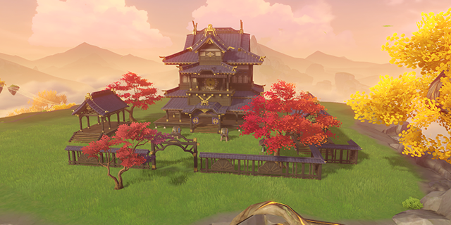
      </th>
      <th style="padding: 0; vertical-align: top;">
        

          

            正格之庭
            

          

          

            
                <strong>偏好摆设的同伴：</strong> 
                九条裟罗 神里绫人
            
          

        

      </th>
    </tr>
    <tr>
        <th colspan="2" style="font-weight: normal;">
        <strong>描述：</strong> 
        		大气磅礴的稻妻庭院，将三奉行府第的建筑与奉行所的设施巧妙结合，兼具名门宅邸的气势与执行机构的干练，并保持着恰到好处的美感，可谓「正格」。 
出身显赫且臣心如水的志士，想必会认同这种庭院的布置。听说天领奉行的某位大将就曾提出过建议——官员们理应居住在岗位附近，以便快速投入工作，为将军大人所追求的「永恒」倾尽全力。
        </th>
    </tr>
    <tr>
        <th colspan="2" style="font-weight: normal;">
        <strong>对话：</strong> 
        	九条裟罗 : 嗯，单论气势，这间庭院并不逊色于天领奉行府。 
九条裟罗 : 井然有序的庭院会给人一种暗示，让人恪守规则。 
九条裟罗 : 你居然独自参透了这个道理，值得敬佩。 

神里绫人 : 这里的布置确实巧妙，外形上取了三奉行府第的特征，布景上又兼顾了美感。 
神里绫人 : 熟悉的环境令人惬意，身边同行之人也不乏雅趣。 
神里绫人 : 呵呵，真是愉快。
        </th>
    </tr>
  </thead>
</table>

### 醒意汤泉

<table class="table-set">
  <thead>
    <tr>
      <th class="th-set" rowspan="1">
        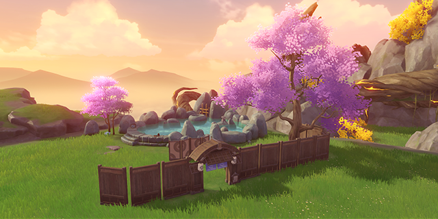
      </th>
      <th style="padding: 0; vertical-align: top;">
        

          

            醒意汤泉
            

          

          

            
                <strong>偏好摆设的同伴：</strong> 
                宵宫 五郎 八重神子 鹿野院平藏 千织 梦见月瑞希
            
          

        

      </th>
    </tr>
    <tr>
        <th colspan="2" style="font-weight: normal;">
        <strong>描述：</strong> 
        		陈设完备的露天温泉。虽说水温和池中蕴含的矿物元素稍逊于「秋沙钱汤」，但整体气氛更为轻松随意，没有太多规矩。 
在温泉里泡上半小时，今日工作所积累的疲惫就会悄然散去，身体中的活力将被再度唤醒。倘若时间充足，便能倚靠池边白石，品着茶与友人闲谈。 
当然，入池之前，还请注意基本礼仪；与友人一同享受温泉时，还请留意泡澡的时间。要是在温泉里和「夏祭女王」那般健谈的朋友聊天过久，可能会头晕目眩哦。
        </th>
    </tr>
    <tr>
        <th colspan="2" style="font-weight: normal;">
        <strong>对话：</strong> 
        	宵宫 : 哇，我看到了什么，好棒的露天温泉！ 
宵宫 : 结束一天的工作之后，泡个热乎乎的澡，再舒服不过了！ 
宵宫 : 要一起吗？边泡澡边聊天，也是一种享受哦！ 

五郎 : 暖乎乎的温泉，真不错啊… 
五郎 : 只要在温泉里泡上半小时，训练和战斗时积累的疲劳就都会消散了。 
五郎 : 我现在能用这里的温泉吗？你也要一起来吗？ 

八重神子 : 居然有我喜欢的温泉，那我就不客气地借用了哦？ 
八重神子 : 泡在热气腾腾的温泉里，本就是涤净污秽、舒缓身心的好方式。 
八重神子 : 若是身前再有一壶清酒，那可真是再好不过。 

鹿野院平藏 : 哦！这不是露天温泉嘛，这蒸腾的水汽，看起来温度就很合适。 
鹿野院平藏 : 泡温泉的时候，灵感也会像蒸汽一样「呼——」地往上升。 
鹿野院平藏 : 这可真是个好东西，看来你也很懂享受嘛。 

千织 : 自从我离开稻妻之后，就没见过这么精致的汤泉了。真是怀念。 
千织 : 我在稻妻养成了工作结束后泡澡的习惯，现在依旧没变。可惜枫丹的家里只有小小的浴缸。 
千织 : 那我就不客气了。衣服脱在哪儿？还是说叠好了放地上就行？ 

梦见月瑞希 : 啊呀…没想到在我归来前，你就对稻妻风格的露天温泉颇有研究了。 
梦见月瑞希 : 温泉的水温，石质雕塑的造型，点缀的绿植和樱树，甚至屏风的造型和摆放位置，都无可挑剔… 
梦见月瑞希 : 或许假以时日，你也能成为「秋沙钱汤」的经营者呢？可以考虑一下入股事宜，和我合伙哦。
        </th>
    </tr>
  </thead>
</table>

### 村中匿影

<table class="table-set">
  <thead>
    <tr>
      <th class="th-set" rowspan="1">
        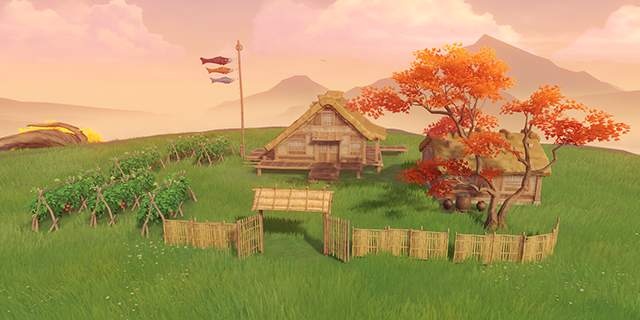
      </th>
      <th style="padding: 0; vertical-align: top;">
        

          

            村中匿影
            

          

          

            
                <strong>偏好摆设的同伴：</strong> 
                早柚 五郎
            
          

        

      </th>
    </tr>
    <tr>
        <th colspan="2" style="font-weight: normal;">
        <strong>描述：</strong> 
        		稻妻乡野的村庄，充分还原了绀田村的景致。建筑的「年岁」已高，但并不破旧，呈现出别样的悠然与朴实之感，每座房屋都毫不起眼，似乎再过几年，就能与周边的山野融为一体…这正是良好的藏身地所必备的特质，某位终末番忍者就时常隐藏在这种村庄中，安睡到心满意足。
        </th>
    </tr>
    <tr>
        <th colspan="2" style="font-weight: normal;">
        <strong>对话：</strong> 
        	早柚 : 村子里的地形很复杂。藏在这里睡觉，应该不会被找到吧？ 
早柚 : 屋子不高不低，还可以用来练习逃跑。 
早柚 : 真是个好地方呀… 

五郎 : 乡野的村庄，承担着提供兵源、隐藏物资，辅助侦察等功能…也是反抗军开展行动的重要支点。 
五郎 : 这座村庄的布置相当正统，让人看不出破绽，说明你详尽地考察过稻妻的环境。 
五郎 : 你的才能，真让我钦佩啊！
        </th>
    </tr>
  </thead>
</table>

### 枝社旧绪

<table class="table-set">
  <thead>
    <tr>
      <th class="th-set" rowspan="1">
        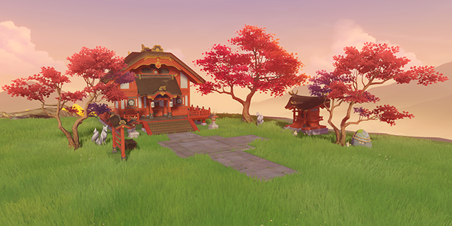
      </th>
      <th style="padding: 0; vertical-align: top;">
        

          

            枝社旧绪
            

          

          

            
                <strong>偏好摆设的同伴：</strong> 
                雷电将军 八重神子
            
          

        

      </th>
    </tr>
    <tr>
        <th colspan="2" style="font-weight: normal;">
        <strong>描述：</strong> 
        			清幽寂寥的枝社，建筑的构型，朱红漆面的色彩和整体布局均与今日的「鸣神大社」有着相同的风格。对于浮世之人，这里是静心净念的好去处，而对于大御所大人而言，置身此地所见的光景，似乎足以构成一幅朦胧的画卷，唤起久远的回忆…
        </th>
    </tr>
    <tr>
        <th colspan="2" style="font-weight: normal;">
        <strong>对话：</strong> 
        	雷电将军 : 有些眼熟的神社。 
雷电将军 : 我这是在…触景生情吗？ 
雷电将军 : 罢了，这种感觉并不坏。

八重神子 : 这神社的摆放，倒也还算讲究。 
八重神子 : 摆件的方位、相隔的距离，并没有明显的不妥。 
八重神子 : 嗯…在这方面，你倒是很细心嘛。
        </th>
    </tr>
  </thead>
</table>

### 千军致戎演兵场

<table class="table-set">
  <thead>
    <tr>
      <th class="th-set" rowspan="1">
        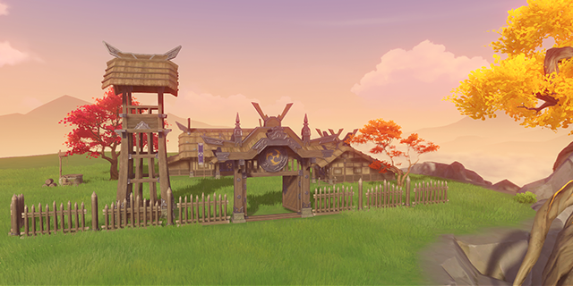
      </th>
      <th style="padding: 0; vertical-align: top;">
        

          

            千军致戎演兵场
            

          

          

            
                <strong>偏好摆设的同伴：</strong> 
                九条裟罗
            
          

        

      </th>
    </tr>
    <tr>
        <th colspan="2" style="font-weight: normal;">
        <strong>描述：</strong> 
        			参照「九条阵屋」的布局所筑的演兵场，建筑和陈设均采用军中现行的形制。 
在幕府军与反抗军的交锋过程中，双方不断采用各种方法，提高新兵入阵时的素养。相较于传统的训练场所，这种演兵场既能提供各式装备，又可模拟驻扎前线时的紧急情形，贴近实战情景，自然能让受训者得到充分的锻炼。
        </th>
    </tr>
    <tr>
        <th colspan="2" style="font-weight: normal;">
        <strong>对话：</strong> 
        	九条裟罗 : 这座营地的布置乍一看随意，细细想来却有些门道，甚至给了我不小的启发。 
九条裟罗 : 是你无意中促成的吗？还是说…你深入研究过兵法呢？ 
九条裟罗 : 总之，按照军中惯例，这般才识卓越之人，理应得到犒赏。
        </th>
    </tr>
  </thead>
</table>

### 琼片遍郁野

<table class="table-set">
  <thead>
    <tr>
      <th class="th-set" rowspan="1">
        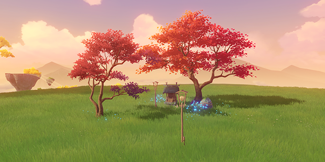
      </th>
      <th style="padding: 0; vertical-align: top;">
        

          

            琼片遍郁野
            

          

          

            
                <strong>偏好摆设的同伴：</strong> 
                枫原万叶 荒泷一斗
            
          

        

      </th>
    </tr>
    <tr>
        <th colspan="2" style="font-weight: normal;">
        <strong>描述：</strong> 
        				稻妻郊野的清谧景致，御伽木的神龛矗立于樱树，枫树与斑斓的花团之间，烛光闪烁，无形的「威严」与「安定」奇妙融会，四下弥漫，飘落的花瓣似乎都染上了几分灵性。
        </th>
    </tr>
    <tr>
        <th colspan="2" style="font-weight: normal;">
        <strong>对话：</strong> 
        	枫原万叶 : 恬美的景致，令人心情舒畅。 
枫原万叶 : 看似平平无奇的山野，其实蕴含着悠远的诗意。 
枫原万叶 : 倾注心神时，一花一木，自然万物，都会在你耳边低语。 

荒泷一斗 : 哇，真没想到，这里的景色跟鬼婆婆家差不多… 
荒泷一斗 : 不错，本大爷的心情好起来了！ 
荒泷一斗 : 找处树荫坐吧，我给你好好讲讲我那些威武帅气的山林故事，哈哈！
        </th>
    </tr>
  </thead>
</table>

### 夏夜的追想

<table class="table-set">
  <thead>
    <tr>
      <th class="th-set" rowspan="1">
        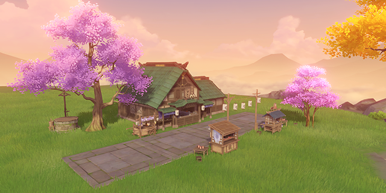
      </th>
      <th style="padding: 0; vertical-align: top;">
        

          

            夏夜的追想
            

          

          

            
                <strong>偏好摆设的同伴：</strong> 
                神里绫华 荒泷一斗 神里绫人
            
          

        

      </th>
    </tr>
    <tr>
        <th colspan="2" style="font-weight: normal;">
        <strong>描述：</strong> 
        				热闹非凡的祭典，完美复现了稻妻传统节庆的情景。 
稻妻城每年都会举办多次祭典，但份量最重，最令人们心心念念的数场祭典，大多会在盛夏时节举办。贩售料理的屋台、趣味昂然的游戏，还有夜空中的绚烂焰火，会令每个到场的游客流连忘返。同行伙伴的容姿和耳畔低语的话音，也会被深深刻入回想。
        </th>
    </tr>
    <tr>
        <th colspan="2" style="font-weight: normal;">
        <strong>对话：</strong> 
        	神里绫华 : 这些摊位布置得相当用心呢。 
神里绫华 : 虽说有些冷清，但只有我们两人的话，反而可以放下负担，轻松地享受另一种风味的「祭典」了。 
神里绫华 : 谢谢你，我真的很开心。 

荒泷一斗 : 你果然不会让人失望，这条祭典街正合我意！ 
荒泷一斗 : …好，本大爷要认真了，来摊位上一决胜负吧！ 
荒泷一斗 : 输的人…就绕这里跑三圈，边跑边喊对方是「祭典大王」！ 

神里绫人 : 这里…倒是让我想起来，绫华小时候和我一起逛祭典的场景了… 
神里绫人 : 嗯，你布置的街市，就算是身为社奉行的我，也挑不出毛病。 
神里绫人 : 现下这里只有你我二人倒也不错，不如陪我走走？
        </th>
    </tr>
  </thead>
</table>

### 樱染的街巷

<table class="table-set">
  <thead>
    <tr>
      <th class="th-set" rowspan="1">
        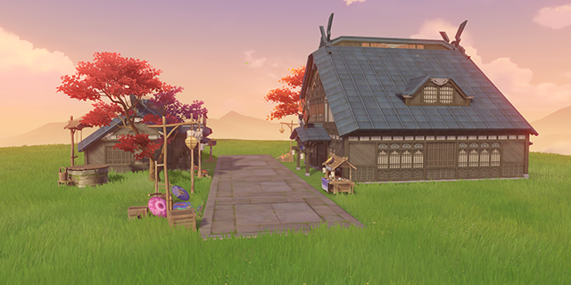
      </th>
      <th style="padding: 0; vertical-align: top;">
        

          

            樱染的街巷
            

          

          

            
                <strong>偏好摆设的同伴：</strong> 
                宵宫 托马 久岐忍 绮良良 丝柯克
            
          

        

      </th>
    </tr>
    <tr>
        <th colspan="2" style="font-weight: normal;">
        <strong>描述：</strong> 
        	以稻妻城的商店街为摹版，精心布置的街道。 
无论外界的局势怎样变动，稻妻城中的大多居民，还是能在平静祥和的氛围中生活。而平易近人的市井街道反映着居民们衣食住行的情况，是一座城市最真实的写照。只需跟着神里家家政官这样的本地万事通，走访各个商户，很快就能领略到迷人的风土人情。
        </th>
    </tr>
    <tr>
        <th colspan="2" style="font-weight: normal;">
        <strong>对话：</strong> 
        	宵宫 : 没错！就是这种感觉！这熟悉的氛围太让我喜欢了！ 
宵宫 : 你还真厉害啊，居然能把这里布置成商店街的模样。快让我找找「长野原」在哪里。 
宵宫 : 哎呀，你也一起来吧，准备得那么辛苦，我们要好好玩个够才行！ 

托马 : 你很懂行嘛！要是放在稻妻，这条街道都能和花见坂抢生意了！ 
托马 : 可惜在这里发挥不了我「地头蛇」的优势，打折什么的是做不到了… 
托马 : 但一起逛街的话，好吃好喝都不会亏待你的，嘿嘿。 

久岐忍 : 我干过卖玩具的兼职，结果不仅没卖出多少货，还被好多家长投诉… 
久岐忍 : 说我戴着面铠又凶神恶煞的样子容易吓到小孩…可是我明明记得路过的小孩都在说我很酷。 
久岐忍 : 算了，过去就过去了。 

绮良良 : 我喜欢这样的街景！既热闹又漂亮。 
绮良良 : 尤其是爬上房顶，从上往下看着人们来来往往的时候，特别有意思！ 
绮良良 : 欸对了，机会难得，不如和我一起试试吧！ 

丝柯克 : 不久前，我梦见过与这里相似的景色。 
丝柯克 : 自从掌握理性的奥秘，我会强令自己不要做梦，梦会影响身心恢复的速度。但仍有意外，毕竟梦是心底深处的投影，理性也不能完全阻止。 
丝柯克 : 在这种平静的地方驻足停歇，或许正是我此刻的愿望。
        </th>
    </tr>
  </thead>
</table>

## 室内套装

### 遐久瞬梦间

<table class="table-set">
  <thead>
    <tr>
      <th class="th-set" rowspan="1">
        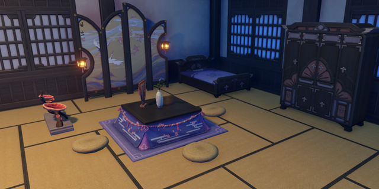
      </th>
      <th style="padding: 0; vertical-align: top;">
        

          

            遐久瞬梦间
            

          

          

            
                <strong>偏好摆设的同伴：</strong> 
                早柚 珊瑚宫心海 鹿野院平藏
            
          

        

      </th>
    </tr>
    <tr>
        <th colspan="2" style="font-weight: normal;">
        <strong>描述：</strong> 
        	极具稻妻的特色的卧室，却也融合了别国陈设的理念，在传统与实用之间取得了绝妙的平衡。设计时就仔细考虑过住客的感受，能让人充分放松身心，短暂休息后，就能获得长期睡眠般的体验，像是在梦中度过了长久的时光。贴心设置的被炉则能让人足不出户就处理多种事务。
        </th>
    </tr>
    <tr>
        <th colspan="2" style="font-weight: normal;">
        <strong>对话：</strong> 
        	早柚 : 这里似乎很适合作为安全屋。 
早柚 : 不被人发现，可以尽情睡个够。 
早柚 : 我非常喜欢这里，谢谢你！ 

珊瑚宫心海 : 床榻和被炉的距离刚刚好，衣柜也摆在趁手的位置…嗯，我很喜欢这间卧室。 
珊瑚宫心海 : 卧室是最安静的地方，关上房门后，谁都不能打扰我… 
珊瑚宫心海 : 当然…你是例外。 

鹿野院平藏 : 哇…这个布置、这种结构，太棒了！只差一些光效了… 
鹿野院平藏 : 「啪」——灯突然熄灭，「哐哐」——衣柜开始摇晃。嘶哑的声音…隐约从床底的方向传来… 
鹿野院平藏 : 哈哈，是不是很有密室事件的感觉呢？
        </th>
    </tr>
  </thead>
</table>

### 千振致业

<table class="table-set">
  <thead>
    <tr>
      <th class="th-set" rowspan="1">
        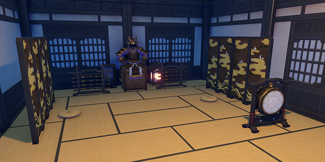
      </th>
      <th style="padding: 0; vertical-align: top;">
        

          

            千振致业
            

          

          

            
                <strong>偏好摆设的同伴：</strong> 
                雷电将军 神里绫华
            
          

        

      </th>
    </tr>
    <tr>
        <th colspan="2" style="font-weight: normal;">
        <strong>描述：</strong> 
        		锤炼正统刀术的道场。多具宗传刀架陈列四周，并以正襟危坐的盔甲肃正气氛。作为饰物的「破邪之弦镝」与「驱鬼之羽屏」，则有着驱除周遭邪祟与修行者心中邪念的功用。 
稻妻的武人们大多坚信，不谈每日挥刀素振千次，只要维持磨砺刀术的意志，并为之付诸全力，定能不断接近刀术的极致。
        </th>
    </tr>
    <tr>
        <th colspan="2" style="font-weight: normal;">
        <strong>对话：</strong> 
        	雷电将军 : 道场？… 
雷电将军 : 你在精进武艺？想必是「无想的一刀」促成了你的决意。 
雷电将军 : 追索极致之人，当赏。 

神里绫华 : 宅邸中的道场，就像摆放在茶桌边的佩剑，时刻提醒着我，不能怠懈。 
神里绫华 : 神里流太刀术的要义之一，在于不断锤炼自己的「剑心」。 
神里绫华 : 啊，趁这个机会，要不要一起练习一番呢？
        </th>
    </tr>
  </thead>
</table>

### 沉墨书舍

<table class="table-set">
  <thead>
    <tr>
      <th class="th-set" rowspan="1">
        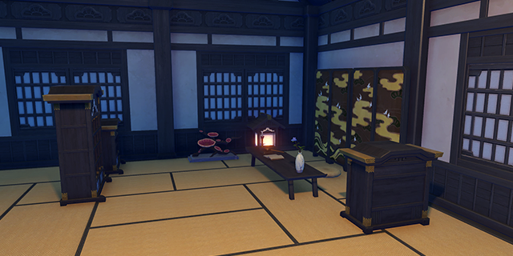
      </th>
      <th style="padding: 0; vertical-align: top;">
        

          

            沉墨书舍
            

          

          

            
                <strong>偏好摆设的同伴：</strong> 
                珊瑚宫心海 久岐忍
            
          

        

      </th>
    </tr>
    <tr>
        <th colspan="2" style="font-weight: normal;">
        <strong>描述：</strong> 
        		各式摆设一应俱全的书房，采用了三奉行皆有购置的大型书柜，足以容纳百千卷藏。但在一些稻妻人看来，书房的藏书总量或许并不重要，「精准」和「沉淀」才是他们的追求，对于读过的好书，理应「字字皆入心」。因此，只需将书柜上的卷藏根据个人的重视程度合理摆放，早已熟读并铭记在心的书本，借出或卖掉也无妨。听说海祇岛尊贵的「现人神巫女」就有着这样的习惯。
        </th>
    </tr>
    <tr>
        <th colspan="2" style="font-weight: normal;">
        <strong>对话：</strong> 
        	珊瑚宫心海 : 唔…你还真是深藏不露啊。 
珊瑚宫心海 : 书房里的卷藏这么丰富，居然还有我中意的刊物。莫非…你也读过吗？ 
珊瑚宫心海 : 请，请和我交流心得！ 

久岐忍 : 这里的书比我想象中还要多，种类也很齐全… 
久岐忍 : 嗯？居然连参考书都有，粗粗翻了翻还挺有意思的… 
久岐忍 : 那我不客气了。接下来我可能会花很长时间泡在这里，希望你不要介意。
        </th>
    </tr>
  </thead>
</table>

### 枫香茶雾一室中

<table class="table-set">
  <thead>
    <tr>
      <th class="th-set" rowspan="1">
        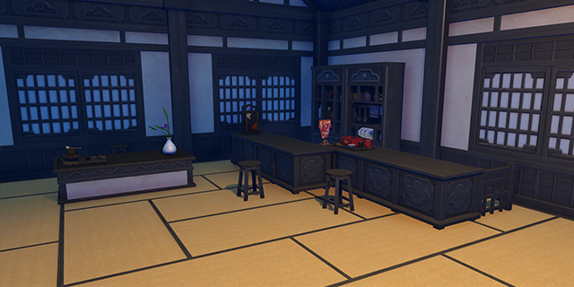
      </th>
      <th style="padding: 0; vertical-align: top;">
        

          

            枫香茶雾一室中
            

          

          

            
                <strong>偏好摆设的同伴：</strong> 
                托马 枫原万叶 梦见月瑞希
            
          

        

      </th>
    </tr>
    <tr>
        <th colspan="2" style="font-weight: normal;">
        <strong>描述：</strong> 
        		传统风格的稻妻茶室，布局与陈设参照了「木漏茶室」，并采用了相同的枫木桌柜与茶具，还原了那种清雅而不严肃，亲切而不随意的氛围。 
传说，置身于枫木与茶香缭绕的茶室之中，别样的灵感将泉涌而至。因此，某些诗人常在品茶之时挥笔成句，比如为多种花草题名雅号的少年浪人。
        </th>
    </tr>
    <tr>
        <th colspan="2" style="font-weight: normal;">
        <strong>对话：</strong> 
        	托马 : 这间茶室挺不错的，看得出来，你花了不少心思挑选桌椅和茶具！ 
托马 : 想不想…再养些小动物呢？ 
托马 : 放心，打理的事情就包在我身上了！ 

枫原万叶 : 做工细致的装潢，静谧的茶室，缭绕的茶香… 
枫原万叶 : 嗯，这里的氛围，我很中意。 
枫原万叶 : 有空之时，不妨与我一同在此品茶，聊聊你欣赏的诗句？ 

梦见月瑞希 : 安静的茶室很适合放松心情…当然，安静指的是氛围，并非绝对无声。响度适中、节奏舒缓的音乐对于改善心境相当有益。 
梦见月瑞希 : 常规心理疗法中，有一条叫做「引导患者静心冥想」… 
梦见月瑞希 : 请坐，抛下你的一切烦恼，由我陪你放松片刻吧。
        </th>
    </tr>
  </thead>
</table>

