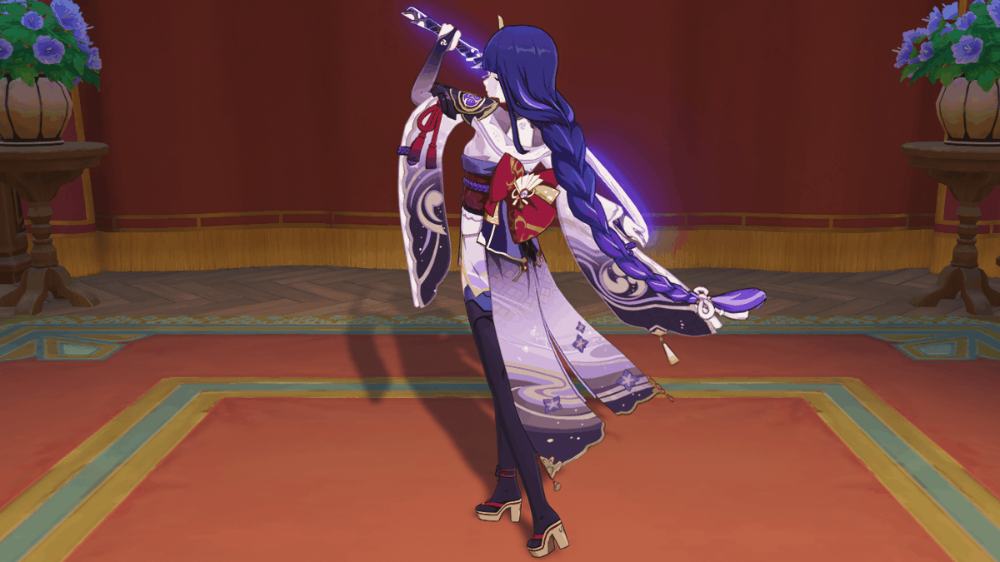
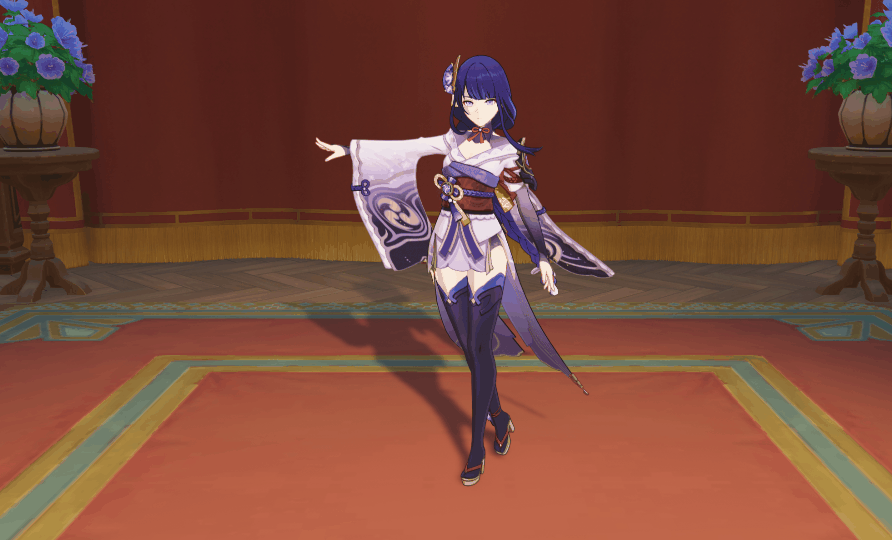
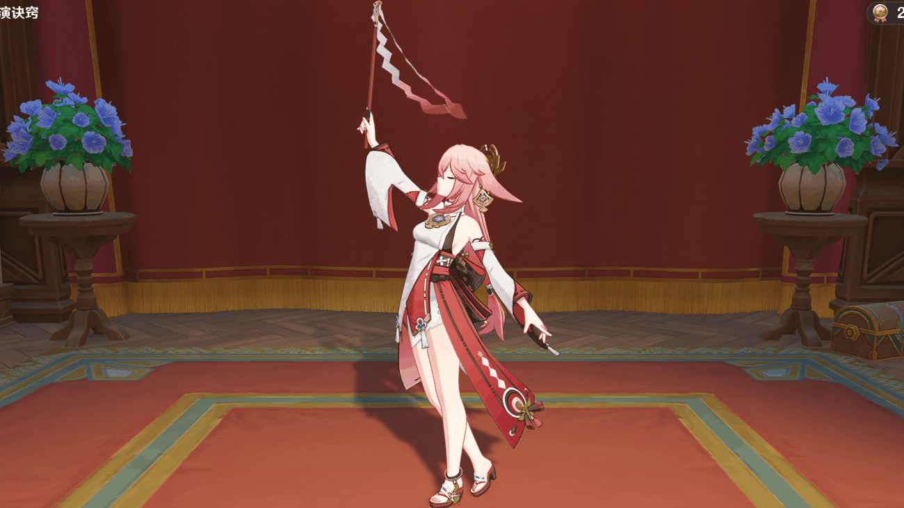
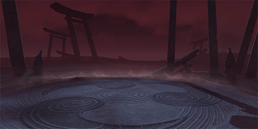
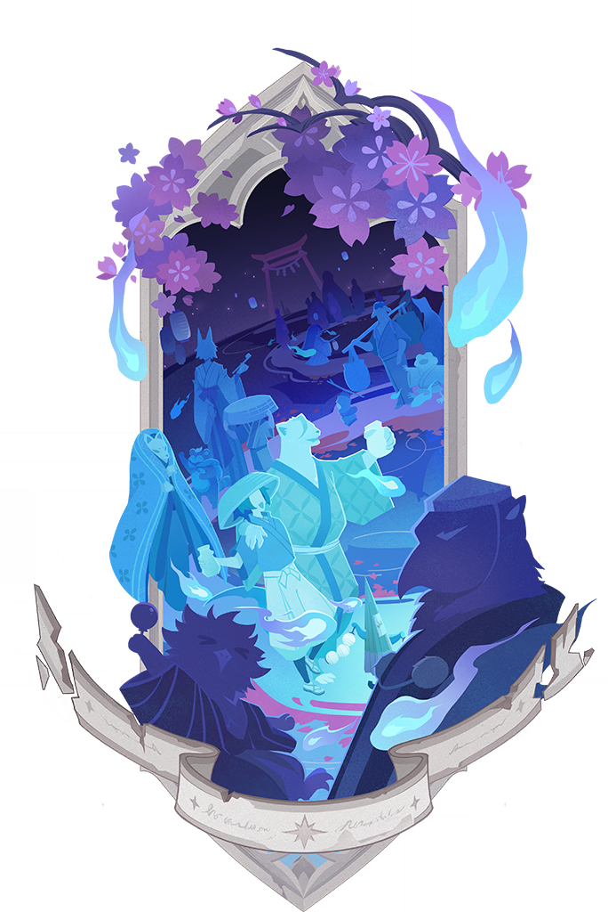

# 幻想真境剧诗相关内容

## 幻想真境剧诗对话

### 雷电将军

影 : 在彻底结束战斗之前驻足小憩，这种事对我来说并不常有。

影 : 「已经到可以稍憩片刻的时候了吗？」我会反复询问自己。如果魔物还未斩尽，那我也不该就此停下。

影 : 你想先随我冥想片刻？唔，好吧。那你便闭上双眼，与我一同观照内心…

影 : 我知道你武艺高强，但此秘境的魔物层见叠出，不容小觑。

影 : 无须担心。我既然回应你的邀请，便会与你穷究此地奥秘。

影 : 就让我以此刀，斩灭来敌。

影 : 要与我进行歌牌对决吗？作为闲暇时分的调剂，能帮你我二人放松心情，也能助我保持进取之姿。

影 : 只是…这作为最终奖品的糕点，也不知道能否从外面带进来…

影 : 嗯，既然如此…庆祝之地，就选在神樱树下吧。现在，做好觉悟了吗？

### 八重神子

八重神子 : 你说要是「一心净土」里也有那么多故事可看，影那家伙…会不会更不愿意出来啦？

八重神子 : 我有个好主意，就和她说这里除了有好看的轻小说，还有好吃的三彩团子吧！也该带她出天守阁转转了。

八重神子 : 哦，团子牛奶也不能少。嗯？你说没有？那想办法让它们有，不就是小家伙你的工作了吗？

### 九条裟罗

九条裟罗 : 这里的藏书，不知将军大人是否喜爱…

九条裟罗 : 出门远行，理应带些礼物。如此一来，将军大人恐怕不会拒绝。我便先以个人的名义购买五本带回去…

九条裟罗 : 但前提是，这里的管理者能够答应我买书的请求啊。

### 神里绫人

神里绫人 : 我早有听闻，蒙德信奉的神明不会给子民施加过多的约束。兴衰与否，似乎更在于子民自身。

神里绫人 : 这到底是幸运还是不幸呢？我常常在安静时思考这不同种「守护」的形式。

神里绫人 : 哎呀，我可不是要僭越地评价些什么。说到底，我也想守护那一个个家啊。

## 「表演诀窍」

### 雷电将军·砥兵备战

<table class="table-study">
    <thead>
        <tr>
                <td style="text-align: center"><strong>雷电将军·砥兵备战</strong></td>
            </tr>
    </thead>
    <tbody>
            <tr>
                
            </tr>
    </tbody>
</table>

### 雷电将军·御令示下

<table class="table-study">
    <thead>
        <tr>
                <td style="text-align: center"><strong>雷电将军·御令示下</strong></td>
            </tr>
    </thead>
    <tbody>
            <tr>
                
            </tr>
    </tbody>
</table>

### 八重神子·祝祷之时

<table class="table-study">
    <thead>
        <tr>
                <td style="text-align: center"><strong>八重神子·祝祷之时</strong></td>
            </tr>
    </thead>
    <tbody>
            <tr>
                
            </tr>
    </tbody>
</table>

## 绘想游迹

### 一心净土·游迹挑战

<table class="table-artifact">
  <thead>
    <tr>
      <th class="th-artifact"></th>
      <th class="th-artifact-padding">
        
        <strong>特殊规则 : </strong>
             
            在「一心净土」挑战中，将周期性出现「鸣雷迸发」，「鸣雷迸发」期间，雷电将军的暴击伤害提升150%。
             
            在「一心净土」挑战中，当前场上角色的攻击命中敌人时，将产生4个雷元素微粒，此效果每25秒至多触发一次。
            
      </th>
    </tr>
  </thead>
</table>

### 游迹·一心净土

<table class="table-weapon">
  <thead>
    <tr>
      <th class="th-weapon" rowspan="1">
        
      </th>
      <th style="padding: 0; vertical-align: top;">
        

          

            游迹·一心净土
            

          

          

            
              <strong>描述：</strong> 
              雷电将军的绘想游迹。「弓张如弦月，刃研似璧澄。玉真信已远，月影徒伴身。」
            
          

        

      </th>
    </tr>
  </thead>
</table>

## 月谕圣牌

### 月谕圣牌·二十·审判

<table class="table-weapon">
  <thead>
    <tr>
      <th class="th-weapon" rowspan="1">
        
      </th>
      <th style="padding: 0; vertical-align: top;">
        

          

            二十·审判
            

          

          

            
              刀枪剑戟八千队，铁马兵戈十万重。 
 
说是那泉台路遥，无常樱。 
 
且待那春风吹散， 
 
小夜岚。 
 
诸君啊， 
 
如今黄泉归来， 
 
且看幻光浮世作何模样。 
 
那幽冥地府未「审判」，「永劫」光景无变移。 
 
呜呼，终非昔日之世， 
 
过去之心亦不可得。 
 
徒留我等 
 
英名进绘鉴，百鬼入画图。
            
          

        

      </th>
    </tr>
  </thead>
</table>

