# 角色牌

## 雷电将军

### 一心净土·雷电将军

<table class="table-weapon">
  <thead>
    <tr>
      <th class="th-weapon-1" rowspan="1">
        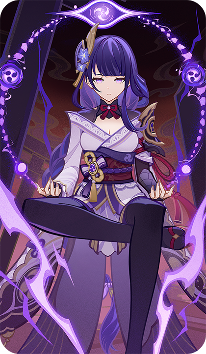
      </th>
      <th style="padding: 0; vertical-align: top;">
        

          

            一心净土·雷电将军
            

          

          

            
              <strong>元素 ：</strong>雷元素 
              <strong>武器 ：</strong>长柄武器 
              <strong>阵营 ：</strong>稻妻 
              <strong>充能 ：</strong>2点
            
          

          

          

            
              <strong>一心净土·雷电将军</strong> 鸣雷寂灭，浮世泡影。 
              <strong>来源 ：</strong> 在猫尾酒馆中邀请雷电将军进行对局，在友好对局难度中获得胜利后获取
            
          

        

      </th>
    </tr>
  </thead>
</table>

### 天赋

<table class="table-attack">
  <thead>
    <tr>
      <th class="th-attack" rowspan="2"></th>
      <th style="padding: 0; vertical-align: top;">
        

          

            <strong>名称：</strong>源流
            

          

          

            
              <strong>技能类型 ：</strong>普通攻击 
              <strong>技能效果 ：</strong>造成2点物理伤害
            
          

        

      </th>
    </tr>
  </thead>
</table>

<table class="table-attack">
  <thead>
    <tr>
      <th class="th-attack" rowspan="2"></th>
      <th style="padding: 0; vertical-align: top; width:688px;">
        

          

            <strong>名称：</strong>神变·恶曜开眼
            

          

          

            
              <strong>技能类型 ：</strong>元素战技 
              <strong>技能效果 ：</strong>召唤雷罚恶曜之眼。 
            &nbsp;&nbsp;• 雷罚恶曜之眼 
&nbsp;&nbsp;结束阶段：造成1点雷元素伤害。 
&nbsp;&nbsp;可用次数：3 
&nbsp;&nbsp;此召唤物在场时：我方角色「元素爆发」造成的伤害+1。
            
          

        

      </th>
    </tr>
  </thead>
</table>

<table class="table-attack">
  <thead>
    <tr>
      <th class="th-attack" rowspan="2"></th>
      <th style="padding: 0; vertical-align: top;">
        

          

            <strong>名称：</strong>奥义·梦想真说
            

          

          

            
              <strong>技能类型 ：</strong>元素爆发 
              <strong>技能效果 ：</strong>造成3点雷元素伤害，其他我方角色获得2点充能。
            
          

        

      </th>
    </tr>
  </thead>
</table>

<table class="table-attack">
  <thead>
    <tr>
      <th class="th-attack" rowspan="2"></th>
      <th style="padding: 0; vertical-align: top;">
        

          

            <strong>名称：</strong>诸愿百眼之轮
            

          

          

            
              <strong>技能类型 ：</strong>被动技能 
              <strong>技能效果 ：</strong>【被动】战斗开始时，初始附属诸愿百眼之轮。 
            &nbsp;&nbsp;• 诸愿百眼之轮 
&nbsp;&nbsp;其他我方角色使用「元素爆发」后：累积1点「愿力」。（最多累积3点） 
&nbsp;&nbsp;所附属角色使用奥义·梦想真说时：消耗所有「愿力」，每点「愿力」使造成的伤害+1。
            
          

        

      </th>
    </tr>
  </thead>
</table>

### 雷罚恶曜之眼

<table class="table-weapon">
  <thead>
    <tr>
      <th class="th-weapon-1" rowspan="1">
        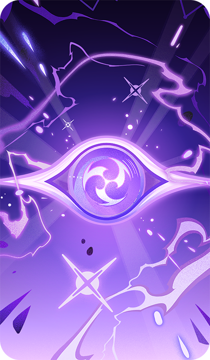
      </th>
      <th style="padding: 0; vertical-align: top;">
        

          

            雷罚恶曜之眼
            

          

          

            
              <strong>技能类型 ：</strong>召唤物 
              <strong>召唤物效果 ：</strong> 
              结束阶段：造成1点雷元素伤害。 
可用次数：3 
此召唤物在场时：我方角色「元素爆发」造成的伤害+1。
            
          

        

      </th>
    </tr>
  </thead>
</table>

### 万千的愿望

<table class="table-weapon">
  <thead>
    <tr>
      <th class="th-weapon-1" rowspan="1">
        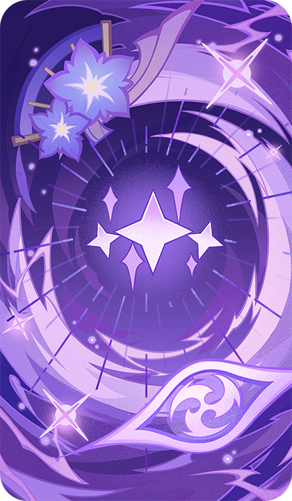
      </th>
      <th style="padding: 0; vertical-align: top;">
        

          

            万千的愿望
            

          

          

            
               <strong>雷电将军·万千的愿望</strong> 恶曜开眼，威光无赦。 
               

                <strong>技能类型 ：</strong>装备牌 
              <strong>天赋效果 ：</strong> 
              战斗行动：我方出战角色为雷电将军时，装备此牌。 
雷电将军装备此牌后，立刻使用一次奥义·梦想真说。 
装备有此牌的雷电将军使用奥义·梦想真说时：每消耗1点「愿力」，都使造成的伤害额外+1。 
（牌组中包含雷电将军，才能加入牌组）
            
          

        

      </th>
    </tr>
  </thead>
</table>

## 魔偶剑鬼

### 万般机巧·魔偶剑鬼

<table class="table-weapon">
  <thead>
    <tr>
      <th class="th-weapon-1" rowspan="1">
        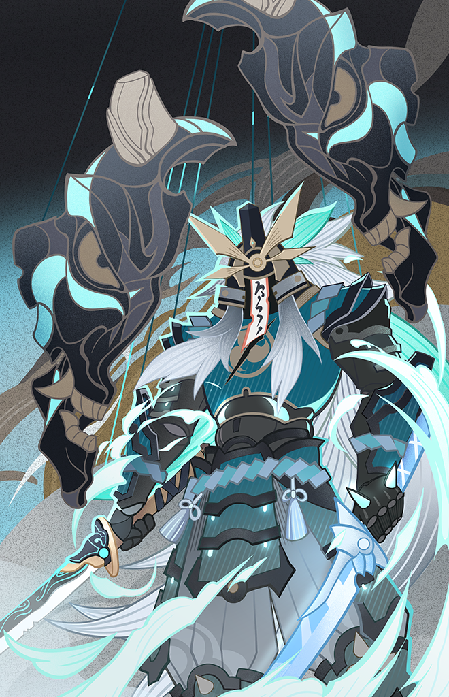
      </th>
      <th style="padding: 0; vertical-align: top;">
        

          

            万般机巧·魔偶剑鬼
            

          

          

            
              <strong>万般机巧·魔偶剑鬼</strong> 今日，其仍徘徊在因缘断绝之地。
            
          

        

      </th>
    </tr>
  </thead>
</table>

### 天赋

<table class="table-attack">
  <thead>
    <tr>
      <th class="th-attack" rowspan="2"></th>
      <th style="padding: 0; vertical-align: top;">
        

          

            <strong>名称：</strong>一文字
            

          

          

            
              <strong>技能类型 ：</strong>普通攻击
            
          

        

      </th>
    </tr>
  </thead>
</table>

<table class="table-attack">
  <thead>
    <tr>
      <th class="th-attack" rowspan="2"></th>
      <th style="padding: 0; vertical-align: top;">
        

          

            <strong>名称：</strong>孤风刀势
            

          

          

            
              <strong>技能类型 ：</strong>元素战技 
              <strong>技能效果 ：</strong>召唤剑影·孤风。
            
          

        

      </th>
    </tr>
  </thead>
</table>

<table class="table-attack">
  <thead>
    <tr>
      <th class="th-attack" rowspan="2"></th>
      <th style="padding: 0; vertical-align: top;">
        

          

            <strong>名称：</strong>霜驰影突
            

          

          

            
              <strong>技能类型 ：</strong>元素爆发 
              <strong>技能效果 ：</strong>召唤剑影·霜驰。
            
          

        

      </th>
    </tr>
  </thead>
</table>

<table class="table-attack">
  <thead>
    <tr>
      <th class="th-attack" rowspan="2"></th>
      <th style="padding: 0; vertical-align: top;">
        

          

            <strong>名称：</strong>机巧伪天狗抄
            

          

          

            
              <strong>技能类型 ：</strong>被动技能 
              <strong>技能效果 ：</strong>造成4点风元素伤害，触发所有我方剑影召唤物的效果。（不消耗其可用次数）
            
          

        

      </th>
    </tr>
  </thead>
</table>

### 剑影·孤风

<table class="table-weapon">
  <thead>
    <tr>
      <th class="th-weapon-1" rowspan="1">
        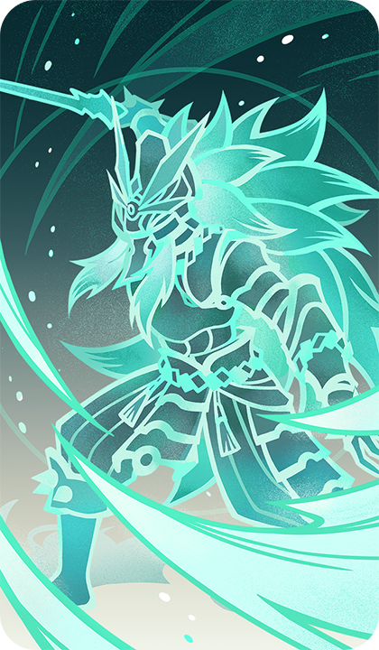
      </th>
      <th style="padding: 0; vertical-align: top;">
        

          

            剑影·孤风
            

          

          

            
              <strong>技能类型 ：</strong>召唤物
            
          

        

      </th>
    </tr>
  </thead>
</table>

### 剑影·霜驰

<table class="table-weapon">
  <thead>
    <tr>
      <th class="th-weapon-1" rowspan="1">
        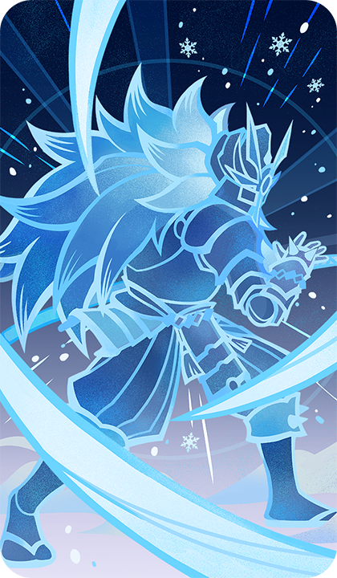
      </th>
      <th style="padding: 0; vertical-align: top;">
        

          

            剑影·霜驰
            

          

          

            
              <strong>技能类型 ：</strong>召唤物
            
          

        

      </th>
    </tr>
  </thead>
</table>

### 机巧神通

<table class="table-weapon">
  <thead>
    <tr>
      <th class="th-weapon-1" rowspan="1">
        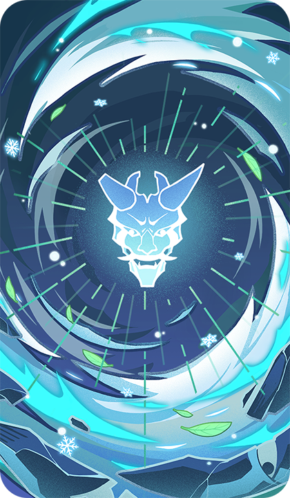
      </th>
      <th style="padding: 0; vertical-align: top;">
        

          

            机巧神通
            

          

          

            
               <strong>剑豪人形</strong> 毫厘不差的斩击，或已斩出千万次。 
               

                <strong>技能类型 ：</strong>装备牌 
              <strong>天赋效果 ：</strong> 
              <strong>战斗行动：</strong>我方出战角色为魔偶剑鬼时，装备此牌。 
魔偶剑鬼装备此牌后，立刻使用一次孤风刀势。 
装备有此牌的魔偶剑鬼使用孤风刀势后，我方切换到后一个角色；使用霜驰影突后，我方切换到前一个角色。 
（牌组中包含魔偶剑鬼，才能加入牌组）
            
          

        

      </th>
    </tr>
  </thead>
</table>

## 九条裟罗

### 黑羽鸣镝·九条裟罗

<table class="table-weapon">
  <thead>
    <tr>
      <th class="th-weapon-1" rowspan="1">
        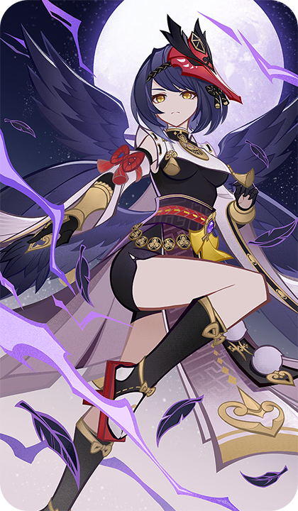
      </th>
      <th style="padding: 0; vertical-align: top;">
        

          

            黑羽鸣镝·九条裟罗
            

          

          

            
              <strong>黑羽鸣镝·九条裟罗</strong> 「此为，大义之举。」
            
          

        

      </th>
    </tr>
  </thead>
</table>

### 天赋

<table class="table-attack">
  <thead>
    <tr>
      <th class="th-attack" rowspan="2"></th>
      <th style="padding: 0; vertical-align: top;">
        

          

            <strong>名称：</strong>天狗传弓术
            

          

          

            
              <strong>技能类型 ：</strong>普通攻击
            
          

        

      </th>
    </tr>
  </thead>
</table>

<table class="table-attack">
  <thead>
    <tr>
      <th class="th-attack" rowspan="2"></th>
      <th style="padding: 0; vertical-align: top; width: 688px;">
        

          

            <strong>名称：</strong>鸦羽天狗霆雷召咒
            

          

          

            
              <strong>技能类型 ：</strong>元素战技 
              <strong>技能效果 ：</strong>造成1点雷元素伤害，召唤天狗咒雷·伏。
            
          

        

      </th>
    </tr>
  </thead>
</table>

<table class="table-attack">
  <thead>
    <tr>
      <th class="th-attack" rowspan="2"></th>
      <th style="padding: 0; vertical-align: top;">
        

          

            <strong>名称：</strong>煌煌千道镇式
            

          

          

            
              <strong>技能类型 ：</strong>元素爆发 
              <strong>技能效果 ：</strong>造成1点雷元素伤害，召唤天狗咒雷·雷砾。
            
          

        

      </th>
    </tr>
  </thead>
</table>

### 天狗咒雷·伏

<table class="table-weapon">
  <thead>
    <tr>
      <th class="th-weapon-1" rowspan="1">
        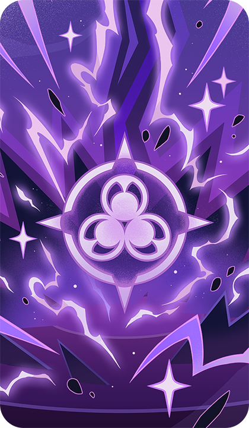
      </th>
      <th style="padding: 0; vertical-align: top;">
        

          

            天狗咒雷·伏
            

          

          

            
              <strong>技能类型 ：</strong>召唤物 
              <strong>召唤物效果 ：</strong> 
              结束阶段：造成1点雷元素伤害，我方出战角色附属鸣煌护持。 
可用次数：1
            
          

        

      </th>
    </tr>
  </thead>
</table>

### 天狗咒雷·雷砾

<table class="table-weapon">
  <thead>
    <tr>
      <th class="th-weapon-1" rowspan="1">
        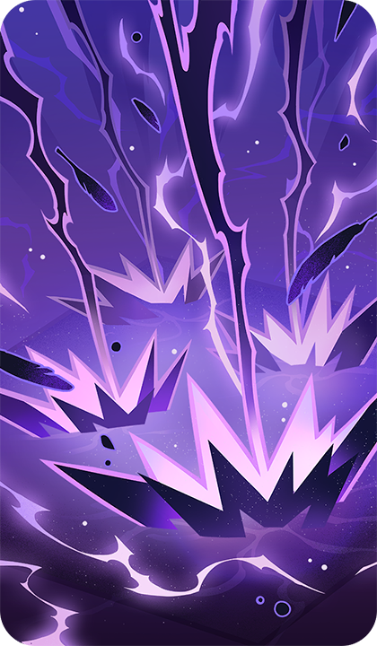
      </th>
      <th style="padding: 0; vertical-align: top;">
        

          

            天狗咒雷·雷砾
            

          

          

            
              <strong>技能类型 ：</strong>召唤物 
              <strong>召唤物效果 ：</strong> 
结束阶段：造成2点雷元素伤害，我方出战角色附属鸣煌护持。 
可用次数：2
            
          

        

      </th>
    </tr>
  </thead>
</table>

### 我界

<table class="table-weapon">
  <thead>
    <tr>
      <th class="th-weapon-1" rowspan="1">
        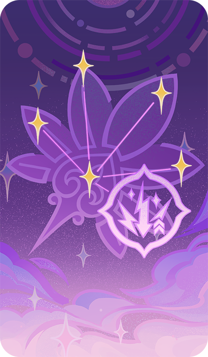
      </th>
      <th style="padding: 0; vertical-align: top;">
        

          

            我界
            

          

          

            
               <strong>九条裟罗·我界</strong> 「持心正弦，遇敌必除！」 
               

                <strong>技能类型 ：</strong>装备牌 
              <strong>天赋效果 ：</strong> 
              <strong>战斗行动：</strong>我方出战角色为九条裟罗时，装备此牌。 
九条裟罗装备此牌后，立刻使用一次鸦羽天狗霆雷召咒。 
装备有此牌的九条裟罗在场时，我方附属有鸣煌护持的雷元素角色，元素战技和元素爆发造成的伤害额外+1。 
（牌组中包含九条裟罗，才能加入牌组）
            
          

        

      </th>
    </tr>
  </thead>
</table>

## 神里绫华

### 天赋

<table class="table-attack">
  <thead>
    <tr>
      <th class="th-attack" rowspan="2"></th>
      <th style="padding: 0; vertical-align: top;">
        

          

            <strong>名称：</strong>神里流·倾
            

          

          

            
              <strong>技能类型 ：</strong>普通攻击
            
          

        

      </th>
    </tr>
  </thead>
</table>

<table class="table-attack">
  <thead>
    <tr>
      <th class="th-attack" rowspan="2"></th>
      <th style="padding: 0; vertical-align: top; width:688px;">
        

          

            <strong>名称：</strong>神里流·冰华
            

          

          

            
              <strong>技能类型 ：</strong>元素战技
            
          

        

      </th>
    </tr>
  </thead>
</table>

<table class="table-attack">
  <thead>
    <tr>
      <th class="th-attack" rowspan="2"></th>
      <th style="padding: 0; vertical-align: top;">
        

          

            <strong>名称：</strong>神里流·霜灭
            

          

          

            
              <strong>技能类型 ：</strong>元素爆发
            
          

        

      </th>
    </tr>
  </thead>
</table>

<table class="table-attack" style="width: 100%;">
  <thead>
    <tr>
      <th class="th-attack" rowspan="2"></th>
      <th style="padding: 0; vertical-align: top; width:688px;">
        

          

            <strong>名称：</strong>神里流·霰步
            

          

          

            
              <strong>技能类型 ：</strong>被动技能
            
          

        

      </th>
    </tr>
  </thead>
</table>

### 寒天宣命祝词

<table class="table-weapon">
  <thead>
    <tr>
      <th class="th-weapon-1" rowspan="1">
        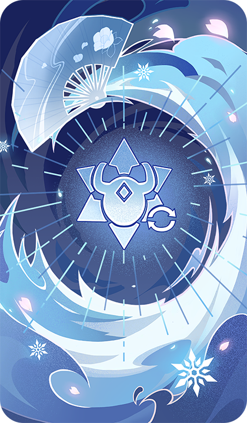
      </th>
      <th style="padding: 0; vertical-align: top;">
        

          

            寒天宣命祝词
            

          

          

            
               <strong>神里绫华·寒天宣命祝词</strong> 雪鹤衔冰，翼影翩翩。
            
          

        

      </th>
    </tr>
  </thead>
</table>

## 八重神子

### 浮世笑百姿·八重神子

<table class="table-weapon">
  <thead>
    <tr>
      <th class="th-weapon-1" rowspan="1">
        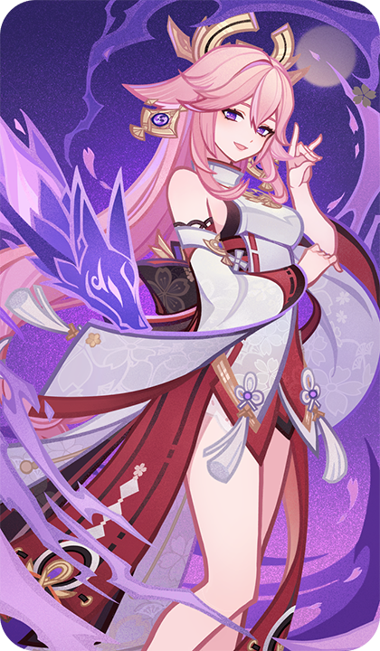
      </th>
      <th style="padding: 0; vertical-align: top;">
        

          

            浮世笑百姿·八重神子
            

          

          

            
              <strong>浮世笑百姿·八重神子</strong> 「兼具智慧与美貌的八重神子大人」
            
          

        

      </th>
    </tr>
  </thead>
</table>

### 天赋

<table class="table-attack">
  <thead>
    <tr>
      <th class="th-attack" rowspan="2"></th>
      <th style="padding: 0; vertical-align: top;">
        

          

            <strong>名称：</strong>狐灵食罪式
            

          

          

            
              <strong>技能类型 ：</strong>普通攻击
            
          

        

      </th>
    </tr>
  </thead>
</table>

<table class="table-attack">
  <thead>
    <tr>
      <th class="th-attack" rowspan="2"></th>
      <th style="padding: 0; vertical-align: top;">
        

          

            <strong>名称：</strong>野干役咒·杀生樱
            

          

          

            
              <strong>技能类型 ：</strong>元素战技 
              <strong>技能效果 ：</strong>召唤杀生樱。如果场上原本已存在杀生樱，则额外使其造成的伤害+1。（最多+1）
            
          

        

      </th>
    </tr>
  </thead>
</table>

<table class="table-attack">
  <thead>
    <tr>
      <th class="th-attack" rowspan="2"></th>
      <th style="padding: 0; vertical-align: top;">
        

          

            <strong>名称：</strong>大密法·天狐显真
            

          

          

            
              <strong>技能类型 ：</strong>元素爆发 
              <strong>技能效果 ：</strong>造成4点雷元素伤害；如果我方场上存在杀生樱，则将其消灭，然后生成天狐霆雷。
            
          

        

      </th>
    </tr>
  </thead>
</table>

### 杀生樱

<table class="table-weapon">
  <thead>
    <tr>
      <th class="th-weapon-1" rowspan="1">
        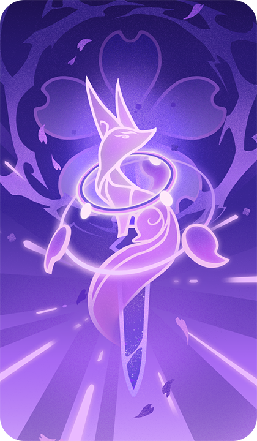
      </th>
      <th style="padding: 0; vertical-align: top;">
        

          

            杀生樱
            

          

          

            
              <strong>技能类型 ：</strong>召唤物
            
          

        

      </th>
    </tr>
  </thead>
</table>

### 神篱之御荫

<table class="table-weapon">
  <thead>
    <tr>
      <th class="th-weapon-1" rowspan="1">
        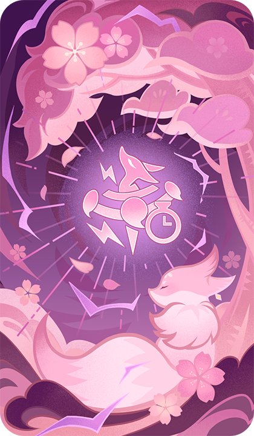
      </th>
      <th style="padding: 0; vertical-align: top;">
        

          

            神篱之御荫
            

          

          

            
              <strong>神篱之御荫</strong> 「欸…雷光凄美啊…」
              

                <strong>技能类型 ：</strong>装备牌 
              <strong>天赋效果 ：</strong> 
              <strong>战斗行动：</strong>我方出战角色为八重神子时，装备此牌。 
八重神子装备此牌后，立刻使用一次大密法·天狐显真。 
装备有此牌的八重神子通过大密法·天狐显真消灭了杀生樱后：本回合下次使用野干役咒·杀生樱时少花费2个元素骰。 
（牌组中包含八重神子，才能加入牌组）
            
          

        

      </th>
    </tr>
  </thead>
</table>

## 神里绫人

### 磐祭叶守·神里绫人

<table class="table-weapon">
  <thead>
    <tr>
      <th class="th-weapon-1" rowspan="1">
        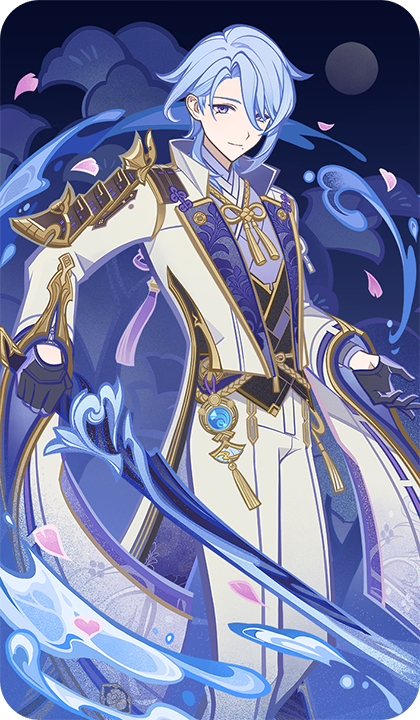
      </th>
      <th style="padding: 0; vertical-align: top;">
        

          

            磐祭叶守·神里绫人
            

          

          

            
              <strong>磐祭叶守·神里绫人</strong> 神守之柏，已焕新材。
            
          

        

      </th>
    </tr>
  </thead>
</table>

### 天赋

<table class="table-attack">
  <thead>
    <tr>
      <th class="th-attack" rowspan="2"></th>
      <th style="padding: 0; vertical-align: top;">
        

          

            <strong>名称：</strong>神里流·转
            

          

          

            
              <strong>技能类型 ：</strong>普通攻击
            
          

        

      </th>
    </tr>
  </thead>
</table>

<table class="table-attack">
  <thead>
    <tr>
      <th class="th-attack" rowspan="2"></th>
      <th style="padding: 0; vertical-align: top; width:688px;">
        

          

            <strong>名称：</strong>神里流·镜花
            

          

          

            
              <strong>技能类型 ：</strong>元素战技 
              <strong>技能效果 ：</strong>造成2点水元素伤害，本角色附属泷廻鉴花。
            
          

        

      </th>
    </tr>
  </thead>
</table>

<table class="table-attack">
  <thead>
    <tr>
      <th class="th-attack" rowspan="2"></th>
      <th style="padding: 0; vertical-align: top;">
        

          

            <strong>名称：</strong>神里流·水囿
            

          

          

            
              <strong>技能类型 ：</strong>元素爆发 
              <strong>技能效果 ：</strong>造成1点水元素伤害，召唤清净之园囿。
            
          

        

      </th>
    </tr>
  </thead>
</table>

## 荒泷一斗

### 天赋

<table class="table-attack">
  <thead>
    <tr>
      <th class="th-attack" rowspan="2"></th>
      <th style="padding: 0; vertical-align: top;">
        

          

            <strong>名称：</strong>最恶鬼王·一斗轰临！！
            

          

          

            
              <strong>技能类型 ：</strong>元素爆发 
              <strong>技能效果 ：</strong>造成4点岩元素伤害，本角色附属怒目鬼王。
            
          

        

      </th>
    </tr>
  </thead>
</table>

## 枫原万叶

### 风物之诗咏

<table class="table-weapon">
  <thead>
    <tr>
      <th class="th-weapon-1" rowspan="1">
        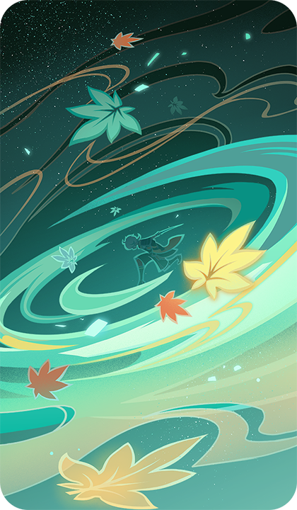
      </th>
      <th style="padding: 0; vertical-align: top;">
        

          

            风物之诗咏
            

          

          

            
              <strong>枫原万叶·风物之诗咏</strong> 在对局之中，也隐有风雅之礼。 
              至少…对局双方都「落牌无悔」。
            
          

        

      </th>
    </tr>
  </thead>
</table>

## 雷音权现

### 弥留之恨·雷音权现

<table class="table-weapon">
  <thead>
    <tr>
      <th class="th-weapon-1" rowspan="1">
        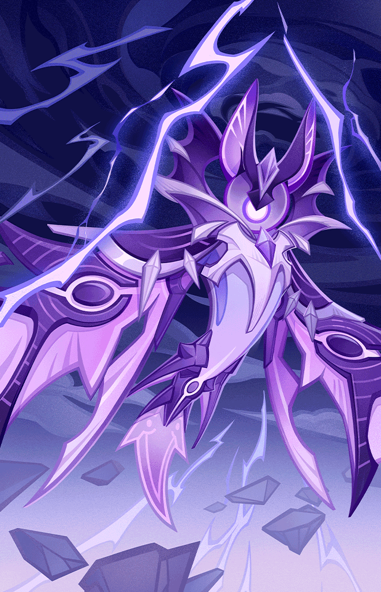
      </th>
      <th style="padding: 0; vertical-align: top;">
        

          

            弥留之恨·雷音权现
            

          

          

            
              <strong>弥留之恨·雷音权现</strong> 只要土地中的怨恨不消，那雷鸣也不会断绝吧。
            
          

        

      </th>
    </tr>
  </thead>
</table>

### 轰雷禁锢

<table class="table-weapon">
  <thead>
    <tr>
      <th class="th-weapon-1" rowspan="1">
        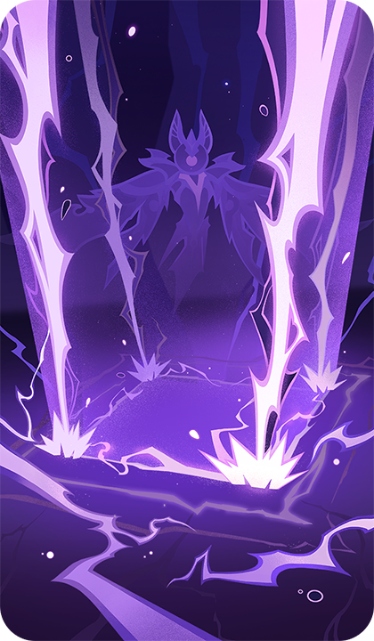
      </th>
      <th style="padding: 0; vertical-align: top;">
        

          

            杀生樱
            

          

          

            
              <strong>技能类型 ：</strong>轰雷禁锢
            
          

        

      </th>
    </tr>
  </thead>
</table>

### 悲号回唱

<table class="table-weapon">
  <thead>
    <tr>
      <th class="th-weapon-1" rowspan="1">
        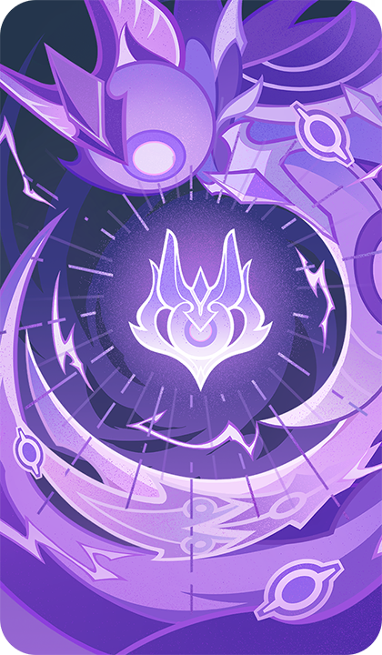
      </th>
      <th style="padding: 0; vertical-align: top;">
        

          

            悲号回唱
            

          

          

            
               <strong>雷音权现·悲号回唱</strong> 驱动雷音权现的是更为原始纯粹的愤怒…
               

                <strong>技能类型 ：</strong>装备牌
            
          

        

      </th>
    </tr>
  </thead>
</table>

## 早柚

### 天赋

<table class="table-attack">
  <thead>
    <tr>
      <th class="th-attack" rowspan="2"></th>
      <th style="padding: 0; vertical-align: top;">
        

          

            <strong>名称：</strong>忍刀·终末番
            

          

          

            
              <strong>技能类型 ：</strong>普通攻击
            
          

        

      </th>
    </tr>
  </thead>
</table>

<table class="table-attack">
  <thead>
    <tr>
      <th class="th-attack" rowspan="2"></th>
      <th style="padding: 0; vertical-align: top; width:688px;">
        

          

            <strong>名称：</strong>呜呼流·风隐急进
            

          

          

            
              <strong>技能类型 ：</strong>元素战技 
              <strong>技能效果 ：</strong>造成2点水元素伤害，本角色附属泷廻鉴花。
            
          

        

      </th>
    </tr>
  </thead>
</table>

<table class="table-attack">
  <thead>
    <tr>
      <th class="th-attack" rowspan="2"></th>
      <th style="padding: 0; vertical-align: top;">
        

          

            <strong>名称：</strong>呜呼流·影貉缭乱
            

          

          

            
              <strong>技能类型 ：</strong>元素爆发 
              <strong>技能效果 ：</strong>造成1点水元素伤害，召唤清净之园囿。
            
          

        

      </th>
    </tr>
  </thead>
</table>

## 久岐忍

### 天赋

<table class="table-attack">
  <thead>
    <tr>
      <th class="th-attack" rowspan="2"></th>
      <th style="padding: 0; vertical-align: top;">
        

          

            <strong>名称：</strong>越祓雷草之轮
            

          

          

            
              <strong>技能类型 ：</strong>元素战技 
              <strong>技能效果 ：</strong>生成越祓草轮。如果本角色生命值至少为6，则对自身造成2点穿透伤害。
            
          

        

      </th>
    </tr>
  </thead>
</table>

<table class="table-attack">
  <thead>
    <tr>
      <th class="th-attack" rowspan="2"></th>
      <th style="padding: 0; vertical-align: top;">
        

          

            <strong>名称：</strong>御咏鸣神刈山祭
            

          

          

            
              <strong>技能类型 ：</strong>元素爆发
            
          

        

      </th>
    </tr>
  </thead>
</table>

### 割舍软弱之心

<table class="table-weapon">
  <thead>
    <tr>
      <th class="th-weapon-1" rowspan="1">
        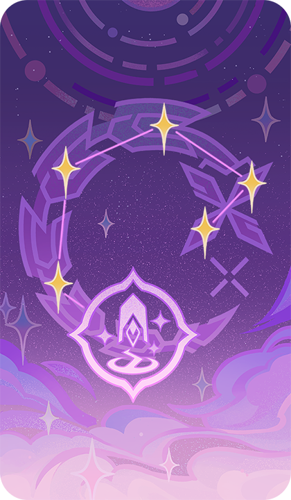
      </th>
      <th style="padding: 0; vertical-align: top;">
        

          

            割舍软弱之心
            

          

          

            
               <strong>久岐忍·割舍软弱之心</strong> 「祈雷祓除！」
               

                <strong>技能类型 ：</strong>装备牌
            
          

        

      </th>
    </tr>
  </thead>
</table>

## 圣骸毒蝎

### 亡骸遗毒·圣骸毒蝎

<table class="table-weapon">
  <thead>
    <tr>
      <th class="th-weapon-1" rowspan="1">
        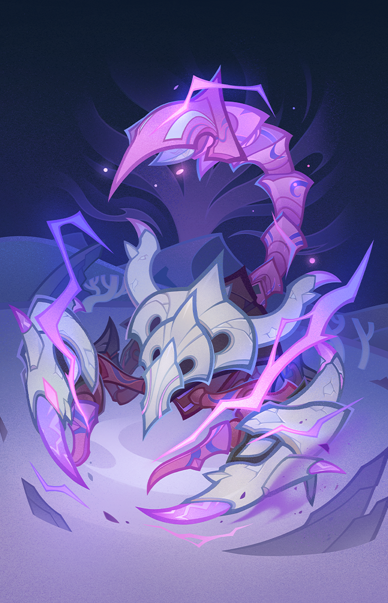
      </th>
      <th style="padding: 0; vertical-align: top;">
        

          

            亡骸遗毒·圣骸毒蝎
            

          

          

            
              <strong>亡骸遗毒·圣骸毒蝎</strong> 因为啃噬伟大的生命体，而扭曲异变的毒蝎，操纵着险恶的轰雷。
            
          

        

      </th>
    </tr>
  </thead>
</table>

### 亡雷凝蓄

<table class="table-weapon">
  <thead>
    <tr>
      <th class="th-weapon-1" rowspan="1">
        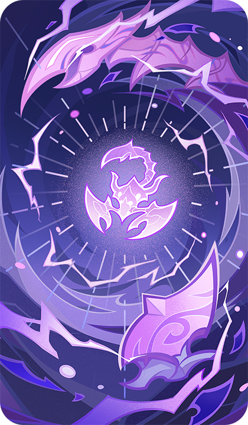
      </th>
      <th style="padding: 0; vertical-align: top;">
        

          

            亡雷凝蓄
            

          

          

            
               <strong>圣骸毒蝎·亡雷凝蓄</strong> 生物有其进化之法则，而圣骸兽的法则则是拥有足够的运气，能在同族之前发现在遥远过去就已亡殁的强大生灵遗骸。
               

                <strong>技能类型 ：</strong>装备牌
            
          

        

      </th>
    </tr>
  </thead>
</table>

## 梦见月瑞希

### 绮梦缱绻·梦见月瑞希

<table class="table-weapon">
  <thead>
    <tr>
      <th class="th-weapon-1" rowspan="1">
        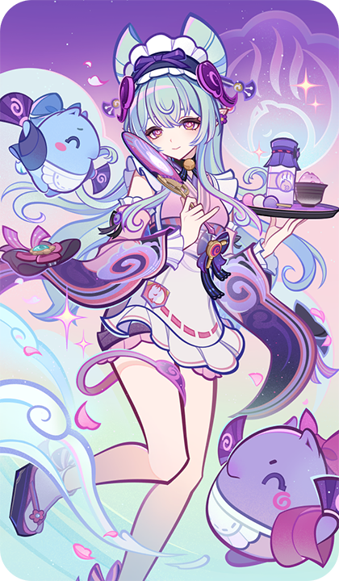
      </th>
      <th style="padding: 0; vertical-align: top;">
        

          

            绮梦缱绻·梦见月瑞希
            

          

          

            
              <strong>绮梦缱绻·梦见月瑞希</strong> 愁云拂散，梦间月明。
            
          

        

      </th>
    </tr>
  </thead>
</table>

### 小貘

<table class="table-weapon">
  <thead>
    <tr>
      <th class="th-weapon-1" rowspan="1">
        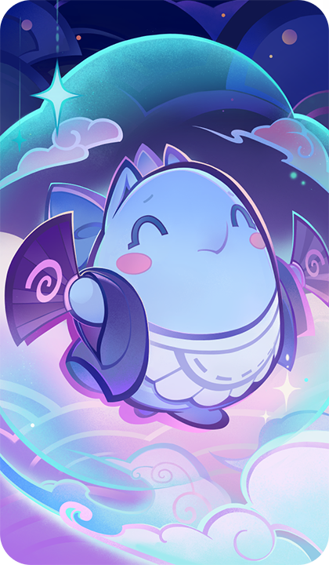
      </th>
      <th style="padding: 0; vertical-align: top;">
        

          

            小貘
            

          

          

            
              <strong>技能类型 ：</strong>召唤物
            
          

        

      </th>
    </tr>
  </thead>
</table>

### 缠忆君影梦相见

<table class="table-weapon">
  <thead>
    <tr>
      <th class="th-weapon-1" rowspan="1">
        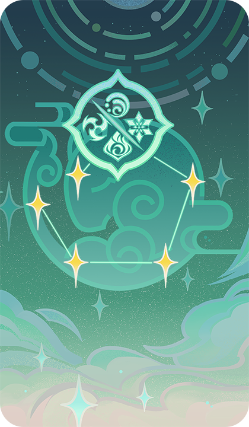
      </th>
      <th style="padding: 0; vertical-align: top;">
        

          

            缠忆君影梦相见
            

          

          

            
               <strong>梦见月瑞希·缠忆君影梦相见</strong> 「…晓时枕貘醒春风。」
               

                <strong>技能类型 ：</strong>装备牌
            
          

        

      </th>
    </tr>
  </thead>
</table>

### 梦见风名物点心

<table class="table-weapon">
  <thead>
    <tr>
      <th class="th-weapon-1" rowspan="1">
        
      </th>
      <th style="padding: 0; vertical-align: top;">
        

          

            梦见风名物点心
            

          

          

            
              <strong>技能类型 ：</strong>事件牌
            
          

        

      </th>
    </tr>
  </thead>
</table>

