# 行动牌

## 元素共鸣：交织之雷

<table class="table-weapon">
  <thead>
    <tr>
      <th class="th-weapon-1" rowspan="1">
        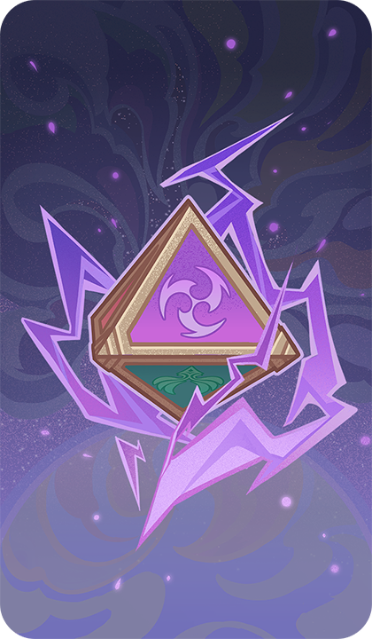
      </th>
      <th style="padding: 0; vertical-align: top;">
        

          

            元素共鸣：交织之雷
            

          

          

            
               <strong>元素共鸣：交织之雷</strong> 雷光所至，永恒之土。 
               

                <strong>类型 ：</strong>事件牌 
                <strong>标签 ：</strong>元素共鸣
            
          

        

      </th>
    </tr>
  </thead>
</table>

## 元素共鸣：强能之雷

<table class="table-weapon">
  <thead>
    <tr>
      <th class="th-weapon-1" rowspan="1">
        
      </th>
      <th style="padding: 0; vertical-align: top;">
        

          

            元素共鸣：强能之雷
            

          

          

            
               <strong>元素共鸣：强能之雷</strong> 雷霆迅起，威重万钧。 
               

                <strong>类型 ：</strong>事件牌 
                <strong>标签 ：</strong>元素共鸣
            
          

        

      </th>
    </tr>
  </thead>
</table>

## 唤雷的头冠

<table class="table-weapon">
  <thead>
    <tr>
      <th class="th-weapon-1" rowspan="1">
        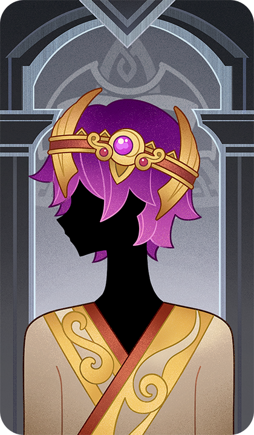
      </th>
      <th style="padding: 0; vertical-align: top;">
        

          

            唤雷的头冠
            

          

          

            
               <strong>紫电骤雨·唤雷的头冠</strong> 「直至清澈的歌声穿透低鸣的雷雨、撕裂空中的阴霭，将小小的光传给那高天的鸟儿。」 
               

                <strong>类型 ：</strong>装备牌 
                <strong>标签 ：</strong>圣遗物
            
          

        

      </th>
    </tr>
  </thead>
</table>

## 如雷的盛怒

<table class="table-weapon">
  <thead>
    <tr>
      <th class="th-weapon-1" rowspan="1">
        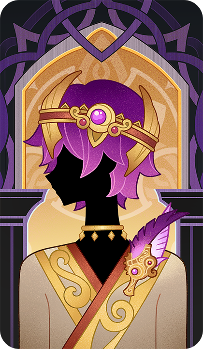
      </th>
      <th style="padding: 0; vertical-align: top;">
        

          

            如雷的盛怒
            

          

          

            
               <strong>霆天片羽·如雷的盛怒</strong> 「当你同雷雨再来时，我唱别的歌给你听。」 
               

                <strong>类型 ：</strong>装备牌 
                <strong>标签 ：</strong>圣遗物
            
          

        

      </th>
    </tr>
  </thead>
</table>

## 无常之面

<table class="table-weapon">
  <thead>
    <tr>
      <th class="th-weapon-1" rowspan="1">
        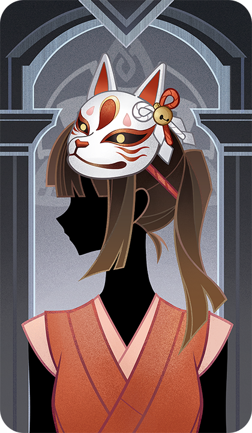
      </th>
      <th style="padding: 0; vertical-align: top;">
        

          

            无常之面
            

          

          

            
               <strong>思记隽永·无常之面</strong> …即使浅笑也掩饰不住悲伤的神情， 明明是祭典的日子，却仿佛即将告别一样… 
               

                <strong>类型 ：</strong>装备牌 
                <strong>标签 ：</strong>圣遗物
            
          

        

      </th>
    </tr>
  </thead>
</table>

## 追忆之注连

<table class="table-weapon">
  <thead>
    <tr>
      <th class="th-weapon-1" rowspan="1">
        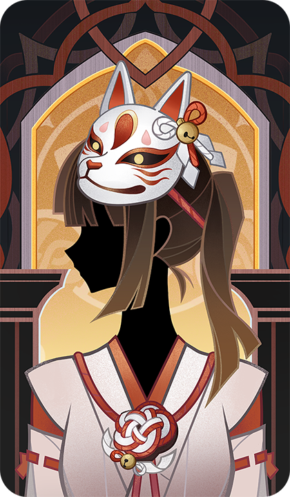
      </th>
      <th style="padding: 0; vertical-align: top;">
        

          

            追忆之注连
            

          

          

            
               <strong>万彩瞬灭·追忆之注连</strong> 「…世界之理本就无常，痴恋瞬灭之物，将遗失隽永的记忆，」 「失去记忆之人，无异于失去生命，是乃永恒黑暗的死亡…」 
               

                <strong>类型 ：</strong>装备牌 
                <strong>标签 ：</strong>圣遗物
            
          

        

      </th>
    </tr>
  </thead>
</table>

## 海祇之冠

<table class="table-weapon">
  <thead>
    <tr>
      <th class="th-weapon-1" rowspan="1">
        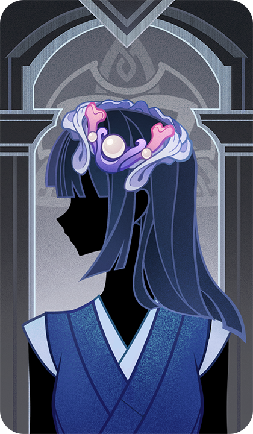
      </th>
      <th style="padding: 0; vertical-align: top;">
        

          

            海祇之冠
            

          

          

            
               <strong>真珠冠冕·海祇之冠</strong> 「海民的传唱中，真珠与珊瑚制成的华冠永远不会沾染污秽。」 
               

                <strong>类型 ：</strong>装备牌 
                <strong>标签 ：</strong>圣遗物
            
          

        

      </th>
    </tr>
  </thead>
</table>

## 海染砗磲

<table class="table-weapon">
  <thead>
    <tr>
      <th class="th-weapon-1" rowspan="1">
        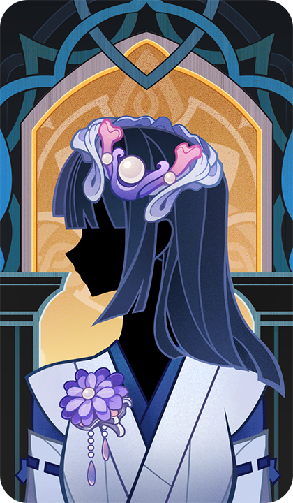
      </th>
      <th style="padding: 0; vertical-align: top;">
        

          

            海染砗磲
            

          

          

            
               <strong>海渊之忆·海染砗磲</strong> 「带着来自海渊的希望与记忆，浸润着失落已久的文明与历史，这些精巧优雅的冠冕，随同其主人一起滑落进入遗忘的裂隙。」 
               

                <strong>类型 ：</strong>装备牌 
                <strong>标签 ：</strong>圣遗物
            
          

        

      </th>
    </tr>
  </thead>
</table>

## 华饰之兜

<table class="table-weapon">
  <thead>
    <tr>
      <th class="th-weapon-1" rowspan="1">
        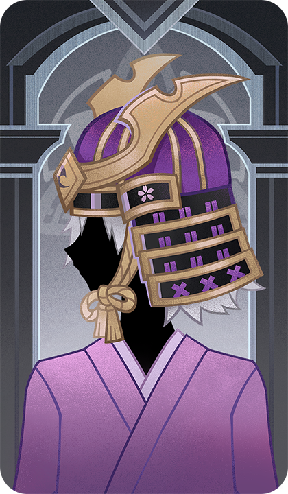
      </th>
      <th style="padding: 0; vertical-align: top;">
        

          

            华饰之兜
            

          

          

            
               <strong>往岁霆光·华饰之兜</strong> 「浮生若梦十三年，影峠绯雪翩跹烟，再顾君已远。」 
               

                <strong>类型 ：</strong>装备牌 
                <strong>标签 ：</strong>圣遗物
            
          

        

      </th>
    </tr>
  </thead>
</table>

## 绝缘之旗印

<table class="table-weapon">
  <thead>
    <tr>
      <th class="th-weapon-1" rowspan="1">
        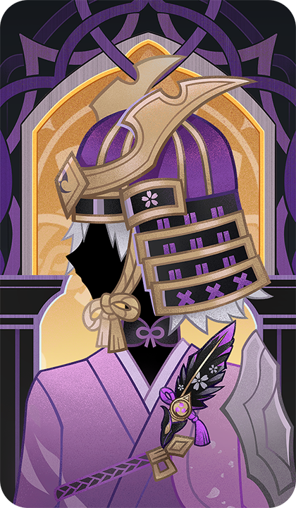
      </th>
      <th style="padding: 0; vertical-align: top;">
        

          

            绝缘之旗印
            

          

          

            
               <strong>绝缘之旗印·华饰之兜</strong> 浮生若梦十三年， 影峠绯雪翩跹烟， 再顾君已远。 
               

                <strong>类型 ：</strong>装备牌 
                <strong>标签 ：</strong>圣遗物
            
          

        

      </th>
    </tr>
  </thead>
</table>

## 愚人众的阴谋

<table class="table-weapon">
  <thead>
    <tr>
      <th class="th-weapon-1" rowspan="1">
        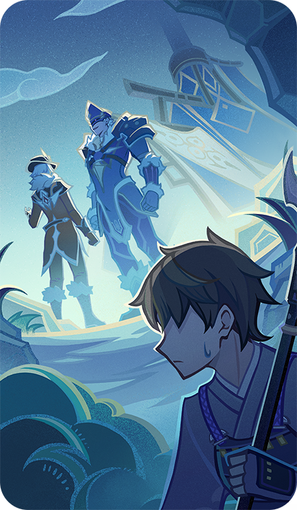
      </th>
      <th style="padding: 0; vertical-align: top;">
        

          

            愚人众的阴谋
            

          

          

            
               <strong>冬日密谋</strong> …但谁也不知道他们究竟在密谋些什么。 
               

                <strong>类型 ：</strong>事件牌
            
          

        

      </th>
    </tr>
  </thead>
</table>

## 神宝迁宫祝词

<table class="table-weapon">
  <thead>
    <tr>
      <th class="th-weapon-1" rowspan="1">
        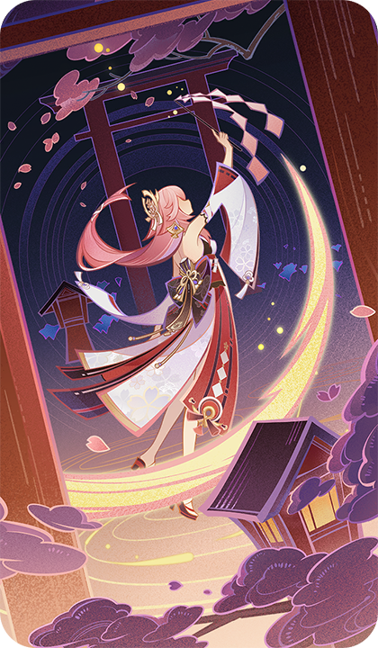
      </th>
      <th style="padding: 0; vertical-align: top;">
        

          

            神宝迁宫祝词
            

          

          

            
               <strong>神宝迁宫</strong> 「呵呵…这下总该变得有意思起来了吧？」 
               

                <strong>类型 ：</strong>事件牌
            
          

        

      </th>
    </tr>
  </thead>
</table>

## 雷与永恒

<table class="table-weapon">
  <thead>
    <tr>
      <th class="th-weapon-1" rowspan="1">
        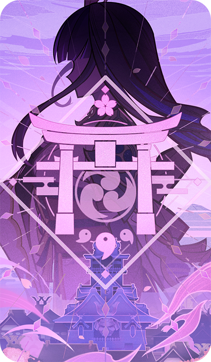
      </th>
      <th style="padding: 0; vertical-align: top;">
        

          

            雷与永恒
            

          

          

            
               <strong>浮世众生之梦</strong> 「此身曾许诺予臣民一梦，即是千世万代不变不移的『永恒』。」 
               

                <strong>类型 ：</strong>事件牌
            
          

        

      </th>
    </tr>
  </thead>
</table>

## 旧日鏖战

<table class="table-weapon">
  <thead>
    <tr>
      <th class="th-weapon-1" rowspan="1">
        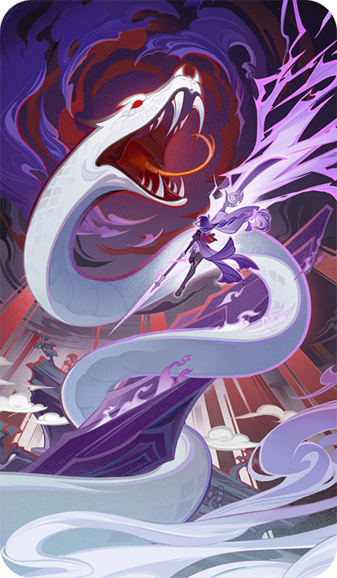
      </th>
      <th style="padding: 0; vertical-align: top;">
        

          

            旧日鏖战
            

          

          

            
               <strong>旧日鏖战</strong> 海祇岛民信仰的魔神，曾与鸣神的主尊鏖战… 八酝岛上漫长的「无想刃狭间」，便是那一战残存的瘢痕… 
               

                <strong>类型 ：</strong>事件牌 
                <strong>标签 ：</strong>秘传
            
          

        

      </th>
    </tr>
  </thead>
</table>

## 旧时庭园

<table class="table-weapon">
  <thead>
    <tr>
      <th class="th-weapon-1" rowspan="1">
        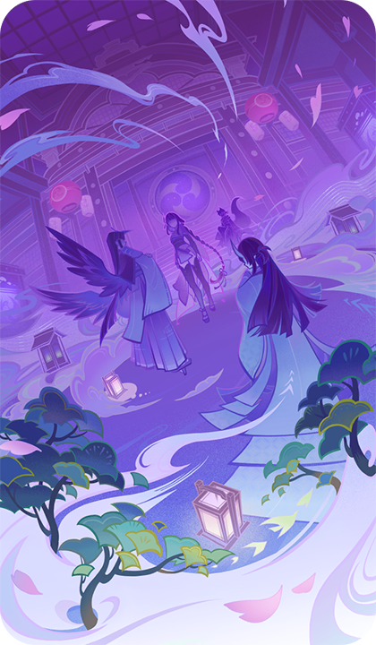
      </th>
      <th style="padding: 0; vertical-align: top;">
        

          

            旧时庭园
            

          

          

            
               <strong>旧时庭园</strong> 「空蝉幽世此浮生，岂非渺然梦寤时。」 
               

                <strong>类型 ：</strong>事件牌 
                <strong>标签 ：</strong>秘传
            
          

        

      </th>
    </tr>
  </thead>
</table>

## 留念镜

<table class="table-weapon">
  <thead>
    <tr>
      <th class="th-weapon-1" rowspan="1">
        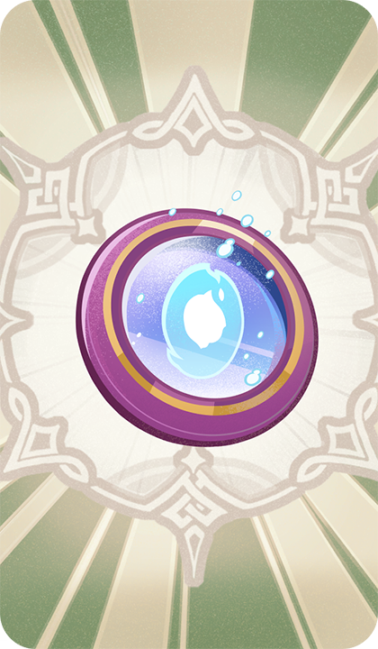
      </th>
      <th style="padding: 0; vertical-align: top;">
        

          

            留念镜
            

          

          

            
               <strong>留念镜</strong> 据说在很久以前，传说中的「狐斋宫大人」曾经将一件法器作为退邪之物赠与彼时柊家家主弘嗣。 柊以其为透镜部件的材料，后来从异国定做了特殊的「留影机」，并将其作为情谊的象征，回赠鸣神大社。 
               

                <strong>类型 ：</strong>支援牌 
                <strong>标签 ：</strong>道具
            
          

        

      </th>
    </tr>
  </thead>
</table>

## 红羽团扇

<table class="table-weapon">
  <thead>
    <tr>
      <th class="th-weapon-1" rowspan="1">
        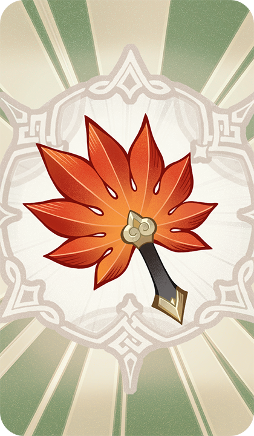
      </th>
      <th style="padding: 0; vertical-align: top;">
        

          

            红羽团扇
            

          

          

            
               <strong>莫名风来·红羽团扇</strong> 据说在天狗手中，这把团扇可以发挥各种各样的力量。 在一般人手中，它只有着「让身体稍微变得轻盈一点」程度的能力。 但即使是这种程度的能力，也足够一般人运用了。 
               

                <strong>类型 ：</strong>支援牌 
                <strong>标签 ：</strong>道具
            
          

        

      </th>
    </tr>
  </thead>
</table>

## 太郎丸

<table class="table-weapon">
  <thead>
    <tr>
      <th class="th-weapon-1" rowspan="1">
        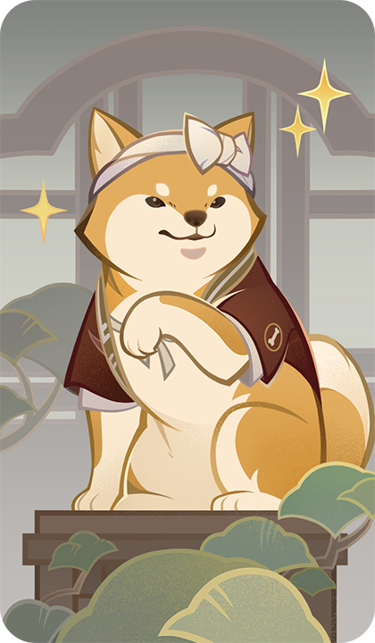
      </th>
      <th style="padding: 0; vertical-align: top;">
        

          

            太郎丸
            

          

          

            
               <strong>太郎丸</strong> 木漏茶室的老板，传说所有的店员都和它签订了「契约」… 鲜有人知的是，当年在「终末番」，太郎丸常伴强大的忍者左右，为社奉行尽力行事… 
               

                <strong>类型 ：</strong>支援牌 
                <strong>标签 ：</strong>伙伴
            
          

        

      </th>
    </tr>
  </thead>
</table>

## 花散里

<table class="table-weapon">
  <thead>
    <tr>
      <th class="th-weapon-1" rowspan="1">
        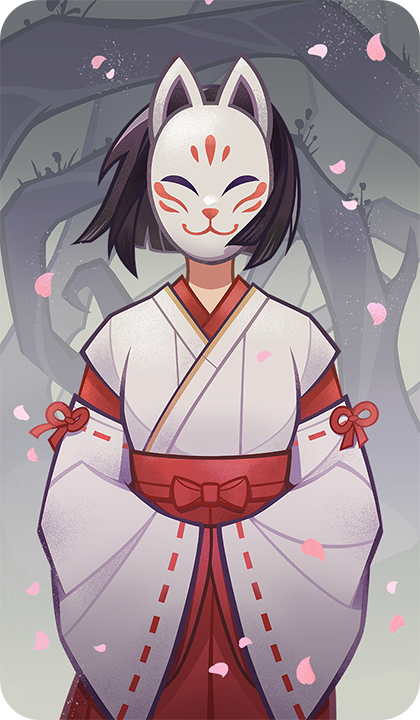
      </th>
      <th style="padding: 0; vertical-align: top;">
        

          

            花散里
            

          

          

            
               <strong>萦殃祓却·花散里</strong> 「与君相别离，不知何日是归期，我如朝露转瞬晞。」 
               

                <strong>类型 ：</strong>支援牌 
                <strong>标签 ：</strong>伙伴
            
          

        

      </th>
    </tr>
  </thead>
</table>

## 天守阁

<table class="table-weapon">
  <thead>
    <tr>
      <th class="th-weapon-1" rowspan="1">
        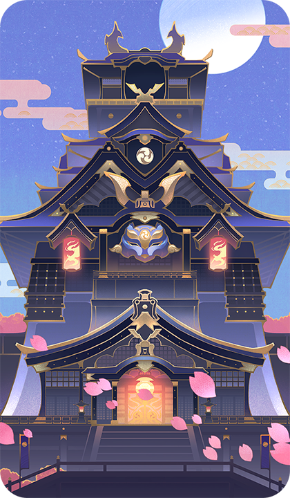
      </th>
      <th style="padding: 0; vertical-align: top;">
        

          

            天守阁
            

          

          

            
               <strong>千手百眼·天下人间</strong> 「仅由此身，为这天下人间代行永恒。」 
               

                <strong>类型 ：</strong>支援牌 
                <strong>标签 ：</strong>场地
            
          

        

      </th>
    </tr>
  </thead>
</table>

## 鸣神大社

<table class="table-weapon">
  <thead>
    <tr>
      <th class="th-weapon-1" rowspan="1">
        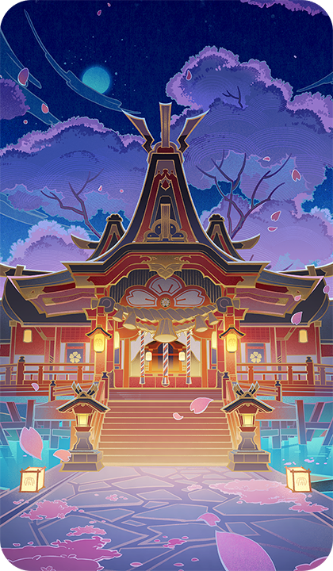
      </th>
      <th style="padding: 0; vertical-align: top;">
        

          

            鸣神大社
            

          

          

            
               <strong>遐世的绯染之梦</strong> 「影向山樱常盛，一如鸣神永恒。」 
               

                <strong>类型 ：</strong>支援牌 
                <strong>标签 ：</strong>场地
            
          

        

      </th>
    </tr>
  </thead>
</table>

## 珊瑚宫

<table class="table-weapon">
  <thead>
    <tr>
      <th class="th-weapon-1" rowspan="1">
        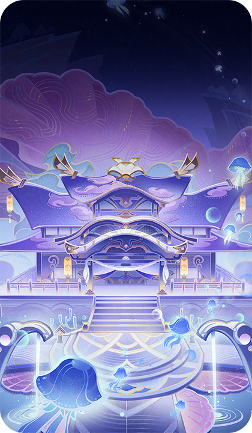
      </th>
      <th style="padding: 0; vertical-align: top;">
        

          

            珊瑚宫
            

          

          

            
               <strong>珠光弥布的宫阙</strong> 「珊瑚宫者，初为海渊，后有大蛇渡来，盘桓而升涡流，塑珊瑚而成岛。」 
               

                <strong>类型 ：</strong>支援牌 
                <strong>标签 ：</strong>场地
            
          

        

      </th>
    </tr>
  </thead>
</table>

## 镇守之森

<table class="table-weapon">
  <thead>
    <tr>
      <th class="th-weapon-1" rowspan="1">
        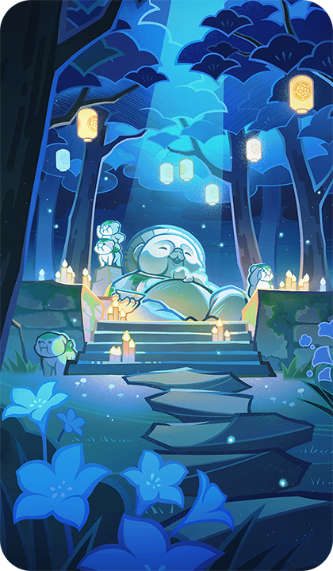
      </th>
      <th style="padding: 0; vertical-align: top;">
        

          

            镇守之森
            

          

          

            
               <strong>妖迹隐匿之处</strong> 传说，这片神林曾是诸多妖怪栖身之所。 
               

                <strong>类型 ：</strong>支援牌 
                <strong>标签 ：</strong>场地
            
          

        

      </th>
    </tr>
  </thead>
</table>

## 清籁岛

<table class="table-weapon">
  <thead>
    <tr>
      <th class="th-weapon-1" rowspan="1">
        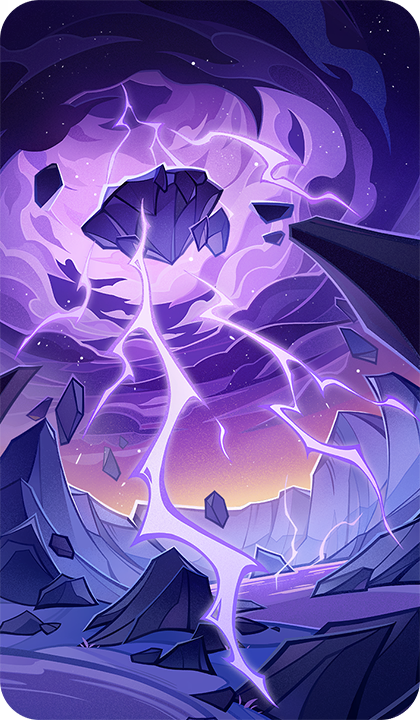
      </th>
      <th style="padding: 0; vertical-align: top;">
        

          

            清籁岛
            

          

          

            
               <strong>清籁岛</strong> 「海天变色的大战已成为渐被遗忘的过去，应唤而来的悠远雷暴依然在此驻留。」 
               

                <strong>类型 ：</strong>支援牌 
                <strong>标签 ：</strong>场地 
                <strong>效果描述 ：</strong> 任意阵营的角色受到治疗后：使该角色附属悠远雷暴。
            
          

        

      </th>
    </tr>
  </thead>
</table>

## 薙草之稻光

<table class="table-weapon">
  <thead>
    <tr>
      <th class="th-weapon-1" rowspan="1">
        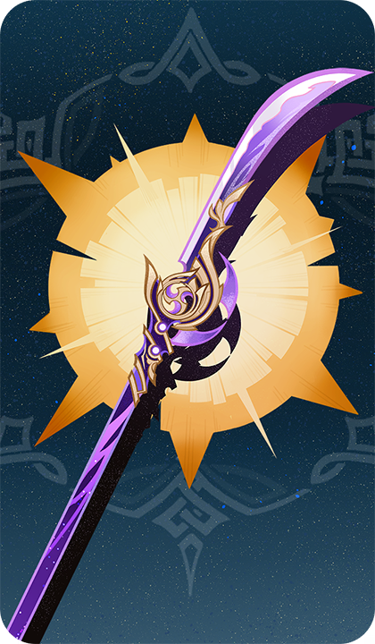
      </th>
      <th style="padding: 0; vertical-align: top;">
        

          

            薙草之稻光
            

          

          

            
               <strong>非时之梦·薙草之稻光</strong> 所谓薙刀，乃是斩除芜杂之利器。 秉薙刀之人，意在守护恒常之道。 
               

                <strong>类型 ：</strong>装备牌 
                <strong>标签 ：</strong>武器 
                <strong>效果描述 ：</strong> 角色造成的伤害+1。 
每回合自动触发1次：如果所附属角色没有充能，就使其获得1点充能。 
（「长柄武器」角色才能装备。角色最多装备1件「武器」）
            
          

        

      </th>
    </tr>
  </thead>
</table>

## 不灭月华

<table class="table-weapon">
  <thead>
    <tr>
      <th class="th-weapon-1" rowspan="1">
        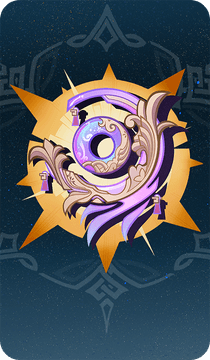
      </th>
      <th style="padding: 0; vertical-align: top;">
        

          

            不灭月华
            

          

          

            
               <strong>真珠海波·不灭月华</strong> 「即使雷云日渐集聚，紫电之威凶险难测， 海祇的月华也将透过云霭，播撒皓光吧。」 
               

                <strong>类型 ：</strong>装备牌 
                <strong>标签 ：</strong>武器
            
          

        

      </th>
    </tr>
  </thead>
</table>

## 黄油蟹蟹

<table class="table-weapon">
  <thead>
    <tr>
      <th class="th-weapon-1" rowspan="1">
        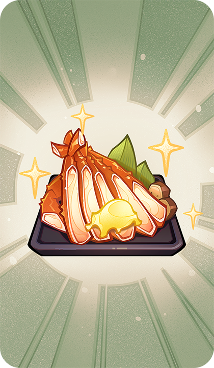
      </th>
      <th style="padding: 0; vertical-align: top;">
        

          

            黄油蟹蟹
            

          

          

            
               <strong>黄油蟹蟹</strong> 黄油浸润的蟹腿带着馥郁的香气，席卷味蕾，叫人无法抵抗这般鲜香的诱惑。 
「再来一份谢谢！」 
               

                <strong>类型 ：</strong>事件牌 
                <strong>标签 ：</strong>料理
            
          

        

      </th>
    </tr>
  </thead>
</table>

