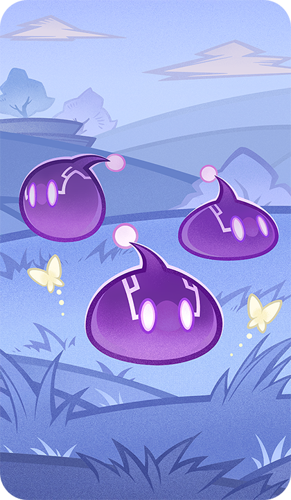
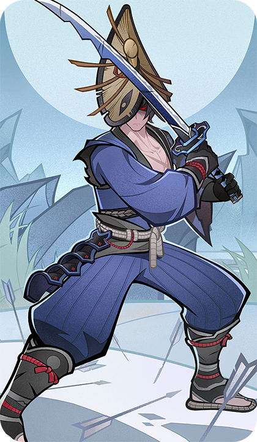
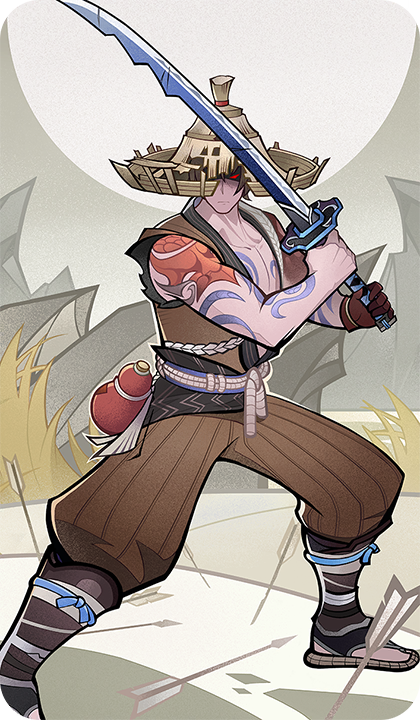
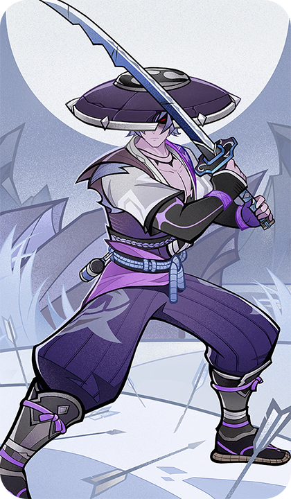
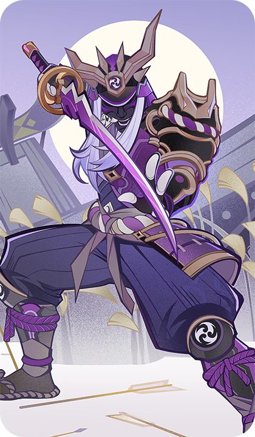
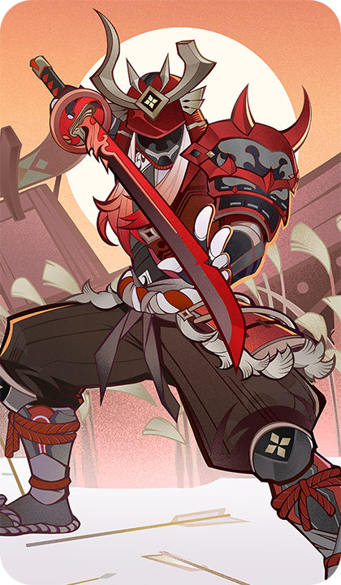

# 魔物牌

## 雷史莱姆

<table class="table-weapon">
  <thead>
    <tr>
      <th class="th-weapon-1" rowspan="1">
        
      </th>
      <th style="padding: 0; vertical-align: top;">
        

          

            雷史莱姆
          

          

          

            
            <strong>天赋 ：</strong> 
              <strong>名称 ：弹跳</strong> 技能类型：普通攻击 
              <strong>名称 ：重重下落</strong> 技能类型：元素爆发 
              <strong>名称 ：元素沉积·雷</strong> 技能类型：被动技能
            
          

        

      </th>
    </tr>
  </thead>
</table>

## 野伏·阵刀番

<table class="table-weapon">
  <thead>
    <tr>
      <th class="th-weapon-1" rowspan="1">
        
      </th>
      <th style="padding: 0; vertical-align: top;">
        

          

            野伏·阵刀番
          

          

          

            
            <strong>天赋 ：</strong> 
              <strong>名称 ：连续斩</strong> 技能类型：普通攻击 
              <strong>名称 ：跳劈弹</strong> 技能类型：元素战技 
              <strong>名称 ：居合·纳刀</strong> 技能类型：元素爆发 
              <strong>名称 ：残心</strong> 技能类型：被动技能
            
          

        

      </th>
    </tr>
  </thead>
</table>

## 野伏·火付番

<table class="table-weapon">
  <thead>
    <tr>
      <th class="th-weapon-1" rowspan="1">
        
      </th>
      <th style="padding: 0; vertical-align: top;">
        

          

            野伏·火付番
          

          

          

            
            <strong>天赋 ：</strong> 
              <strong>名称 ：连续斩</strong> 技能类型：普通攻击 
              <strong>名称 ：焰硝花火</strong> 技能类型：元素战技 
              <strong>名称 ：居合·纳刀</strong> 技能类型：元素爆发 
              <strong>名称 ：残心</strong> 技能类型：被动技能
            
          

        

      </th>
    </tr>
  </thead>
</table>

## 野伏·机巧番

<table class="table-weapon">
  <thead>
    <tr>
      <th class="th-weapon-1" rowspan="1">
        
      </th>
      <th style="padding: 0; vertical-align: top;">
        

          

            野伏·机巧番
          

          

          

            
            <strong>天赋 ：</strong> 
              <strong>名称 ：连续斩</strong> 技能类型：普通攻击 
              <strong>名称 ：机工雷弩</strong> 技能类型：元素战技 
              <strong>名称 ：居合·纳刀</strong> 技能类型：元素爆发 
              <strong>名称 ：残心</strong> 技能类型：被动技能
            
          

        

      </th>
    </tr>
  </thead>
</table>

## 海乱鬼·雷腾

<table class="table-weapon">
  <thead>
    <tr>
      <th class="th-weapon-1" rowspan="1">
        
      </th>
      <th style="padding: 0; vertical-align: top;">
        

          

            海乱鬼·雷腾
          

          

          

            
            <strong>天赋 ：</strong> 
              <strong>名称 ：三位切</strong> 技能类型：普通攻击 
              <strong>名称 ：鲤跃斩</strong> 技能类型：元素战技 
              <strong>名称 ：居合·纳刀</strong> 技能类型：元素爆发 
              <strong>名称 ：惟神召符·煌</strong> 技能类型：被动技能 
              <strong>名称 ：绝境狂乱</strong> 技能类型：被动技能
            
          

        

      </th>
    </tr>
  </thead>
</table>

## 海乱鬼·炎威

<table class="table-weapon">
  <thead>
    <tr>
      <th class="th-weapon-1" rowspan="1">
        
      </th>
      <th style="padding: 0; vertical-align: top;">
        

          

            海乱鬼·炎威
          

          

          

            
            <strong>天赋 ：</strong> 
              <strong>名称 ：三位切</strong> 技能类型：普通攻击 
              <strong>名称 ：鲤跃斩</strong> 技能类型：元素战技 
              <strong>名称 ：居合·纳刀</strong> 技能类型：元素爆发 
              <strong>名称 ：惟神召符·炎</strong> 技能类型：被动技能 
              <strong>名称 ：绝境狂乱</strong> 技能类型：被动技能
            
          

        

      </th>
    </tr>
  </thead>
</table>

