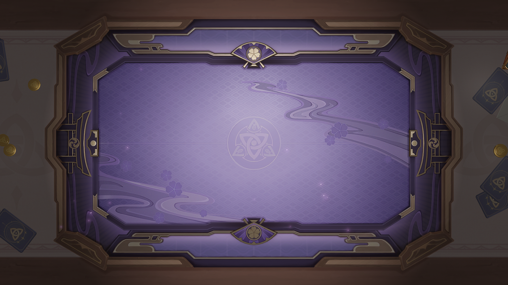
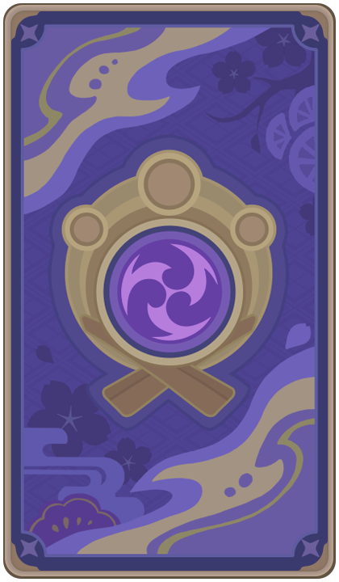

# 牌盒及牌背

## 牌盒

### 稻妻

<table class="table-study">
    <thead>
        <tr>
            
        </tr>
    </thead>
    <tbody>
            <tr>
                <td style="text-align: center">紫电须臾逝，鸣神独彷徨。 痴梦逢又别，世事皆无常。</td>
            </tr>
    </tbody>
</table>

## 牌背

### 稻妻

<table class="table-weapon">
  <thead>
    <tr>
      <th class="th-weapon-1" rowspan="1">
        
      </th>
      <th style="padding: 0; vertical-align: top;">
        

          

            牌背-稻妻
            

          

          

            
              出牌应在电光火石之间，只要出牌够快，就能决胜须臾。
            
          

        

      </th>
    </tr>
  </thead>
</table>

